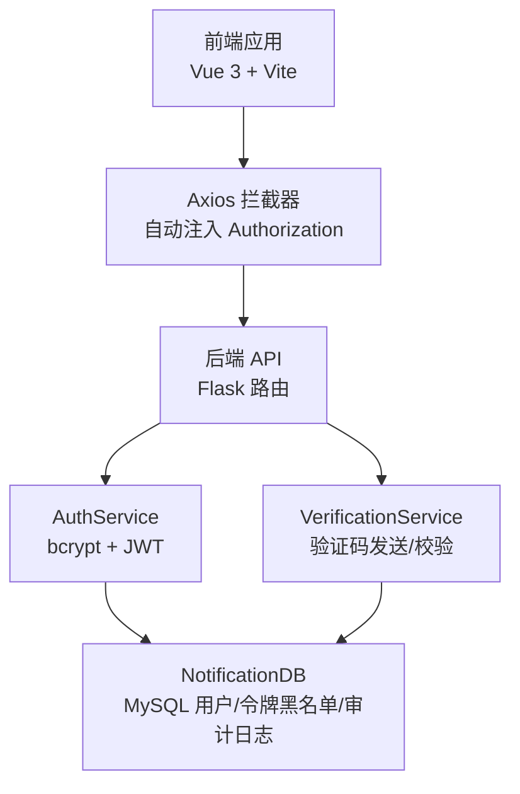
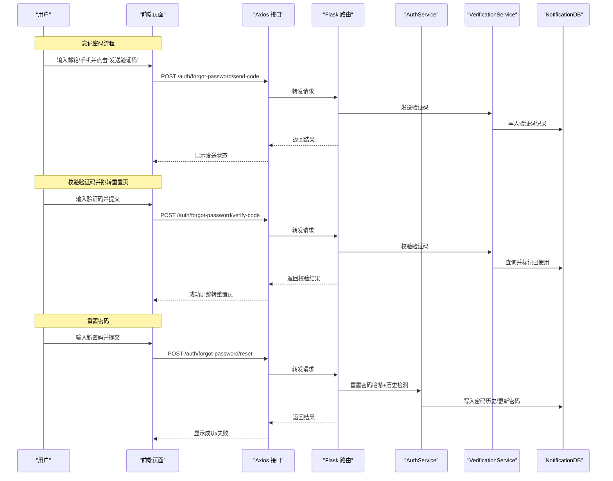
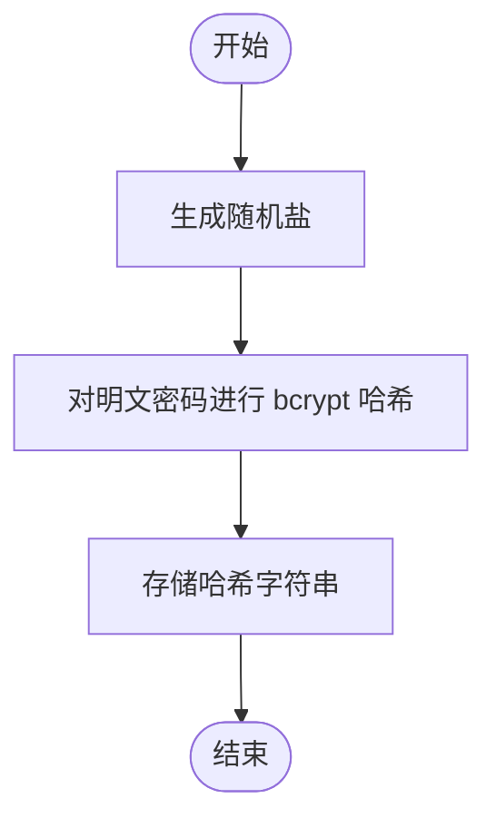
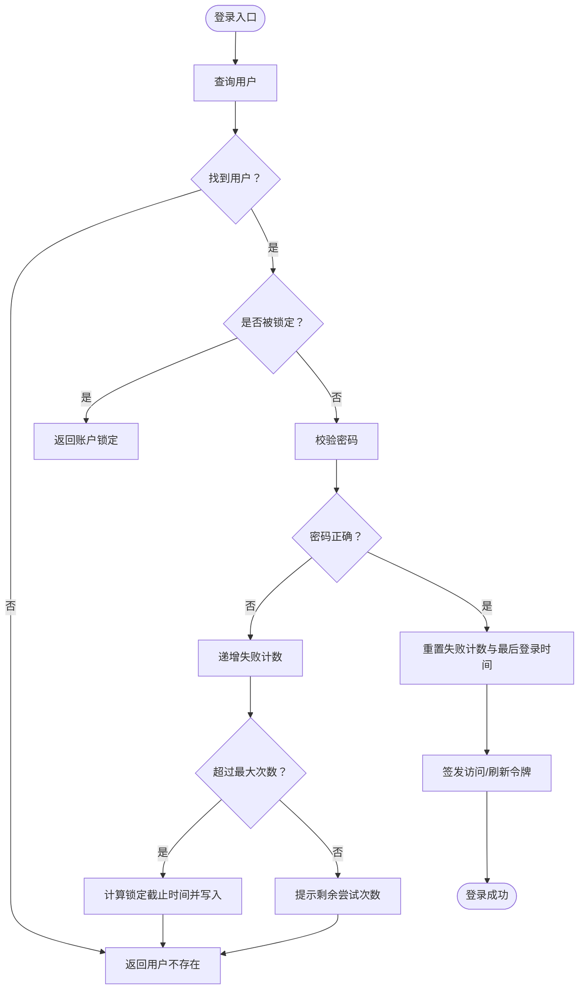
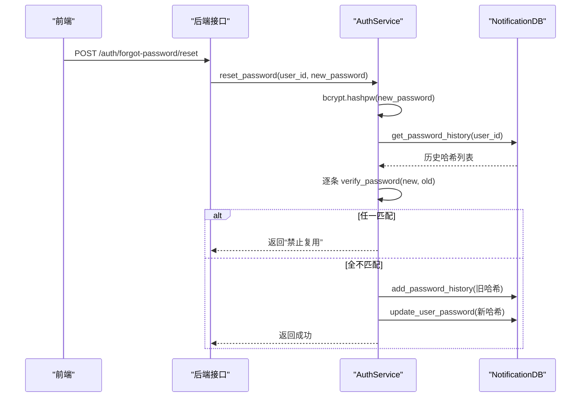
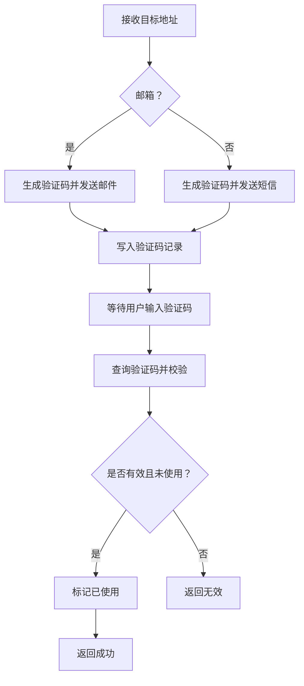
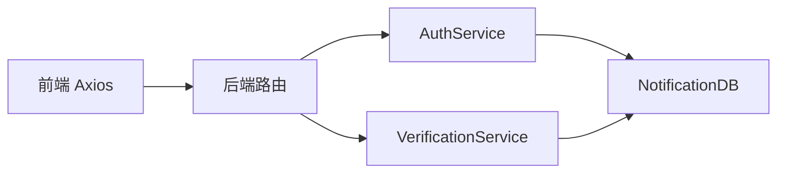

# 密码安全

<cite>
**本文引用的文件**
- [auth_service.py](file://python/src/auth_service.py)
- [notification_db.py](file://python/src/notification_db.py)
- [verification_service.py](file://python/src/notifications/verification_service.py)
- [ForgotPassword.vue](file://python-web/src/views/ForgotPassword.vue)
- [ResetPassword.vue](file://python-web/src/views/ResetPassword.vue)
- [index.js](file://python-web/src/api/index.js)
- [auth.js](file://python-web/src/stores/auth.js)
- [app.py](file://python/app.py)
- [auth_server.py](file://python/auth_server.py)
</cite>

## 目录
1. [简介](#简介)
2. [项目结构](#项目结构)
3. [核心组件](#核心组件)
4. [架构总览](#架构总览)
5. [详细组件分析](#详细组件分析)
6. [依赖分析](#依赖分析)
7. [性能考量](#性能考量)
8. [故障排查指南](#故障排查指南)
9. [结论](#结论)
10. [附录](#附录)

## 简介
本文件面向开发者，系统化阐述本项目的密码安全机制与实现细节，包括：
- 密码哈希算法选择与 bcrypt 实现
- 盐值生成策略
- 密码历史记录管理与重复密码检测
- 密码强度验证（前端评分与后端校验）
- 密码重置流程与验证码机制
- 安全传输与存储要求
- 最佳实践、配置示例与合规性建议

## 项目结构
项目采用前后端分离架构：
- 后端：Flask 应用提供认证与业务接口，使用 bcrypt 进行密码哈希，JWT 作为访问令牌，MySQL 存储用户、验证码、令牌黑名单与审计日志等。
- 前端：Vue 3 + Vite 应用，通过 Axios 统一发起请求，拦截器自动注入 Bearer Token，并在 401 时尝试刷新令牌。

图表来源
- [index.js:1-95](file://python-web/src/api/index.js#L1-L95)
- [app.py:1-200](file://python/app.py#L1-L200)
- [auth_service.py:1-187](file://python/src/auth_service.py#L1-L187)
- [notification_db.py:1-357](file://python/src/notification_db.py#L1-L357)
- [verification_service.py:1-107](file://python/src/notifications/verification_service.py#L1-L107)

章节来源
- [app.py:1-200](file://python/app.py#L1-L200)
- [index.js:1-95](file://python-web/src/api/index.js#L1-L95)

## 核心组件
- 密码哈希与校验：使用 bcrypt 生成盐值并进行哈希，校验时直接比对明文与已有哈希。
- 访问令牌与刷新：基于 HS256 的 JWT，支持访问令牌与刷新令牌，配合黑名单机制实现主动作废。
- 登录安全：失败次数限制与临时锁定，防止暴力破解。
- 密码历史与重复检测：重置密码前检查近期使用过的哈希，避免循环复用。
- 验证码流程：邮箱/短信验证码发送与校验，限定有效期与使用状态。
- 前端密码强度提示：基于正则评分，同时后端强制长度与一致性校验。

章节来源
- [auth_service.py:1-187](file://python/src/auth_service.py#L1-L187)
- [notification_db.py:1-357](file://python/src/notification_db.py#L1-L357)
- [verification_service.py:1-107](file://python/src/notifications/verification_service.py#L1-L107)
- [ForgotPassword.vue:1-192](file://python-web/src/views/ForgotPassword.vue#L1-L192)
- [ResetPassword.vue:1-218](file://python-web/src/views/ResetPassword.vue#L1-L218)

## 架构总览
下图展示从用户操作到后端处理与数据持久化的整体流程。

图表来源
- [ForgotPassword.vue:130-191](file://python-web/src/views/ForgotPassword.vue#L130-L191)
- [ResetPassword.vue:184-205](file://python-web/src/views/ResetPassword.vue#L184-L205)
- [index.js:74-82](file://python-web/src/api/index.js#L74-L82)
- [app.py:170-234](file://python/app.py#L170-L234)
- [auth_server.py:249-290](file://python/auth_server.py#L249-L290)
- [auth_service.py:138-156](file://python/src/auth_service.py#L138-L156)
- [notification_db.py:313-332](file://python/src/notification_db.py#L313-L332)
- [verification_service.py:83-101](file://python/src/notifications/verification_service.py#L83-L101)

## 详细组件分析

### 密码哈希与盐值生成
- 算法选择：bcrypt，具备自适应成本因子与内置盐值生成，抗彩虹表与侧信道攻击。
- 盐值策略：使用 bcrypt.gensalt() 自动生成随机盐，每次哈希均不同，确保相同明文产生不同密文。
- 存储：将哈希字符串存入 users.password_hash 字段，无需单独存储盐。

图表来源
- [auth_service.py:20-25](file://python/src/auth_service.py#L20-L25)

章节来源
- [auth_service.py:20-25](file://python/src/auth_service.py#L20-L25)

### 登录与失败锁定
- 失败计数：登录失败时递增 users.login_attempts，超过阈值则按时间锁定期锁定账户。
- 锁定判断：若 locked_until 未来时间大于当前时间，则拒绝登录。
- 成功登录：重置失败计数与 last_login_at，并签发访问/刷新令牌。

图表来源
- [auth_service.py:76-118](file://python/src/auth_service.py#L76-L118)
- [notification_db.py:261-295](file://python/src/notification_db.py#L261-L295)

章节来源
- [auth_service.py:67-118](file://python/src/auth_service.py#L67-L118)
- [notification_db.py:261-295](file://python/src/notification_db.py#L261-L295)

### 密码历史记录与重复检测
- 重置流程：先对新密码进行 bcrypt 哈希；再读取用户最近 N 条历史哈希，逐条比对以禁止复用。
- 历史写入：若用户原密码存在，将旧哈希写入 password_history 表。
- 存储字段：password_history.password_hash 保存历史哈希字符串。

图表来源
- [auth_service.py:138-156](file://python/src/auth_service.py#L138-L156)
- [notification_db.py:313-332](file://python/src/notification_db.py#L313-L332)

章节来源
- [auth_service.py:138-156](file://python/src/auth_service.py#L138-L156)
- [notification_db.py:313-332](file://python/src/notification_db.py#L313-L332)

### 验证码发送与校验
- 发送：根据目标地址类型（邮箱/短信）生成 6 位数字验证码，写入 verification_codes 并调用对应发送器。
- 校验：查询未使用且未过期的验证码，命中后标记已使用。
- 过期控制：CODE_EXPIRE_MINUTES 控制有效期，过期即不可用。

图表来源
- [verification_service.py:22-101](file://python/src/notifications/verification_service.py#L22-L101)
- [notification_db.py:147-188](file://python/src/notification_db.py#L147-L188)

章节来源
- [verification_service.py:1-107](file://python/src/notifications/verification_service.py#L1-L107)
- [notification_db.py:147-188](file://python/src/notification_db.py#L147-L188)

### 前端密码强度与一致性校验
- 强度评分：基于长度、大写字母、数字、特殊字符的组合进行评分，前端实时反馈。
- 一致性校验：确认新密码必须与新密码一致。
- 后端强制：后端仍需校验最小长度与一致性，防止绕过。

章节来源
- [ForgotPassword.vue:104-128](file://python-web/src/views/ForgotPassword.vue#L104-L128)
- [ResetPassword.vue:143-151](file://python-web/src/views/ResetPassword.vue#L143-L151)
- [app.py:212-225](file://python/app.py#L212-L225)

### 令牌管理与安全传输
- 令牌签发：访问令牌短期有效，刷新令牌长期有效但可被黑名单作废。
- 黑名单机制：登出或异常场景将令牌加入 token_blacklist，后续校验时判定失效。
- 自动刷新：前端拦截器在 401 且非刷新请求时，尝试使用刷新令牌换取新访问令牌。
- 传输安全：Axios 默认 Content-Type 为 application/json；生产环境应启用 HTTPS 并限制 CORS 源。

章节来源
- [auth_service.py:27-65](file://python/src/auth_service.py#L27-L65)
- [notification_db.py:297-311](file://python/src/notification_db.py#L297-L311)
- [index.js:11-59](file://python-web/src/api/index.js#L11-L59)
- [app.py:18-28](file://python/app.py#L18-L28)

## 依赖分析
- 组件耦合
  - AuthService 依赖 NotificationDB 进行用户、令牌黑名单与审计日志操作。
  - VerificationService 依赖 NotificationDB 进行验证码持久化。
  - 前端 Axios 依赖后端路由与令牌刷新接口。
- 外部依赖
  - bcrypt：密码哈希与校验
  - PyMySQL：数据库连接与事务
  - Flask/JWT：后端接口与令牌解析
  - Vue/Axios：前端请求与拦截器

图表来源
- [auth_service.py:1-187](file://python/src/auth_service.py#L1-L187)
- [notification_db.py:1-357](file://python/src/notification_db.py#L1-L357)
- [verification_service.py:1-107](file://python/src/notifications/verification_service.py#L1-L107)
- [index.js:1-95](file://python-web/src/api/index.js#L1-L95)

章节来源
- [auth_service.py:1-187](file://python/src/auth_service.py#L1-L187)
- [notification_db.py:1-357](file://python/src/notification_db.py#L1-L357)
- [verification_service.py:1-107](file://python/src/notifications/verification_service.py#L1-L107)
- [index.js:1-95](file://python-web/src/api/index.js#L1-L95)

## 性能考量
- bcrypt 成本因子：默认由 bcrypt 库管理，哈希时间与 CPU 成本平衡安全与性能；如需调整可在部署层配置 bcrypt 环境参数。
- 数据库索引：users.email/phone/username 唯一索引，verification_codes 上按 user_id/code/target/expires_at 建议建立复合索引以优化验证码查询。
- 缓存策略：频繁登录失败与验证码查询可结合本地缓存（如 Redis）降低数据库压力，注意与黑名单/过期逻辑协同。
- 令牌刷新：前端拦截器自动刷新减少用户感知，但需避免并发刷新风暴，建议在刷新接口增加幂等与去重。

## 故障排查指南
- 登录失败过多被锁定
  - 现象：提示账户锁定或剩余尝试次数。
  - 排查：检查 users.locked_until 是否在未来时间；确认失败计数与锁定时长配置。
  - 参考
    - [auth_service.py:67-97](file://python/src/auth_service.py#L67-L97)
    - [notification_db.py:279-286](file://python/src/notification_db.py#L279-L286)
- 刷新令牌无效或已失效
  - 现象：刷新接口返回令牌无效。
  - 排查：确认令牌类型为 refresh；检查是否在黑名单中；核对签名密钥与算法。
  - 参考
    - [auth_service.py:120-136](file://python/src/auth_service.py#L120-L136)
    - [notification_db.py:307-311](file://python/src/notification_db.py#L307-L311)
- 验证码无效或过期
  - 现象：验证码校验失败。
  - 排查：确认验证码未使用且未过期；检查目标地址与类型匹配。
  - 参考
    - [verification_service.py:83-101](file://python/src/notifications/verification_service.py#L83-L101)
    - [notification_db.py:158-188](file://python/src/notification_db.py#L158-L188)
- 密码重置失败（重复使用）
  - 现象：提示新密码不能与最近使用的密码相同。
  - 排查：确认历史记录数量与比对逻辑；检查哈希存储一致性。
  - 参考
    - [auth_service.py:138-156](file://python/src/auth_service.py#L138-L156)
    - [notification_db.py:313-332](file://python/src/notification_db.py#L313-L332)
- 前端无法携带令牌
  - 现象：401 未授权。
  - 排查：确认本地存储 access_token 是否存在；Axios 请求头是否注入；刷新流程是否成功。
  - 参考
    - [index.js:11-59](file://python-web/src/api/index.js#L11-L59)
    - [auth.js:1-74](file://python-web/src/stores/auth.js#L1-L74)

章节来源
- [auth_service.py:67-156](file://python/src/auth_service.py#L67-L156)
- [notification_db.py:158-332](file://python/src/notification_db.py#L158-L332)
- [verification_service.py:83-101](file://python/src/notifications/verification_service.py#L83-L101)
- [index.js:11-59](file://python-web/src/api/index.js#L11-L59)
- [auth.js:1-74](file://python-web/src/stores/auth.js#L1-L74)

## 结论
本项目在密码安全方面采用了 bcrypt 哈希、JWT 令牌、验证码流程与密码历史检测等综合手段，覆盖了常见威胁面。建议在生产环境中进一步强化传输安全、令牌密钥管理、数据库访问控制与审计日志策略，持续监控与迭代安全方案。

## 附录

### 安全传输与存储要求
- 传输
  - 强制启用 HTTPS，禁用明文 HTTP。
  - 严格限制 CORS 源，仅允许受信前端域名。
- 存储
  - 数据库凭据与密钥通过环境变量注入，避免硬编码。
  - 对敏感字段（如验证码）设置合理有效期与使用状态，定期清理过期记录。
- 日志
  - 审计日志记录关键行为（注册、登录、登出、重置密码），避免记录明文密码。

章节来源
- [app.py:18-28](file://python/app.py#L18-L28)
- [notification_db.py:334-342](file://python/src/notification_db.py#L334-L342)

### 密码强度与合规建议
- 强度建议
  - 最小长度：≥8（建议 ≥12）。
  - 复杂度：大小写字母、数字、特殊字符混合。
  - 历史避免：禁止使用近 N 次内使用过的密码。
- 合规参考
  - 《网络安全等级保护基本要求》GB/T 22239
  - 《商用密码管理条例》
  - 企业内部数据安全与隐私保护政策

### 配置示例（要点）
- 后端
  - SECRET_KEY：高强度随机字符串，定期轮换。
  - ACCESS_TOKEN_EXPIRE_MINUTES：短时（如 15–30 分钟）。
  - REFRESH_TOKEN_EXPIRE_DAYS：较长周期（如 7–30 天），并支持黑名单。
  - MAX_LOGIN_ATTEMPTS/Lockout_Minutes：根据风险策略设定。
- 前端
  - Axios baseURL 指向 HTTPS 后端。
  - 拦截器统一注入 Authorization Bearer Token。
  - 401 自动刷新流程与错误兜底（清空本地存储并跳转登录页）。

章节来源
- [auth_service.py:9-15](file://python/src/auth_service.py#L9-L15)
- [index.js:3-19](file://python-web/src/api/index.js#L3-L19)
- [auth.js:21-28](file://python-web/src/stores/auth.js#L21-L28)