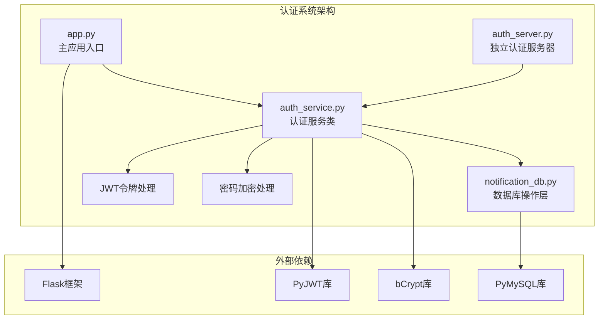
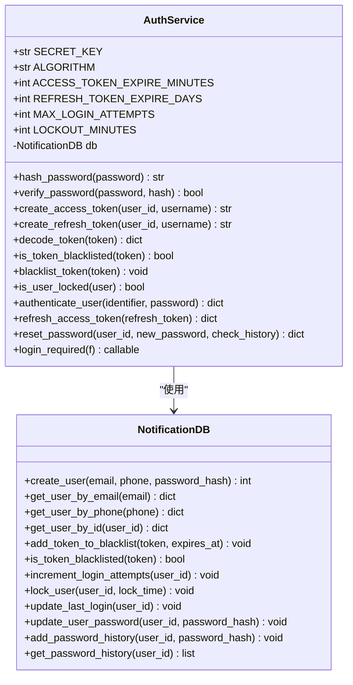
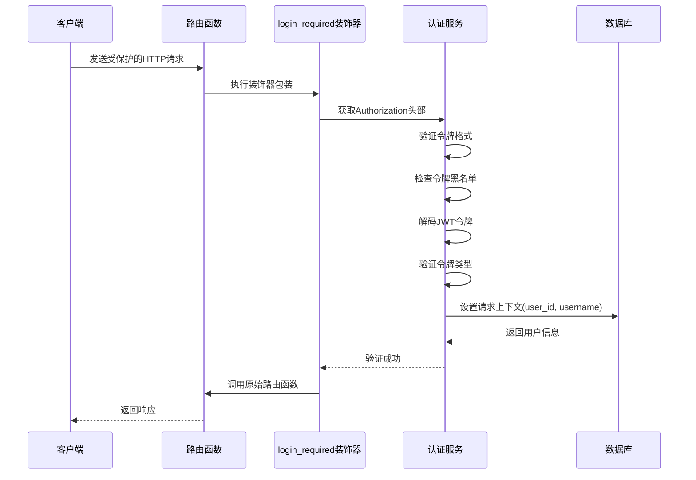
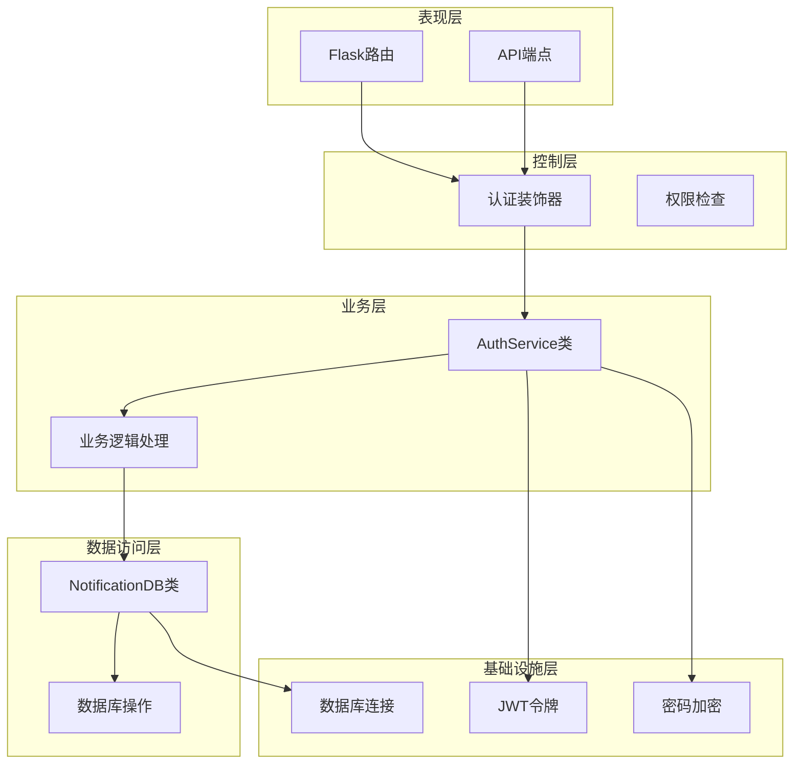
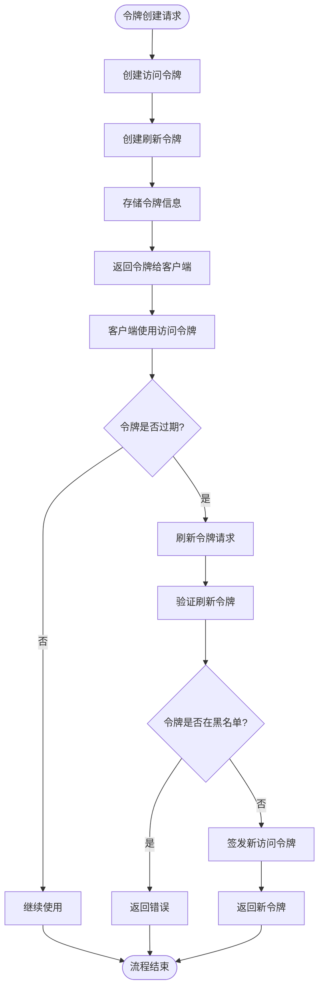
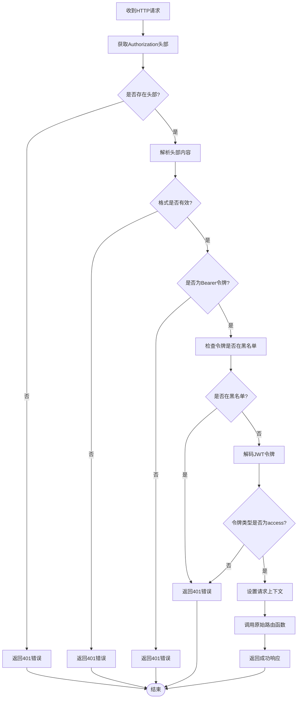
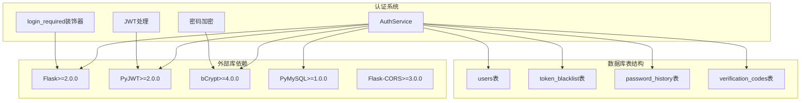

# 认证中间件

<cite>
**本文档引用的文件**
- [auth_service.py](file://python/src/auth_service.py)
- [app.py](file://python/app.py)
- [auth_server.py](file://python/auth_server.py)
- [notification_db.py](file://python/src/notification_db.py)
- [requirements.txt](file://python/requirements.txt)
</cite>

## 目录
1. [简介](#简介)
2. [项目结构](#项目结构)
3. [核心组件](#核心组件)
4. [架构概览](#架构概览)
5. [详细组件分析](#详细组件分析)
6. [依赖关系分析](#依赖关系分析)
7. [性能考虑](#性能考虑)
8. [故障排除指南](#故障排除指南)
9. [结论](#结论)
10. [附录](#附录)

## 简介

本项目实现了一个基于Flask的认证中间件系统，采用JWT（JSON Web Token）技术提供统一的用户身份验证和授权机制。该认证中间件通过`@login_required`装饰器实现，支持访问令牌和刷新令牌的完整生命周期管理，包括令牌验证、权限检查、错误处理等功能。

系统采用模块化设计，将认证逻辑封装在`AuthService`类中，通过装饰器模式实现对路由的统一保护。认证中间件支持多种认证场景，包括用户登录、密码重置、令牌刷新、用户登出等操作。

## 项目结构

认证中间件系统主要分布在以下文件中：



**图表来源**
- [app.py:1-50](file://python/app.py#L1-L50)
- [auth_service.py:1-20](file://python/src/auth_service.py#L1-L20)
- [notification_db.py:1-20](file://python/src/notification_db.py#L1-L20)

**章节来源**
- [app.py:1-1791](file://python/app.py#L1-L1791)
- [auth_server.py:1-431](file://python/auth_server.py#L1-L431)
- [auth_service.py:1-187](file://python/src/auth_service.py#L1-L187)
- [notification_db.py:1-357](file://python/src/notification_db.py#L1-L357)

## 核心组件

### AuthService类

`AuthService`是认证系统的核心类，负责处理所有认证相关的业务逻辑：



**图表来源**
- [auth_service.py:9-187](file://python/src/auth_service.py#L9-L187)
- [notification_db.py:6-357](file://python/src/notification_db.py#L6-L357)

### 认证装饰器

`login_required`装饰器是认证中间件的核心实现：



**图表来源**
- [auth_service.py:158-183](file://python/src/auth_service.py#L158-L183)

**章节来源**
- [auth_service.py:9-187](file://python/src/auth_service.py#L9-L187)

## 架构概览

认证系统采用分层架构设计，确保职责分离和代码可维护性：



**图表来源**
- [app.py:143-144](file://python/app.py#L143-L144)
- [auth_service.py:158-183](file://python/src/auth_service.py#L158-L183)

## 详细组件分析

### JWT令牌处理机制

系统使用JWT（JSON Web Token）进行身份验证，支持两种类型的令牌：

#### 访问令牌（Access Token）
- **有效期**：30分钟
- **用途**：API请求的身份验证
- **结构**：包含用户标识、用户名、令牌类型、过期时间
- **签名算法**：HS256

#### 刷新令牌（Refresh Token）
- **有效期**：7天
- **用途**：获取新的访问令牌
- **结构**：包含用户标识、用户名、令牌类型、过期时间
- **签名算法**：HS256



**图表来源**
- [auth_service.py:27-45](file://python/src/auth_service.py#L27-L45)
- [auth_service.py:120-136](file://python/src/auth_service.py#L120-L136)

### 权限检查机制

权限检查通过装饰器实现，确保只有经过身份验证的用户才能访问受保护的资源：

#### 装饰器执行流程



**图表来源**
- [auth_service.py:158-183](file://python/src/auth_service.py#L158-L183)

### 错误处理和响应格式

系统采用统一的错误响应格式，确保前后端交互的一致性：

#### 成功响应格式
```json
{
  "success": true,
  "message": "操作成功描述",
  "data": {}
}
```

#### 失败响应格式
```json
{
  "success": false,
  "message": "错误描述",
  "code": "错误代码",
  "error": "详细错误信息"
}
```

#### 常见错误代码
- `TOKEN_MISSING`: 未提供认证令牌
- `TOKEN_INVALID`: 无效的认证令牌
- `USER_NOT_FOUND`: 用户不存在
- `INVALID_PASSWORD`: 密码错误
- `ACCOUNT_LOCKED`: 账户被锁定
- `PASSWORD_REUSED`: 新密码与历史密码重复

**章节来源**
- [auth_service.py:158-183](file://python/src/auth_service.py#L158-L183)
- [app.py:95-96](file://python/app.py#L95-L96)
- [auth_server.py:113-120](file://python/auth_server.py#L113-L120)

## 依赖关系分析

认证系统依赖于多个外部库来实现核心功能：



**图表来源**
- [requirements.txt:1-14](file://python/requirements.txt#L1-L14)
- [notification_db.py:44-103](file://python/src/notification_db.py#L44-L103)

**章节来源**
- [requirements.txt:1-14](file://python/requirements.txt#L1-L14)
- [notification_db.py:44-103](file://python/src/notification_db.py#L44-L103)

## 性能考虑

### 缓存策略
- **令牌黑名单缓存**：建议在内存中缓存最近使用的令牌，减少数据库查询
- **用户信息缓存**：对频繁访问的用户信息进行短期缓存
- **数据库连接池**：使用连接池管理数据库连接，提高并发性能

### 优化建议
1. **异步处理**：对于耗时的认证操作，考虑使用异步处理
2. **批量验证**：对多个令牌验证请求进行批处理
3. **索引优化**：确保数据库表的关键字段有适当的索引
4. **超时配置**：合理配置令牌过期时间和数据库连接超时

### 监控指标
- 认证成功率
- 平均响应时间
- 数据库查询延迟
- 内存使用情况
- 并发连接数

## 故障排除指南

### 常见问题及解决方案

#### 1. 认证失败（401 Unauthorized）
**可能原因**：
- 未提供Authorization头部
- 令牌格式不正确
- 令牌类型不是Bearer
- 令牌已过期或被撤销

**解决步骤**：
1. 检查前端是否正确设置Authorization头部
2. 验证令牌格式为"Bearer {token}"
3. 确认令牌未过期
4. 检查令牌是否在黑名单中

#### 2. 账户被锁定
**可能原因**：
- 连续5次密码错误
- 账户被临时锁定15分钟

**解决步骤**：
1. 等待锁定时间结束后重试
2. 检查是否有其他设备登录导致锁定
3. 联系管理员解锁

#### 3. 密码重置失败
**可能原因**：
- 新密码与历史密码重复
- 用户不存在
- 数据库连接问题

**解决步骤**：
1. 使用不同的新密码
2. 确认用户ID正确
3. 检查数据库连接状态

#### 4. 令牌刷新失败
**可能原因**：
- 刷新令牌无效
- 刷新令牌已过期
- 用户不存在

**解决步骤**：
1. 重新登录获取新的刷新令牌
2. 检查刷新令牌的有效期
3. 确认用户状态正常

**章节来源**
- [auth_service.py:76-118](file://python/src/auth_service.py#L76-L118)
- [auth_service.py:120-136](file://python/src/auth_service.py#L120-L136)

## 结论

本认证中间件系统提供了完整的用户身份验证和授权机制，具有以下特点：

1. **安全性**：采用JWT令牌和bcrypt密码加密，支持令牌黑名单机制
2. **可靠性**：完善的错误处理和重试机制
3. **可扩展性**：模块化设计，易于扩展新功能
4. **易用性**：简单的装饰器使用方式，降低集成成本

系统适用于各种规模的应用程序，从简单的Web应用到复杂的微服务架构。通过合理的配置和优化，可以满足大多数认证需求。

## 附录

### 配置选项

| 配置项 | 默认值 | 描述 |
|--------|--------|------|
| SECRET_KEY | 'your-secret-key-change-in-production-12345' | JWT密钥，生产环境必须修改 |
| ALGORITHM | 'HS256' | JWT签名算法 |
| ACCESS_TOKEN_EXPIRE_MINUTES | 30 | 访问令牌有效期（分钟） |
| REFRESH_TOKEN_EXPIRE_DAYS | 7 | 刷新令牌有效期（天） |
| MAX_LOGIN_ATTEMPTS | 5 | 最大登录尝试次数 |
| LOCKOUT_MINUTES | 15 | 账户锁定时间（分钟） |

### 使用示例

#### 基本认证保护
```python
@app.route('/api/protected', methods=['GET'])
@auth_service.login_required
def protected_resource():
    return jsonify({
        'success': True,
        'message': '访问成功',
        'data': {
            'user_id': request.user_id,
            'username': request.username
        }
    })
```

#### 自定义错误处理
```python
@app.errorhandler(401)
def unauthorized(error):
    return jsonify({
        'success': False,
        'message': '认证失败',
        'code': 'AUTHENTICATION_FAILED'
    }), 401
```

### 调试方法

1. **启用Flask调试模式**：设置`debug=True`获取详细的错误信息
2. **日志记录**：在关键位置添加日志输出
3. **数据库监控**：监控数据库连接和查询性能
4. **网络抓包**：使用工具检查HTTP请求和响应