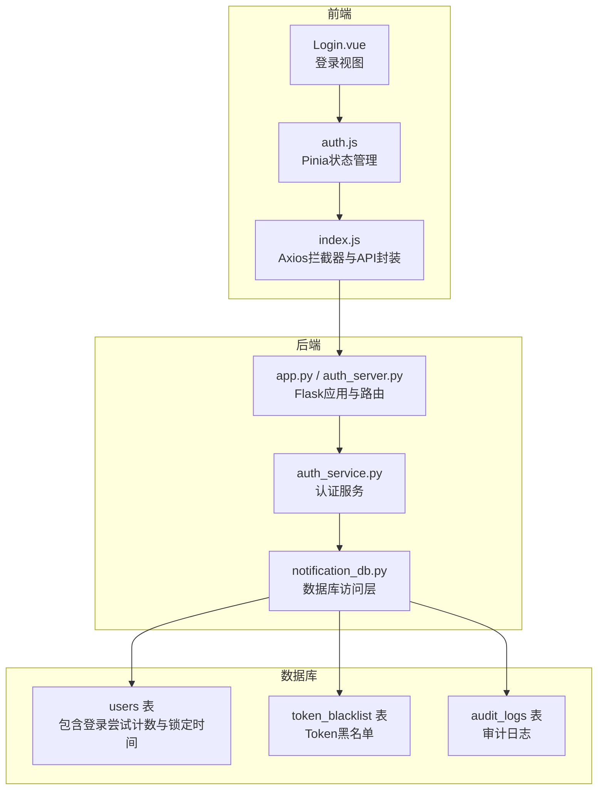
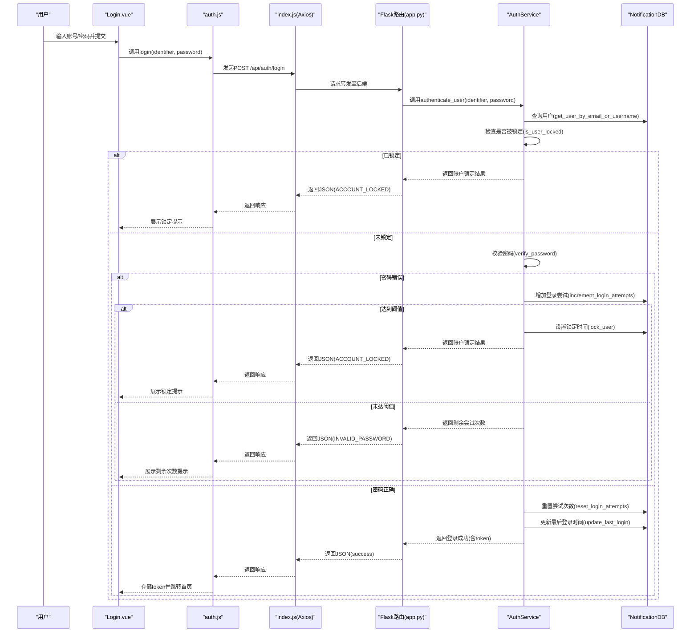
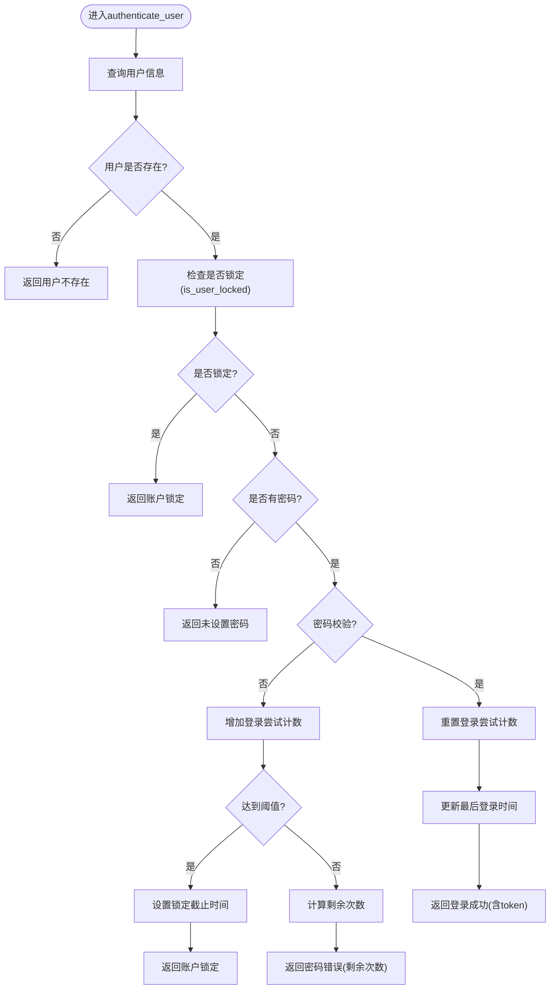
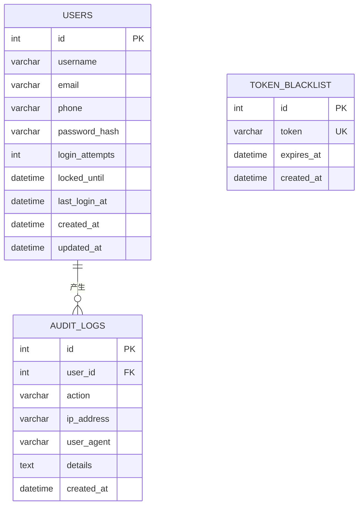
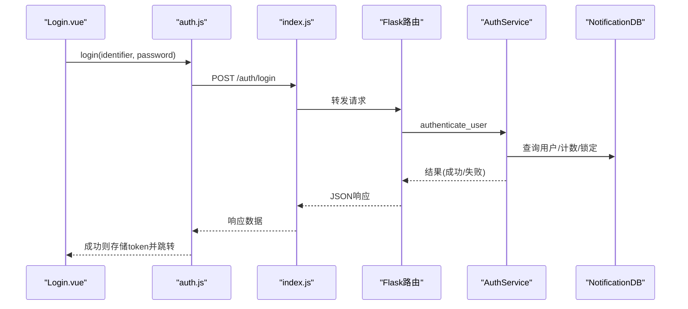
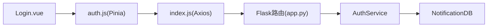

# 账户锁定机制

<cite>
**本文档引用的文件**
- [auth_service.py](file://python/src/auth_service.py)
- [notification_db.py](file://python/src/notification_db.py)
- [app.py](file://python/app.py)
- [auth_server.py](file://python/auth_server.py)
- [index.js](file://python-web/src/api/index.js)
- [auth.js](file://python-web/src/stores/auth.js)
- [Login.vue](file://python-web/src/views/Login.vue)
</cite>

## 目录
1. [简介](#简介)
2. [项目结构](#项目结构)
3. [核心组件](#核心组件)
4. [架构总览](#架构总览)
5. [详细组件分析](#详细组件分析)
6. [依赖关系分析](#依赖关系分析)
7. [性能考虑](#性能考虑)
8. [故障排除指南](#故障排除指南)
9. [结论](#结论)
10. [附录](#附录)

## 简介
本文件面向开发者，系统性阐述账户锁定机制的设计与实现，涵盖登录失败次数统计、锁定阈值设置、临时锁定时长计算、锁定状态检查逻辑、解锁条件判断、用户反馈机制等。文档同时提供配置参数说明、锁定策略实现细节、异常处理方案，并配套流程图、配置示例与故障排除指南，帮助快速落地企业级账户保护功能。

## 项目结构
该系统采用前后端分离架构：后端使用Flask提供认证接口，前端使用Vue+Pinia构建登录界面与状态管理；数据库层通过NotificationDB封装MySQL访问，存储用户表及登录尝试相关字段。

**图表来源**
- [app.py:1-120](file://python/app.py#L1-L120)
- [auth_server.py:1-160](file://python/auth_server.py#L1-L160)
- [auth_service.py:1-187](file://python/src/auth_service.py#L1-L187)
- [notification_db.py:41-104](file://python/src/notification_db.py#L41-L104)
- [index.js:1-95](file://python-web/src/api/index.js#L1-L95)
- [auth.js:1-74](file://python-web/src/stores/auth.js#L1-L74)
- [Login.vue:1-121](file://python-web/src/views/Login.vue#L1-L121)

**章节来源**
- [app.py:1-120](file://python/app.py#L1-L120)
- [auth_server.py:1-160](file://python/auth_server.py#L1-L160)
- [auth_service.py:1-187](file://python/src/auth_service.py#L1-L187)
- [notification_db.py:41-104](file://python/src/notification_db.py#L41-L104)
- [index.js:1-95](file://python-web/src/api/index.js#L1-L95)
- [auth.js:1-74](file://python-web/src/stores/auth.js#L1-L74)
- [Login.vue:1-121](file://python-web/src/views/Login.vue#L1-L121)

## 核心组件
- 认证服务（AuthService）
  - 负责密码哈希/校验、JWT生成与解析、Token黑名单管理、账户锁定判定与解锁逻辑。
  - 关键常量：最大登录尝试次数、锁定时长（分钟）。
- 数据库访问层（NotificationDB）
  - 提供用户查询、登录尝试计数增减、锁定时间设置、最后登录时间更新、Token黑名单写入与查询等。
- Flask路由层（app.py / auth_server.py）
  - 对外暴露登录、刷新、登出、注册等接口，调用AuthService执行业务逻辑。
- 前端交互层（Login.vue、auth.js、index.js）
  - 处理用户输入、表单校验、调用API、展示错误信息、维护本地认证状态。

**章节来源**
- [auth_service.py:9-18](file://python/src/auth_service.py#L9-L18)
- [notification_db.py:190-286](file://python/src/notification_db.py#L190-L286)
- [app.py:99-124](file://python/app.py#L99-L124)
- [auth_server.py:123-159](file://python/auth_server.py#L123-L159)
- [Login.vue:100-119](file://python-web/src/views/Login.vue#L100-L119)
- [auth.js:30-36](file://python-web/src/stores/auth.js#L30-L36)
- [index.js:61-86](file://python-web/src/api/index.js#L61-L86)

## 架构总览
下图展示了从用户提交登录到返回结果的完整流程，包括账户锁定判定与反馈。

**图表来源**
- [Login.vue:100-119](file://python-web/src/views/Login.vue#L100-L119)
- [auth.js:30-36](file://python-web/src/stores/auth.js#L30-L36)
- [index.js:61-86](file://python-web/src/api/index.js#L61-L86)
- [app.py:99-124](file://python/app.py#L99-L124)
- [auth_service.py:76-118](file://python/src/auth_service.py#L76-L118)
- [notification_db.py:261-295](file://python/src/notification_db.py#L261-L295)

## 详细组件分析

### 认证服务（AuthService）
- 登录失败次数统计
  - 当密码错误时，调用数据库层增加登录尝试计数。
- 账户锁定阈值设置
  - 使用类常量定义最大尝试次数，超过阈值触发锁定。
- 临时锁定时间计算
  - 锁定截止时间为当前时间加上固定分钟数。
- 锁定状态检查逻辑
  - 若locked_until存在且大于当前时间，则判定为锁定。
- 解锁条件判断
  - 当前时间超过locked_until时自动解锁；成功登录会重置计数并清除锁定时间。
- 用户反馈机制
  - 根据不同分支返回明确的消息与错误码，前端据此展示提示。

**图表来源**
- [auth_service.py:76-118](file://python/src/auth_service.py#L76-L118)
- [notification_db.py:261-295](file://python/src/notification_db.py#L261-L295)

**章节来源**
- [auth_service.py:14-15](file://python/src/auth_service.py#L14-L15)
- [auth_service.py:67-74](file://python/src/auth_service.py#L67-L74)
- [auth_service.py:88-97](file://python/src/auth_service.py#L88-L97)
- [notification_db.py:261-295](file://python/src/notification_db.py#L261-L295)

### 数据库访问层（NotificationDB）
- 用户表结构要点
  - 包含登录尝试计数与锁定截止时间字段，用于实现锁定策略。
- 关键操作
  - 增加登录尝试计数、重置尝试计数并清除锁定时间、设置锁定截止时间、更新最后登录时间。
- Token黑名单
  - 支持将过期或作废的Token加入黑名单，配合前端刷新流程实现安全登出。

**图表来源**
- [notification_db.py:44-103](file://python/src/notification_db.py#L44-L103)

**章节来源**
- [notification_db.py:44-57](file://python/src/notification_db.py#L44-L57)
- [notification_db.py:261-295](file://python/src/notification_db.py#L261-L295)

### 前后端交互（登录流程）
- 前端负责表单校验与错误展示，调用Pinia Store发起登录请求。
- Axios拦截器自动注入Authorization头，统一处理401刷新流程。
- 后端路由接收请求，委派AuthService处理，最终返回结构化结果。

**图表来源**
- [Login.vue:100-119](file://python-web/src/views/Login.vue#L100-L119)
- [auth.js:30-36](file://python-web/src/stores/auth.js#L30-L36)
- [index.js:61-86](file://python-web/src/api/index.js#L61-L86)
- [app.py:99-124](file://python/app.py#L99-L124)
- [auth_service.py:76-118](file://python/src/auth_service.py#L76-L118)
- [notification_db.py:261-295](file://python/src/notification_db.py#L261-L295)

**章节来源**
- [Login.vue:100-119](file://python-web/src/views/Login.vue#L100-L119)
- [auth.js:30-36](file://python-web/src/stores/auth.js#L30-L36)
- [index.js:61-86](file://python-web/src/api/index.js#L61-L86)
- [app.py:99-124](file://python/app.py#L99-L124)

## 依赖关系分析
- 组件耦合
  - Flask路由依赖AuthService；AuthService依赖NotificationDB；前端Store依赖API封装。
- 外部依赖
  - Flask、bcrypt、PyJWT、pymysql等。
- 可能的循环依赖
  - 代码组织上未见直接循环导入；注意避免在模块内动态导入造成环。

**图表来源**
- [app.py:1-120](file://python/app.py#L1-L120)
- [auth_service.py:1-18](file://python/src/auth_service.py#L1-L18)
- [notification_db.py:1-357](file://python/src/notification_db.py#L1-L357)
- [auth.js:1-74](file://python-web/src/stores/auth.js#L1-L74)
- [index.js:1-95](file://python-web/src/api/index.js#L1-L95)
- [Login.vue:1-121](file://python-web/src/views/Login.vue#L1-L121)

**章节来源**
- [app.py:1-120](file://python/app.py#L1-L120)
- [auth_service.py:1-18](file://python/src/auth_service.py#L1-L18)
- [notification_db.py:1-357](file://python/src/notification_db.py#L1-L357)
- [auth.js:1-74](file://python-web/src/stores/auth.js#L1-L74)
- [index.js:1-95](file://python-web/src/api/index.js#L1-L95)
- [Login.vue:1-121](file://python-web/src/views/Login.vue#L1-L121)

## 性能考虑
- 数据库访问
  - 所有数据库操作均在方法内部建立连接并提交事务，建议在高并发场景下引入连接池与索引优化（如users表的email/username索引）。
- 加密与签名
  - bcrypt与JWT均为CPU密集型操作，建议在网关层或独立服务中进行限流与缓存热点用户信息。
- 前端体验
  - 登录失败提示应即时反馈但避免频繁重复提交，可在前端增加防抖与加载态。

[本节为通用指导，无需特定文件来源]

## 故障排除指南
- 常见问题与定位
  - 登录提示“账户已被锁定”：确认locked_until是否仍大于当前时间；检查数据库users表对应记录。
  - 密码错误但未累计尝试次数：确认是否进入密码校验分支；检查increment_login_attempts是否执行。
  - 成功登录后仍提示锁定：确认reset_login_attempts与update_last_login是否执行。
  - Token 401且无法刷新：检查Axios拦截器与后端刷新接口；确认refresh_token有效性与黑名单状态。
- 排查步骤
  - 后端日志：查看Flask路由层返回的状态码与消息。
  - 数据库核对：查询users表login_attempts与locked_until字段变化。
  - 前端调试：确认localStorage中的token是否正确注入Authorization头。
- 建议修复
  - 在高并发场景下为users表添加适当的索引与连接池配置。
  - 前端增加登录失败次数上限提示与倒计时显示，提升用户体验。

**章节来源**
- [auth_service.py:82-97](file://python/src/auth_service.py#L82-L97)
- [notification_db.py:261-295](file://python/src/notification_db.py#L261-L295)
- [index.js:22-59](file://python-web/src/api/index.js#L22-L59)

## 结论
该账户锁定机制通过简洁的数据库字段与服务层逻辑实现了可靠的登录防护：基于失败次数阈值与固定锁定时长，结合明确的用户反馈与前后端协同，满足企业级安全需求。建议在生产环境中进一步完善数据库索引、连接池与前端交互细节，确保稳定性与用户体验。

[本节为总结性内容，无需特定文件来源]

## 附录

### 配置参数说明
- 最大登录尝试次数（MAX_LOGIN_ATTEMPTS）
  - 定义：类常量，超过此值触发账户锁定。
  - 默认值：5
  - 影响范围：登录失败计数与锁定阈值判断。
- 临时锁定时长（LOCKOUT_MINUTES）
  - 定义：账户被锁定的持续时间（分钟）。
  - 默认值：15
  - 影响范围：锁定截止时间计算与解锁时机。
- JWT相关
  - SECRET_KEY：用于签名与验证JWT的密钥。
  - ALGORITHM：签名算法。
  - ACCESS_TOKEN_EXPIRE_MINUTES：访问令牌过期时间（分钟）。
  - REFRESH_TOKEN_EXPIRE_DAYS：刷新令牌过期时间（天）。

**章节来源**
- [auth_service.py:10-15](file://python/src/auth_service.py#L10-L15)
- [auth_service.py:27-45](file://python/src/auth_service.py#L27-L45)

### 锁定策略实现要点
- 登录流程
  - 查询用户 → 检查锁定 → 校验密码 → 失败则计数并按阈值锁定 → 成功则重置计数与更新最后登录时间。
- 锁定判定
  - locked_until存在且大于当前时间即视为锁定。
- 解锁条件
  - 当前时间超过locked_until自动解锁；成功登录时重置计数并清除锁定时间。
- 用户反馈
  - 返回结构化的success/message/code，前端据此展示提示或跳转。

**章节来源**
- [auth_service.py:67-118](file://python/src/auth_service.py#L67-L118)
- [notification_db.py:261-295](file://python/src/notification_db.py#L261-L295)

### 异常处理方案
- 后端异常
  - 路由层捕获异常并返回结构化错误信息，避免泄露敏感细节。
- 前端异常
  - Axios拦截器统一处理401并尝试刷新token；刷新失败则清理本地存储并跳转登录页。
- 数据库异常
  - 连接失败时重试与降级处理，保证服务可用性。

**章节来源**
- [app.py:122-124](file://python/app.py#L122-L124)
- [auth_server.py:151-159](file://python/auth_server.py#L151-L159)
- [index.js:22-59](file://python-web/src/api/index.js#L22-L59)

### 配置示例（后端）
- 修改最大尝试次数与锁定时长
  - 在AuthService类中调整MAX_LOGIN_ATTEMPTS与LOCKOUT_MINUTES。
- 生产环境建议
  - 更换SECRET_KEY并妥善保管；启用HTTPS与CORS白名单；开启数据库连接池与慢查询日志。

**章节来源**
- [auth_service.py:14-15](file://python/src/auth_service.py#L14-L15)