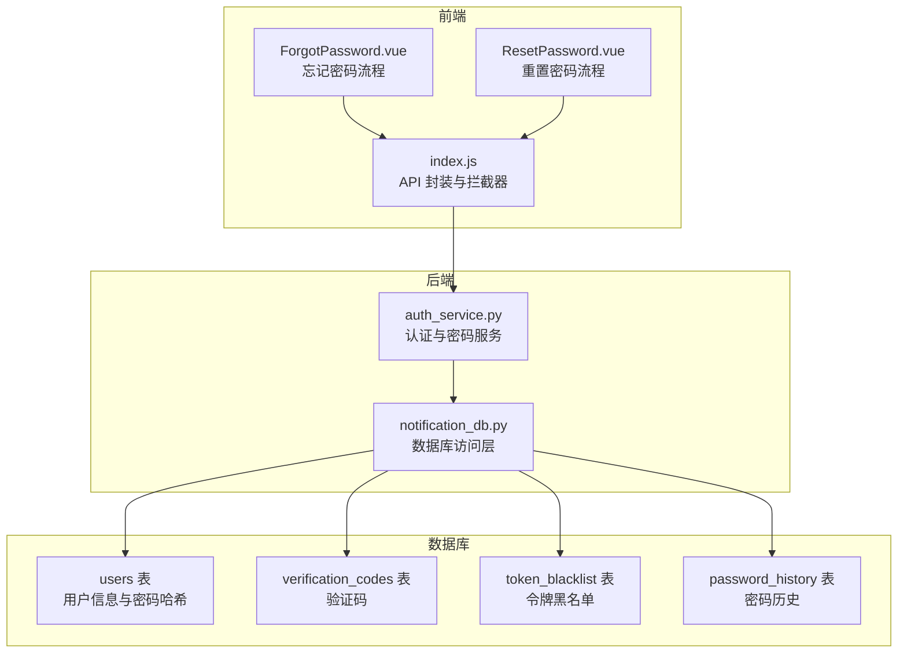
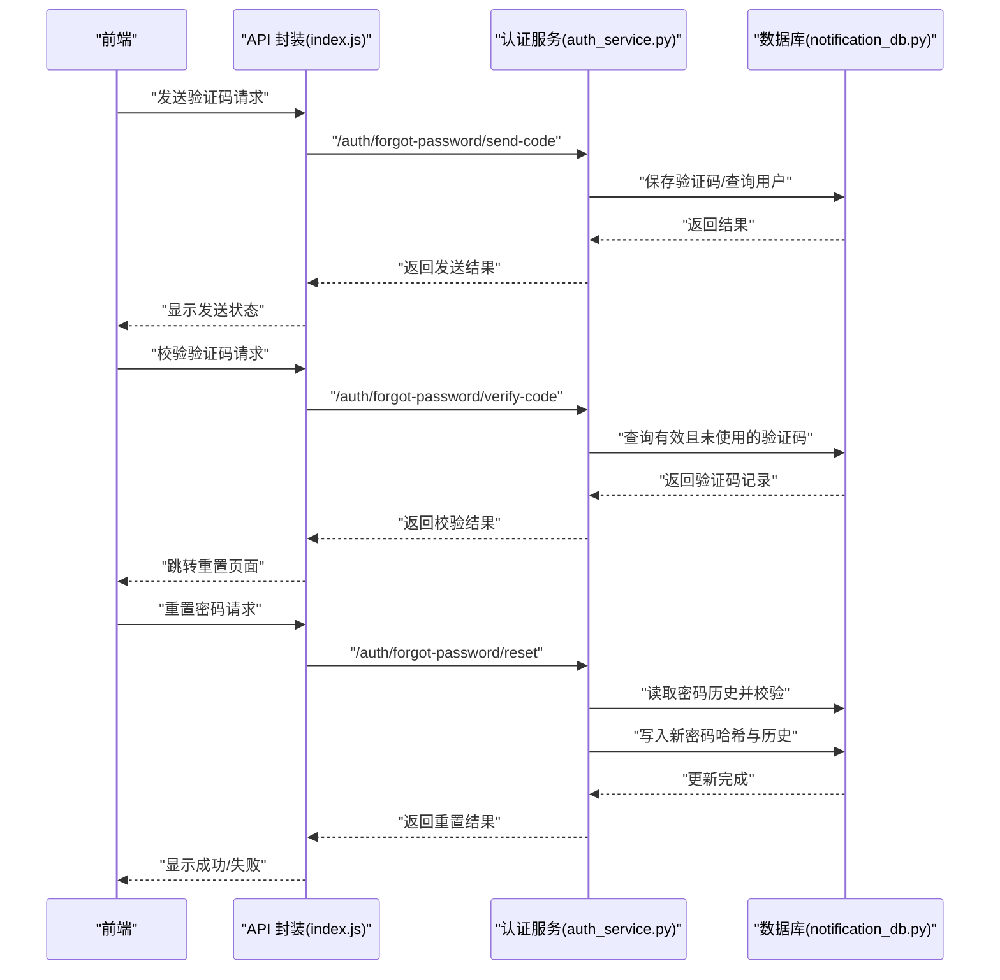
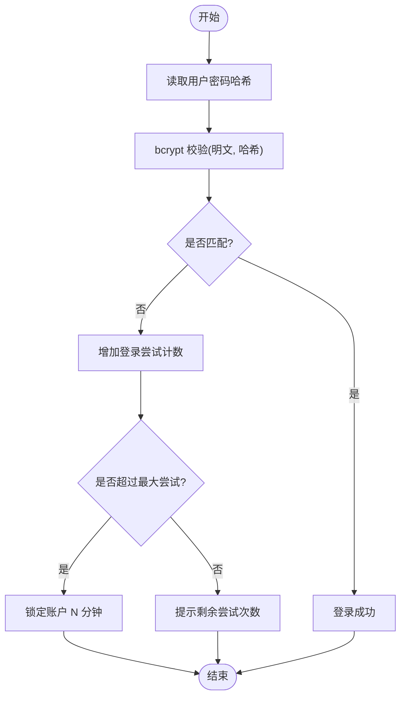
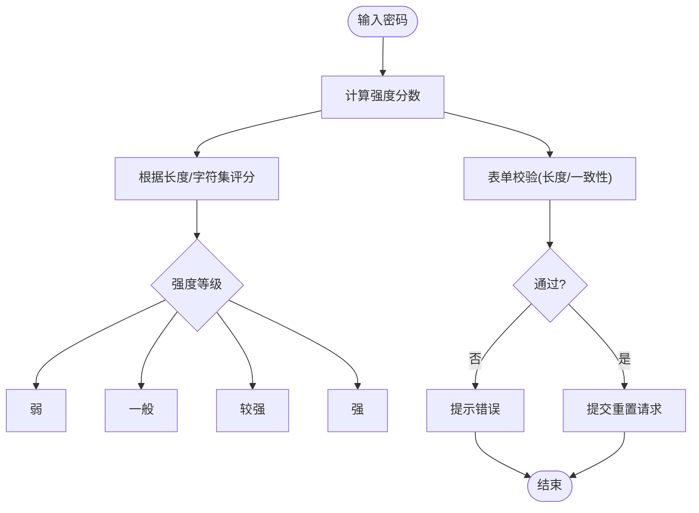
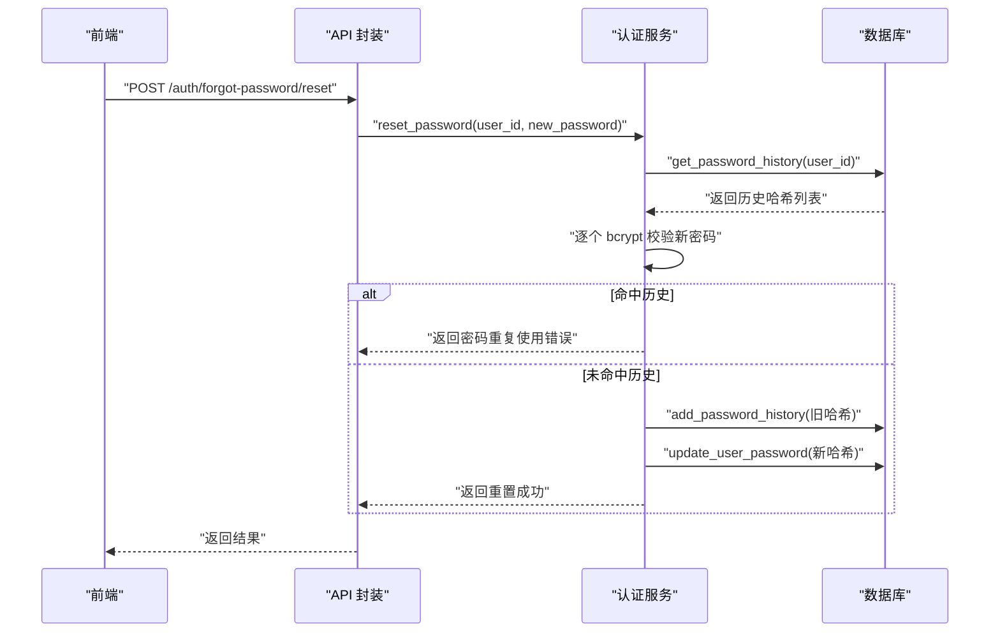
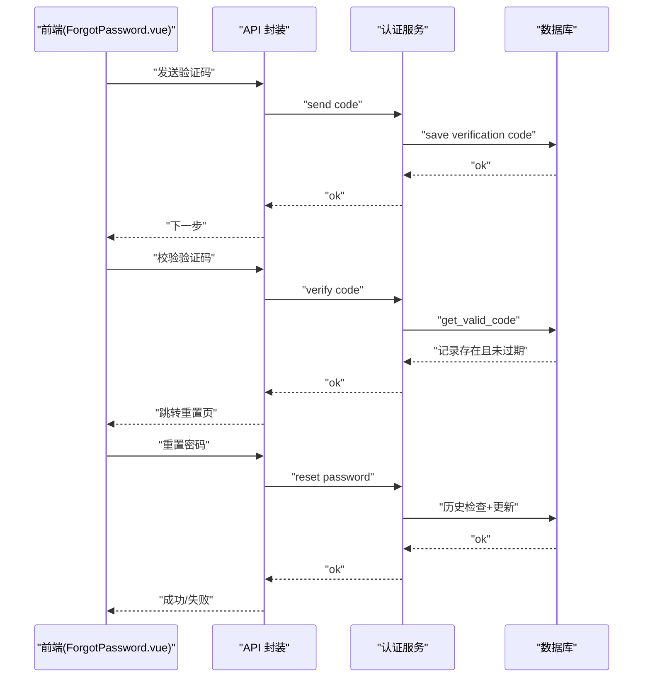
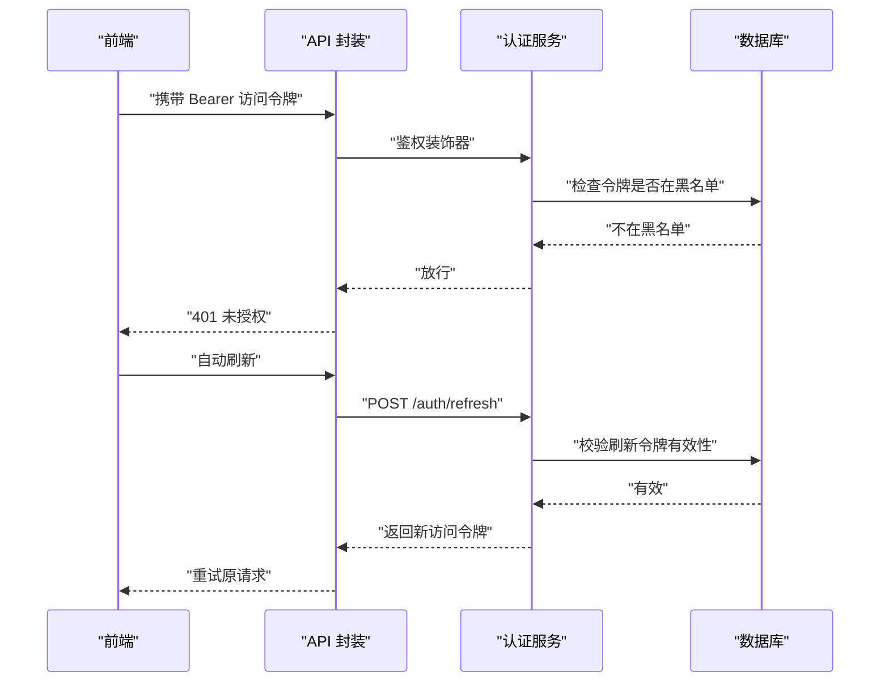
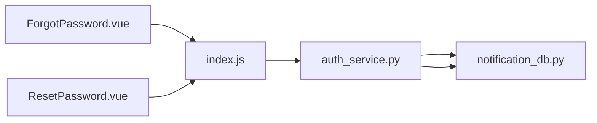

# 密码管理

<cite>
**本文引用的文件**
- [auth_service.py](file://python/src/auth_service.py)
- [notification_db.py](file://python/src/notification_db.py)
- [ForgotPassword.vue](file://python-web/src/views/ForgotPassword.vue)
- [ResetPassword.vue](file://python-web/src/views/ResetPassword.vue)
- [index.js](file://python-web/src/api/index.js)
- [requirements.txt](file://python/requirements.txt)
</cite>

## 目录
1. [简介](#简介)
2. [项目结构](#项目结构)
3. [核心组件](#核心组件)
4. [架构总览](#架构总览)
5. [详细组件分析](#详细组件分析)
6. [依赖分析](#依赖分析)
7. [性能考虑](#性能考虑)
8. [故障排除指南](#故障排除指南)
9. [结论](#结论)
10. [附录](#附录)

## 简介
本文件面向开发者，系统性阐述密码管理系统的实现与最佳实践，重点覆盖以下方面：
- bcrypt 密码哈希算法的实现原理与使用方式
- 密码强度验证规则与前端交互
- 密码历史记录机制与重复使用检测
- 密码加密过程、哈希存储方式与密码验证流程
- 密码重置功能的端到端流程
- 安全存储最佳实践与安全配置建议
- 提供密码强度检测示例、历史密码验证代码路径与安全配置要点

该系统采用 Python 后端 + Vue 前端 + MySQL 数据库存储的分层架构，后端通过 bcrypt 进行密码哈希，JWT 实现访问/刷新令牌，数据库中维护用户表、验证码表、令牌黑名单与密码历史表。

## 项目结构
后端位于 python/src，前端位于 python-web/src，数据库定义与操作封装在 notification_db.py 中，认证服务集中在 auth_service.py，前端视图负责忘记密码与重置密码流程，API 层统一处理请求拦截与响应处理。

图表来源
- [auth_service.py:1-187](file://python/src/auth_service.py#L1-L187)
- [notification_db.py:44-103](file://python/src/notification_db.py#L44-L103)
- [ForgotPassword.vue:1-192](file://python-web/src/views/ForgotPassword.vue#L1-L192)
- [ResetPassword.vue:1-218](file://python-web/src/views/ResetPassword.vue#L1-L218)
- [index.js:1-95](file://python-web/src/api/index.js#L1-L95)

章节来源
- [auth_service.py:1-187](file://python/src/auth_service.py#L1-L187)
- [notification_db.py:44-103](file://python/src/notification_db.py#L44-L103)
- [ForgotPassword.vue:1-192](file://python-web/src/views/ForgotPassword.vue#L1-L192)
- [ResetPassword.vue:1-218](file://python-web/src/views/ResetPassword.vue#L1-L218)
- [index.js:1-95](file://python-web/src/api/index.js#L1-L95)

## 核心组件
- 认证服务（AuthService）
  - 负责密码哈希与校验、JWT 访问/刷新令牌生成与解码、登录锁定策略、令牌黑名单、密码重置与历史检查等。
- 数据库访问层（NotificationDB）
  - 统一封装用户、验证码、令牌黑名单、密码历史与审计日志的增删改查。
- 前端视图
  - 忘记密码：输入目标（邮箱/手机），发送验证码，校验验证码，跳转重置页面。
  - 重置密码：输入新密码与确认密码，前端强度检测，提交后端重置接口。
- API 封装与拦截器
  - 自动注入 Authorization 头，401 时自动刷新访问令牌并重试。

章节来源
- [auth_service.py:9-187](file://python/src/auth_service.py#L9-L187)
- [notification_db.py:6-357](file://python/src/notification_db.py#L6-L357)
- [ForgotPassword.vue:130-190](file://python-web/src/views/ForgotPassword.vue#L130-L190)
- [ResetPassword.vue:143-205](file://python-web/src/views/ResetPassword.vue#L143-L205)
- [index.js:11-59](file://python-web/src/api/index.js#L11-L59)

## 架构总览
系统采用前后端分离架构，认证流程围绕 bcrypt 哈希与 JWT 令牌展开，数据库层面通过多张表支撑用户身份、验证码、令牌黑名单与密码历史。

图表来源
- [auth_service.py:138-156](file://python/src/auth_service.py#L138-L156)
- [notification_db.py:147-188](file://python/src/notification_db.py#L147-L188)
- [notification_db.py:313-332](file://python/src/notification_db.py#L313-L332)
- [index.js:74-85](file://python-web/src/api/index.js#L74-L85)

## 详细组件分析

### bcrypt 密码哈希与验证
- 实现原理
  - 使用 bcrypt 生成盐值并进行哈希，哈希结果包含版本、成本参数与盐值，可直接存储。
  - 验证时使用 bcrypt.checkpw 对明文密码与存储的哈希进行比对，内部完成盐值提取与重新计算。
- 存储方式
  - 用户表的 password_hash 字段用于存储 bcrypt 哈希字符串。
- 验证流程
  - 登录时从用户表读取 password_hash，调用 verify_password 进行校验；失败则增加登录尝试计数，超过阈值进行锁定。

图表来源
- [auth_service.py:20-25](file://python/src/auth_service.py#L20-L25)
- [auth_service.py:76-118](file://python/src/auth_service.py#L76-L118)
- [notification_db.py:261-286](file://python/src/notification_db.py#L261-L286)

章节来源
- [auth_service.py:20-25](file://python/src/auth_service.py#L20-L25)
- [auth_service.py:76-118](file://python/src/auth_service.py#L76-L118)
- [notification_db.py:44-56](file://python/src/notification_db.py#L44-L56)

### 密码强度验证规则与前端交互
- 规则设计
  - 长度：至少 6 位；达到 10 位进一步加分。
  - 字符集：包含大写字母、数字、特殊字符等。
  - 强度分级：弱/一般/较强/强四档，前端以进度条颜色与文字反馈。
- 前端实现
  - 输入监听触发强度计算，实时展示强度条与文本。
  - 表单提交前进行长度与一致性校验，避免弱口令与不一致密码进入后端。

图表来源
- [ResetPassword.vue:143-182](file://python-web/src/views/ResetPassword.vue#L143-L182)

章节来源
- [ResetPassword.vue:143-182](file://python-web/src/views/ResetPassword.vue#L143-L182)

### 密码历史记录机制与重复使用检测
- 历史记录表
  - password_history 表按时间倒序存储用户历史密码哈希，支持限制查询数量。
- 检测逻辑
  - 重置密码时，若开启历史检查，则读取历史哈希并与新密码进行 bcrypt 校验，若命中则拒绝重置。
  - 成功重置后，将旧密码哈希写入历史表，便于后续检测。

图表来源
- [auth_service.py:138-156](file://python/src/auth_service.py#L138-L156)
- [notification_db.py:313-332](file://python/src/notification_db.py#L313-L332)

章节来源
- [auth_service.py:138-156](file://python/src/auth_service.py#L138-L156)
- [notification_db.py:313-332](file://python/src/notification_db.py#L313-L332)

### 密码重置功能端到端流程
- 忘记密码
  - 前端校验邮箱/手机号，调用发送验证码接口。
  - 服务器生成验证码并落库，设置过期时间，标记未使用。
  - 前端收到成功后进入验证码校验步骤。
- 验证码校验
  - 前端提交验证码与目标信息，服务器查询有效且未使用记录，校验过期时间。
  - 校验通过后返回用户标识，前端跳转重置页面。
- 重置密码
  - 前端输入新密码与确认密码，强度检测通过后提交重置请求。
  - 后端执行历史检查、写入历史与新哈希，返回结果。

图表来源
- [ForgotPassword.vue:130-190](file://python-web/src/views/ForgotPassword.vue#L130-L190)
- [ResetPassword.vue:184-205](file://python-web/src/views/ResetPassword.vue#L184-L205)
- [notification_db.py:147-188](file://python/src/notification_db.py#L147-L188)

章节来源
- [ForgotPassword.vue:130-190](file://python-web/src/views/ForgotPassword.vue#L130-L190)
- [ResetPassword.vue:184-205](file://python-web/src/views/ResetPassword.vue#L184-L205)
- [notification_db.py:147-188](file://python/src/notification_db.py#L147-L188)

### JWT 令牌与安全控制
- 访问令牌与刷新令牌
  - 访问令牌短期有效，刷新令牌长期有效但可加入黑名单。
- 黑名单机制
  - 登出/刷新失败时将令牌加入黑名单，后续请求被拦截。
- 请求拦截与自动刷新
  - 401 时自动使用刷新令牌换取新的访问令牌并重试原请求。

图表来源
- [auth_service.py:158-183](file://python/src/auth_service.py#L158-L183)
- [auth_service.py:120-136](file://python/src/auth_service.py#L120-L136)
- [notification_db.py:307-311](file://python/src/notification_db.py#L307-L311)
- [index.js:11-59](file://python-web/src/api/index.js#L11-L59)

章节来源
- [auth_service.py:158-183](file://python/src/auth_service.py#L158-L183)
- [auth_service.py:120-136](file://python/src/auth_service.py#L120-L136)
- [notification_db.py:307-311](file://python/src/notification_db.py#L307-L311)
- [index.js:11-59](file://python-web/src/api/index.js#L11-L59)

## 依赖分析
- 外部依赖
  - bcrypt：密码哈希与校验
  - PyMySQL：MySQL 数据库连接
  - Flask/JWT：后端认证与令牌处理
  - Axios：前端 HTTP 客户端
- 内部模块耦合
  - AuthService 依赖 NotificationDB 的数据访问方法
  - 前端视图通过 API 封装调用后端接口
  - 数据库层提供统一的 CRUD 与业务查询方法

图表来源
- [auth_service.py:1-6](file://python/src/auth_service.py#L1-L6)
- [notification_db.py:1-26](file://python/src/notification_db.py#L1-L26)
- [index.js:1-9](file://python-web/src/api/index.js#L1-L9)

章节来源
- [auth_service.py:1-6](file://python/src/auth_service.py#L1-L6)
- [notification_db.py:1-26](file://python/src/notification_db.py#L1-L26)
- [index.js:1-9](file://python-web/src/api/index.js#L1-L9)
- [requirements.txt](file://python/requirements.txt)

## 性能考虑
- bcrypt 成本参数
  - 在保证安全的前提下，合理设置成本参数以平衡验证延迟与服务器负载。
- 数据库索引
  - users.email/username、verification_codes.code/target、token_blacklist.token 等字段应建立索引，提升查询效率。
- 缓存策略
  - 对频繁访问的用户信息与验证码可引入缓存，减少数据库压力。
- 并发控制
  - 登录尝试计数与锁定需使用原子操作或事务，避免竞态条件导致的误判。

## 故障排除指南
- 密码错误与账户锁定
  - 当登录失败次数超过阈值，账户将被锁定一段时间；前端提示剩余尝试次数或锁定状态。
- 令牌失效
  - 若出现 401，检查本地存储的访问令牌是否过期，确认刷新令牌是否有效；查看黑名单表是否包含当前令牌。
- 验证码问题
  - 校验失败通常由过期或已被使用导致；确认验证码表中的 used 字段与 expires_at 时间。
- 历史密码重复
  - 重置失败提示“新密码不能与最近使用的密码相同”，检查历史表是否正确写入与查询。

章节来源
- [auth_service.py:76-118](file://python/src/auth_service.py#L76-L118)
- [auth_service.py:120-136](file://python/src/auth_service.py#L120-L136)
- [notification_db.py:158-188](file://python/src/notification_db.py#L158-L188)
- [notification_db.py:313-332](file://python/src/notification_db.py#L313-L332)

## 结论
本密码管理系统基于 bcrypt 与 JWT 构建，结合数据库的验证码、黑名单与密码历史机制，实现了安全可靠的密码存储与验证流程。前端提供直观的密码强度检测与重置体验，后端通过严格的校验与历史检查防止弱口令与重复使用。建议在生产环境中强化密钥管理、成本参数与数据库索引，并持续监控与审计。

## 附录

### 安全配置建议
- 密钥与算法
  - 更换默认 SECRET_KEY，使用强随机源生成；确保仅在 HTTPS 下传输令牌。
- bcrypt 成本
  - 根据硬件能力设置合适成本，定期评估验证延迟与吞吐量。
- 数据库安全
  - 严格限制数据库凭据权限，启用 SSL 连接，定期备份与审计。
- 前端安全
  - 避免在客户端存储敏感信息；对输入进行严格校验与清理。
- 日志与监控
  - 记录关键事件（登录、重置、锁定、黑名单等），设置告警阈值。

### 关键实现路径参考
- bcrypt 哈希与校验
  - [auth_service.py:20-25](file://python/src/auth_service.py#L20-L25)
- 登录与锁定策略
  - [auth_service.py:76-118](file://python/src/auth_service.py#L76-L118)
- 刷新令牌与黑名单
  - [auth_service.py:120-136](file://python/src/auth_service.py#L120-L136)
  - [notification_db.py:307-311](file://python/src/notification_db.py#L307-L311)
- 密码历史检查与更新
  - [auth_service.py:138-156](file://python/src/auth_service.py#L138-L156)
  - [notification_db.py:313-332](file://python/src/notification_db.py#L313-L332)
- 忘记密码验证码流程
  - [ForgotPassword.vue:130-190](file://python-web/src/views/ForgotPassword.vue#L130-L190)
  - [notification_db.py:147-188](file://python/src/notification_db.py#L147-L188)
- 重置密码前端强度检测
  - [ResetPassword.vue:143-182](file://python-web/src/views/ResetPassword.vue#L143-L182)
- API 请求拦截与自动刷新
  - [index.js:11-59](file://python-web/src/api/index.js#L11-L59)