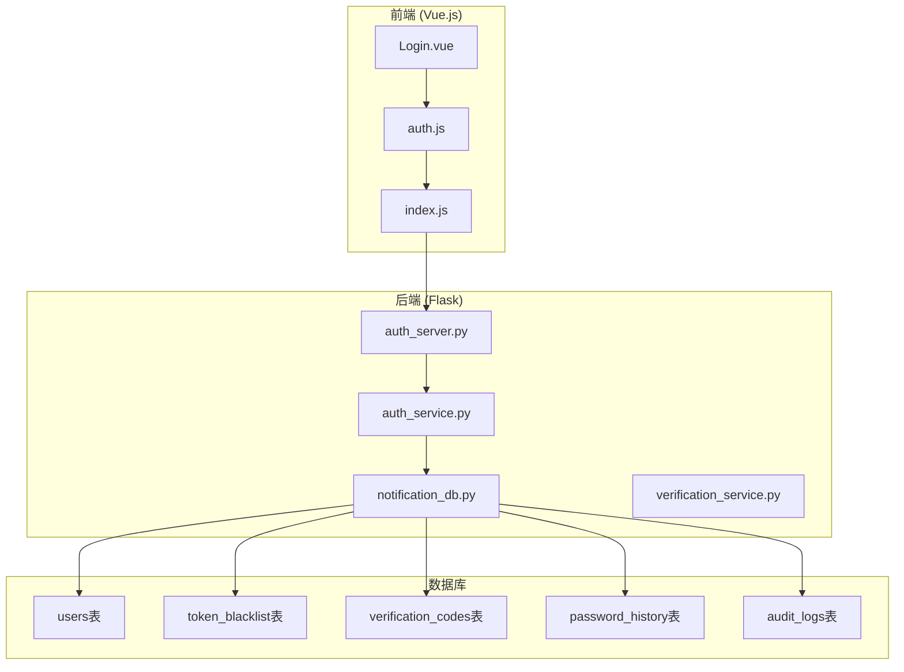
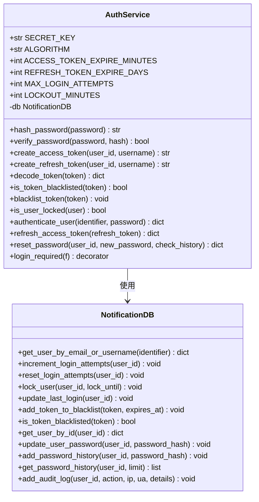
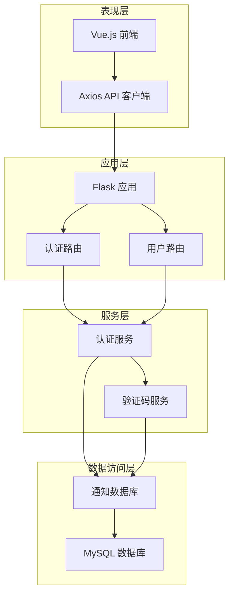
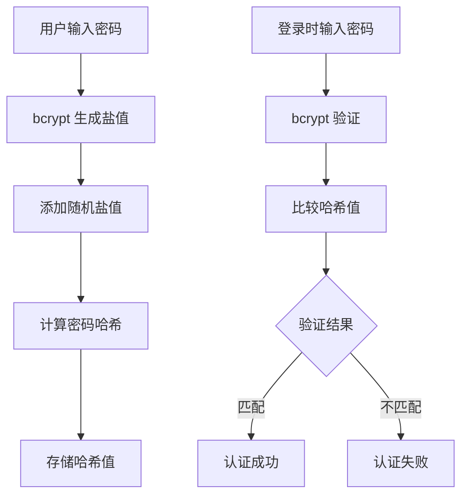
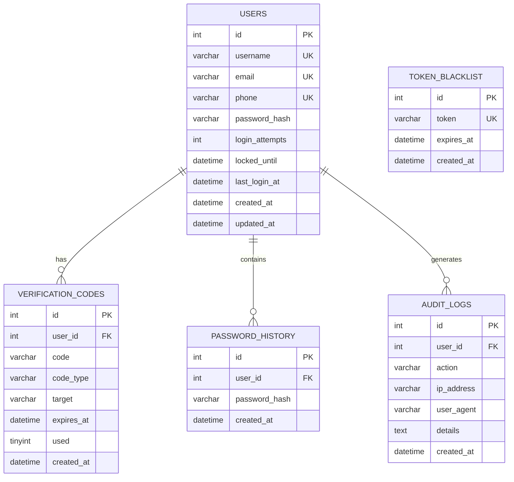
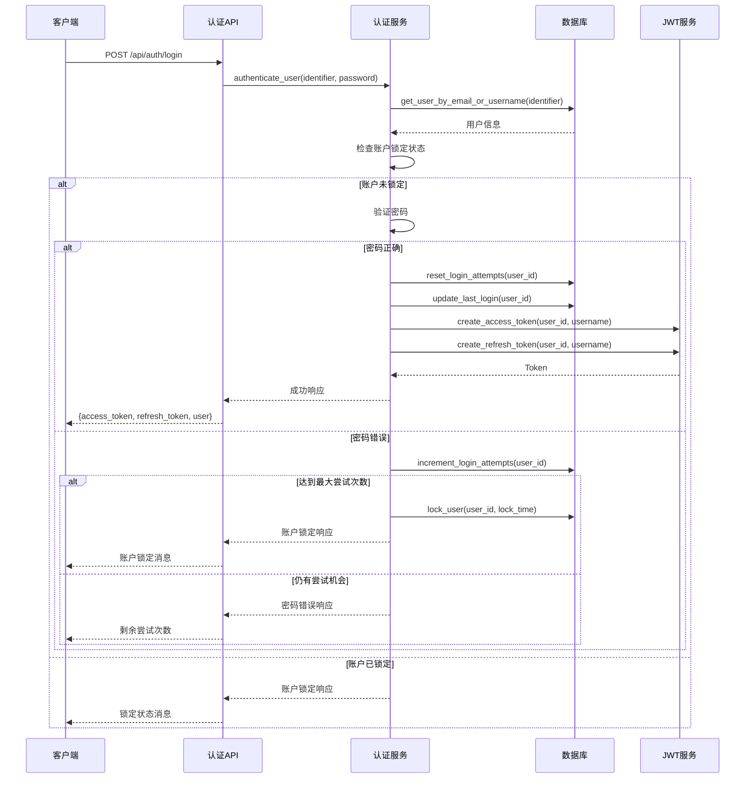
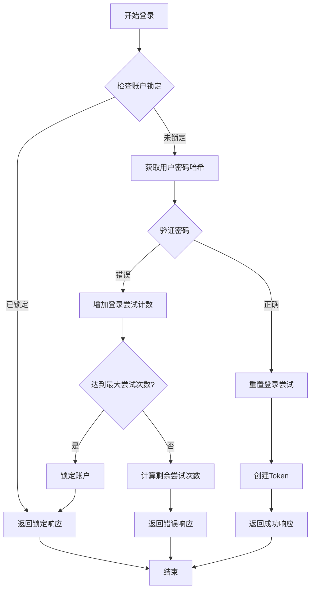
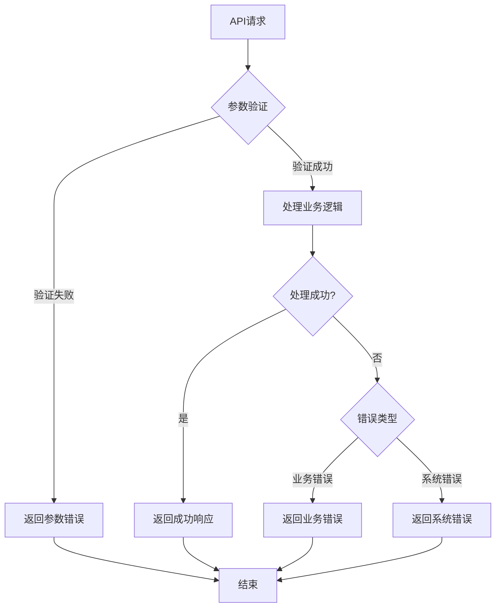
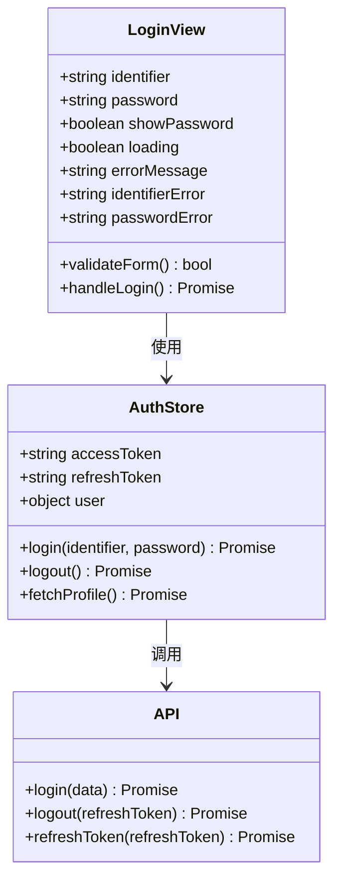
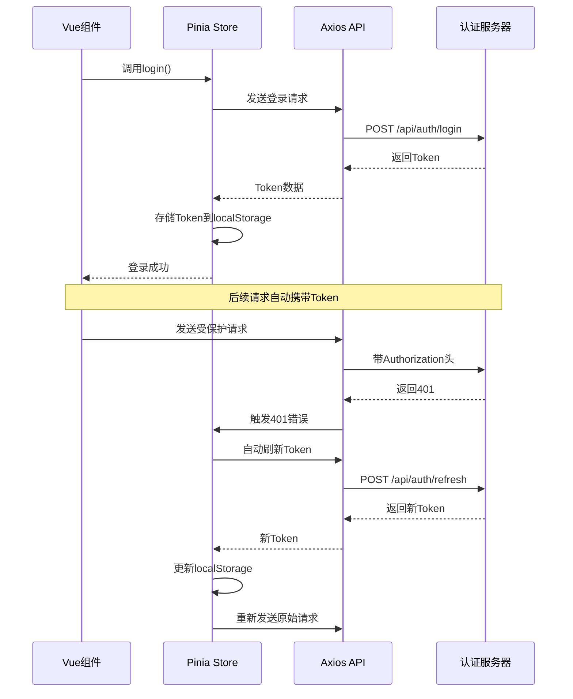

# 用户认证

<cite>
**本文档引用的文件**
- [auth_service.py](file://python/src/auth_service.py)
- [auth_server.py](file://python/auth_server.py)
- [notification_db.py](file://python/src/notification_db.py)
- [verification_service.py](file://python/src/notifications/verification_service.py)
- [Login.vue](file://python-web/src/views/Login.vue)
- [auth.js](file://python-web/src/stores/auth.js)
- [index.js](file://python-web/src/api/index.js)
- [requirements.txt](file://python/requirements.txt)
</cite>

## 目录
1. [简介](#简介)
2. [项目结构](#项目结构)
3. [核心组件](#核心组件)
4. [架构概览](#架构概览)
5. [详细组件分析](#详细组件分析)
6. [登录流程详解](#登录流程详解)
7. [安全机制](#安全机制)
8. [错误处理与状态码](#错误处理与状态码)
9. [前端集成](#前端集成)
10. [性能考虑](#性能考虑)
11. [故障排除指南](#故障排除指南)
12. [结论](#结论)

## 简介

本项目是一个基于Flask的完整用户认证系统，提供了邮箱或用户名登录、密码验证、账户锁定策略、Token管理等核心功能。系统采用JWT（JSON Web Token）进行身份验证，实现了完整的用户生命周期管理，包括注册、登录、登出、密码重置等功能。

## 项目结构

项目采用前后端分离架构，主要分为以下模块：

**图表来源**
- [auth_server.py:1-431](file://python/auth_server.py#L1-L431)
- [auth_service.py:1-187](file://python/src/auth_service.py#L1-L187)
- [notification_db.py:1-357](file://python/src/notification_db.py#L1-L357)

**章节来源**
- [auth_server.py:1-431](file://python/auth_server.py#L1-L431)
- [auth_service.py:1-187](file://python/src/auth_service.py#L1-L187)
- [notification_db.py:1-357](file://python/src/notification_db.py#L1-L357)

## 核心组件

### 认证服务 (AuthService)

认证服务是整个系统的核心，负责处理用户认证逻辑、Token管理和安全策略。

**图表来源**
- [auth_service.py:9-187](file://python/src/auth_service.py#L9-L187)
- [notification_db.py:6-357](file://python/src/notification_db.py#L6-L357)

### 数据库层

NotificationDB负责所有数据库操作，维护用户信息、Token黑名单、验证码和审计日志。

**章节来源**
- [auth_service.py:9-187](file://python/src/auth_service.py#L9-L187)
- [notification_db.py:6-357](file://python/src/notification_db.py#L6-L357)

## 架构概览

系统采用分层架构设计，确保关注点分离和代码可维护性：

**图表来源**
- [auth_server.py:1-431](file://python/auth_server.py#L1-L431)
- [auth_service.py:1-187](file://python/src/auth_service.py#L1-L187)
- [notification_db.py:1-357](file://python/src/notification_db.py#L1-L357)

## 详细组件分析

### 认证服务实现

认证服务实现了完整的用户认证流程，包括密码哈希、Token生成、账户锁定等核心功能。

#### 密码安全机制

系统使用bcrypt进行密码哈希，确保密码存储的安全性：

**图表来源**
- [auth_service.py:20-25](file://python/src/auth_service.py#L20-L25)

#### Token管理

系统支持两种类型的Token：访问Token和刷新Token，实现短期和长期认证需求。

**章节来源**
- [auth_service.py:27-45](file://python/src/auth_service.py#L27-L45)
- [auth_service.py:120-136](file://python/src/auth_service.py#L120-L136)

### 数据库设计

系统使用MySQL数据库存储用户信息和相关数据：

**图表来源**
- [notification_db.py:44-103](file://python/src/notification_db.py#L44-L103)

**章节来源**
- [notification_db.py:44-103](file://python/src/notification_db.py#L44-L103)

## 登录流程详解

### 完整登录序列

**图表来源**
- [auth_server.py:123-159](file://python/auth_server.py#L123-L159)
- [auth_service.py:76-118](file://python/src/auth_service.py#L76-L118)

### 登录尝试限制机制

系统实现了智能的登录尝试限制，防止暴力破解攻击：

**图表来源**
- [auth_service.py:88-97](file://python/src/auth_service.py#L88-L97)
- [auth_service.py:67-74](file://python/src/auth_service.py#L67-L74)

**章节来源**
- [auth_service.py:76-118](file://python/src/auth_service.py#L76-L118)
- [auth_service.py:67-74](file://python/src/auth_service.py#L67-L74)

## 安全机制

### 多层安全防护

系统实现了多层次的安全防护机制：

#### 1. 密码安全
- 使用bcrypt进行密码哈希
- 支持密码历史记录，防止重复使用
- 最小密码长度验证

#### 2. Token安全
- JWT访问Token（30分钟过期）
- 刷新Token（7天过期）
- Token黑名单机制
- 自动Token轮换

#### 3. 账户保护
- 登录尝试限制（5次）
- 账户锁定（15分钟）
- IP地址和User-Agent审计
- 审计日志记录

#### 4. 前端安全
- 自动Token刷新机制
- 请求拦截器
- 自动登出处理

**章节来源**
- [auth_service.py:10-15](file://python/src/auth_service.py#L10-L15)
- [auth_service.py:138-156](file://python/src/auth_service.py#L138-L156)
- [auth_server.py:188-223](file://python/auth_server.py#L188-L223)

## 错误处理与状态码

### 错误码定义

系统定义了完整的错误码体系，便于前端处理和用户反馈：

| 错误码 | 描述 | HTTP状态码 | 用途 |
|--------|------|------------|------|
| USER_NOT_FOUND | 用户不存在 | 404 | 登录失败、用户查询 |
| ACCOUNT_LOCKED | 账户已被锁定 | 401 | 登录失败 |
| PASSWORD_NOT_SET | 请先设置密码 | 400 | 登录失败 |
| INVALID_PASSWORD | 密码错误 | 400 | 登录失败 |
| MISSING_CREDENTIALS | 缺少凭据 | 400 | 登录失败 |
| TOKEN_MISSING | 未提供认证令牌 | 401 | 未授权访问 |
| TOKEN_INVALID | 无效的Token | 401 | Token验证失败 |
| USERNAME_EXISTS | 用户名已存在 | 400 | 注册失败 |
| EMAIL_EXISTS | 邮箱已被注册 | 400 | 注册失败 |
| PHONE_EXISTS | 手机号已被注册 | 400 | 注册失败 |
| INVALID_USERNAME | 用户名无效 | 400 | 注册失败 |
| INVALID_PASSWORD | 密码无效 | 400 | 注册/修改密码失败 |
| REGISTER_FAILED | 注册失败 | 500 | 注册异常 |
| LOGIN_FAILED | 登录失败 | 500 | 登录异常 |

### 错误处理流程

**图表来源**
- [auth_server.py:123-159](file://python/auth_server.py#L123-L159)
- [auth_server.py:47-121](file://python/auth_server.py#L47-L121)

**章节来源**
- [auth_server.py:47-121](file://python/auth_server.py#L47-L121)
- [auth_server.py:123-159](file://python/auth_server.py#L123-L159)

## 前端集成

### Vue.js 前端实现

前端使用Vue.js和Pinia进行状态管理，实现了完整的用户认证界面：

#### 登录组件

**图表来源**
- [Login.vue:66-121](file://python-web/src/views/Login.vue#L66-L121)
- [auth.js:5-74](file://python-web/src/stores/auth.js#L5-L74)
- [index.js:61-95](file://python-web/src/api/index.js#L61-L95)

#### Token自动管理

前端实现了智能的Token管理机制：

**图表来源**
- [index.js:11-59](file://python-web/src/api/index.js#L11-L59)
- [auth.js:30-51](file://python-web/src/stores/auth.js#L30-L51)

**章节来源**
- [Login.vue:66-121](file://python-web/src/views/Login.vue#L66-L121)
- [auth.js:5-74](file://python-web/src/stores/auth.js#L5-L74)
- [index.js:11-59](file://python-web/src/api/index.js#L11-L59)

## 性能考虑

### 系统性能优化

#### 1. 数据库优化
- 使用索引优化用户查询
- 连接池管理减少连接开销
- 异步操作处理验证码发送

#### 2. 缓存策略
- Token验证结果缓存
- 用户信息缓存
- 验证码缓存控制

#### 3. 网络优化
- 请求超时控制
- 自动重试机制
- 连接复用

#### 4. 内存管理
- 及时释放数据库连接
- Token内存管理
- 前端状态清理

## 故障排除指南

### 常见问题诊断

#### 1. 登录失败问题
- 检查用户名/邮箱是否正确
- 验证密码是否符合要求
- 确认账户是否被锁定
- 查看服务器日志

#### 2. Token相关问题
- 检查Token是否过期
- 验证Token格式是否正确
- 确认Token是否在黑名单中
- 检查服务器时间同步

#### 3. 数据库连接问题
- 验证MySQL服务状态
- 检查连接参数配置
- 确认数据库权限设置
- 查看连接池状态

#### 4. 前端认证问题
- 检查localStorage存储
- 验证API端点配置
- 确认CORS设置
- 查看浏览器控制台

**章节来源**
- [auth_server.py:123-159](file://python/auth_server.py#L123-L159)
- [notification_db.py:19-40](file://python/src/notification_db.py#L19-L40)

## 结论

本用户认证系统提供了完整的身份验证解决方案，具有以下特点：

### 核心优势
- **安全性高**：多层安全防护，防止常见攻击
- **易扩展**：模块化设计，便于功能扩展
- **用户体验好**：自动Token管理，无缝认证体验
- **开发友好**：清晰的API接口和错误处理

### 技术亮点
- 基于JWT的现代认证机制
- 智能的账户锁定策略
- 完整的审计日志系统
- 前后端分离架构

### 适用场景
该系统适用于各种Web应用的身份验证需求，特别是需要：
- 用户注册和登录功能
- 多种认证方式支持
- 安全的Token管理
- 完善的错误处理机制

通过遵循本文档的实现指南，开发者可以快速集成完整的用户认证功能，构建安全可靠的Web应用。