# 认证系统

<cite>
**本文引用的文件**
- [app.py](file://python/app.py)
- [auth_server.py](file://python/auth_server.py)
- [src/auth_service.py](file://python/src/auth_service.py)
- [src/notification_db.py](file://python/src/notification_db.py)
- [src/notifications/verification_service.py](file://python/src/notifications/verification_service.py)
- [python-web/src/stores/auth.js](file://python-web/src/stores/auth.js)
- [python-web/src/views/Login.vue](file://python-web/src/views/Login.vue)
- [python-web/src/views/Register.vue](file://python-web/src/views/Register.vue)
- [python-web/src/router/index.js](file://python-web/src/router/index.js)
- [python-web/src/api/index.js](file://python-web/src/api/index.js)
</cite>

## 目录
1. [简介](#简介)
2. [项目结构](#项目结构)
3. [核心组件](#核心组件)
4. [架构总览](#架构总览)
5. [详细组件分析](#详细组件分析)
6. [依赖分析](#依赖分析)
7. [性能考虑](#性能考虑)
8. [故障排查指南](#故障排查指南)
9. [结论](#结论)
10. [附录](#附录)

## 简介
本认证系统提供完整的用户身份认证能力，包括用户注册、登录认证、Token刷新、登出处理、密码重置与修改、审计日志等。系统采用JWT作为访问令牌机制，配合刷新令牌与黑名单策略实现安全的会话管理；后端使用bcrypt进行密码哈希与校验；前端通过Pinia状态管理与Axios拦截器实现自动刷新与权限控制。

## 项目结构
后端采用Flask微服务，路由集中在应用入口文件中，认证业务逻辑封装在服务层，数据库操作由独立的数据访问层负责。前端基于Vue 3 + Pinia + Vue Router + Axios，通过拦截器统一注入认证头并处理401自动刷新。

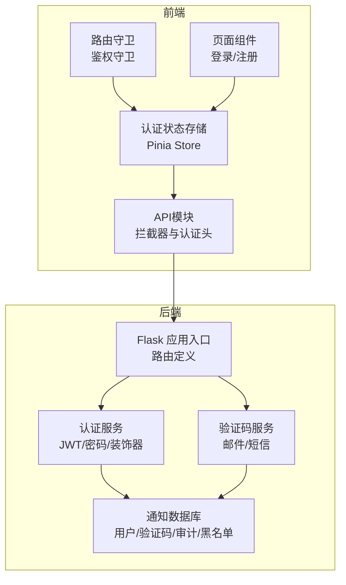

**图表来源**
- [app.py:53-275](file://python/app.py#L53-L275)
- [auth_server.py:47-390](file://python/auth_server.py#L47-L390)
- [src/auth_service.py:9-187](file://python/src/auth_service.py#L9-L187)
- [src/notification_db.py:6-357](file://python/src/notification_db.py#L6-L357)
- [src/notifications/verification_service.py:7-108](file://python/src/notifications/verification_service.py#L7-L108)
- [python-web/src/api/index.js:11-59](file://python-web/src/api/index.js#L11-L59)
- [python-web/src/stores/auth.js:5-74](file://python-web/src/stores/auth.js#L5-L74)
- [python-web/src/router/index.js:134-147](file://python-web/src/router/index.js#L134-L147)

**章节来源**
- [app.py:18-28](file://python/app.py#L18-L28)
- [auth_server.py:9-17](file://python/auth_server.py#L9-L17)
- [src/auth_service.py:9-187](file://python/src/auth_service.py#L9-L187)
- [src/notification_db.py:6-104](file://python/src/notification_db.py#L6-L104)
- [src/notifications/verification_service.py:7-108](file://python/src/notifications/verification_service.py#L7-L108)
- [python-web/src/api/index.js:3-9](file://python-web/src/api/index.js#L3-L9)
- [python-web/src/stores/auth.js:5-74](file://python-web/src/stores/auth.js#L5-L74)
- [python-web/src/router/index.js:134-147](file://python-web/src/router/index.js#L134-L147)

## 核心组件
- 认证服务：负责密码哈希/校验、JWT签发/解码、访问/刷新令牌生成、登录限制与锁定、Token黑名单、装饰器鉴权。
- 数据访问层：封装MySQL连接、用户表、验证码表、Token黑名单表、密码历史表、审计日志表的CRUD。
- 验证码服务：支持邮箱/短信验证码生成、发送、校验与过期控制。
- 前端API拦截器：统一注入Authorization头，处理401并自动刷新Access Token。
- 前端状态与路由：Pinia存储Token与用户信息，路由守卫控制访问权限。

**章节来源**
- [src/auth_service.py:9-187](file://python/src/auth_service.py#L9-L187)
- [src/notification_db.py:6-357](file://python/src/notification_db.py#L6-L357)
- [src/notifications/verification_service.py:7-108](file://python/src/notifications/verification_service.py#L7-L108)
- [python-web/src/api/index.js:11-59](file://python-web/src/api/index.js#L11-L59)
- [python-web/src/stores/auth.js:5-74](file://python-web/src/stores/auth.js#L5-L74)
- [python-web/src/router/index.js:134-147](file://python-web/src/router/index.js#L134-L147)

## 架构总览
认证系统遵循前后端分离设计，后端提供REST接口，前端通过API模块统一调用，并在拦截器中完成Token刷新与权限控制。

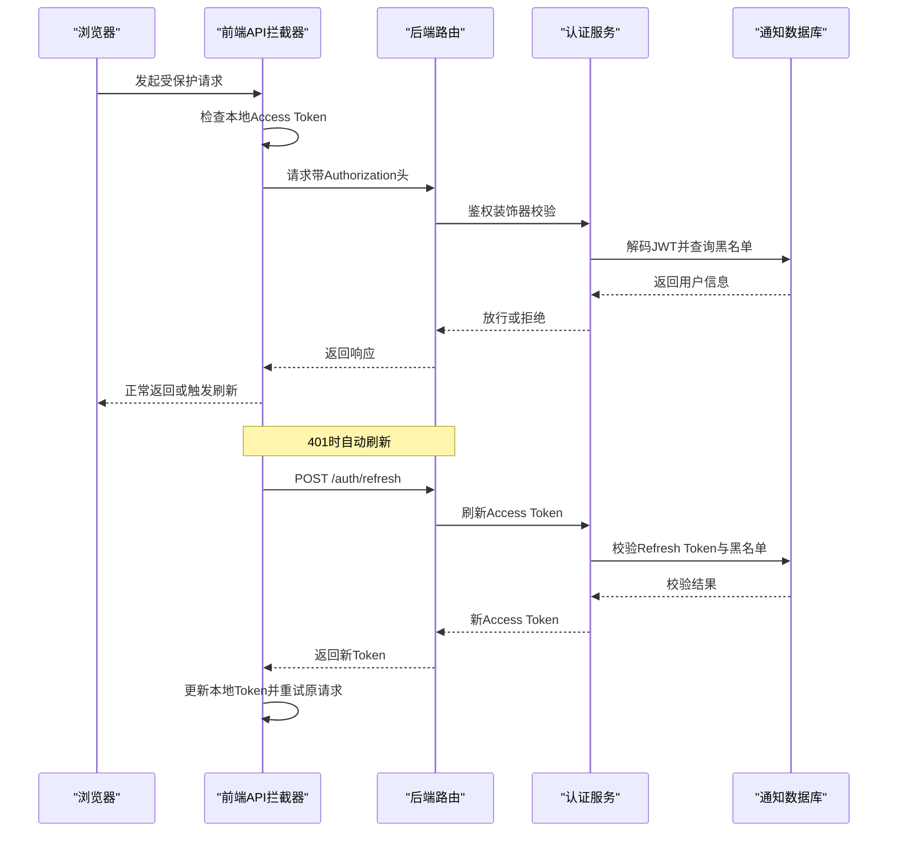

**图表来源**
- [python-web/src/api/index.js:11-59](file://python-web/src/api/index.js#L11-L59)
- [app.py:126-139](file://python/app.py#L126-L139)
- [src/auth_service.py:120-136](file://python/src/auth_service.py#L120-L136)
- [src/auth_service.py:58-66](file://python/src/auth_service.py#L58-L66)

**章节来源**
- [python-web/src/api/index.js:11-59](file://python-web/src/api/index.js#L11-L59)
- [app.py:126-139](file://python/app.py#L126-L139)
- [src/auth_service.py:120-136](file://python/src/auth_service.py#L120-L136)
- [src/auth_service.py:58-66](file://python/src/auth_service.py#L58-L66)

## 详细组件分析

### JWT令牌生成与验证机制
- 密钥与算法：使用对称密钥与指定算法生成JWT。
- 访问令牌：短期有效，用于日常受保护资源访问。
- 刷新令牌：长期有效但有限期，仅用于换取新的访问令牌。
- 解码与校验：统一解码逻辑，捕获过期与非法Token异常。
- 黑名单策略：登出或异常场景将Token加入黑名单，防止复用。

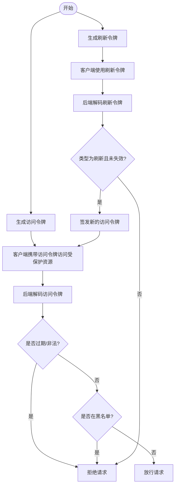

**图表来源**
- [src/auth_service.py:27-45](file://python/src/auth_service.py#L27-L45)
- [src/auth_service.py:47-56](file://python/src/auth_service.py#L47-L56)
- [src/auth_service.py:58-66](file://python/src/auth_service.py#L58-L66)
- [src/auth_service.py:120-136](file://python/src/auth_service.py#L120-L136)

**章节来源**
- [src/auth_service.py:9-187](file://python/src/auth_service.py#L9-L187)

### 密码哈希算法与强度校验
- 后端密码：使用bcrypt进行哈希与校验，确保不可逆性与抗彩虹表能力。
- 前端强度：基于长度、大小写、数字、特殊字符等维度计算强度等级，提示用户提升密码复杂度。
- 密码历史：重置/修改密码时检查历史哈希，避免重复使用近期密码。

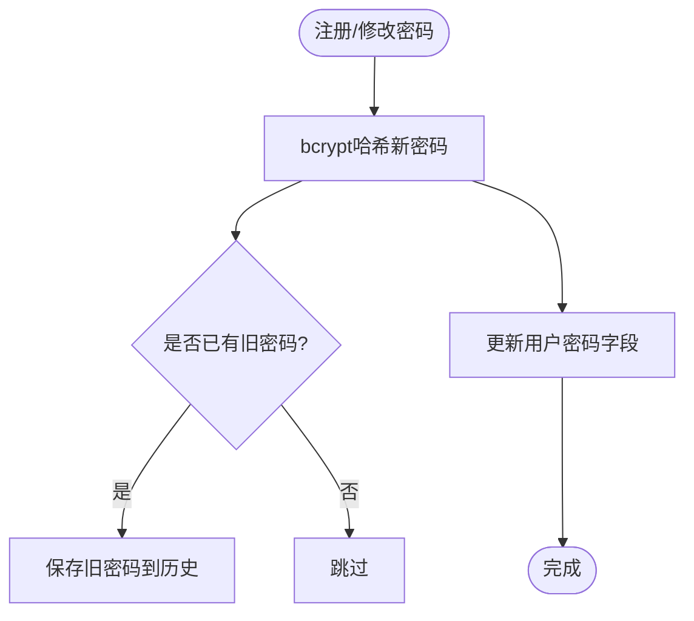

**图表来源**
- [src/auth_service.py:20-25](file://python/src/auth_service.py#L20-L25)
- [src/auth_service.py:138-156](file://python/src/auth_service.py#L138-L156)
- [src/notification_db.py:313-332](file://python/src/notification_db.py#L313-L332)
- [python-web/src/views/Register.vue:171-179](file://python-web/src/views/Register.vue#L171-L179)

**章节来源**
- [src/auth_service.py:20-25](file://python/src/auth_service.py#L20-L25)
- [src/auth_service.py:138-156](file://python/src/auth_service.py#L138-L156)
- [src/notification_db.py:313-332](file://python/src/notification_db.py#L313-L332)
- [python-web/src/views/Register.vue:171-179](file://python-web/src/views/Register.vue#L171-L179)

### 用户会话管理与装饰器
- 登录装饰器：从Authorization头解析Bearer Token，校验类型与黑名单，注入用户上下文。
- 登出处理：将当前访问/刷新令牌加入黑名单，记录审计日志。
- 自动刷新：拦截器在401时使用刷新令牌换取新访问令牌，更新本地存储并重试原请求。

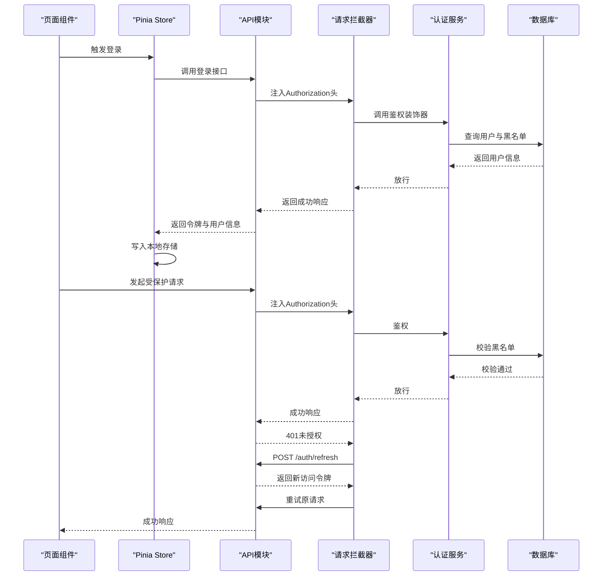

**图表来源**
- [python-web/src/stores/auth.js:5-74](file://python-web/src/stores/auth.js#L5-L74)
- [python-web/src/api/index.js:11-59](file://python-web/src/api/index.js#L11-L59)
- [src/auth_service.py:158-183](file://python/src/auth_service.py#L158-L183)
- [app.py:142-167](file://python/app.py#L142-L167)

**章节来源**
- [src/auth_service.py:158-183](file://python/src/auth_service.py#L158-L183)
- [app.py:142-167](file://python/app.py#L142-L167)
- [python-web/src/api/index.js:11-59](file://python-web/src/api/index.js#L11-L59)
- [python-web/src/stores/auth.js:5-74](file://python-web/src/stores/auth.js#L5-L74)

### 用户注册流程
- 输入校验：用户名长度、密码长度、邮箱/手机号格式与唯一性。
- 哈希处理：后端对明文密码进行bcrypt哈希。
- 创建用户：将用户名与哈希密码写入用户表。
- 审计日志：记录注册事件及客户端信息。

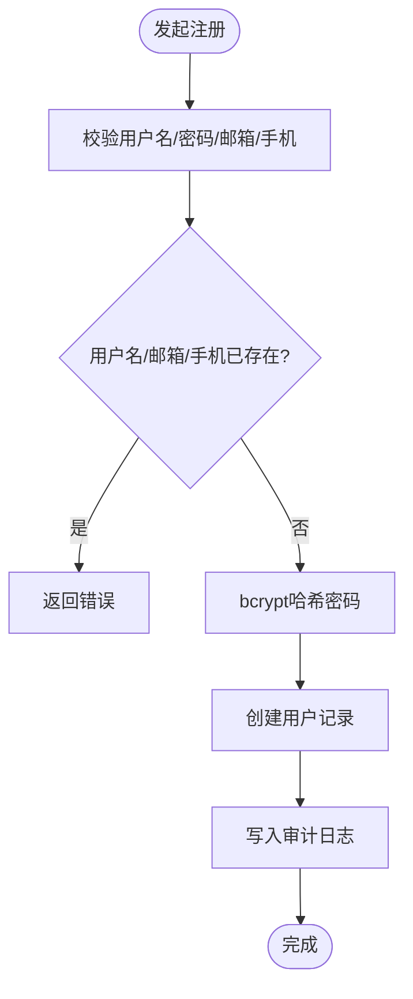

**图表来源**
- [app.py:53-96](file://python/app.py#L53-L96)
- [src/auth_service.py:20-25](file://python/src/auth_service.py#L20-L25)
- [src/notification_db.py:344-353](file://python/src/notification_db.py#L344-L353)
- [src/notification_db.py:334-342](file://python/src/notification_db.py#L334-L342)

**章节来源**
- [app.py:53-96](file://python/app.py#L53-L96)
- [src/auth_service.py:20-25](file://python/src/auth_service.py#L20-L25)
- [src/notification_db.py:344-353](file://python/src/notification_db.py#L344-L353)
- [src/notification_db.py:334-342](file://python/src/notification_db.py#L334-L342)

### 登录认证过程
- 凭证校验：根据用户名或邮箱查找用户，检查锁定状态与密码。
- 失败处理：累计登录失败次数，超过阈值锁定账户。
- 成功处理：重置失败次数与最后登录时间，签发访问/刷新令牌。
- 审计日志：记录登录事件。

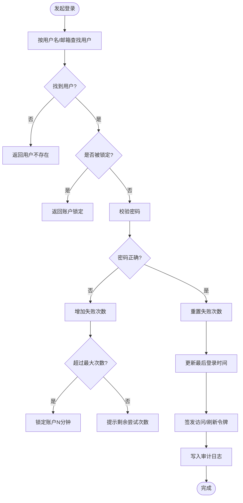

**图表来源**
- [src/auth_service.py:76-118](file://python/src/auth_service.py#L76-L118)
- [src/notification_db.py:261-295](file://python/src/notification_db.py#L261-L295)
- [app.py:99-124](file://python/app.py#L99-L124)

**章节来源**
- [src/auth_service.py:76-118](file://python/src/auth_service.py#L76-L118)
- [src/notification_db.py:261-295](file://python/src/notification_db.py#L261-L295)
- [app.py:99-124](file://python/app.py#L99-L124)

### Token刷新策略
- 刷新接口：接收刷新令牌，校验类型与黑名单，签发新的访问令牌。
- 前端拦截：401时自动调用刷新接口，更新本地令牌并重试原请求。
- 异常处理：刷新失败或令牌无效时清除本地存储并跳转登录页。

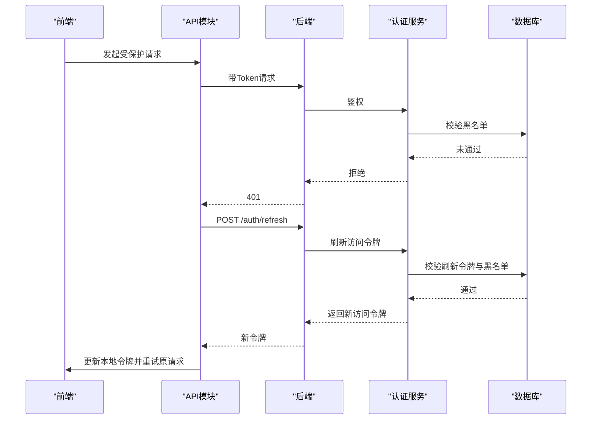

**图表来源**
- [app.py:126-139](file://python/app.py#L126-L139)
- [src/auth_service.py:120-136](file://python/src/auth_service.py#L120-L136)
- [python-web/src/api/index.js:22-59](file://python-web/src/api/index.js#L22-L59)

**章节来源**
- [app.py:126-139](file://python/app.py#L126-L139)
- [src/auth_service.py:120-136](file://python/src/auth_service.py#L120-L136)
- [python-web/src/api/index.js:22-59](file://python-web/src/api/index.js#L22-L59)

### 登出处理机制
- 接口处理：接收访问/刷新令牌，加入黑名单，记录审计日志。
- 前端清理：调用登出接口后清除本地存储，强制跳转登录页。

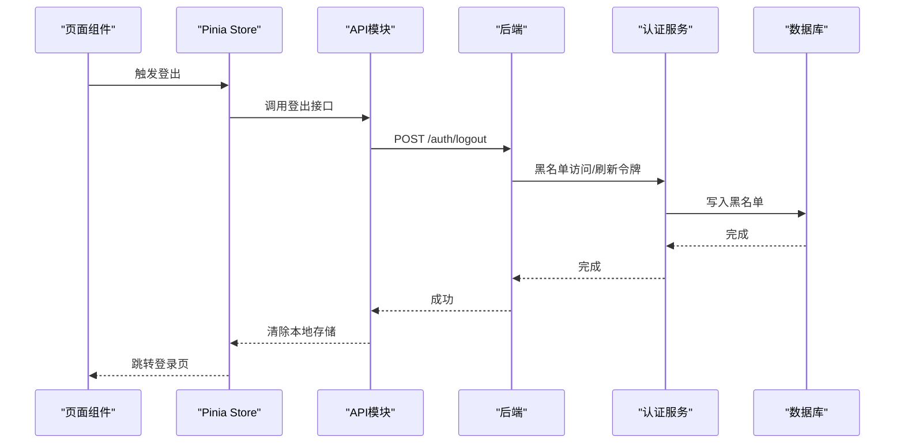

**图表来源**
- [app.py:142-167](file://python/app.py#L142-L167)
- [src/auth_service.py:61-66](file://python/src/auth_service.py#L61-L66)
- [src/notification_db.py:297-311](file://python/src/notification_db.py#L297-L311)
- [python-web/src/stores/auth.js:43-51](file://python-web/src/stores/auth.js#L43-L51)

**章节来源**
- [app.py:142-167](file://python/app.py#L142-L167)
- [src/auth_service.py:61-66](file://python/src/auth_service.py#L61-L66)
- [src/notification_db.py:297-311](file://python/src/notification_db.py#L297-L311)
- [python-web/src/stores/auth.js:43-51](file://python-web/src/stores/auth.js#L43-L51)

### 忘记密码流程
- 发送验证码：根据目标（邮箱/手机）发送验证码并持久化。
- 校验验证码：校验有效性与过期，标记已使用。
- 重置密码：校验通过后更新用户密码并记录审计日志。

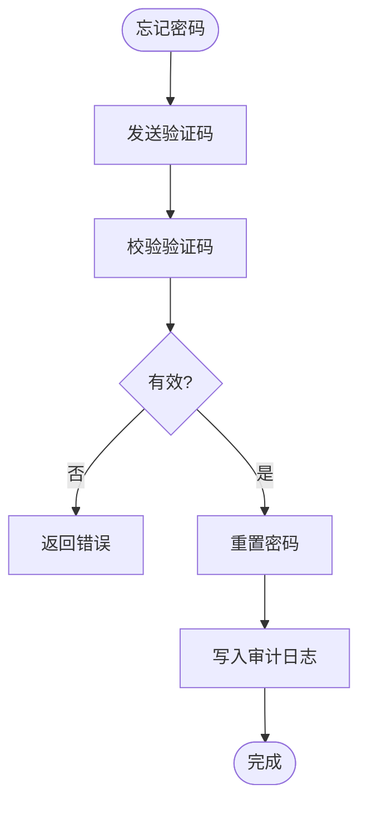

**图表来源**
- [app.py:170-239](file://python/app.py#L170-L239)
- [src/notifications/verification_service.py:25-101](file://python/src/notifications/verification_service.py#L25-L101)
- [src/notification_db.py:147-189](file://python/src/notification_db.py#L147-L189)
- [src/notification_db.py:334-342](file://python/src/notification_db.py#L334-L342)

**章节来源**
- [app.py:170-239](file://python/app.py#L170-L239)
- [src/notifications/verification_service.py:25-101](file://python/src/notifications/verification_service.py#L25-L101)
- [src/notification_db.py:147-189](file://python/src/notification_db.py#L147-L189)
- [src/notification_db.py:334-342](file://python/src/notification_db.py#L334-L342)

### 权限控制与安全最佳实践
- 路由守卫：通过meta.requiresAuth控制页面访问，未登录跳转登录页。
- 鉴权装饰器：统一校验Bearer Token、类型与黑名单。
- 前端拦截器：自动刷新与错误处理，避免重复登录。
- 审计日志：记录关键动作（注册、登录、登出、改密、重置）便于追踪。

**章节来源**
- [python-web/src/router/index.js:134-147](file://python-web/src/router/index.js#L134-L147)
- [src/auth_service.py:158-183](file://python/src/auth_service.py#L158-L183)
- [python-web/src/api/index.js:22-59](file://python-web/src/api/index.js#L22-L59)
- [src/notification_db.py:334-342](file://python/src/notification_db.py#L334-L342)

## 依赖分析
后端各模块职责清晰，耦合度低：路由层只负责参数解析与调用服务层；服务层封装业务规则；数据层专注数据库交互；验证码服务独立于认证服务但共享数据库。

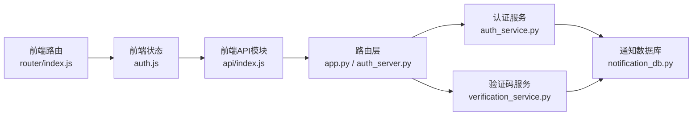

**图表来源**
- [app.py:53-275](file://python/app.py#L53-L275)
- [auth_server.py:47-390](file://python/auth_server.py#L47-L390)
- [src/auth_service.py:9-187](file://python/src/auth_service.py#L9-L187)
- [src/notification_db.py:6-357](file://python/src/notification_db.py#L6-L357)
- [src/notifications/verification_service.py:7-108](file://python/src/notifications/verification_service.py#L7-L108)
- [python-web/src/api/index.js:11-59](file://python-web/src/api/index.js#L11-L59)
- [python-web/src/stores/auth.js:5-74](file://python-web/src/stores/auth.js#L5-L74)
- [python-web/src/router/index.js:134-147](file://python-web/src/router/index.js#L134-L147)

**章节来源**
- [app.py:53-275](file://python/app.py#L53-L275)
- [auth_server.py:47-390](file://python/auth_server.py#L47-L390)
- [src/auth_service.py:9-187](file://python/src/auth_service.py#L9-L187)
- [src/notification_db.py:6-357](file://python/src/notification_db.py#L6-L357)
- [src/notifications/verification_service.py:7-108](file://python/src/notifications/verification_service.py#L7-L108)
- [python-web/src/api/index.js:11-59](file://python-web/src/api/index.js#L11-L59)
- [python-web/src/stores/auth.js:5-74](file://python-web/src/stores/auth.js#L5-L74)
- [python-web/src/router/index.js:134-147](file://python-web/src/router/index.js#L134-L147)

## 性能考虑
- 数据库连接池与重连：连接断开自动重连，减少异常对请求的影响。
- 登录失败限制：通过失败次数与锁定时间降低暴力破解风险。
- Token有效期：短时访问令牌+刷新令牌，平衡安全性与用户体验。
- 前端拦截器：统一处理401与刷新，避免重复请求与不必要的网络往返。

[本节为通用建议，无需特定文件引用]

## 故障排查指南
- 登录频繁失败被锁定：检查用户锁定时间，等待解锁或联系管理员。
- 401未授权：确认本地Token是否过期，拦截器是否正确注入Authorization头。
- 刷新失败：确认刷新令牌有效且未加入黑名单，检查后端日志。
- 登出后仍可访问：确认黑名单写入成功，前端是否正确清除本地存储。
- 验证码无效或过期：确认验证码表记录与过期时间，检查发送渠道可用性。

**章节来源**
- [src/auth_service.py:67-74](file://python/src/auth_service.py#L67-L74)
- [src/auth_service.py:120-136](file://python/src/auth_service.py#L120-L136)
- [python-web/src/api/index.js:22-59](file://python-web/src/api/index.js#L22-L59)
- [src/notification_db.py:307-311](file://python/src/notification_db.py#L307-L311)
- [src/notifications/verification_service.py:83-101](file://python/src/notifications/verification_service.py#L83-L101)

## 结论
该认证系统通过JWT、bcrypt、黑名单与验证码机制构建了完整的身份认证闭环，结合前端拦截器与路由守卫实现了良好的用户体验与安全防护。建议在生产环境中进一步强化密钥管理、TLS传输、速率限制与多因子认证等措施。

[本节为总结，无需特定文件引用]

## 附录
- 前端页面与状态：登录、注册、路由守卫、Pinia存储。
- 后端路由：注册、登录、刷新、登出、忘记密码、个人资料等。
- 数据库表：users、verification_codes、token_blacklist、password_history、audit_logs。

**章节来源**
- [python-web/src/views/Login.vue:100-119](file://python-web/src/views/Login.vue#L100-L119)
- [python-web/src/views/Register.vue:234-260](file://python-web/src/views/Register.vue#L234-L260)
- [python-web/src/router/index.js:134-147](file://python-web/src/router/index.js#L134-L147)
- [python-web/src/stores/auth.js:5-74](file://python-web/src/stores/auth.js#L5-L74)
- [app.py:53-275](file://python/app.py#L53-L275)
- [src/notification_db.py:44-103](file://python/src/notification_db.py#L44-L103)