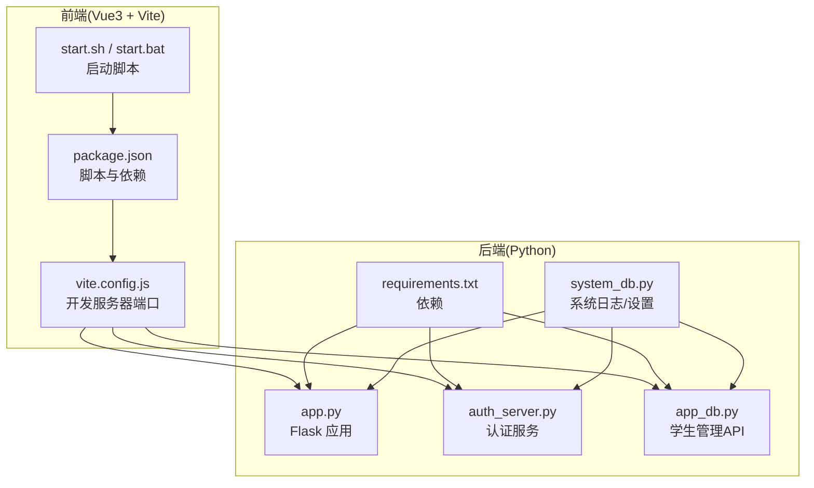
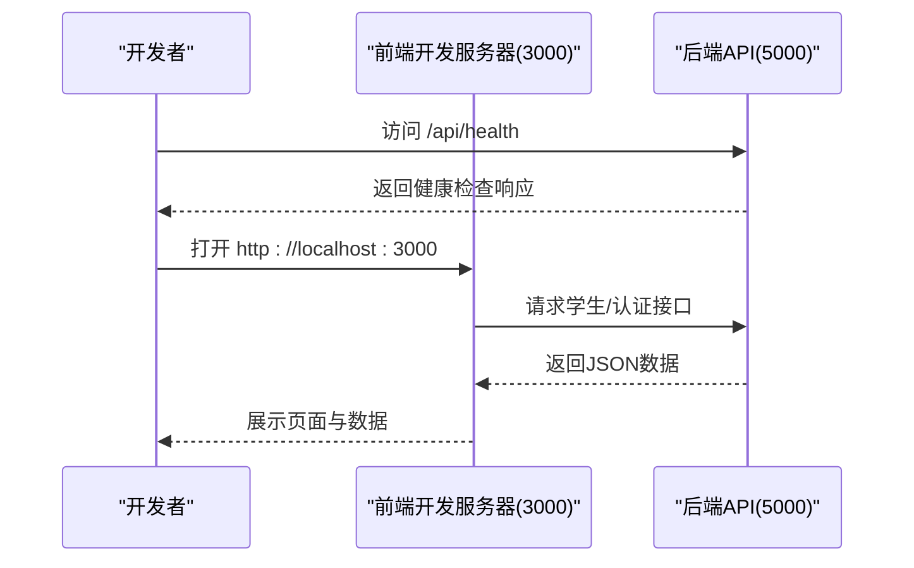
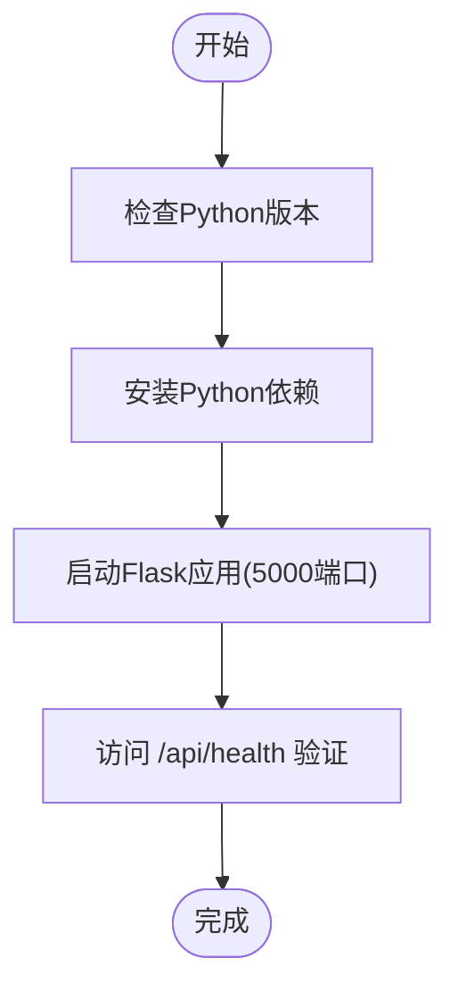
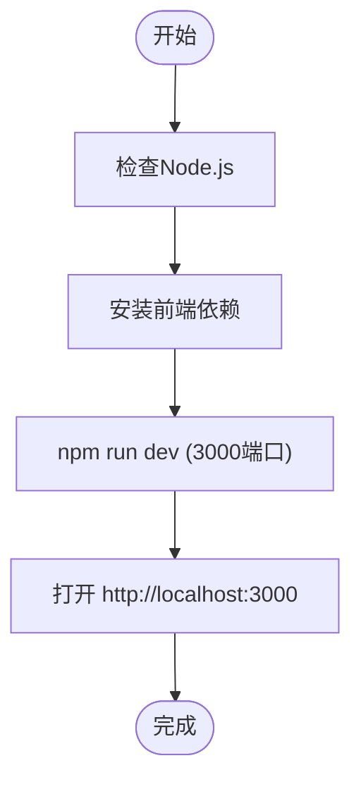
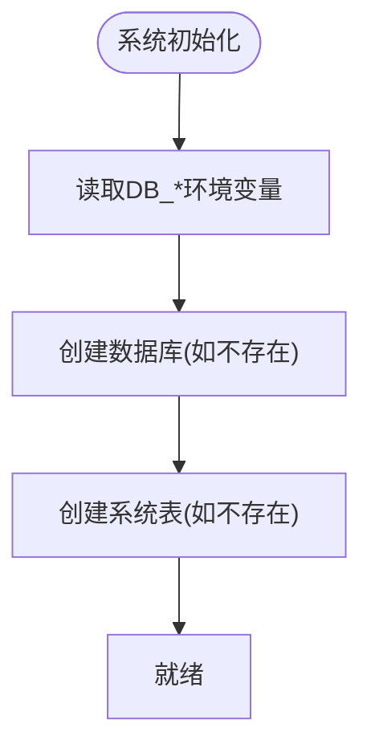
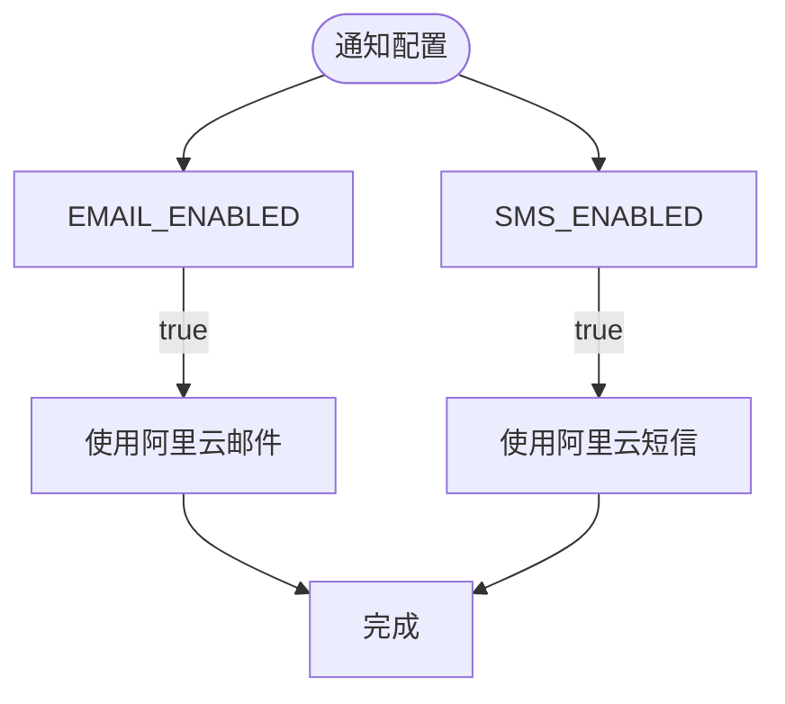
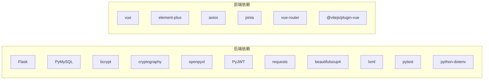

# 快速开始

<cite>
**本文引用的文件**   
- [requirements.txt](file://python/requirements.txt)
- [start.sh](file://python/start.sh)
- [start.bat](file://python/start.bat)
- [app.py](file://python/app.py)
- [auth_server.py](file://python/auth_server.py)
- [app_db.py](file://python/app_db.py)
- [package.json](file://python-web/package.json)
- [start.sh](file://python-web/start.sh)
- [start.bat](file://python-web/start.bat)
- [vite.config.js](file://python-web/vite.config.js)
- [.gitignore](file://python/.gitignore)
- [config.py](file://python/src/notifications/config.py)
- [system_db.py](file://python/system_db.py)
</cite>

## 目录
1. [简介](#简介)
2. [项目结构](#项目结构)
3. [核心组件](#核心组件)
4. [架构总览](#架构总览)
5. [详细组件分析](#详细组件分析)
6. [依赖分析](#依赖分析)
7. [性能考虑](#性能考虑)
8. [故障排查指南](#故障排查指南)
9. [结论](#结论)
10. [附录](#附录)

## 简介
本指南面向首次接触该学生管理系统的开发者，帮助你在约30分钟内完成环境准备、依赖安装、数据库配置与项目启动，并理解开发服务器与生产环境的差异。项目采用前后端分离架构：后端使用Flask提供REST API，前端使用Vue3 + Vite构建。后端同时支持用户认证与学生数据管理等能力；前端通过Axios与后端交互。

## 项目结构
- 后端（Python）
  - 核心应用：app.py、auth_server.py、app_db.py
  - 依赖清单：requirements.txt
  - 启动脚本：start.sh（Linux/macOS）、start.bat（Windows）
  - 数据库配置：system_db.py（MySQL连接与初始化）
  - 通知配置：src/notifications/config.py（短信/邮件开关与密钥）
- 前端（Vue3 + Vite）
  - 包管理与脚本：package.json
  - 启动脚本：start.sh（Linux/macOS）、start.bat（Windows）
  - 开发服务器端口：vite.config.js（默认3000）

**图表来源**
- [app.py:1-120](file://python/app.py#L1-L120)
- [auth_server.py:1-60](file://python/auth_server.py#L1-L60)
- [app_db.py:1-80](file://python/app_db.py#L1-L80)
- [system_db.py:1-40](file://python/system_db.py#L1-L40)
- [requirements.txt:1-13](file://python/requirements.txt#L1-L13)
- [package.json:1-24](file://python-web/package.json#L1-L24)
- [vite.config.js:1-11](file://python-web/vite.config.js#L1-L11)
- [start.sh:1-41](file://python-web/start.sh#L1-L41)
- [start.bat:1-43](file://python-web/start.bat#L1-L43)

**章节来源**
- [app.py:1-120](file://python/app.py#L1-L120)
- [auth_server.py:1-60](file://python/auth_server.py#L1-L60)
- [app_db.py:1-80](file://python/app_db.py#L1-L80)
- [system_db.py:1-40](file://python/system_db.py#L1-L40)
- [requirements.txt:1-13](file://python/requirements.txt#L1-L13)
- [package.json:1-24](file://python-web/package.json#L1-L24)
- [vite.config.js:1-11](file://python-web/vite.config.js#L1-L11)
- [start.sh:1-41](file://python-web/start.sh#L1-L41)
- [start.bat:1-43](file://python-web/start.bat#L1-L43)

## 核心组件
- 后端Flask应用
  - 跨域配置允许前端地址访问
  - 提供认证、爬虫、任务、系统日志等接口
- 前端Vue3应用
  - 通过Vite本地开发，端口默认3000
  - 通过Axios与后端API交互
- 数据库
  - 默认使用MySQL，系统自动创建数据库与表
  - 支持通过环境变量覆盖连接参数

**章节来源**
- [app.py:18-28](file://python/app.py#L18-L28)
- [auth_server.py:9-17](file://python/auth_server.py#L9-L17)
- [app_db.py:36-44](file://python/app_db.py#L36-L44)
- [system_db.py:13-24](file://python/system_db.py#L13-L24)

## 架构总览
后端提供统一API服务，前端通过本地开发服务器访问后端。开发阶段后端监听5000端口，前端默认3000端口；生产环境建议通过反向代理统一对外暴露。

**图表来源**
- [app.py:464-466](file://python/app.py#L464-L466)
- [auth_server.py:36-44](file://python/auth_server.py#L36-L44)
- [app_db.py:610-627](file://python/app_db.py#L610-L627)
- [vite.config.js:6-9](file://python-web/vite.config.js#L6-L9)

## 详细组件分析

### 后端启动与端口
- 后端默认监听0.0.0.0:5000，可通过脚本自动安装依赖并启动
- 健康检查接口：/api/health 或 /health

**图表来源**
- [start.sh:8-39](file://python/start.sh#L8-L39)
- [start.bat:9-47](file://python/start.bat#L9-L47)
- [app.py:464-466](file://python/app.py#L464-L466)

**章节来源**
- [start.sh:8-39](file://python/start.sh#L8-L39)
- [start.bat:9-47](file://python/start.bat#L9-L47)
- [app.py:464-466](file://python/app.py#L464-L466)

### 前端启动与端口
- 前端默认开发端口3000，启动前会安装依赖
- Windows与Linux/macOS分别提供启动脚本

**图表来源**
- [start.sh:8-41](file://python-web/start.sh#L8-L41)
- [start.bat:8-43](file://python-web/start.bat#L8-L43)
- [vite.config.js:6-9](file://python-web/vite.config.js#L6-L9)

**章节来源**
- [start.sh:8-41](file://python-web/start.sh#L8-L41)
- [start.bat:8-43](file://python-web/start.bat#L8-L43)
- [vite.config.js:6-9](file://python-web/vite.config.js#L6-L9)

### 数据库配置与初始化
- 默认连接参数来自环境变量，若未设置则使用内置默认值
- 系统自动创建数据库与表（系统日志、设置、用户偏好）
- 建议在本地先启动MySQL服务，并确保端口可达

**图表来源**
- [system_db.py:13-46](file://python/system_db.py#L13-L46)
- [system_db.py:47-97](file://python/system_db.py#L47-L97)

**章节来源**
- [system_db.py:13-46](file://python/system_db.py#L13-L46)
- [system_db.py:47-97](file://python/system_db.py#L47-L97)

### 通知配置（短信/邮件）
- 通过环境变量控制是否启用短信/邮件验证码
- 若启用，需要正确配置阿里云密钥与签名模板

**图表来源**
- [config.py:1-20](file://python/src/notifications/config.py#L1-L20)

**章节来源**
- [config.py:1-20](file://python/src/notifications/config.py#L1-L20)

## 依赖分析
- 后端依赖
  - Flask、Flask-CORS、PyMySQL、bcrypt、cryptography、openpyxl、PyJWT、requests、beautifulsoup4、lxml、pytest、python-dotenv
- 前端依赖
  - Vue3、Element Plus、Axios、Pinia、Vue Router、Vite

**图表来源**
- [requirements.txt:1-13](file://python/requirements.txt#L1-L13)
- [package.json:11-22](file://python-web/package.json#L11-L22)

**章节来源**
- [requirements.txt:1-13](file://python/requirements.txt#L1-L13)
- [package.json:11-22](file://python-web/package.json#L11-L22)

## 性能考虑
- 开发阶段使用Flask自带调试服务器，适合本地开发
- 生产环境建议使用WSGI服务器（如Gunicorn）与反向代理（如Nginx），并开启静态资源缓存
- 前端构建产物用于生产部署，避免直接使用Vite开发服务器

[本节为通用建议，无需特定文件引用]

## 故障排查指南
- 启动后端报端口占用
  - 修改Flask监听端口或释放5000端口占用
  - 参考：[app.py:464-466](file://python/app.py#L464-L466)
- 启动前端报端口占用
  - 修改vite.config.js中的端口或释放3000端口占用
  - 参考：[vite.config.js:6-9](file://python-web/vite.config.js#L6-L9)
- 无法连接数据库
  - 检查MySQL服务状态与网络连通性
  - 确认环境变量DB_HOST/DB_PORT/DB_USER/DB_PASSWORD/DB_NAME
  - 参考：[system_db.py:13-24](file://python/system_db.py#L13-L24)
- 通知功能异常（短信/邮件）
  - 确认EMAIL_ENABLED/SMS_ENABLED为true，并正确配置阿里云密钥
  - 参考：[config.py:1-20](file://python/src/notifications/config.py#L1-L20)
- 跨域问题
  - 确认前端开发端口与后端CORS白名单一致
  - 参考：[app.py:18-28](file://python/app.py#L18-L28)、[auth_server.py:9-17](file://python/auth_server.py#L9-L17)

**章节来源**
- [app.py:18-28](file://python/app.py#L18-L28)
- [auth_server.py:9-17](file://python/auth_server.py#L9-L17)
- [vite.config.js:6-9](file://python-web/vite.config.js#L6-L9)
- [system_db.py:13-24](file://python/system_db.py#L13-L24)
- [config.py:1-20](file://python/src/notifications/config.py#L1-L20)

## 结论
按照本指南，你可以在30分钟内完成环境准备、依赖安装、数据库初始化与前后端启动。开发阶段后端监听5000端口，前端3000端口；生产部署时请使用WSGI与反向代理，并正确配置数据库与通知服务。

[本节为总结，无需特定文件引用]

## 附录

### 环境准备与安装步骤
- Python 3.8+
  - Linux/macOS: 使用包管理器安装Python 3.8+
  - Windows: 从官网下载安装
- Node.js
  - 从官网下载安装最新LTS版本
- MySQL
  - 本地安装并启动MySQL服务
  - 确保可从Python应用访问（默认端口3306或自定义端口）

**章节来源**
- [start.sh:8-15](file://python/start.sh#L8-L15)
- [start.bat:9-16](file://python/start.bat#L9-L16)
- [system_db.py:13-24](file://python/system_db.py#L13-L24)

### 依赖安装
- 后端
  - Linux/macOS: sh ../python/start.sh
  - Windows: 双击 ../python/start.bat 或 pip install -r requirements.txt
- 前端
  - Linux/macOS: cd python-web && sh start.sh
  - Windows: cd python-web && start.bat

**章节来源**
- [start.sh:18-25](file://python/start.sh#L18-L25)
- [start.bat:19-26](file://python/start.bat#L19-L26)
- [start.sh:18-25](file://python-web/start.sh#L18-L25)
- [start.bat:18-25](file://python-web/start.bat#L18-L25)

### 数据库配置
- 默认数据库名：crawler_manager（可在环境变量中覆盖）
- 自动创建表：system_logs、system_settings、user_preferences
- 环境变量参考：DB_HOST、DB_PORT、DB_USER、DB_PASSWORD、DB_NAME

**章节来源**
- [system_db.py:13-24](file://python/system_db.py#L13-L24)
- [system_db.py:47-97](file://python/system_db.py#L47-L97)

### 项目启动步骤（Windows）
- 启动后端
  - 打开终端，进入 python 目录，执行 start.bat
- 启动前端
  - 打开另一个终端，进入 python-web 目录，执行 start.bat
- 验证
  - 浏览器访问 http://localhost:3000
  - 后端健康检查：http://127.0.0.1:5000/api/health

**章节来源**
- [start.bat:29-47](file://python/start.bat#L29-L47)
- [start.bat:28-43](file://python-web/start.bat#L28-L43)
- [app.py:464-466](file://python/app.py#L464-L466)

### 项目启动步骤（Linux/macOS）
- 启动后端
  - 在终端执行 sh ../python/start.sh
- 启动前端
  - 在终端执行 sh python-web/start.sh
- 验证
  - 浏览器访问 http://localhost:3000
  - 后端健康检查：http://127.0.0.1:5000/api/health

**章节来源**
- [start.sh:28-39](file://python/start.sh#L28-L39)
- [start.sh:28-41](file://python-web/start.sh#L28-L41)
- [app.py:464-466](file://python/app.py#L464-L466)

### 开发服务器与生产环境
- 开发服务器
  - 后端：Flask debug模式，监听5000端口
  - 前端：Vite dev server，监听3000端口
- 生产环境
  - 后端：使用WSGI（如Gunicorn）+ Nginx
  - 前端：构建产物部署至Nginx或CDN

**章节来源**
- [app.py:464-466](file://python/app.py#L464-L466)
- [vite.config.js:6-9](file://python-web/vite.config.js#L6-L9)

### 常见问题与解决方案
- 端口被占用
  - 修改Flask端口或释放占用端口
  - 修改Vite端口：vite.config.js
- 依赖安装失败
  - 检查网络与镜像源，重新执行安装脚本
- 数据库连接失败
  - 确认MySQL服务运行、账户权限与网络连通
- 通知服务不可用
  - 设置EMAIL_ENABLED/SMS_ENABLED为true并配置阿里云密钥

**章节来源**
- [vite.config.js:6-9](file://python-web/vite.config.js#L6-L9)
- [system_db.py:13-24](file://python/system_db.py#L13-L24)
- [config.py:1-20](file://python/src/notifications/config.py#L1-L20)