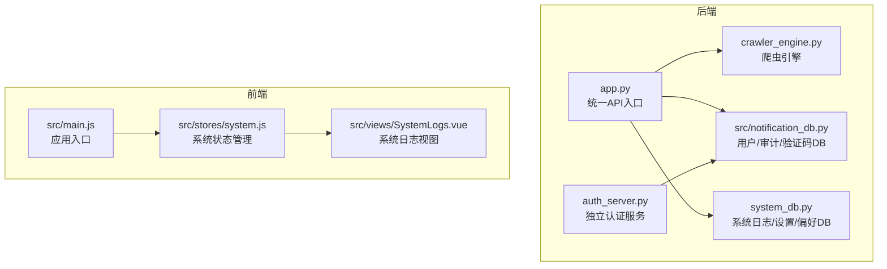
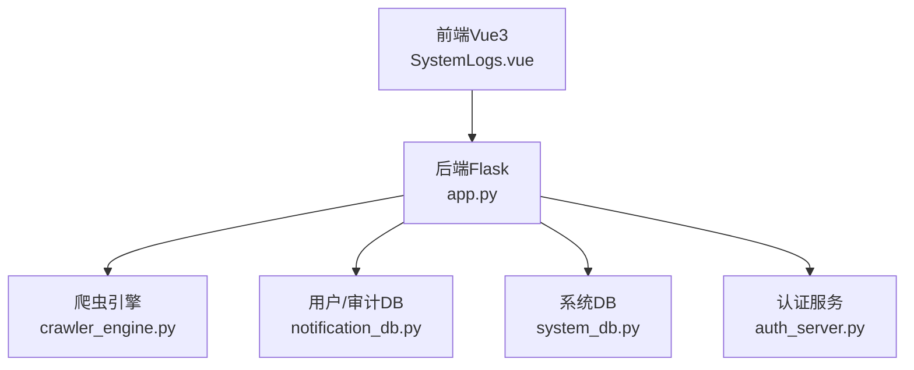
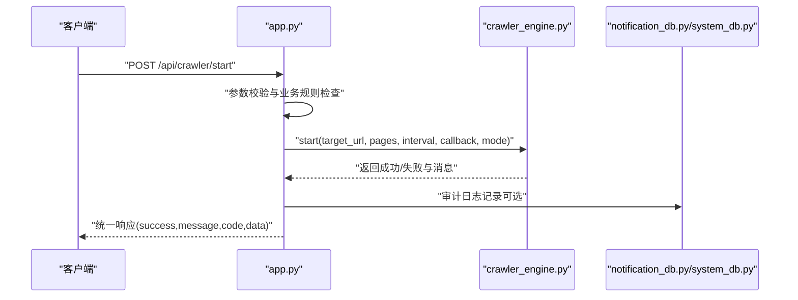
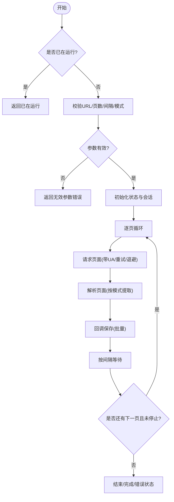
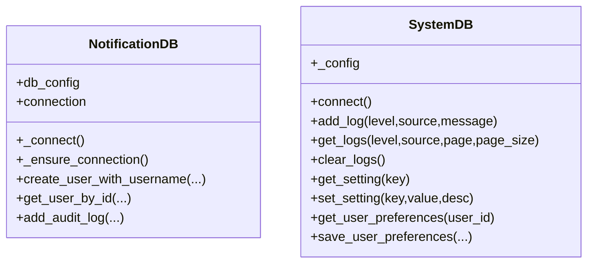
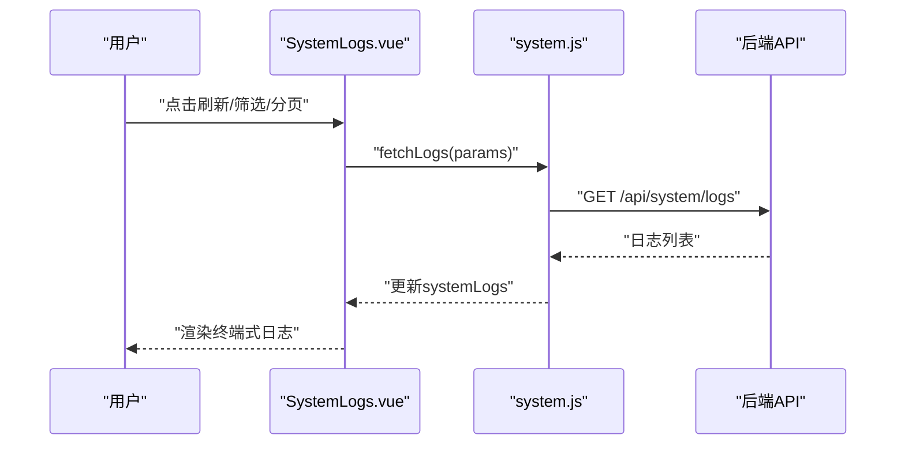
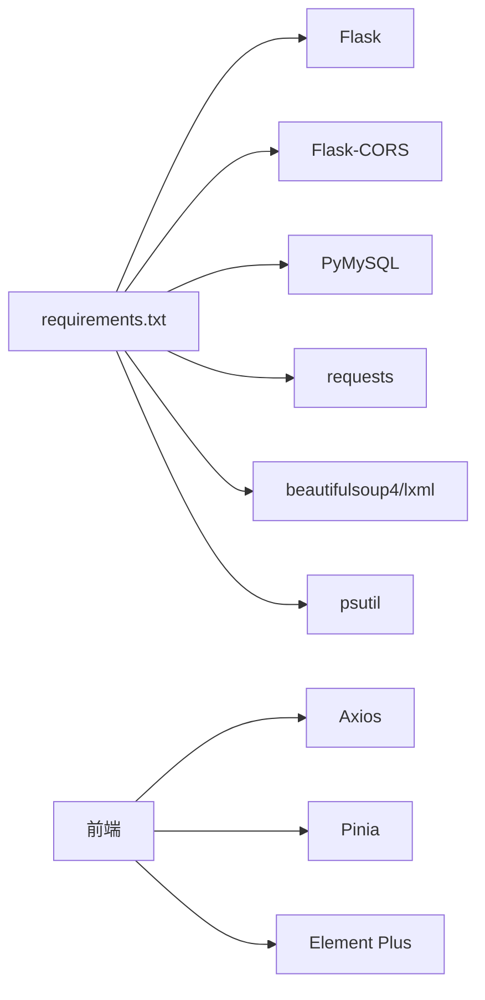

# 故障排除

<cite>
**本文引用的文件**
- [PROJECT_README.md](file://PROJECT_README.md)
- [python/app.py](file://python/app.py)
- [python/auth_server.py](file://python/auth_server.py)
- [python/crawler_engine.py](file://python/crawler_engine.py)
- [python/src/notification_db.py](file://python/src/notification_db.py)
- [python/system_db.py](file://python/system_db.py)
- [python-web/src/views/SystemLogs.vue](file://python-web/src/views/SystemLogs.vue)
- [python-web/src/stores/system.js](file://python-web/src/stores/system.js)
- [python-web/src/main.js](file://python-web/src/main.js)
- [python/requirements.txt](file://python/requirements.txt)
</cite>

## 目录
1. [简介](#简介)
2. [项目结构](#项目结构)
3. [核心组件](#核心组件)
4. [架构总览](#架构总览)
5. [详细组件分析](#详细组件分析)
6. [依赖分析](#依赖分析)
7. [性能考虑](#性能考虑)
8. [故障排除指南](#故障排除指南)
9. [结论](#结论)
10. [附录](#附录)

## 简介
本指南面向开发者与运维人员，围绕“可视化爬虫管理系统”的后端（Flask + PyMySQL）与前端（Vue3 + Pinia）展开，提供系统化的故障排除方法。内容覆盖数据库连接问题、API 调用失败、前端组件异常、爬虫执行错误等典型场景；并给出日志分析方法、性能诊断要点、监控指标解读、系统健康检查以及问题反馈与升级流程建议。

## 项目结构
- 后端（python）：统一入口 app.py 提供认证与爬虫相关 API；独立认证服务 auth_server.py 作为历史版本保留；核心爬虫引擎 crawler_engine.py；数据库层 notification_db.py、system_db.py。
- 前端（python-web）：Vue3 应用，使用 Pinia 状态管理，通过 API 客户端与后端交互；SystemLogs.vue 提供系统日志展示与筛选。

图表来源
- [python/app.py:18-35](file://python/app.py#L18-L35)
- [python/auth_server.py:9-17](file://python/auth_server.py#L9-L17)
- [python/crawler_engine.py:10-63](file://python/crawler_engine.py#L10-L63)
- [python/src/notification_db.py:6-17](file://python/src/notification_db.py#L6-L17)
- [python/system_db.py:7-23](file://python/system_db.py#L7-L23)
- [python-web/src/main.js:1-16](file://python-web/src/main.js#L1-L16)
- [python-web/src/views/SystemLogs.vue:1-96](file://python-web/src/views/SystemLogs.vue#L1-L96)
- [python-web/src/stores/system.js:1-168](file://python-web/src/stores/system.js#L1-L168)

章节来源
- [PROJECT_README.md:63-97](file://PROJECT_README.md#L63-L97)
- [python/app.py:18-35](file://python/app.py#L18-L35)
- [python/auth_server.py:9-17](file://python/auth_server.py#L9-L17)
- [python/crawler_engine.py:10-63](file://python/crawler_engine.py#L10-L63)
- [python/src/notification_db.py:6-17](file://python/src/notification_db.py#L6-L17)
- [python/system_db.py:7-23](file://python/system_db.py#L7-L23)
- [python-web/src/main.js:1-16](file://python-web/src/main.js#L1-L16)
- [python-web/src/views/SystemLogs.vue:1-96](file://python-web/src/views/SystemLogs.vue#L1-L96)
- [python-web/src/stores/system.js:1-168](file://python-web/src/stores/system.js#L1-L168)

## 核心组件
- 统一 API 入口：提供认证、个人信息、爬虫控制与数据查询等接口，集中进行参数校验与错误码返回。
- 独立认证服务：保留历史版本，便于对比与迁移。
- 爬虫引擎：多线程、反爬策略、重试机制、状态管理与回调保存。
- 数据库层：
  - 用户/审计/验证码/密码历史：notification_db.py
  - 系统日志/设置/用户偏好：system_db.py
- 前端系统日志视图：过滤、分页、导出、清空等操作，便于快速定位问题。

章节来源
- [python/app.py:53-470](file://python/app.py#L53-L470)
- [python/auth_server.py:47-431](file://python/auth_server.py#L47-L431)
- [python/crawler_engine.py:10-533](file://python/crawler_engine.py#L10-L533)
- [python/src/notification_db.py:6-357](file://python/src/notification_db.py#L6-L357)
- [python/system_db.py:7-317](file://python/system_db.py#L7-L317)
- [python-web/src/views/SystemLogs.vue:1-360](file://python-web/src/views/SystemLogs.vue#L1-L360)
- [python-web/src/stores/system.js:1-168](file://python-web/src/stores/system.js#L1-L168)

## 架构总览
后端采用 Flask，前端采用 Vue3 + Pinia，两者通过 REST API 通信。系统日志既可在后端写入数据库，也可在前端进行展示与筛选。

图表来源
- [python/app.py:18-35](file://python/app.py#L18-L35)
- [python/crawler_engine.py:10-63](file://python/crawler_engine.py#L10-L63)
- [python/src/notification_db.py:6-17](file://python/src/notification_db.py#L6-L17)
- [python/system_db.py:7-23](file://python/system_db.py#L7-L23)
- [python-web/src/views/SystemLogs.vue:1-96](file://python-web/src/views/SystemLogs.vue#L1-L96)

## 详细组件分析

### 组件A：统一API入口（认证+爬虫）
- 职责：集中处理认证、个人信息、爬虫控制与数据查询；统一返回格式与错误码。
- 关键点：
  - 参数校验与边界检查（如 URL、页数、间隔、模式等）。
  - 异常捕获与错误码映射（如 INVALID_URL、INVALID_PAGES、INVALID_INTERVAL、INVALID_MODE、START_FAILED、STOP_FAILED、STATUS_FAILED、QUERY_FAILED、CLEAR_FAILED、EXPORT_FAILED 等）。
  - 审计日志记录（注册、登录、登出、重置/修改密码等）。

图表来源
- [python/app.py:306-351](file://python/app.py#L306-L351)
- [python/crawler_engine.py:464-497](file://python/crawler_engine.py#L464-L497)
- [python/src/notification_db.py:334-342](file://python/src/notification_db.py#L334-L342)

章节来源
- [python/app.py:306-351](file://python/app.py#L306-L351)
- [python/app.py:354-366](file://python/app.py#L354-L366)
- [python/app.py:369-379](file://python/app.py#L369-L379)
- [python/app.py:382-410](file://python/app.py#L382-L410)
- [python/app.py:413-424](file://python/app.py#L413-L424)
- [python/app.py:427-465](file://python/app.py#L427-L465)

### 组件B：爬虫引擎（CrawlerEngine）
- 职责：多线程抓取、请求头伪装、重试与退避、解析与去重、状态上报。
- 关键点：
  - 状态字段：status、collected_count、current_page、total_pages、elapsed_seconds、error_message。
  - 支持模式：link/image/mixed；对图片懒加载、CSS背景图、srcset 等多场景提取。
  - 错误处理：403、超时、连接错误、5xx 服务器错误的重试策略与最终失败上报。

图表来源
- [python/crawler_engine.py:400-463](file://python/crawler_engine.py#L400-L463)
- [python/crawler_engine.py:113-169](file://python/crawler_engine.py#L113-L169)
- [python/crawler_engine.py:171-398](file://python/crawler_engine.py#L171-L398)

章节来源
- [python/crawler_engine.py:464-497](file://python/crawler_engine.py#L464-L497)
- [python/crawler_engine.py:499-506](file://python/crawler_engine.py#L499-L506)
- [python/crawler_engine.py:508-517](file://python/crawler_engine.py#L508-L517)
- [python/crawler_engine.py:519-530](file://python/crawler_engine.py#L519-L530)

### 组件C：数据库层（NotificationDB/SystemDB）
- NotificationDB：用户、验证码、Token黑名单、密码历史、审计日志。
- SystemDB：系统日志、系统设置、用户偏好。
- 关键点：
  - 连接管理与自动重连（ping/reconnect）。
  - 表结构初始化与索引设计。
  - 日志写入、查询、清空等操作。

图表来源
- [python/src/notification_db.py:6-357](file://python/src/notification_db.py#L6-L357)
- [python/system_db.py:7-317](file://python/system_db.py#L7-L317)

章节来源
- [python/src/notification_db.py:19-39](file://python/src/notification_db.py#L19-L39)
- [python/system_db.py:96-182](file://python/system_db.py#L96-L182)

### 组件D：前端系统日志（SystemLogs.vue + system.js）
- 职责：展示系统日志、过滤级别/关键字/日期范围、分页、清空、导出。
- 关键点：
  - 通过 Pinia store 调用 systemAPI 获取/清空日志。
  - 前端本地计算统计（今日总数、今日错误数）与分页。

图表来源
- [python-web/src/views/SystemLogs.vue:119-219](file://python-web/src/views/SystemLogs.vue#L119-L219)
- [python-web/src/stores/system.js:121-133](file://python-web/src/stores/system.js#L121-L133)
- [python/app.py:468-470](file://python/app.py#L468-L470)

章节来源
- [python-web/src/views/SystemLogs.vue:1-360](file://python-web/src/views/SystemLogs.vue#L1-L360)
- [python-web/src/stores/system.js:1-168](file://python-web/src/stores/system.js#L1-L168)

## 依赖分析
- 后端依赖：Flask、Flask-CORS、PyMySQL、cryptography、bcrypt、PyJWT、requests、beautifulsoup4、lxml、psutil 等。
- 前端依赖：Vue3、Element Plus、Axios、Pinia、Vue Router 等。
- 组件耦合：
  - app.py 与 crawler_engine.py、notification_db.py、system_db.py 的耦合度较高，集中在统一入口处。
  - 前端通过 API 与后端解耦，store 与视图解耦。

图表来源
- [python/requirements.txt:1-14](file://python/requirements.txt#L1-L14)

章节来源
- [python/requirements.txt:1-14](file://python/requirements.txt#L1-L14)

## 性能考虑
- 爬虫性能：
  - 请求间隔与并发：合理设置 interval_seconds，避免触发目标站点风控。
  - 重试与退避：对 403、5xx、超时等进行指数退避，减少无效重试。
  - 解析复杂度：解析器对大页面的内存与 CPU 占用，建议分页与限流。
- 数据库性能：
  - 索引：system_logs 的 level/source/created_at 索引有助于查询。
  - 连接池与自动重连：避免长事务与频繁重建连接。
- 前端性能：
  - 日志分页与虚拟滚动：避免一次性渲染大量日志。
  - 过滤与搜索：前端本地过滤，注意大数据量下的性能影响。

## 故障排除指南

### 一、数据库连接问题
- 症状
  - 后端启动时报错：数据库连接失败、无法创建表。
  - 前端日志页面无法加载或清空。
- 诊断步骤
  - 检查数据库服务是否运行、端口与凭据是否正确（host/port/user/password/database）。
  - 检查 notification_db.py 与 system_db.py 的连接配置与环境变量。
  - 查看后端日志输出（print/标准错误），定位连接异常。
- 解决方案
  - 修正数据库配置（host/port/user/password/database）。
  - 确保数据库存在且具备相应权限。
  - 对于 system_db，确认数据库自动创建与表初始化逻辑执行成功。
  - 若网络不稳定，启用自动重连与重试逻辑。

章节来源
- [python/src/notification_db.py:19-39](file://python/src/notification_db.py#L19-L39)
- [python/system_db.py:32-46](file://python/system_db.py#L32-L46)
- [python/system_db.py:96-97](file://python/system_db.py#L96-L97)

### 二、API 调用失败
- 症状
  - 前端请求 4xx/5xx，统一响应包含错误码与 message。
  - 常见错误码：INVALID_URL、INVALID_PAGES、INVALID_INTERVAL、INVALID_MODE、START_FAILED、STOP_FAILED、STATUS_FAILED、QUERY_FAILED、CLEAR_FAILED、EXPORT_FAILED、REGISTER_FAILED、LOGIN_FAILED、REFRESH_FAILED、LOGOUT_FAILED、SEND_CODE_FAILED、VERIFY_FAILED、RESET_FAILED、CHANGE_FAILED、GET_PROFILE_FAILED 等。
- 诊断步骤
  - 检查请求 URL、方法、头部（Content-Type、Authorization）。
  - 根据错误码定位具体环节（参数校验、引擎状态、数据库操作、文件导出等）。
  - 查看后端异常捕获与错误码映射。
- 解决方案
  - 修正请求参数（URL 以 http/https 开头、页数与间隔在允许范围内、模式合法）。
  - 确保爬虫引擎处于 idle 状态再启动，或在运行中停止后再启动。
  - 检查回调保存函数是否正常（批量保存）。
  - 对于导出失败，确认数据存在与文件编码。

章节来源
- [python/app.py:316-341](file://python/app.py#L316-L341)
- [python/app.py:343-346](file://python/app.py#L343-L346)
- [python/app.py:357-361](file://python/app.py#L357-L361)
- [python/app.py:373-374](file://python/app.py#L373-L374)
- [python/app.py:395-405](file://python/app.py#L395-L405)
- [python/app.py:418-419](file://python/app.py#L418-L419)
- [python/app.py:431-436](file://python/app.py#L431-L436)
- [python/app.py:442-460](file://python/app.py#L442-L460)

### 三、前端组件异常
- 症状
  - SystemLogs.vue 无法渲染日志、筛选无效、分页异常。
  - 点击清空/导出无响应。
- 诊断步骤
  - 检查前端 store 是否正确调用 systemAPI 并更新 systemLogs。
  - 检查 axios 配置与跨域设置（CORS）。
  - 检查浏览器控制台是否有网络错误或脚本异常。
- 解决方案
  - 确保后端 /api/health 可用，前端能正常访问后端。
  - 检查 Element Plus 与路由配置是否正确。
  - 对大数据量日志，建议优化前端分页与过滤逻辑。

章节来源
- [python-web/src/views/SystemLogs.vue:119-219](file://python-web/src/views/SystemLogs.vue#L119-L219)
- [python-web/src/stores/system.js:121-133](file://python-web/src/stores/system.js#L121-L133)
- [python/app.py:468-470](file://python/app.py#L468-L470)
- [python-web/src/main.js:1-16](file://python-web/src/main.js#L1-L16)

### 四、爬虫执行错误
- 症状
  - 爬虫状态为 error，error_message 显示具体错误。
  - 目标站点返回 403/5xx，或超时/连接失败。
- 诊断步骤
  - 查看爬虫状态接口返回的 status、current_page、error_message。
  - 检查 UA/语言/Accept 等请求头是否被目标站点识别。
  - 检查重试与退避逻辑是否生效。
- 解决方案
  - 适当增加请求间隔，降低并发。
  - 更换 UA/语言组合，模拟真实用户行为。
  - 对 403/5xx 场景进行退避重试，必要时更换代理（若接入代理池）。
  - 检查回调保存是否抛出异常导致状态变为 error。

章节来源
- [python/crawler_engine.py:508-517](file://python/crawler_engine.py#L508-L517)
- [python/crawler_engine.py:113-169](file://python/crawler_engine.py#L113-L169)
- [python/crawler_engine.py:425-429](file://python/crawler_engine.py#L425-L429)

### 五、日志分析方法
- 后端日志
  - 使用统一响应中的 code 字段快速定位错误类型。
  - 审计日志记录关键操作（注册、登录、登出、重置/修改密码）。
- 前端日志
  - SystemLogs.vue 支持按级别（INFO/WARNING/ERROR）、关键字、日期范围筛选。
  - 统计今日日志总数与今日错误数，辅助快速定位。

章节来源
- [python/app.py:85-91](file://python/app.py#L85-L91)
- [python/app.py:112-118](file://python/app.py#L112-L118)
- [python/app.py:228-234](file://python/app.py#L228-L234)
- [python/app.py:263-269](file://python/app.py#L263-L269)
- [python-web/src/views/SystemLogs.vue:148-181](file://python-web/src/views/SystemLogs.vue#L148-L181)

### 六、性能问题诊断
- 爬虫性能
  - 检查 elapsed_seconds 与 current_page/total_pages，判断是否卡顿或提前停止。
  - 适当提高 interval_seconds，减少目标站点风控触发。
- 数据库性能
  - system_logs 查询是否过慢，确认索引是否生效。
  - 批量插入与查询是否造成阻塞。
- 前端性能
  - 大量日志渲染导致卡顿，建议分页与虚拟滚动。
  - 过滤与搜索在大数据量下的性能瓶颈。

章节来源
- [python/crawler_engine.py:508-517](file://python/crawler_engine.py#L508-L517)
- [python/system_db.py:123-162](file://python/system_db.py#L123-L162)

### 七、监控指标与健康检查
- 健康检查
  - 后端提供 /api/health，返回服务运行状态。
- 监控建议
  - 爬虫状态：status、collected_count、current_page、error_message。
  - 系统资源：CPU/内存/磁盘（可通过 psutil 或系统监控工具）。
  - API 响应时间与错误率：结合后端日志与前端埋点。

章节来源
- [python/app.py:468-470](file://python/app.py#L468-L470)
- [python/requirements.txt:14-14](file://python/requirements.txt#L14-L14)

### 八、问题反馈与升级流程
- 建议流程
  - 收集信息：错误码、请求参数、后端日志片段、前端截图。
  - 复现步骤：最小化复现条件（URL、页数、间隔、模式）。
  - 评估影响：是否阻断核心功能、是否可降级。
  - 升级策略：修复后灰度发布，观察指标变化。
- 沟通渠道
  - 通过系统日志与审计日志定位责任人与时间线。
  - 前端提供导出日志功能，便于问题归档与共享。

章节来源
- [python/app.py:85-91](file://python/app.py#L85-L91)
- [python/app.py:112-118](file://python/app.py#L112-L118)
- [python/app.py:228-234](file://python/app.py#L228-L234)
- [python/app.py:263-269](file://python/app.py#L263-L269)
- [python-web/src/views/SystemLogs.vue:198-200](file://python-web/src/views/SystemLogs.vue#L198-L200)

## 结论
本指南提供了从后端 API、爬虫引擎、数据库到前端视图的全链路故障排除方法。通过统一响应错误码、系统日志与状态监控，可以快速定位问题根因并采取针对性措施。建议在生产环境中完善环境变量配置、禁用 debug、启用 HTTPS，并持续优化爬虫与数据库性能。

## 附录
- 常用命令
  - 启动后端：cd python && python app.py
  - 启动前端：cd python-web && npm run dev
- 常见错误码速查
  - 爬虫类：INVALID_URL、INVALID_PAGES、INVALID_INTERVAL、INVALID_MODE、START_FAILED、STOP_FAILED、STATUS_FAILED、QUERY_FAILED、CLEAR_FAILED、EXPORT_FAILED
  - 认证类：INVALID_USERNAME、INVALID_PASSWORD、USERNAME_EXISTS、EMAIL_EXISTS、PHONE_EXISTS、MISSING_CREDENTIALS、LOGIN_FAILED、REFRESH_FAILED、LOGOUT_FAILED、SEND_CODE_FAILED、VERIFY_FAILED、RESET_FAILED、CHANGE_FAILED、GET_PROFILE_FAILED、USER_NOT_FOUND