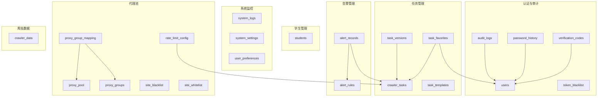
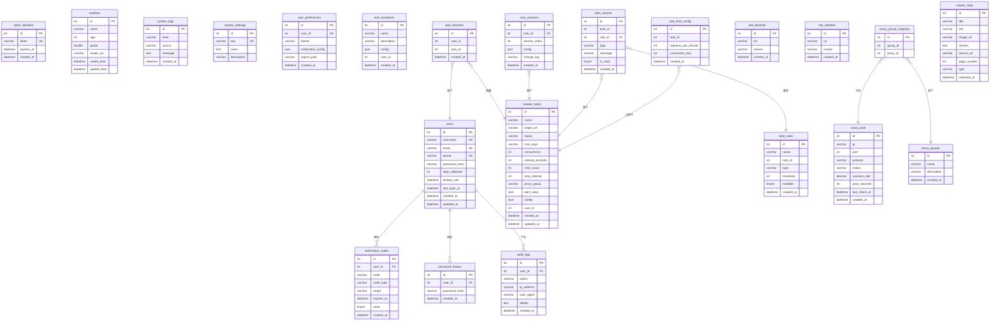
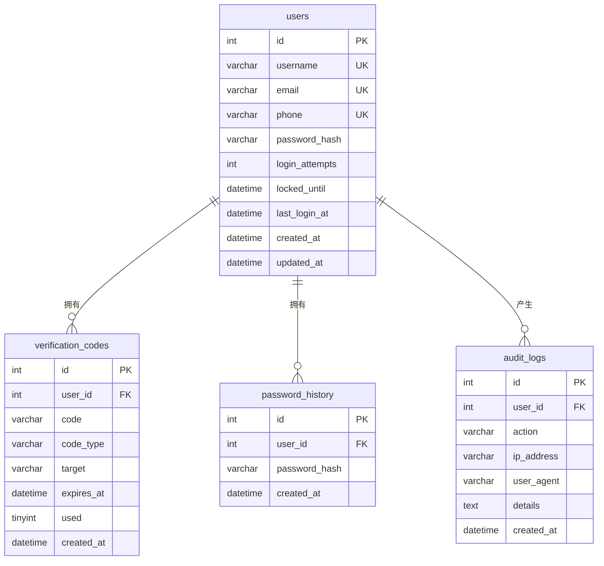
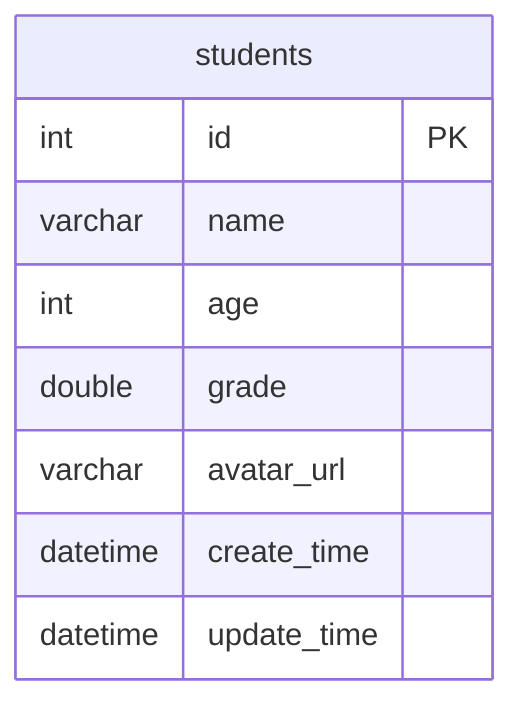
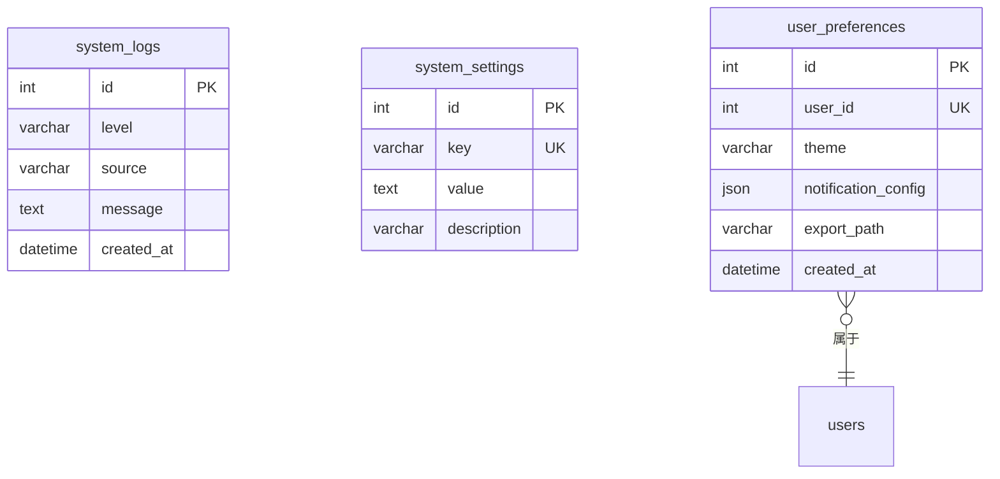
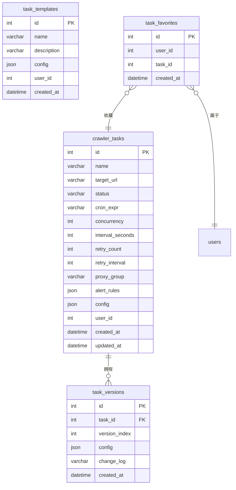
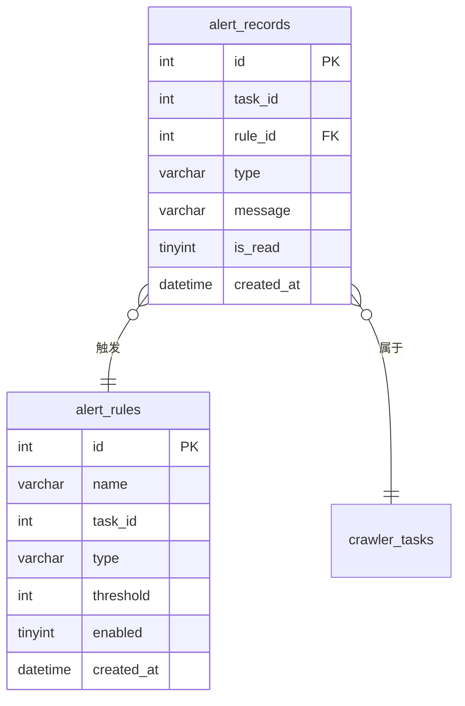
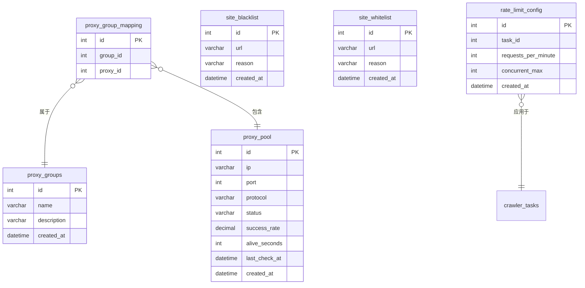
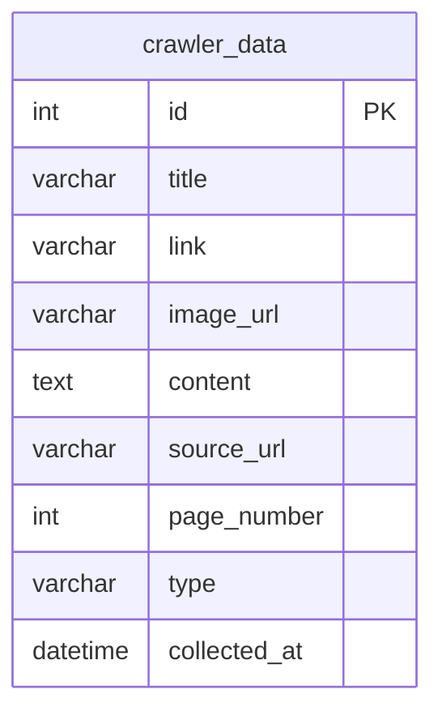
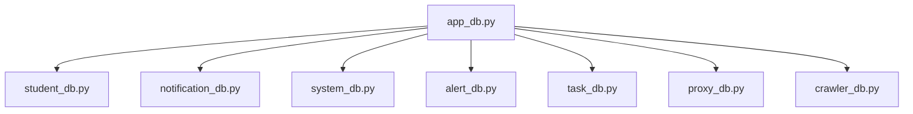

# 数据库关系图

<cite>
**本文档引用的文件**
- [app_db.py](file://python/app_db.py)
- [student_db.py](file://python/src/student_db.py)
- [notification_db.py](file://python/src/notification_db.py)
- [system_db.py](file://python/system_db.py)
- [alert_db.py](file://python/alert_db.py)
- [task_db.py](file://python/task_db.py)
- [proxy_db.py](file://python/proxy_db.py)
- [crawler_db.py](file://python/crawler_db.py)
</cite>

## 目录
1. [简介](#简介)
2. [项目结构](#项目结构)
3. [核心组件](#核心组件)
4. [架构概览](#架构概览)
5. [详细组件分析](#详细组件分析)
6. [依赖关系分析](#依赖关系分析)
7. [性能考虑](#性能考虑)
8. [故障排除指南](#故障排除指南)
9. [结论](#结论)
10. [附录](#附录)

## 简介
本文件为该代码库的数据库实体关系图（ERD）文档，全面展示所有数据表之间的关系连接、主键与外键约束、参照完整性规则、表间关联类型以及连接方式。同时提供数据流向图、查询路径分析、性能优化建议、数据库初始化脚本、表结构变更历史与版本兼容性说明，并解释索引策略、查询优化与数据分区方案。

## 项目结构
该项目采用模块化设计，数据库访问层分布在多个独立模块中，分别负责不同业务域的数据持久化：
- 认证与审计：users、verification_codes、token_blacklist、password_history、audit_logs
- 学生管理：students
- 系统监控：system_logs、system_settings、user_preferences
- 任务管理：crawler_tasks、task_templates、task_versions、task_favorites
- 告警管理：alert_rules、alert_records
- 代理池：proxy_pool、proxy_groups、proxy_group_mapping、site_blacklist、site_whitelist、rate_limit_config
- 爬虫数据：crawler_data

**图表来源**
- [notification_db.py:44-103](file://python/src/notification_db.py#L44-L103)
- [student_db.py:19-29](file://python/src/student_db.py#L19-L29)
- [system_db.py:52-87](file://python/system_db.py#L52-L87)
- [task_db.py:52-111](file://python/task_db.py#L52-L111)
- [alert_db.py:51-81](file://python/alert_db.py#L51-L81)
- [proxy_db.py:51-120](file://python/proxy_db.py#L51-L120)
- [crawler_db.py:55-71](file://python/crawler_db.py#L55-L71)

**章节来源**
- [app_db.py:1-726](file://python/app_db.py#L1-L726)
- [student_db.py:1-259](file://python/src/student_db.py#L1-L259)
- [notification_db.py:1-357](file://python/src/notification_db.py#L1-L357)
- [system_db.py:1-317](file://python/system_db.py#L1-L317)
- [alert_db.py:1-314](file://python/alert_db.py#L1-L314)
- [task_db.py:1-533](file://python/task_db.py#L1-L533)
- [proxy_db.py:1-528](file://python/proxy_db.py#L1-L528)
- [crawler_db.py:1-238](file://python/crawler_db.py#L1-L238)

## 核心组件
本节概述各数据库模块及其职责：
- 认证与审计模块：负责用户认证、验证码、令牌黑名单、密码历史与审计日志。
- 学生管理模块：提供学生增删改查、统计分析与导入导出支持。
- 系统监控模块：系统日志、设置与用户偏好管理。
- 任务管理模块：爬虫任务、模板、版本与收藏管理。
- 告警管理模块：告警规则与告警记录。
- 代理池模块：代理IP、分组、黑白名单与速率限制。
- 爬虫数据模块：爬取数据的存储与检索。

**章节来源**
- [notification_db.py:6-104](file://python/src/notification_db.py#L6-L104)
- [student_db.py:5-138](file://python/src/student_db.py#L5-L138)
- [system_db.py:7-97](file://python/system_db.py#L7-L97)
- [task_db.py:7-121](file://python/task_db.py#L7-L121)
- [alert_db.py:6-91](file://python/alert_db.py#L6-L91)
- [proxy_db.py:6-130](file://python/proxy_db.py#L6-L130)
- [crawler_db.py:6-94](file://python/crawler_db.py#L6-L94)

## 架构概览
下图展示数据库层的整体架构与模块边界，以及主要表之间的关系：

**图表来源**
- [notification_db.py:44-103](file://python/src/notification_db.py#L44-L103)
- [student_db.py:19-29](file://python/src/student_db.py#L19-L29)
- [system_db.py:52-87](file://python/system_db.py#L52-L87)
- [task_db.py:52-111](file://python/task_db.py#L52-L111)
- [alert_db.py:51-81](file://python/alert_db.py#L51-L81)
- [proxy_db.py:51-120](file://python/proxy_db.py#L51-L120)
- [crawler_db.py:55-71](file://python/crawler_db.py#L55-L71)

## 详细组件分析

### 认证与审计模块（users、verification_codes、token_blacklist、password_history、audit_logs）
- 主键：各表主键均为自增整型。
- 外键约束：
  - verification_codes.user_id → users.id（级联删除）
  - password_history.user_id → users.id（级联删除）
  - audit_logs.user_id → users.id（删除时设为空）
- 关系类型：
  - 一对一：users 与 user_preferences（由 user_id 唯一索引体现）
  - 一对多：users → verification_codes、password_history、audit_logs
- 参照完整性：
  - 删除用户时，verification_codes、password_history 自动删除；audit_logs 的 user_id 设为空以保留审计痕迹。

**图表来源**
- [notification_db.py:44-103](file://python/src/notification_db.py#L44-L103)

**章节来源**
- [notification_db.py:41-104](file://python/src/notification_db.py#L41-L104)

### 学生管理模块（students）
- 主键：id
- 无外键约束
- 关系类型：独立实体，供 API 层进行 CRUD 操作

**图表来源**
- [student_db.py:19-29](file://python/src/student_db.py#L19-L29)

**章节来源**
- [student_db.py:17-138](file://python/src/student_db.py#L17-L138)

### 系统监控模块（system_logs、system_settings、user_preferences）
- 主键：各表主键均为自增整型
- 外键约束：
  - user_preferences.user_id → users.id（唯一索引，实现一对一）
- 关系类型：
  - 一对一：users 与 user_preferences
  - 一对多：system_settings 与 system_logs（无直接外键）

**图表来源**
- [system_db.py:52-87](file://python/system_db.py#L52-L87)

**章节来源**
- [system_db.py:47-97](file://python/system_db.py#L47-L97)

### 任务管理模块（crawler_tasks、task_templates、task_versions、task_favorites）
- 主键：各表主键均为自增整型
- 外键约束：
  - task_versions.task_id → crawler_tasks.id（级联删除）
  - task_favorites.user_id → users.id（无级联）
  - task_favorites.task_id → crawler_tasks.id（无级联）
- 关系类型：
  - 一对多：crawler_tasks → task_versions
  - 多对多：users ↔ crawler_tasks（通过 task_favorites 实现）

**图表来源**
- [task_db.py:52-111](file://python/task_db.py#L52-L111)

**章节来源**
- [task_db.py:47-121](file://python/task_db.py#L47-L121)

### 告警管理模块（alert_rules、alert_records）
- 主键：各表主键均为自增整型
- 外键约束：
  - alert_records.rule_id → alert_rules.id（无级联）
  - alert_records.task_id → crawler_tasks.id（无级联）
- 关系类型：
  - 一对多：alert_rules → alert_records
  - 多对一：alert_records → crawler_tasks

**图表来源**
- [alert_db.py:51-81](file://python/alert_db.py#L51-L81)

**章节来源**
- [alert_db.py:46-91](file://python/alert_db.py#L46-L91)

### 代理池模块（proxy_pool、proxy_groups、proxy_group_mapping、site_blacklist、site_whitelist、rate_limit_config）
- 主键：各表主键均为自增整型
- 外键约束：
  - proxy_group_mapping.group_id → proxy_groups.id（无级联）
  - proxy_group_mapping.proxy_id → proxy_pool.id（无级联）
  - rate_limit_config.task_id → crawler_tasks.id（无级联）
- 关系类型：
  - 多对多：proxy_pool ↔ proxy_groups（通过 proxy_group_mapping 实现）
  - 一对多：crawler_tasks → rate_limit_config（一对一，但查询逻辑允许全局配置）

**图表来源**
- [proxy_db.py:51-120](file://python/proxy_db.py#L51-L120)

**章节来源**
- [proxy_db.py:46-130](file://python/proxy_db.py#L46-L130)

### 爬虫数据模块（crawler_data）
- 主键：id
- 无外键约束
- 用途：存储爬取的标题、链接、图片、内容摘要、来源、页码、类型与采集时间

**图表来源**
- [crawler_db.py:55-71](file://python/crawler_db.py#L55-L71)

**章节来源**
- [crawler_db.py:48-94](file://python/crawler_db.py#L48-L94)

## 依赖关系分析
- 模块内依赖：各模块均使用 PyMySQL 进行数据库连接，遵循统一的连接配置与异常处理模式。
- 跨模块依赖：
  - 任务管理依赖代理池与告警模块（通过 JSON 配置与外键字段体现）
  - 系统监控与任务管理相互独立，但都依赖 users 表进行审计
  - 学生管理与认证模块相对独立，仅通过 API 层交互

**图表来源**
- [app_db.py:9-15](file://python/app_db.py#L9-L15)

**章节来源**
- [app_db.py:1-726](file://python/app_db.py#L1-L726)

## 性能考虑
- 索引策略
  - users：username、email、phone 唯一索引，支持快速查找与去重
  - system_logs：按 level、source、created_at 建立普通索引，便于日志筛选与排序
  - system_settings：key 唯一索引，确保设置键唯一性
  - user_preferences：user_id 唯一索引，实现一对一映射
  - crawler_tasks：status、user_id、name 建立索引，支持任务列表查询与过滤
  - alert_records：task_id、rule_id、is_read、created_at 建立索引，提升告警查询效率
  - proxy_pool：status、protocol 建立索引，加速代理筛选
  - crawler_data：source_url、collected_at、page_number、type 建立索引，优化爬虫数据检索
- 查询优化
  - 使用条件过滤与分页（如任务列表、日志列表、告警记录）避免全表扫描
  - 对 JSON 字段（如 alert_rules、config、notification_config）避免在 WHERE 中直接使用，优先通过业务层解析后过滤
  - 审计日志与系统日志采用时间戳倒序查询，结合索引提升性能
- 数据分区方案
  - 建议按时间维度对 crawler_data、system_logs、audit_logs 进行分区（如按月或按季度），减少冷数据扫描
  - 对高频写入表（如 crawler_data）可考虑归档策略，定期迁移历史数据至归档表
- 缓存策略
  - 对频繁读取的系统设置（system_settings）与用户偏好（user_preferences）进行缓存，降低数据库压力
  - 对任务模板（task_templates）与代理配置（rate_limit_config）进行短期缓存，减少重复查询

## 故障排除指南
- 连接问题
  - 检查数据库主机、端口、用户名与密码配置，确保 PyMySQL 连接正常
  - 对于连接超时，增加连接池大小与超时时间
- 外键约束错误
  - 删除父表记录前，先清理子表中的关联记录（如删除用户前清理 verification_codes、password_history）
  - 确保外键字段值有效，避免插入无效的外键值
- 索引失效
  - 对高选择性列建立索引，避免在索引列上使用函数或隐式转换
  - 定期分析表统计信息，重建碎片化索引
- 性能瓶颈
  - 对大数据量表执行 EXPLAIN 分析慢查询，识别索引缺失或查询计划不当
  - 合理使用 LIMIT 与分页，避免一次性返回过多数据

**章节来源**
- [notification_db.py:28-40](file://python/src/notification_db.py#L28-L40)
- [system_db.py:96-122](file://python/system_db.py#L96-L122)
- [alert_db.py:90-118](file://python/alert_db.py#L90-L118)
- [proxy_db.py:129-167](file://python/proxy_db.py#L129-L167)
- [crawler_db.py:141-182](file://python/crawler_db.py#L141-L182)

## 结论
本 ERD 文档系统梳理了认证、学生管理、系统监控、任务管理、告警、代理池与爬虫数据等模块的表结构与关系，明确了主键、外键与参照完整性规则，并提供了性能优化与故障排除建议。通过合理的索引策略、查询优化与数据分区方案，可显著提升系统整体性能与稳定性。

## 附录

### 数据库初始化脚本
以下为各模块的建表语句与索引定义（摘自源码）：
- 认证与审计模块
  - users、verification_codes、token_blacklist、password_history、audit_logs
- 学生管理模块
  - students
- 系统监控模块
  - system_logs、system_settings、user_preferences
- 任务管理模块
  - crawler_tasks、task_templates、task_versions、task_favorites
- 告警管理模块
  - alert_rules、alert_records
- 代理池模块
  - proxy_pool、proxy_groups、proxy_group_mapping、site_blacklist、site_whitelist、rate_limit_config
- 爬虫数据模块
  - crawler_data

**章节来源**
- [notification_db.py:44-103](file://python/src/notification_db.py#L44-L103)
- [student_db.py:19-29](file://python/src/student_db.py#L19-L29)
- [system_db.py:52-87](file://python/system_db.py#L52-L87)
- [task_db.py:52-111](file://python/task_db.py#L52-L111)
- [alert_db.py:51-81](file://python/alert_db.py#L51-L81)
- [proxy_db.py:51-120](file://python/proxy_db.py#L51-L120)
- [crawler_db.py:55-71](file://python/crawler_db.py#L55-L71)

### 表结构变更历史与版本兼容性
- crawler_data 表结构演进
  - 新增 image_url 列：用于存储图片 URL，默认值为空字符串
  - 新增 type 列：标识数据类型（link/image/mixed），默认为 link
  - 兼容性说明：通过 SHOW COLUMNS 与 ALTER TABLE 动态添加列，保证旧版本数据可平滑升级
- 版本控制与回滚
  - task_versions 提供任务配置的历史版本记录，支持回滚到指定版本
  - 回滚时根据版本 ID 查询对应配置并更新到 crawler_tasks

**章节来源**
- [crawler_db.py:73-81](file://python/crawler_db.py#L73-L81)
- [task_db.py:367-444](file://python/task_db.py#L367-L444)

### 查询路径分析
- 获取任务列表（分页+过滤）
  - 条件：name 模糊匹配、status 精确匹配
  - 排序：按 updated_at 倒序
  - 索引：crawler_tasks.name、crawler_tasks.status
- 获取告警记录（分页+过滤）
  - 条件：task_id、rule_id、type、is_read
  - 排序：按 created_at 倒序
  - 索引：alert_records.task_id、alert_records.rule_id、alert_records.is_read、alert_records.created_at
- 获取代理列表（过滤+分页）
  - 条件：status、protocol
  - 排序：按 created_at 倒序
  - 索引：proxy_pool.status、proxy_pool.protocol

**章节来源**
- [task_db.py:123-164](file://python/task_db.py#L123-L164)
- [alert_db.py:224-272](file://python/alert_db.py#L224-L272)
- [proxy_db.py:132-160](file://python/proxy_db.py#L132-L160)