# 数据库设计

<cite>
**本文档引用的文件**
- [student_db.py](file://python/src/student_db.py)
- [models.py](file://python/src/models.py)
- [notification_db.py](file://python/src/notification_db.py)
- [app_db.py](file://python/app_db.py)
- [system_db.py](file://python/system_db.py)
- [task_db.py](file://python/task_db.py)
- [alert_db.py](file://python/alert_db.py)
- [proxy_db.py](file://python/proxy_db.py)
- [crawler_db.py](file://python/crawler_db.py)
- [main.py](file://python/main.py)
- [requirements.txt](file://python/requirements.txt)
</cite>

## 目录
1. [简介](#简介)
2. [项目结构](#项目结构)
3. [核心组件](#核心组件)
4. [架构概览](#架构概览)
5. [详细组件分析](#详细组件分析)
6. [依赖关系分析](#依赖关系分析)
7. [性能考虑](#性能考虑)
8. [故障排除指南](#故障排除指南)
9. [结论](#结论)
10. [附录](#附录)

## 简介

本文件为学生管理系统数据库设计的综合文档，基于实际代码库分析，涵盖学生管理、用户认证、系统监控、任务管理、告警管理、代理池管理等多个子系统的数据库设计。文档详细说明了ER模型设计、实体关系图、索引优化策略，并对每个数据表的字段定义、约束条件、业务规则进行文档化。同时提供了数据访问模式、缓存策略和性能优化建议，以及数据迁移路径、版本管理和备份恢复策略，解释了数据安全、隐私保护和访问控制机制。

## 项目结构

该系统采用模块化设计，主要分为以下几类数据库模块：

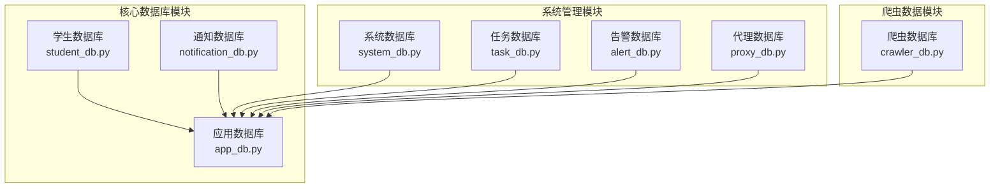

**图表来源**
- [student_db.py:1-259](file://python/src/student_db.py#L1-L259)
- [notification_db.py:1-357](file://python/src/notification_db.py#L1-L357)
- [app_db.py:1-726](file://python/app_db.py#L1-L726)

**章节来源**
- [student_db.py:1-259](file://python/src/student_db.py#L1-L259)
- [notification_db.py:1-357](file://python/src/notification_db.py#L1-L357)
- [app_db.py:1-726](file://python/app_db.py#L1-L726)

## 核心组件

### 学生管理系统数据库

学生管理系统包含一个核心的 `students` 表，提供完整的 CRUD 操作和统计功能：

```mermaid
erDiagram
STUDENTS {
int id PK
varchar name
int age
double grade
varchar avatar_url
datetime create_time
datetime update_time
}
STUDENT_SERVICE {
StudentDB db
create_student(name, age, grade, avatar_url)
get_all_students()
get_student_by_id(student_id)
search_by_name(name)
update_student(student_id, name, age, grade, avatar_url)
delete_student(student_id)
batch_delete_students(student_ids)
get_statistics()
}
STUDENT_DB {
connection
create(name, age, grade, avatar_url)
get_all()
get_by_id(student_id)
get_by_name(name)
update(student_id, name, age, grade, avatar_url)
delete(student_id)
delete_batch(student_ids)
exists(student_id)
count()
}
STUDENT_MODEL {
int student_id
string name
int age
double grade
string avatar_url
datetime create_time
to_dict()
}
STUDENT_SERVICE --> STUDENT_DB : "使用"
STUDENT_SERVICE --> STUDENT_MODEL : "创建"
STUDENT_DB --> STUDENTS : "操作"
```

**图表来源**
- [student_db.py:20-137](file://python/src/student_db.py#L20-L137)
- [student_db.py:140-157](file://python/src/student_db.py#L140-L157)
- [student_db.py:160-258](file://python/src/student_db.py#L160-L258)

### 用户认证与审计数据库

用户认证系统包含多个相关表，提供完整的身份验证、授权和审计功能：

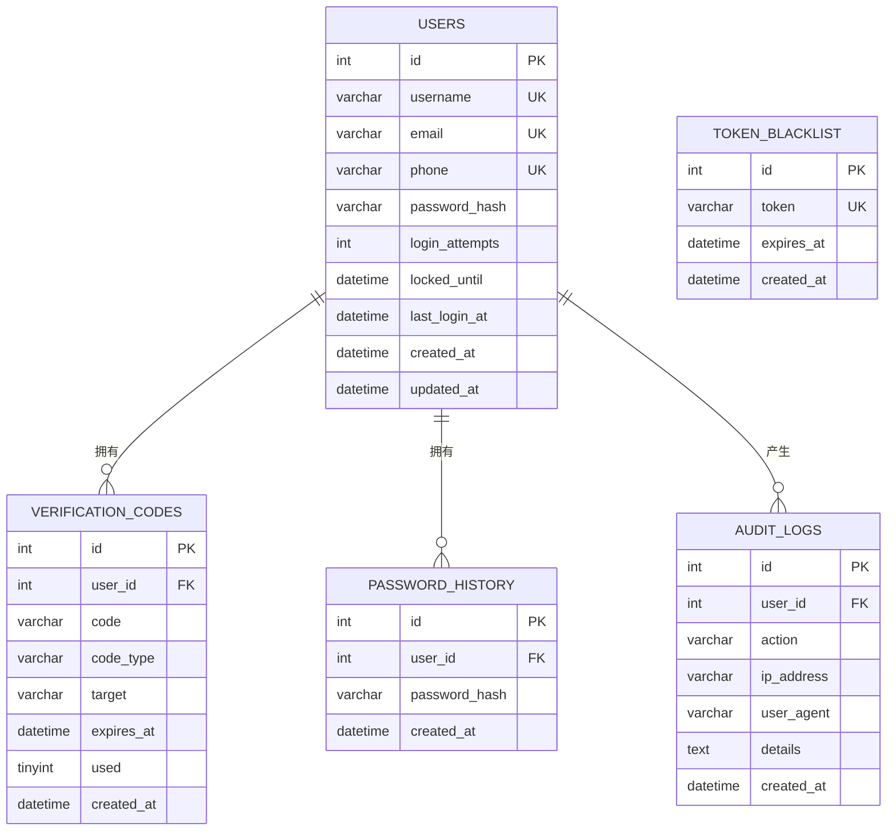

**图表来源**
- [notification_db.py:44-103](file://python/src/notification_db.py#L44-L103)

### 系统监控数据库

系统监控模块提供日志记录、设置管理和用户偏好存储功能：

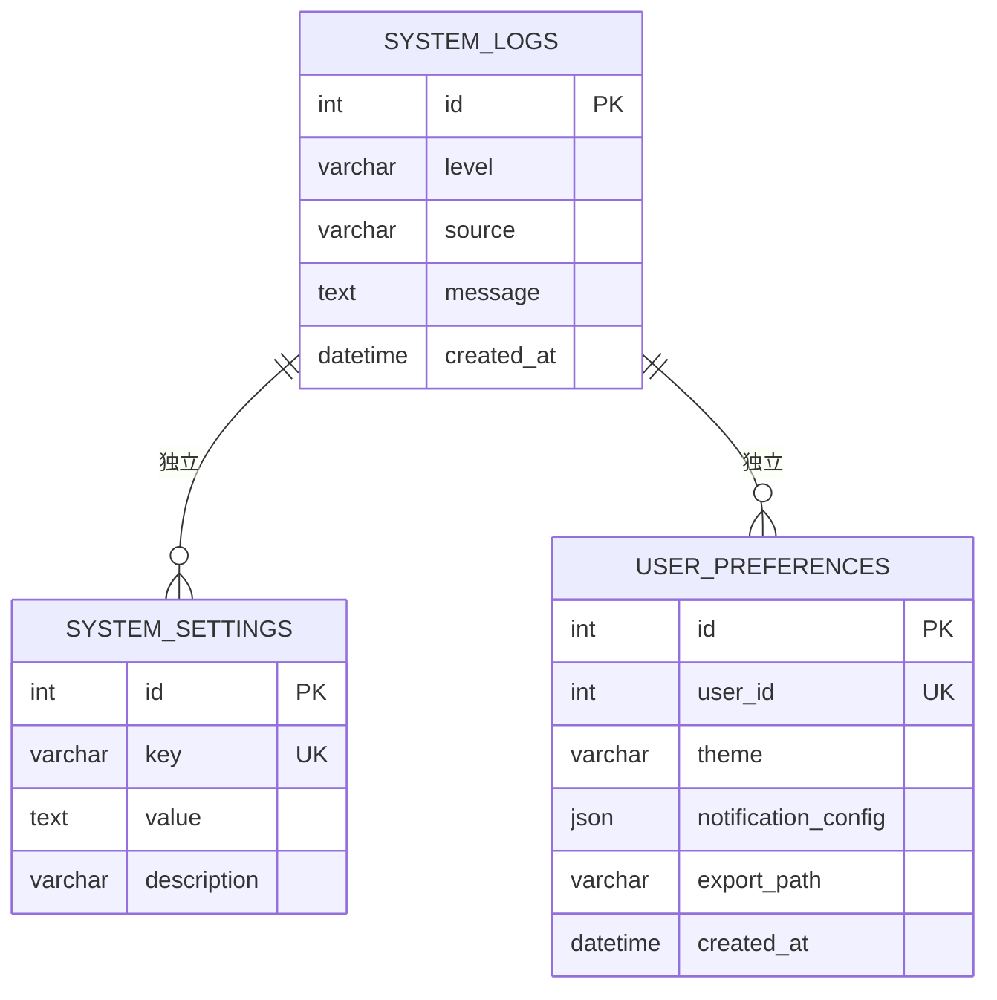

**图表来源**
- [system_db.py:52-87](file://python/system_db.py#L52-L87)

**章节来源**
- [student_db.py:1-259](file://python/src/student_db.py#L1-L259)
- [notification_db.py:1-357](file://python/src/notification_db.py#L1-L357)
- [system_db.py:1-317](file://python/system_db.py#L1-L317)

## 架构概览

系统采用分层架构设计，各模块相对独立但通过API接口进行交互：

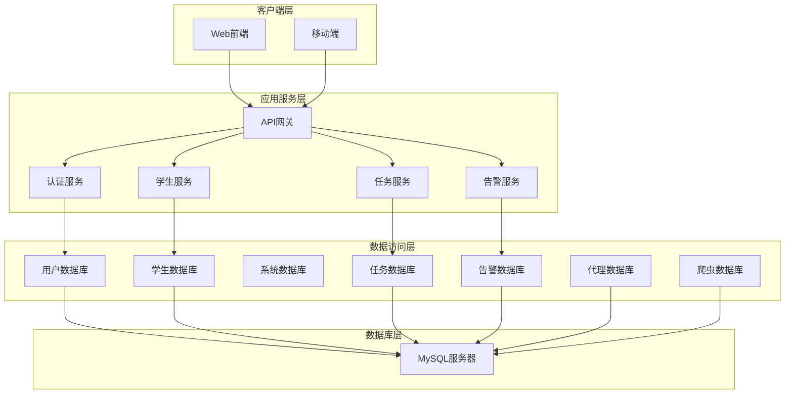

**图表来源**
- [app_db.py:36-726](file://python/app_db.py#L36-L726)
- [student_db.py:5-137](file://python/src/student_db.py#L5-L137)
- [notification_db.py:6-104](file://python/src/notification_db.py#L6-L104)

## 详细组件分析

### 学生数据模型

#### 表结构定义

| 字段名 | 类型 | 约束 | 描述 |
|--------|------|------|------|
| id | INT | PRIMARY KEY, AUTO_INCREMENT | 学生唯一标识符 |
| name | VARCHAR(100) | NOT NULL | 学生姓名 |
| age | INT | NOT NULL | 学生年龄 (1-150) |
| grade | DOUBLE | NOT NULL | 学生成绩 (0-100) |
| avatar_url | VARCHAR(500) | NULL | 头像URL地址 |
| create_time | DATETIME | NULL | 记录创建时间 |
| update_time | DATETIME | NULL | 记录更新时间 |

#### 索引策略

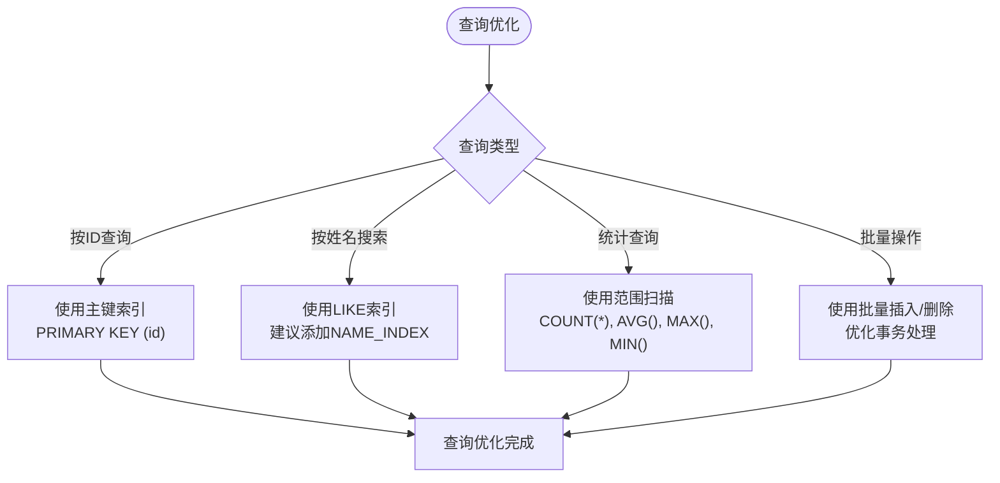

**图表来源**
- [student_db.py:20-29](file://python/src/student_db.py#L20-L29)

#### 业务规则

1. **数据完整性约束**
   - 姓名不能为空
   - 年龄必须在1-150范围内
   - 成绩必须在0-100范围内

2. **时间戳管理**
   - 自动维护创建和更新时间
   - 支持批量操作的时间戳更新

3. **查询优化**
   - 主键索引支持快速ID查询
   - 建议添加姓名搜索索引以优化模糊查询

**章节来源**
- [student_db.py:164-228](file://python/src/student_db.py#L164-L228)
- [student_db.py:70-81](file://python/src/student_db.py#L70-L81)

### 用户认证系统

#### 用户表设计

| 字段名 | 类型 | 约束 | 描述 |
|--------|------|------|------|
| id | INT | PRIMARY KEY, AUTO_INCREMENT | 用户唯一标识符 |
| username | VARCHAR(100) | UNIQUE | 用户名 |
| email | VARCHAR(255) | UNIQUE | 邮箱地址 |
| phone | VARCHAR(20) | UNIQUE | 手机号码 |
| password_hash | VARCHAR(255) | NOT NULL | 密码哈希值 |
| login_attempts | INT | DEFAULT 0 | 登录尝试次数 |
| locked_until | DATETIME | NULL | 账户锁定截止时间 |
| last_login_at | DATETIME | NULL | 最后登录时间 |
| created_at | DATETIME | NULL | 账户创建时间 |
| updated_at | DATETIME | NULL | 账户更新时间 |

#### 安全机制

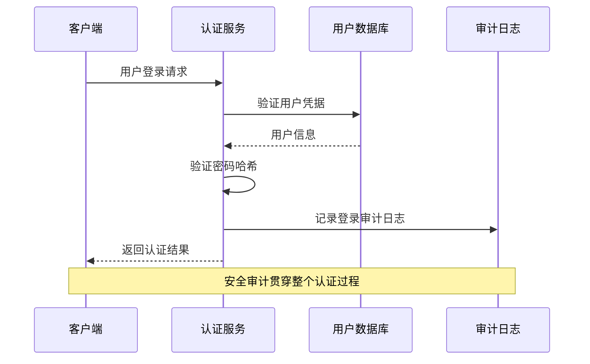

**图表来源**
- [notification_db.py:106-115](file://python/src/notification_db.py#L106-L115)
- [notification_db.py:334-342](file://python/src/notification_db.py#L334-L342)

**章节来源**
- [notification_db.py:44-103](file://python/src/notification_db.py#L44-L103)
- [notification_db.py:334-342](file://python/src/notification_db.py#L334-L342)

### 系统监控模块

#### 日志管理

系统提供完整的日志管理功能，包括：

1. **日志级别分类**
   - INFO: 一般信息日志
   - WARNING: 警告信息日志  
   - ERROR: 错误信息日志

2. **索引优化**
   - `idx_level`: 按日志级别快速过滤
   - `idx_source`: 按日志来源快速定位
   - `idx_created_at`: 按时间排序和范围查询

#### 设置管理

系统设置表支持动态配置管理：

| 字段名 | 类型 | 约束 | 描述 |
|--------|------|------|------|
| id | INT | PRIMARY KEY, AUTO_INCREMENT | 设置项唯一标识 |
| key | VARCHAR(100) | UNIQUE | 设置键名 |
| value | TEXT | NULL | 设置值 |
| description | VARCHAR(500) | DEFAULT '' | 设置描述 |

**章节来源**
- [system_db.py:52-87](file://python/system_db.py#L52-L87)
- [system_db.py:123-168](file://python/system_db.py#L123-L168)

### 任务管理系统

#### 任务表设计

任务管理模块包含多个相关表，支持复杂的任务生命周期管理：

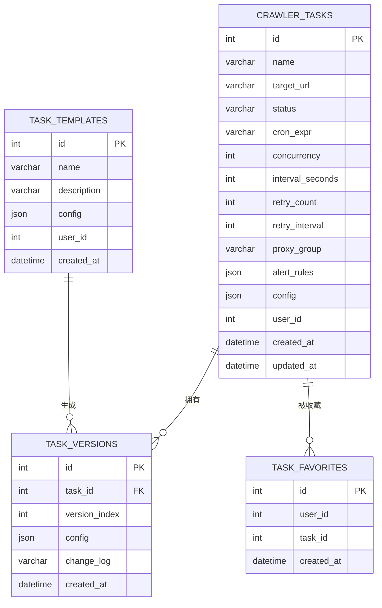

**图表来源**
- [task_db.py:52-111](file://python/task_db.py#L52-L111)

#### 状态管理

任务状态流转遵循以下模式：

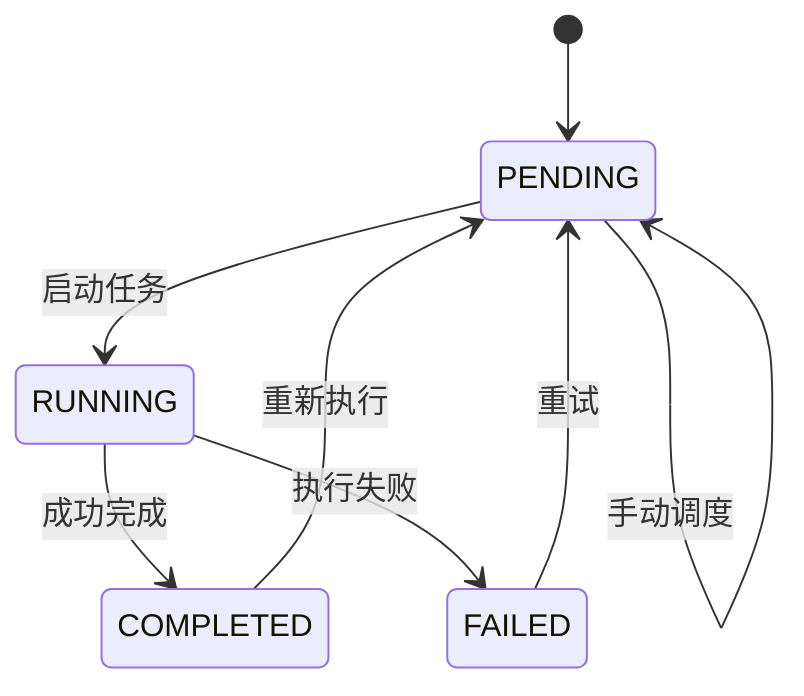

**图表来源**
- [task_db.py:56](file://python/task_db.py#L56)

**章节来源**
- [task_db.py:52-111](file://python/task_db.py#L52-L111)
- [task_db.py:123-171](file://python/task_db.py#L123-L171)

### 告警管理系统

#### 告警规则设计

告警系统提供灵活的告警规则配置和实时告警记录功能：

| 字段名 | 类型 | 约束 | 描述 |
|--------|------|------|------|
| id | INT | PRIMARY KEY, AUTO_INCREMENT | 规则唯一标识 |
| name | VARCHAR(200) | NOT NULL | 规则名称 |
| task_id | INT | NOT NULL | 关联任务ID (0表示全局规则) |
| type | VARCHAR(30) | NOT NULL | 告警类型 |
| threshold | INT | NOT NULL | 触发阈值 |
| enabled | TINYINT(1) | NOT NULL | 是否启用 |
| created_at | DATETIME | NOT NULL | 创建时间 |

#### 告警类型

系统支持多种告警类型：
- FAILED: 任务执行失败
- TIMEOUT: 任务超时
- DATA_ANOMALY: 数据异常
- IP_BLOCKED: IP被封禁

**章节来源**
- [alert_db.py:51-81](file://python/alert_db.py#L51-L81)
- [alert_db.py:119-152](file://python/alert_db.py#L119-L152)

### 代理池管理系统

#### 代理管理架构

代理池系统提供完整的代理IP管理、分组和速率控制功能：

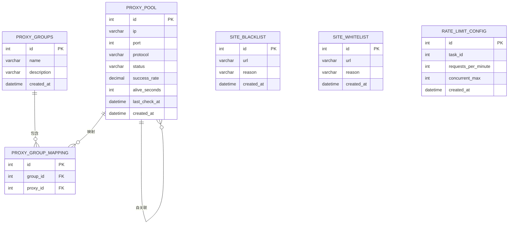

**图表来源**
- [proxy_db.py:51-120](file://python/proxy_db.py#L51-L120)

#### 速率控制策略

系统提供灵活的速率控制配置，支持任务级和全局级配置：

| 配置项 | 默认值 | 描述 |
|--------|--------|------|
| requests_per_minute | 60 | 每分钟请求数限制 |
| concurrent_max | 10 | 最大并发数限制 |

**章节来源**
- [proxy_db.py:51-120](file://python/proxy_db.py#L51-L120)
- [proxy_db.py:443-466](file://python/proxy_db.py#L443-L466)

### 爬虫数据管理

#### 数据采集架构

爬虫数据模块提供高效的数据采集、存储和查询功能：

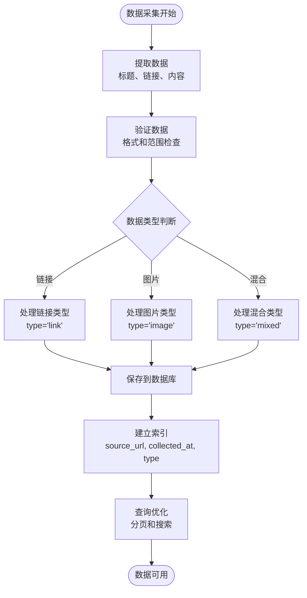

**图表来源**
- [crawler_db.py:54-81](file://python/crawler_db.py#L54-L81)

#### 数据类型设计

| 类型 | 描述 | 特殊处理 |
|------|------|----------|
| link | 网页链接 | 标准存储 |
| image | 图片链接 | 自动回退到链接 |
| mixed | 混合内容 | 统一处理 |

**章节来源**
- [crawler_db.py:54-81](file://python/crawler_db.py#L54-L81)
- [crawler_db.py:96-139](file://python/crawler_db.py#L96-L139)

## 依赖关系分析

系统各模块之间的依赖关系如下：

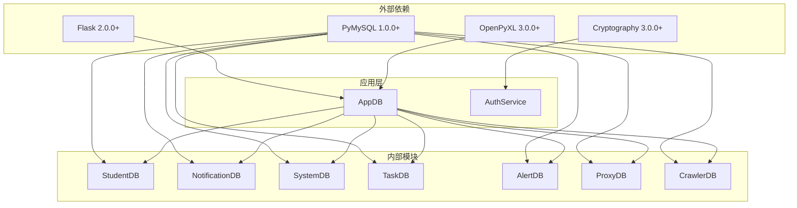

**图表来源**
- [requirements.txt:1-13](file://python/requirements.txt#L1-L13)
- [app_db.py:9-15](file://python/app_db.py#L9-L15)

**章节来源**
- [requirements.txt:1-13](file://python/requirements.txt#L1-L13)
- [app_db.py:9-15](file://python/app_db.py#L9-L15)

## 性能考虑

### 查询优化策略

1. **索引优化**
   - 为主键字段自动建立索引
   - 为常用查询字段建立复合索引
   - 使用前缀索引优化长文本字段

2. **查询模式优化**
   - 使用参数化查询防止SQL注入
   - 实现分页查询避免大数据集加载
   - 采用延迟加载减少不必要的数据传输

3. **连接池管理**
   - 实现连接复用减少连接开销
   - 添加连接健康检查机制
   - 支持自动重连和故障转移

### 缓存策略

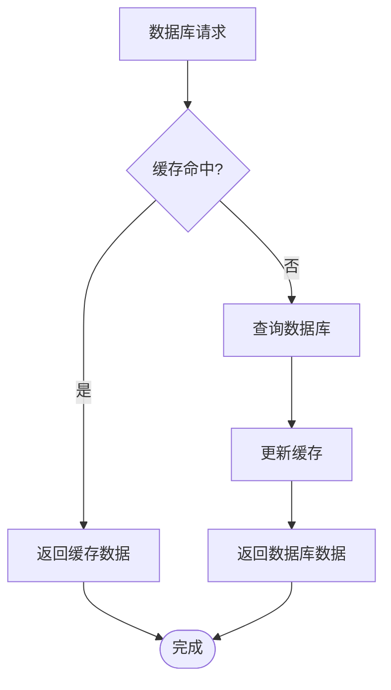

**图表来源**
- [student_db.py:32-40](file://python/src/student_db.py#L32-L40)

### 性能监控

系统提供内置的健康检查和性能监控功能：

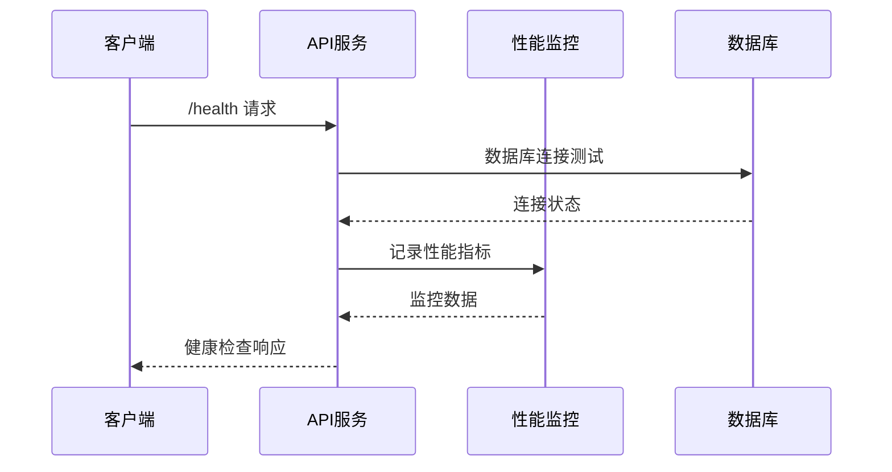

**图表来源**
- [app_db.py:610-617](file://python/app_db.py#L610-L617)

## 故障排除指南

### 常见问题诊断

1. **数据库连接问题**
   - 检查数据库服务状态
   - 验证连接参数配置
   - 查看连接池状态

2. **查询性能问题**
   - 分析慢查询日志
   - 检查索引使用情况
   - 优化查询语句

3. **数据一致性问题**
   - 检查事务处理
   - 验证外键约束
   - 实施数据校验

### 错误处理机制

系统实现了多层次的错误处理机制：

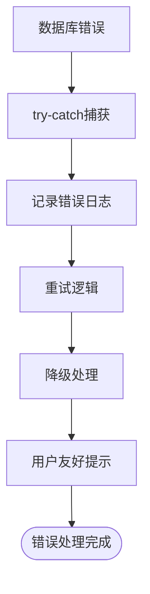

**图表来源**
- [notification_db.py:28-39](file://python/src/notification_db.py#L28-L39)

**章节来源**
- [notification_db.py:28-39](file://python/src/notification_db.py#L28-L39)
- [system_db.py:92-94](file://python/system_db.py#L92-L94)

## 结论

本数据库设计方案基于实际的代码实现，涵盖了学生管理、用户认证、系统监控、任务管理、告警管理、代理池管理和爬虫数据管理等核心功能模块。设计特点包括：

1. **模块化设计**: 各功能模块相对独立，便于维护和扩展
2. **安全性考虑**: 实现了完整的用户认证、授权和审计机制
3. **性能优化**: 提供了索引策略、查询优化和缓存机制
4. **可扩展性**: 支持动态配置和灵活的任务管理
5. **可靠性**: 实现了错误处理、重试机制和监控功能

该设计为学生管理系统提供了坚实的数据基础，能够满足当前业务需求并支持未来的功能扩展。

## 附录

### 数据迁移路径

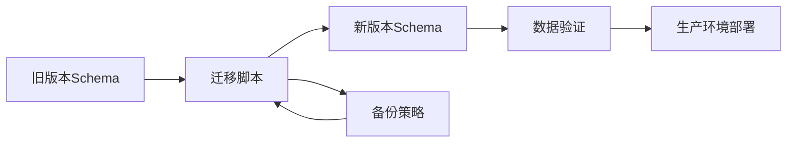

### 版本管理策略

1. **数据库版本控制**
   - 使用迁移脚本管理Schema变更
   - 实施向后兼容性检查
   - 建立版本回滚机制

2. **配置管理**
   - 环境变量配置分离
   - 动态配置热更新
   - 配置版本追踪

### 备份恢复策略

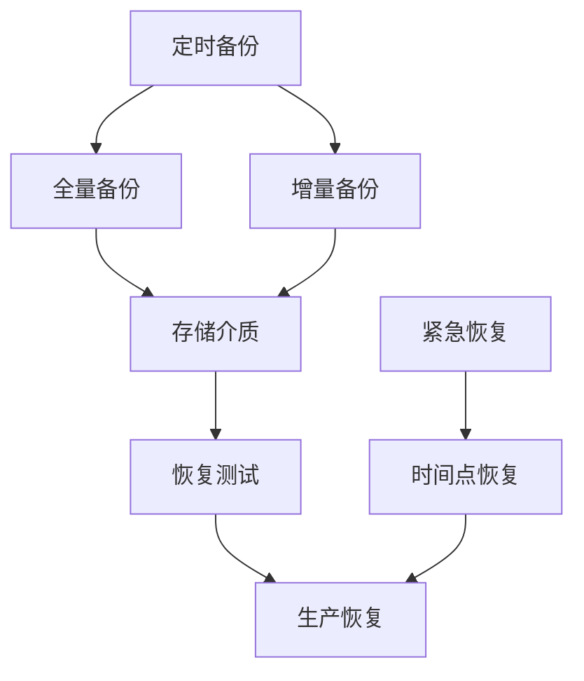

### 数据安全与隐私保护

1. **数据加密**
   - 敏感数据加密存储
   - 传输层加密
   - 密钥安全管理

2. **访问控制**
   - 基于角色的权限控制
   - 最小权限原则
   - 审计日志追踪

3. **隐私保护**
   - 数据最小化收集
   - 用户同意机制
   - 数据删除权利