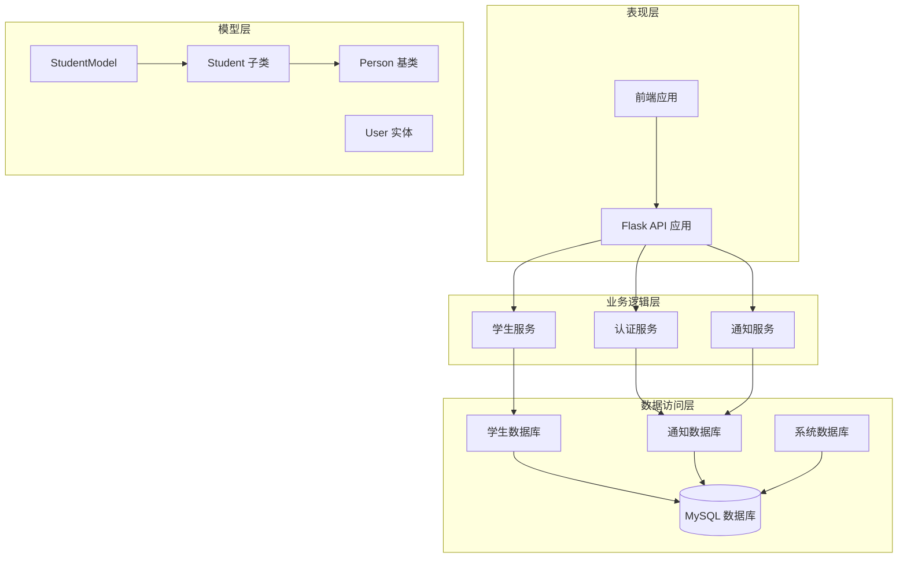
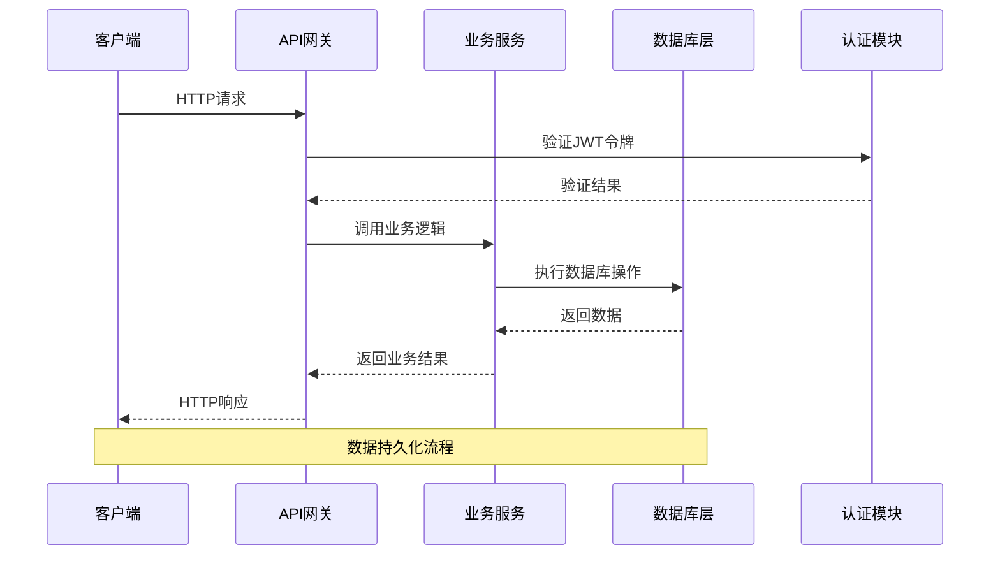
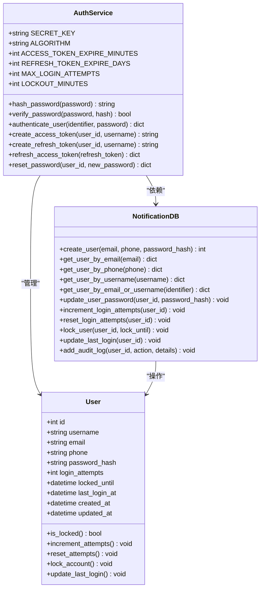
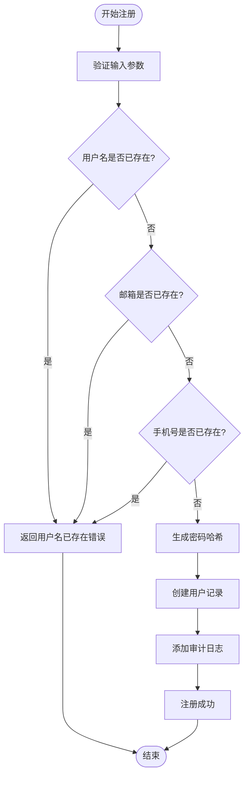
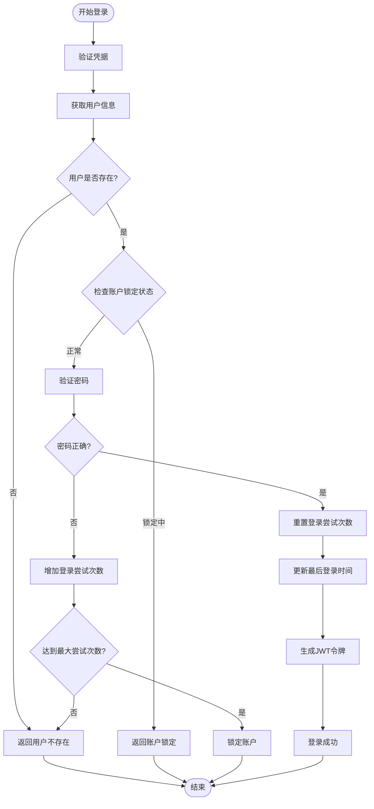
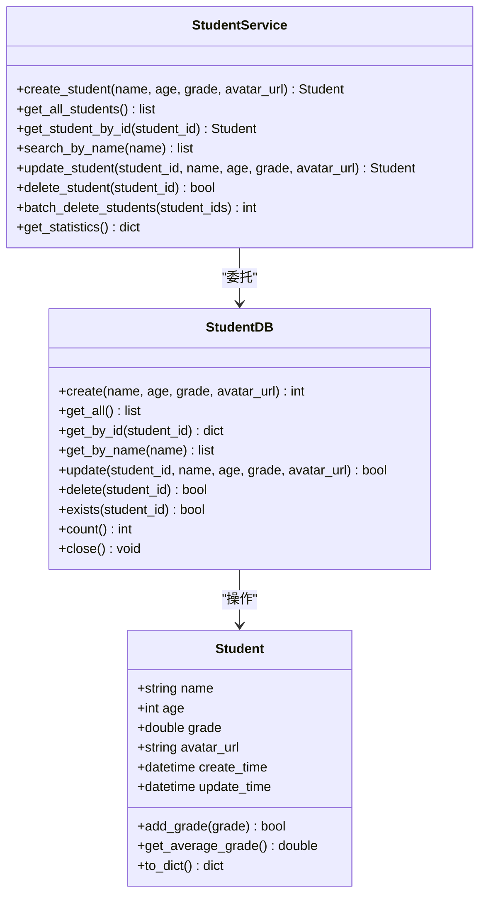
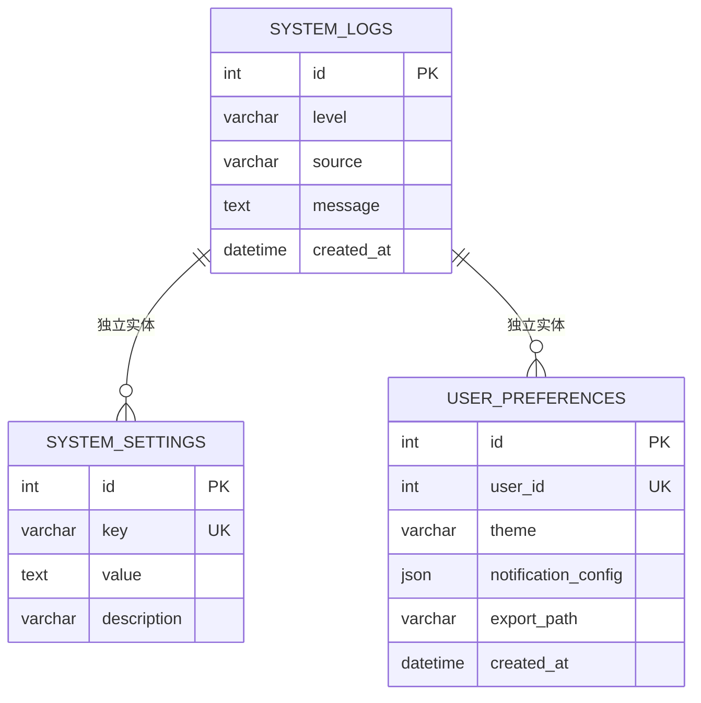
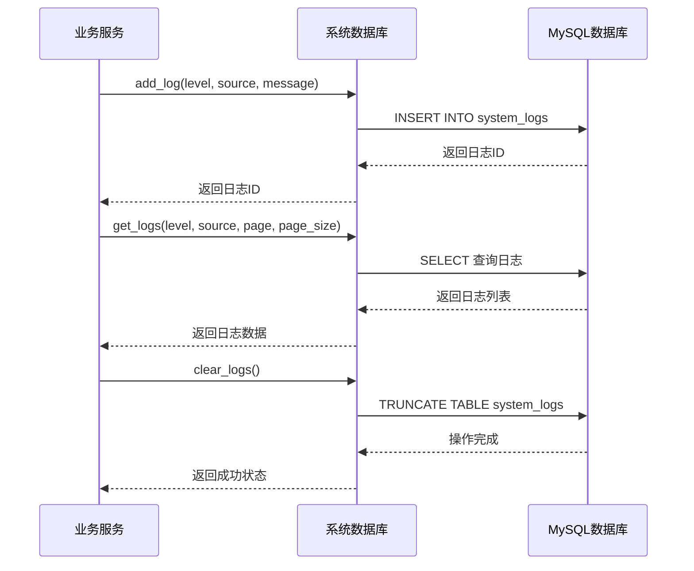
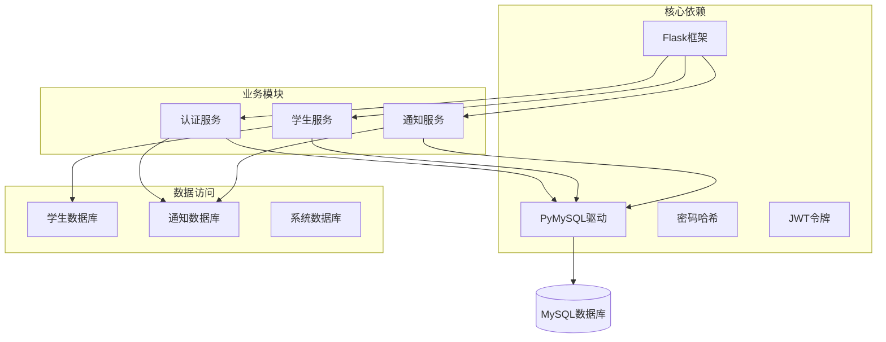
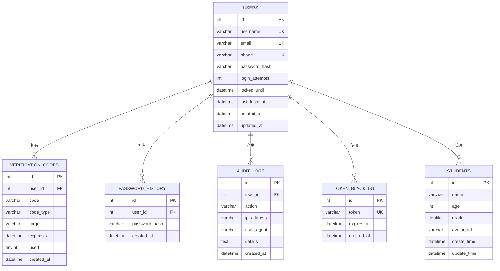

# 核心数据模型

<cite>
**本文档引用的文件**
- [models.py](file://python/src/models.py)
- [student_db.py](file://python/src/student_db.py)
- [notification_db.py](file://python/src/notification_db.py)
- [auth_service.py](file://python/src/auth_service.py)
- [app_db.py](file://python/app_db.py)
- [system_db.py](file://python/system_db.py)
- [verification_service.py](file://python/src/notifications/verification_service.py)
- [email_sender.py](file://python/src/notifications/email_sender.py)
- [sms_sender.py](file://python/src/notifications/sms_sender.py)
- [test_models.py](file://python/tests/test_models.py)
</cite>

## 目录
1. [简介](#简介)
2. [项目结构](#项目结构)
3. [核心组件](#核心组件)
4. [架构概览](#架构概览)
5. [详细组件分析](#详细组件分析)
6. [依赖分析](#依赖分析)
7. [性能考虑](#性能考虑)
8. [故障排除指南](#故障排除指南)
9. [结论](#结论)

## 简介

本文件详细文档化了该Python Web应用的核心数据模型，重点关注User（用户）和Student（学生）等核心实体的数据结构设计。文档涵盖了每个字段的含义、数据类型、约束条件和业务规则，解释了实体间的关系映射、主外键约束、索引设计策略，并提供了数据验证规则、默认值设置和字段长度限制。同时包含实体关系图和数据流向图，说明数据在系统中的流转过程，以及数据完整性约束和参照完整性规则。

## 项目结构

该项目采用分层架构设计，主要分为以下层次：
- 表现层：Flask Web API 应用
- 业务逻辑层：认证服务、通知服务、学生服务
- 数据访问层：MySQL 数据库连接和操作
- 模型层：基础数据模型定义

**图表来源**
- [app_db.py:36-726](file://python/app_db.py#L36-L726)
- [auth_service.py:9-187](file://python/src/auth_service.py#L9-L187)
- [student_db.py:5-259](file://python/src/student_db.py#L5-L259)
- [notification_db.py:6-357](file://python/src/notification_db.py#L6-L357)

**章节来源**
- [app_db.py:1-726](file://python/app_db.py#L1-L726)
- [models.py:1-59](file://python/src/models.py#L1-L59)

## 核心组件

### User（用户）实体

User 实体是系统的核心身份认证实体，用于管理用户注册、登录、密码管理和审计日志。

#### 字段定义和约束

| 字段名 | 数据类型 | 长度限制 | 约束条件 | 默认值 | 描述 |
|--------|----------|----------|----------|--------|------|
| id | INT | - | 主键, 自增 | - | 用户唯一标识符 |
| username | VARCHAR | 100 | 唯一, 可选 | NULL | 用户名 |
| email | VARCHAR | 255 | 唯一, 可选 | NULL | 邮箱地址 |
| phone | VARCHAR | 20 | 唯一, 可选 | NULL | 手机号码 |
| password_hash | VARCHAR | 255 | 必填 | - | 密码哈希值 |
| login_attempts | INT | - | - | 0 | 登录尝试次数 |
| locked_until | DATETIME | - | - | NULL | 账户锁定截止时间 |
| last_login_at | DATETIME | - | - | NULL | 最后登录时间 |
| created_at | DATETIME | - | - | NULL | 创建时间 |
| updated_at | DATETIME | - | - | NULL | 更新时间 |

#### 业务规则

- 用户名、邮箱、手机号三者中至少需要提供一个
- 密码必须进行哈希处理存储
- 登录失败超过5次自动锁定30分钟
- 支持用户名或邮箱两种登录方式
- 密码历史检查防止重复使用

### Student（学生）实体

Student 实体用于管理学生基本信息和成绩数据。

#### 字段定义和约束

| 字段名 | 数据类型 | 长度限制 | 约束条件 | 默认值 | 描述 |
|--------|----------|----------|----------|--------|------|
| id | INT | - | 主键, 自增 | - | 学生唯一标识符 |
| name | VARCHAR | 100 | 必填 | - | 学生姓名 |
| age | INT | - | 必填, 1-150范围 | - | 学生年龄 |
| grade | DOUBLE | - | 必填, 0-100范围 | - | 学生成绩 |
| avatar_url | VARCHAR | 500 | 可选 | NULL | 头像URL |
| create_time | DATETIME | - | - | NULL | 创建时间 |
| update_time | DATETIME | - | - | NULL | 更新时间 |

#### 业务规则

- 姓名不能为空且长度至少1字符
- 年龄必须在1-150范围内
- 成绩必须在0-100范围内
- 支持批量删除和统计计算
- 自动维护创建和更新时间戳

### 系统日志实体

系统日志实体用于记录系统运行状态和审计信息。

#### 字段定义和约束

| 字段名 | 数据类型 | 长度限制 | 约束条件 | 默认值 | 描述 |
|--------|----------|----------|----------|--------|------|
| id | INT | - | 主键, 自增 | - | 日志唯一标识符 |
| level | VARCHAR | 10 | 必填, 默认INFO | INFO | 日志级别 |
| source | VARCHAR | 100 | 必填, 默认'' | '' | 日志来源 |
| message | TEXT | - | 可选 | NULL | 日志消息 |
| created_at | DATETIME | - | 必填, 默认当前时间 | CURRENT_TIMESTAMP | 创建时间 |

#### 索引设计

- `idx_level`: 按日志级别建立索引
- `idx_source`: 按日志来源建立索引  
- `idx_created_at`: 按创建时间建立索引

**章节来源**
- [notification_db.py:45-104](file://python/src/notification_db.py#L45-L104)
- [student_db.py:20-28](file://python/src/student_db.py#L20-L28)
- [system_db.py:52-87](file://python/system_db.py#L52-L87)

## 架构概览

系统采用经典的三层架构模式，实现了清晰的职责分离：

**图表来源**
- [app_db.py:82-171](file://python/app_db.py#L82-L171)
- [auth_service.py:158-183](file://python/src/auth_service.py#L158-L183)
- [student_db.py:32-40](file://python/src/student_db.py#L32-L40)

### 数据完整性约束

系统实现了多层次的数据完整性保护：

1. **数据库层面约束**
   - 主键约束确保实体唯一性
   - 唯一约束防止重复注册
   - 外键约束保证参照完整性
   - 检查约束验证数据范围

2. **应用层面约束**
   - 参数验证确保输入数据有效性
   - 业务规则检查防止非法操作
   - 事务管理保证操作原子性

3. **安全层面约束**
   - 密码哈希存储
   - JWT令牌验证
   - 登录尝试限制
   - 密码历史检查

**章节来源**
- [notification_db.py:69-102](file://python/src/notification_db.py#L69-L102)
- [auth_service.py:76-118](file://python/src/auth_service.py#L76-L118)
- [student_db.py:164-222](file://python/src/student_db.py#L164-L222)

## 详细组件分析

### User 实体详细分析

#### 数据模型设计

**图表来源**
- [auth_service.py:9-187](file://python/src/auth_service.py#L9-L187)
- [notification_db.py:106-226](file://python/src/notification_db.py#L106-L226)

#### 关键业务流程

##### 用户注册流程

**图表来源**
- [app_db.py:82-126](file://python/app_db.py#L82-L126)
- [auth_service.py:138-156](file://python/src/auth_service.py#L138-L156)

##### 用户登录流程

**图表来源**
- [auth_service.py:76-118](file://python/src/auth_service.py#L76-L118)
- [notification_db.py:261-295](file://python/src/notification_db.py#L261-L295)

**章节来源**
- [auth_service.py:1-187](file://python/src/auth_service.py#L1-L187)
- [notification_db.py:106-295](file://python/src/notification_db.py#L106-L295)

### Student 实体详细分析

#### 数据模型设计

**图表来源**
- [student_db.py:140-259](file://python/src/student_db.py#L140-L259)
- [models.py:17-33](file://python/src/models.py#L17-L33)

#### 数据验证规则

系统实现了多层次的数据验证机制：

1. **前端验证**
   - 用户名长度至少3个字符
   - 密码长度至少6个字符
   - 邮箱格式验证
   - 手机号格式验证

2. **后端验证**
   - 学生姓名不能为空
   - 年龄范围验证：1-150
   - 成绩范围验证：0-100
   - 重复数据检查

3. **数据库约束**
   - 唯一约束防止重复注册
   - 外键约束保证数据关联完整性
   - 检查约束验证数据范围

**章节来源**
- [app_db.py:56-63](file://python/app_db.py#L56-L63)
- [student_db.py:164-222](file://python/src/student_db.py#L164-L222)

### 系统日志实体分析

#### 数据模型设计

**图表来源**
- [system_db.py:52-87](file://python/system_db.py#L52-L87)

#### 日志管理流程

**图表来源**
- [system_db.py:99-183](file://python/system_db.py#L99-L183)

**章节来源**
- [system_db.py:1-317](file://python/system_db.py#L1-L317)

## 依赖分析

### 组件依赖关系

**图表来源**
- [requirements.txt:1-14](file://python/requirements.txt#L1-L14)
- [app_db.py:6-15](file://python/app_db.py#L6-L15)

### 外键关系图

**图表来源**
- [notification_db.py:45-104](file://python/src/notification_db.py#L45-L104)
- [student_db.py:20-28](file://python/src/student_db.py#L20-L28)

**章节来源**
- [notification_db.py:41-104](file://python/src/notification_db.py#L41-L104)
- [student_db.py:17-28](file://python/src/student_db.py#L17-L28)

## 性能考虑

### 数据库优化策略

1. **索引优化**
   - 在高频查询字段上建立适当索引
   - 避免过度索引影响写入性能
   - 定期分析查询计划优化索引

2. **连接池管理**
   - 合理配置连接池大小
   - 实现连接超时和重连机制
   - 避免连接泄漏

3. **查询优化**
   - 使用参数化查询防止SQL注入
   - 实现分页查询避免大数据量
   - 缓存热点数据减少数据库压力

### 缓存策略

系统可以实现多级缓存：
- Redis缓存用户会话信息
- 内存缓存常用配置数据
- 浏览器缓存静态资源

### 异步处理

对于耗时操作建议异步化：
- 文件上传下载使用队列
- 邮件短信发送异步处理
- 大数据导出后台执行

## 故障排除指南

### 常见问题及解决方案

#### 数据库连接问题

**症状**: 应用启动时报数据库连接错误
**原因**: 数据库服务未启动或连接配置错误
**解决方案**:
1. 检查MySQL服务状态
2. 验证连接参数配置
3. 确认网络连通性

#### 用户认证失败

**症状**: 登录时提示密码错误或账户锁定
**原因**: 密码验证失败或达到最大尝试次数
**解决方案**:
1. 检查用户输入的密码
2. 等待账户解锁或联系管理员
3. 验证密码哈希存储

#### 数据验证错误

**症状**: 创建用户或学生时报参数错误
**原因**: 输入数据不符合验证规则
**解决方案**:
1. 检查必填字段是否完整
2. 验证数据格式和范围
3. 确认唯一性约束

**章节来源**
- [notification_db.py:28-40](file://python/src/notification_db.py#L28-L40)
- [auth_service.py:76-98](file://python/src/auth_service.py#L76-L98)
- [student_db.py:164-170](file://python/src/student_db.py#L164-L170)

## 结论

本系统的核心数据模型设计遵循了良好的软件工程原则，实现了：

1. **清晰的职责分离**：各层职责明确，便于维护和扩展
2. **完整的数据完整性**：通过多种约束机制保证数据一致性
3. **灵活的业务扩展**：模块化设计支持功能扩展
4. **完善的错误处理**：多层次的错误检测和处理机制
5. **良好的性能考虑**：合理的索引设计和查询优化

系统采用JWT令牌进行身份认证，实现了用户注册、登录、密码管理等核心功能，同时提供了学生信息管理、通知服务、系统监控等辅助功能。整体架构设计合理，能够满足实际业务需求并具备良好的可扩展性。