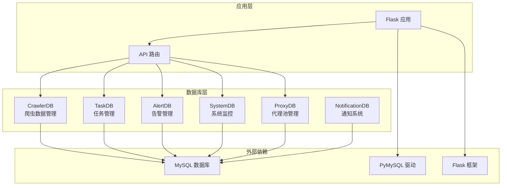
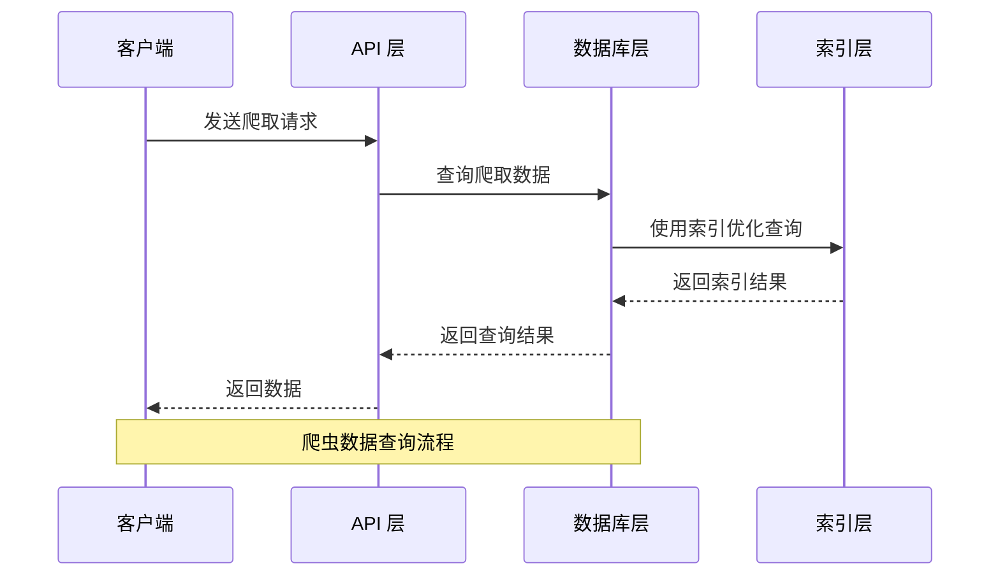
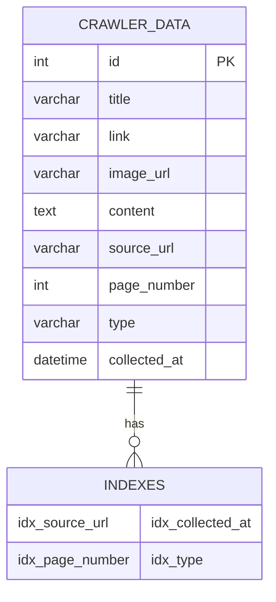
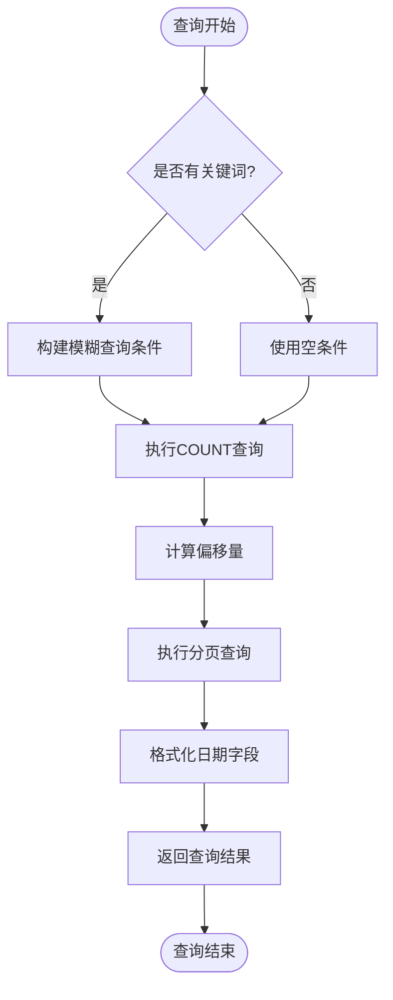
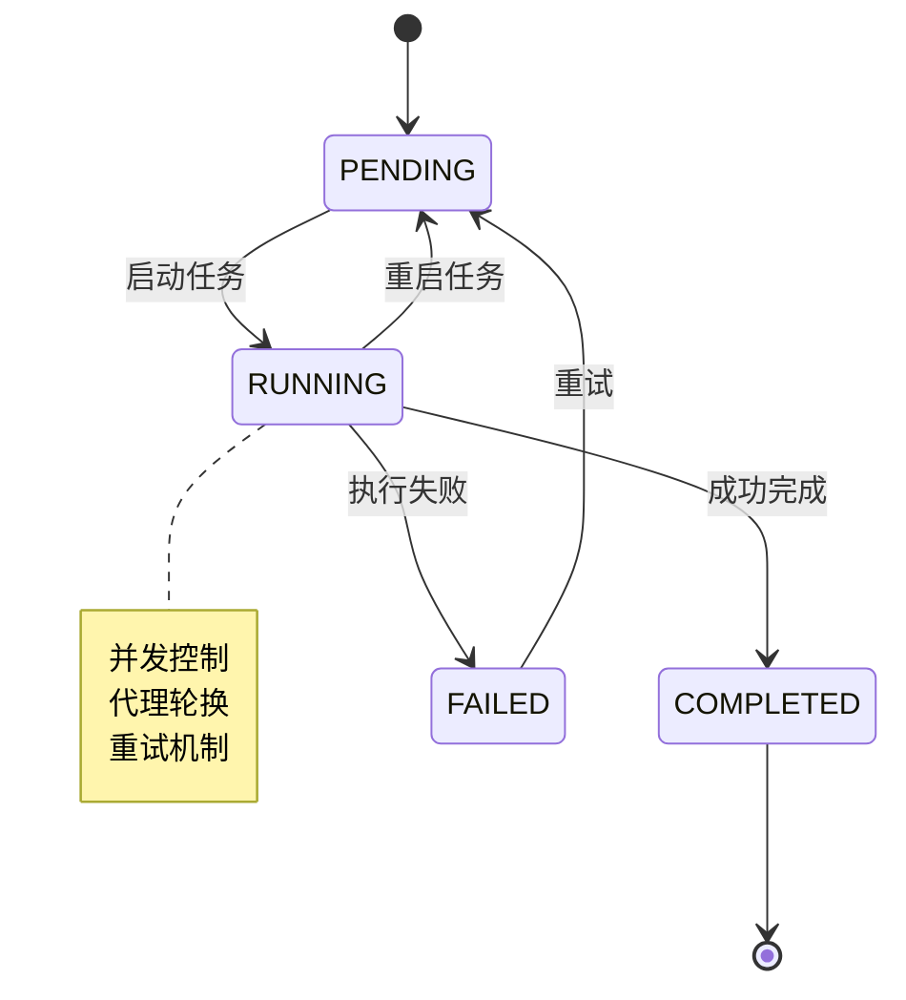
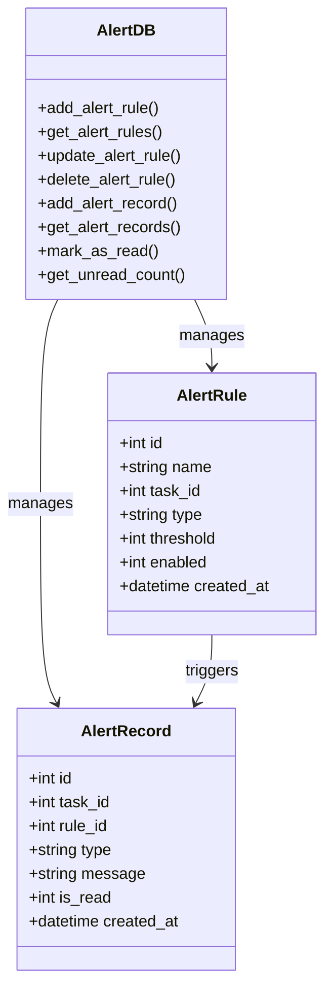
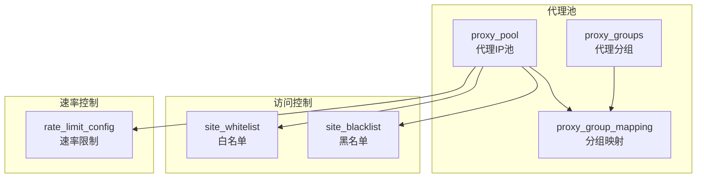
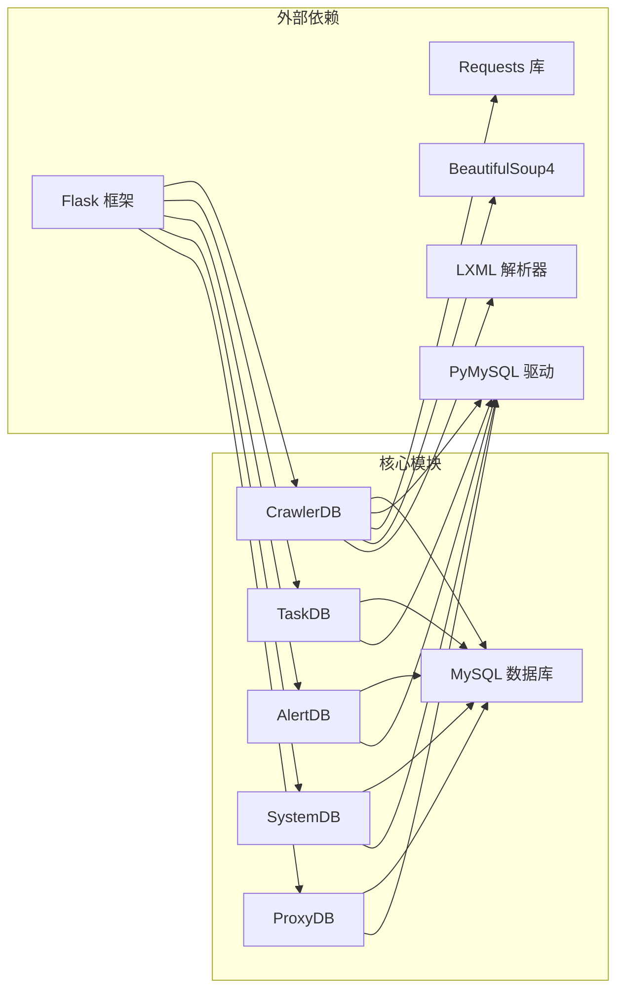

# 爬虫与任务数据

<cite>
**本文档引用的文件**
- [crawler_db.py](file://python/crawler_db.py)
- [task_db.py](file://python/task_db.py)
- [alert_db.py](file://python/alert_db.py)
- [system_db.py](file://python/system_db.py)
- [proxy_db.py](file://python/proxy_db.py)
- [notification_db.py](file://python/src/notification_db.py)
- [app_db.py](file://python/app_db.py)
- [requirements.txt](file://python/requirements.txt)
</cite>

## 目录
1. [简介](#简介)
2. [项目结构](#项目结构)
3. [核心组件](#核心组件)
4. [架构概览](#架构概览)
5. [详细组件分析](#详细组件分析)
6. [依赖关系分析](#依赖关系分析)
7. [性能考虑](#性能考虑)
8. [故障排除指南](#故障排除指南)
9. [结论](#结论)

## 简介

本文件为爬虫系统和任务管理的数据设计文档，详细说明了四个核心数据库模块的设计与实现：爬虫数据表(crawler_data)、任务管理表(crawler_tasks)、告警机制表(alert_rules和alert_records)以及系统监控表(system_logs、system_settings、user_preferences)。文档涵盖了数据结构设计、查询优化、去重策略、任务队列管理、告警规则配置和性能监控数据存储等方面，并提供了数据清理策略、历史数据归档和存储空间优化方案。

## 项目结构

该爬虫系统采用模块化设计，每个功能领域都有独立的数据库操作类：

**图表来源**
- [crawler_db.py:1-238](file://python/crawler_db.py#L1-L238)
- [task_db.py:1-533](file://python/task_db.py#L1-L533)
- [alert_db.py:1-314](file://python/alert_db.py#L1-L314)
- [system_db.py:1-317](file://python/system_db.py#L1-L317)
- [proxy_db.py:1-528](file://python/proxy_db.py#L1-L528)
- [notification_db.py:1-357](file://python/src/notification_db.py#L1-L357)

**章节来源**
- [crawler_db.py:1-238](file://python/crawler_db.py#L1-L238)
- [task_db.py:1-533](file://python/task_db.py#L1-L533)
- [alert_db.py:1-314](file://python/alert_db.py#L1-L314)
- [system_db.py:1-317](file://python/system_db.py#L1-L317)
- [proxy_db.py:1-528](file://python/proxy_db.py#L1-L528)
- [notification_db.py:1-357](file://python/src/notification_db.py#L1-L357)

## 核心组件

### 爬虫数据表 (crawler_data)

爬虫数据表是系统的核心存储组件，负责保存所有爬取到的数据。该表设计支持多种数据类型，包括链接、图片和混合内容。

**数据表结构设计要点：**
- 主键自增ID，确保唯一性
- 多字段索引优化查询性能
- 支持JSON字段存储复杂配置
- 宽字符集支持国际化内容

**核心字段说明：**
- `title`: 文章标题，支持500字符
- `link`: 内容链接，支持1000字符
- `image_url`: 图片URL，支持1000字符
- `content`: 正文内容，使用TEXT类型支持大文本
- `source_url`: 来源网址，支持500字符
- `page_number`: 爬取页码，默认1
- `type`: 数据类型，支持link、image、mixed
- `collected_at`: 采集时间，默认当前时间

**章节来源**
- [crawler_db.py:54-71](file://python/crawler_db.py#L54-L71)
- [crawler_db.py:96-139](file://python/crawler_db.py#L96-L139)

### 任务管理表 (crawler_tasks)

任务管理表负责跟踪所有爬虫任务的状态和配置。系统支持定时任务、并发控制和重试机制。

**任务状态管理：**
- PENDING: 待执行
- RUNNING: 执行中  
- COMPLETED: 已完成
- FAILED: 执行失败

**调度策略：**
- Cron表达式支持复杂的定时调度
- 并发数控制防止资源过载
- 重试机制确保任务可靠性
- 代理组配置支持IP轮换

**章节来源**
- [task_db.py:52-73](file://python/task_db.py#L52-L73)
- [task_db.py:172-209](file://python/task_db.py#L172-L209)

### 告警机制表 (alert_rules & alert_records)

告警系统提供多层次的监控和通知机制，支持全局和任务级别的告警规则。

**告警类型：**
- FAILED: 任务执行失败
- TIMEOUT: 任务超时
- DATA_ANOMALY: 数据异常
- IP_BLOCKED: IP被封禁

**告警规则配置：**
- 可配置阈值触发条件
- 支持启用/禁用状态
- 全局规则和任务特定规则
- 实时告警记录和状态管理

**章节来源**
- [alert_db.py:51-81](file://python/alert_db.py#L51-L81)
- [alert_db.py:93-117](file://python/alert_db.py#L93-L117)

### 系统监控表 (system_logs, system_settings, user_preferences)

系统监控层提供完整的系统运行状态跟踪和配置管理。

**监控功能：**
- 日志级别分类（INFO、WARNING、ERROR）
- 源组件追踪
- 时间戳精确记录
- 设置键值对管理

**用户偏好：**
- 主题配置（light/dark）
- 通知配置JSON存储
- 导出路径设置
- 用户特定配置

**章节来源**
- [system_db.py:52-87](file://python/system_db.py#L52-L87)
- [system_db.py:255-314](file://python/system_db.py#L255-L314)

## 架构概览

系统采用分层架构设计，每个数据库操作类都封装了完整的CRUD操作和业务逻辑。

**图表来源**
- [crawler_db.py:141-185](file://python/crawler_db.py#L141-L185)
- [task_db.py:123-170](file://python/task_db.py#L123-L170)

**章节来源**
- [crawler_db.py:141-185](file://python/crawler_db.py#L141-L185)
- [task_db.py:123-170](file://python/task_db.py#L123-L170)

## 详细组件分析

### 爬虫数据表详细分析

#### 数据结构设计

**图表来源**
- [crawler_db.py:55-69](file://python/crawler_db.py#L55-L69)

#### 去重策略实现

系统通过以下机制实现数据去重：

1. **索引约束**: `source_url`字段建立索引，确保URL唯一性
2. **类型区分**: 不同数据类型使用不同的处理逻辑
3. **批量插入优化**: 单条数据插入失败不影响整体批处理

#### 查询优化策略

**图表来源**
- [crawler_db.py:141-185](file://python/crawler_db.py#L141-L185)

**章节来源**
- [crawler_db.py:54-87](file://python/crawler_db.py#L54-L87)
- [crawler_db.py:141-185](file://python/crawler_db.py#L141-L185)

### 任务生命周期管理

#### 任务状态转换图

**图表来源**
- [task_db.py:56](file://python/task_db.py#L56)
- [task_db.py:515-530](file://python/task_db.py#L515-L530)

#### 任务调度策略

系统支持多种调度策略：

1. **定时调度**: Cron表达式支持复杂的时间模式
2. **间隔调度**: 固定时间间隔重复执行
3. **并发控制**: 限制同时执行的任务数量
4. **重试策略**: 失败自动重试，支持指数退避

**章节来源**
- [task_db.py:56-67](file://python/task_db.py#L56-L67)
- [task_db.py:172-209](file://python/task_db.py#L172-L209)

### 告警机制详细设计

#### 告警规则配置

**图表来源**
- [alert_db.py:51-81](file://python/alert_db.py#L51-L81)
- [alert_db.py:93-197](file://python/alert_db.py#L93-L197)

#### 告警触发条件

系统支持多种告警触发条件：

1. **失败告警**: 任务执行失败次数超过阈值
2. **超时告警**: 任务执行时间超过设定时限
3. **数据异常告警**: 数据量或质量指标异常
4. **IP封禁告警**: 代理IP被目标网站封禁

**章节来源**
- [alert_db.py:51-81](file://python/alert_db.py#L51-L81)
- [alert_db.py:93-197](file://python/alert_db.py#L93-L197)

### 代理池管理

#### 代理池架构

**图表来源**
- [proxy_db.py:50-120](file://python/proxy_db.py#L50-L120)

**章节来源**
- [proxy_db.py:50-120](file://python/proxy_db.py#L50-L120)

## 依赖关系分析

系统依赖关系清晰，各模块职责明确：

**图表来源**
- [requirements.txt:1-14](file://python/requirements.txt#L1-L14)
- [app_db.py:6-15](file://python/app_db.py#L6-L15)

**章节来源**
- [requirements.txt:1-14](file://python/requirements.txt#L1-L14)
- [app_db.py:6-15](file://python/app_db.py#L6-L15)

## 性能考虑

### 查询性能优化

1. **索引策略**: 为高频查询字段建立适当索引
2. **分页查询**: 使用LIMIT和OFFSET避免全表扫描
3. **批量操作**: 批量插入减少数据库往返
4. **连接池**: 复用数据库连接提高效率

### 存储优化

1. **数据压缩**: 对大文本字段考虑压缩存储
2. **分区策略**: 按时间分区存储历史数据
3. **归档机制**: 自动归档不常用数据
4. **清理策略**: 定期清理过期数据

### 并发控制

1. **事务管理**: 合理使用事务保证数据一致性
2. **锁机制**: 避免死锁和长时间锁定
3. **异步处理**: 将耗时操作异步化
4. **缓存策略**: 缓存热点数据减少数据库压力

## 故障排除指南

### 常见问题诊断

#### 数据库连接问题

**症状**: 应用启动时报数据库连接错误
**解决方案**: 
1. 检查数据库服务状态
2. 验证连接参数配置
3. 确认网络连通性
4. 检查防火墙设置

#### 表结构不一致

**症状**: 应用运行时报表结构错误
**解决方案**:
1. 检查表是否存在
2. 验证字段完整性
3. 执行表结构升级脚本
4. 重新初始化数据库

#### 查询性能问题

**症状**: 查询响应时间过长
**解决方案**:
1. 分析查询执行计划
2. 添加必要的索引
3. 优化WHERE条件
4. 调整分页参数

**章节来源**
- [crawler_db.py:32-47](file://python/crawler_db.py#L32-L47)
- [task_db.py:32-46](file://python/task_db.py#L32-L46)
- [alert_db.py:31-45](file://python/alert_db.py#L31-L45)

## 结论

本爬虫系统采用模块化设计，通过四个核心数据库模块实现了完整的爬虫数据管理和任务调度功能。系统具有以下特点：

1. **结构清晰**: 每个模块职责明确，便于维护和扩展
2. **性能优化**: 合理的索引策略和查询优化
3. **可靠性高**: 完善的错误处理和重试机制
4. **可扩展性强**: 支持插件化和配置化扩展

建议在实际部署中：
- 根据业务需求调整索引策略
- 建立完善的监控和告警机制
- 制定定期的数据清理和归档策略
- 考虑引入缓存层提升性能
- 建立备份和恢复机制确保数据安全