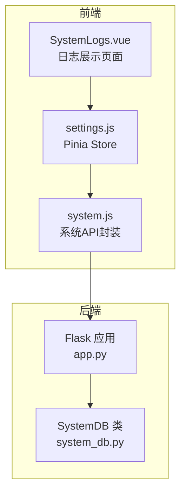
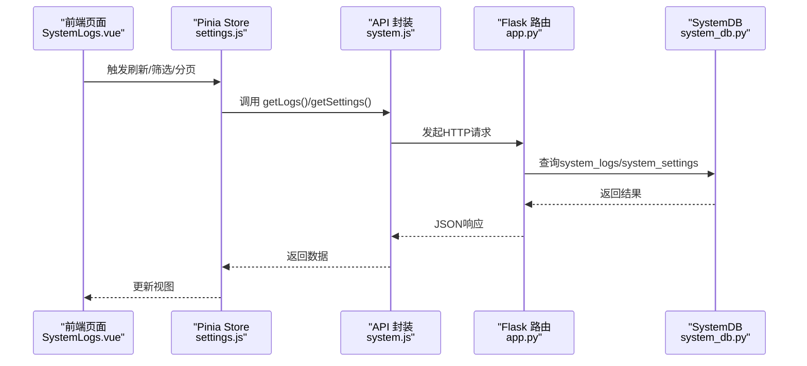
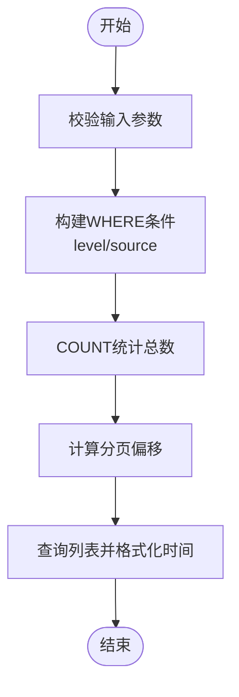
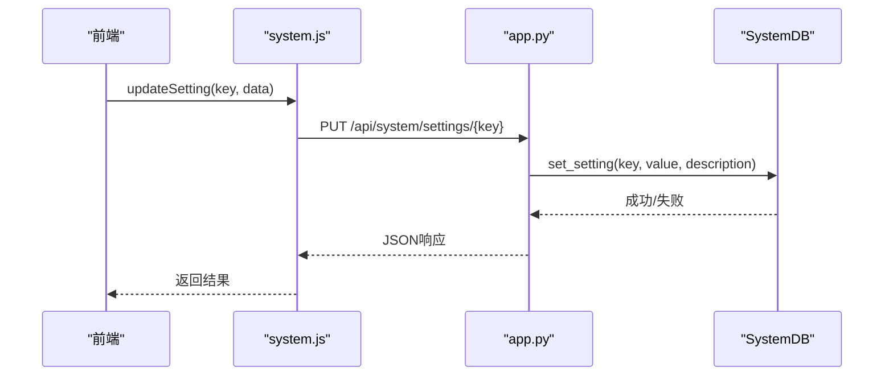
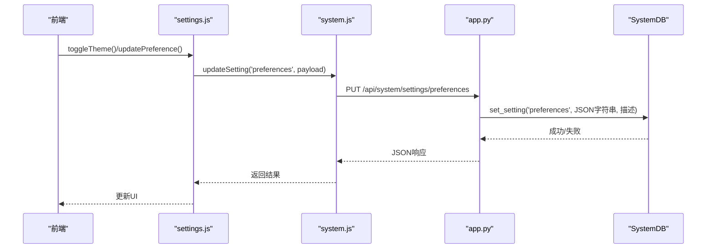
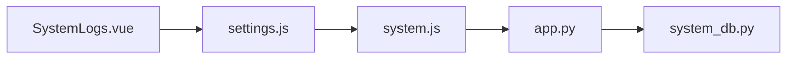

# 系统日志与设置

<cite>
**本文引用的文件**
- [python/system_db.py](file://python/system_db.py)
- [python/app.py](file://python/app.py)
- [python-web/src/views/SystemLogs.vue](file://python-web/src/views/SystemLogs.vue)
- [python-web/src/stores/settings.js](file://python-web/src/stores/settings.js)
- [python-web/src/api/system.js](file://python-web/src/api/system.js)
</cite>

## 目录
1. [简介](#简介)
2. [项目结构](#项目结构)
3. [核心组件](#核心组件)
4. [架构总览](#架构总览)
5. [详细组件分析](#详细组件分析)
6. [依赖分析](#依赖分析)
7. [性能考虑](#性能考虑)
8. [故障排查指南](#故障排查指南)
9. [结论](#结论)
10. [附录](#附录)

## 简介
本文件面向系统日志与设置管理，围绕以下三张表展开：system_logs（系统日志）、system_settings（系统设置）、user_preferences（用户偏好）。内容涵盖：
- 日志级别分类、消息格式规范与查询优化策略
- 设置键值对存储机制与动态更新流程
- 用户偏好的主题、通知等个性化配置管理
- 日志轮转策略建议、设置版本控制思路与用户偏好的序列化存储方案
- 日志查询接口、设置获取与更新的API使用示例

## 项目结构
后端采用Flask提供REST API，数据库访问封装在SystemDB类中；前端使用Vue + Pinia进行状态管理与API调用。

图表来源
- [python-web/src/views/SystemLogs.vue:1-360](file://python-web/src/views/SystemLogs.vue#L1-L360)
- [python-web/src/stores/settings.js:1-59](file://python-web/src/stores/settings.js#L1-L59)
- [python-web/src/api/system.js:1-23](file://python-web/src/api/system.js#L1-L23)
- [python/app.py:1550-1719](file://python/app.py#L1550-L1719)
- [python/system_db.py:1-317](file://python/system_db.py#L1-L317)

章节来源
- [python/system_db.py:1-317](file://python/system_db.py#L1-L317)
- [python/app.py:1550-1719](file://python/app.py#L1550-L1719)
- [python-web/src/views/SystemLogs.vue:1-360](file://python-web/src/views/SystemLogs.vue#L1-L360)
- [python-web/src/stores/settings.js:1-59](file://python-web/src/stores/settings.js#L1-L59)
- [python-web/src/api/system.js:1-23](file://python-web/src/api/system.js#L1-L23)

## 核心组件
- SystemDB：负责数据库连接、表结构初始化、日志写入/查询、设置读写、用户偏好读写。
- Flask 路由：提供系统资源、日志查询、日志清理、设置获取/更新、用户偏好获取/保存等接口。
- 前端组件与Store：日志页面渲染、分页过滤、主题切换、设置与偏好的获取/更新。

章节来源
- [python/system_db.py:7-317](file://python/system_db.py#L7-L317)
- [python/app.py:1554-1719](file://python/app.py#L1554-L1719)
- [python-web/src/views/SystemLogs.vue:98-220](file://python-web/src/views/SystemLogs.vue#L98-L220)
- [python-web/src/stores/settings.js:5-59](file://python-web/src/stores/settings.js#L5-L59)

## 架构总览
后端通过SystemDB统一管理三张表；前端通过API封装调用后端路由，Store集中管理全局设置与用户偏好。

图表来源
- [python-web/src/views/SystemLogs.vue:98-220](file://python-web/src/views/SystemLogs.vue#L98-L220)
- [python-web/src/stores/settings.js:10-41](file://python-web/src/stores/settings.js#L10-L41)
- [python-web/src/api/system.js:4-22](file://python-web/src/api/system.js#L4-L22)
- [python/app.py:1593-1627](file://python/app.py#L1593-L1627)
- [python/system_db.py:122-169](file://python/system_db.py#L122-L169)

## 详细组件分析

### system_logs 表与日志管理
- 表结构要点
  - 主键自增ID
  - level：日志级别，枚举值为INFO、WARNING、ERROR
  - source：日志来源模块/服务
  - message：日志正文
  - created_at：创建时间，默认当前时间
  - 索引：level、source、created_at
- 日志写入
  - 提供add_log方法，插入level/source/message
- 日志查询
  - 支持按level/source过滤
  - 分页查询，按created_at倒序
  - 对created_at字段做字符串格式化返回
- 日志清理
  - 提供clear_logs接口，按天数清理历史日志

图表来源
- [python/system_db.py:122-169](file://python/system_db.py#L122-L169)

章节来源
- [python/system_db.py:51-63](file://python/system_db.py#L51-L63)
- [python/system_db.py:99-122](file://python/system_db.py#L99-L122)
- [python/system_db.py:122-169](file://python/system_db.py#L122-L169)
- [python/system_db.py:170-183](file://python/system_db.py#L170-L183)
- [python/app.py:1593-1627](file://python/app.py#L1593-L1627)
- [python/app.py:1629-1649](file://python/app.py#L1629-L1649)

### system_settings 表与设置管理
- 表结构要点
  - 主键自增ID
  - key：唯一键名
  - value：设置值（文本）
  - description：设置描述
  - 索引：唯一索引key
- 设置读取
  - get_setting：按key查询单条设置
  - get_all_settings：列出全部设置
- 设置更新
  - set_setting：若key存在则更新，否则插入
- 后端接口
  - GET /api/system/settings：获取当前用户设置
  - PUT /api/system/settings/<key>：更新指定key的设置

图表来源
- [python-web/src/api/system.js:20-22](file://python-web/src/api/system.js#L20-L22)
- [python/app.py:1665-1684](file://python/app.py#L1665-L1684)
- [python/system_db.py:200-240](file://python/system_db.py#L200-L240)

章节来源
- [python/system_db.py:65-74](file://python/system_db.py#L65-L74)
- [python/system_db.py:184-254](file://python/system_db.py#L184-L254)
- [python/app.py:1651-1684](file://python/app.py#L1651-L1684)

### user_preferences 表与用户偏好
- 表结构要点
  - 主键自增ID，user_id唯一
  - theme：主题，枚举值light/dark
  - notification_config：JSON对象，存储通知偏好
  - export_path：导出路径
  - created_at：创建时间
- 偏好读取与保存
  - get_user_preferences：按user_id查询
  - save_user_preferences：按user_id更新或插入
- 后端接口
  - GET /api/system/user/preferences：获取当前用户偏好
  - PUT /api/system/user/preferences：保存当前用户偏好

图表来源
- [python-web/src/stores/settings.js:18-41](file://python-web/src/stores/settings.js#L18-L41)
- [python-web/src/api/system.js:20-22](file://python-web/src/api/system.js#L20-L22)
- [python/app.py:1665-1684](file://python/app.py#L1665-L1684)
- [python/system_db.py:200-240](file://python/system_db.py#L200-L240)

章节来源
- [python/system_db.py:76-87](file://python/system_db.py#L76-L87)
- [python/system_db.py:255-314](file://python/system_db.py#L255-L314)
- [python/app.py:1687-1714](file://python/app.py#L1687-L1714)
- [python-web/src/stores/settings.js:26-41](file://python-web/src/stores/settings.js#L26-L41)

### 前端日志页面与设置管理
- 日志页面
  - 支持按级别、关键字、日期范围筛选
  - 分页显示，统计今日日志与错误数
  - 支持刷新、清空、导出（UI提示）
- 设置与偏好
  - Store集中管理theme、preferences、globalSettings
  - 提供fetchSettings、updateSetting、fetchPreferences、updatePreference、toggleTheme

章节来源
- [python-web/src/views/SystemLogs.vue:98-220](file://python-web/src/views/SystemLogs.vue#L98-L220)
- [python-web/src/stores/settings.js:5-59](file://python-web/src/stores/settings.js#L5-L59)

## 依赖分析
- 组件耦合
  - 前端Store依赖API封装，API封装依赖后端路由
  - 后端路由依赖SystemDB进行数据库操作
- 外部依赖
  - Flask、PyMySQL、psutil（系统资源）
- 潜在循环依赖
  - 无直接循环，模块职责清晰

图表来源
- [python-web/src/views/SystemLogs.vue:1-360](file://python-web/src/views/SystemLogs.vue#L1-L360)
- [python-web/src/stores/settings.js:1-59](file://python-web/src/stores/settings.js#L1-L59)
- [python-web/src/api/system.js:1-23](file://python-web/src/api/system.js#L1-L23)
- [python/app.py:1550-1719](file://python/app.py#L1550-L1719)
- [python/system_db.py:1-317](file://python/system_db.py#L1-L317)

## 性能考虑
- 日志查询优化
  - 已建立level、source、created_at索引，适合按级别/来源/时间范围过滤
  - 建议：对高频查询增加复合索引（如level+created_at），避免全表扫描
  - 建议：分页大小限制在合理范围（当前默认20，最大100），避免大页导致内存压力
- 日志清理
  - 提供按天清理接口，建议定期任务清理过期日志，控制表规模
- 设置与偏好
  - 设置键唯一，读写路径简单；建议缓存热点设置于内存，减少DB往返
- 前端渲染
  - 大量日志渲染建议虚拟滚动或后端分页，避免一次性渲染过多DOM

## 故障排查指南
- 数据库连接失败
  - 检查环境变量与连接配置，确认数据库存在且可访问
- 日志查询异常
  - 核对查询参数（level、page、page_size），确认索引是否生效
- 设置更新失败
  - 确认请求体包含value字段，检查唯一键冲突
- 偏好保存失败
  - 确认JSON字段格式正确，user_id有效

章节来源
- [python/system_db.py:32-46](file://python/system_db.py#L32-L46)
- [python/system_db.py:163-165](file://python/system_db.py#L163-L165)
- [python/app.py:1632-1649](file://python/app.py#L1632-L1649)

## 结论
本系统围绕三张表实现了完整的日志、设置与用户偏好管理能力。通过合理的索引设计、接口约束与前端状态管理，能够满足日常运维与个性化需求。建议后续引入日志轮转与设置版本控制机制，进一步提升可维护性与可追溯性。

## 附录

### 日志级别与消息格式规范
- 日志级别
  - INFO：一般信息
  - WARNING：潜在问题
  - ERROR：错误事件
- 消息格式
  - 建议统一格式："[模块/组件] 事件描述（附加上下文）"，便于检索与聚合
  - 示例参考：任务执行、代理验证、请求异常等场景

章节来源
- [python/system_db.py:52-62](file://python/system_db.py#L52-L62)
- [python/system_db.py:99-122](file://python/system_db.py#L99-L122)

### 查询优化策略
- 建议索引
  - level+created_at：按级别与时间范围查询
  - source+created_at：按来源与时间范围查询
- 分页与排序
  - created_at降序分页，避免跳页抖动
- 过滤条件
  - 优先使用索引列作为过滤条件，减少函数运算

章节来源
- [python/system_db.py:58-60](file://python/system_db.py#L58-L60)
- [python/system_db.py:122-169](file://python/system_db.py#L122-L169)

### 日志轮转策略（建议）
- 基于时间的滚动：按日/周/月归档旧日志
- 基于大小的滚动：当日志超过阈值时归档并清理
- 归档保留周期：根据合规要求设定保留天数
- 清理脚本：定期清理过期归档，释放空间

### 设置版本控制（建议）
- 引入settings_versions表，记录每次变更的版本号、变更人、变更时间与变更详情
- 提供回滚接口，按版本号恢复历史设置
- 变更审计：记录关键设置的变更轨迹，便于追溯

### 用户偏好的序列化存储方案
- notification_config采用JSON存储，便于扩展与迁移
- 建议定义schema，校验字段合法性
- 前端默认值与后端默认值保持一致，避免兼容问题

章节来源
- [python/system_db.py:76-87](file://python/system_db.py#L76-L87)
- [python/system_db.py:271-314](file://python/system_db.py#L271-L314)

### API 使用示例

- 获取系统资源
  - 方法：GET
  - 路径：/api/system/resources
  - 返回：CPU/内存/磁盘使用率

- 查询系统日志
  - 方法：GET
  - 路径：/api/system/logs
  - 参数：level、page、page_size
  - 返回：list、total、page、page_size

- 清理系统日志
  - 方法：POST
  - 路径：/api/system/logs/clear
  - 请求体：{ days: 整数 }
  - 返回：清理结果

- 获取系统设置
  - 方法：GET
  - 路径：/api/system/settings
  - 返回：设置集合

- 更新系统设置
  - 方法：PUT
  - 路径：/api/system/settings/{key}
  - 请求体：{ value: 任意 }
  - 返回：更新结果

- 获取用户偏好
  - 方法：GET
  - 路径：/api/system/user/preferences
  - 返回：偏好对象

- 保存用户偏好
  - 方法：PUT
  - 路径：/api/system/user/preferences
  - 请求体：偏好JSON
  - 返回：保存结果

章节来源
- [python/app.py:1555-1590](file://python/app.py#L1555-L1590)
- [python/app.py:1593-1627](file://python/app.py#L1593-L1627)
- [python/app.py:1629-1649](file://python/app.py#L1629-L1649)
- [python/app.py:1651-1684](file://python/app.py#L1651-L1684)
- [python/app.py:1687-1714](file://python/app.py#L1687-L1714)