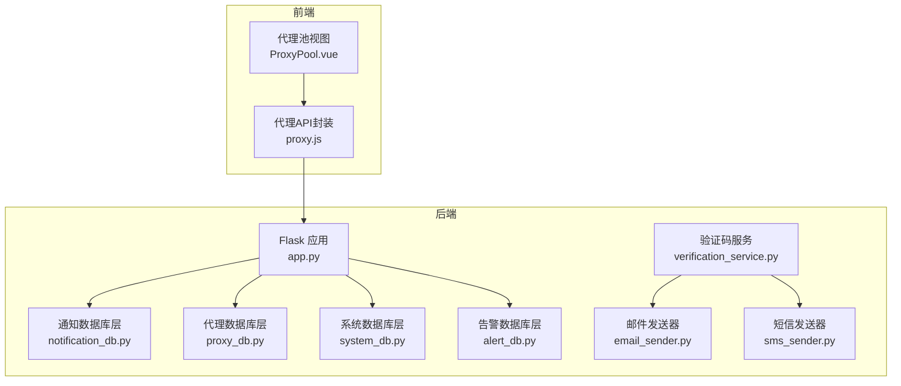
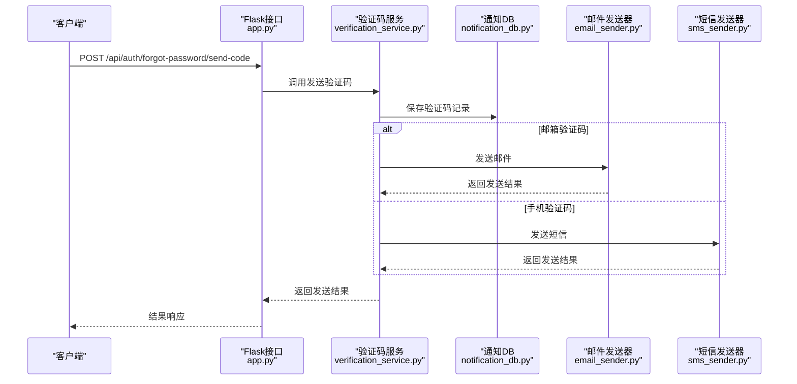
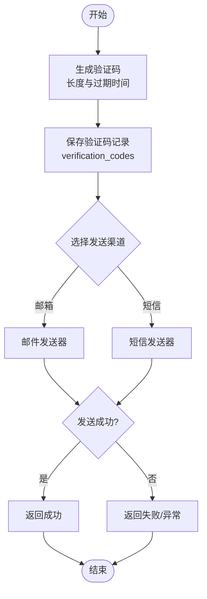
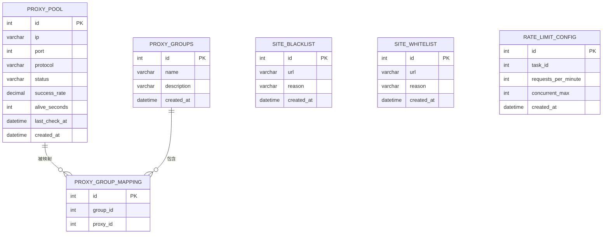
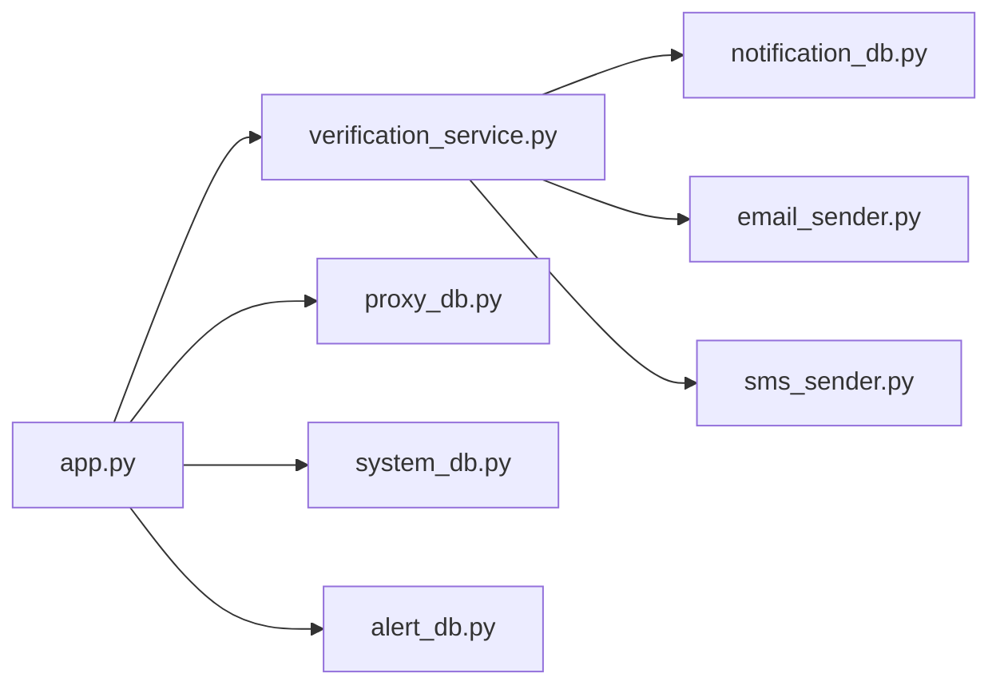

# 通知与代理数据

<cite>
**本文档引用的文件**
- [notification_db.py](file://python/src/notification_db.py)
- [verification_service.py](file://python/src/notifications/verification_service.py)
- [email_sender.py](file://python/src/notifications/email_sender.py)
- [sms_sender.py](file://python/src/notifications/sms_sender.py)
- [proxy_db.py](file://python/proxy_db.py)
- [system_db.py](file://python/system_db.py)
- [alert_db.py](file://python/alert_db.py)
- [app.py](file://python/app.py)
- [proxy.js](file://python-web/src/api/proxy.js)
- [ProxyPool.vue](file://python-web/src/views/ProxyPool.vue)
- [config.py](file://python/src/notifications/config.py)
</cite>

## 目录
1. [简介](#简介)
2. [项目结构](#项目结构)
3. [核心组件](#核心组件)
4. [架构总览](#架构总览)
5. [详细组件分析](#详细组件分析)
6. [依赖分析](#依赖分析)
7. [性能考虑](#性能考虑)
8. [故障排查指南](#故障排查指南)
9. [结论](#结论)
10. [附录](#附录)

## 简介
本文件聚焦于通知系统与代理池的数据设计，涵盖以下方面：
- 通知发送记录的存储结构、状态跟踪与重试机制
- proxy_pool 表的代理服务器管理、健康检查与负载均衡策略
- 验证码数据的存储格式、有效期管理与安全验证机制
- 通知模板管理、代理质量评估与异常处理记录
- 数据同步策略、批量操作优化与数据一致性保障方案

## 项目结构
后端采用 Python + Flask，数据库层统一使用 PyMySQL；前端采用 Vue 3 + Element Plus。通知模块位于 python/src/notifications，代理池与系统日志等模块分别独立实现。

图表来源
- [app.py:1-800](file://python/app.py#L1-L800)
- [notification_db.py:1-357](file://python/src/notification_db.py#L1-L357)
- [verification_service.py:1-108](file://python/src/notifications/verification_service.py#L1-L108)
- [email_sender.py:1-67](file://python/src/notifications/email_sender.py#L1-L67)
- [sms_sender.py:1-65](file://python/src/notifications/sms_sender.py#L1-L65)
- [proxy_db.py:1-528](file://python/proxy_db.py#L1-L528)
- [system_db.py:1-317](file://python/system_db.py#L1-L317)
- [alert_db.py:1-314](file://python/alert_db.py#L1-L314)
- [proxy.js:1-63](file://python-web/src/api/proxy.js#L1-L63)
- [ProxyPool.vue:1-470](file://python-web/src/views/ProxyPool.vue#L1-L470)

章节来源
- [app.py:1-800](file://python/app.py#L1-L800)

## 核心组件
- 通知数据库层：负责用户、验证码、令牌黑名单、密码历史与审计日志的持久化。
- 验证码服务：生成、下发、校验验证码，并与通知发送器协作。
- 邮件/短信发送器：对接阿里云 SDK 发送验证码，返回标准化结果。
- 代理数据库层：管理代理池、分组、黑白名单、速率限制配置。
- 系统数据库层：系统日志、系统设置、用户偏好。
- 告警数据库层：告警规则与告警记录。
- 前端代理 API 封装与代理池视图：提供代理增删改查、分组与黑白名单管理界面。

章节来源
- [notification_db.py:1-357](file://python/src/notification_db.py#L1-L357)
- [verification_service.py:1-108](file://python/src/notifications/verification_service.py#L1-L108)
- [email_sender.py:1-67](file://python/src/notifications/email_sender.py#L1-L67)
- [sms_sender.py:1-65](file://python/src/notifications/sms_sender.py#L1-L65)
- [proxy_db.py:1-528](file://python/proxy_db.py#L1-L528)
- [system_db.py:1-317](file://python/system_db.py#L1-L317)
- [alert_db.py:1-314](file://python/alert_db.py#L1-L314)
- [proxy.js:1-63](file://python-web/src/api/proxy.js#L1-L63)
- [ProxyPool.vue:1-470](file://python-web/src/views/ProxyPool.vue#L1-L470)

## 架构总览
通知与代理相关的关键交互如下：

图表来源
- [app.py:170-210](file://python/app.py#L170-L210)
- [verification_service.py:25-81](file://python/src/notifications/verification_service.py#L25-L81)
- [notification_db.py:147-156](file://python/src/notification_db.py#L147-L156)
- [email_sender.py:13-62](file://python/src/notifications/email_sender.py#L13-L62)
- [sms_sender.py:14-60](file://python/src/notifications/sms_sender.py#L14-L60)

## 详细组件分析

### 通知发送与验证码数据设计
- 存储结构
  - 用户表 users：用户名、邮箱、手机号、密码哈希、登录尝试次数、锁定截止时间、最近登录时间、创建/更新时间。
  - 验证码表 verification_codes：用户ID、验证码、类型（email/sms）、目标（邮箱/手机号）、过期时间、是否已使用、创建时间。
  - 令牌黑名单 token_blacklist：令牌、过期时间、创建时间。
  - 密码历史 password_history：用户ID、密码哈希、创建时间。
  - 审计日志 audit_logs：用户ID、动作、IP、UA、详情、创建时间。
- 状态跟踪
  - 验证码下发后写入 verification_codes，标记为未使用；验证成功后通过 mark_code_used 将 used 置 1。
  - 审计日志用于记录注册、登录、重置密码、修改密码等关键行为。
- 有效期管理
  - 验证码过期时间由验证码服务在生成时计算并写入 expires_at；验证时比较当前时间与 expires_at。
- 安全验证机制
  - 令牌黑名单支持登出后将访问令牌加入黑名单并在有效期内拒绝。
  - 密码历史用于禁止与最近若干次密码重复。
- 重试机制
  - 邮件/短信发送器对底层 SDK 异常进行捕获并返回标准化错误信息；验证码服务根据发送结果决定是否返回成功。

图表来源
- [verification_service.py:22-81](file://python/src/notifications/verification_service.py#L22-L81)
- [notification_db.py:147-188](file://python/src/notification_db.py#L147-L188)
- [email_sender.py:13-62](file://python/src/notifications/email_sender.py#L13-L62)
- [sms_sender.py:14-60](file://python/src/notifications/sms_sender.py#L14-L60)

章节来源
- [notification_db.py:41-104](file://python/src/notification_db.py#L41-L104)
- [notification_db.py:147-188](file://python/src/notification_db.py#L147-L188)
- [verification_service.py:22-101](file://python/src/notifications/verification_service.py#L22-L101)
- [email_sender.py:13-62](file://python/src/notifications/email_sender.py#L13-L62)
- [sms_sender.py:14-60](file://python/src/notifications/sms_sender.py#L14-L60)

### 代理池数据设计与健康检查
- 表结构
  - 代理池 proxy_pool：IP、端口、协议、状态（ONLINE/OFFLINE）、成功率、存活时长、最后检测时间、创建时间；索引覆盖状态与协议。
  - 代理分组 proxy_groups：分组名称、描述、创建时间。
  - 分组映射 proxy_group_mapping：group_id、proxy_id。
  - 黑名单 site_blacklist：URL、原因、创建时间；索引前缀优化。
  - 白名单 site_whitelist：URL、原因、创建时间；索引前缀优化。
  - 速率限制 rate_limit_config：任务ID（可为空表示全局）、每分钟请求数、最大并发、创建时间；索引覆盖任务ID。
- 健康检查与刷新
  - refresh_proxy 更新状态、成功率、存活时长与最后检测时间。
  - get_proxies 支持按状态与协议过滤。
- 负载均衡策略
  - 当前实现未显式定义负载均衡算法；可通过查询 proxy_pool 并结合成功率、存活时长等指标在应用层实现轮询/加权策略。
- 黑白名单与分组
  - 提供黑名单/白名单的增删查；支持将代理分配到分组并通过映射表维护。

图表来源
- [proxy_db.py:50-120](file://python/proxy_db.py#L50-L120)

章节来源
- [proxy_db.py:132-247](file://python/proxy_db.py#L132-L247)
- [proxy_db.py:248-526](file://python/proxy_db.py#L248-L526)

### 通知模板管理与配置
- 配置项
  - 阿里云访问凭据、区域、签名名称、模板编号、开关（邮件/SMS）、验证码长度与有效期。
- 模板使用
  - 邮件与短信发送器通过模板编号与参数发送验证码；前端 Settings 页面提供通知方式开关与推送配置入口。

章节来源
- [config.py:1-20](file://python/src/notifications/config.py#L1-L20)
- [email_sender.py:20-42](file://python/src/notifications/email_sender.py#L20-L42)
- [sms_sender.py:21-35](file://python/src/notifications/sms_sender.py#L21-L35)
- [ProxyPool.vue:83-95](file://python-web/src/views/ProxyPool.vue#L83-L95)

### 异常处理与审计日志
- 异常处理
  - 通知数据库层在连接断开时自动重连，最多重试固定次数；查询失败打印错误并返回默认值。
  - 代理数据库层在各操作中捕获数据库异常并返回错误字符串。
- 审计日志
  - 记录用户关键行为（注册、登录、登出、重置密码、修改密码），便于合规与问题追溯。

章节来源
- [notification_db.py:28-39](file://python/src/notification_db.py#L28-L39)
- [notification_db.py:160-167](file://python/src/notification_db.py#L160-L167)
- [proxy_db.py:161-163](file://python/proxy_db.py#L161-L163)
- [system_db.py:99-118](file://python/system_db.py#L99-L118)
- [notification_db.py:334-342](file://python/src/notification_db.py#L334-L342)

## 依赖分析
- 组件耦合
  - verification_service 依赖 notification_db 与发送器；发送器依赖阿里云 SDK。
  - app.py 作为统一入口，协调认证、通知、代理、系统与告警模块。
- 外部依赖
  - PyMySQL：统一的数据库访问层。
  - 阿里云 SDK：邮件与短信发送能力。
- 可能的循环依赖
  - 各模块通过 app.py 协调，未见直接循环导入。

图表来源
- [verification_service.py:1-108](file://python/src/notifications/verification_service.py#L1-L108)
- [notification_db.py:1-357](file://python/src/notification_db.py#L1-L357)
- [email_sender.py:1-67](file://python/src/notifications/email_sender.py#L1-L67)
- [sms_sender.py:1-65](file://python/src/notifications/sms_sender.py#L1-L65)
- [app.py:1-800](file://python/app.py#L1-L800)
- [proxy_db.py:1-528](file://python/proxy_db.py#L1-L528)
- [system_db.py:1-317](file://python/system_db.py#L1-L317)
- [alert_db.py:1-314](file://python/alert_db.py#L1-L314)

## 性能考虑
- 查询优化
  - 代理池表对 status 与 protocol 建有索引，适合高频筛选。
  - 黑名单/白名单对 URL 建有前缀索引，提升匹配效率。
- 连接管理
  - 通知数据库层在连接失效时自动重连，减少长时间无连接导致的失败。
- 批量操作
  - 建议在代理池与系统日志等高频写入场景采用批量插入/更新，减少往返开销。
- 缓存策略
  - 对热点配置（如速率限制）可在应用层缓存，降低数据库压力。

## 故障排查指南
- 验证码无法接收
  - 检查验证码表是否正确写入且未过期；查看发送器返回的错误信息；确认配置中的模板编号与签名名称。
- 代理不可用
  - 使用 get_proxies 按状态过滤；检查 refresh_proxy 是否定期更新状态与成功率。
- 日志与审计
  - 通过 system_logs 与 audit_logs 快速定位异常来源与时间点。
- 告警记录
  - 使用 alert_db 的规则与记录接口核对告警类型、阈值与未读状态。

章节来源
- [notification_db.py:158-179](file://python/src/notification_db.py#L158-L179)
- [proxy_db.py:132-160](file://python/proxy_db.py#L132-L160)
- [system_db.py:123-162](file://python/system_db.py#L123-L162)
- [alert_db.py:199-278](file://python/alert_db.py#L199-L278)

## 结论
本设计以 PyMySQL 为基础，围绕通知与代理两大领域构建了清晰的数据模型与业务流程。通知侧强调验证码生命周期与安全审计，代理侧强调健康度与可运维性。建议在现有基础上引入缓存与批量写入优化，并在代理池层面增加更细粒度的负载均衡策略与自动剔除逻辑，以进一步提升稳定性与吞吐量。

## 附录
- 数据一致性保障
  - 使用事务包裹关键写入（如验证码保存与使用标记），确保原子性。
  - 对外暴露的接口应统一错误码与返回结构，便于前端与监控系统识别。
- 数据同步策略
  - 代理池与系统日志等可采用异步写入+后台批处理，降低主流程阻塞。
- 代理质量评估
  - 在 refresh_proxy 中扩展延迟、成功率、错误类型统计，形成更全面的质量画像。