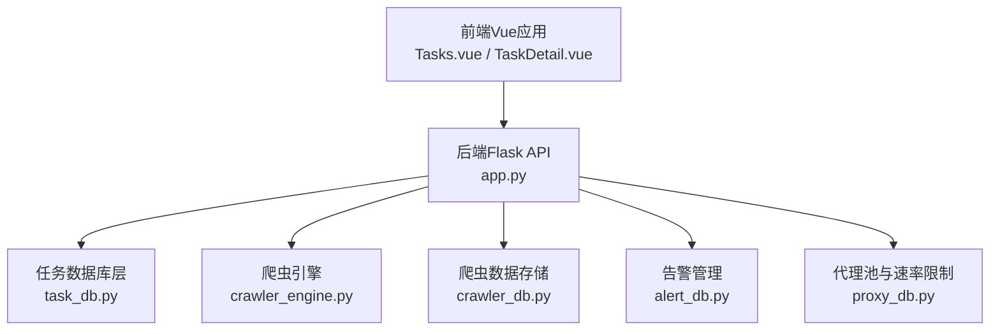
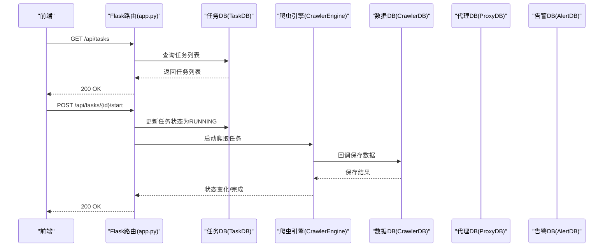
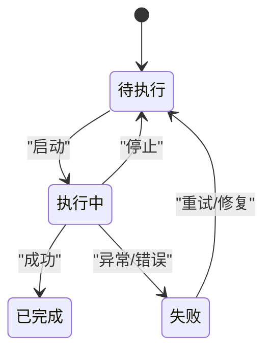
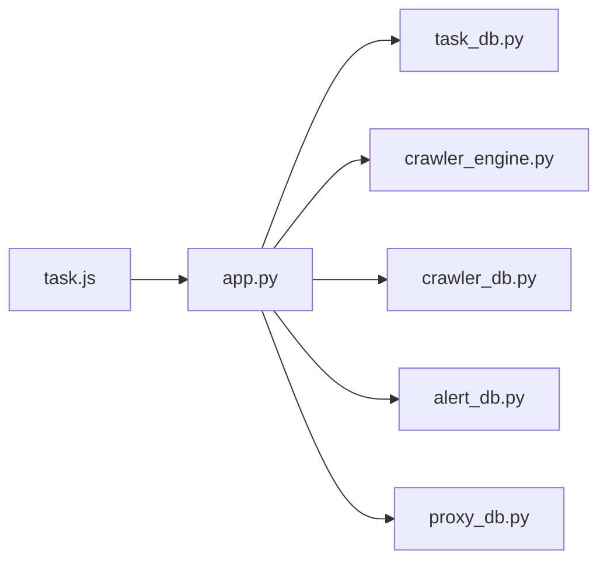

# 任务生命周期管理

<cite>
**本文档引用的文件**
- [task_db.py](file://python/task_db.py)
- [crawler_engine.py](file://python/crawler_engine.py)
- [app.py](file://python/app.py)
- [task.js](file://python-web/src/api/task.js)
- [Tasks.vue](file://python-web/src/views/Tasks.vue)
- [TaskDetail.vue](file://python-web/src/views/TaskDetail.vue)
- [crawler_db.py](file://python/crawler_db.py)
- [alert_db.py](file://python/alert_db.py)
- [proxy_db.py](file://python/proxy_db.py)
</cite>

## 目录
1. [简介](#简介)
2. [项目结构](#项目结构)
3. [核心组件](#核心组件)
4. [架构总览](#架构总览)
5. [详细组件分析](#详细组件分析)
6. [依赖关系分析](#依赖关系分析)
7. [性能考虑](#性能考虑)
8. [故障排查指南](#故障排查指南)
9. [结论](#结论)
10. [附录](#附录)

## 简介
本文件系统性阐述任务生命周期管理的设计与实现，覆盖任务从创建、启动、执行到完成或失败的全链路流程；解释状态机模型与转换条件；梳理调度策略（Cron表达式、定时执行、手动触发）、并发控制与资源管理；详述任务配置参数（目标URL、代理组、重试机制、告警规则）、权限控制与用户管理；并提供完整的任务管理API接口文档与最佳实践建议。

## 项目结构
后端采用Flask微服务，前端采用Vue 3单页应用，数据库层统一使用PyMySQL连接MySQL。任务管理相关模块分布如下：
- 后端服务入口与路由：app.py
- 任务数据库层：task_db.py
- 爬虫引擎：crawler_engine.py
- 爬虫数据存储：crawler_db.py
- 告警管理：alert_db.py
- 代理池与速率限制：proxy_db.py
- 前端API封装：python-web/src/api/task.js
- 任务列表与详情视图：python-web/src/views/Tasks.vue、TaskDetail.vue

图表来源
- [app.py:1-800](file://python/app.py#L1-L800)
- [task_db.py:1-533](file://python/task_db.py#L1-L533)
- [crawler_engine.py:1-533](file://python/crawler_engine.py#L1-L533)
- [crawler_db.py:1-238](file://python/crawler_db.py#L1-L238)
- [alert_db.py:1-314](file://python/alert_db.py#L1-L314)
- [proxy_db.py:1-528](file://python/proxy_db.py#L1-L528)

章节来源
- [app.py:1-800](file://python/app.py#L1-L800)

## 核心组件
- 任务数据库层（TaskDB）：负责任务表、模板、版本、收藏、收藏等表的CRUD与查询，提供任务状态更新、模板管理、版本回滚等功能。
- 爬虫引擎（CrawlerEngine）：多线程爬取、UA伪装、请求延时、页面解析、状态跟踪与停止控制。
- 爬虫数据存储（CrawlerDB）：批量保存爬取结果、分页查询、清空与导出。
- 告警管理（AlertDB）：告警规则与记录的增删改查、未读计数。
- 代理池与速率限制（ProxyDB）：代理IP管理、分组映射、白黑名单、速率限制配置。
- 前端API封装（task.js）：封装任务相关的REST接口调用。
- 视图组件（Tasks.vue、TaskDetail.vue）：任务列表展示、状态筛选、详情编辑、日志与执行记录可视化。

章节来源
- [task_db.py:1-533](file://python/task_db.py#L1-L533)
- [crawler_engine.py:1-533](file://python/crawler_engine.py#L1-L533)
- [crawler_db.py:1-238](file://python/crawler_db.py#L1-L238)
- [alert_db.py:1-314](file://python/alert_db.py#L1-L314)
- [proxy_db.py:1-528](file://python/proxy_db.py#L1-L528)
- [task.js:1-67](file://python-web/src/api/task.js#L1-L67)
- [Tasks.vue:1-800](file://python-web/src/views/Tasks.vue#L1-L800)
- [TaskDetail.vue:1-800](file://python-web/src/views/TaskDetail.vue#L1-L800)

## 架构总览
后端通过Flask路由暴露任务管理API，前端通过task.js调用对应接口。任务状态由TaskDB维护，爬虫执行由CrawlerEngine驱动，数据落库由CrawlerDB完成，代理与速率限制由ProxyDB提供，告警由AlertDB记录。

图表来源
- [app.py:475-643](file://python/app.py#L475-L643)
- [task_db.py:515-531](file://python/task_db.py#L515-L531)
- [crawler_engine.py:464-531](file://python/crawler_engine.py#L464-L531)
- [crawler_db.py:96-139](file://python/crawler_db.py#L96-L139)

## 详细组件分析

### 任务状态机与生命周期
- 状态定义：PENDING（待执行）、RUNNING（执行中）、COMPLETED（已完成）、FAILED（失败）
- 状态转换：
  - PENDING → RUNNING：手动启动或定时调度触发
  - RUNNING → COMPLETED：正常完成
  - RUNNING → FAILED：异常中断或错误
  - FAILED → PENDING：重试或修复后重新调度
  - RUNNING → PENDING：手动停止
- 状态持久化：TaskDB提供状态更新接口，前端与后端共同维护状态一致性。

图表来源
- [task_db.py:515-531](file://python/task_db.py#L515-L531)
- [crawler_engine.py:400-463](file://python/crawler_engine.py#L400-L463)

章节来源
- [task_db.py:515-531](file://python/task_db.py#L515-L531)
- [crawler_engine.py:400-463](file://python/crawler_engine.py#L400-L463)

### 任务调度策略
- Cron表达式：任务表包含cron_expr字段，用于定时调度（具体调度器实现未在仓库中直接体现，可通过外部调度器或后端轮询实现）。
- 定时执行：结合Cron表达式与任务状态，定期触发任务启动。
- 手动触发：通过API手动启动/停止任务。

章节来源
- [task_db.py:56-63](file://python/task_db.py#L56-L63)
- [app.py:625-662](file://python/app.py#L625-L662)

### 并发控制与资源管理
- 并发数：任务配置包含concurrency字段，用于控制并发数量。
- 请求间隔：interval_seconds用于控制请求间隔，避免过快触发反爬。
- 代理组：proxy_group字段关联代理池，ProxyDB提供代理分组与映射。
- 速率限制：ProxyDB提供每分钟请求数与最大并发的配置，支持任务级与全局配置。

章节来源
- [task_db.py:58-62](file://python/task_db.py#L58-L62)
- [proxy_db.py:443-526](file://python/proxy_db.py#L443-L526)

### 任务配置参数详解
- 目标URL：target_url，用于指定爬取入口。
- 代理组：proxy_group，关联代理池分组。
- 重试机制：retry_count与retry_interval，控制最大重试次数与间隔。
- 告警规则：alert_rules（JSON），定义告警类型、阈值与启用状态。
- 其他：cron_expr（Cron表达式）、concurrency（并发数）、interval_seconds（请求间隔）、config（自定义配置）。

章节来源
- [task_db.py:55-64](file://python/task_db.py#L55-L64)

### 权限控制与用户管理
- 登录认证：后端提供登录、刷新、登出接口，并记录审计日志。
- 任务隔离：任务与用户ID绑定，查询与操作均需校验用户身份。
- 前端路由守卫：通过装饰器login_required保护任务相关API。

章节来源
- [app.py:53-167](file://python/app.py#L53-L167)
- [app.py:475-643](file://python/app.py#L475-L643)

### 任务管理API接口文档
- 获取任务列表
  - 方法：GET /api/tasks
  - 参数：status、keyword、page、page_size
  - 返回：任务列表与总数
- 创建任务
  - 方法：POST /api/tasks
  - 参数：name、task_type、config、description、template_id
  - 返回：任务ID
- 获取任务详情
  - 方法：GET /api/tasks/{id}
  - 返回：任务详情
- 更新任务
  - 方法：PUT /api/tasks/{id}
  - 参数：name、task_type、config、description
  - 返回：更新结果
- 删除任务
  - 方法：DELETE /api/tasks/{id}
  - 返回：删除结果
- 启动任务
  - 方法：POST /api/tasks/{id}/start
  - 返回：启动结果
- 停止任务
  - 方法：POST /api/tasks/{id}/stop
  - 返回：停止结果
- 获取模板列表
  - 方法：GET /api/tasks/templates
  - 返回：模板列表
- 创建模板
  - 方法：POST /api/tasks/templates
  - 参数：name、task_type、config、description
  - 返回：模板ID
- 删除模板
  - 方法：DELETE /api/tasks/templates/{id}
  - 返回：删除结果
- 获取版本列表
  - 方法：GET /api/tasks/{id}/versions
  - 返回：版本列表
- 版本回滚
  - 方法：POST /api/tasks/{id}/versions/rollback
  - 参数：version_id
  - 返回：回滚结果

章节来源
- [app.py:475-796](file://python/app.py#L475-L796)
- [task.js:1-67](file://python-web/src/api/task.js#L1-L67)

### 关键实现细节与最佳实践
- 状态更新原子性：TaskDB.update_task_status确保状态变更持久化。
- 爬取流程健壮性：CrawlerEngine对403、超时、连接错误进行分级处理与重试。
- 数据落库幂等：CrawlerDB.save_batch逐条插入并跳过异常，保证整体成功。
- 前端交互：Tasks.vue与TaskDetail.vue提供状态筛选、日志与执行记录可视化，提升可观测性。
- 告警闭环：AlertDB记录告警并标记未读，便于问题追踪与处理。

章节来源
- [task_db.py:515-531](file://python/task_db.py#L515-L531)
- [crawler_engine.py:113-169](file://python/crawler_engine.py#L113-L169)
- [crawler_db.py:96-139](file://python/crawler_db.py#L96-L139)
- [alert_db.py:199-223](file://python/alert_db.py#L199-L223)
- [Tasks.vue:189-256](file://python-web/src/views/Tasks.vue#L189-L256)
- [TaskDetail.vue:249-314](file://python-web/src/views/TaskDetail.vue#L249-L314)

## 依赖关系分析
- 后端模块耦合度低，职责清晰：路由层仅编排业务调用，各DB层独立维护。
- 前端通过task.js统一封装API，降低重复代码与跨域复杂度。
- 任务状态与爬取状态分离：TaskDB维护任务状态，CrawlerEngine维护引擎状态，二者通过回调与状态更新保持一致。

图表来源
- [app.py:1-800](file://python/app.py#L1-L800)
- [task.js:1-67](file://python-web/src/api/task.js#L1-L67)

章节来源
- [app.py:1-800](file://python/app.py#L1-L800)
- [task.js:1-67](file://python-web/src/api/task.js#L1-L67)

## 性能考虑
- 线程与锁：CrawlerEngine使用线程事件控制停止，避免阻塞主线程。
- 数据库索引：任务表按status、user_id、name建立索引，提升查询效率。
- 批量写入：CrawlerDB批量插入减少事务开销。
- 代理与速率：ProxyDB提供速率限制配置，避免触发目标站点风控。

## 故障排查指南
- 状态不一致：确认TaskDB.update_task_status调用与CrawlerEngine状态同步。
- 爬取失败：检查CrawlerEngine的错误消息与网络状态，核对代理与请求头设置。
- 数据缺失：核查CrawlerDB.save_batch的异常处理与日志输出。
- 告警未触发：检查AlertDB规则配置与触发条件。

章节来源
- [crawler_engine.py:400-463](file://python/crawler_engine.py#L400-L463)
- [crawler_db.py:96-139](file://python/crawler_db.py#L96-L139)
- [alert_db.py:93-118](file://python/alert_db.py#L93-L118)

## 结论
该任务生命周期管理方案通过清晰的状态机、完善的调度与并发控制、可扩展的配置与告警体系，以及前后端协同的可观测性设计，实现了从创建到完成/失败的全生命周期闭环。建议后续引入独立调度器以稳定执行Cron任务，并增加任务依赖与依赖图谱以支撑复杂场景。

## 附录
- 前端任务视图：Tasks.vue与TaskDetail.vue提供直观的任务管理界面。
- API封装：task.js统一管理任务相关接口，便于复用与测试。

章节来源
- [Tasks.vue:1-800](file://python-web/src/views/Tasks.vue#L1-L800)
- [TaskDetail.vue:1-800](file://python-web/src/views/TaskDetail.vue#L1-L800)
- [task.js:1-67](file://python-web/src/api/task.js#L1-L67)