# 任务管理系统

<cite>
**本文档引用的文件**
- [app.py](file://python/app.py)
- [task_db.py](file://python/task_db.py)
- [task.js](file://python-web/src/api/task.js)
- [Tasks.vue](file://python-web/src/views/Tasks.vue)
- [TaskDetail.vue](file://python-web/src/views/TaskDetail.vue)
- [TaskTemplates.vue](file://python-web/src/views/TaskTemplates.vue)
- [TaskVersions.vue](file://python-web/src/views/TaskVersions.vue)
- [index.js](file://python-web/src/api/index.js)
- [vite.config.js](file://python-web/vite.config.js)
- [requirements.txt](file://python/requirements.txt)
- [PROJECT_README.md](file://PROJECT_README.md)
</cite>

## 目录
1. [简介](#简介)
2. [项目结构](#项目结构)
3. [核心组件](#核心组件)
4. [架构概览](#架构概览)
5. [详细组件分析](#详细组件分析)
6. [依赖关系分析](#依赖关系分析)
7. [性能考虑](#性能考虑)
8. [故障排除指南](#故障排除指南)
9. [结论](#结论)
10. [附录](#附录)

## 简介

任务管理系统是一个基于Python Flask + Vue3的可视化任务管理平台，专门用于管理复杂的业务流程任务。该系统提供了完整的企业级任务管理功能，包括任务的创建、编辑、调度、执行和监控机制。

### 主要特性

- **任务生命周期管理**：从创建到执行再到监控的完整生命周期
- **版本控制系统**：自动保存任务配置版本，支持版本回滚
- **模板设计系统**：预设任务模板，提高任务创建效率
- **并行执行策略**：支持多任务并发执行和资源管理
- **依赖关系管理**：任务间的依赖关系和执行顺序控制
- **实时监控**：任务执行状态、日志和性能指标监控
- **参数配置**：灵活的任务参数配置和动态调整
- **执行历史追踪**：完整的任务执行历史和审计日志

## 项目结构

该系统采用前后端分离架构，后端使用Python Flask提供RESTful API，前端使用Vue3构建现代化的用户界面。

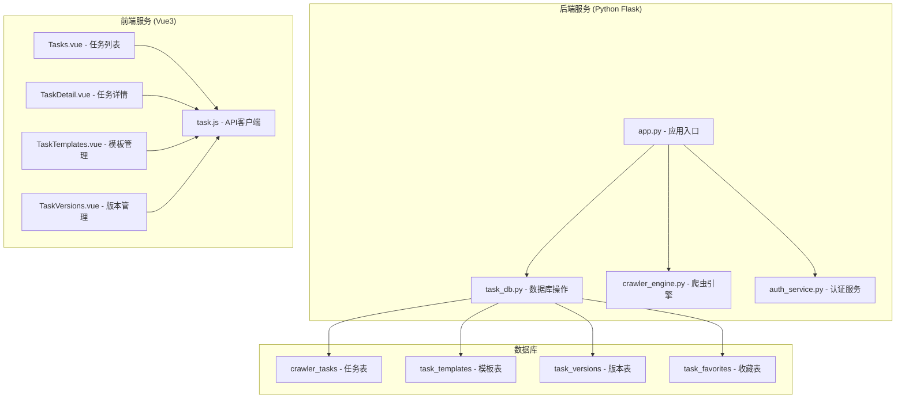

**图表来源**
- [app.py:1-50](file://python/app.py#L1-L50)
- [task_db.py:47-112](file://python/task_db.py#L47-L112)
- [Tasks.vue:1-50](file://python-web/src/views/Tasks.vue#L1-L50)

**章节来源**
- [PROJECT_README.md:63-97](file://PROJECT_README.md#L63-L97)
- [requirements.txt:1-14](file://python/requirements.txt#L1-L14)

## 核心组件

### 后端核心组件

系统的核心后端组件包括任务管理数据库层、认证服务和API路由控制器。

#### 任务数据库层 (TaskDB)

任务数据库层负责所有任务相关的数据持久化操作，包括任务创建、更新、删除和查询。

**关键功能**：
- 任务表结构设计和管理
- 模板系统支持
- 版本控制系统
- 收藏功能
- 状态管理

#### API路由控制器

API路由控制器提供完整的任务管理RESTful接口，支持CRUD操作和高级功能。

**主要路由**：
- 任务管理：`/api/tasks` (GET, POST, PUT, DELETE)
- 任务操作：`/api/tasks/<id>/start`, `/api/tasks/<id>/stop`
- 模板管理：`/api/tasks/templates` (GET, POST, DELETE)
- 版本管理：`/api/tasks/<id>/versions` (GET, POST)

### 前端核心组件

前端采用Vue3 Composition API构建，提供响应式的用户界面和交互体验。

#### 视图组件

- **Tasks.vue**：任务列表展示和管理
- **TaskDetail.vue**：任务详情和配置编辑
- **TaskTemplates.vue**：任务模板管理和创建
- **TaskVersions.vue**：任务版本历史和回滚

#### API客户端

统一的API客户端封装，提供类型安全的HTTP请求和响应处理。

**章节来源**
- [task_db.py:7-533](file://python/task_db.py#L7-L533)
- [app.py:473-800](file://python/app.py#L473-L800)
- [task.js:1-67](file://python-web/src/api/task.js#L1-L67)

## 架构概览

系统采用分层架构设计，确保关注点分离和代码的可维护性。

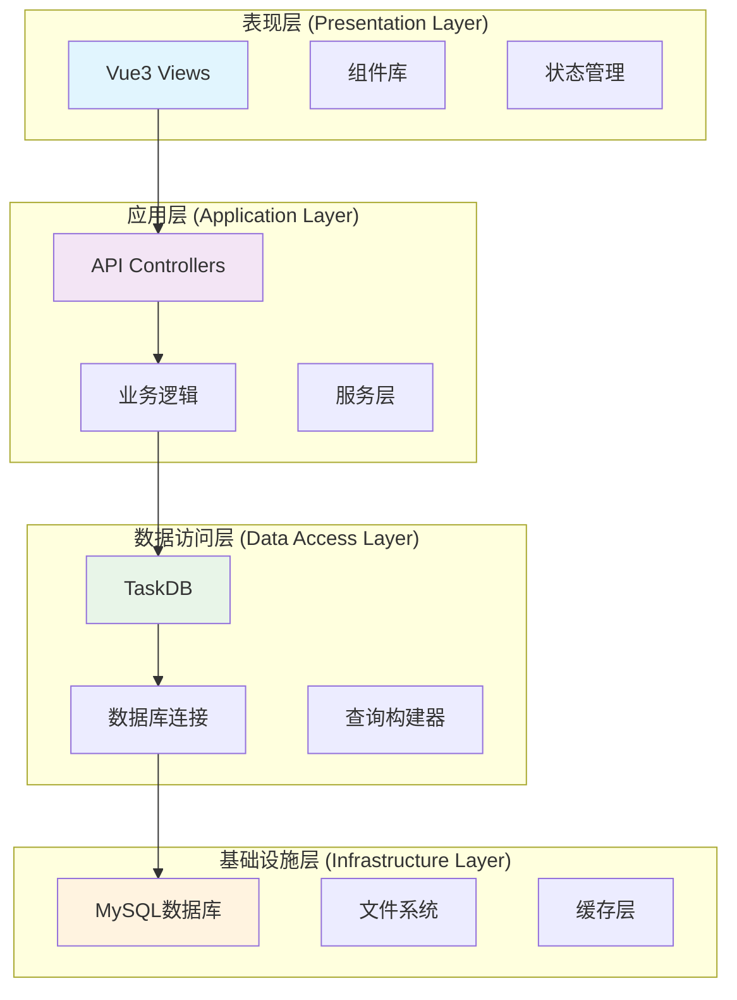

**图表来源**
- [app.py:18-35](file://python/app.py#L18-L35)
- [task_db.py:120-122](file://python/task_db.py#L120-L122)

### 数据流架构

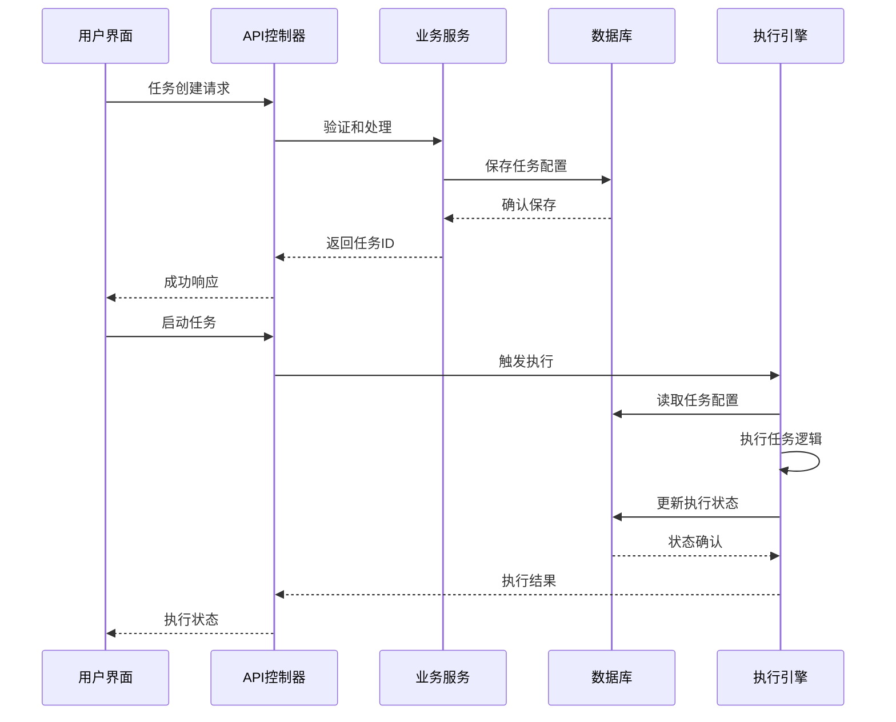

**图表来源**
- [app.py:513-551](file://python/app.py#L513-L551)
- [task_db.py:172-210](file://python/task_db.py#L172-L210)

## 详细组件分析

### 任务生命周期管理

任务生命周期管理是系统的核心功能，涵盖了从任务创建到销毁的完整过程。

#### 任务状态模型

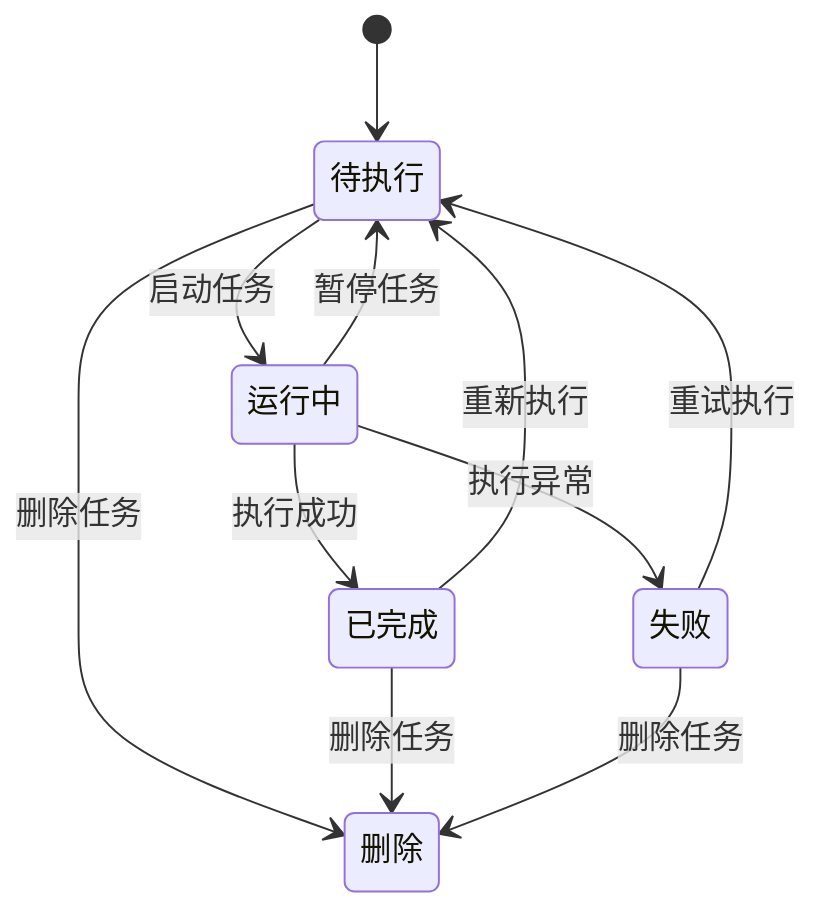

**图表来源**
- [task_db.py:56-67](file://python/task_db.py#L56-L67)

#### 任务创建流程

任务创建流程确保了任务配置的完整性和有效性验证。

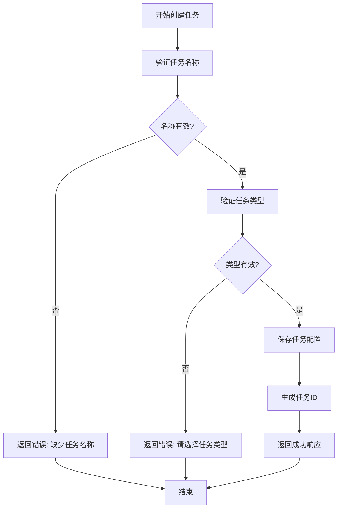

**图表来源**
- [app.py:515-551](file://python/app.py#L515-L551)

**章节来源**
- [app.py:513-623](file://python/app.py#L513-L623)
- [task_db.py:172-210](file://python/task_db.py#L172-L210)

### 版本控制系统

版本控制系统确保任务配置的历史追踪和可恢复性。

#### 版本存储机制

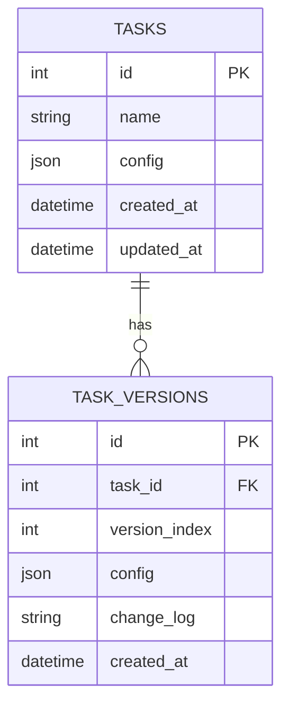

**图表来源**
- [task_db.py:89-99](file://python/task_db.py#L89-L99)

#### 版本回滚流程

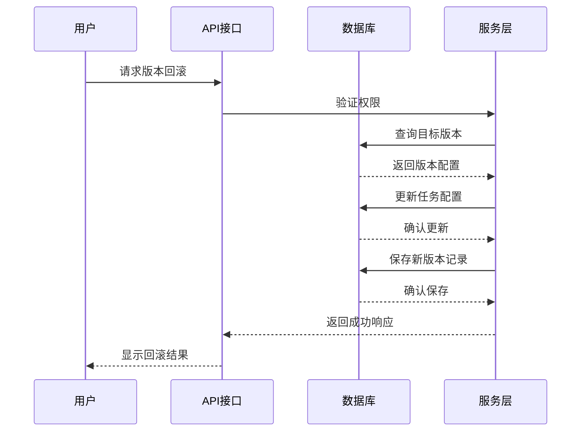

**图表来源**
- [app.py:771-797](file://python/app.py#L771-L797)
- [task_db.py:420-445](file://python/task_db.py#L420-L445)

**章节来源**
- [app.py:751-797](file://python/app.py#L751-L797)
- [task_db.py:367-445](file://python/task_db.py#L367-L445)

### 模板设计系统

模板系统提供了标准化的任务配置方案，提高了任务创建的效率和一致性。

#### 模板管理流程


**图表来源**
- [app.py:679-749](file://python/app.py#L679-L749)
- [task_db.py:305-366](file://python/task_db.py#L305-L366)

#### 模板参数配置

模板系统支持以下配置参数：

| 参数名称 | 类型 | 描述 | 默认值 |
|---------|------|------|--------|
| name | string | 模板名称 | 必填 |
| description | string | 模板描述 | 空字符串 |
| config | json | 任务配置 | 空对象 |
| user_id | integer | 用户标识 | 当前用户 |

**章节来源**
- [app.py:665-749](file://python/app.py#L665-L749)
- [task_db.py:284-366](file://python/task_db.py#L284-L366)

### 并行执行策略

系统支持多任务并发执行，通过合理的资源管理和调度算法确保系统稳定性。

#### 并发控制机制

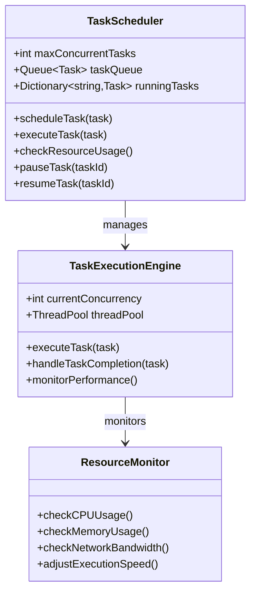

**图表来源**
- [task_db.py:58-63](file://python/task_db.py#L58-L63)
- [app.py:625-663](file://python/app.py#L625-L663)

### 依赖关系管理

系统支持任务间的依赖关系定义和执行顺序控制。

#### 依赖图模型

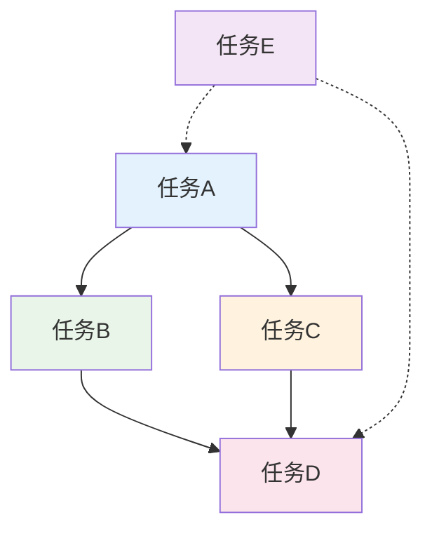

**图表来源**
- [task_db.py:62-63](file://python/task_db.py#L62-L63)
- [app.py:625-663](file://python/app.py#L625-L663)

## 依赖关系分析

系统采用模块化的依赖管理，确保各组件间的松耦合和高内聚。

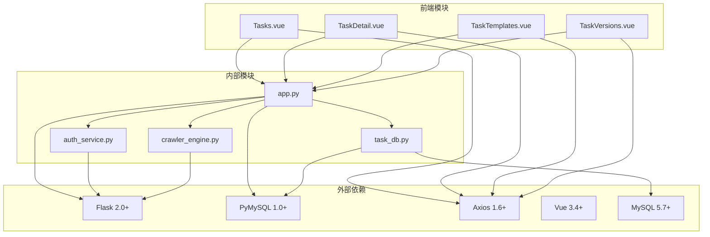

**图表来源**
- [requirements.txt:1-14](file://python/requirements.txt#L1-L14)
- [vite.config.js:1-11](file://python-web/vite.config.js#L1-L11)

### 数据库依赖关系

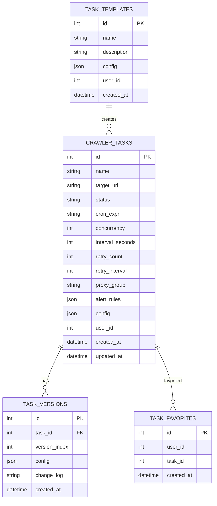

**图表来源**
- [task_db.py:51-112](file://python/task_db.py#L51-L112)

**章节来源**
- [requirements.txt:1-14](file://python/requirements.txt#L1-L14)
- [task_db.py:47-112](file://python/task_db.py#L47-L112)

## 性能考虑

系统在设计时充分考虑了性能优化和资源管理。

### 数据库性能优化

- **索引策略**：为常用查询字段建立适当索引
- **连接池管理**：合理配置数据库连接池大小
- **查询优化**：使用参数化查询防止SQL注入
- **事务管理**：确保数据一致性和并发安全性

### 前端性能优化

- **组件懒加载**：按需加载大型组件
- **虚拟滚动**：大数据量列表的性能优化
- **缓存策略**：合理使用浏览器缓存
- **代码分割**：减小初始包体积

### 系统监控

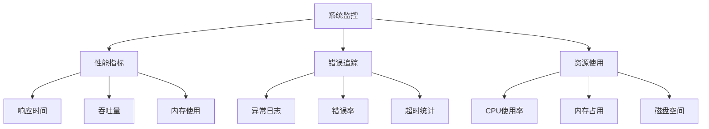

## 故障排除指南

### 常见问题及解决方案

#### 任务执行失败

**症状**：任务启动后立即失败或执行过程中异常终止

**排查步骤**：
1. 检查任务配置的有效性
2. 验证目标URL的可达性
3. 查看任务日志中的错误信息
4. 确认网络连接和代理设置

**解决方案**：
- 调整重试参数和间隔时间
- 检查目标网站的反爬虫策略
- 优化任务配置参数

#### 数据库连接问题

**症状**：系统无法连接到MySQL数据库

**排查步骤**：
1. 验证数据库服务状态
2. 检查连接参数配置
3. 确认防火墙设置
4. 验证用户权限

**解决方案**：
- 重启数据库服务
- 更新连接配置
- 检查网络连通性

#### 前端API调用失败

**症状**：前端无法与后端API通信

**排查步骤**：
1. 检查后端服务状态
2. 验证CORS配置
3. 确认API端点可用性
4. 检查认证令牌

**解决方案**：
- 重启后端服务
- 更新CORS白名单
- 刷新认证令牌

**章节来源**
- [app.py:37-51](file://python/app.py#L37-L51)
- [task_db.py:32-46](file://python/task_db.py#L32-L46)

## 结论

任务管理系统提供了一个完整的企业级任务管理解决方案，具有以下优势：

### 技术优势

- **模块化设计**：清晰的分层架构和模块划分
- **可扩展性**：支持功能扩展和定制开发
- **性能优化**：针对高并发场景的优化设计
- **安全性**：完善的认证授权和数据保护机制

### 业务价值

- **提高效率**：自动化任务管理和执行
- **降低风险**：完善的版本控制和回滚机制
- **增强协作**：团队共享模板和最佳实践
- **保障质量**：全面的日志记录和监控功能

### 发展前景

系统具备良好的扩展基础，可以进一步集成更多企业级功能，如：
- 更智能的任务调度算法
- 更丰富的监控和告警机制
- 更强大的数据分析和报表功能
- 更完善的权限和审计体系

## 附录

### API接口文档

#### 任务管理接口

| 接口 | 方法 | 描述 | 认证要求 |
|------|------|------|----------|
| `/api/tasks` | GET | 获取任务列表 | 是 |
| `/api/tasks` | POST | 创建新任务 | 是 |
| `/api/tasks/{id}` | GET | 获取任务详情 | 是 |
| `/api/tasks/{id}` | PUT | 更新任务配置 | 是 |
| `/api/tasks/{id}` | DELETE | 删除任务 | 是 |
| `/api/tasks/{id}/start` | POST | 启动任务执行 | 是 |
| `/api/tasks/{id}/stop` | POST | 停止任务执行 | 是 |

#### 模板管理接口

| 接口 | 方法 | 描述 | 认证要求 |
|------|------|------|----------|
| `/api/tasks/templates` | GET | 获取模板列表 | 是 |
| `/api/tasks/templates` | POST | 创建新模板 | 是 |
| `/api/tasks/templates/{id}` | GET | 获取模板详情 | 是 |
| `/api/tasks/templates/{id}` | DELETE | 删除模板 | 是 |

#### 版本管理接口

| 接口 | 方法 | 描述 | 认证要求 |
|------|------|------|----------|
| `/api/tasks/{id}/versions` | GET | 获取版本历史 | 是 |
| `/api/tasks/{id}/versions/rollback` | POST | 回滚到指定版本 | 是 |

### 配置选项

#### 数据库配置

| 配置项 | 默认值 | 描述 |
|--------|--------|------|
| DB_HOST | localhost | 数据库主机地址 |
| DB_PORT | 3308 | 数据库端口号 |
| DB_USER | root | 数据库用户名 |
| DB_PASSWORD | Pxc7890. | 数据库密码 |
| DB_NAME | crawler_manager | 数据库名称 |

#### 系统配置

| 配置项 | 默认值 | 描述 |
|--------|--------|------|
| MAX_CONCURRENT_TASKS | 10 | 最大并发任务数 |
| TASK_TIMEOUT | 3600 | 任务超时时间(秒) |
| LOG_LEVEL | INFO | 日志级别 |
| DEBUG | False | 调试模式开关 |

### 前端开发指南

#### 项目启动

```bash
# 启动后端服务
cd python
python app.py

# 启动前端服务
cd python-web
npm run dev
```

#### 开发规范

- 使用Vue3 Composition API进行组件开发
- 遵循ESLint代码规范
- 组件命名采用PascalCase
- API调用使用Promise/async-await模式

#### 构建部署

```bash
# 生产环境构建
cd python-web
npm run build

# 部署配置
# 修改vite.config.js中的服务器端口
# 配置反向代理指向后端API
```

**章节来源**
- [PROJECT_README.md:151-201](file://PROJECT_README.md#L151-L201)
- [PROJECT_README.md:202-258](file://PROJECT_README.md#L202-L258)
- [vite.config.js:4-10](file://python-web/vite.config.js#L4-L10)