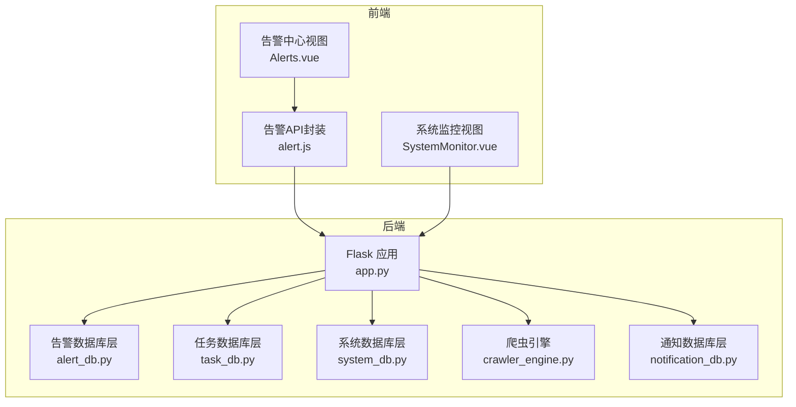
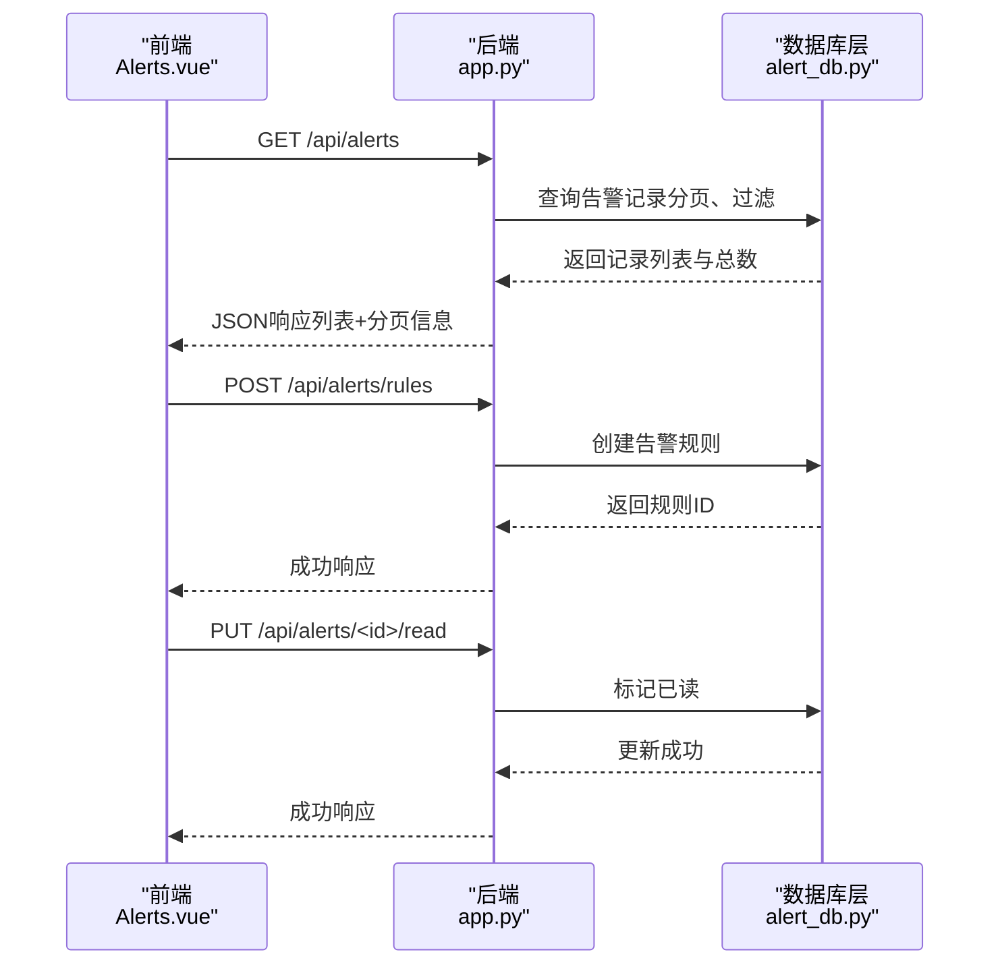
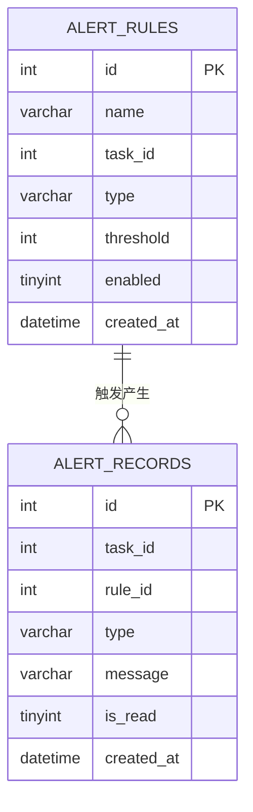
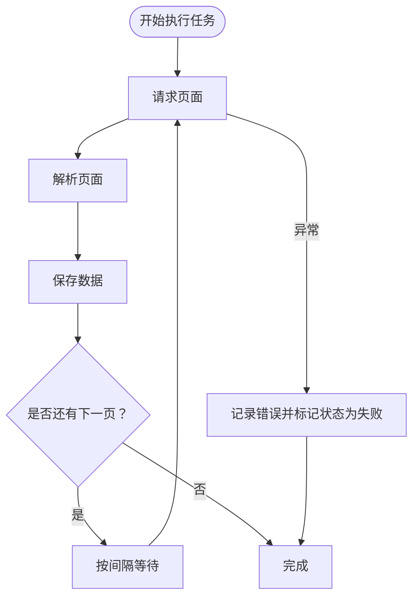
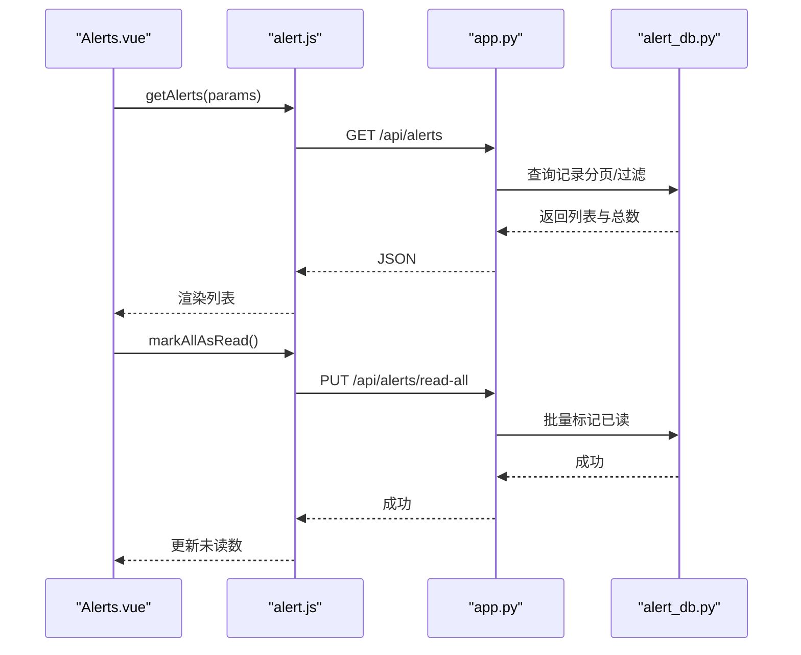
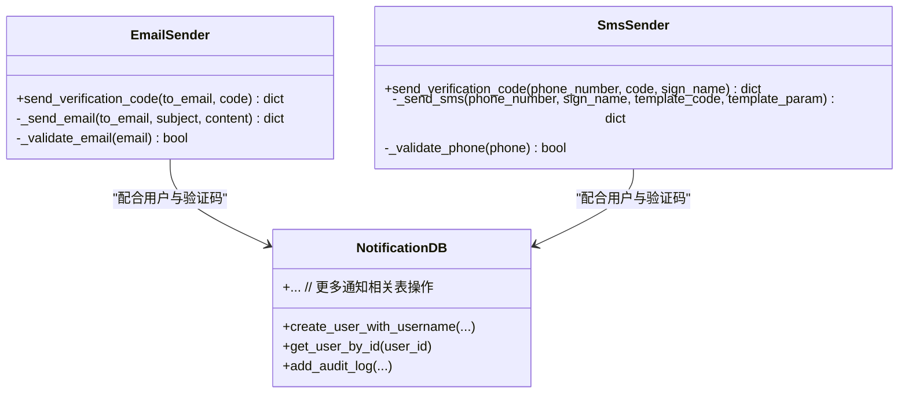
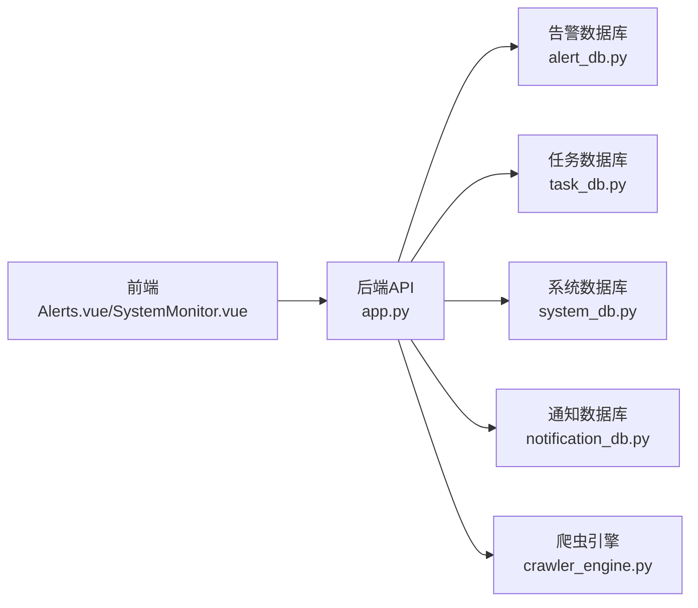
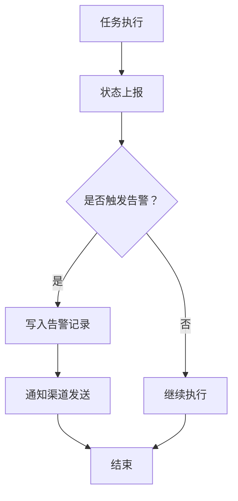

# 执行监控与告警

<cite>
**本文引用的文件**
- [app.py](file://python/app.py)
- [alert_db.py](file://python/alert_db.py)
- [task_db.py](file://python/task_db.py)
- [system_db.py](file://python/system_db.py)
- [crawler_engine.py](file://python/crawler_engine.py)
- [alert.js](file://python-web/src/api/alert.js)
- [Alerts.vue](file://python-web/src/views/Alerts.vue)
- [SystemMonitor.vue](file://python-web/src/views/SystemMonitor.vue)
- [email_sender.py](file://python/src/notifications/email_sender.py)
- [sms_sender.py](file://python/src/notifications/sms_sender.py)
- [notification_db.py](file://python/src/notification_db.py)
</cite>

## 目录
1. [简介](#简介)
2. [项目结构](#项目结构)
3. [核心组件](#核心组件)
4. [架构总览](#架构总览)
5. [详细组件分析](#详细组件分析)
6. [依赖关系分析](#依赖关系分析)
7. [性能考量](#性能考量)
8. [故障排查指南](#故障排查指南)
9. [结论](#结论)
10. [附录](#附录)

## 简介
本项目是一个集成了任务执行监控与告警系统的全栈应用，覆盖后端API、数据库层、前端界面与通知通道。系统围绕“任务执行”这一核心业务，提供：
- 实时监控：采集任务状态、资源使用、异常事件等
- 告警规则：基于阈值与类型的规则配置，支持任务级与全局级
- 告警记录：统一存储与分页查询、未读计数、标记已读
- 通知渠道：邮件与短信通知（通过阿里云SDK）
- 历史与趋势：系统日志与资源看板，支持阈值设置与可视化

## 项目结构
后端采用Flask框架，数据库层通过PyMySQL连接MySQL，前端使用Vue 3 + Vite构建。告警相关的核心模块如下：
- 后端API：任务管理、告警规则与记录、系统监控、通知等
- 数据库层：告警规则与记录、任务、系统日志与设置、通知用户表
- 前端：告警中心、系统监控看板、通知API封装

图表来源
- [app.py:18-35](file://python/app.py#L18-L35)
- [alert_db.py:6-91](file://python/alert_db.py#L6-L91)
- [task_db.py:7-121](file://python/task_db.py#L7-L121)
- [system_db.py:7-97](file://python/system_db.py#L7-L97)
- [crawler_engine.py:10-63](file://python/crawler_engine.py#L10-L63)
- [alert.js:1-35](file://python-web/src/api/alert.js#L1-L35)
- [Alerts.vue:1-540](file://python-web/src/views/Alerts.vue#L1-L540)
- [SystemMonitor.vue:1-389](file://python-web/src/views/SystemMonitor.vue#L1-L389)

章节来源
- [app.py:18-35](file://python/app.py#L18-L35)
- [alert_db.py:6-91](file://python/alert_db.py#L6-L91)
- [task_db.py:7-121](file://python/task_db.py#L7-L121)
- [system_db.py:7-97](file://python/system_db.py#L7-L97)
- [crawler_engine.py:10-63](file://python/crawler_engine.py#L10-L63)
- [alert.js:1-35](file://python-web/src/api/alert.js#L1-L35)
- [Alerts.vue:1-540](file://python-web/src/views/Alerts.vue#L1-L540)
- [SystemMonitor.vue:1-389](file://python-web/src/views/SystemMonitor.vue#L1-L389)

## 核心组件
- 告警数据库层（AlertDB）：负责告警规则与告警记录的增删改查、索引与分页、未读计数等
- 任务数据库层（TaskDB）：负责任务生命周期、模板、版本、收藏与任务配置（含告警规则JSON）
- 系统数据库层（SystemDB）：负责系统日志、系统设置、用户偏好（含通知配置）
- 爬虫引擎（CrawlerEngine）：负责任务执行、状态上报、异常捕获
- 前端告警API（alert.js）：封装告警规则与记录的REST调用
- 前端视图（Alerts.vue、SystemMonitor.vue）：展示告警列表、未读数、资源看板与阈值设置
- 通知通道（EmailSender、SmsSender、NotificationDB）：邮件与短信发送、验证码与审计日志

章节来源
- [alert_db.py:93-181](file://python/alert_db.py#L93-L181)
- [task_db.py:172-246](file://python/task_db.py#L172-L246)
- [system_db.py:99-183](file://python/system_db.py#L99-L183)
- [crawler_engine.py:400-531](file://python/crawler_engine.py#L400-L531)
- [alert.js:3-35](file://python-web/src/api/alert.js#L3-L35)
- [Alerts.vue:138-220](file://python-web/src/views/Alerts.vue#L138-L220)
- [SystemMonitor.vue:119-237](file://python-web/src/views/SystemMonitor.vue#L119-L237)
- [email_sender.py:6-67](file://python/src/notifications/email_sender.py#L6-L67)
- [sms_sender.py:7-65](file://python/src/notifications/sms_sender.py#L7-L65)
- [notification_db.py:6-104](file://python/src/notification_db.py#L6-L104)

## 架构总览
系统采用“后端API + 数据库层 + 前端视图”的三层架构。后端通过Flask路由暴露REST接口，数据库层通过PyMySQL进行数据持久化，前端通过封装的API与后端交互。

图表来源
- [app.py:855-1039](file://python/app.py#L855-L1039)
- [alert_db.py:93-181](file://python/alert_db.py#L93-L181)
- [alert.js:3-35](file://python-web/src/api/alert.js#L3-L35)
- [Alerts.vue:138-220](file://python-web/src/views/Alerts.vue#L138-L220)

## 详细组件分析

### 告警规则与记录（数据库层）
- 表结构
  - 告警规则表（alert_rules）：包含规则ID、名称、关联任务ID、规则类型、阈值、启用状态、创建时间等
  - 告警记录表（alert_records）：包含记录ID、关联任务ID、规则ID、类型、消息、是否已读、创建时间等
- 关键能力
  - 新增/查询/更新/删除规则
  - 分页查询记录、按类型与是否已读过滤
  - 标记已读、未读计数

图表来源
- [alert_db.py:50-81](file://python/alert_db.py#L50-L81)

章节来源
- [alert_db.py:46-91](file://python/alert_db.py#L46-L91)
- [alert_db.py:93-181](file://python/alert_db.py#L93-L181)
- [alert_db.py:199-279](file://python/alert_db.py#L199-L279)
- [alert_db.py:280-312](file://python/alert_db.py#L280-L312)

### 任务管理与告警联动
- 任务表（crawler_tasks）包含任务配置JSON与告警规则JSON字段，便于任务级告警策略注入
- 任务状态（运行中/已完成/失败/停止）由爬虫引擎维护并通过API对外提供

图表来源
- [crawler_engine.py:400-463](file://python/crawler_engine.py#L400-L463)

章节来源
- [task_db.py:51-111](file://python/task_db.py#L51-L111)
- [crawler_engine.py:400-531](file://python/crawler_engine.py#L400-L531)

### 前端告警中心与系统监控
- 告警中心（Alerts.vue）
  - 支持按类型筛选、仅显示未读、分页查看、展开查看详情与建议操作
  - 提供“全部已读”与单条“标记已读”
- 系统监控（SystemMonitor.vue）
  - 实时仪表盘（CPU/内存/磁盘/网络）、历史折线图、任务资源排行
  - 阈值滑块设置与保存

图表来源
- [alert.js:3-35](file://python-web/src/api/alert.js#L3-L35)
- [app.py:958-1026](file://python/app.py#L958-L1026)
- [alert_db.py:224-279](file://python/alert_db.py#L224-L279)
- [Alerts.vue:138-220](file://python-web/src/views/Alerts.vue#L138-L220)

章节来源
- [alert.js:3-35](file://python-web/src/api/alert.js#L3-L35)
- [app.py:958-1039](file://python/app.py#L958-L1039)
- [Alerts.vue:138-220](file://python-web/src/views/Alerts.vue#L138-L220)
- [SystemMonitor.vue:119-237](file://python-web/src/views/SystemMonitor.vue#L119-L237)

### 通知通道与审计日志
- 邮件与短信发送：通过阿里云SDK封装，支持验证码发送与模板参数
- 通知数据库：用户表、验证码表、令牌黑名单、密码历史、审计日志等

图表来源
- [email_sender.py:6-67](file://python/src/notifications/email_sender.py#L6-L67)
- [sms_sender.py:7-65](file://python/src/notifications/sms_sender.py#L7-L65)
- [notification_db.py:6-104](file://python/src/notification_db.py#L6-L104)

章节来源
- [email_sender.py:6-67](file://python/src/notifications/email_sender.py#L6-L67)
- [sms_sender.py:7-65](file://python/src/notifications/sms_sender.py#L7-L65)
- [notification_db.py:6-104](file://python/src/notification_db.py#L6-L104)

## 依赖关系分析
- 组件耦合
  - app.py 作为入口，依赖各数据库层与通知模块
  - 前端通过 alert.js 与后端API交互，避免直接依赖后端实现细节
- 外部依赖
  - PyMySQL：数据库连接与事务
  - Flask：Web框架与路由
  - Vue 3 + Element Plus：前端UI与交互
  - 阿里云SDK：邮件与短信发送

图表来源
- [app.py:18-35](file://python/app.py#L18-L35)
- [alert_db.py:6-91](file://python/alert_db.py#L6-L91)
- [task_db.py:7-121](file://python/task_db.py#L7-L121)
- [system_db.py:7-97](file://python/system_db.py#L7-L97)
- [crawler_engine.py:10-63](file://python/crawler_engine.py#L10-L63)
- [notification_db.py:6-104](file://python/src/notification_db.py#L6-L104)

章节来源
- [app.py:18-35](file://python/app.py#L18-L35)
- [alert_db.py:6-91](file://python/alert_db.py#L6-L91)
- [task_db.py:7-121](file://python/task_db.py#L7-L121)
- [system_db.py:7-97](file://python/system_db.py#L7-L97)
- [crawler_engine.py:10-63](file://python/crawler_engine.py#L10-L63)
- [notification_db.py:6-104](file://python/src/notification_db.py#L6-L104)

## 性能考量
- 数据库层面
  - 告警规则与记录表建立索引（任务ID、类型、是否已读、创建时间），提升查询性能
  - 分页查询与COUNT分离，避免大表全量扫描
- 爬虫执行
  - 请求间隔与重试策略平衡稳定性与性能
  - 状态与计数器在引擎内部维护，减少频繁IO
- 前端渲染
  - 列表虚拟化与分页，避免一次性渲染大量告警项
  - 图表数据长度限制（如历史点数上限），防止内存膨胀

## 故障排查指南
- 告警规则无法创建/查询
  - 检查数据库连接配置与表是否存在
  - 查看后端异常日志与数据库错误返回
- 告警记录未显示
  - 确认分页参数与过滤条件
  - 检查“仅显示未读”开关与已读标记
- 通知发送失败
  - 校验邮箱/手机号格式与阿里云SDK配置
  - 查看验证码有效期与重复使用限制
- 系统监控阈值无效
  - 确认阈值保存接口调用与本地状态同步

章节来源
- [alert_db.py:93-181](file://python/alert_db.py#L93-L181)
- [alert_db.py:224-279](file://python/alert_db.py#L224-L279)
- [email_sender.py:13-67](file://python/src/notifications/email_sender.py#L13-L67)
- [sms_sender.py:14-65](file://python/src/notifications/sms_sender.py#L14-L65)
- [SystemMonitor.vue:219-237](file://python-web/src/views/SystemMonitor.vue#L219-L237)

## 结论
本系统通过清晰的模块划分与前后端协作，实现了任务执行的实时监控与告警闭环。数据库层提供稳定的规则与记录管理，前端提供直观的可视化与交互体验，通知通道确保告警触达。建议在生产环境中进一步完善：
- 告警规则的动态评估与阈值自适应
- 告警收敛与静默窗口策略
- 监控数据的长期归档与离线分析
- 告警与任务的联动处置（自动暂停/重启/降级）

## 附录

### 告警规则数据结构与触发条件
- 规则字段
  - 名称、任务ID（0表示全局）、类型（失败/超时/数据异常/IP被封）、阈值、启用状态
- 触发条件
  - 基于阈值与类型组合，结合任务执行状态与异常事件
- 存储位置
  - 告警规则表与任务配置JSON中的告警规则字段

章节来源
- [alert_db.py:50-81](file://python/alert_db.py#L50-L81)
- [task_db.py:63-63](file://python/task_db.py#L63-L63)

### 告警级别与通知渠道
- 告警级别
  - 未读/已读（is_read字段）
  - 类型区分（失败/超时/数据异常/IP被封）
- 通知渠道
  - 邮件与短信（通过阿里云SDK）
  - 用户偏好设置（主题、通知配置JSON、导出路径）

章节来源
- [alert_db.py:68-81](file://python/alert_db.py#L68-L81)
- [system_db.py:77-87](file://python/system_db.py#L77-L87)
- [email_sender.py:13-67](file://python/src/notifications/email_sender.py#L13-L67)
- [sms_sender.py:14-65](file://python/src/notifications/sms_sender.py#L14-L65)

### 监控数据存储与历史管理
- 存储策略
  - 告警记录按时间倒序分页，支持按任务ID、规则ID、类型、是否已读过滤
  - 未读计数用于前端快速提示
- 历史与趋势
  - 系统监控视图提供CPU/内存历史折线图与阈值设置
  - 建议扩展：资源使用率与任务执行时长的历史统计

章节来源
- [alert_db.py:224-279](file://python/alert_db.py#L224-L279)
- [alert_db.py:297-312](file://python/alert_db.py#L297-L312)
- [SystemMonitor.vue:119-237](file://python-web/src/views/SystemMonitor.vue#L119-L237)

### 监控API接口文档（摘要）
- 获取告警规则列表：GET /api/alerts/rules
- 创建告警规则：POST /api/alerts/rules
- 更新告警规则：PUT /api/alerts/rules/{rule_id}
- 删除告警规则：DELETE /api/alerts/rules/{rule_id}
- 获取告警列表：GET /api/alerts
- 标记单条告警为已读：PUT /api/alerts/{alert_id}/read
- 全部标记为已读：PUT /api/alerts/read-all
- 获取未读数量：GET /api/alerts/unread-count

章节来源
- [app.py:855-1039](file://python/app.py#L855-L1039)

### 告警事件处理流程

图表来源
- [crawler_engine.py:400-531](file://python/crawler_engine.py#L400-L531)
- [alert_db.py:199-223](file://python/alert_db.py#L199-L223)

### 配置指南与自定义规则实现
- 配置步骤
  - 在前端“告警中心”创建规则，选择类型与阈值
  - 将规则与任务绑定（任务配置JSON中的告警规则字段）
  - 设置通知渠道（邮箱/短信）与用户偏好
- 自定义规则
  - 扩展规则类型与触发条件（在数据库层与后端路由中新增支持）
  - 前端视图与API需同步调整以支持新类型

章节来源
- [task_db.py:63-63](file://python/task_db.py#L63-L63)
- [alert_db.py:50-81](file://python/alert_db.py#L50-L81)
- [system_db.py:77-87](file://python/system_db.py#L77-L87)

### 实际案例：部署与维护要点
- 部署
  - 后端：配置数据库连接与环境变量，启动Flask服务
  - 前端：安装依赖、配置代理与后端域名，启动开发服务器
  - 通知：配置阿里云SDK密钥与模板
- 维护
  - 定期清理过期告警记录与系统日志
  - 监控阈值随业务波动调整
  - 异常告警自动化处置（如自动降级/限流/重启）

章节来源
- [app.py:18-35](file://python/app.py#L18-L35)
- [system_db.py:170-183](file://python/system_db.py#L170-L183)
- [email_sender.py:6-67](file://python/src/notifications/email_sender.py#L6-L67)
- [sms_sender.py:7-65](file://python/src/notifications/sms_sender.py#L7-L65)