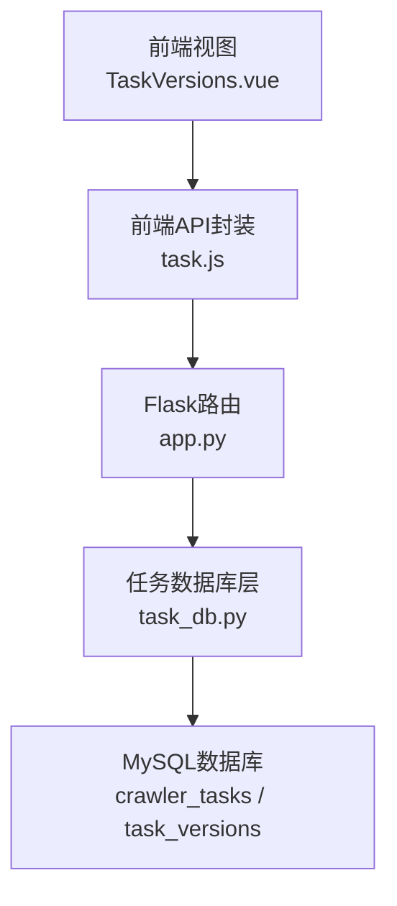
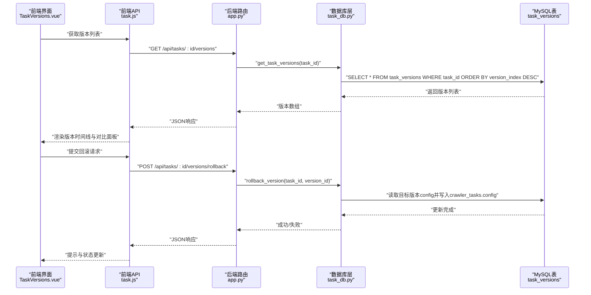
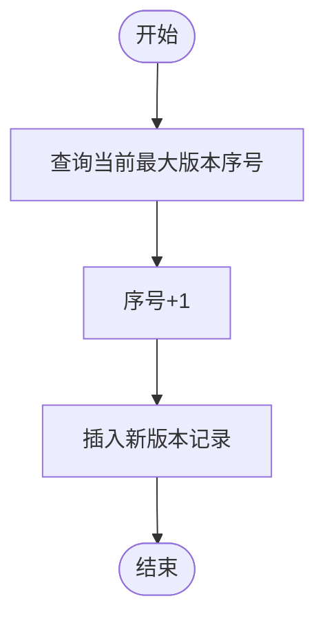
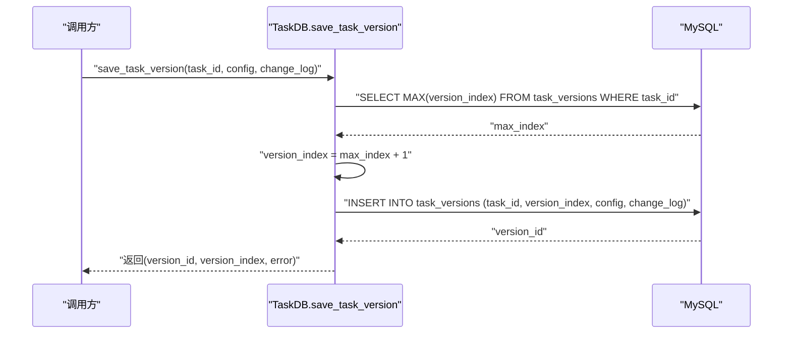
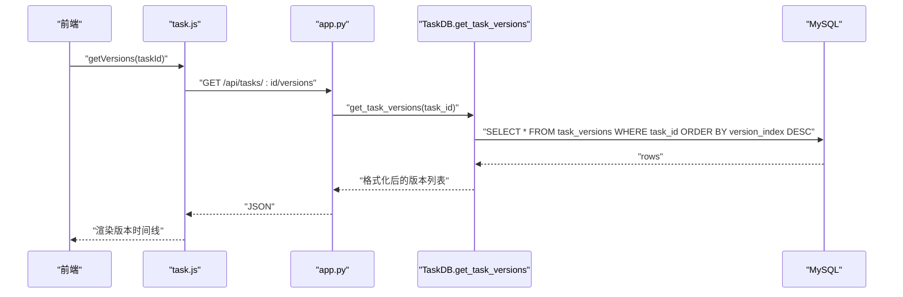
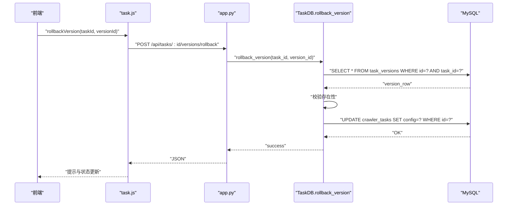
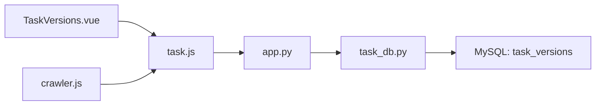

# 版本控制系统

<cite>
**本文引用的文件**
- [task_db.py](file://python/task_db.py)
- [app.py](file://python/app.py)
- [task.js](file://python-web/src/api/task.js)
- [crawler.js](file://python-web/src/stores/crawler.js)
- [TaskVersions.vue](file://python-web/src/views/TaskVersions.vue)
- [crawler_engine.py](file://python/crawler_engine.py)
</cite>

## 目录
1. [简介](#简介)
2. [项目结构](#项目结构)
3. [核心组件](#核心组件)
4. [架构总览](#架构总览)
5. [详细组件分析](#详细组件分析)
6. [依赖分析](#依赖分析)
7. [性能考虑](#性能考虑)
8. [故障排查指南](#故障排查指南)
9. [结论](#结论)
10. [附录](#附录)

## 简介
本文件面向“任务版本控制系统”，围绕版本号生成策略、版本索引管理、版本存储结构、版本创建(save_task_version)、版本查询(get_task_versions)与版本回滚(rollback_version)等关键流程进行系统化梳理。文档还涵盖版本配置数据的JSON序列化与反序列化、变更日志记录与版本对比功能、版本控制API接口定义与使用示例、版本冲突处理、版本继承关系与版本历史追踪机制，并提供最佳实践与常见问题解决方案。

## 项目结构
该系统由三层组成：
- 前端（Vue + Vite）：负责版本列表展示、版本对比、回滚确认交互。
- 后端（Flask）：提供REST API，路由到任务数据库层。
- 数据库层（PyMySQL + MySQL）：持久化任务、模板、版本与收藏等数据。

图表来源
- [TaskVersions.vue:1-610](file://python-web/src/views/TaskVersions.vue#L1-L610)
- [task.js:1-67](file://python-web/src/api/task.js#L1-L67)
- [app.py:751-796](file://python/app.py#L751-L796)
- [task_db.py:88-118](file://python/task_db.py#L88-L118)

章节来源
- [TaskVersions.vue:1-610](file://python-web/src/views/TaskVersions.vue#L1-L610)
- [task.js:1-67](file://python-web/src/api/task.js#L1-L67)
- [app.py:751-796](file://python/app.py#L751-L796)
- [task_db.py:88-118](file://python/task_db.py#L88-L118)

## 核心组件
- 任务数据库层（TaskDB）：负责任务、模板、版本与收藏的增删改查；提供版本创建、查询与回滚方法。
- Flask后端路由：暴露版本相关的REST接口，校验参数并调用数据库层。
- 前端API封装与状态管理：封装版本查询与回滚请求，驱动视图渲染与交互。
- MySQL表结构：包含任务表、模板表、版本表与收藏表，版本表采用JSON字段存储配置快照。

章节来源
- [task_db.py:88-118](file://python/task_db.py#L88-L118)
- [task_db.py:367-444](file://python/task_db.py#L367-L444)
- [app.py:751-796](file://python/app.py#L751-L796)
- [task.js:48-54](file://python-web/src/api/task.js#L48-L54)
- [crawler.js:118-127](file://python-web/src/stores/crawler.js#L118-L127)

## 架构总览
版本控制贯穿“前端-后端-数据库”链路，形成闭环的数据流：

图表来源
- [TaskVersions.vue:118-127](file://python-web/src/views/TaskVersions.vue#L118-L127)
- [task.js:48-54](file://python-web/src/api/task.js#L48-L54)
- [app.py:751-796](file://python/app.py#L751-L796)
- [task_db.py:399-444](file://python/task_db.py#L399-L444)

## 详细组件分析

### 版本存储结构与设计
- 表结构要点
  - 任务表（crawler_tasks）：存储任务基础信息与当前配置（JSON）。
  - 版本表（task_versions）：按任务维度记录历史配置快照（JSON）、版本序号与变更日志。
- 字段与约束
  - 版本序号（version_index）：同任务内递增，确保版本顺序。
  - 配置字段（config）：JSON格式，保存某版本的完整配置快照。
  - 变更日志（change_log）：字符串，记录版本变更说明。
  - 时间戳（created_at）：默认当前时间，便于排序与审计。
- 索引设计
  - 版本表对task_id建立索引，加速按任务查询。
  - 任务表对常用筛选字段建立索引，提升整体查询效率。

章节来源
- [task_db.py:88-118](file://python/task_db.py#L88-L118)
- [task_db.py:367-444](file://python/task_db.py#L367-L444)

### 版本号生成策略与版本索引管理
- 生成策略
  - 通过查询当前任务已存在的最大版本序号并+1，保证单调递增。
  - 该策略天然避免了并发写入导致的序号冲突，但未做显式锁保护。
- 版本索引管理
  - 查询时按version_index降序排列，最新版本在前。
  - 前端视图中以时间线形式展示，当前版本高亮显示。

图表来源
- [task_db.py:372-377](file://python/task_db.py#L372-L377)
- [task_db.py:379-389](file://python/task_db.py#L379-L389)

章节来源
- [task_db.py:367-392](file://python/task_db.py#L367-L392)

### 版本创建流程（save_task_version）
- 输入
  - 任务ID、配置对象、变更日志。
- 处理
  - 计算下一个版本序号。
  - 将配置对象序列化为JSON后存入版本表。
- 输出
  - 新版本ID、版本序号与错误信息。

图表来源
- [task_db.py:367-392](file://python/task_db.py#L367-L392)

章节来源
- [task_db.py:367-392](file://python/task_db.py#L367-L392)

### 版本查询流程（get_task_versions）
- 输入
  - 任务ID。
- 处理
  - 查询该任务的所有版本记录，按版本序号降序排列。
  - 对时间字段进行格式化输出。
- 输出
  - 版本列表数组。

图表来源
- [task.js:48-49](file://python-web/src/api/task.js#L48-L49)
- [app.py:751-768](file://python/app.py#L751-L768)
- [task_db.py:399-418](file://python/task_db.py#L399-L418)

章节来源
- [task.js:48-49](file://python-web/src/api/task.js#L48-L49)
- [app.py:751-768](file://python/app.py#L751-L768)
- [task_db.py:399-418](file://python/task_db.py#L399-L418)

### 版本回滚流程（rollback_version）
- 输入
  - 任务ID、目标版本ID。
- 处理
  - 校验版本是否存在。
  - 读取目标版本的配置快照（JSON）。
  - 将该快照写回到任务表的config字段，完成回滚。
- 输出
  - 成功/失败与错误信息。

图表来源
- [task.js:52-53](file://python-web/src/api/task.js#L52-L53)
- [app.py:771-796](file://python/app.py#L771-L796)
- [task_db.py:420-444](file://python/task_db.py#L420-L444)

章节来源
- [task.js:52-53](file://python-web/src/api/task.js#L52-L53)
- [app.py:771-796](file://python/app.py#L771-L796)
- [task_db.py:420-444](file://python/task_db.py#L420-L444)

### 版本配置数据的JSON序列化与反序列化
- 序列化
  - 版本创建时，将配置对象转换为JSON字符串后入库。
- 反序列化
  - 版本查询时，直接返回数据库中的JSON字段；前端视图自行解析展示。
- 注意事项
  - 建议在入库前进行字段校验与默认值填充，避免无效JSON。
  - 前端展示时注意对空值与异常格式的兜底处理。

章节来源
- [task_db.py:387-388](file://python/task_db.py#L387-L388)
- [task_db.py:409-411](file://python/task_db.py#L409-L411)

### 变更日志记录与版本对比功能
- 变更日志
  - 版本创建时可传入变更说明，存储在change_log字段。
- 版本对比
  - 前端提供对比面板，支持选择两个版本进行字段级对比（如Cron、并发、间隔等）。
  - 视图中以表格形式展示差异，突出变化项。

章节来源
- [task_db.py:387-389](file://python/task_db.py#L387-L389)
- [TaskVersions.vue:101-130](file://python-web/src/views/TaskVersions.vue#L101-L130)

### 版本控制API接口文档
- 获取版本列表
  - 方法与路径：GET /api/tasks/{task_id}/versions
  - 返回：版本数组（包含版本号、时间、作者、配置快照、变更日志等）
- 版本回滚
  - 方法与路径：POST /api/tasks/{task_id}/versions/rollback
  - 请求体：{ version_id: number }
  - 返回：成功/失败与消息

章节来源
- [app.py:751-796](file://python/app.py#L751-L796)
- [task.js:48-54](file://python-web/src/api/task.js#L48-L54)

### 版本冲突处理、版本继承关系与版本历史追踪
- 冲突处理
  - 当前实现未显式处理并发写入导致的版本序号冲突；建议在数据库层引入唯一约束或事务锁，确保version_index唯一性。
- 继承关系
  - 版本之间无显式父子指针；当前版本即为任务表config字段的当前值，历史版本通过版本表保留。
- 历史追踪
  - 通过版本表的created_at与version_index实现时间线追踪；变更日志辅助审计。

章节来源
- [task_db.py:372-377](file://python/task_db.py#L372-L377)
- [task_db.py:88-99](file://python/task_db.py#L88-L99)

## 依赖分析
- 前端依赖
  - task.js：封装版本查询与回滚请求。
  - crawler.js：状态管理中调用版本相关API。
  - TaskVersions.vue：渲染版本时间线、对比面板与回滚确认模态框。
- 后端依赖
  - app.py：路由到版本查询与回滚接口，调用task_db。
- 数据库依赖
  - task_db.py：维护版本表schema，提供版本CRUD方法。

图表来源
- [TaskVersions.vue:118-127](file://python-web/src/views/TaskVersions.vue#L118-L127)
- [task.js:48-54](file://python-web/src/api/task.js#L48-L54)
- [crawler.js:118-127](file://python-web/src/stores/crawler.js#L118-L127)
- [app.py:751-796](file://python/app.py#L751-L796)
- [task_db.py:88-118](file://python/task_db.py#L88-L118)

章节来源
- [TaskVersions.vue:118-127](file://python-web/src/views/TaskVersions.vue#L118-L127)
- [task.js:48-54](file://python-web/src/api/task.js#L48-L54)
- [crawler.js:118-127](file://python-web/src/stores/crawler.js#L118-L127)
- [app.py:751-796](file://python/app.py#L751-L796)
- [task_db.py:88-118](file://python/task_db.py#L88-L118)

## 性能考虑
- 查询性能
  - 版本查询按task_id与version_index排序，建议保持索引有效。
- 写入性能
  - 版本创建为单条INSERT，开销较小；若频繁回滚，建议评估对任务表config字段的写入频率。
- 前端渲染
  - 大量版本时建议虚拟滚动与懒加载，减少DOM压力。

## 故障排查指南
- 版本查询为空
  - 检查任务ID是否正确、版本表是否初始化成功。
- 回滚失败
  - 确认version_id存在且属于对应task_id；检查数据库连接与权限。
- JSON解析异常
  - 核对配置对象结构，确保可被序列化；前端对空值与异常格式进行兜底。

章节来源
- [task_db.py:399-418](file://python/task_db.py#L399-L418)
- [task_db.py:420-444](file://python/task_db.py#L420-L444)

## 结论
该版本控制系统以简洁的版本表结构实现了任务配置的历史快照与回滚能力，配合前后端协作提供了良好的用户体验。建议后续增强并发安全（唯一约束/锁）、完善变更日志的自动化生成与版本对比的字段级差异计算，以进一步提升可靠性与可观测性。

## 附录

### 使用示例（基于现有API）
- 获取版本列表
  - 前端调用：taskAPI.getVersions(taskId)
  - 后端路由：GET /api/tasks/{task_id}/versions
- 提交回滚
  - 前端调用：taskAPI.rollbackVersion(taskId, versionId)
  - 后端路由：POST /api/tasks/{task_id}/versions/rollback

章节来源
- [task.js:48-54](file://python-web/src/api/task.js#L48-L54)
- [app.py:751-796](file://python/app.py#L751-L796)