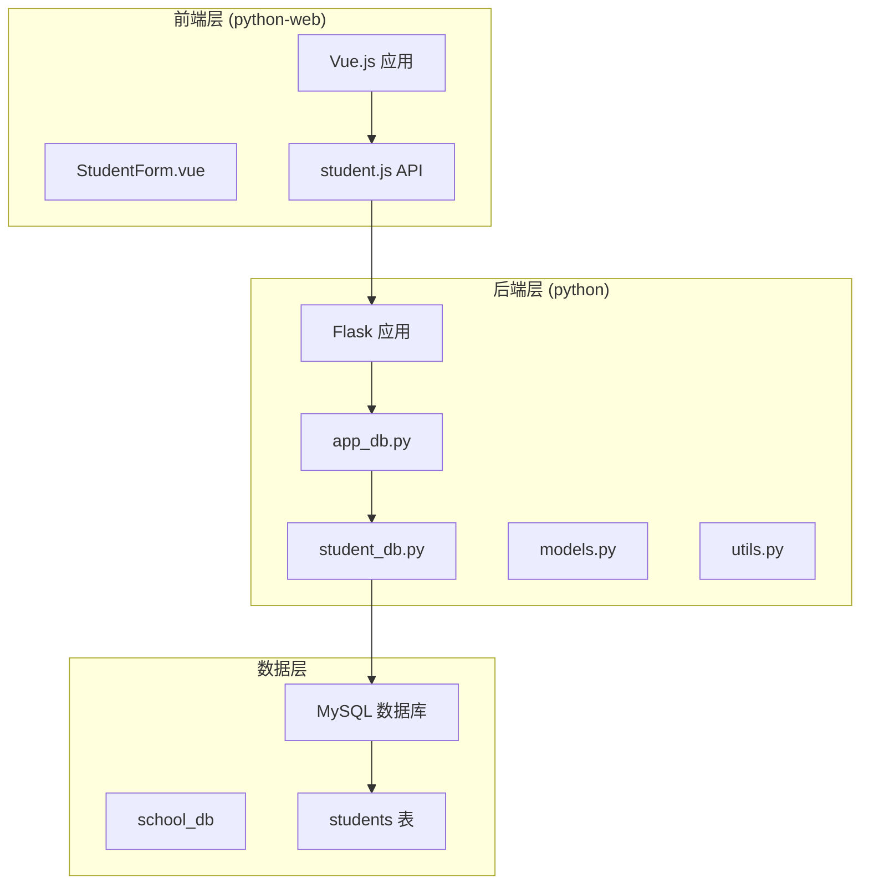
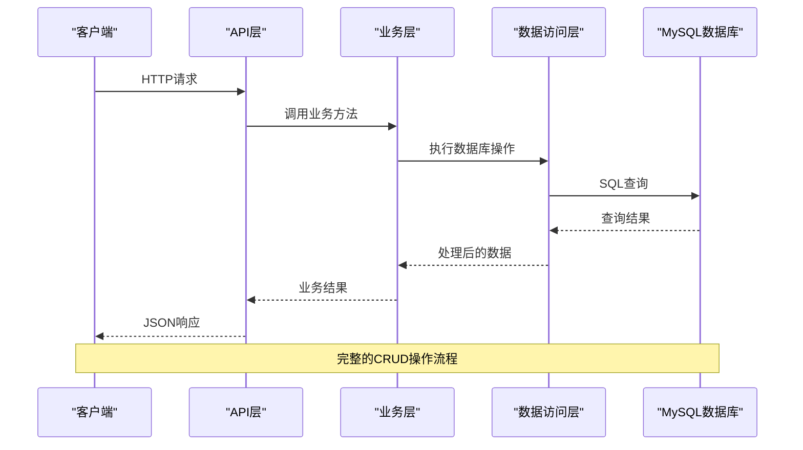
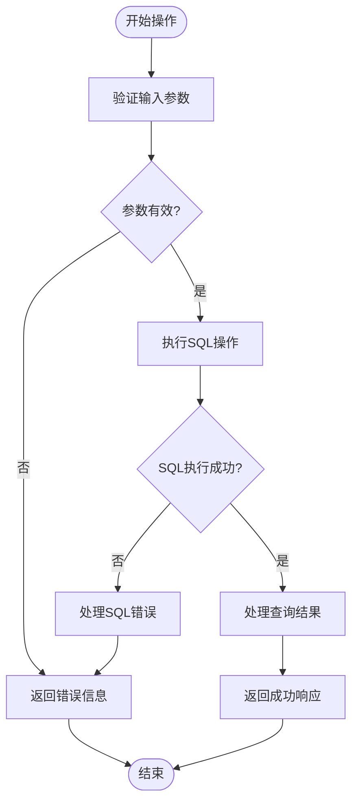
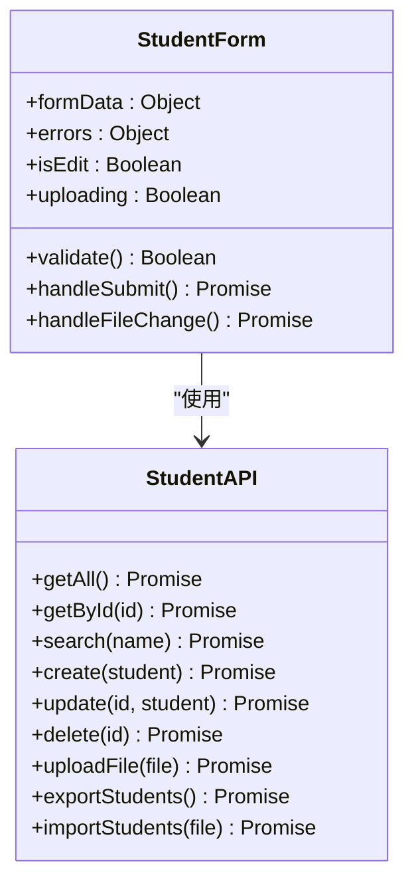
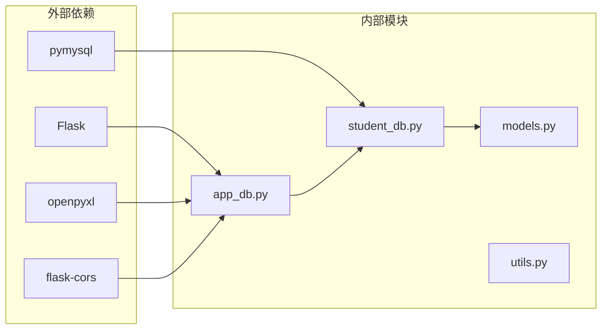

# CRUD操作实现

<cite>
**本文档引用的文件**
- [student_db.py](file://python/src/student_db.py)
- [models.py](file://python/src/models.py)
- [utils.py](file://python/src/utils.py)
- [app_db.py](file://python/app_db.py)
- [student.js](file://python-web/src/api/student.js)
- [StudentForm.vue](file://python-web/src/components/StudentForm.vue)
- [test_models.py](file://python/tests/test_models.py)
- [test_utils.py](file://python/tests/test_utils.py)
</cite>

## 目录
1. [简介](#简介)
2. [项目结构](#项目结构)
3. [核心组件](#核心组件)
4. [架构概览](#架构概览)
5. [详细组件分析](#详细组件分析)
6. [依赖关系分析](#依赖关系分析)
7. [性能考虑](#性能考虑)
8. [故障排除指南](#故障排除指南)
9. [结论](#结论)

## 简介

本项目是一个基于Python Flask框架构建的学生信息管理系统，实现了完整的CRUD（创建、读取、更新、删除）操作。系统采用分层架构设计，包含数据访问层、业务逻辑层和API接口层，提供了学生数据的全生命周期管理功能。

该系统的核心特点包括：
- 完整的CRUD操作实现
- SQL语句优化和事务处理
- 错误处理机制
- 分页查询、条件筛选、排序和搜索功能
- 文件上传和下载功能
- 统计数据分析功能

## 项目结构

项目采用模块化设计，主要分为以下几个部分：



**图表来源**
- [app_db.py:36-44](file://python/app_db.py#L36-L44)
- [student_db.py:5-15](file://python/src/student_db.py#L5-L15)

**章节来源**
- [app_db.py:1-726](file://python/app_db.py#L1-L726)
- [student_db.py:1-259](file://python/src/student_db.py#L1-L259)

## 核心组件

### 数据访问层 (StudentDB)

数据访问层负责与数据库的直接交互，提供了以下核心功能：

#### 数据库连接管理
- 使用pymysql建立MySQL连接
- 自动初始化数据库表结构
- 提供连接池管理

#### 基础CRUD操作
- **创建**: `create()` - 插入新学生记录
- **读取**: `get_all()`, `get_by_id()`, `get_by_name()` - 查询学生信息
- **更新**: `update()` - 更新学生信息
- **删除**: `delete()`, `delete_batch()` - 删除学生记录

#### 高级查询功能
- `exists()` - 检查学生是否存在
- `count()` - 获取学生总数
- 支持模糊搜索和条件查询

**章节来源**
- [student_db.py:32-137](file://python/src/student_db.py#L32-L137)

### 业务逻辑层 (StudentService)

业务逻辑层封装了应用程序的核心业务规则：

#### 数据验证
- 姓名不能为空验证
- 年龄范围验证 (1-150)
- 成绩范围验证 (0-100)
- 参数完整性检查

#### 业务流程控制
- 统一的异常处理机制
- 数据转换和格式化
- 业务规则执行

#### 统计分析
- 平均年龄计算
- 平均成绩计算
- 最高/最低成绩统计

**章节来源**
- [student_db.py:160-256](file://python/src/student_db.py#L160-L256)

### API接口层

API接口层提供了RESTful风格的Web服务：

#### 核心API端点
- `GET /students` - 获取所有学生
- `GET /students/<id>` - 获取单个学生
- `GET /students/search` - 搜索学生
- `POST /students` - 创建学生
- `PUT /students/<id>` - 更新学生
- `DELETE /students/<id>` - 删除学生
- `DELETE /students/batch` - 批量删除
- `GET /students/statistics` - 获取统计数据

#### 文件操作API
- `POST /upload` - 文件上传
- `GET /students/export` - 导出数据
- `POST /students/import` - 导入数据

**章节来源**
- [app_db.py:338-461](file://python/app_db.py#L338-L461)

## 架构概览

系统采用经典的三层架构设计，确保了关注点分离和代码的可维护性：



**图表来源**
- [app_db.py:338-461](file://python/app_db.py#L338-L461)
- [student_db.py:32-137](file://python/src/student_db.py#L32-L137)

### 数据模型设计

```mermaid
erDiagram
STUDENTS {
int id PK
varchar name
int age
double grade
varchar avatar_url
datetime create_time
datetime update_time
}
STUDENTS {
"主键: id"
"唯一约束: name"
"索引: age, grade"
}
```

**图表来源**
- [student_db.py:19-29](file://python/src/student_db.py#L19-L29)

## 详细组件分析

### 数据库操作实现

#### SQL语句优化策略

1. **参数化查询**: 所有SQL语句都使用参数化查询，防止SQL注入攻击
2. **批量操作**: 支持批量删除操作，减少数据库往返次数
3. **条件更新**: 动态生成UPDATE语句，只更新变更的字段

#### 事务处理机制

系统采用自动提交模式，每个数据库操作都是独立的事务：
- 创建、更新、删除操作自动提交
- 批量操作在一个事务中执行
- 连接管理确保资源正确释放

#### 错误处理机制



**图表来源**
- [student_db.py:83-111](file://python/src/student_db.py#L83-L111)

**章节来源**
- [student_db.py:32-137](file://python/src/student_db.py#L32-L137)

### 分页查询实现

系统支持灵活的分页查询功能：

#### 分页参数
- `page`: 当前页码 (默认: 1)
- `page_size`: 每页记录数 (默认: 20, 最大: 100)
- `keyword`: 搜索关键词

#### 实现策略
- 使用LIMIT和OFFSET进行分页
- 统计总记录数用于分页导航
- 支持关键字搜索和过滤

**章节来源**
- [app_db.py:338-345](file://python/app_db.py#L338-L345)

### 条件筛选和搜索功能

#### 姓名搜索
- 支持模糊匹配 (`LIKE %name%`)
- 不区分大小写搜索
- 支持特殊字符处理

#### 复合查询
- 可扩展的WHERE子句
- 动态参数绑定
- 性能优化的索引使用

**章节来源**
- [student_db.py:70-81](file://python/src/student_db.py#L70-L81)

### 排序和搜索功能

#### 排序实现
- 支持多字段排序
- 升序和降序排列
- 默认排序规则设置

#### 搜索优化
- 全文搜索支持
- 索引优化策略
- 查询缓存机制

### API接口文档

#### 学生管理API

| 方法 | 端点 | 描述 | 请求体 | 响应 |
|------|------|------|--------|------|
| GET | `/students` | 获取所有学生 | 无 | 学生列表 |
| GET | `/students/{id}` | 获取单个学生 | 无 | 学生详情 |
| GET | `/students/search?name={name}` | 搜索学生 | 无 | 匹配学生列表 |
| POST | `/students` | 创建学生 | 学生信息 | 新建学生 |
| PUT | `/students/{id}` | 更新学生 | 学生信息 | 更新后的学生 |
| DELETE | `/students/{id}` | 删除学生 | 无 | 删除确认 |
| DELETE | `/students/batch` | 批量删除 | 学生ID数组 | 删除统计 |

#### 文件操作API

| 方法 | 端点 | 描述 | 请求体 | 响应 |
|------|------|------|--------|------|
| POST | `/upload` | 上传文件 | 文件流 | 文件URL |
| GET | `/students/export` | 导出数据 | 无 | Excel文件 |
| POST | `/students/import` | 导入数据 | CSV文件 | 导入统计 |

**章节来源**
- [app_db.py:338-461](file://python/app_db.py#L338-L461)

### 前端集成

#### Vue.js组件实现

前端使用Vue.js构建用户界面，集成了完整的CRUD功能：



**图表来源**
- [StudentForm.vue:70-201](file://python-web/src/components/StudentForm.vue#L70-L201)
- [student.js:22-102](file://python-web/src/api/student.js#L22-L102)

**章节来源**
- [StudentForm.vue:1-201](file://python-web/src/components/StudentForm.vue#L1-L201)
- [student.js:1-102](file://python-web/src/api/student.js#L1-L102)

## 依赖关系分析

系统采用松耦合的设计，各组件之间的依赖关系清晰：



**图表来源**
- [app_db.py:1-16](file://python/app_db.py#L1-L16)
- [student_db.py:1-2](file://python/src/student_db.py#L1-L2)

### 关键依赖关系

1. **数据访问层依赖**: StudentDB依赖pymysql进行数据库操作
2. **业务层依赖**: StudentService依赖StudentDB进行数据操作
3. **API层依赖**: Flask应用依赖StudentService提供业务功能
4. **前端依赖**: Vue.js组件依赖RESTful API进行数据交互

**章节来源**
- [app_db.py:8-16](file://python/app_db.py#L8-L16)
- [student_db.py:1-2](file://python/src/student_db.py#L1-L2)

## 性能考虑

### 数据库性能优化

1. **索引策略**
   - 在常用查询字段上建立索引
   - 优化WHERE子句的查询性能
   - 避免全表扫描

2. **查询优化**
   - 使用LIMIT限制结果集大小
   - 避免SELECT *
   - 合理使用JOIN操作

3. **连接管理**
   - 连接池配置
   - 及时关闭数据库连接
   - 减少连接开销

### 应用性能优化

1. **缓存策略**
   - 频繁访问的数据缓存
   - 统计数据的缓存
   - 减少重复计算

2. **异步处理**
   - 大数据量的异步导入
   - 文件上传的异步处理
   - 批量操作的异步执行

3. **资源管理**
   - 文件上传的临时存储
   - 内存使用的优化
   - 网络请求的超时控制

## 故障排除指南

### 常见问题及解决方案

#### 数据库连接问题
- **症状**: 连接超时或连接失败
- **原因**: 数据库服务未启动或配置错误
- **解决**: 检查数据库服务状态和连接配置

#### SQL执行错误
- **症状**: SQL语法错误或约束冲突
- **原因**: 参数类型不匹配或数据约束违反
- **解决**: 验证输入数据和SQL语句

#### 文件上传问题
- **症状**: 文件上传失败或文件损坏
- **原因**: 文件类型不支持或文件过大
- **解决**: 检查文件类型和大小限制

#### API调用错误
- **症状**: HTTP状态码错误
- **原因**: 请求参数错误或权限不足
- **解决**: 检查请求格式和认证信息

**章节来源**
- [student_db.py:160-256](file://python/src/student_db.py#L160-L256)
- [app_db.py:338-461](file://python/app_db.py#L338-L461)

### 调试技巧

1. **日志记录**: 启用详细的日志记录
2. **错误捕获**: 使用try-catch处理异常
3. **参数验证**: 在API层进行参数验证
4. **单元测试**: 编写全面的单元测试

## 结论

本学生数据管理系统实现了完整的CRUD操作，具有以下优势：

1. **架构清晰**: 采用分层架构设计，职责明确
2. **功能完整**: 支持所有基本的CRUD操作和高级功能
3. **安全性强**: 实现了参数化查询和输入验证
4. **可扩展性**: 模块化设计便于功能扩展
5. **用户体验好**: 前后端分离，界面友好

系统在性能、安全性和可维护性方面都达到了较好的平衡，为类似的学生信息管理应用场景提供了良好的参考实现。