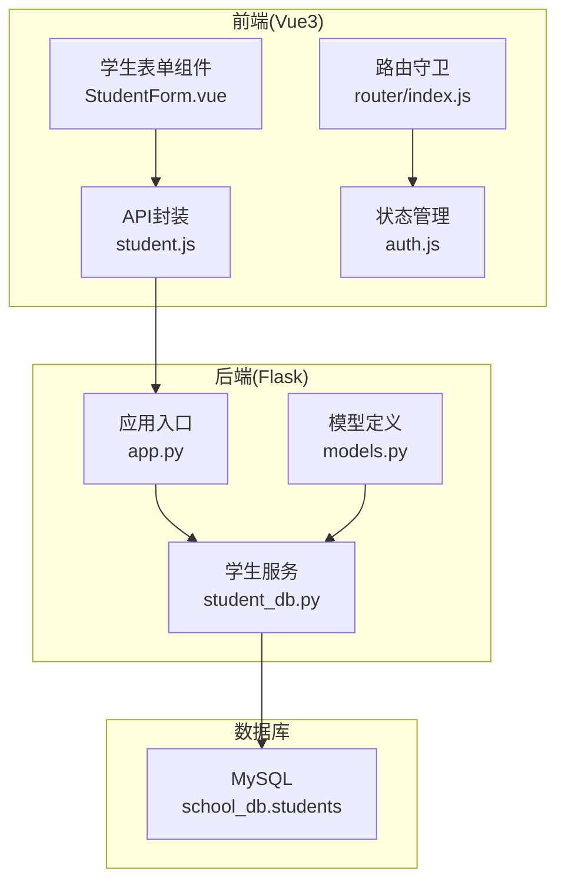
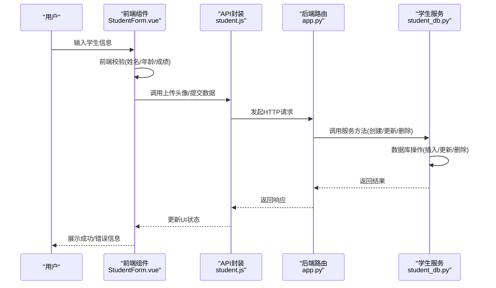
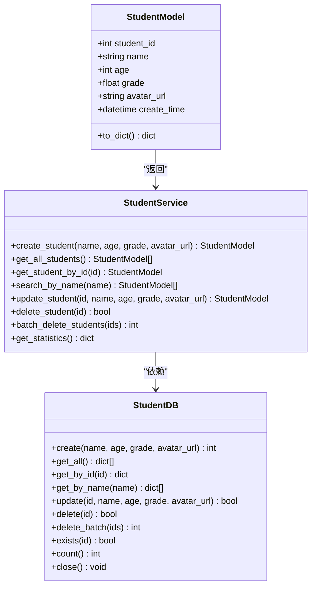
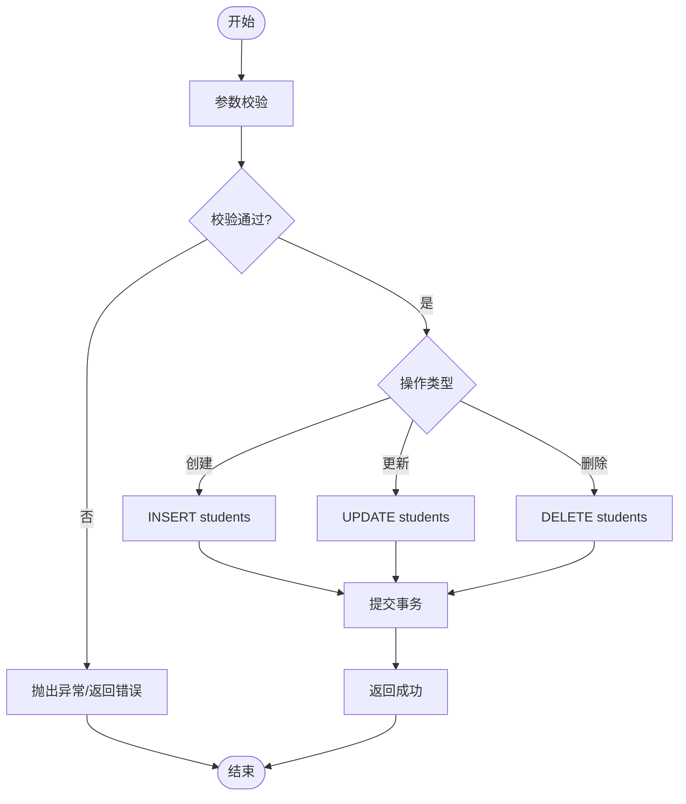
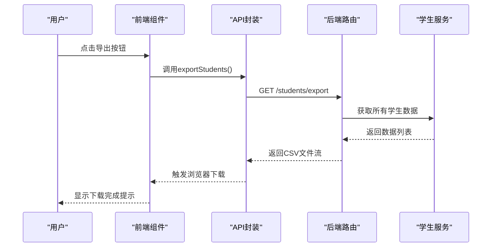
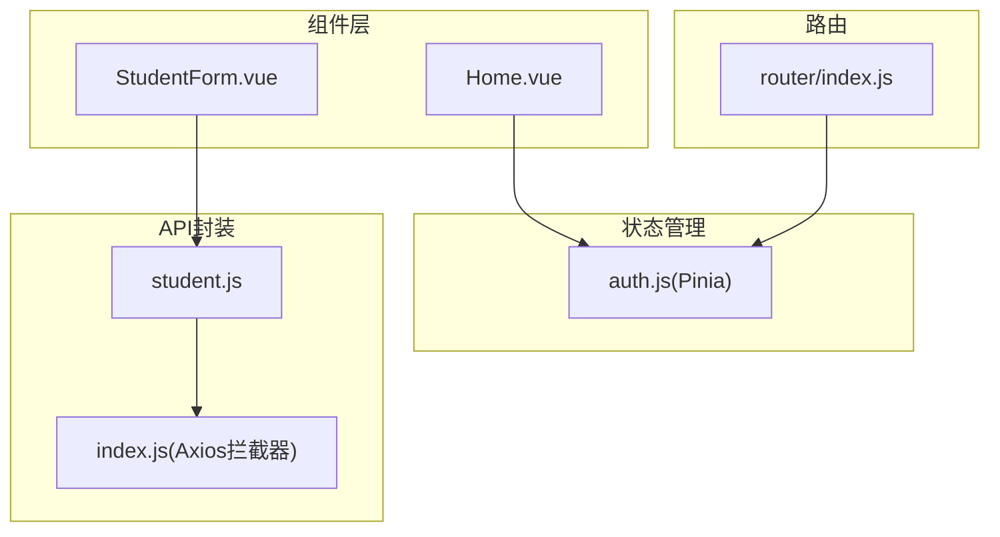
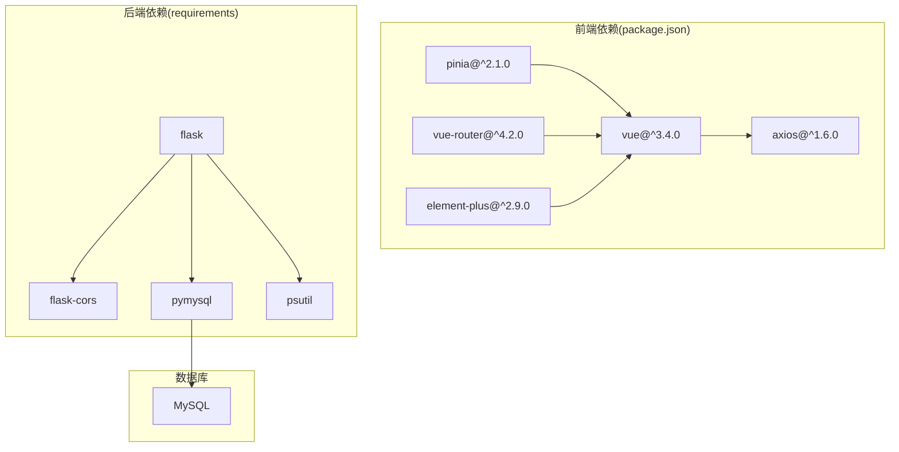

# 学生数据管理

<cite>
**本文档引用的文件**
- [app.py](file://python/app.py)
- [app_db.py](file://python/app_db.py)
- [student_db.py](file://python/src/student_db.py)
- [models.py](file://python/src/models.py)
- [main.py](file://python/main.py)
- [student.js](file://python-web/src/api/student.js)
- [StudentForm.vue](file://python-web/src/components/StudentForm.vue)
- [Home.vue](file://python-web/src/views/Home.vue)
- [router/index.js](file://python-web/src/router/index.js)
- [auth.js](file://python-web/src/stores/auth.js)
- [index.js](file://python-web/src/api/index.js)
- [package.json](file://python-web/package.json)
</cite>

## 目录
1. [简介](#简介)
2. [项目结构](#项目结构)
3. [核心组件](#核心组件)
4. [架构总览](#架构总览)
5. [详细组件分析](#详细组件分析)
6. [依赖关系分析](#依赖关系分析)
7. [性能考虑](#性能考虑)
8. [故障排除指南](#故障排除指南)
9. [结论](#结论)
10. [附录](#附录)

## 简介
本系统是一个面向学生信息管理的全栈应用，包含后端Python Flask服务与Vue3前端界面。系统提供学生数据的增删改查、批量操作、数据导入导出、统计分析等功能，并具备完善的权限控制与前端组件化开发能力。适合系统管理员与数据分析师进行学生信息的日常维护与数据分析。

## 项目结构
系统采用前后端分离架构，后端使用Flask提供RESTful API，前端基于Vue3 + Pinia + Vue Router构建单页应用。核心模块包括：
- 后端服务层：认证授权、学生数据服务、通知服务等
- 数据访问层：MySQL数据库连接与CRUD操作
- 前端展示层：组件化页面、路由守卫、状态管理
- 工具与算法：基础数学运算、排序搜索算法示例

**图表来源**
- [app.py:1-800](file://python/app.py#L1-L800)
- [student_db.py:1-259](file://python/src/student_db.py#L1-L259)
- [student.js:1-102](file://python-web/src/api/student.js#L1-L102)
- [StudentForm.vue:1-201](file://python-web/src/components/StudentForm.vue#L1-L201)
- [router/index.js:1-150](file://python-web/src/router/index.js#L1-L150)
- [auth.js:1-74](file://python-web/src/stores/auth.js#L1-L74)

**章节来源**
- [app.py:1-800](file://python/app.py#L1-L800)
- [student_db.py:1-259](file://python/src/student_db.py#L1-L259)
- [student.js:1-102](file://python-web/src/api/student.js#L1-L102)
- [StudentForm.vue:1-201](file://python-web/src/components/StudentForm.vue#L1-L201)
- [router/index.js:1-150](file://python-web/src/router/index.js#L1-L150)
- [auth.js:1-74](file://python-web/src/stores/auth.js#L1-L74)

## 核心组件
- 学生数据模型与服务：定义学生实体、数据验证规则与业务逻辑
- 数据库访问层：封装MySQL连接、表结构初始化与CRUD操作
- API接口层：提供RESTful接口，支持分页、搜索、统计与批量操作
- 前端组件层：表单校验、文件上传、路由守卫与状态管理
- 工具与算法：基础数据结构与排序搜索算法示例

**章节来源**
- [models.py:1-59](file://python/src/models.py#L1-L59)
- [student_db.py:140-259](file://python/src/student_db.py#L140-L259)
- [app.py:1-800](file://python/app.py#L1-L800)
- [student.js:1-102](file://python-web/src/api/student.js#L1-L102)
- [StudentForm.vue:1-201](file://python-web/src/components/StudentForm.vue#L1-L201)

## 架构总览
系统采用分层架构，职责清晰：
- 表现层：Vue3组件负责用户交互与数据展示
- 业务层：Flask路由处理HTTP请求，调用服务层完成业务逻辑
- 数据访问层：封装数据库操作，提供事务与连接管理
- 数据存储层：MySQL存储学生信息，支持索引优化与查询性能调优

**图表来源**
- [StudentForm.vue:163-201](file://python-web/src/components/StudentForm.vue#L163-L201)
- [student.js:22-102](file://python-web/src/api/student.js#L22-L102)
- [app.py:1-800](file://python/app.py#L1-L800)
- [student_db.py:160-259](file://python/src/student_db.py#L160-L259)

## 详细组件分析

### 数据模型与验证规则
- 学生实体包含学号、姓名、年龄、成绩、头像URL等字段
- 前端表单校验：姓名非空、年龄1-150、成绩0-100
- 后端服务校验：重复字段检查、异常抛出与错误码返回
- 模型类提供字典序列化，便于API响应格式化

**图表来源**
- [student_db.py:140-259](file://python/src/student_db.py#L140-L259)

**章节来源**
- [student_db.py:140-259](file://python/src/student_db.py#L140-L259)
- [StudentForm.vue:163-185](file://python-web/src/components/StudentForm.vue#L163-L185)

### CRUD操作实现
- 创建：校验参数后写入数据库，返回自增ID
- 查询：支持按ID、姓名模糊匹配、全量查询
- 更新：动态拼接SQL，仅更新传入的字段
- 删除：单条删除与批量删除，返回受影响行数
- 统计：计算总数、平均年龄、平均成绩、最高/最低成绩

**图表来源**
- [student_db.py:32-137](file://python/src/student_db.py#L32-L137)
- [student_db.py:160-259](file://python/src/student_db.py#L160-L259)

**章节来源**
- [student_db.py:32-137](file://python/src/student_db.py#L32-L137)
- [student_db.py:160-259](file://python/src/student_db.py#L160-L259)

### 数据导入导出功能
- 导出：支持CSV格式，后端生成文件流并设置Content-Disposition
- 导入：前端FormData上传文件，后端接收并解析
- 批量操作：批量删除接口，支持多ID同时处理
- 数据完整性：存在性检查、异常捕获与事务回滚

**图表来源**
- [student.js:68-92](file://python-web/src/api/student.js#L68-L92)
- [app.py:1-800](file://python/app.py#L1-L800)

**章节来源**
- [student.js:59-102](file://python-web/src/api/student.js#L59-L102)
- [app.py:1-800](file://python/app.py#L1-L800)

### 前端组件使用指南
- 学生表单组件：支持头像上传、字段校验、错误提示
- 路由守卫：登录态校验、未登录跳转登录页
- 状态管理：Pinia存储访问令牌与用户信息
- API封装：统一拦截器、自动刷新令牌、错误处理

**图表来源**
- [StudentForm.vue:1-201](file://python-web/src/components/StudentForm.vue#L1-L201)
- [Home.vue:1-800](file://python-web/src/views/Home.vue#L1-L800)
- [auth.js:1-74](file://python-web/src/stores/auth.js#L1-L74)
- [router/index.js:1-150](file://python-web/src/router/index.js#L1-L150)
- [index.js:1-95](file://python-web/src/api/index.js#L1-L95)

**章节来源**
- [StudentForm.vue:1-201](file://python-web/src/components/StudentForm.vue#L1-L201)
- [auth.js:1-74](file://python-web/src/stores/auth.js#L1-L74)
- [router/index.js:1-150](file://python-web/src/router/index.js#L1-L150)
- [index.js:1-95](file://python-web/src/api/index.js#L1-L95)

## 依赖关系分析
- 前端依赖：Vue3、Element Plus、Pinia、Vue Router、Axios
- 后端依赖：Flask、Flask-CORS、PyMySQL、psutil
- 数据库：MySQL，school_db.students表
- 外部集成：通知服务、验证码服务、文件上传

**图表来源**
- [package.json:1-24](file://python-web/package.json#L1-L24)
- [app.py:1-800](file://python/app.py#L1-L800)

**章节来源**
- [package.json:1-24](file://python-web/package.json#L1-L24)
- [app.py:1-800](file://python/app.py#L1-L800)

## 性能考虑
- 数据库索引优化：建议在name字段建立索引以提升模糊查询性能；在id字段确保主键索引
- 查询性能调优：避免N+1查询，批量操作使用IN子句减少往返次数
- 连接池管理：合理配置数据库连接池大小，避免连接泄漏
- 缓存策略：热点数据可引入Redis缓存，降低数据库压力
- 分页查询：大数据量场景下强制分页，限制每页数量防止内存溢出
- 前端渲染优化：虚拟滚动、懒加载、组件拆分减少重绘

## 故障排除指南
- 认证失败：检查令牌是否过期，确认刷新流程是否正确
- 数据库连接异常：验证MySQL服务状态、连接参数与防火墙设置
- 文件上传失败：检查文件类型与大小限制、服务器磁盘空间
- API响应错误：查看后端日志与错误码，定位具体异常位置
- 前端路由跳转：确认路由守卫逻辑与本地存储状态

**章节来源**
- [index.js:22-59](file://python-web/src/api/index.js#L22-L59)
- [app.py:1-800](file://python/app.py#L1-L800)
- [StudentForm.vue:128-161](file://python-web/src/components/StudentForm.vue#L128-L161)

## 结论
该学生数据管理系统通过清晰的分层架构与组件化设计，实现了从数据模型到前端展示的完整闭环。系统具备良好的扩展性与可维护性，适合在实际生产环境中部署使用。建议后续增强单元测试覆盖率、完善监控告警体系，并持续优化数据库查询性能。

## 附录

### 数据库表结构
- 表名：students
- 字段：id(主键, 自增)、name(非空)、age(非空)、grade(非空)、avatar_url、create_time、update_time

**章节来源**
- [student_db.py:17-30](file://python/src/student_db.py#L17-L30)

### API接口文档
- 获取所有学生：GET /students
- 按ID获取学生：GET /students/{id}
- 搜索学生：GET /students/search?name={name}
- 创建学生：POST /students
- 更新学生：PUT /students/{id}
- 删除学生：DELETE /students/{id}
- 批量删除：DELETE /students/batch
- 统计信息：GET /students/statistics
- 导出数据：GET /students/export
- 导入数据：POST /students/import

**章节来源**
- [app.py:1-800](file://python/app.py#L1-L800)