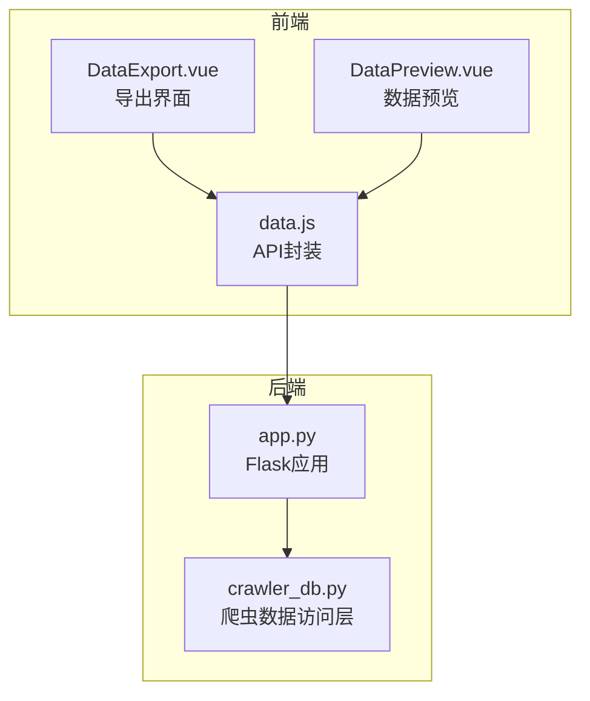
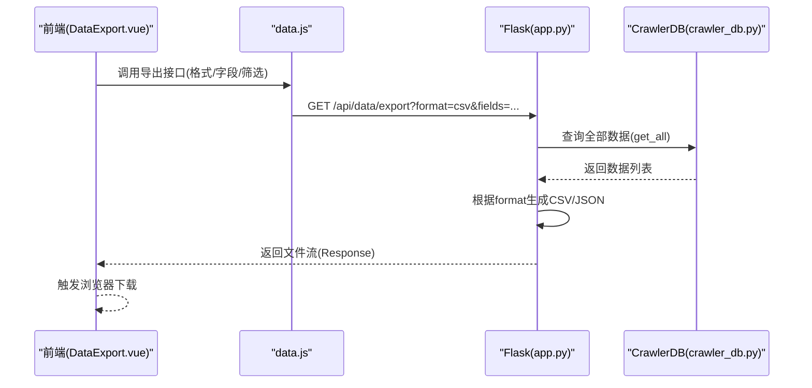
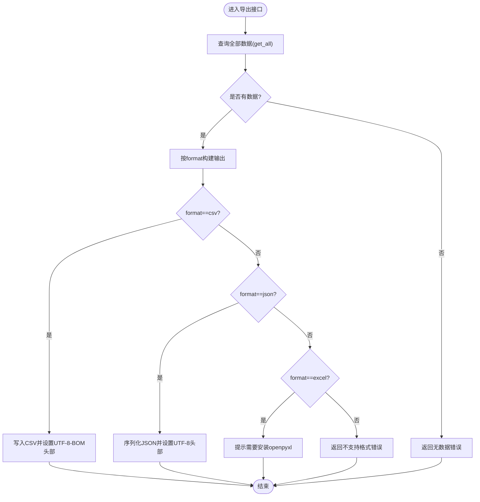
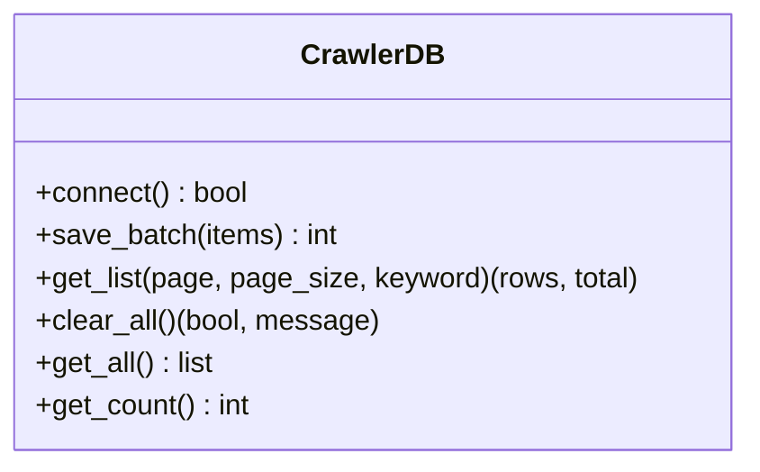
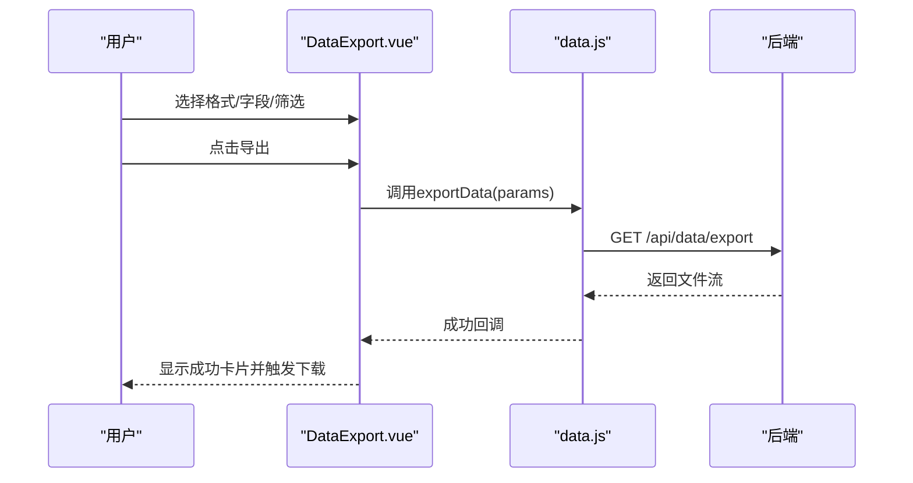
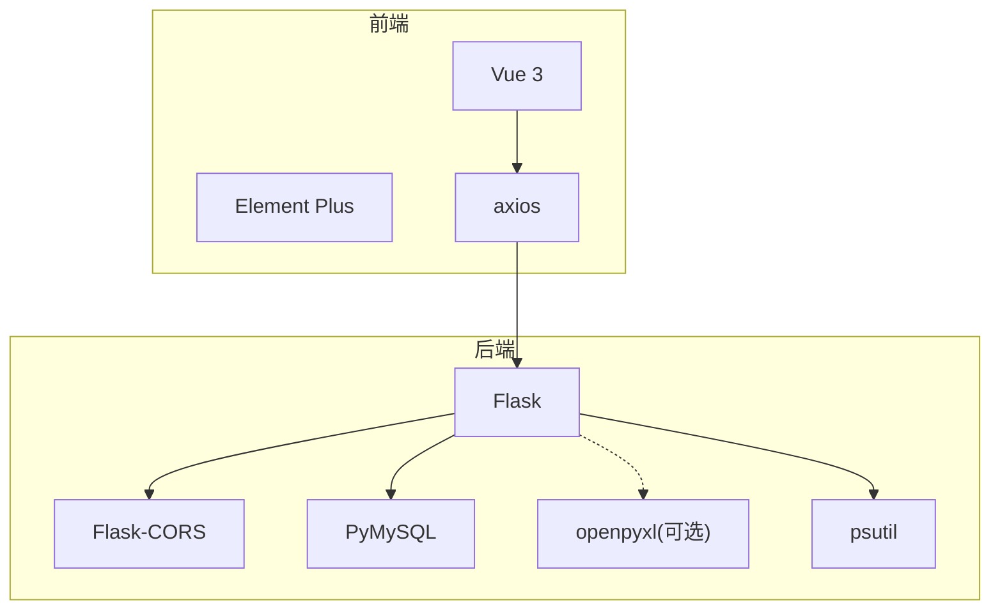

# 数据导入导出

<cite>
**本文引用的文件**
- [app.py](file://python/app.py)
- [crawler_db.py](file://python/crawler_db.py)
- [src/student_db.py](file://python/src/student_db.py)
- [requirements.txt](file://python/requirements.txt)
- [DataExport.vue](file://python-web/src/views/DataExport.vue)
- [DataPreview.vue](file://python-web/src/views/DataPreview.vue)
- [data.js](file://python-web/src/api/data.js)
</cite>

## 目录
1. [简介](#简介)
2. [项目结构](#项目结构)
3. [核心组件](#核心组件)
4. [架构总览](#架构总览)
5. [详细组件分析](#详细组件分析)
6. [依赖分析](#依赖分析)
7. [性能考虑](#性能考虑)
8. [故障排查指南](#故障排查指南)
9. [结论](#结论)
10. [附录](#附录)

## 简介
本文件围绕仓库中的数据导入导出能力进行系统性说明，重点覆盖以下方面：
- 文件解析与导出：CSV/JSON 的后端实现；Excel 导出的现状与扩展建议
- 数据验证与清洗：字段校验、去重、空值过滤、字段格式化
- 批量处理与错误恢复：批量写入、逐条降级、异常捕获与回退
- 编码与格式转换：CSV 字符集、JSON 编码、Excel 库依赖
- 性能优化策略：流式输出、分页查询、索引优化
- 完整 API 接口与使用指南：后端路由、前端调用、参数说明
- 大量学生数据高效导入导出实践：校验、错误处理、进度反馈

## 项目结构
后端采用 Flask 提供 REST API，前端使用 Vue + Element Plus 构建数据导出与预览界面。数据导出主要依赖爬虫数据库模块，CSV/JSON 已实现，Excel 需要额外依赖。

图表来源
- [app.py](file://python/app.py)
- [crawler_db.py](file://python/crawler_db.py)
- [DataExport.vue](file://python-web/src/views/DataExport.vue)
- [DataPreview.vue](file://python-web/src/views/DataPreview.vue)
- [data.js](file://python-web/src/api/data.js)

章节来源
- [app.py](file://python/app.py)
- [crawler_db.py](file://python/crawler_db.py)
- [DataExport.vue](file://python-web/src/views/DataExport.vue)
- [DataPreview.vue](file://python-web/src/views/DataPreview.vue)
- [data.js](file://python-web/src/api/data.js)

## 核心组件
- 后端导出服务
  - CSV/JSON 导出：支持自定义字段导出、统一编码输出
  - Excel 导出：当前提示需要 openpyxl 依赖
- 数据访问层
  - 爬虫数据表：提供全量查询、分页查询、批量写入等能力
- 前端导出界面
  - 支持格式选择、字段勾选、筛选条件、自动入库与推送配置
  - 预览与导出流程可视化

章节来源
- [app.py](file://python/app.py)
- [crawler_db.py](file://python/crawler_db.py)
- [DataExport.vue](file://python-web/src/views/DataExport.vue)
- [DataPreview.vue](file://python-web/src/views/DataPreview.vue)
- [data.js](file://python-web/src/api/data.js)

## 架构总览
后端导出流程概览：前端发起导出请求 -> 后端根据格式生成响应 -> 流式输出到客户端。

图表来源
- [app.py](file://python/app.py)
- [crawler_db.py](file://python/crawler_db.py)
- [data.js](file://python-web/src/api/data.js)
- [DataExport.vue](file://python-web/src/views/DataExport.vue)

## 详细组件分析

### 后端导出接口与实现
- 路由与参数
  - GET /api/data/export
  - 参数：format(csv/json/excel)、fields(逗号分隔字段名)
- 处理逻辑
  - 读取全部数据
  - 根据 format 输出 CSV/JSON
  - Excel 导出提示需要 openpyxl 依赖
- 错误处理
  - 无数据、格式不支持、内部异常均返回统一结构

图表来源
- [app.py](file://python/app.py)
- [crawler_db.py](file://python/crawler_db.py)

章节来源
- [app.py](file://python/app.py)

### 数据访问层(CrawlerDB)
- 表结构与初始化
  - 自动创建数据库与表，兼容旧表结构
  - 索引：来源URL、采集时间、页码、类型
- 批量写入
  - 批量插入，逐条异常捕获，保证整体提交
- 查询与清理
  - 全量查询、分页查询、清空表

图表来源
- [crawler_db.py](file://python/crawler_db.py)

章节来源
- [crawler_db.py](file://python/crawler_db.py)

### 前端导出界面(DataExport.vue)
- 功能点
  - 导出格式选择(CSV/Excel/JSON)
  - 可选字段勾选
  - 筛选条件(日期范围、任务关联等)
  - 自动入库配置(数据库类型、连接参数、启用开关)
  - 推送配置(邮件/企业微信、触发条件)
  - 导出执行与下载反馈
- 交互流程
  - 用户选择参数 -> 点击导出 -> 显示成功卡片 -> 触发下载

图表来源
- [DataExport.vue](file://python-web/src/views/DataExport.vue)
- [data.js](file://python-web/src/api/data.js)
- [app.py](file://python/app.py)

章节来源
- [DataExport.vue](file://python-web/src/views/DataExport.vue)
- [data.js](file://python-web/src/api/data.js)

### 数据预览与导出(DataPreview.vue)
- 预览能力
  - 关键词搜索、日期范围、类型筛选
  - 列显隐控制、排序、分页
- 导出入口
  - 弹窗选择导出格式(CSV/Excel/JSON)，提示导出条数

章节来源
- [DataPreview.vue](file://python-web/src/views/DataPreview.vue)

### 学生数据导入导出参考实现
虽然仓库中未直接提供 Excel/CSV 的学生数据导入导出接口，但可基于现有组件进行扩展：
- 导入流程
  - 前端上传文件 -> 后端解析 CSV/Excel -> 字段映射与校验 -> 批量写入 -> 错误收集与回滚
- 导出流程
  - 后端按字段导出 -> 统一编码输出 -> 浏览器下载

章节来源
- [src/student_db.py](file://python/src/student_db.py)

## 依赖分析
- 后端依赖
  - Flask、Flask-CORS、PyMySQL、psutil、openpyxl(可选)
- 前端依赖
  - Vue 3、Element Plus、axios(通过封装的 data.js)

图表来源
- [requirements.txt](file://python/requirements.txt)
- [data.js](file://python-web/src/api/data.js)

章节来源
- [requirements.txt](file://python/requirements.txt)

## 性能考虑
- 导出性能
  - 流式输出：使用 StringIO/BytesIO，避免一次性加载大文件到内存
  - 字符集：CSV 使用 UTF-8 BOM，JSON 使用 UTF-8，确保跨平台兼容
  - 分页与筛选：前端分页、后端分页查询，减少一次性传输
- 写入性能
  - 批量插入：逐条捕获异常，保证整体提交
  - 索引优化：对高频查询字段建立索引
- 资源监控
  - CPU/内存/磁盘使用情况可通过系统接口获取

章节来源
- [app.py](file://python/app.py)
- [crawler_db.py](file://python/crawler_db.py)

## 故障排查指南
- 导出失败
  - 检查 format 参数是否为 csv/json/excel
  - 确认数据库中有数据
  - 查看后端日志与异常返回
- Excel 导出报错
  - 安装 openpyxl 依赖后重启服务
- 编码问题
  - CSV 使用 UTF-8 BOM 头部，确保 Excel 正常打开
  - JSON 使用 UTF-8 编码
- 批量写入异常
  - 单条数据异常不会影响其他数据的写入
  - 检查字段类型与长度约束

章节来源
- [app.py](file://python/app.py)
- [requirements.txt](file://python/requirements.txt)

## 结论
本项目提供了完善的 CSV/JSON 导出能力，并预留了 Excel 导出扩展点。通过合理的数据访问层设计、前端交互与后端流式输出，能够满足大量数据的高效导出需求。对于学生数据的导入导出，可复用现有组件并扩展相应的解析与校验逻辑。

## 附录

### API 接口清单
- GET /api/data/export
  - 功能：导出数据
  - 参数：
    - format: 导出格式(csv/json/excel)
    - fields: 导出字段(逗号分隔)
  - 响应：文件流(Response)
  - 备注：Excel 需要 openpyxl 依赖

章节来源
- [app.py](file://python/app.py)

### 使用指南
- 前端调用
  - 通过 data.js 的 exportData 方法传入 format 与 fields
  - 成功后触发浏览器下载
- 后端部署
  - 安装依赖：pip install -r requirements.txt
  - 启动服务后访问导出接口
- Excel 导出
  - 安装 openpyxl 后，后端将支持 Excel 格式导出

章节来源
- [data.js](file://python-web/src/api/data.js)
- [requirements.txt](file://python/requirements.txt)
- [app.py](file://python/app.py)