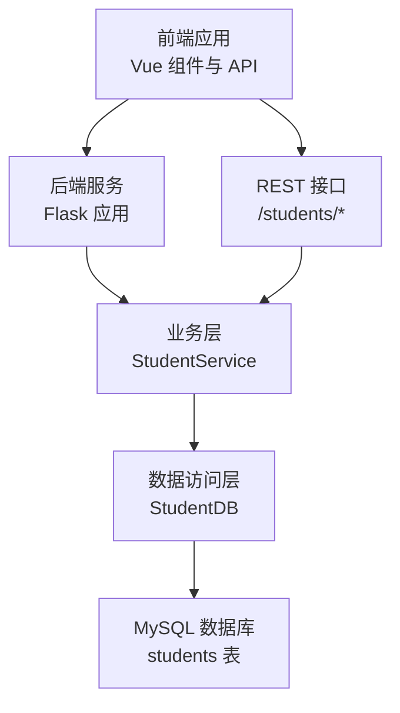
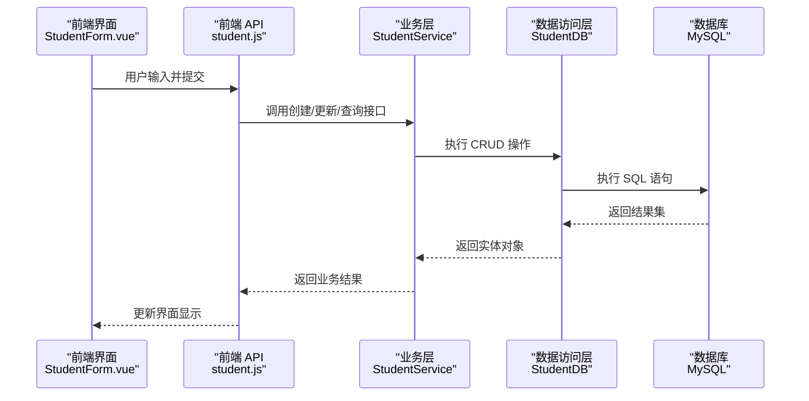
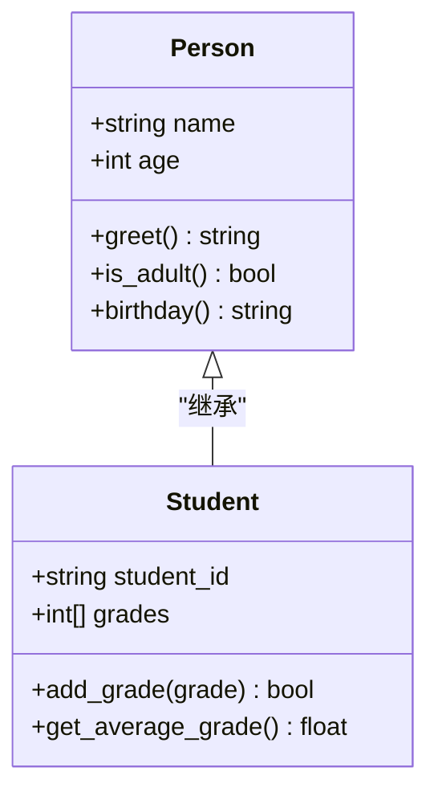
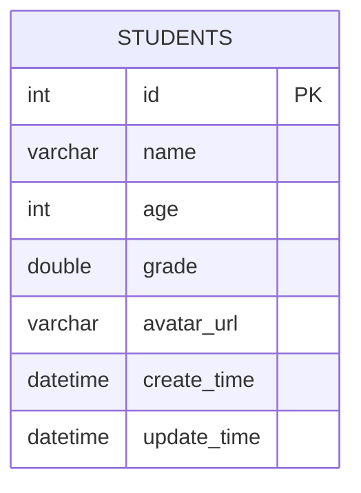
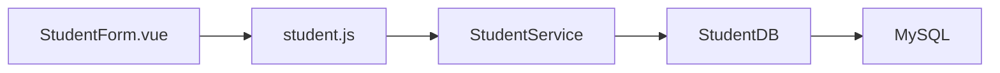

# 数据模型设计

<cite>
**本文引用的文件**
- [models.py](file://python/src/models.py)
- [student_db.py](file://python/src/student_db.py)
- [test_models.py](file://python/tests/test_models.py)
- [StudentForm.vue](file://python-web/src/components/StudentForm.vue)
- [student.js](file://python-web/src/api/student.js)
- [notification_db.py](file://python/src/notification_db.py)
- [verification_service.py](file://python/src/notifications/verification_service.py)
- [email_sender.py](file://python/src/notifications/email_sender.py)
- [sms_sender.py](file://python/src/notifications/sms_sender.py)
</cite>

## 目录
1. [简介](#简介)
2. [项目结构](#项目结构)
3. [核心组件](#核心组件)
4. [架构总览](#架构总览)
5. [详细组件分析](#详细组件分析)
6. [依赖分析](#依赖分析)
7. [性能考虑](#性能考虑)
8. [故障排查指南](#故障排查指南)
9. [结论](#结论)
10. [附录](#附录)

## 简介
本文件围绕“学生数据模型”的字段定义、数据类型、约束条件、关系设计与映射进行系统化说明，并结合实际代码中的 Student 类、StudentDB 数据库访问层、StudentService 业务层以及前端交互组件，给出从对象模型到数据库表结构的完整映射路径。文档同时涵盖主键、外键、索引的设计原则与性能考量，数据验证规则、默认值设置与业务逻辑约束，并提供 ER 图与表结构说明。

## 项目结构
该项目采用前后端分离架构：后端使用 Python 实现，包含数据模型与数据库访问层；前端使用 Vue 构建，通过 API 调用后端接口完成数据展示与操作。学生数据模型涉及的核心文件如下：
- 后端模型与数据库访问：models.py、student_db.py、notification_db.py
- 前端组件与 API：StudentForm.vue、student.js
- 测试：test_models.py
- 验证码与通知：verification_service.py、email_sender.py、sms_sender.py

图表来源
- [student_db.py:160-258](file://python/src/student_db.py#L160-L258)
- [student.js:22-102](file://python-web/src/api/student.js#L22-L102)

章节来源
- [models.py:1-59](file://python/src/models.py#L1-L59)
- [student_db.py:1-259](file://python/src/student_db.py#L1-L259)
- [notification_db.py:1-357](file://python/src/notification_db.py#L1-L357)
- [StudentForm.vue:1-201](file://python-web/src/components/StudentForm.vue#L1-L201)
- [student.js:1-102](file://python-web/src/api/student.js#L1-L102)

## 核心组件
本节聚焦于学生数据模型的三个层面：对象模型（Python 类）、业务模型（数据传输对象）与数据库模型（表结构）。重点说明 Student 类的继承关系、属性与方法，以及与数据库表的映射。

- 对象模型（Person → Student）
  - Person 提供基础属性与行为（姓名、年龄、问候、成年判断、生日）。
  - Student 继承 Person，新增学号与成绩集合，并提供成绩录入与平均分计算。
- 业务模型（StudentModel）
  - 用于封装数据库查询结果，便于跨层传递与序列化。
- 数据库模型（students 表）
  - 主键自增 id；非空字段包括 name、age、grade；其他字段如 avatar_url 可为空；包含时间戳 create_time、update_time。

章节来源
- [models.py:17-33](file://python/src/models.py#L17-L33)
- [student_db.py:140-158](file://python/src/student_db.py#L140-L158)
- [student_db.py:19-29](file://python/src/student_db.py#L19-L29)

## 架构总览
下图展示了从前端到后端再到数据库的数据流与职责划分：

图表来源
- [StudentForm.vue:187-201](file://python-web/src/components/StudentForm.vue#L187-L201)
- [student.js:35-53](file://python-web/src/api/student.js#L35-L53)
- [student_db.py:32-117](file://python/src/student_db.py#L32-L117)
- [student_db.py:160-258](file://python/src/student_db.py#L160-L258)

## 详细组件分析

### 对象模型：Person 与 Student
- 继承关系
  - Student 继承 Person，复用姓名与年龄属性及通用行为。
- 属性定义
  - Person：name（字符串）、age（整数）
  - Student：在 Person 基础上增加 student_id（字符串/标识符）、grades（数值列表）
- 方法实现
  - Person：greet、is_adult、birthday
  - Student：add_grade（0-100 有效范围校验）、get_average_grade（空集合返回 0）

图表来源
- [models.py:1-15](file://python/src/models.py#L1-L15)
- [models.py:17-33](file://python/src/models.py#L17-L33)

章节来源
- [models.py:1-15](file://python/src/models.py#L1-L15)
- [models.py:17-33](file://python/src/models.py#L17-L33)
- [test_models.py:22-27](file://python/tests/test_models.py#L22-L27)

### 数据库模型：students 表
- 字段定义与数据类型
  - id：整型，主键，自增
  - name：字符串，最大长度 100，NOT NULL
  - age：整型，NOT NULL
  - grade：浮点数（DOUBLE），NOT NULL
  - avatar_url：字符串，最大长度 500，可空
  - create_time：日期时间，可空
  - update_time：日期时间，可空
- 约束条件
  - 主键：id
  - 非空：name、age、grade
  - 可空：avatar_url、create_time、update_time
- 关系设计
  - 当前 students 表未定义外键约束；若未来扩展关联（如班级、课程），可在相应表中引入外键指向主表 id，并建立索引以提升查询性能。
- 索引设计原则与性能考虑
  - 建议在 name 上建立普通索引，支持模糊查询（LIKE）与等值查询。
  - 在 age、grade 建立复合索引或独立索引，满足统计与排序需求。
  - 在 create_time、update_time 建立索引，优化按时间维度的查询与审计。
  - 使用覆盖索引减少回表成本（例如联合索引包含 name、age、grade）。
- 默认值设置
  - 当前表未显式设置默认值；建议在业务层统一处理空值（如 avatar_url 默认 null）。
- 业务逻辑约束
  - 年龄范围：1-150
  - 成绩范围：0-100
  - 姓名必填且非空字符串

图表来源
- [student_db.py:19-29](file://python/src/student_db.py#L19-L29)

章节来源
- [student_db.py:19-29](file://python/src/student_db.py#L19-L29)

### 业务模型：StudentModel
- 作用：封装数据库查询结果，便于序列化与跨层传递。
- 字段映射：与 students 表字段一一对应，包含 id、name、age、grade、avatar_url、create_time。
- to_dict：提供字典化输出，便于 API 响应。

章节来源
- [student_db.py:140-158](file://python/src/student_db.py#L140-L158)

### 数据访问层：StudentDB
- 初始化与表结构
  - 连接本地 MySQL（端口 3308），数据库 school_db；首次运行自动创建 students 表。
- CRUD 操作
  - create：插入记录，填充 create_time 与 update_time。
  - get_all/get_by_id/get_by_name：查询接口，返回标准化字典。
  - update：动态拼接更新字段，统一更新 update_time。
  - delete/delete_batch：单条与批量删除。
  - exists/count：存在性检查与计数。
- 性能与安全
  - 使用参数化查询防止 SQL 注入。
  - 动态更新字段避免全量更新，减少写放大。

章节来源
- [student_db.py:5-16](file://python/src/student_db.py#L5-L16)
- [student_db.py:32-117](file://python/src/student_db.py#L32-L117)

### 业务层：StudentService
- 校验规则
  - 姓名非空校验；年龄 1-150；成绩 0-100。
  - 更新时同样校验参数范围与存在性。
- 统计功能
  - 计算总人数、平均年龄、平均成绩、最高/最低成绩。
- 错误处理
  - 不存在的 ID 抛出明确异常信息，便于前端提示。

章节来源
- [student_db.py:160-258](file://python/src/student_db.py#L160-L258)

### 前端交互：StudentForm.vue 与 student.js
- 表单校验
  - 姓名必填；年龄 1-150；成绩 0-100；头像上传限制（图片类型、大小）。
- API 调用
  - 支持获取列表、按 ID 查询、搜索、创建、更新、删除、统计、文件上传与导出。
- 数据映射
  - 前端字段与后端 StudentModel 保持一致，确保序列化/反序列化顺畅。

章节来源
- [StudentForm.vue:163-185](file://python-web/src/components/StudentForm.vue#L163-L185)
- [student.js:22-102](file://python-web/src/api/student.js#L22-L102)

## 依赖分析
- 组件耦合
  - StudentService 依赖 StudentDB；StudentDB 依赖 MySQL；前端通过 student.js 与后端交互。
- 外部依赖
  - Python：pymysql（数据库连接）
  - 前端：fetch（HTTP 请求）
- 循环依赖
  - 当前模块间无循环导入；各层职责清晰，耦合度低。

图表来源
- [student.js:22-102](file://python-web/src/api/student.js#L22-L102)
- [student_db.py:160-258](file://python/src/student_db.py#L160-L258)

章节来源
- [student_db.py:160-258](file://python/src/student_db.py#L160-L258)
- [student.js:22-102](file://python-web/src/api/student.js#L22-L102)

## 性能考虑
- 索引策略
  - name：建立索引以支持模糊匹配与精确查找。
  - age、grade：根据查询频率决定是否建立独立索引或复合索引。
  - 时间字段：create_time、update_time 建立索引，便于分页与排序。
- 查询优化
  - 使用覆盖索引减少回表；避免 SELECT *，仅选择必要列。
  - 分页查询时使用 LIMIT/OFFSET，配合索引提升性能。
- 写入优化
  - 动态更新字段（StudentDB.update）减少不必要的列更新。
  - 批量删除（delete_batch）降低事务开销。
- 缓存与一致性
  - 对热点数据可引入缓存层（如 Redis），注意缓存失效策略与最终一致性。

## 故障排查指南
- 常见错误与定位
  - 参数非法：前端校验失败或后端校验抛错（如年龄/成绩范围、姓名为空）。
  - 数据不存在：按 ID 查询返回空或抛出异常。
  - 数据库连接失败：确认 host/port/user/password/database 配置正确。
  - SQL 注入风险：确保使用参数化查询（当前实现已满足）。
- 日志与审计
  - 可在业务层记录关键操作日志，辅助问题定位与审计追踪。
- 前端提示
  - 前端组件对错误进行友好提示，避免暴露内部异常细节。

章节来源
- [student_db.py:164-228](file://python/src/student_db.py#L164-L228)
- [StudentForm.vue:163-185](file://python-web/src/components/StudentForm.vue#L163-L185)

## 结论
本项目通过清晰的对象模型、严谨的业务校验与规范的数据库设计，实现了学生数据的完整生命周期管理。对象模型（Person/Student）与数据库表（students）映射明确，业务层（StudentService）承担了数据验证与统计职责，前端组件负责交互与 API 调用。建议后续在数据库层面补充外键与索引，进一步提升数据完整性与查询性能。

## 附录

### 字段定义与约束对照表
- id：主键，自增，整型
- name：非空，字符串，最大长度 100
- age：非空，整型，范围 1-150
- grade：非空，浮点数，范围 0-100
- avatar_url：可空，字符串，最大长度 500
- create_time/update_time：可空，日期时间

章节来源
- [student_db.py:19-29](file://python/src/student_db.py#L19-L29)

### 数据验证规则与默认值
- 验证规则
  - 姓名必填且非空
  - 年龄范围：1-150
  - 成绩范围：0-100
- 默认值
  - avatar_url 默认空（由业务层处理）
  - create_time/update_time 由数据库写入

章节来源
- [student_db.py:164-228](file://python/src/student_db.py#L164-L228)

### 业务逻辑约束
- 创建/更新时对参数进行范围校验
- 删除前检查是否存在
- 统计功能对空集合进行保护（返回默认值）

章节来源
- [student_db.py:236-256](file://python/src/student_db.py#L236-L256)