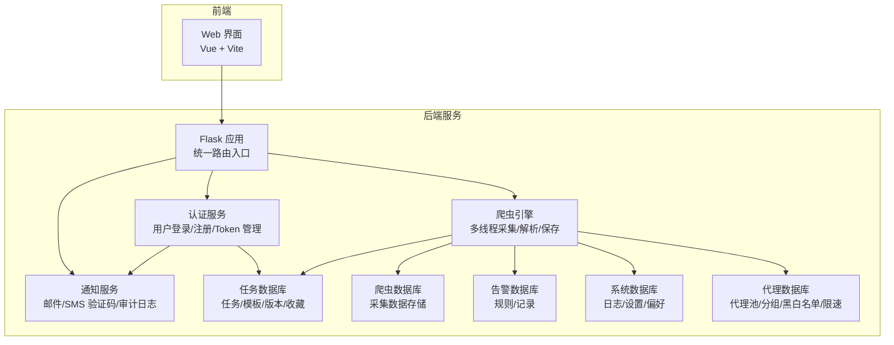
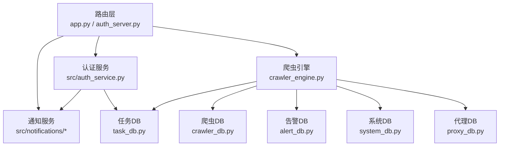
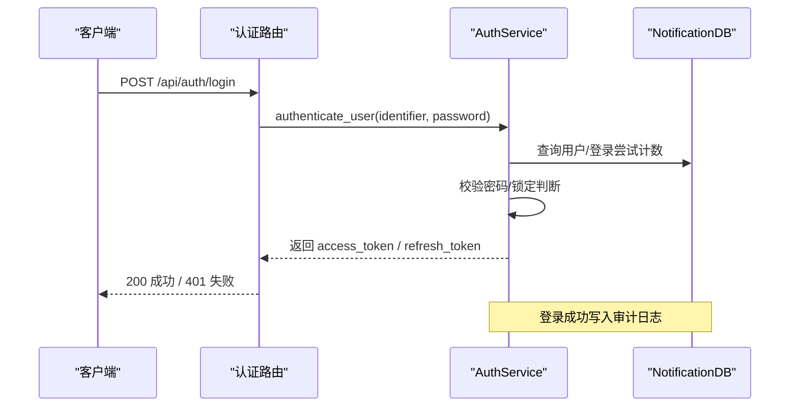
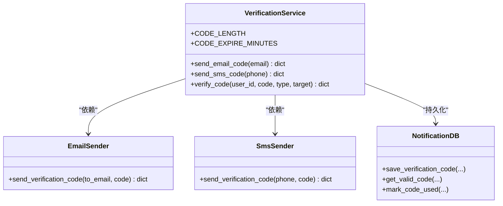
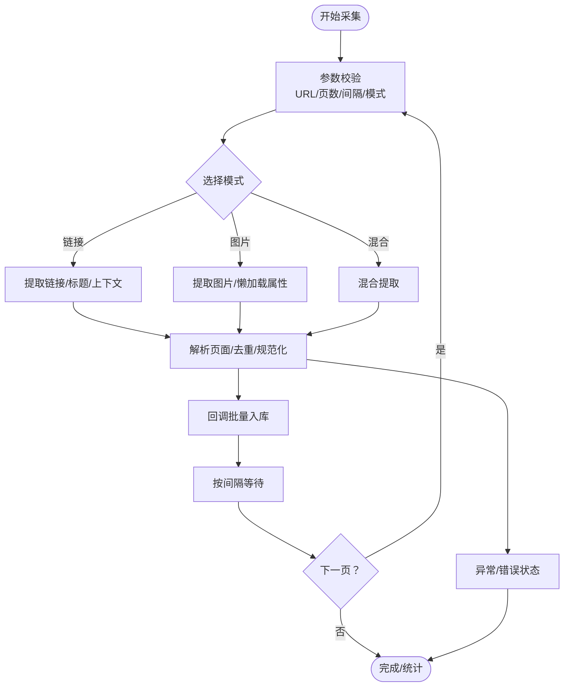
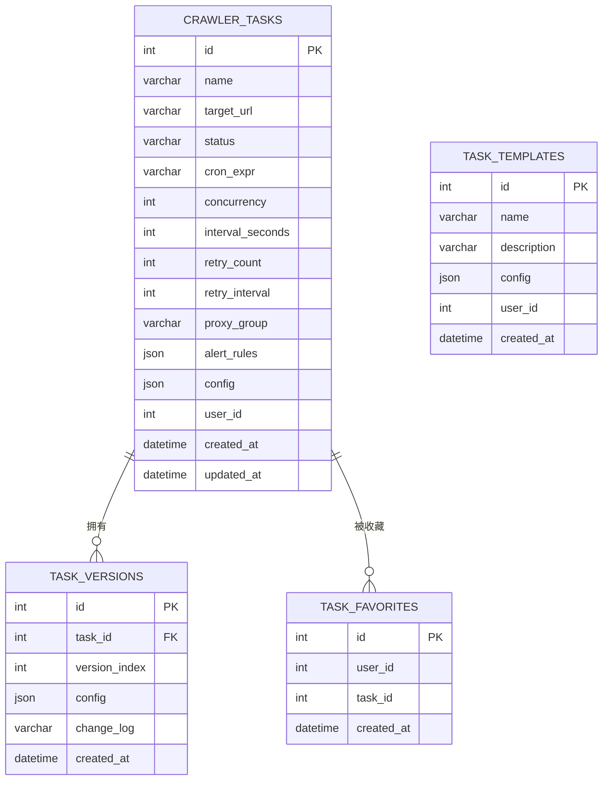
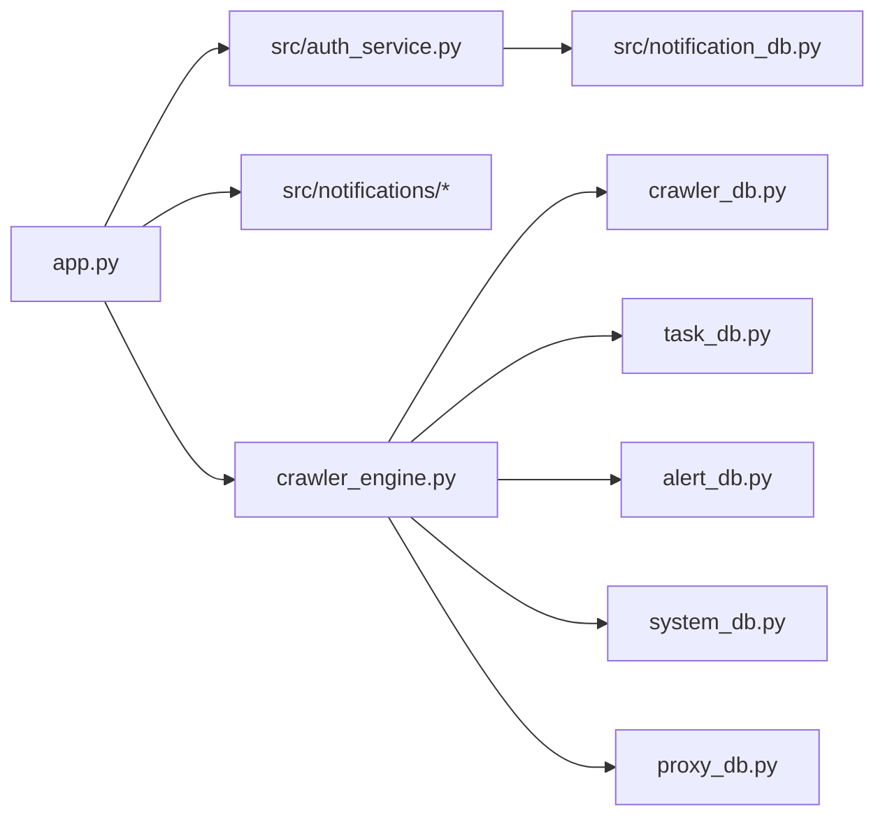

# 核心功能模块

<cite>
**本文档引用的文件**
- [app.py](file://python/app.py)
- [auth_server.py](file://python/auth_server.py)
- [src/auth_service.py](file://python/src/auth_service.py)
- [src/notification_db.py](file://python/src/notification_db.py)
- [src/notifications/email_sender.py](file://python/src/notifications/email_sender.py)
- [src/notifications/sms_sender.py](file://python/src/notifications/sms_sender.py)
- [src/notifications/verification_service.py](file://python/src/notifications/verification_service.py)
- [crawler_engine.py](file://python/crawler_engine.py)
- [crawler_db.py](file://python/crawler_db.py)
- [task_db.py](file://python/task_db.py)
- [alert_db.py](file://python/alert_db.py)
- [system_db.py](file://python/system_db.py)
- [proxy_db.py](file://python/proxy_db.py)
</cite>

## 目录
1. [引言](#引言)
2. [项目结构](#项目结构)
3. [核心组件](#核心组件)
4. [架构总览](#架构总览)
5. [详细组件分析](#详细组件分析)
6. [依赖分析](#依赖分析)
7. [性能考虑](#性能考虑)
8. [故障排查指南](#故障排查指南)
9. [结论](#结论)
10. [附录](#附录)

## 引言
本文件面向需要深入理解学生管理系统的开发者与系统管理员，系统围绕五大核心功能展开：用户认证系统、学生数据管理、爬虫数据采集、任务管理系统、通知系统。文档将阐述各模块的设计理念、实现原理、使用场景与扩展方式，并给出模块间协作关系与数据流转图示；同时覆盖配置选项、API 接口、错误处理与性能优化建议。

## 项目结构
系统采用前后端分离架构，后端由多个独立模块组成，分别负责不同业务域的数据持久化与服务编排。前端通过 RESTful API 与后端交互，后端通过统一入口路由聚合各模块能力。

图表来源
- [app.py:1-120](file://python/app.py#L1-L120)
- [auth_server.py:1-60](file://python/auth_server.py#L1-L60)
- [src/auth_service.py:1-60](file://python/src/auth_service.py#L1-L60)
- [crawler_engine.py:1-60](file://python/crawler_engine.py#L1-L60)
- [crawler_db.py:1-60](file://python/crawler_db.py#L1-L60)
- [task_db.py:1-60](file://python/task_db.py#L1-L60)
- [alert_db.py:1-60](file://python/alert_db.py#L1-L60)
- [system_db.py:1-60](file://python/system_db.py#L1-L60)
- [proxy_db.py:1-60](file://python/proxy_db.py#L1-L60)

章节来源
- [app.py:1-120](file://python/app.py#L1-L120)
- [auth_server.py:1-60](file://python/auth_server.py#L1-L60)

## 核心组件
- 用户认证系统：基于 JWT 的访问/刷新 Token 管理，支持密码历史校验与登录失败锁定；集成审计日志与 Token 黑名单。
- 学生数据管理：提供基础模型与算法演示（非核心业务），核心业务以任务与爬虫数据为主。
- 爬虫数据采集：多线程、多模式（链接/图片/混合）、UA 随机化、请求延时与错误重试，支持回调批量入库。
- 任务管理系统：任务生命周期管理（创建/启动/停止/删除）、模板与版本回滚、收藏夹、调度配置。
- 通知系统：邮件与短信验证码发送、临时用户创建、验证码有效期与使用标记。

章节来源
- [src/models.py:1-59](file://python/src/models.py#L1-L59)
- [src/auth_service.py:1-187](file://python/src/auth_service.py#L1-L187)
- [src/notification_db.py:1-120](file://python/src/notification_db.py#L1-L120)
- [src/notifications/verification_service.py:1-60](file://python/src/notifications/verification_service.py#L1-L60)
- [crawler_engine.py:1-120](file://python/crawler_engine.py#L1-L120)
- [crawler_db.py:1-120](file://python/crawler_db.py#L1-L120)
- [task_db.py:1-120](file://python/task_db.py#L1-L120)
- [alert_db.py:1-120](file://python/alert_db.py#L1-L120)
- [system_db.py:1-120](file://python/system_db.py#L1-L120)
- [proxy_db.py:1-120](file://python/proxy_db.py#L1-L120)

## 架构总览
系统采用“路由层 + 服务层 + 数据层”的三层架构。路由层统一暴露 RESTful 接口；服务层封装业务逻辑（认证、通知、任务调度等）；数据层通过独立 DB 类管理各自领域的表结构与 CRUD。

图表来源
- [app.py:49-120](file://python/app.py#L49-L120)
- [auth_server.py:47-120](file://python/auth_server.py#L47-L120)
- [src/auth_service.py:1-120](file://python/src/auth_service.py#L1-L120)
- [src/notifications/verification_service.py:1-60](file://python/src/notifications/verification_service.py#L1-L60)
- [crawler_engine.py:464-533](file://python/crawler_engine.py#L464-L533)
- [crawler_db.py:96-140](file://python/crawler_db.py#L96-L140)
- [task_db.py:172-210](file://python/task_db.py#L172-L210)
- [alert_db.py:93-118](file://python/alert_db.py#L93-L118)
- [system_db.py:99-122](file://python/system_db.py#L99-L122)
- [proxy_db.py:168-198](file://python/proxy_db.py#L168-L198)

## 详细组件分析

### 用户认证系统
- 设计理念
  - 基于 JWT 的短期访问 Token 与长期刷新 Token，结合数据库黑名单与登录失败锁定机制，提升安全性。
  - 密码历史校验防止重复使用近期密码，审计日志记录关键行为。
- 实现要点
  - 密码哈希使用 bcrypt，Token 加解密使用 HS256。
  - 登录失败次数达到阈值进行临时锁定，支持按分钟计算解锁。
  - 访问/刷新 Token 校验装饰器统一拦截未授权请求。
- 使用场景
  - 用户注册/登录/登出、忘记密码/修改密码、个人资料查看。
- 扩展方式
  - 新增登录策略（如二次验证）、Token 刷新策略、审计日志字段扩展。

图表来源
- [app.py:95-120](file://python/app.py#L95-L120)
- [src/auth_service.py:76-118](file://python/src/auth_service.py#L76-L118)
- [src/notification_db.py:334-343](file://python/src/notification_db.py#L334-L343)

章节来源
- [src/auth_service.py:1-187](file://python/src/auth_service.py#L1-L187)
- [src/notification_db.py:1-120](file://python/src/notification_db.py#L1-L120)
- [app.py:95-120](file://python/app.py#L95-L120)

### 通知系统（邮件/SMS 验证码）
- 设计理念
  - 将验证码生成、发送与校验解耦，支持邮箱与短信双通道，临时用户用于未注册目标的验证码发送。
- 实现要点
  - 验证码长度与有效期可配置，默认 5 分钟；发送失败/异常均有明确返回。
  - 邮件与短信发送器通过阿里云 SDK 实现，支持模板参数注入。
- 使用场景
  - 忘记密码流程、注册/登录二次验证、安全事件提醒。
- 扩展方式
  - 新增通知渠道（钉钉/企业微信）、模板管理、发送队列异步化。

图表来源
- [src/notifications/verification_service.py:1-108](file://python/src/notifications/verification_service.py#L1-L108)
- [src/notifications/email_sender.py:1-67](file://python/src/notifications/email_sender.py#L1-L67)
- [src/notifications/sms_sender.py:1-65](file://python/src/notifications/sms_sender.py#L1-L65)
- [src/notification_db.py:147-189](file://python/src/notification_db.py#L147-L189)

章节来源
- [src/notifications/verification_service.py:1-108](file://python/src/notifications/verification_service.py#L1-L108)
- [src/notifications/email_sender.py:1-67](file://python/src/notifications/email_sender.py#L1-L67)
- [src/notifications/sms_sender.py:1-65](file://python/src/notifications/sms_sender.py#L1-L65)
- [src/notification_db.py:147-189](file://python/src/notification_db.py#L147-L189)

### 爬虫数据采集
- 设计理念
  - 多线程异步采集，支持多种爬取模式与反爬策略（UA 随机、请求延时、错误重试），通过回调批量入库。
- 实现要点
  - 支持链接/图片/混合三种模式，自动去重与规范化 URL；对懒加载图片属性进行多源提取。
  - 状态管理包含运行/完成/错误/停止，支持实时状态查询与重置。
- 使用场景
  - 网站内容采集、图片资源抓取、内容摘要提取。
- 扩展方式
  - 新增解析器插件、代理池集成、速率限制策略、增量采集与断点续传。

图表来源
- [crawler_engine.py:464-533](file://python/crawler_engine.py#L464-L533)
- [crawler_engine.py:171-398](file://python/crawler_engine.py#L171-L398)
- [crawler_db.py:96-140](file://python/crawler_db.py#L96-L140)

章节来源
- [crawler_engine.py:1-533](file://python/crawler_engine.py#L1-L533)
- [crawler_db.py:1-238](file://python/crawler_db.py#L1-L238)

### 任务管理系统
- 设计理念
  - 以任务为中心的生命周期管理，支持模板复用、版本控制与收藏夹，便于团队协作与审计追踪。
- 实现要点
  - 任务表包含状态、调度、并发、重试、代理组、告警规则等配置；模板与版本表支持快速复制与回滚。
  - 收藏夹实现用户与任务的多对多关联，便于快捷访问。
- 使用场景
  - 定时采集任务编排、模板化配置复用、版本回滚与审计。
- 扩展方式
  - 新增任务调度器（Celery/定时任务）、任务执行器插件、告警联动与自动化修复。

图表来源
- [task_db.py:52-111](file://python/task_db.py#L52-L111)
- [task_db.py:172-210](file://python/task_db.py#L172-L210)
- [task_db.py:367-397](file://python/task_db.py#L367-L397)
- [task_db.py:446-487](file://python/task_db.py#L446-L487)

章节来源
- [task_db.py:1-533](file://python/task_db.py#L1-L533)

### 通知系统（审计日志/系统日志/设置）
- 设计理念
  - 统一的日志与设置管理，支持系统级日志分级、用户偏好设置与系统配置持久化。
- 实现要点
  - 审计日志记录用户关键动作；系统日志支持按级别与来源过滤；系统设置与用户偏好提供统一读写接口。
- 使用场景
  - 安全审计、运维监控、个性化配置。
- 扩展方式
  - 新增日志采集器、配置热更新、偏好同步到前端。

章节来源
- [src/notification_db.py:334-343](file://python/src/notification_db.py#L334-L343)
- [system_db.py:99-183](file://python/system_db.py#L99-L183)
- [system_db.py:255-314](file://python/system_db.py#L255-L314)

## 依赖分析
- 组件耦合
  - 路由层仅依赖服务层与数据库层接口，保持低耦合高内聚。
  - 认证服务与通知服务强相关（验证码与审计日志），爬虫引擎与任务/告警/系统/代理数据库存在跨域依赖。
- 外部依赖
  - Flask、PyMySQL、bcrypt、PyJWT、BeautifulSoup4、requests、Aliyun SDK。
- 循环依赖
  - 未发现循环导入；服务层通过 DB 实例进行数据访问，避免直接相互调用。

图表来源
- [app.py:1-30](file://python/app.py#L1-L30)
- [src/auth_service.py:1-20](file://python/src/auth_service.py#L1-L20)
- [src/notifications/verification_service.py:1-20](file://python/src/notifications/verification_service.py#L1-L20)
- [crawler_engine.py:1-20](file://python/crawler_engine.py#L1-L20)
- [crawler_db.py:1-20](file://python/crawler_db.py#L1-L20)
- [task_db.py:1-20](file://python/task_db.py#L1-L20)
- [alert_db.py:1-20](file://python/alert_db.py#L1-L20)
- [system_db.py:1-20](file://python/system_db.py#L1-L20)
- [proxy_db.py:1-20](file://python/proxy_db.py#L1-L20)

## 性能考虑
- 爬虫性能
  - 多线程并发与请求间隔控制平衡采集效率与目标网站抗压能力；UA 随机化与错误重试降低失败率。
  - 建议：将批量入库改为事务提交，减少数据库往返；对高频 URL 做本地缓存去重。
- 认证性能
  - Token 解析与黑名单查询应走索引；登录失败锁定与审计日志写入建议异步化。
- 数据库性能
  - 各 DB 类均建立必要索引；分页查询与条件过滤避免全表扫描；大字段 JSON 建议拆表或压缩。
- 前后端性能
  - 前端路由懒加载与组件按需引入；后端接口增加限流与熔断策略。

## 故障排查指南
- 认证相关
  - 登录失败次数过多：检查登录锁定时间与用户状态；确认密码哈希一致性。
  - Token 失效：检查黑名单表与过期时间；刷新 Token 时确认类型与签名。
- 爬虫相关
  - 403/5xx 错误：调整 UA/延时；检查网络与代理可用性；查看错误状态与当前页码。
  - 数据入库失败：检查回调返回值与数据库连接；关注重复键与字段长度。
- 任务相关
  - 任务状态异常：核对状态字段与调度配置；检查版本回滚是否成功。
- 通知相关
  - 验证码发送失败：检查邮件/SMS 凭据与模板；确认目标号码/邮箱格式。
- 日志与监控
  - 审计日志缺失：确认写入流程与异常捕获；检查数据库连接与事务提交。
  - 系统日志堆积：按级别与来源筛选，定期清理或归档。

章节来源
- [src/auth_service.py:58-66](file://python/src/auth_service.py#L58-L66)
- [crawler_engine.py:113-170](file://python/crawler_engine.py#L113-L170)
- [crawler_db.py:102-140](file://python/crawler_db.py#L102-L140)
- [task_db.py:420-445](file://python/task_db.py#L420-L445)
- [src/notifications/verification_service.py:54-81](file://python/src/notifications/verification_service.py#L54-L81)
- [src/notification_db.py:334-343](file://python/src/notification_db.py#L334-L343)

## 结论
本系统通过清晰的模块划分与稳定的三层架构，实现了从认证、通知、采集到任务管理的完整闭环。建议在生产环境中进一步完善异步化、限流与可观测性建设，并持续扩展通知与采集能力以满足复杂场景需求。

## 附录

### 配置选项
- 数据库连接
  - 主机/端口/用户/密码/数据库名/字符集/游标类型，可通过环境变量覆盖默认值。
- 认证服务
  - 密钥、算法、访问/刷新 Token 过期时间、最大登录尝试次数、锁定时长。
- 爬虫引擎
  - 爬取模式（链接/图片/混合）、UA 列表、Accept/Language 随机策略、请求超时与重试次数。
- 通知服务
  - 验证码长度与有效期、邮件/短信发送器配置（阿里云凭据）。
- 任务/系统/代理数据库
  - 表结构自检与初始化、索引与约束、速率限制与黑白名单维护。

章节来源
- [crawler_db.py:12-22](file://python/crawler_db.py#L12-L22)
- [task_db.py:13-24](file://python/task_db.py#L13-L24)
- [system_db.py:13-23](file://python/system_db.py#L13-L23)
- [proxy_db.py:12-22](file://python/proxy_db.py#L12-L22)
- [src/auth_service.py:9-16](file://python/src/auth_service.py#L9-L16)

### API 接口概览
- 认证接口
  - POST /api/auth/register：注册
  - POST /api/auth/login：登录
  - POST /api/auth/refresh：刷新 Token
  - POST /api/auth/logout：登出
  - POST /api/auth/forgot-password/send-code：发送验证码
  - POST /api/auth/forgot-password/verify-code：校验验证码
  - POST /api/auth/forgot-password/reset：重置密码
  - POST /api/auth/change-password：修改密码
  - GET /api/user/profile：获取用户信息
- 爬虫接口
  - POST /api/crawler/start：启动采集
  - POST /api/crawler/stop：停止采集
  - GET /api/crawler/status：获取状态
  - GET /api/crawler/data：分页查询数据
  - DELETE /api/crawler/data：清空数据
  - GET /api/crawler/export：导出 CSV
- 任务接口
  - GET/POST /api/tasks：任务列表/创建
  - GET/PUT/DELETE /api/tasks/{id}：详情/更新/删除
  - POST /api/tasks/{id}/start：启动任务
  - POST /api/tasks/{id}/stop：停止任务
  - GET /api/tasks/templates：模板列表
  - POST /api/tasks/templates：创建模板
  - GET/DELETE /api/tasks/templates/{id}：模板详情/删除
  - GET /api/tasks/{id}/versions：版本列表
  - POST /api/tasks/{id}/versions/rollback：版本回滚
  - GET /api/tasks/favorites：收藏任务

章节来源
- [app.py:49-806](file://python/app.py#L49-L806)
- [auth_server.py:47-424](file://python/auth_server.py#L47-L424)