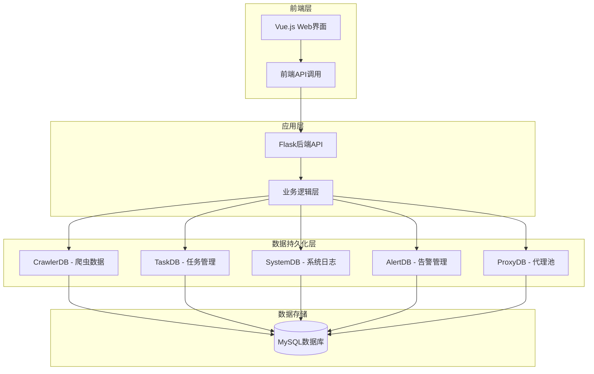
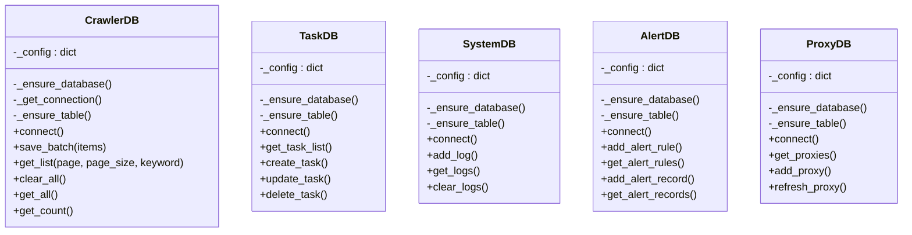
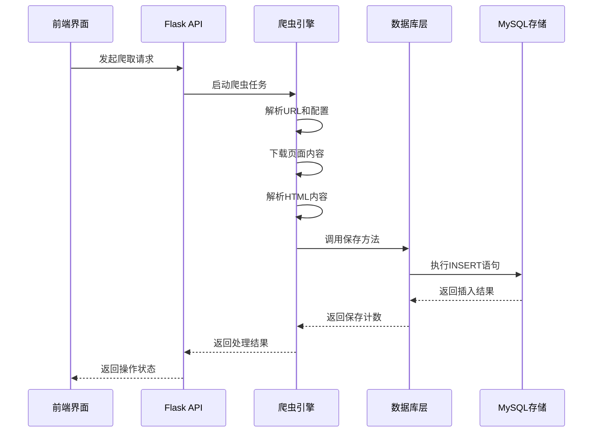
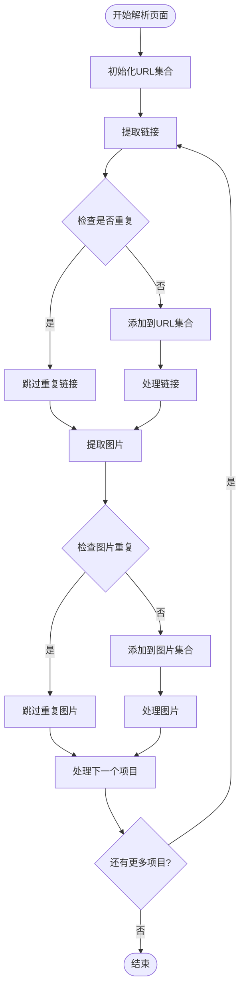
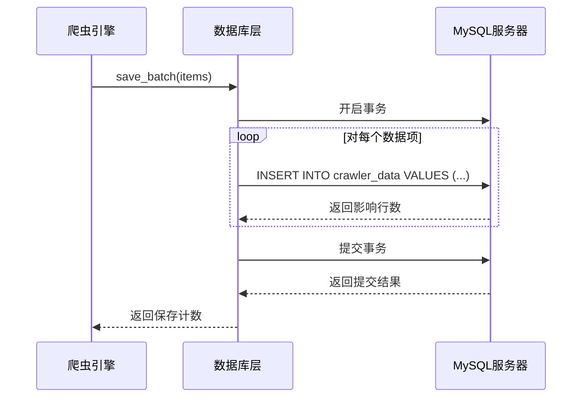
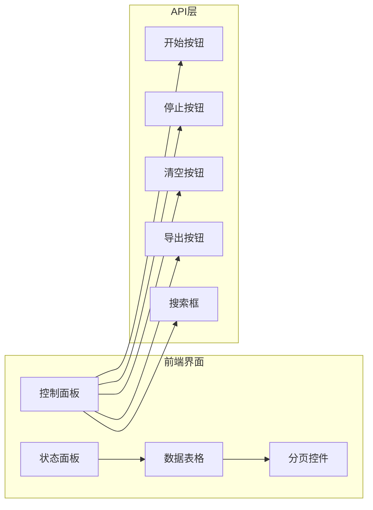
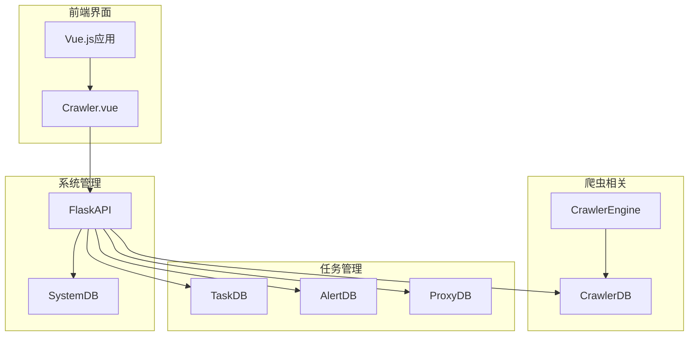

# 数据存储与持久化

<cite>
**本文档引用的文件**
- [crawler_db.py](file://python/crawler_db.py)
- [crawler_engine.py](file://python/crawler_engine.py)
- [app_db.py](file://python/app_db.py)
- [system_db.py](file://python/system_db.py)
- [task_db.py](file://python/task_db.py)
- [alert_db.py](file://python/alert_db.py)
- [proxy_db.py](file://python/proxy_db.py)
- [Crawler.vue](file://python-web/src/views/Crawler.vue)
- [crawler.js](file://python-web/src/api/crawler.js)
</cite>

## 目录
1. [简介](#简介)
2. [项目结构](#项目结构)
3. [核心组件](#核心组件)
4. [架构概览](#架构概览)
5. [详细组件分析](#详细组件分析)
6. [依赖关系分析](#依赖关系分析)
7. [性能考虑](#性能考虑)
8. [故障排除指南](#故障排除指南)
9. [结论](#结论)

## 简介

本项目是一个基于Python的爬虫管理系统，采用MySQL作为主要数据存储，实现了完整的爬虫数据采集、存储、查询和管理功能。系统采用分层架构设计，包含爬虫引擎、数据持久化层、Web界面和API接口。

## 项目结构

项目采用模块化设计，主要分为以下几个层次：

**图表来源**
- [crawler_db.py:1-238](file://python/crawler_db.py#L1-238)
- [task_db.py:1-533](file://python/task_db.py#L1-533)
- [system_db.py:1-317](file://python/system_db.py#L1-317)
- [alert_db.py:1-314](file://python/alert_db.py#L1-314)
- [proxy_db.py:1-528](file://python/proxy_db.py#L1-528)

**章节来源**
- [crawler_db.py:1-238](file://python/crawler_db.py#L1-238)
- [task_db.py:1-533](file://python/task_db.py#L1-533)
- [system_db.py:1-317](file://python/system_db.py#L1-317)

## 核心组件

### 数据库连接管理

系统采用PyMySQL作为数据库连接驱动，每个数据库操作类都实现了统一的连接管理机制：

**图表来源**
- [crawler_db.py:6-238](file://python/crawler_db.py#L6-L238)
- [task_db.py:7-533](file://python/task_db.py#L7-L533)
- [system_db.py:7-317](file://python/system_db.py#L7-L317)
- [alert_db.py:6-314](file://python/alert_db.py#L6-L314)
- [proxy_db.py:6-528](file://python/proxy_db.py#L6-L528)

### 爬虫数据表结构

系统定义了专门的爬虫数据表，支持多种数据类型的存储：

| 字段名 | 数据类型 | 约束 | 描述 |
|--------|----------|------|------|
| id | INT | PRIMARY KEY, AUTO_INCREMENT | 主键ID |
| title | VARCHAR(500) | NOT NULL, DEFAULT '' | 标题 |
| link | VARCHAR(1000) | NOT NULL, DEFAULT '' | 链接地址 |
| image_url | VARCHAR(1000) | NOT NULL, DEFAULT '' | 图片URL地址 |
| content | TEXT | NULL | 正文内容摘要 |
| source_url | VARCHAR(500) | NOT NULL, DEFAULT '' | 来源网址 |
| page_number | INT | DEFAULT 1 | 爬取页码 |
| type | VARCHAR(20) | NOT NULL, DEFAULT 'link' | 数据类型: link/image/mixed/page |
| collected_at | DATETIME | NOT NULL, DEFAULT CURRENT_TIMESTAMP | 采集时间 |

**章节来源**
- [crawler_db.py:54-71](file://python/crawler_db.py#L54-L71)

## 架构概览

系统采用分层架构，实现了清晰的职责分离：

**图表来源**
- [crawler_engine.py:464-497](file://python/crawler_engine.py#L464-L497)
- [crawler_db.py:96-139](file://python/crawler_db.py#L96-L139)

## 详细组件分析

### 爬虫引擎组件

爬虫引擎是系统的核心组件，负责实际的数据采集工作：

#### 数据去重机制

系统实现了多层去重策略：

**图表来源**
- [crawler_engine.py:175-196](file://python/crawler_engine.py#L175-L196)

#### 数据清洗和格式转换

爬虫引擎实现了全面的数据清洗流程：

| 清洗步骤 | 处理逻辑 | 输出示例 |
|----------|----------|----------|
| URL规范化 | `urljoin(base, url)` | https://example.com/path |
| 标题截断 | `title[:200]` | "示例标题..." |
| 链接截断 | `link[:500]` | "https://example.com/..." |
| 内容截断 | `content[:1000]` | "页面内容摘要..." |
| 类型标记 | 自动识别链接/图片/页面 | "link", "image", "page" |

**章节来源**
- [crawler_engine.py:171-398](file://python/crawler_engine.py#L171-L398)

### 数据库持久化组件

#### 批量写入策略

系统采用了高效的批量写入机制：

**图表来源**
- [crawler_db.py:96-139](file://python/crawler_db.py#L96-L139)

#### 索引优化策略

系统为关键查询字段建立了优化索引：

| 表名 | 索引字段 | 索引类型 | 查询场景 |
|------|----------|----------|----------|
| crawler_data | source_url | 普通索引 | 按来源URL查询 |
| crawler_data | collected_at | 普通索引 | 按时间排序查询 |
| crawler_data | page_number | 普通索引 | 按页码查询 |
| crawler_data | type | 普通索引 | 按数据类型查询 |
| system_logs | level | 普通索引 | 按日志级别过滤 |
| system_logs | source | 普通索引 | 按来源过滤 |
| system_logs | created_at | 普通索引 | 按时间排序 |
| crawler_tasks | status | 普通索引 | 按任务状态查询 |
| crawler_tasks | user_id | 普通索引 | 按用户查询 |
| crawler_tasks | name | 普通索引 | 按任务名称查询 |

**章节来源**
- [crawler_db.py:65-68](file://python/crawler_db.py#L65-L68)
- [system_db.py:58-60](file://python/system_db.py#L58-L60)
- [task_db.py:68-70](file://python/task_db.py#L68-L70)

### Web界面集成

前端Vue.js界面提供了完整的爬虫管理功能：

**图表来源**
- [Crawler.vue:1-544](file://python-web/src/views/Crawler.vue#L1-L544)

**章节来源**
- [Crawler.vue:1-544](file://python-web/src/views/Crawler.vue#L1-L544)
- [crawler.js:1-22](file://python-web/src/api/crawler.js#L1-L22)

## 依赖关系分析

系统各组件之间的依赖关系如下：

**图表来源**
- [crawler_engine.py:10-533](file://python/crawler_engine.py#L10-L533)
- [crawler_db.py:6-238](file://python/crawler_db.py#L6-L238)
- [task_db.py:7-533](file://python/task_db.py#L7-L533)
- [system_db.py:7-317](file://python/system_db.py#L7-L317)
- [alert_db.py:6-314](file://python/alert_db.py#L6-L314)
- [proxy_db.py:6-528](file://python/proxy_db.py#L6-L528)

**章节来源**
- [app_db.py:1-726](file://python/app_db.py#L1-L726)

## 性能考虑

### 数据库性能优化

1. **索引策略优化**
   - 为高频查询字段建立适当索引
   - 避免过度索引导致写入性能下降
   - 定期分析查询执行计划

2. **连接池管理**
   - 合理配置数据库连接参数
   - 避免连接泄漏
   - 实现连接超时和重连机制

3. **批量操作优化**
   - 使用事务批量提交
   - 控制单次批量大小
   - 异步处理大量数据

### 爬虫性能优化

1. **并发控制**
   - 限制同时进行的爬取任务数量
   - 实现请求频率控制
   - 使用代理池提高并发度

2. **内存管理**
   - 及时清理解析后的HTML内容
   - 控制单页数据量大小
   - 实现数据流式处理

## 故障排除指南

### 常见问题及解决方案

#### 数据库连接问题
- **症状**: 连接超时或连接失败
- **原因**: 数据库服务未启动或网络配置错误
- **解决**: 检查数据库服务状态，验证连接参数

#### 数据重复问题
- **症状**: 同一数据多次入库
- **原因**: 去重逻辑失效或索引缺失
- **解决**: 检查去重算法实现，确保索引正常

#### 性能问题
- **症状**: 写入速度慢或查询响应时间长
- **原因**: 缺少必要的索引或数据量过大
- **解决**: 添加索引，优化查询条件，考虑分表策略

**章节来源**
- [crawler_db.py:130-136](file://python/crawler_db.py#L130-L136)
- [crawler_engine.py:113-170](file://python/crawler_engine.py#L113-L170)

## 结论

本系统实现了完整的爬虫数据存储与持久化解决方案，具有以下特点：

1. **模块化设计**: 采用分层架构，职责清晰，易于维护和扩展
2. **高性能实现**: 通过批量写入、索引优化等技术手段提升性能
3. **数据完整性**: 实现了多层去重和数据清洗机制
4. **用户友好**: 提供直观的Web界面和丰富的管理功能
5. **可扩展性**: 支持任务管理、告警系统、代理池等扩展功能

系统在保证功能完整性的同时，注重性能优化和用户体验，为爬虫数据管理提供了可靠的技术支撑。