# 爬虫任务管理

<cite>
**本文档引用的文件**
- [crawler_engine.py](file://python/crawler_engine.py)
- [task_db.py](file://python/task_db.py)
- [crawler_db.py](file://python/crawler_db.py)
- [app.py](file://python/app.py)
- [main.py](file://python/main.py)
- [requirements.txt](file://python/requirements.txt)
- [Tasks.vue](file://python-web/src/views/Tasks.vue)
- [TaskDetail.vue](file://python-web/src/views/TaskDetail.vue)
- [TaskTemplates.vue](file://python-web/src/views/TaskTemplates.vue)
- [crawler.js](file://python-web/src/stores/crawler.js)
- [task.js](file://python-web/src/api/task.js)
</cite>

## 目录
1. [项目概述](#项目概述)
2. [系统架构](#系统架构)
3. [核心组件](#核心组件)
4. [任务生命周期管理](#任务生命周期管理)
5. [任务模板系统](#任务模板系统)
6. [定时调度机制](#定时调度机制)
7. [批量执行与并发控制](#批量执行与并发控制)
8. [错误恢复机制](#错误恢复机制)
9. [数据库交互模式](#数据库交互模式)
10. [API 接口定义](#api-接口定义)
11. [性能优化建议](#性能优化建议)
12. [故障排除指南](#故障排除指南)
13. [总结](#总结)

## 项目概述

这是一个基于 Python Flask 的爬虫任务管理系统，提供了完整的爬虫任务生命周期管理功能。系统采用前后端分离架构，后端使用 Flask 提供 RESTful API，前端使用 Vue.js 构建用户界面。

该系统的核心功能包括：
- 爬虫任务的创建、配置、执行和监控
- 任务模板管理，支持快速创建重复性任务
- 定时调度和批量执行
- 错误恢复和重试机制
- 数据库持久化存储
- 用户友好的 Web 界面

## 系统架构

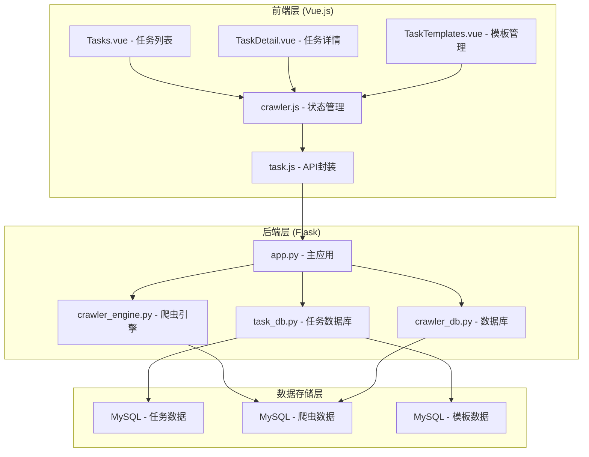
```mermaid
graph TB
subgraph "前端层 (Vue.js)"
FE1[Tasks.vue - 任务列表]
FE2[TaskDetail.vue - 任务详情]
FE3[TaskTemplates.vue - 模板管理]
FE4[crawler.js - 状态管理]
FE5[task.js - API封装]
end
subgraph "后端层 (Flask)"
BE1[app.py - 主应用]
BE2[crawler_engine.py - 爬虫引擎]
BE3[task_db.py - 任务数据库]
BE4[crawler_db.py - 数据库]
end
subgraph "数据存储层"
DB1[MySQL - 任务数据]
DB2[MySQL - 爬虫数据]
DB3[MySQL - 模板数据]
end
FE1 --> FE4
FE2 --> FE4
FE3 --> FE4
FE4 --> FE5
FE5 --> BE1
BE1 --> BE2
BE1 --> BE3
BE1 --> BE4
BE2 --> DB2
BE3 --> DB1
BE3 --> DB3
BE4 --> DB2
```

**图表来源**
- [app.py:1-50](file://python/app.py#L1-L50)
- [crawler_engine.py:10-60](file://python/crawler_engine.py#L10-L60)
- [task_db.py:7-25](file://python/task_db.py#L7-L25)
- [crawler_db.py:6-25](file://python/crawler_db.py#L6-L25)

## 核心组件

### 爬虫引擎 (CrawlerEngine)

爬虫引擎是系统的核心组件，负责实际的网页抓取和数据解析工作。

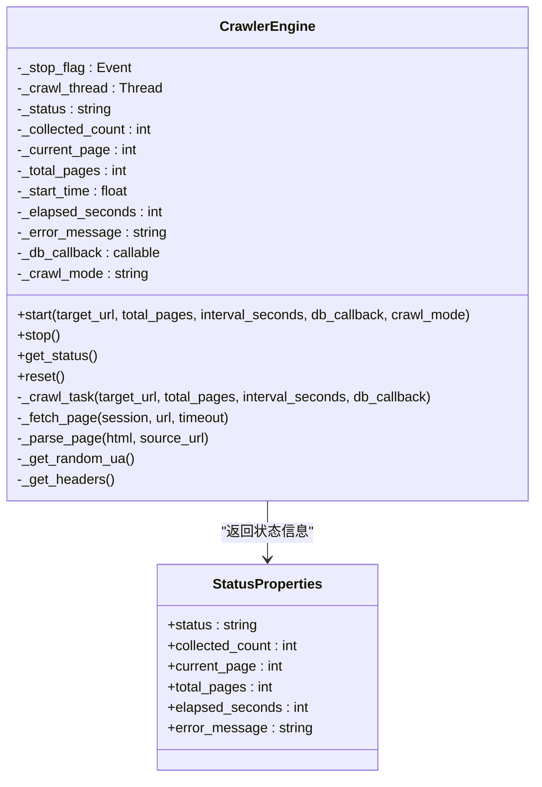
```mermaid
classDiagram
class CrawlerEngine {
-_stop_flag : Event
-_crawl_thread : Thread
-_status : string
-_collected_count : int
-_current_page : int
-_total_pages : int
-_start_time : float
-_elapsed_seconds : int
-_error_message : string
-_db_callback : callable
-_crawl_mode : string
+start(target_url, total_pages, interval_seconds, db_callback, crawl_mode)
+stop()
+get_status()
+reset()
-_crawl_task(target_url, total_pages, interval_seconds, db_callback)
-_fetch_page(session, url, timeout)
-_parse_page(html, source_url)
-_get_random_ua()
-_get_headers()
}
class StatusProperties {
+status : string
+collected_count : int
+current_page : int
+total_pages : int
+elapsed_seconds : int
+error_message : string
}
CrawlerEngine --> StatusProperties : "返回状态信息"
```

**图表来源**
- [crawler_engine.py:10-533](file://python/crawler_engine.py#L10-L533)

### 数据库管理层

系统包含多个数据库操作类，分别处理不同类型的数据存储需求。

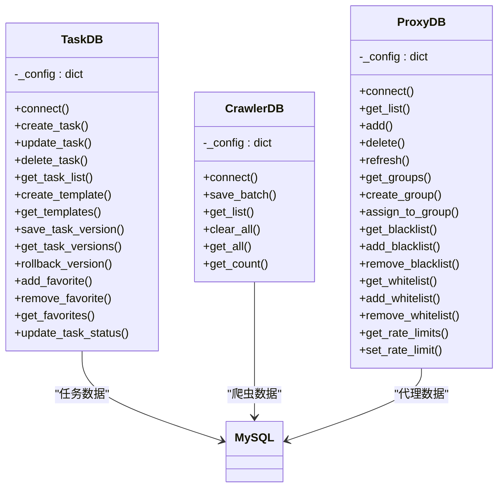
```mermaid
classDiagram
class TaskDB {
-_config : dict
+connect()
+create_task()
+update_task()
+delete_task()
+get_task_list()
+create_template()
+get_templates()
+save_task_version()
+get_task_versions()
+rollback_version()
+add_favorite()
+remove_favorite()
+get_favorites()
+update_task_status()
}
class CrawlerDB {
-_config : dict
+connect()
+save_batch()
+get_list()
+clear_all()
+get_all()
+get_count()
}
class ProxyDB {
-_config : dict
+connect()
+get_list()
+add()
+delete()
+refresh()
+get_groups()
+create_group()
+assign_to_group()
+get_blacklist()
+add_blacklist()
+remove_blacklist()
+get_whitelist()
+add_whitelist()
+remove_whitelist()
+get_rate_limits()
+set_rate_limit()
}
TaskDB --> MySQL : "任务数据"
CrawlerDB --> MySQL : "爬虫数据"
ProxyDB --> MySQL : "代理数据"
```

**图表来源**
- [task_db.py:7-533](file://python/task_db.py#L7-L533)
- [crawler_db.py:6-238](file://python/crawler_db.py#L6-L238)
- [proxy_db.py:6-496](file://python/proxy_db.py#L6-L496)

**章节来源**
- [crawler_engine.py:10-533](file://python/crawler_engine.py#L10-L533)
- [task_db.py:7-533](file://python/task_db.py#L7-L533)
- [crawler_db.py:6-238](file://python/crawler_db.py#L6-L238)

## 任务生命周期管理

### 任务创建流程

任务生命周期从创建开始，经过配置、执行、监控到最终完成或失败。

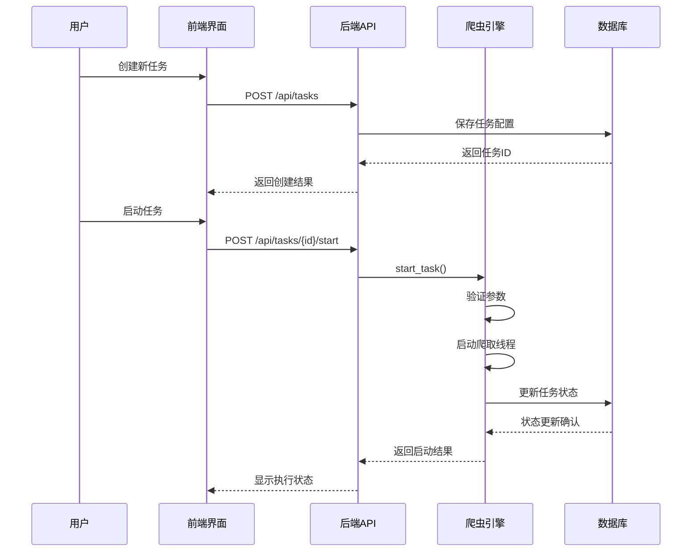
```mermaid
sequenceDiagram
participant User as 用户
participant Frontend as 前端界面
participant Backend as 后端API
participant Engine as 爬虫引擎
participant Database as 数据库
User->>Frontend : 创建新任务
Frontend->>Backend : POST /api/tasks
Backend->>Database : 保存任务配置
Database-->>Backend : 返回任务ID
Backend-->>Frontend : 返回创建结果
User->>Frontend : 启动任务
Frontend->>Backend : POST /api/tasks/{id}/start
Backend->>Engine : start_task()
Engine->>Engine : 验证参数
Engine->>Engine : 启动爬取线程
Engine->>Database : 更新任务状态
Database-->>Engine : 状态更新确认
Engine-->>Backend : 返回启动结果
Backend-->>Frontend : 显示执行状态
```

**图表来源**
- [app.py:513-642](file://python/app.py#L513-L642)
- [crawler_engine.py:464-497](file://python/crawler_engine.py#L464-L497)

### 参数配置管理

系统支持丰富的任务配置选项：

| 配置项 | 类型 | 默认值 | 描述 |
|--------|------|--------|------|
| name | string | 必填 | 任务名称 |
| target_url | string | 必填 | 目标网站URL |
| cron_expr | string | 空字符串 | Cron表达式，用于定时调度 |
| concurrency | int | 1 | 并发执行数 |
| interval_seconds | int | 0 | 请求间隔（秒） |
| retry_count | int | 0 | 重试次数 |
| retry_interval | int | 60 | 重试间隔（秒） |
| proxy_group | string | 空字符串 | 代理组名称 |
| alert_rules | JSON | null | 告警规则配置 |
| config | JSON | null | 任务自定义配置 |

**章节来源**
- [task_db.py:172-204](file://python/task_db.py#L172-L204)
- [app.py:515-545](file://python/app.py#L515-L545)

### 执行调度机制

系统提供灵活的任务调度能力：

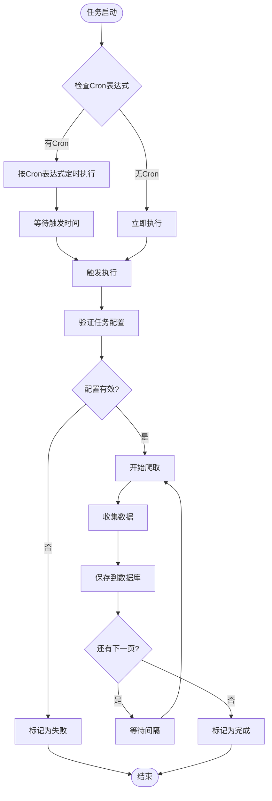
```mermaid
flowchart TD
Start([任务启动]) --> CheckCron{"检查Cron表达式"}
CheckCron --> |有Cron| Schedule["按Cron表达式定时执行"]
CheckCron --> |无Cron| Immediate["立即执行"]
Schedule --> Wait["等待触发时间"]
Wait --> Trigger["触发执行"]
Immediate --> Trigger
Trigger --> Validate["验证任务配置"]
Validate --> Valid{"配置有效?"}
Valid --> |否| Fail["标记为失败"]
Valid --> |是| Execute["开始爬取"]
Execute --> Collect["收集数据"]
Collect --> Save["保存到数据库"]
Save --> NextPage{"还有下一页?"}
NextPage --> |是| Delay["等待间隔"]
Delay --> Execute
NextPage --> |否| Complete["标记为完成"]
Fail --> End([结束])
Complete --> End
```

**图表来源**
- [app.py:625-642](file://python/app.py#L625-L642)
- [crawler_engine.py:400-463](file://python/crawler_engine.py#L400-L463)

### 状态跟踪系统

系统提供完整的状态跟踪机制：

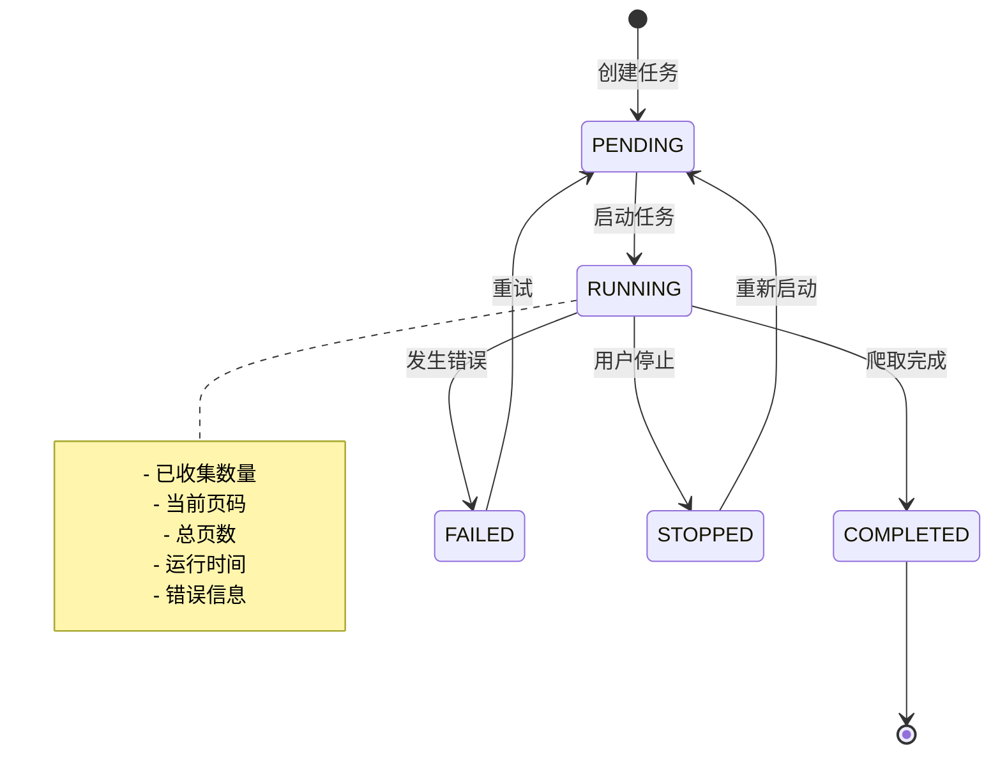
```mermaid
stateDiagram-v2
[*] --> PENDING : 创建任务
PENDING --> RUNNING : 启动任务
RUNNING --> COMPLETED : 爬取完成
RUNNING --> FAILED : 发生错误
RUNNING --> STOPPED : 用户停止
STOPPED --> PENDING : 重新启动
FAILED --> PENDING : 重试
COMPLETED --> [*]
note right of RUNNING
- 已收集数量
- 当前页码
- 总页数
- 运行时间
- 错误信息
end note
```

**图表来源**
- [crawler_engine.py:508-517](file://python/crawler_engine.py#L508-L517)
- [task_db.py:515-530](file://python/task_db.py#L515-L530)

**章节来源**
- [crawler_engine.py:508-530](file://python/crawler_engine.py#L508-L530)
- [task_db.py:515-530](file://python/task_db.py#L515-L530)

## 任务模板系统

### 模板设计模式

任务模板系统允许用户创建可复用的任务配置，提高工作效率。

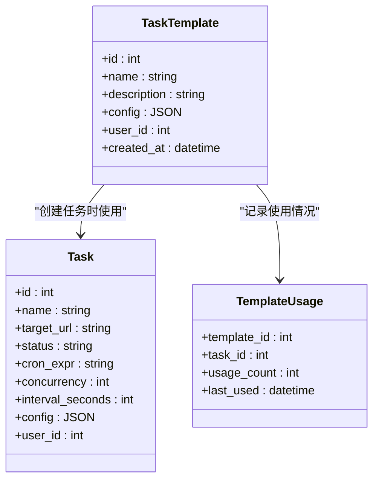
```mermaid
classDiagram
class TaskTemplate {
+id : int
+name : string
+description : string
+config : JSON
+user_id : int
+created_at : datetime
}
class Task {
+id : int
+name : string
+target_url : string
+status : string
+cron_expr : string
+concurrency : int
+interval_seconds : int
+config : JSON
+user_id : int
}
class TemplateUsage {
+template_id : int
+task_id : int
+usage_count : int
+last_used : datetime
}
TaskTemplate --> Task : "创建任务时使用"
TaskTemplate --> TemplateUsage : "记录使用情况"
```

**图表来源**
- [task_db.py:76-86](file://python/task_db.py#L76-L86)
- [task_db.py:305-346](file://python/task_db.py#L305-L346)

### 模板配置选项

模板支持以下配置项：

| 配置项 | 类型 | 描述 |
|--------|------|------|
| name | string | 模板名称 |
| description | string | 模板描述 |
| config | JSON | 模板配置，包含任务的所有可配置参数 |
| user_id | int | 模板所属用户ID |

**章节来源**
- [task_db.py:76-86](file://python/task_db.py#L76-L86)
- [task_db.py:305-346](file://python/task_db.py#L305-L346)

## 定时调度机制

### Cron 表达式支持

系统支持标准的 Cron 表达式进行定时调度：

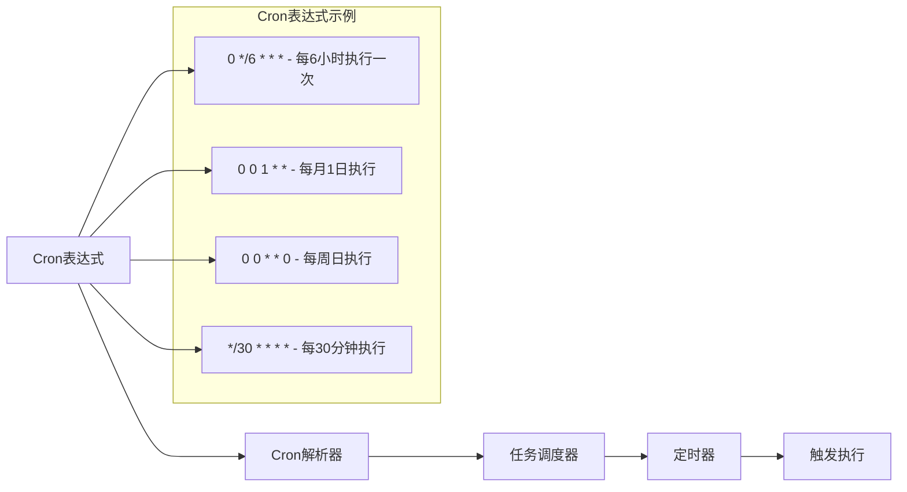
```mermaid
flowchart LR
Cron[Cron表达式] --> Parser[Cron解析器]
Parser --> Scheduler[任务调度器]
Scheduler --> Timer[定时器]
Timer --> Trigger[触发执行]
subgraph "Cron表达式示例"
E1["0 */6 * * * - 每6小时执行一次"]
E2["0 0 1 * * - 每月1日执行"]
E3["0 0 * * 0 - 每周日执行"]
E4["*/30 * * * * - 每30分钟执行"]
end
Cron --> E1
Cron --> E2
Cron --> E3
Cron --> E4
```

**图表来源**
- [app.py:625-642](file://python/app.py#L625-L642)
- [TaskDetail.vue:58-60](file://python-web/src/views/TaskDetail.vue#L58-L60)

### 调度执行流程

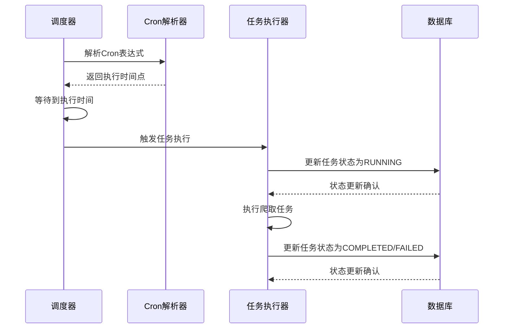
```mermaid
sequenceDiagram
participant Scheduler as 调度器
participant Cron as Cron解析器
participant Task as 任务执行器
participant Database as 数据库
Scheduler->>Cron : 解析Cron表达式
Cron-->>Scheduler : 返回执行时间点
Scheduler->>Scheduler : 等待到执行时间
Scheduler->>Task : 触发任务执行
Task->>Database : 更新任务状态为RUNNING
Database-->>Task : 状态更新确认
Task->>Task : 执行爬取任务
Task->>Database : 更新任务状态为COMPLETED/FAILED
Database-->>Task : 状态更新确认
```

**图表来源**
- [app.py:625-642](file://python/app.py#L625-L642)
- [task_db.py:515-530](file://python/task_db.py#L515-L530)

## 批量执行与并发控制

### 并发执行模型

系统支持多任务并发执行，通过线程池管理任务执行。

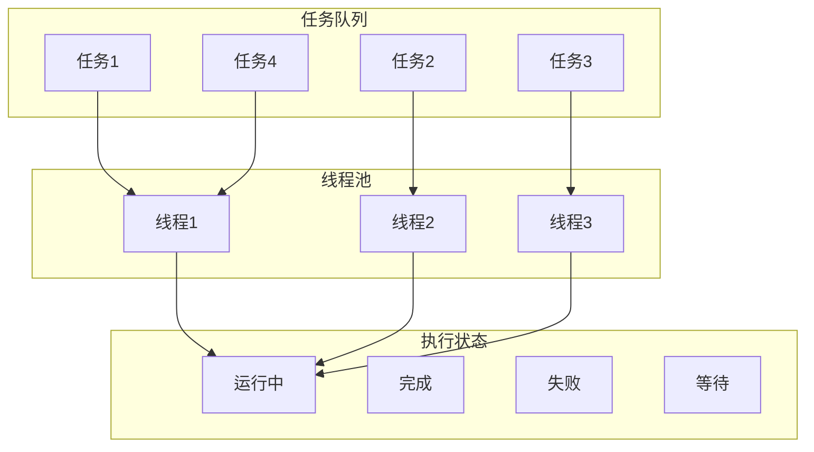
```mermaid
graph TB
subgraph "任务队列"
Q1[任务1]
Q2[任务2]
Q3[任务3]
Q4[任务4]
end
subgraph "线程池"
T1[线程1]
T2[线程2]
T3[线程3]
end
subgraph "执行状态"
S1[运行中]
S2[完成]
S3[失败]
S4[等待]
end
Q1 --> T1
Q2 --> T2
Q3 --> T3
Q4 --> T1
T1 --> S1
T2 --> S1
T3 --> S1
```

**图表来源**
- [crawler_engine.py:491-496](file://python/crawler_engine.py#L491-L496)
- [app.py:625-642](file://python/app.py#L625-L642)

### 并发控制策略

系统提供多种并发控制机制：

| 控制项 | 默认值 | 作用 |
|--------|--------|------|
| concurrency | 1 | 全局并发数限制 |
| interval_seconds | 0 | 请求间隔（秒） |
| retry_count | 0 | 自动重试次数 |
| retry_interval | 60 | 重试间隔（秒） |

**章节来源**
- [app.py:625-642](file://python/app.py#L625-L642)
- [crawler_engine.py:464-497](file://python/crawler_engine.py#L464-L497)

## 错误恢复机制

### 错误处理策略

系统实现了多层次的错误处理和恢复机制：

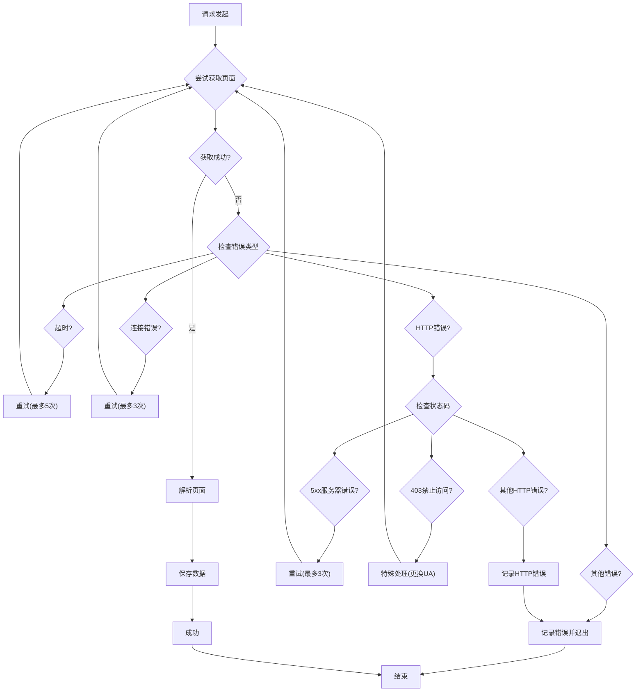
```mermaid
flowchart TD
Request[请求发起] --> TryFetch{尝试获取页面}
TryFetch --> FetchSuccess{获取成功?}
FetchSuccess --> |是| Parse[解析页面]
FetchSuccess --> |否| CheckError{检查错误类型}
CheckError --> Timeout{超时?}
CheckError --> Connection{连接错误?}
CheckError --> HTTPError{HTTP错误?}
CheckError --> Other{其他错误?}
Timeout --> RetryTimeout["重试(最多5次)"]
Connection --> RetryConn["重试(最多3次)"]
HTTPError --> CheckStatus{检查状态码}
Other --> LogError["记录错误并退出"]
CheckStatus --> ServerError{5xx服务器错误?}
CheckStatus --> Forbidden{403禁止访问?}
CheckStatus --> OtherHTTP{其他HTTP错误?}
ServerError --> RetryServer["重试(最多3次)"]
Forbidden --> Handle403["特殊处理(更换UA)"]
OtherHTTP --> LogHTTP["记录HTTP错误"]
RetryTimeout --> TryFetch
RetryConn --> TryFetch
RetryServer --> TryFetch
Handle403 --> TryFetch
LogHTTP --> LogError
LogError --> End[结束]
Parse --> SaveData[保存数据]
SaveData --> Success[成功]
Success --> End
```

**图表来源**
- [crawler_engine.py:113-169](file://python/crawler_engine.py#L113-L169)

### 重试机制

系统实现了智能的重试机制：

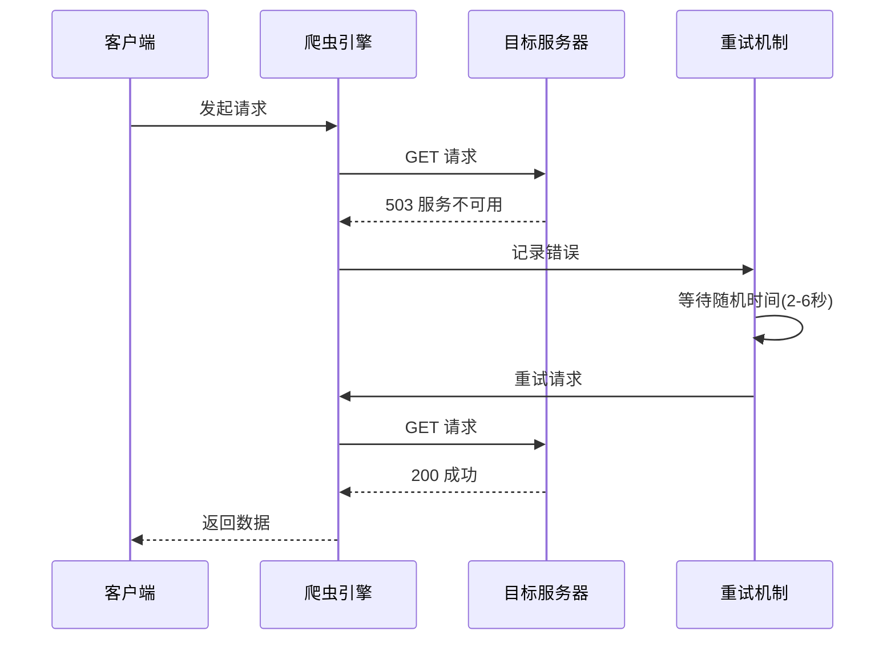
```mermaid
sequenceDiagram
participant Client as 客户端
participant Engine as 爬虫引擎
participant Server as 目标服务器
participant Retry as 重试机制
Client->>Engine : 发起请求
Engine->>Server : GET 请求
Server-->>Engine : 503 服务不可用
Engine->>Retry : 记录错误
Retry->>Retry : 等待随机时间(2-6秒)
Retry->>Engine : 重试请求
Engine->>Server : GET 请求
Server-->>Engine : 200 成功
Engine-->>Client : 返回数据
```

**图表来源**
- [crawler_engine.py:152-161](file://python/crawler_engine.py#L152-L161)

**章节来源**
- [crawler_engine.py:113-169](file://python/crawler_engine.py#L113-L169)

## 数据库交互模式

### 数据库连接管理

系统采用连接池模式管理数据库连接，确保高效的数据访问。

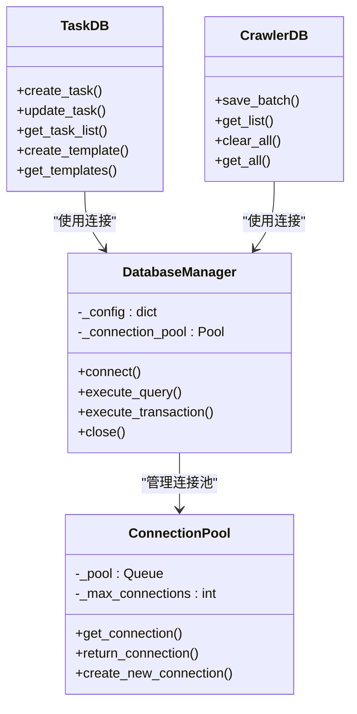
```mermaid
classDiagram
class DatabaseManager {
-_config : dict
-_connection_pool : Pool
+connect()
+execute_query()
+execute_transaction()
+close()
}
class ConnectionPool {
-_pool : Queue
-_max_connections : int
+get_connection()
+return_connection()
+create_new_connection()
}
class TaskDB {
+create_task()
+update_task()
+get_task_list()
+create_template()
+get_templates()
}
class CrawlerDB {
+save_batch()
+get_list()
+clear_all()
+get_all()
}
DatabaseManager --> ConnectionPool : "管理连接池"
TaskDB --> DatabaseManager : "使用连接"
CrawlerDB --> DatabaseManager : "使用连接"
```

**图表来源**
- [task_db.py:13-30](file://python/task_db.py#L13-L30)
- [crawler_db.py:12-30](file://python/crawler_db.py#L12-L30)

### 数据表结构设计

系统使用 MySQL 存储不同类型的数据：

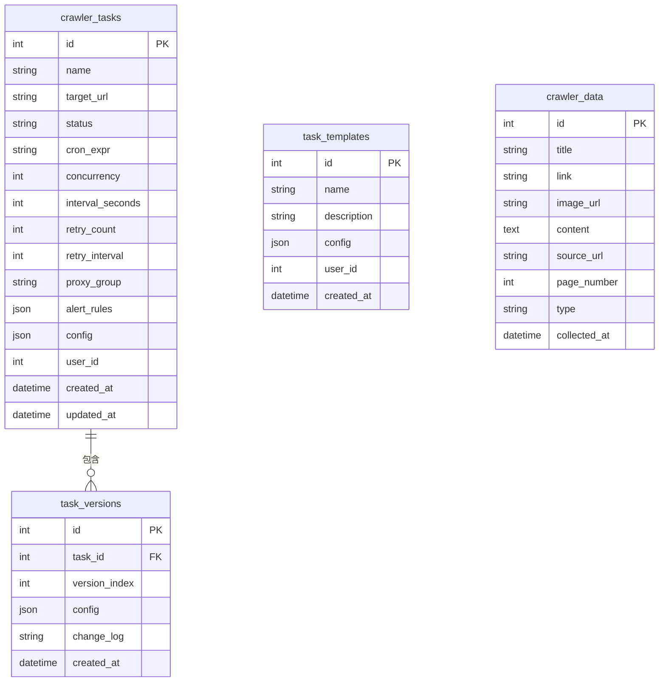
```mermaid
erDiagram
crawler_tasks {
int id PK
string name
string target_url
string status
string cron_expr
int concurrency
int interval_seconds
int retry_count
int retry_interval
string proxy_group
json alert_rules
json config
int user_id
datetime created_at
datetime updated_at
}
task_templates {
int id PK
string name
string description
json config
int user_id
datetime created_at
}
task_versions {
int id PK
int task_id FK
int version_index
json config
string change_log
datetime created_at
}
crawler_data {
int id PK
string title
string link
string image_url
text content
string source_url
int page_number
string type
datetime collected_at
}
crawler_tasks ||--o{ task_versions : "包含"
```

**图表来源**
- [task_db.py:52-111](file://python/task_db.py#L52-L111)
- [crawler_db.py:54-81](file://python/crawler_db.py#L54-L81)

**章节来源**
- [task_db.py:52-111](file://python/task_db.py#L52-L111)
- [crawler_db.py:54-81](file://python/crawler_db.py#L54-L81)

## API 接口定义

### 爬虫引擎 API

系统提供了完整的爬虫引擎控制接口：

| 接口 | 方法 | 路径 | 功能描述 |
|------|------|------|----------|
| 启动爬虫 | POST | `/api/crawler/start` | 启动爬虫任务 |
| 停止爬虫 | POST | `/api/crawler/stop` | 停止爬虫任务 |
| 获取状态 | GET | `/api/crawler/status` | 获取爬虫运行状态 |
| 查询数据 | GET | `/api/crawler/data` | 分页查询爬取数据 |
| 清空数据 | DELETE | `/api/crawler/data` | 清空所有爬取数据 |
| 导出数据 | GET | `/api/crawler/export` | 导出爬取数据为CSV |

### 任务管理 API

任务管理相关的 API 接口：

| 接口 | 方法 | 路径 | 功能描述 |
|------|------|------|----------|
| 获取任务列表 | GET | `/api/tasks` | 获取任务列表 |
| 创建任务 | POST | `/api/tasks` | 创建新任务 |
| 获取任务详情 | GET | `/api/tasks/:id` | 获取任务详细信息 |
| 更新任务 | PUT | `/api/tasks/:id` | 更新任务配置 |
| 删除任务 | DELETE | `/api/tasks/:id` | 删除任务 |
| 启动任务 | POST | `/api/tasks/:id/start` | 启动任务执行 |
| 停止任务 | POST | `/api/tasks/:id/stop` | 停止任务执行 |
| 获取模板列表 | GET | `/api/tasks/templates` | 获取模板列表 |
| 创建模板 | POST | `/api/tasks/templates` | 创建任务模板 |
| 获取模板详情 | GET | `/api/tasks/templates/:id` | 获取模板详细信息 |
| 删除模板 | DELETE | `/api/tasks/templates/:id` | 删除任务模板 |
| 获取版本列表 | GET | `/api/tasks/:id/versions` | 获取任务版本列表 |
| 版本回滚 | POST | `/api/tasks/:id/versions/:version/rollback` | 回滚到指定版本 |
| 获取收藏列表 | GET | `/api/tasks/favorites` | 获取收藏的任务列表 |
| 添加收藏 | POST | `/api/tasks/:id/favorite` | 添加任务到收藏 |
| 取消收藏 | DELETE | `/api/tasks/:id/favorite` | 从收藏中移除任务 |

### 数据管理 API

数据管理相关的 API 接口：

| 接口 | 方法 | 路径 | 功能描述 |
|------|------|------|----------|
| 数据预览 | GET | `/api/data/preview` | 获取数据预览 |
| 数据清洗 | POST | `/api/data/clean` | 清洗和处理数据 |
| 数据导出 | GET | `/api/data/export` | 导出数据 |
| 自动写入配置 | POST | `/api/data/auto-write-config` | 保存自动写入配置 |
| 推送配置 | POST | `/api/data/push-config` | 保存推送配置 |

**章节来源**
- [app.py:306-465](file://python/app.py#L306-L465)
- [app.py:475-796](file://python/app.py#L475-L796)
- [app.py:1044-1243](file://python/app.py#L1044-L1243)

## 性能优化建议

### 爬取性能优化

1. **并发控制优化**
   - 根据目标网站的限流策略调整并发数
   - 实施动态并发调节机制
   - 使用连接池减少连接开销

2. **网络请求优化**
   - 实施智能重试策略
   - 使用请求头轮换降低被封禁风险
   - 实现请求延迟控制

3. **内存管理优化**
   - 实施分批处理机制
   - 使用生成器减少内存占用
   - 定期清理临时数据

### 数据库性能优化

1. **索引优化**
   - 为常用查询字段建立索引
   - 优化复合查询条件
   - 定期分析查询性能

2. **连接池优化**
   - 合理配置连接池大小
   - 实施连接超时机制
   - 监控连接池使用率

### 前端性能优化

1. **数据加载优化**
   - 实施虚拟滚动
   - 使用分页加载
   - 实现数据缓存机制

2. **界面响应优化**
   - 实施防抖和节流
   - 使用异步加载
   - 优化渲染性能

## 故障排除指南

### 常见问题诊断

| 问题类型 | 症状 | 可能原因 | 解决方案 |
|----------|------|----------|----------|
| 爬取失败 | 状态显示FAILED | 网络连接问题 | 检查网络连接，增加重试次数 |
| 数据缺失 | 收集数量为0 | 解析规则错误 | 检查页面结构变化，更新解析规则 |
| 性能问题 | 执行缓慢 | 并发过高 | 降低并发数，增加请求间隔 |
| 内存泄漏 | 内存持续增长 | 资源未释放 | 检查线程和连接管理，实施资源回收 |

### 错误日志分析

系统提供了详细的错误日志记录：

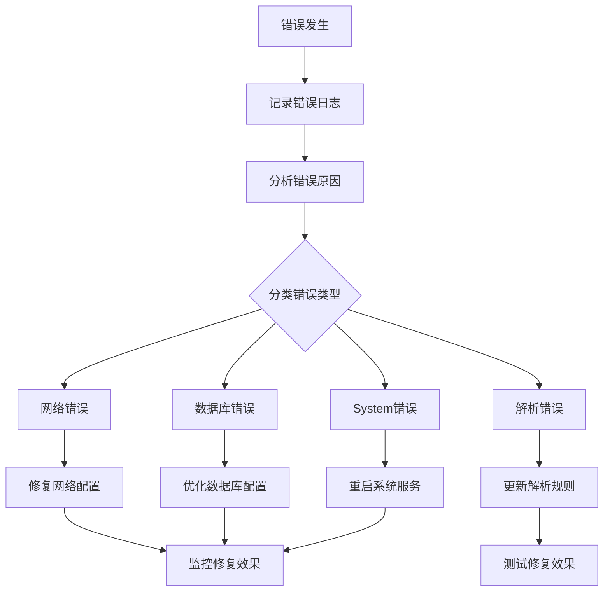
```mermaid
flowchart TD
Error[错误发生] --> Log[记录错误日志]
Log --> Analyze[分析错误原因]
Analyze --> Category{分类错误类型}
Category --> Network[网络错误]
Category --> Parse[解析错误]
Category --> Database[数据库错误]
Category --> System[System错误]
Network --> FixNetwork[修复网络配置]
Parse --> UpdateRules[更新解析规则]
Database --> OptimizeDB[优化数据库配置]
System --> RestartSystem[重启系统服务]
FixNetwork --> Monitor[监控修复效果]
UpdateRules --> Test[测试修复效果]
OptimizeDB --> Monitor
RestartSystem --> Monitor
```

**图表来源**
- [crawler_engine.py:425-429](file://python/crawler_engine.py#L425-L429)

### 调试工具使用

1. **状态监控**
   - 使用 `/api/crawler/status` 接口查看实时状态
   - 监控任务执行进度和错误信息
   - 分析性能指标和资源使用情况

2. **日志分析**
   - 查看系统日志了解错误详情
   - 分析爬取日志定位问题
   - 监控数据库操作日志

**章节来源**
- [crawler_engine.py:425-429](file://python/crawler_engine.py#L425-L429)

## 总结

爬虫任务管理系统是一个功能完整、架构清晰的分布式爬虫平台。系统的主要特点包括：

### 核心优势

1. **完整的生命周期管理**：从任务创建到执行监控，提供全链路管理
2. **灵活的配置系统**：支持多种配置选项和模板复用
3. **强大的错误处理**：多层次的错误恢复和重试机制
4. **高效的并发执行**：支持多任务并发和智能调度
5. **完善的监控体系**：实时状态跟踪和性能监控

### 技术特色

1. **模块化设计**：清晰的组件分离和职责划分
2. **数据库抽象**：统一的数据库访问层设计
3. **前后端分离**：现代化的开发架构
4. **RESTful API**：标准化的接口设计
5. **状态管理**：完善的任务状态跟踪机制

### 应用场景

该系统适用于各种爬虫应用场景：
- 数据采集和分析
- 竞品监控
- 内容聚合
- 市场研究
- SEO监控

系统具有良好的扩展性和维护性，能够满足不同规模和复杂度的爬虫任务需求。