# 爬虫引擎架构

<cite>
**本文档引用的文件**
- [crawler_engine.py](file://python/crawler_engine.py)
- [app.py](file://python/app.py)
- [crawler_db.py](file://python/crawler_db.py)
- [task_db.py](file://python/task_db.py)
- [proxy_db.py](file://python/proxy_db.py)
- [system_db.py](file://python/system_db.py)
- [alert_db.py](file://python/alert_db.py)
- [requirements.txt](file://python/requirements.txt)
</cite>

## 目录
1. [简介](#简介)
2. [项目结构](#项目结构)
3. [核心组件](#核心组件)
4. [架构概览](#架构概览)
5. [详细组件分析](#详细组件分析)
6. [依赖关系分析](#依赖关系分析)
7. [性能考虑](#性能考虑)
8. [故障排除指南](#故障排除指南)
9. [结论](#结论)

## 简介

这是一个基于Python开发的通用爬虫引擎系统，采用Flask框架构建RESTful API服务。该系统实现了多线程并发爬取、智能反爬虫应对策略、任务调度管理和数据持久化存储等功能。系统支持多种爬取模式（链接模式、图片模式、混合模式），具备完善的错误处理和状态管理机制。

## 项目结构

项目采用模块化设计，主要分为以下几个层次：

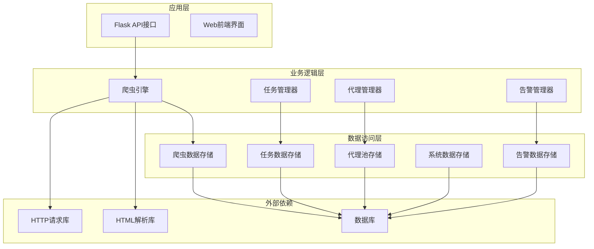

**图表来源**
- [app.py:1-800](file://python/app.py#L1-L800)
- [crawler_engine.py:1-533](file://python/crawler_engine.py#L1-L533)

**章节来源**
- [app.py:1-800](file://python/app.py#L1-L800)
- [requirements.txt:1-14](file://python/requirements.txt#L1-L14)

## 核心组件

### 爬虫引擎核心架构

爬虫引擎采用面向对象设计，主要包含以下核心组件：

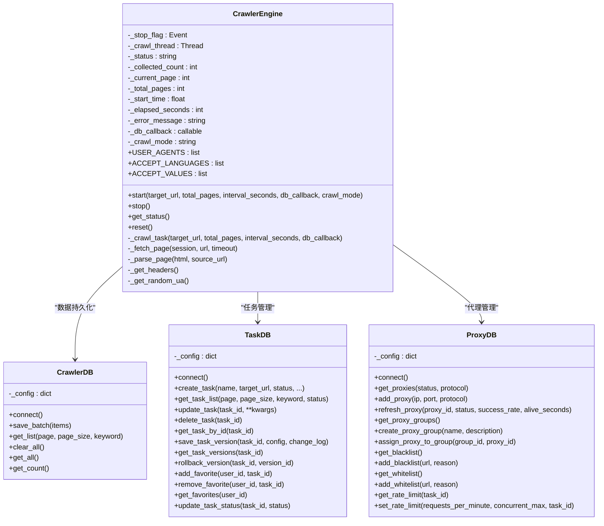

**图表来源**
- [crawler_engine.py:10-533](file://python/crawler_engine.py#L10-L533)
- [crawler_db.py:6-238](file://python/crawler_db.py#L6-L238)
- [task_db.py:7-533](file://python/task_db.py#L7-L533)
- [proxy_db.py:6-528](file://python/proxy_db.py#L6-L528)

### 多线程并发模型

系统采用单线程爬取策略，每个爬虫实例运行在独立的线程中：

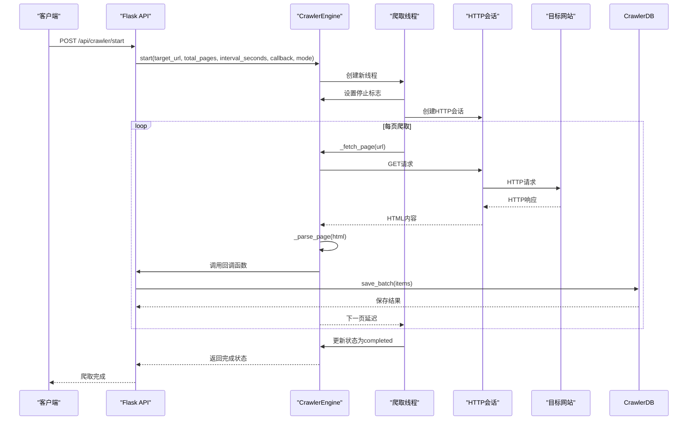

**图表来源**
- [crawler_engine.py:400-463](file://python/crawler_engine.py#L400-L463)
- [app.py:306-351](file://python/app.py#L306-L351)

**章节来源**
- [crawler_engine.py:464-533](file://python/crawler_engine.py#L464-L533)
- [app.py:306-351](file://python/app.py#L306-L351)

## 架构概览

### 系统整体架构

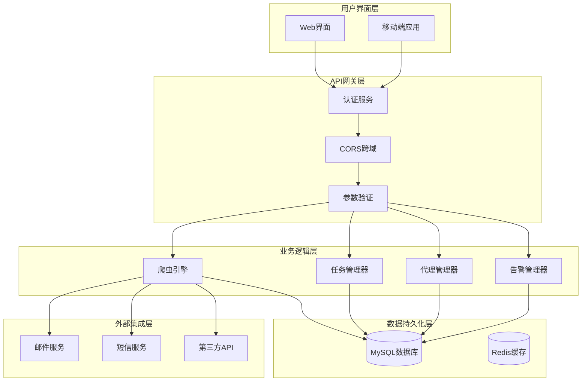

**图表来源**
- [app.py:1-800](file://python/app.py#L1-L800)
- [crawler_engine.py:10-533](file://python/crawler_engine.py#L10-L533)

### 数据流架构

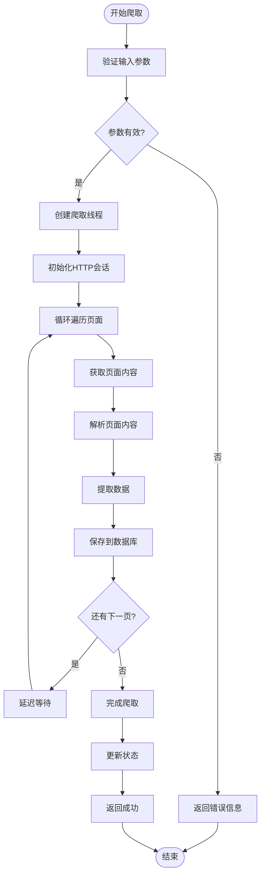

**图表来源**
- [crawler_engine.py:400-463](file://python/crawler_engine.py#L400-L463)
- [crawler_db.py:96-139](file://python/crawler_db.py#L96-L139)

## 详细组件分析

### 爬虫引擎核心实现

#### 反爬虫应对策略

系统实现了多层次的反检测机制：

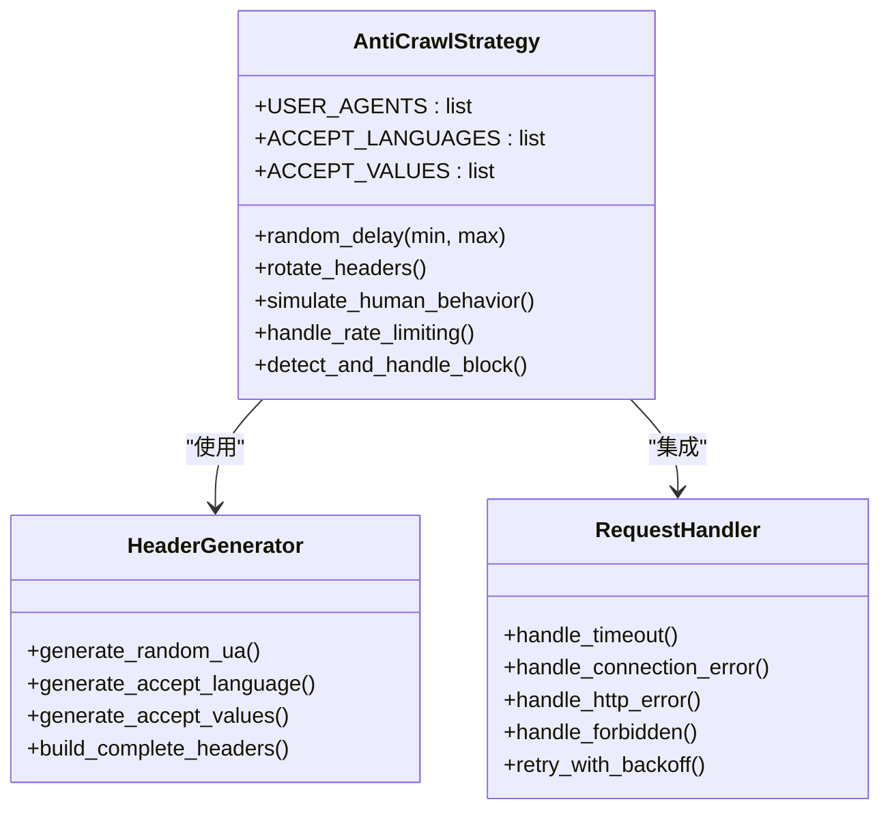

**图表来源**
- [crawler_engine.py:25-49](file://python/crawler_engine.py#L25-L49)
- [crawler_engine.py:90-111](file://python/crawler_engine.py#L90-L111)
- [crawler_engine.py:113-169](file://python/crawler_engine.py#L113-L169)

#### 请求池管理机制

虽然当前实现使用单会话连接，但系统设计支持扩展到多会话管理：

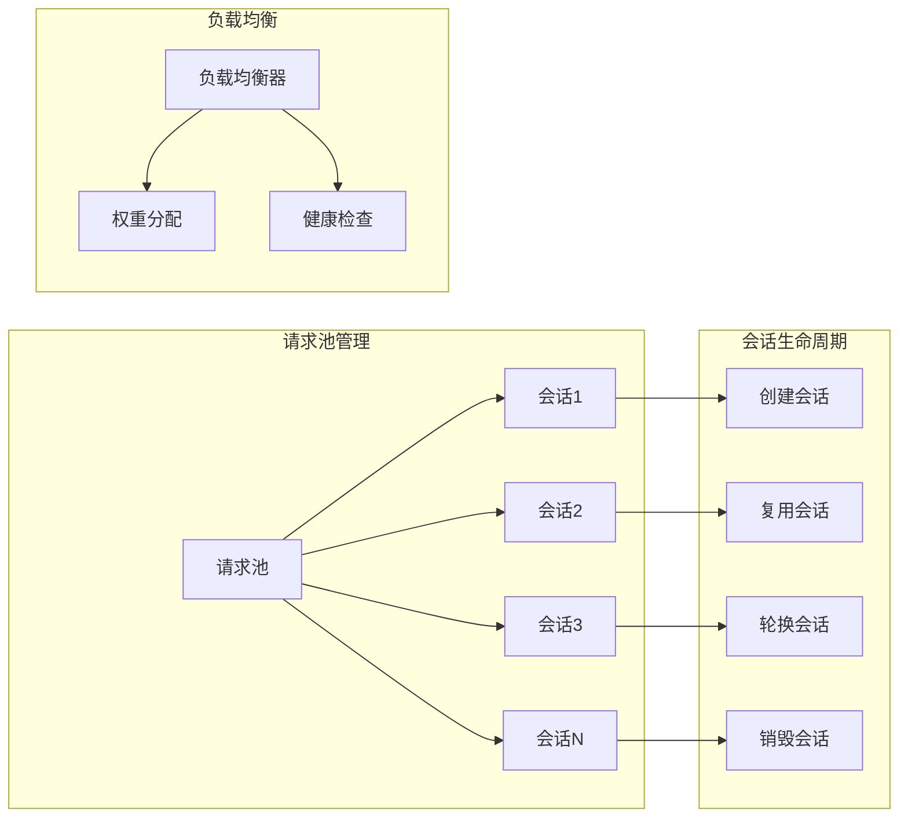

**图表来源**
- [crawler_engine.py:412-412](file://python/crawler_engine.py#L412-L412)
- [crawler_engine.py:113-169](file://python/crawler_engine.py#L113-L169)

### 数据库层设计

#### 爬虫数据存储

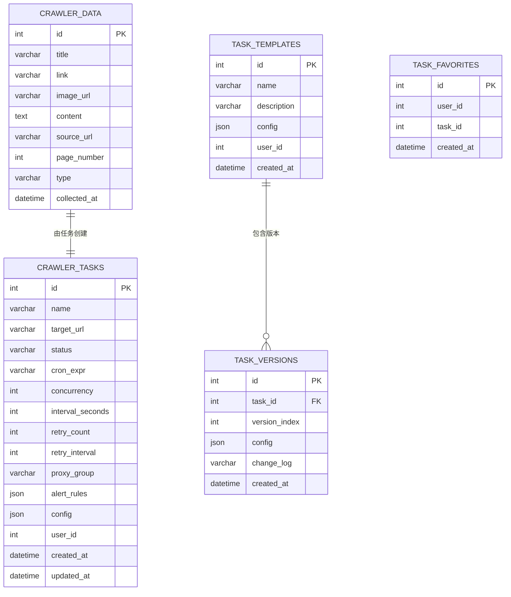

**图表来源**
- [crawler_db.py:54-81](file://python/crawler_db.py#L54-L81)
- [task_db.py:52-111](file://python/task_db.py#L52-L111)

#### 代理池管理

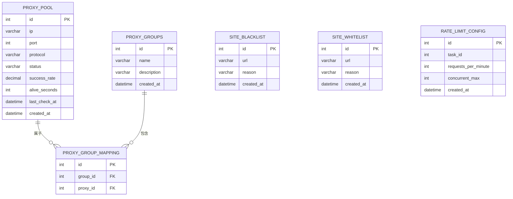

**图表来源**
- [proxy_db.py:50-120](file://python/proxy_db.py#L50-L120)

### API接口设计

#### 爬虫管理API

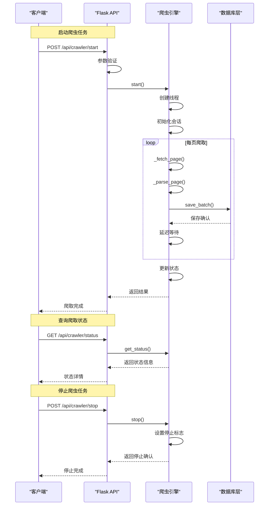

**图表来源**
- [app.py:306-380](file://python/app.py#L306-L380)
- [crawler_engine.py:464-517](file://python/crawler_engine.py#L464-L517)

**章节来源**
- [app.py:306-466](file://python/app.py#L306-L466)
- [crawler_engine.py:10-533](file://python/crawler_engine.py#L10-L533)

## 依赖关系分析

### 外部依赖管理

系统使用requirements.txt统一管理依赖：

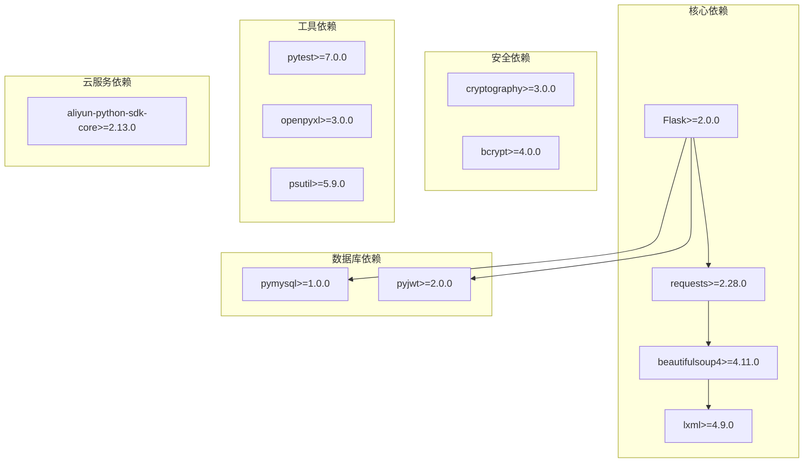

**图表来源**
- [requirements.txt:1-14](file://python/requirements.txt#L1-L14)

### 内部模块依赖

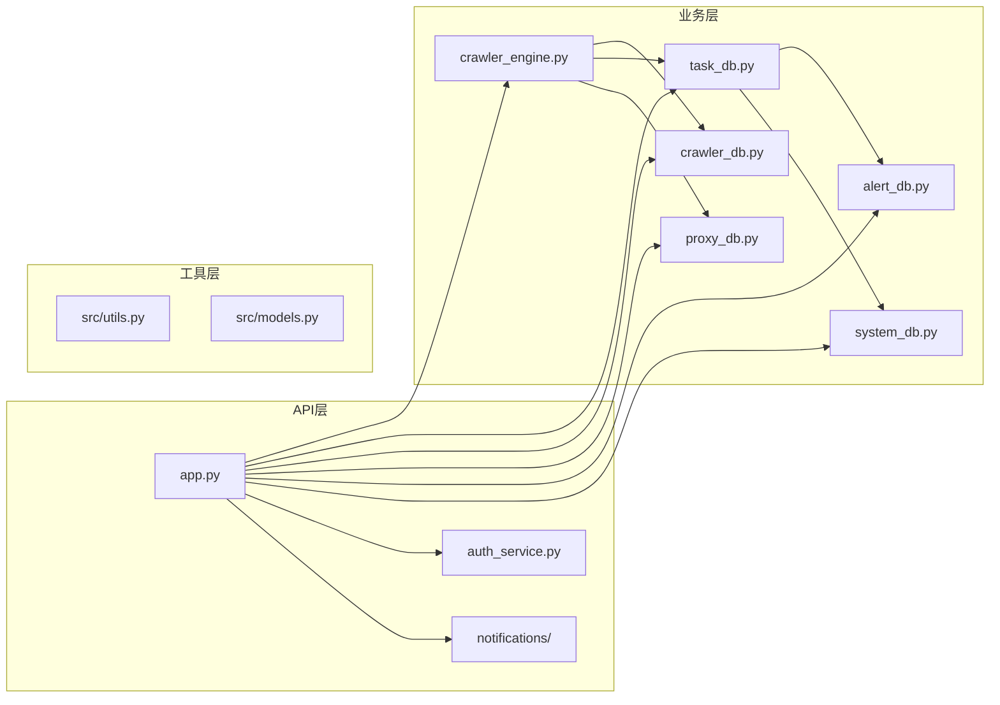

**图表来源**
- [app.py:1-12](file://python/app.py#L1-L12)
- [crawler_engine.py:1-8](file://python/crawler_engine.py#L1-L8)

**章节来源**
- [requirements.txt:1-14](file://python/requirements.txt#L1-L14)
- [app.py:1-12](file://python/app.py#L1-L12)

## 性能考虑

### 并发与资源管理

系统当前采用单线程爬取策略，主要考虑因素：

1. **内存管理**: 每个爬取任务在独立线程中运行，避免内存泄漏
2. **网络资源**: 使用requests.Session复用TCP连接，减少连接开销
3. **CPU使用**: 通过随机延迟和退避机制避免过度占用CPU
4. **数据库连接**: 每个数据库操作独立建立连接，避免连接池复杂性

### 优化建议

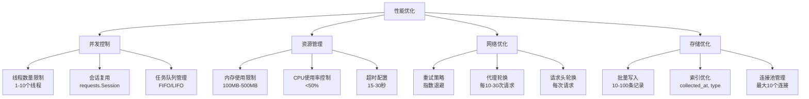

### 错误处理与恢复

系统实现了完整的错误处理机制：

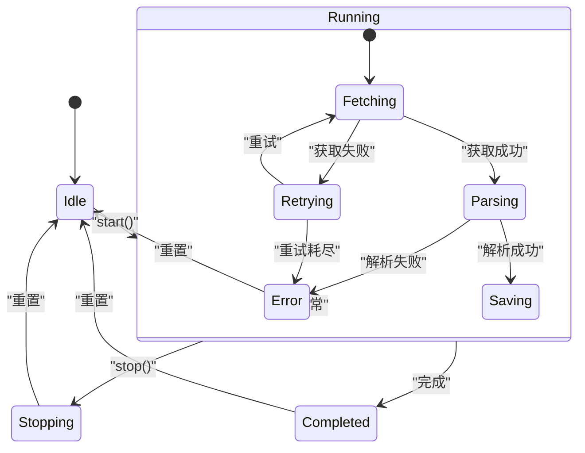

**图表来源**
- [crawler_engine.py:508-530](file://python/crawler_engine.py#L508-L530)

**章节来源**
- [crawler_engine.py:113-169](file://python/crawler_engine.py#L113-L169)
- [crawler_engine.py:400-463](file://python/crawler_engine.py#L400-L463)

## 故障排除指南

### 常见问题诊断

#### 爬取失败排查

1. **HTTP错误处理**
   - 403 Forbidden: 检查User-Agent和请求头配置
   - 5xx服务器错误: 实施指数退避重试
   - 超时错误: 增加超时时间和重试次数

2. **解析失败排查**
   - 检查HTML结构变化
   - 验证BeautifulSoup解析器版本
   - 确认编码识别正确性

3. **数据库连接问题**
   - 验证MySQL服务状态
   - 检查连接参数配置
   - 监控连接池使用情况

#### 性能问题诊断

1. **内存泄漏检测**
   - 监控线程数量
   - 检查会话对象生命周期
   - 验证数据库连接关闭

2. **网络性能优化**
   - 分析DNS解析时间
   - 监控TCP连接建立时间
   - 评估代理响应延迟

3. **数据库性能优化**
   - 分析SQL执行计划
   - 检查索引使用情况
   - 监控慢查询日志

### 调试工具和方法

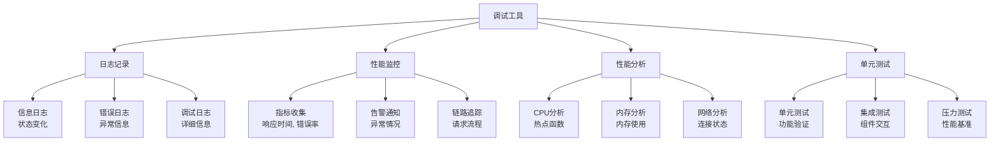

**章节来源**
- [crawler_engine.py:113-169](file://python/crawler_engine.py#L113-L169)
- [system_db.py:99-182](file://python/system_db.py#L99-L182)

## 结论

该爬虫引擎系统采用了模块化设计，实现了完整的爬取生命周期管理。系统的主要优势包括：

1. **架构清晰**: 采用分层设计，职责分离明确
2. **扩展性强**: 支持代理池、任务调度、告警管理等扩展功能
3. **稳定性高**: 完善的错误处理和状态管理机制
4. **性能优化**: 多层次的反爬虫策略和资源管理

### 改进建议

1. **并发扩展**: 从单线程扩展到多线程/多进程模式
2. **代理池优化**: 实现动态代理选择和健康检查
3. **任务调度**: 集成定时任务和分布式调度
4. **监控告警**: 增强实时监控和告警通知机制
5. **缓存策略**: 引入Redis缓存提高数据访问性能

该系统为后续的功能扩展和性能优化奠定了良好的基础，能够满足大多数爬虫应用场景的需求。