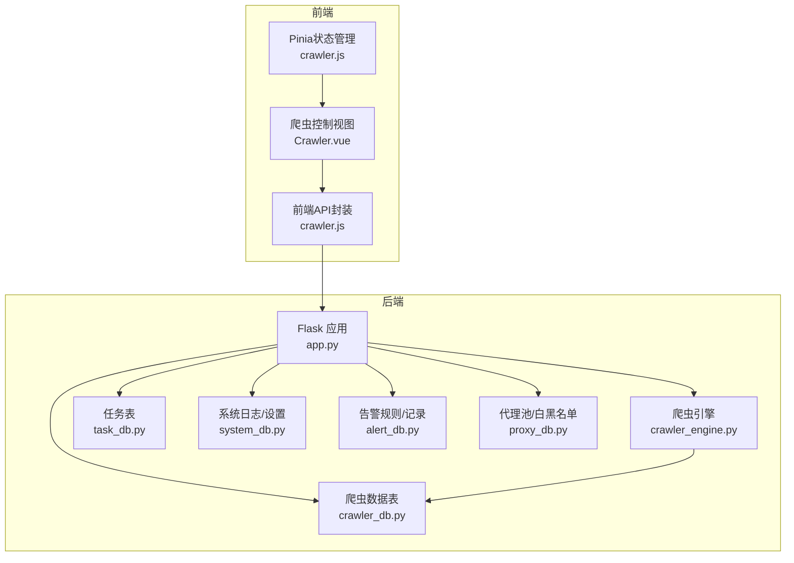
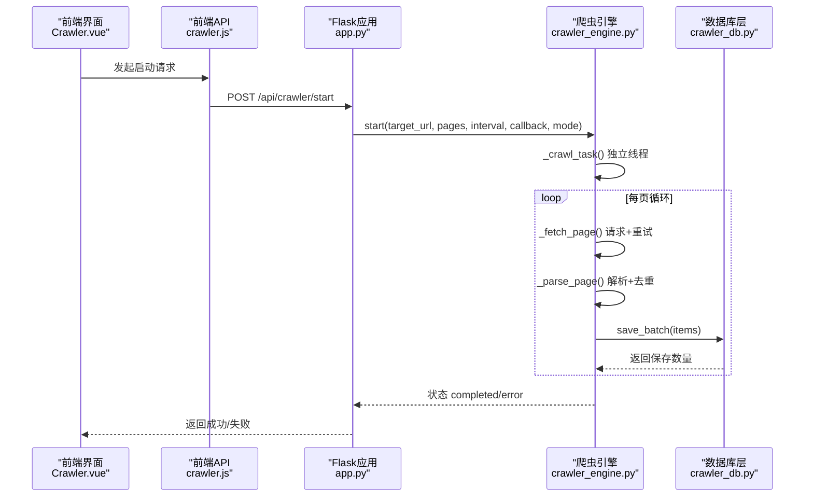
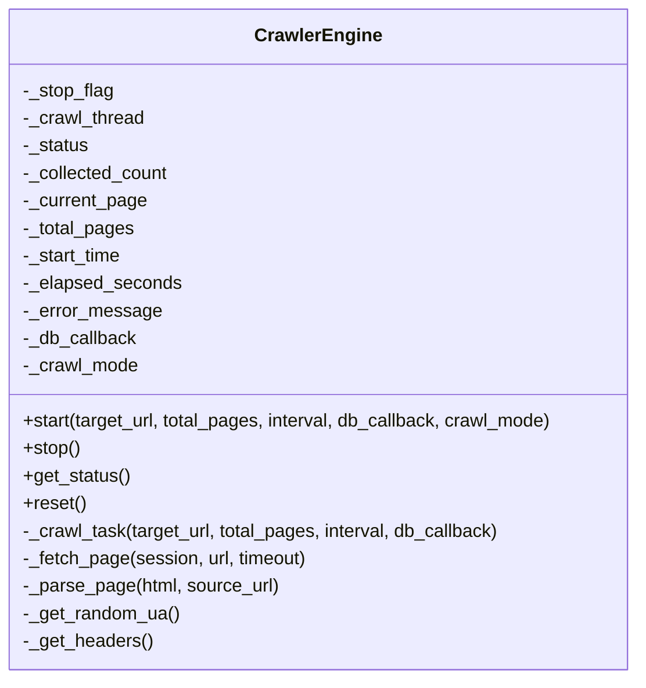
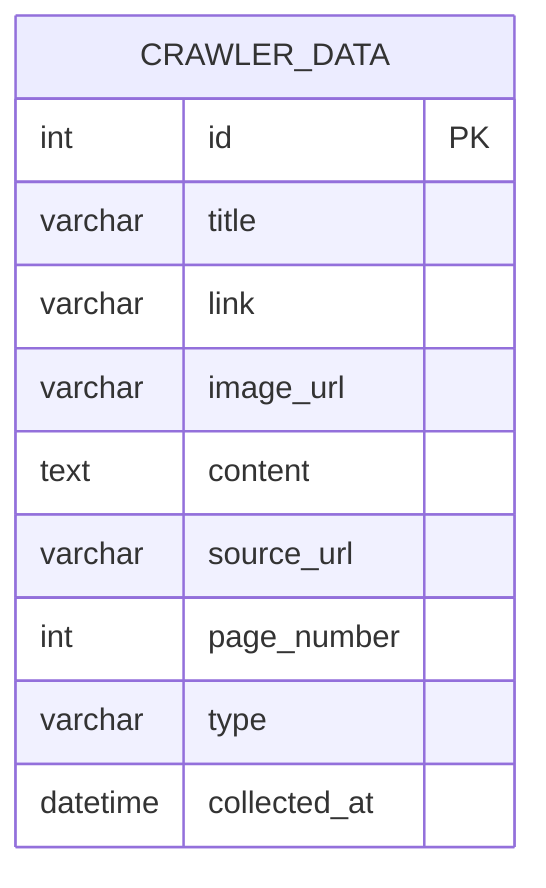
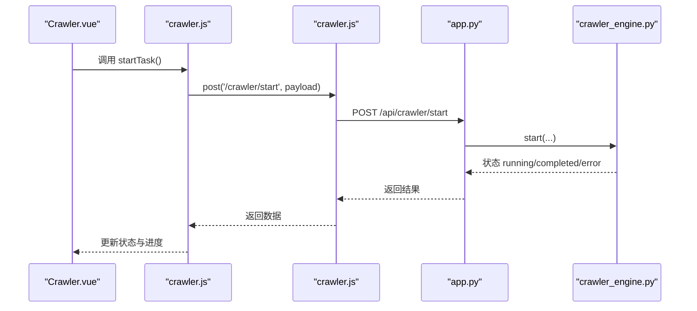
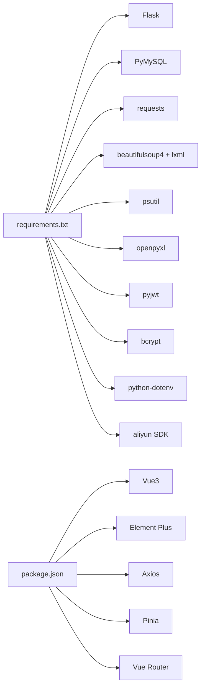

# 爬虫数据采集

<cite>
**本文引用的文件**
- [crawler_engine.py](file://python/crawler_engine.py)
- [crawler_db.py](file://python/crawler_db.py)
- [task_db.py](file://python/task_db.py)
- [app.py](file://python/app.py)
- [system_db.py](file://python/system_db.py)
- [alert_db.py](file://python/alert_db.py)
- [proxy_db.py](file://python/proxy_db.py)
- [requirements.txt](file://python/requirements.txt)
- [crawler.js](file://python-web/src/api/crawler.js)
- [crawler.vue](file://python-web/src/views/Crawler.vue)
- [crawler.js](file://python-web/src/stores/crawler.js)
</cite>

## 目录
1. [简介](#简介)
2. [项目结构](#项目结构)
3. [核心组件](#核心组件)
4. [架构总览](#架构总览)
5. [详细组件分析](#详细组件分析)
6. [依赖关系分析](#依赖关系分析)
7. [性能考虑](#性能考虑)
8. [故障排查指南](#故障排查指南)
9. [结论](#结论)
10. [附录](#附录)

## 简介
本项目是一个基于 Python 的爬虫数据采集系统，提供通用爬虫引擎、多线程并发控制、反爬虫策略、数据存储与导出、以及配套的 Web 管理界面。系统采用 Flask 提供 REST API，Vue3 + Element Plus 构建前端界面，PyMySQL 访问 MySQL 数据库，支持链接与图片两类数据采集模式，并提供任务管理、告警、代理池与速率限制等高级功能。

## 项目结构
系统分为三层：
- 后端服务层：Flask 应用，提供爬虫控制、任务管理、系统监控、告警、代理池等 API
- 爬虫引擎层：通用爬虫引擎，负责请求、解析、去重、存储回调
- 前端展示层：Vue3 + Element Plus，提供爬虫控制台、数据列表、任务管理等界面

图表来源
- [app.py](file://python/app.py)
- [crawler_engine.py](file://python/crawler_engine.py)
- [crawler_db.py](file://python/crawler_db.py)
- [task_db.py](file://python/task_db.py)
- [system_db.py](file://python/system_db.py)
- [alert_db.py](file://python/alert_db.py)
- [proxy_db.py](file://python/proxy_db.py)
- [crawler.js](file://python-web/src/api/crawler.js)
- [crawler.vue](file://python-web/src/views/Crawler.vue)
- [crawler.js](file://python-web/src/stores/crawler.js)

章节来源
- [app.py](file://python/app.py)
- [crawler_engine.py](file://python/crawler_engine.py)
- [crawler_db.py](file://python/crawler_db.py)
- [task_db.py](file://python/task_db.py)
- [system_db.py](file://python/system_db.py)
- [alert_db.py](file://python/alert_db.py)
- [proxy_db.py](file://python/proxy_db.py)
- [crawler.js](file://python-web/src/api/crawler.js)
- [crawler.vue](file://python-web/src/views/Crawler.vue)
- [crawler.js](file://python-web/src/stores/crawler.js)

## 核心组件
- 爬虫引擎：多线程并发、UA/语言/Accept 随机化、请求延时、403/超时/5xx 重试、页面解析（链接/图片/混合）、去重、状态管理
- 数据库层：爬虫数据表、任务表、系统日志/设置、告警规则/记录、代理池/分组/白黑名单、速率限制
- API 层：Flask 路由，提供爬虫启动/停止/状态、数据查询/清空/导出、任务管理、告警、代理池等接口
- 前端层：控制台界面、状态轮询、数据表格、分页搜索、导出下载

章节来源
- [crawler_engine.py](file://python/crawler_engine.py)
- [crawler_db.py](file://python/crawler_db.py)
- [task_db.py](file://python/task_db.py)
- [app.py](file://python/app.py)
- [system_db.py](file://python/system_db.py)
- [alert_db.py](file://python/alert_db.py)
- [proxy_db.py](file://python/proxy_db.py)
- [crawler.js](file://python-web/src/api/crawler.js)
- [crawler.vue](file://python-web/src/views/Crawler.vue)
- [crawler.js](file://python-web/src/stores/crawler.js)

## 架构总览
系统采用“前后端分离 + 服务端渲染”的架构：
- 前端通过 axios 调用后端 API，实时轮询爬虫状态
- 后端使用 Flask 提供 REST 接口，内部调用爬虫引擎与数据库层
- 爬虫引擎在独立线程中执行，通过回调将解析结果写入数据库
- 数据库存储结构清晰，包含索引与兼容性迁移逻辑

图表来源
- [app.py](file://python/app.py)
- [crawler_engine.py](file://python/crawler_engine.py)
- [crawler_db.py](file://python/crawler_db.py)
- [crawler.js](file://python-web/src/api/crawler.js)
- [crawler.vue](file://python-web/src/views/Crawler.vue)

## 详细组件分析

### 爬虫引擎（CrawlerEngine）
- 多线程并发：使用线程事件控制启停，避免阻塞主线程
- 反爬策略：随机 UA、Accept、Accept-Language、Sec-* 请求头；403 特殊处理与延时；超时/5xx 自动重试
- 页面解析：支持链接、图片、混合模式；处理懒加载、srcset、CSS 背景图、figure 等场景；统一 URL 规范化与去重
- 状态管理：暴露状态、采集计数、当前页/总页、耗时、错误信息；支持重置
- 回调接口：将解析结果批量写入数据库

图表来源
- [crawler_engine.py](file://python/crawler_engine.py)

章节来源
- [crawler_engine.py](file://python/crawler_engine.py)

### 数据存储（CrawlerDB）
- 表结构：标题、链接、图片 URL、内容摘要、来源 URL、页码、类型、采集时间；含索引优化
- 兼容性：自动创建表并添加缺失列（image_url、type）
- 批量写入：逐条插入并统计实际保存数量
- 查询与导出：分页查询、清空、全量导出 CSV

图表来源
- [crawler_db.py](file://python/crawler_db.py)

章节来源
- [crawler_db.py](file://python/crawler_db.py)

### 任务管理（TaskDB）
- 任务表：名称、目标 URL、状态、Cron 表达式、并发、间隔、重试次数/间隔、代理组、告警规则、配置、用户 ID
- 模板与版本：模板、版本历史、回滚
- 收藏：用户收藏任务
- 状态更新：支持运行/暂停/完成/失败状态切换

章节来源
- [task_db.py](file://python/task_db.py)

### 系统监控（SystemDB）
- 日志表：级别、来源、消息、时间
- 设置表：键值设置与描述
- 用户偏好：主题、通知配置、导出路径

章节来源
- [system_db.py](file://python/system_db.py)

### 告警管理（AlertDB）
- 规则表：名称、任务 ID、类型、阈值、启用状态
- 记录表：任务 ID、规则 ID、类型、消息、是否已读、时间
- 支持查询、标记已读、未读计数

章节来源
- [alert_db.py](file://python/alert_db.py)

### 代理池（ProxyDB）
- 代理池：IP、端口、协议、状态、成功率、存活时长、最后检测时间
- 分组与映射：代理分组、代理与分组映射
- 白黑名单：站点白名单/黑名单
- 速率限制：按任务或全局配置每分钟请求数与最大并发

章节来源
- [proxy_db.py](file://python/proxy_db.py)

### API 接口定义
- 爬虫控制
  - POST /api/crawler/start：启动爬虫（target_url, total_pages, interval_seconds, crawl_mode）
  - POST /api/crawler/stop：停止爬虫
  - GET /api/crawler/status：获取状态
  - GET /api/crawler/data：分页查询数据（page/page_size/keyword）
  - DELETE /api/crawler/data：清空数据
  - GET /api/crawler/export：导出 CSV
- 任务管理（示例）
  - GET /api/tasks：获取任务列表
  - POST /api/tasks：创建任务
  - GET/PUT/DELETE /api/tasks/:id：任务详情、更新、删除
  - POST /api/tasks/:id/start|stop：启动/停止任务
  - GET /api/tasks/templates：模板列表
  - POST /api/tasks/templates：创建模板
  - GET /api/tasks/:id/versions：版本列表
  - POST /api/tasks/:id/versions/rollback：版本回滚
  - GET /api/tasks/favorites：收藏列表
- 健康检查
  - GET /api/health：健康检查

章节来源
- [app.py](file://python/app.py)

### 前端交互流程
- 控制台界面：输入目标 URL、页数、间隔、模式，发起启动/停止/清空/导出
- 状态轮询：每 1.5 秒轮询一次状态，显示进度与错误
- 数据表格：分页加载、关键词搜索、图片预览、导出下载

图表来源
- [crawler.vue](file://python-web/src/views/Crawler.vue)
- [crawler.js](file://python-web/src/stores/crawler.js)
- [crawler.js](file://python-web/src/api/crawler.js)
- [app.py](file://python/app.py)
- [crawler_engine.py](file://python/crawler_engine.py)

章节来源
- [crawler.vue](file://python-web/src/views/Crawler.vue)
- [crawler.js](file://python-web/src/stores/crawler.js)
- [crawler.js](file://python-web/src/api/crawler.js)
- [app.py](file://python/app.py)
- [crawler_engine.py](file://python/crawler_engine.py)

## 依赖关系分析
- 后端依赖：Flask、Flask-CORS、PyMySQL、requests、BeautifulSoup4、lxml、psutil、openpyxl、pyjwt、bcrypt、python-dotenv、aliyun SDK
- 前端依赖：Vue3、Element Plus、Axios、Pinia、Vue Router

图表来源
- [requirements.txt](file://python/requirements.txt)
- [package.json](file://python-web/package.json)

章节来源
- [requirements.txt](file://python/requirements.txt)
- [package.json](file://python-web/package.json)

## 性能考虑
- 并发与限速：爬虫引擎单线程逐页执行，避免过度并发导致封禁；可通过代理池与速率限制配置进行外部限速
- 请求稳定性：403/超时/5xx 自动重试与指数退避；随机 UA/请求头降低特征化
- 数据库写入：批量插入逐条处理并统计保存数量，建议在高并发场景下结合数据库连接池与事务批处理
- 前端体验：状态轮询间隔 1.5 秒，避免频繁请求；表格分页加载，减少一次性渲染压力
- 存储优化：数据库表建立索引（来源 URL、采集时间、页码、类型），提升查询效率

## 故障排查指南
- 爬虫异常
  - 状态为 error 时查看错误信息字段，定位具体页码与错误类型
  - 检查目标网站是否返回 403/5xx，调整 UA/延迟或使用代理
- 数据库问题
  - 表结构缺失列会自动修复；若仍报错，检查数据库连接参数与权限
  - 导出失败时检查是否有数据，或查看后端异常日志
- 前端交互
  - 启动失败：检查 URL 格式、页数与间隔范围
  - 状态不更新：确认轮询定时器是否被清理，网络是否正常
- 告警与监控
  - 查看系统日志表与告警记录表，确认告警规则是否启用与阈值设置

章节来源
- [crawler_engine.py](file://python/crawler_engine.py)
- [crawler_db.py](file://python/crawler_db.py)
- [system_db.py](file://python/system_db.py)
- [alert_db.py](file://python/alert_db.py)
- [app.py](file://python/app.py)

## 结论
该系统提供了完整的爬虫数据采集能力：通用引擎、反爬策略、多模式解析、状态管理与存储导出；配合任务管理、告警、代理池与速率限制，满足生产环境下的稳定运行需求。前端通过直观的控制台与状态轮询，提升了运维与使用的便捷性。建议在高并发场景下进一步引入代理池与速率限制策略，并结合数据库连接池与索引优化，持续提升吞吐与稳定性。

## 附录

### 爬虫配置指南
- 目标 URL：必须以 http:// 或 https:// 开头
- 爬取页数：1-100
- 请求间隔：1-60 秒
- 爬取模式：link（仅链接）、image（仅图片）、mixed（混合）
- 数据导出：CSV 文件，包含标题、链接、内容摘要、来源 URL、页码、采集时间

章节来源
- [app.py](file://python/app.py)
- [crawler_engine.py](file://python/crawler_engine.py)
- [crawler_db.py](file://python/crawler_db.py)