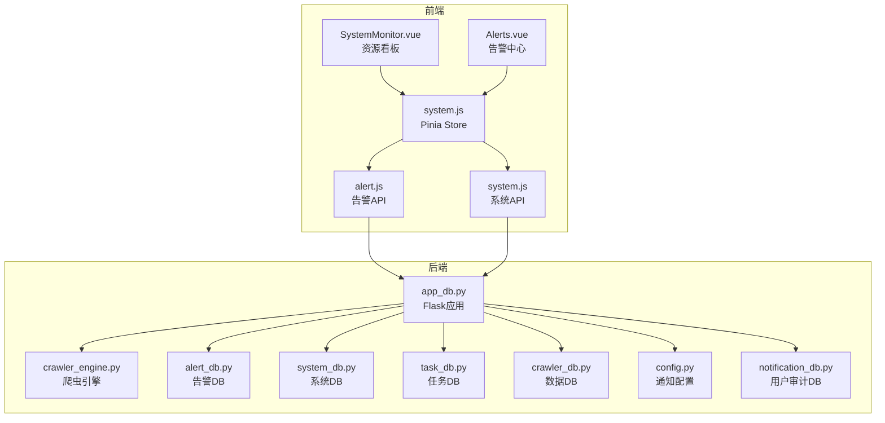
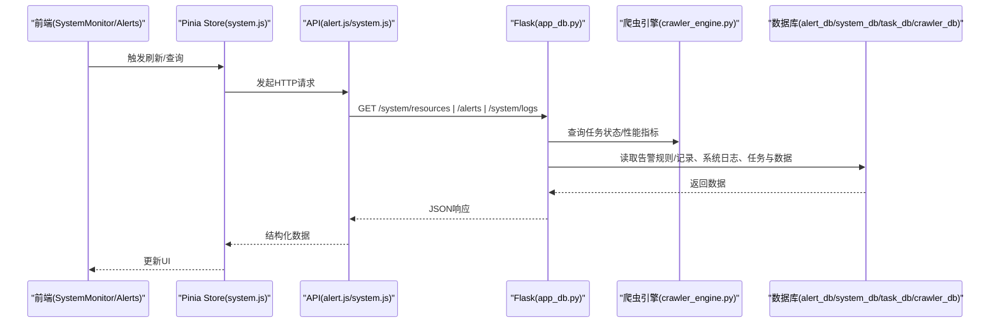
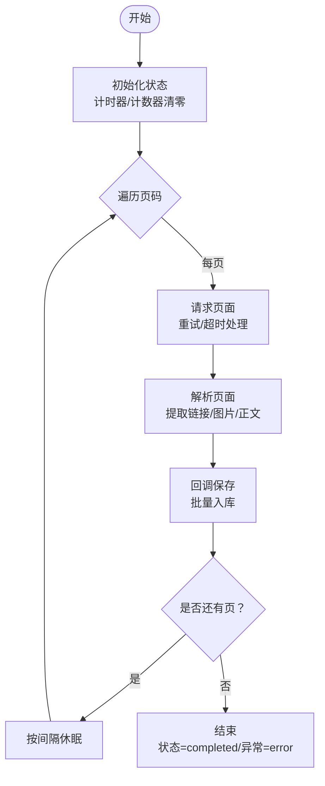
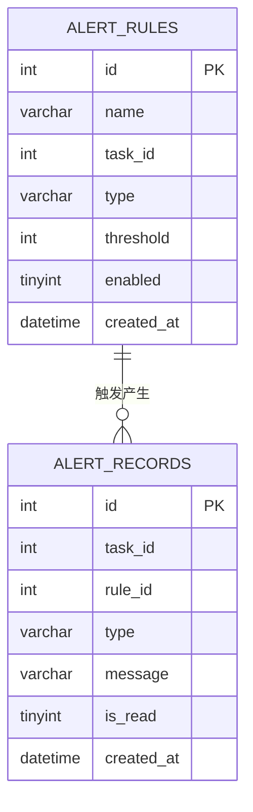
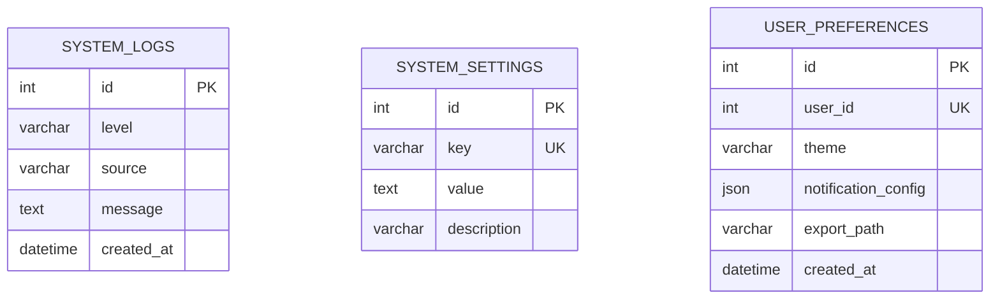
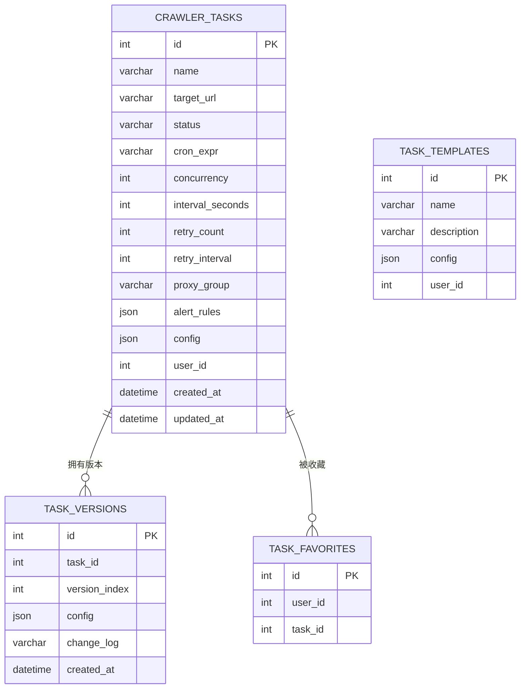
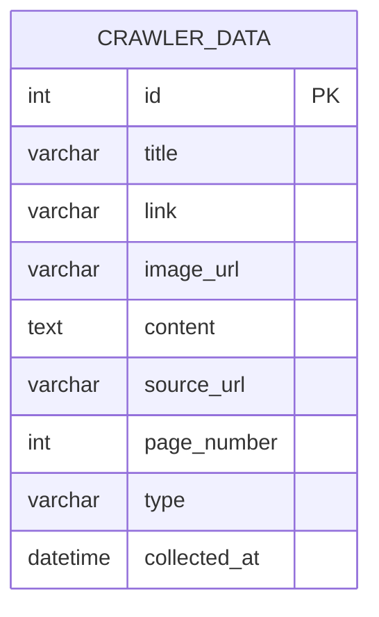
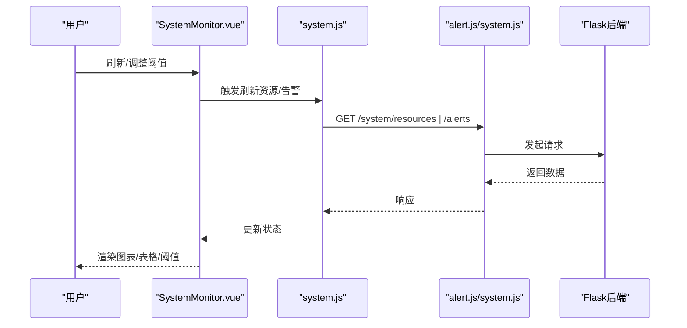
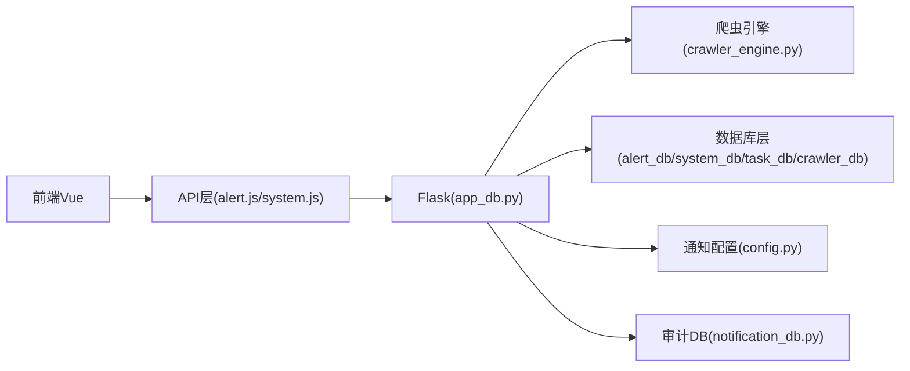

# 监控与告警

<cite>
**本文档引用的文件**
- [crawler_engine.py](file://python/crawler_engine.py)
- [alert_db.py](file://python/alert_db.py)
- [system_db.py](file://python/system_db.py)
- [task_db.py](file://python/task_db.py)
- [crawler_db.py](file://python/crawler_db.py)
- [SystemMonitor.vue](file://python-web/src/views/SystemMonitor.vue)
- [Alerts.vue](file://python-web/src/views/Alerts.vue)
- [system.js](file://python-web/src/stores/system.js)
- [alert.js](file://python-web/src/api/alert.js)
- [system.js](file://python-web/src/api/system.js)
- [config.py](file://python/src/notifications/config.py)
- [notification_db.py](file://python/src/notification_db.py)
- [app_db.py](file://python/app_db.py)
</cite>

## 目录
1. [简介](#简介)
2. [项目结构](#项目结构)
3. [核心组件](#核心组件)
4. [架构总览](#架构总览)
5. [详细组件分析](#详细组件分析)
6. [依赖分析](#依赖分析)
7. [性能考量](#性能考量)
8. [故障排查指南](#故障排查指南)
9. [结论](#结论)
10. [附录](#附录)

## 简介
本文件系统性阐述爬虫系统的监控指标收集与告警机制，覆盖任务状态监控、性能指标跟踪、异常检测与通知策略，并解释告警规则配置、阈值设置与告警级别管理。同时提供监控数据的可视化展示与历史趋势分析思路，以及监控数据的存储结构与查询优化方案。

## 项目结构
后端采用 Python + Flask，前端采用 Vue3 + Vite，监控与告警涉及以下模块：
- 爬虫引擎：负责任务执行、状态与性能指标采集
- 数据库层：告警规则与记录、系统日志、任务与数据表
- 前端视图：资源看板与告警中心，支持阈值配置与分页展示
- 通知配置：邮件/SMS开关与密钥配置

图表来源
- [SystemMonitor.vue:1-389](file://python-web/src/views/SystemMonitor.vue#L1-L389)
- [Alerts.vue:1-540](file://python-web/src/views/Alerts.vue#L1-L540)
- [system.js:1-168](file://python-web/src/stores/system.js#L1-L168)
- [alert.js:1-35](file://python-web/src/api/alert.js#L1-L35)
- [system.js:1-35](file://python-web/src/api/system.js#L1-L35)
- [app_db.py:1-726](file://python/app_db.py#L1-L726)
- [crawler_engine.py:1-533](file://python/crawler_engine.py#L1-L533)
- [alert_db.py:1-314](file://python/alert_db.py#L1-L314)
- [system_db.py:1-317](file://python/system_db.py#L1-L317)
- [task_db.py:1-533](file://python/task_db.py#L1-L533)
- [crawler_db.py:1-238](file://python/crawler_db.py#L1-L238)
- [config.py:1-20](file://python/src/notifications/config.py#L1-L20)
- [notification_db.py:1-357](file://python/src/notification_db.py#L1-L357)

章节来源
- [app_db.py:1-726](file://python/app_db.py#L1-L726)
- [SystemMonitor.vue:1-389](file://python-web/src/views/SystemMonitor.vue#L1-L389)
- [Alerts.vue:1-540](file://python-web/src/views/Alerts.vue#L1-L540)

## 核心组件
- 爬虫引擎（任务状态与性能指标）
  - 状态：idle、running、stopping、completed、error
  - 关键指标：已采集数、当前页/总页数、耗时（秒）、错误信息
  - 采集数据表：标题、链接、图片URL、内容摘要、来源URL、页码、类型
- 告警规则与记录
  - 规则表：名称、任务ID、类型、阈值、启用状态
  - 记录表：任务ID、规则ID、类型、消息、是否已读、创建时间
- 系统日志与设置
  - 日志表：级别、来源、消息、时间
  - 设置表：键值对与描述
- 任务管理
  - 任务表：名称、目标URL、状态、Cron、并发、间隔、重试、代理组、告警规则JSON、配置JSON、用户ID、时间戳
- 数据库连接与初始化
  - 自动创建数据库与表，确保索引存在
- 前端监控与告警
  - 资源看板：CPU/内存/磁盘/网络仪表盘、历史折线图、任务资源排行、阈值滑块
  - 告警中心：类型筛选、未读过滤、分页、展开详情、标记已读、跳转任务

章节来源
- [crawler_engine.py:508-530](file://python/crawler_engine.py#L508-L530)
- [alert_db.py:50-81](file://python/alert_db.py#L50-L81)
- [system_db.py:51-87](file://python/system_db.py#L51-L87)
- [task_db.py:51-111](file://python/task_db.py#L51-L111)
- [crawler_db.py:54-81](file://python/crawler_db.py#L54-L81)
- [SystemMonitor.vue:134-236](file://python-web/src/views/SystemMonitor.vue#L134-L236)
- [Alerts.vue:140-219](file://python-web/src/views/Alerts.vue#L140-L219)

## 架构总览
后端通过 Flask 暴露 REST 接口，前端通过 Pinia Store 调用 API，实现监控数据拉取、告警规则 CRUD、日志查询与资源统计。爬虫引擎在独立线程中运行，周期性更新状态与性能指标，异常时写入告警记录。

图表来源
- [system.js:135-139](file://python-web/src/stores/system.js#L135-L139)
- [alert.js:20-34](file://python-web/src/api/alert.js#L20-L34)
- [system.js:3-18](file://python-web/src/api/system.js#L3-L18)
- [app_db.py:610-627](file://python/app_db.py#L610-L627)
- [crawler_engine.py:508-530](file://python/crawler_engine.py#L508-L530)
- [alert_db.py:119-151](file://python/alert_db.py#L119-L151)
- [system_db.py:123-162](file://python/system_db.py#L123-L162)
- [task_db.py:123-164](file://python/task_db.py#L123-L164)
- [crawler_db.py:141-179](file://python/crawler_db.py#L141-L179)

## 详细组件分析

### 组件A：爬虫引擎（任务状态与性能指标）
- 状态属性与计算
  - 状态、已采集数、当前页、总页数、耗时（运行中实时计算，非运行时取累计）
  - 错误信息用于异常告警
- 采集流程
  - 独立线程执行，逐页抓取与解析，调用数据库回调批量保存
  - 异常捕获并设置状态为 error，记录错误信息
- 指标用途
  - 任务面板：状态、进度、耗时
  - 告警：错误率、超时、失败等阈值触发

图表来源
- [crawler_engine.py:400-463](file://python/crawler_engine.py#L400-L463)
- [crawler_engine.py:508-530](file://python/crawler_engine.py#L508-L530)

章节来源
- [crawler_engine.py:508-530](file://python/crawler_engine.py#L508-L530)
- [crawler_engine.py:400-463](file://python/crawler_engine.py#L400-L463)

### 组件B：告警规则与记录（配置、存储与查询）
- 规则表
  - 字段：名称、任务ID（0为全局）、类型、阈值、启用状态、创建时间
  - 索引：任务ID、类型、启用状态
- 记录表
  - 字段：任务ID、规则ID、类型、消息、是否已读、创建时间
  - 索引：任务ID、规则ID、是否已读、创建时间
- 查询与管理
  - 支持按任务/类型/启用状态过滤，分页查询，标记已读，未读计数

图表来源
- [alert_db.py:50-81](file://python/alert_db.py#L50-L81)

章节来源
- [alert_db.py:93-118](file://python/alert_db.py#L93-L118)
- [alert_db.py:119-151](file://python/alert_db.py#L119-L151)
- [alert_db.py:182-198](file://python/alert_db.py#L182-L198)
- [alert_db.py:199-223](file://python/alert_db.py#L199-L223)
- [alert_db.py:224-279](file://python/alert_db.py#L224-L279)
- [alert_db.py:280-296](file://python/alert_db.py#L280-L296)
- [alert_db.py:297-313](file://python/alert_db.py#L297-L313)

### 组件C：系统日志与设置（审计与配置）
- 日志表
  - 字段：级别、来源、消息、创建时间
  - 索引：级别、来源、创建时间
- 设置表
  - 字段：键、值、描述（唯一）
- 用户偏好
  - 主题、通知配置JSON、导出路径、用户ID唯一

图表来源
- [system_db.py:51-87](file://python/system_db.py#L51-L87)

章节来源
- [system_db.py:99-117](file://python/system_db.py#L99-L117)
- [system_db.py:123-162](file://python/system_db.py#L123-L162)
- [system_db.py:184-239](file://python/system_db.py#L184-L239)
- [system_db.py:255-314](file://python/system_db.py#L255-L314)

### 组件D：任务管理（模板、版本、收藏与调度）
- 任务表
  - 字段：名称、目标URL、状态、Cron、并发、间隔、重试、代理组、告警规则JSON、配置JSON、用户ID、时间戳
  - 索引：状态、用户ID、名称
- 模板与版本
  - 模板表：名称、描述、配置JSON、用户ID
  - 版本表：任务ID、版本序号、配置JSON、变更日志
- 收藏与状态更新

图表来源
- [task_db.py:51-111](file://python/task_db.py#L51-L111)

章节来源
- [task_db.py:172-204](file://python/task_db.py#L172-L204)
- [task_db.py:211-245](file://python/task_db.py#L211-L245)
- [task_db.py:247-260](file://python/task_db.py#L247-L260)
- [task_db.py:261-282](file://python/task_db.py#L261-L282)
- [task_db.py:284-345](file://python/task_db.py#L284-L345)
- [task_db.py:367-397](file://python/task_db.py#L367-L397)
- [task_db.py:420-444](file://python/task_db.py#L420-L444)
- [task_db.py:446-487](file://python/task_db.py#L446-L487)
- [task_db.py:489-513](file://python/task_db.py#L489-L513)
- [task_db.py:515-530](file://python/task_db.py#L515-L530)

### 组件E：监控数据存储与查询优化
- 爬虫数据表
  - 字段：标题、链接、图片URL、内容、来源URL、页码、类型、采集时间
  - 索引：来源URL、采集时间、页码、类型
- 查询优化建议
  - 常用过滤：来源URL、类型、采集时间范围
  - 分页：LIMIT/OFFSET，结合时间倒序
  - 去重：URL维度（见引擎去重逻辑）

图表来源
- [crawler_db.py:54-81](file://python/crawler_db.py#L54-L81)

章节来源
- [crawler_db.py:96-139](file://python/crawler_db.py#L96-L139)
- [crawler_db.py:141-179](file://python/crawler_db.py#L141-L179)
- [crawler_db.py:187-200](file://python/crawler_db.py#L187-L200)
- [crawler_db.py:202-221](file://python/crawler_db.py#L202-L221)
- [crawler_db.py:223-236](file://python/crawler_db.py#L223-L236)

### 组件F：前端监控与告警（资源看板与告警中心）
- 资源看板
  - 仪表盘：CPU/内存/磁盘/网络使用率与状态
  - 折线图：CPU/内存历史趋势（固定长度队列滚动）
  - 任务排行：按CPU/内存排序，状态标签
  - 阈值设置：滑块调节阈值并保存
- 告警中心
  - 类型筛选、未读过滤、分页
  - 展开详情、建议操作、标记已读、跳转任务

图表来源
- [SystemMonitor.vue:201-236](file://python-web/src/views/SystemMonitor.vue#L201-L236)
- [system.js:135-139](file://python-web/src/stores/system.js#L135-L139)
- [alert.js:20-34](file://python-web/src/api/alert.js#L20-L34)
- [system.js:3-18](file://python-web/src/api/system.js#L3-L18)

章节来源
- [SystemMonitor.vue:134-236](file://python-web/src/views/SystemMonitor.vue#L134-L236)
- [Alerts.vue:138-219](file://python-web/src/views/Alerts.vue#L138-L219)
- [system.js:17-33](file://python-web/src/stores/system.js#L17-L33)
- [alert.js:20-34](file://python-web/src/api/alert.js#L20-L34)
- [system.js:3-18](file://python-web/src/api/system.js#L3-L18)

## 依赖分析
- 组件耦合
  - 前端通过 API 层与后端交互，后端统一由 Flask 应用承载
  - 爬虫引擎与数据库回调解耦，便于替换存储层
  - 告警规则与任务表通过 JSON 字段关联，便于灵活扩展
- 外部依赖
  - MySQL：PyMySQL 连接与事务
  - Flask：路由与跨域配置
  - Element Plus/Vue Router：前端交互与导航

图表来源
- [app_db.py:36-44](file://python/app_db.py#L36-L44)
- [alert_db.py:12-22](file://python/alert_db.py#L12-L22)
- [system_db.py:13-23](file://python/system_db.py#L13-L23)
- [task_db.py:13-23](file://python/task_db.py#L13-L23)
- [crawler_db.py:12-22](file://python/crawler_db.py#L12-L22)
- [config.py:4-13](file://python/src/notifications/config.py#L4-L13)
- [notification_db.py:6-17](file://python/src/notification_db.py#L6-L17)

章节来源
- [app_db.py:36-44](file://python/app_db.py#L36-L44)
- [alert_db.py:12-22](file://python/alert_db.py#L12-L22)
- [system_db.py:13-23](file://python/system_db.py#L13-L23)
- [task_db.py:13-23](file://python/task_db.py#L13-L23)
- [crawler_db.py:12-22](file://python/crawler_db.py#L12-L22)
- [config.py:4-13](file://python/src/notifications/config.py#L4-L13)
- [notification_db.py:6-17](file://python/src/notification_db.py#L6-L17)

## 性能考量
- 爬虫引擎
  - 多线程+事件标志控制启停，避免阻塞主线程
  - 请求重试与退避策略，降低封禁风险
- 数据库
  - 表与索引设计针对高频查询（来源URL、类型、时间、任务ID）
  - 批量插入减少往返开销
- 前端
  - 固定长度历史队列滚动，避免DOM膨胀
  - 分页与虚拟滚动（建议）提升大数据集渲染性能

## 故障排查指南
- 告警规则配置
  - 检查规则表字段与索引是否存在，确认任务ID与类型匹配
  - 使用查询接口验证过滤条件与分页
- 系统日志
  - 查看系统日志表的级别与来源，定位异常根因
- 任务状态
  - 通过引擎状态接口确认运行/停止/错误状态与耗时
- 通知策略
  - 检查通知配置开关与密钥环境变量，确认审计日志记录

章节来源
- [alert_db.py:119-151](file://python/alert_db.py#L119-L151)
- [alert_db.py:224-279](file://python/alert_db.py#L224-L279)
- [system_db.py:123-162](file://python/system_db.py#L123-L162)
- [crawler_engine.py:508-530](file://python/crawler_engine.py#L508-L530)
- [config.py:4-13](file://python/src/notifications/config.py#L4-L13)
- [notification_db.py:334-342](file://python/src/notification_db.py#L334-L342)

## 结论
本系统通过爬虫引擎的内置状态与性能指标、数据库层的规则与记录、前端的可视化看板与告警中心，形成了完整的监控与告警闭环。建议在生产环境中进一步完善：
- 增加实时指标采集（如QPS、错误率、队列长度）
- 引入异步任务队列与重试机制
- 优化数据库索引与查询计划，定期清理历史数据
- 完善通知渠道与分级策略（邮件/SMS/IM）

## 附录
- 告警规则类型建议
  - 任务失败：失败次数/比例超过阈值
  - 超时：平均/95分位响应时间超过阈值
  - 数据异常：解析失败率/重复率异常
  - IP被封：代理池可用IP数低于阈值
- 阈值设置与级别
  - 阈值：根据业务SLA设定
  - 级别：警告/严重，分别对应不同通知渠道与升级策略