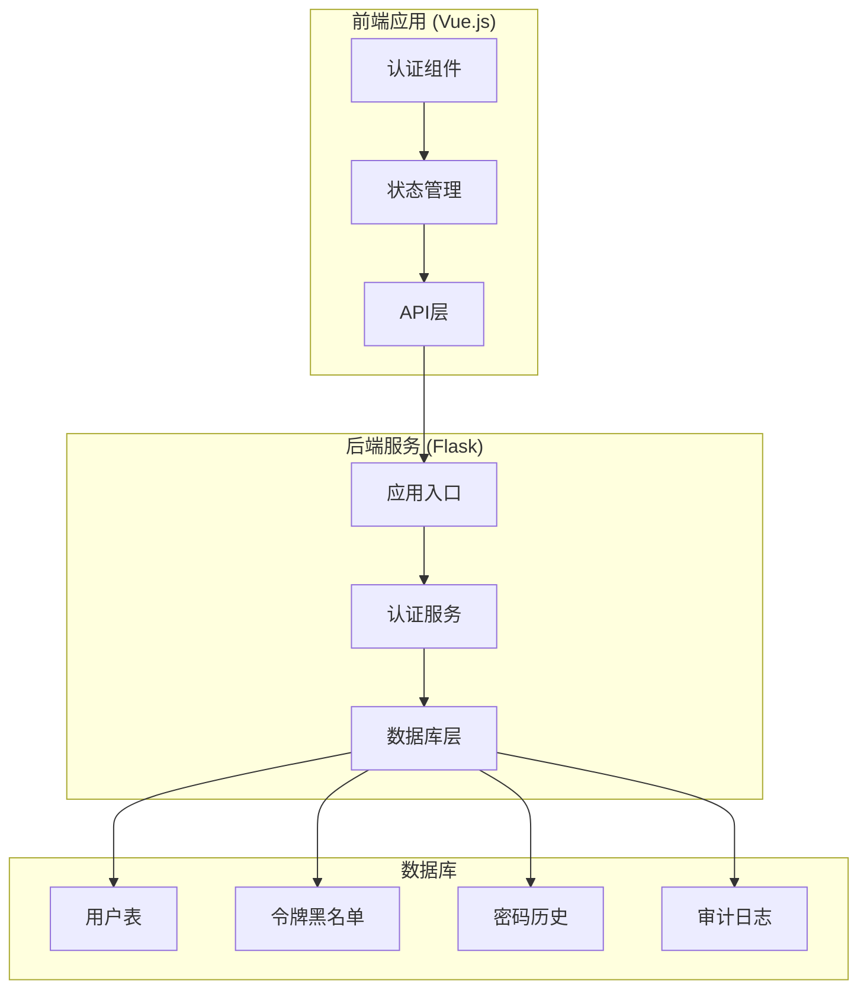
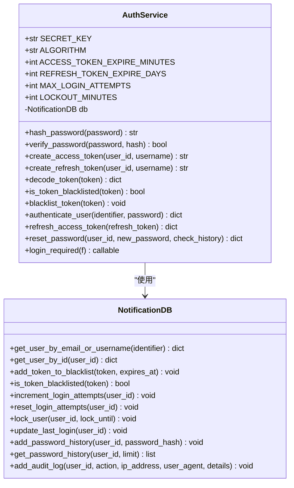
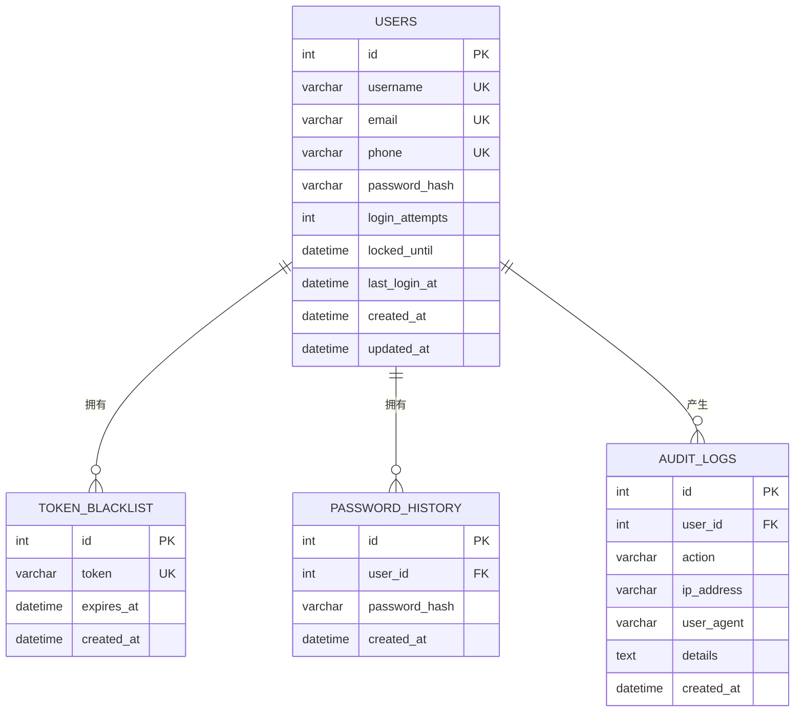
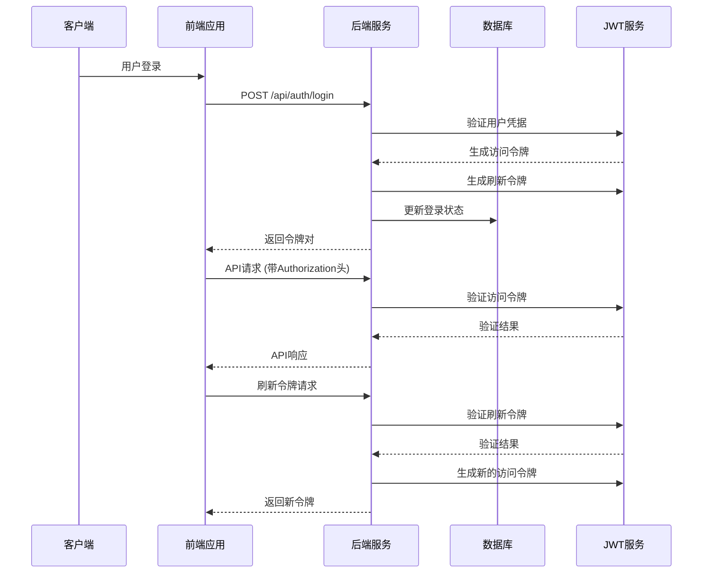
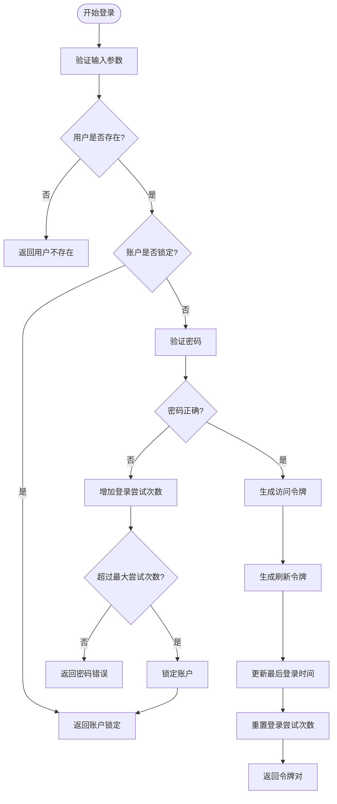
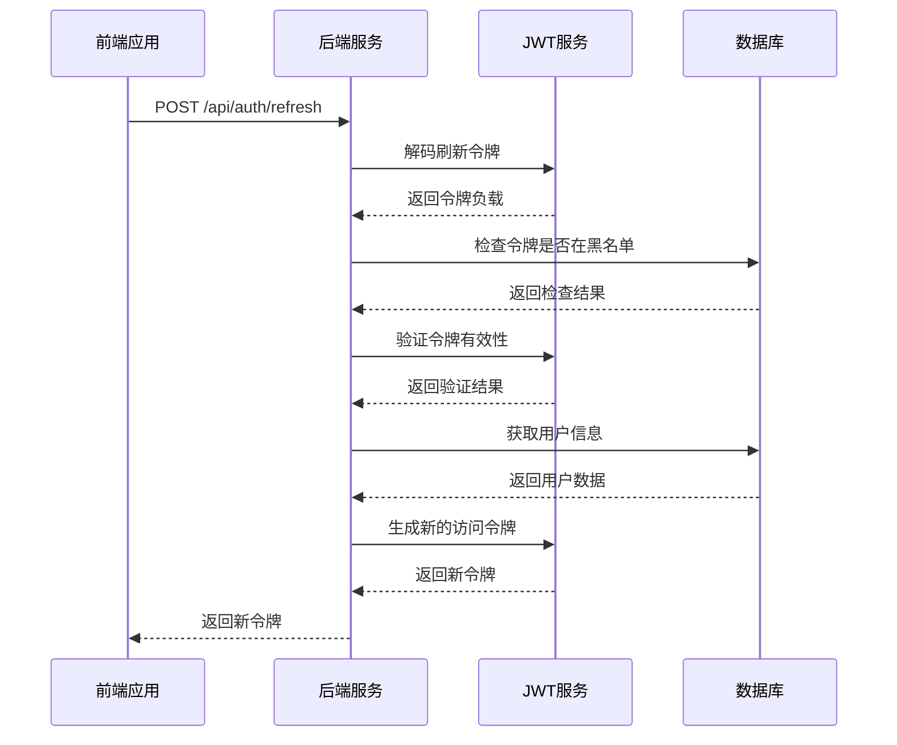
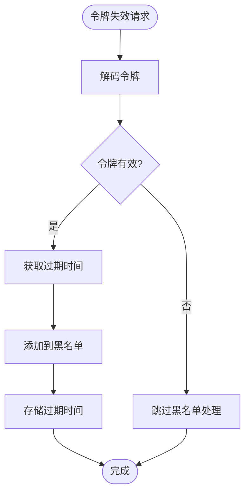
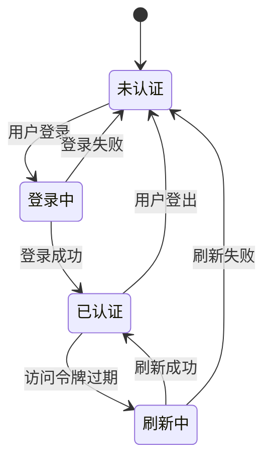
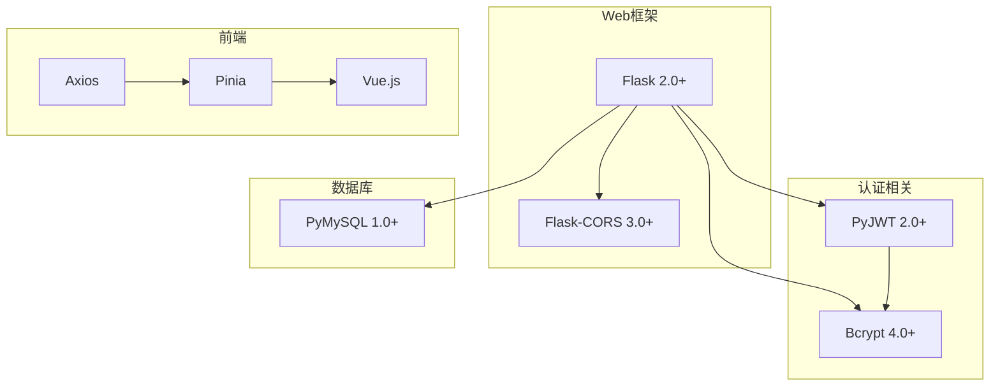
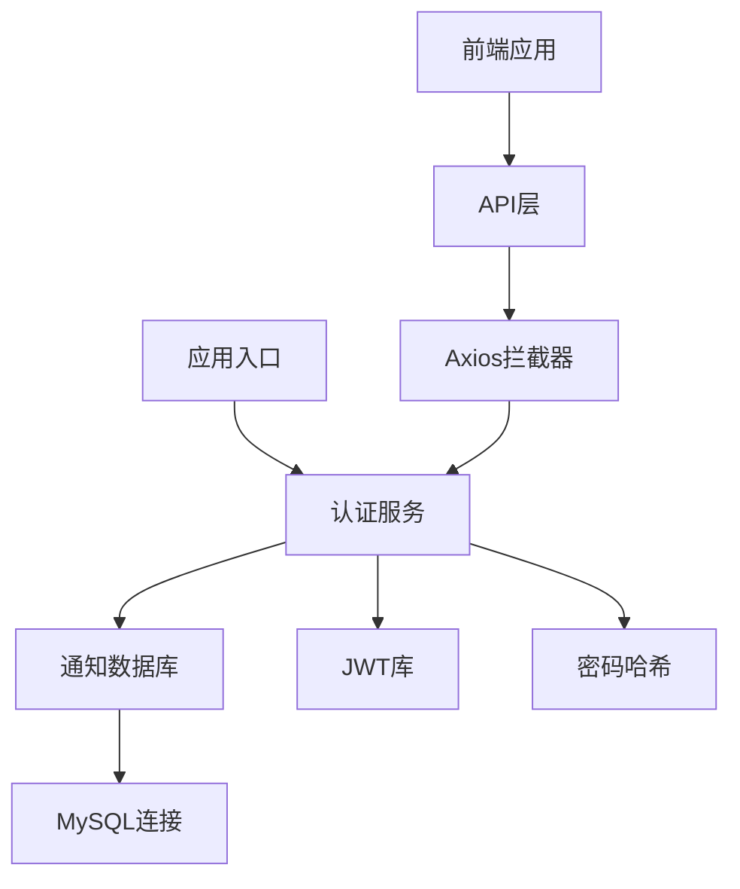

# JWT令牌管理

<cite>
**本文档引用的文件**
- [app.py](file://python/app.py)
- [auth_server.py](file://python/auth_server.py)
- [src/auth_service.py](file://python/src/auth_service.py)
- [src/notification_db.py](file://python/src/notification_db.py)
- [python-web/src/stores/auth.js](file://python-web/src/stores/auth.js)
- [python-web/src/api/index.js](file://python-web/src/api/index.js)
- [requirements.txt](file://python/requirements.txt)
</cite>

## 目录
1. [简介](#简介)
2. [项目结构](#项目结构)
3. [核心组件](#核心组件)
4. [架构概览](#架构概览)
5. [详细组件分析](#详细组件分析)
6. [依赖关系分析](#依赖关系分析)
7. [性能考虑](#性能考虑)
8. [故障排除指南](#故障排除指南)
9. [结论](#结论)

## 简介

本项目实现了完整的JWT（JSON Web Token）令牌管理系统，包括访问令牌和刷新令牌的生成、验证和管理机制。系统采用Flask作为后端框架，Vue.js作为前端框架，实现了基于JWT的无状态认证方案。

JWT令牌管理的核心特性包括：
- 访问令牌和刷新令牌的双重认证机制
- 令牌黑名单机制实现令牌失效管理
- 前后端分离的认证流程
- 完整的会话管理和安全控制

## 项目结构

项目采用前后端分离的架构设计，主要分为以下模块：

**图表来源**
- [app.py:1-800](file://python/app.py#L1-L800)
- [src/auth_service.py:1-187](file://python/src/auth_service.py#L1-L187)
- [src/notification_db.py:1-357](file://python/src/notification_db.py#L1-L357)

**章节来源**
- [app.py:1-800](file://python/app.py#L1-L800)
- [auth_server.py:1-431](file://python/auth_server.py#L1-L431)

## 核心组件

### 认证服务类 (AuthService)

认证服务是JWT令牌管理的核心组件，负责令牌的生成、验证和管理。

**图表来源**
- [src/auth_service.py:9-187](file://python/src/auth_service.py#L9-L187)
- [src/notification_db.py:6-357](file://python/src/notification_db.py#L6-L357)

### 数据库模型

系统使用MySQL数据库存储用户信息和令牌状态：

**图表来源**
- [src/notification_db.py:44-103](file://python/src/notification_db.py#L44-L103)

**章节来源**
- [src/auth_service.py:9-187](file://python/src/auth_service.py#L9-L187)
- [src/notification_db.py:6-357](file://python/src/notification_db.py#L6-L357)

## 架构概览

JWT令牌管理系统的整体架构如下：

**图表来源**
- [app.py:99-140](file://python/app.py#L99-L140)
- [src/auth_service.py:76-118](file://python/src/auth_service.py#L76-L118)
- [src/auth_service.py:120-136](file://python/src/auth_service.py#L120-L136)

## 详细组件分析

### 访问令牌生成与验证

访问令牌用于API请求的身份验证，具有较短的有效期：

**图表来源**
- [src/auth_service.py:76-118](file://python/src/auth_service.py#L76-L118)

访问令牌的配置特点：
- **有效期**: 30分钟
- **用途**: API请求的身份验证
- **类型标识**: `type: 'access'`
- **负载内容**: 用户ID、用户名、过期时间

**章节来源**
- [src/auth_service.py:27-35](file://python/src/auth_service.py#L27-L35)
- [src/auth_service.py:76-118](file://python/src/auth_service.py#L76-L118)

### 刷新令牌机制

刷新令牌用于在访问令牌过期时获取新的访问令牌：

**图表来源**
- [app.py:126-139](file://python/app.py#L126-L139)
- [src/auth_service.py:120-136](file://python/src/auth_service.py#L120-L136)

刷新令牌的配置特点：
- **有效期**: 7天
- **用途**: 刷新访问令牌
- **类型标识**: `type: 'refresh'`
- **负载内容**: 用户ID、用户名、过期时间

**章节来源**
- [src/auth_service.py:37-45](file://python/src/auth_service.py#L37-L45)
- [src/auth_service.py:120-136](file://python/src/auth_service.py#L120-L136)

### 令牌黑名单机制

令牌黑名单机制用于实现令牌的即时失效：

**图表来源**
- [src/auth_service.py:61-65](file://python/src/auth_service.py#L61-L65)
- [src/notification_db.py:297-311](file://python/src/notification_db.py#L297-L311)

黑名单机制的工作流程：
1. **令牌解码**: 提取令牌的过期时间
2. **黑名单存储**: 将令牌和过期时间存入数据库
3. **实时验证**: 请求时检查令牌是否在黑名单中
4. **过期清理**: 自动清理过期的黑名单记录

**章节来源**
- [src/auth_service.py:58-65](file://python/src/auth_service.py#L58-L65)
- [src/notification_db.py:297-311](file://python/src/notification_db.py#L297-L311)

### 前端令牌管理

前端使用Pinia状态管理库处理JWT令牌：

**图表来源**
- [python-web/src/stores/auth.js:5-74](file://python-web/src/stores/auth.js#L5-L74)

前端令牌管理的关键功能：
- **本地存储**: 使用localStorage持久化存储令牌
- **自动刷新**: 401错误时自动使用刷新令牌
- **状态同步**: 保持应用状态与令牌状态一致

**章节来源**
- [python-web/src/stores/auth.js:5-74](file://python-web/src/stores/auth.js#L5-L74)
- [python-web/src/api/index.js:11-59](file://python-web/src/api/index.js#L11-L59)

### 安全存储与传输最佳实践

系统实现了多层安全措施：

#### 服务器端安全措施
- **密钥管理**: 使用环境变量存储SECRET_KEY
- **算法选择**: 采用HS256算法确保签名完整性
- **过期时间**: 访问令牌短期有效，降低泄露风险
- **登录限制**: 多次失败自动锁定账户

#### 客户端安全措施
- **存储位置**: 使用localStorage存储令牌
- **传输加密**: 通过HTTPS传输令牌
- **自动清理**: 登出时清除本地存储的令牌

**章节来源**
- [src/auth_service.py:10-15](file://python/src/auth_service.py#L10-L15)
- [python-web/src/api/index.js:3-9](file://python-web/src/api/index.js#L3-L9)

## 依赖关系分析

### 外部依赖

系统依赖以下关键库：

**图表来源**
- [requirements.txt:1-14](file://python/requirements.txt#L1-L14)

### 内部组件依赖

**图表来源**
- [app.py:1-10](file://python/app.py#L1-L10)
- [src/auth_service.py:1-6](file://python/src/auth_service.py#L1-L6)

**章节来源**
- [requirements.txt:1-14](file://python/requirements.txt#L1-L14)
- [app.py:1-10](file://python/app.py#L1-L10)

## 性能考虑

### 令牌验证性能

系统采用高效的令牌验证策略：
- **内存缓存**: 令牌验证结果可以缓存
- **数据库优化**: 黑名单查询使用索引
- **异步处理**: 密码哈希使用异步算法

### 并发处理

系统支持高并发场景：
- **无状态设计**: JWT令牌无状态，便于水平扩展
- **连接池**: 数据库连接使用连接池管理
- **超时控制**: API请求设置合理的超时时间

## 故障排除指南

### 常见问题及解决方案

#### 令牌过期问题
**症状**: API请求返回401状态码
**原因**: 访问令牌已过期
**解决**: 使用刷新令牌获取新的访问令牌

#### 令牌被撤销
**症状**: 登录后立即被拒绝
**原因**: 令牌可能已被加入黑名单
**解决**: 检查令牌是否被登出或密码更改影响

#### 数据库连接问题
**症状**: 认证功能异常
**原因**: 数据库连接失败
**解决**: 检查数据库配置和网络连接

#### 前端令牌同步问题
**症状**: 页面显示未登录状态
**原因**: 本地存储的令牌与服务器不一致
**解决**: 清除浏览器本地存储并重新登录

**章节来源**
- [src/auth_service.py:47-56](file://python/src/auth_service.py#L47-L56)
- [src/notification_db.py:297-311](file://python/src/notification_db.py#L297-L311)

## 结论

本JWT令牌管理系统提供了完整的身份认证解决方案，具有以下优势：

### 技术优势
- **安全性**: 双令牌机制和黑名单管理确保令牌安全
- **可扩展性**: 无状态设计支持水平扩展
- **易用性**: 完整的前后端集成方案
- **可靠性**: 完善的错误处理和故障恢复机制

### 最佳实践总结
1. **令牌管理**: 访问令牌短期有效，刷新令牌长期有效
2. **安全存储**: 使用HTTPS传输，合理存储令牌
3. **失效处理**: 实现令牌黑名单机制
4. **用户体验**: 自动刷新和错误处理提升用户体验
5. **监控审计**: 完整的审计日志记录

该系统为构建安全可靠的Web应用提供了坚实的基础，可以根据具体需求进行定制和扩展。