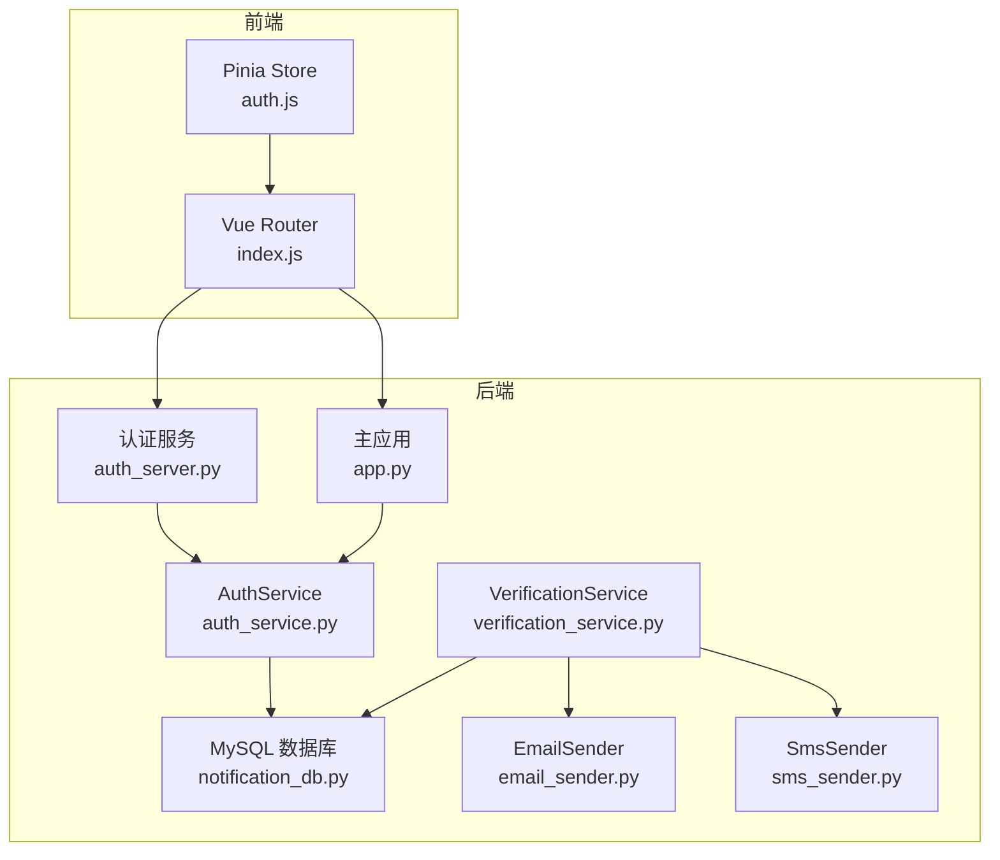
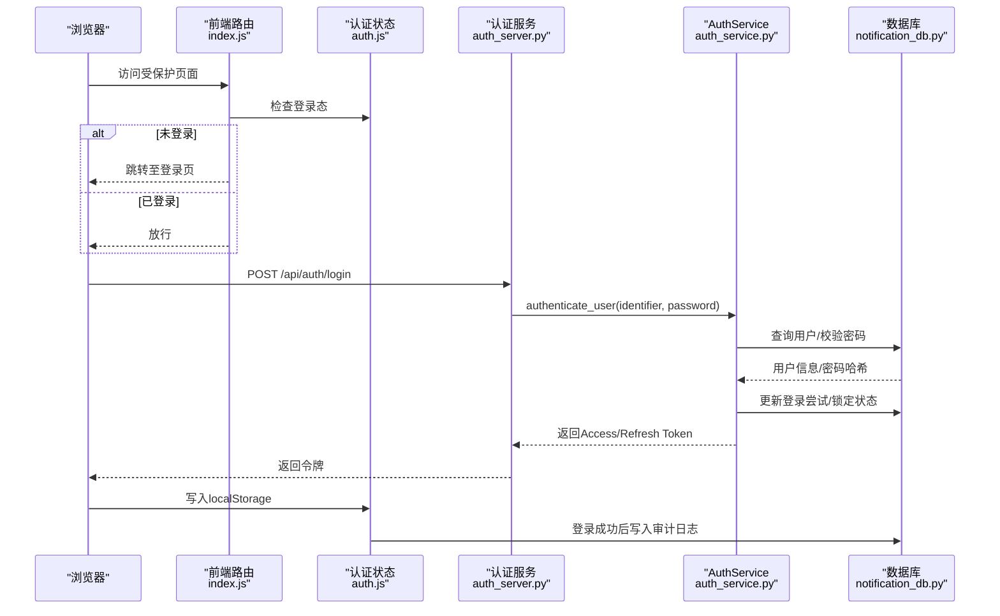
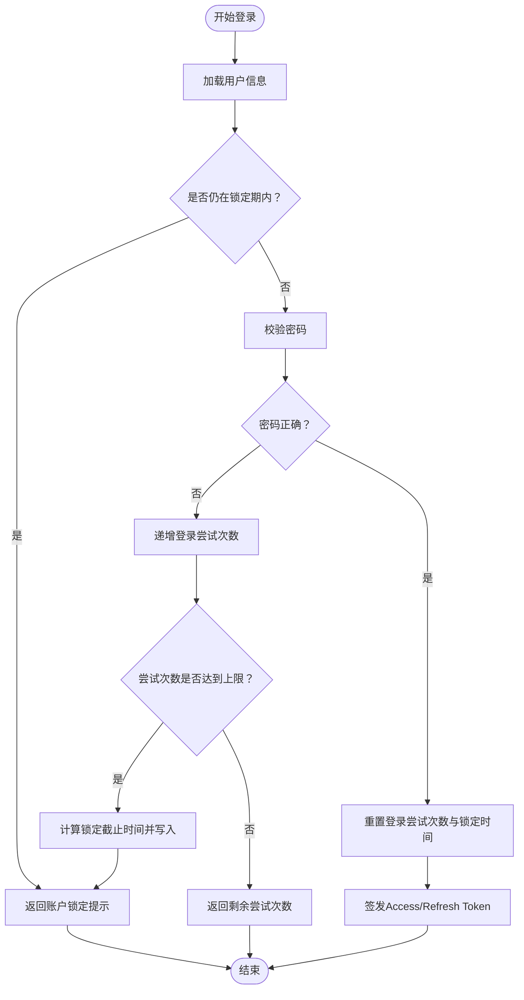
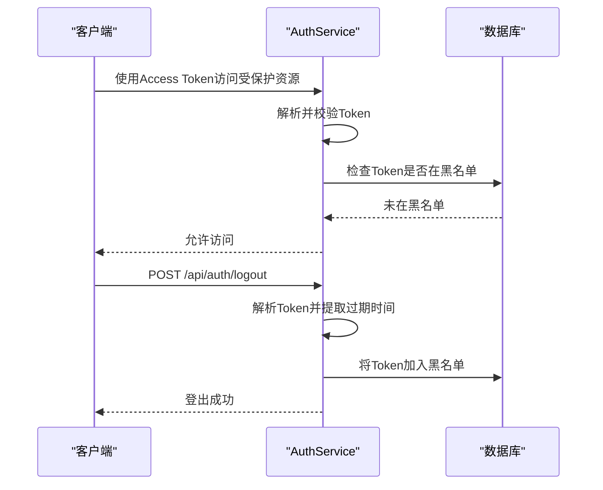
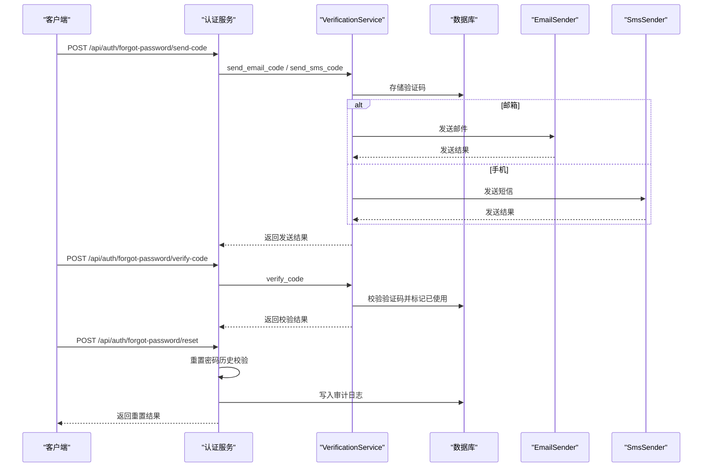
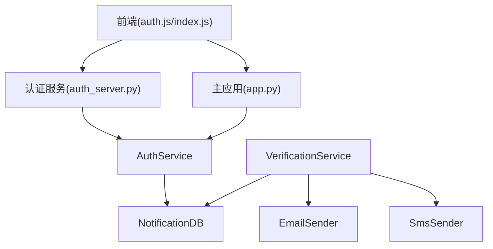

# 安全策略与防护

<cite>
**本文引用的文件**
- [app.py](file://python/app.py)
- [auth_server.py](file://python/auth_server.py)
- [auth_service.py](file://python/src/auth_service.py)
- [notification_db.py](file://python/src/notification_db.py)
- [verification_service.py](file://python/src/notifications/verification_service.py)
- [email_sender.py](file://python/src/notifications/email_sender.py)
- [sms_sender.py](file://python/src/notifications/sms_sender.py)
- [auth.js](file://python-web/src/stores/auth.js)
- [index.js](file://python-web/src/router/index.js)
- [requirements.txt](file://python/requirements.txt)
</cite>

## 目录
1. [简介](#简介)
2. [项目结构](#项目结构)
3. [核心组件](#核心组件)
4. [架构总览](#架构总览)
5. [详细组件分析](#详细组件分析)
6. [依赖分析](#依赖分析)
7. [性能考虑](#性能考虑)
8. [故障排查指南](#故障排查指南)
9. [结论](#结论)
10. [附录](#附录)

## 简介
本文件系统性梳理该代码库的安全策略与防护机制，覆盖账户锁定策略、登录尝试限制、暴力破解防护、会话超时管理、令牌黑名单、审计日志、验证码机制与前端鉴权拦截等方面。同时给出安全配置参数的含义与调优建议，并提供生产环境安全最佳实践、日志审计与异常监控、以及安全事件响应流程。

## 项目结构
后端采用Flask微服务架构，分为认证服务与业务路由两部分：
- 认证服务：独立的认证服务器，处理注册、登录、登出、密码重置、验证码等流程
- 主应用：提供业务接口（爬虫、任务、代理池等），内部复用认证服务能力
- 前端：Vue+Pinia+Vue Router，负责本地存储令牌、路由守卫与鉴权拦截

**图表来源**
- [auth_server.py:1-431](file://python/auth_server.py#L1-L431)
- [app.py:1-800](file://python/app.py#L1-L800)
- [auth_service.py:1-187](file://python/src/auth_service.py#L1-L187)
- [notification_db.py:1-357](file://python/src/notification_db.py#L1-L357)
- [verification_service.py:1-108](file://python/src/notifications/verification_service.py#L1-L108)
- [email_sender.py:1-67](file://python/src/notifications/email_sender.py#L1-L67)
- [sms_sender.py:1-65](file://python/src/notifications/sms_sender.py#L1-L65)
- [auth.js:1-74](file://python-web/src/stores/auth.js#L1-L74)
- [index.js:1-150](file://python-web/src/router/index.js#L1-L150)

**章节来源**
- [auth_server.py:1-431](file://python/auth_server.py#L1-L431)
- [app.py:1-800](file://python/app.py#L1-L800)
- [auth_service.py:1-187](file://python/src/auth_service.py#L1-L187)
- [notification_db.py:1-357](file://python/src/notification_db.py#L1-L357)
- [verification_service.py:1-108](file://python/src/notifications/verification_service.py#L1-L108)
- [email_sender.py:1-67](file://python/src/notifications/email_sender.py#L1-L67)
- [sms_sender.py:1-65](file://python/src/notifications/sms_sender.py#L1-L65)
- [auth.js:1-74](file://python-web/src/stores/auth.js#L1-L74)
- [index.js:1-150](file://python-web/src/router/index.js#L1-L150)

## 核心组件
- 认证服务（AuthService）
  - 密码哈希与校验：使用bcrypt
  - JWT令牌签发与解析：Access Token（默认30分钟）、Refresh Token（默认7天）
  - 登录尝试限制与账户锁定：最大尝试次数、锁定时长
  - 令牌黑名单：登出与刷新时将过期令牌加入黑名单
  - 密码历史校验：禁止重复使用近期密码
- 数据层（NotificationDB）
  - 用户表：记录登录尝试次数、锁定截止时间、最后登录时间
  - 验证码表：存储验证码、类型、目标、过期时间、使用状态
  - 黑名单表：存储已吊销的token及其过期时间
  - 密码历史表：记录用户历史密码哈希
  - 审计日志表：记录用户行为（注册、登录、登出、改密、重置密码）
- 验证码服务（VerificationService）
  - 邮件/短信验证码发送与校验
  - 验证码长度与过期时间控制
- 前端鉴权
  - Pinia Store本地持久化存储访问令牌与刷新令牌
  - Vue Router全局前置守卫进行登录态校验与页面跳转

**章节来源**
- [auth_service.py:1-187](file://python/src/auth_service.py#L1-L187)
- [notification_db.py:1-357](file://python/src/notification_db.py#L1-L357)
- [verification_service.py:1-108](file://python/src/notifications/verification_service.py#L1-L108)
- [auth.js:1-74](file://python-web/src/stores/auth.js#L1-L74)
- [index.js:1-150](file://python-web/src/router/index.js#L1-L150)

## 架构总览
下图展示从浏览器到后端的典型登录流程，包含令牌签发、黑名单与审计日志：

**图表来源**
- [auth_server.py:123-159](file://python/auth_server.py#L123-L159)
- [auth_service.py:76-118](file://python/src/auth_service.py#L76-L118)
- [notification_db.py:334-342](file://python/src/notification_db.py#L334-L342)
- [auth.js:12-36](file://python-web/src/stores/auth.js#L12-L36)
- [index.js:134-147](file://python-web/src/router/index.js#L134-L147)

## 详细组件分析

### 账户锁定策略与登录尝试限制
- 登录尝试上限与锁定时长
  - 最大登录尝试次数：超过阈值触发账户锁定
  - 锁定时长：达到锁定时长自动解锁
- 实现要点
  - 登录失败时递增登录尝试次数；达上限则计算锁定截止时间并写入用户表
  - 登录成功时重置尝试次数与锁定时间
  - 登录前检查用户是否仍处于锁定期内

**图表来源**
- [auth_service.py:76-118](file://python/src/auth_service.py#L76-L118)
- [notification_db.py:261-287](file://python/src/notification_db.py#L261-L287)

**章节来源**
- [auth_service.py:14-15](file://python/src/auth_service.py#L14-L15)
- [auth_service.py:76-118](file://python/src/auth_service.py#L76-L118)
- [notification_db.py:261-287](file://python/src/notification_db.py#L261-L287)

### 暴力破解防护
- 多层防护
  - 登录尝试限制与账户锁定
  - Access Token短有效期（默认30分钟），降低长期暴露风险
  - Refresh Token黑名单：登出与刷新时将过期令牌加入黑名单
  - 审计日志：记录异常登录与登出行为
- 建议
  - 结合IP/设备维度的动态阈值与临时封禁
  - 引入验证码与二次校验（已完成验证码模块）

**章节来源**
- [auth_service.py:12-13](file://python/src/auth_service.py#L12-L13)
- [auth_service.py:58-65](file://python/src/auth_service.py#L58-L65)
- [notification_db.py:297-311](file://python/src/notification_db.py#L297-L311)
- [verification_service.py:1-108](file://python/src/notifications/verification_service.py#L1-L108)

### 会话超时管理与令牌生命周期
- Access Token
  - 默认有效期：30分钟
  - 用途：短期访问受保护资源
- Refresh Token
  - 默认有效期：7天
  - 用途：在Access Token过期后换取新的Access Token
- 黑名单机制
  - 登出与刷新时将旧令牌加入黑名单，防止重放
  - 请求时校验令牌是否在黑名单中

**图表来源**
- [auth_service.py:27-45](file://python/src/auth_service.py#L27-L45)
- [auth_service.py:120-136](file://python/src/auth_service.py#L120-L136)
- [auth_service.py:58-65](file://python/src/auth_service.py#L58-L65)
- [notification_db.py:297-311](file://python/src/notification_db.py#L297-L311)

**章节来源**
- [auth_service.py:12-13](file://python/src/auth_service.py#L12-L13)
- [auth_service.py:120-136](file://python/src/auth_service.py#L120-L136)
- [notification_db.py:297-311](file://python/src/notification_db.py#L297-L311)

### 密码策略与历史校验
- 密码哈希
  - 使用bcrypt进行不可逆哈希
- 密码历史
  - 重置/修改密码时，禁止与近期若干条历史密码重复
- 审计
  - 修改/重置密码后写入审计日志

**章节来源**
- [auth_service.py:20-25](file://python/src/auth_service.py#L20-L25)
- [auth_service.py:138-156](file://python/src/auth_service.py#L138-L156)
- [notification_db.py:313-332](file://python/src/notification_db.py#L313-L332)
- [notification_db.py:334-342](file://python/src/notification_db.py#L334-L342)

### 验证码与忘记密码流程
- 验证码
  - 邮件/短信验证码生成、存储、校验与过期控制
  - 验证码长度与有效期可配置
- 忘记密码
  - 发送验证码 → 校验验证码 → 重置密码（含历史校验）
- 审计
  - 重置密码后写入审计日志

**图表来源**
- [auth_server.py:225-335](file://python/auth_server.py#L225-L335)
- [verification_service.py:25-101](file://python/src/notifications/verification_service.py#L25-L101)
- [email_sender.py:13-62](file://python/src/notifications/email_sender.py#L13-L62)
- [sms_sender.py:14-60](file://python/src/notifications/sms_sender.py#L14-L60)
- [notification_db.py:147-189](file://python/src/notification_db.py#L147-L189)
- [notification_db.py:313-342](file://python/src/notification_db.py#L313-L342)

**章节来源**
- [verification_service.py:1-108](file://python/src/notifications/verification_service.py#L1-L108)
- [email_sender.py:1-67](file://python/src/notifications/email_sender.py#L1-L67)
- [sms_sender.py:1-65](file://python/src/notifications/sms_sender.py#L1-L65)
- [auth_server.py:225-335](file://python/auth_server.py#L225-L335)

### 前端鉴权与会话管理
- 本地存储
  - 使用localStorage持久化Access/Refresh Token与用户信息
- 路由守卫
  - 全局前置守卫根据登录态决定放行或跳转登录页
- 登出流程
  - 调用后端登出接口（携带Refresh Token），无论成功与否均清理本地存储

**章节来源**
- [auth.js:1-74](file://python-web/src/stores/auth.js#L1-L74)
- [index.js:134-147](file://python-web/src/router/index.js#L134-L147)
- [auth_server.py:188-223](file://python/auth_server.py#L188-L223)

## 依赖分析
- 外部依赖
  - Flask、Flask-CORS、PyMySQL、bcrypt、PyJWT、阿里云SDK等
- 组件耦合
  - AuthService高度依赖NotificationDB（用户、验证码、黑名单、审计、密码历史）
  - VerificationService依赖Email/Sms Sender与NotificationDB
  - 前端通过API与后端交互，不直接依赖后端实现细节

**图表来源**
- [auth_service.py:1-187](file://python/src/auth_service.py#L1-L187)
- [notification_db.py:1-357](file://python/src/notification_db.py#L1-L357)
- [verification_service.py:1-108](file://python/src/notifications/verification_service.py#L1-L108)
- [email_sender.py:1-67](file://python/src/notifications/email_sender.py#L1-L67)
- [sms_sender.py:1-65](file://python/src/notifications/sms_sender.py#L1-L65)
- [auth_server.py:1-431](file://python/auth_server.py#L1-L431)
- [app.py:1-800](file://python/app.py#L1-L800)
- [auth.js:1-74](file://python-web/src/stores/auth.js#L1-L74)
- [index.js:1-150](file://python-web/src/router/index.js#L1-L150)

**章节来源**
- [requirements.txt:1-14](file://python/requirements.txt#L1-L14)
- [auth_service.py:1-187](file://python/src/auth_service.py#L1-L187)
- [notification_db.py:1-357](file://python/src/notification_db.py#L1-L357)
- [verification_service.py:1-108](file://python/src/notifications/verification_service.py#L1-L108)
- [auth_server.py:1-431](file://python/auth_server.py#L1-L431)
- [app.py:1-800](file://python/app.py#L1-L800)
- [auth.js:1-74](file://python-web/src/stores/auth.js#L1-L74)
- [index.js:1-150](file://python-web/src/router/index.js#L1-L150)

## 性能考虑
- 数据库连接
  - 连接池与重连机制：确保高并发下的稳定性
- 加密成本
  - bcrypt与JWT均为CPU密集型操作，建议在高并发场景下评估实例规格与缓存策略
- 日志与审计
  - 审计日志写入应异步化或批量提交，避免阻塞请求
- 前端
  - 令牌本地存储在localStorage，注意跨站脚本攻击风险，建议配合HttpOnly Cookie与CSP策略（当前实现为前端本地存储，需结合部署层加固）

## 故障排查指南
- 常见问题定位
  - 登录被锁定：检查用户表中的锁定截止时间字段
  - 令牌无效：确认是否在黑名单、是否过期、是否使用Bearer前缀
  - 验证码无效：检查验证码表的有效性与过期时间
  - 密码重置失败：确认历史密码校验逻辑
- 排查步骤
  - 查看后端错误日志与异常栈
  - 核对数据库中对应表的数据一致性
  - 使用最小化请求复现问题
- 审计与监控
  - 审计日志用于追踪用户行为
  - 建议接入统一日志平台与告警系统

**章节来源**
- [auth_service.py:47-56](file://python/src/auth_service.py#L47-L56)
- [notification_db.py:307-311](file://python/src/notification_db.py#L307-L311)
- [auth_server.py:113-120](file://python/auth_server.py#L113-L120)

## 结论
该系统在密码安全、令牌生命周期管理、登录尝试限制与审计方面具备较为完整的实现。建议在生产环境中进一步完善：
- 引入多因子认证与风控策略
- 部署层加固（CSP、HSTS、安全响应头）
- 令牌存储方案升级（前端LocalStorage改为HttpOnly Cookie）
- 增强日志与监控告警体系

## 附录

### 安全配置参数与调优建议
- 登录尝试限制
  - 最大登录尝试次数：建议根据威胁模型调整，默认值可按需提高
  - 锁定时长：建议与业务容忍度匹配，默认值可适当延长
- 令牌有效期
  - Access Token：建议保持短期（如30分钟），降低泄露风险
  - Refresh Token：建议短期（如7天），并启用黑名单
- 验证码
  - 验证码长度与有效期：建议长度≥6位，有效期≤10分钟
- 数据库安全
  - 使用强口令与最小权限原则
  - 启用SSL连接与定期备份

**章节来源**
- [auth_service.py:12-15](file://python/src/auth_service.py#L12-L15)
- [verification_service.py:8-9](file://python/src/notifications/verification_service.py#L8-L9)

### 生产环境安全最佳实践
- 传输安全
  - 强制HTTPS，启用HSTS
  - 使用强加密套件与TLS版本
- 应用安全
  - 输入校验与参数化查询
  - 最小权限与最小暴露面
  - 定期更新依赖与补丁
- 令牌与会话
  - 前端使用HttpOnly Cookie存储令牌
  - 启用CSRF防护与SameSite策略
- 日志与审计
  - 审计日志脱敏与合规存储
  - 建立异常监控与告警
- 安全事件响应
  - 制定应急响应流程与演练计划
  - 快速定位与隔离受影响账户与令牌