# 密码安全机制

<cite>
**本文档引用的文件**
- [auth_service.py](file://python/src/auth_service.py)
- [notification_db.py](file://python/src/notification_db.py)
- [ForgotPassword.vue](file://python-web/src/views/ForgotPassword.vue)
- [ResetPassword.vue](file://python-web/src/views/ResetPassword.vue)
- [index.js](file://python-web/src/api/index.js)
- [app.py](file://python/app.py)
- [verification_service.py](file://python/src/notifications/verification_service.py)
</cite>

## 目录
1. [简介](#简介)
2. [项目结构](#项目结构)
3. [核心组件](#核心组件)
4. [架构概览](#架构概览)
5. [详细组件分析](#详细组件分析)
6. [依赖关系分析](#依赖关系分析)
7. [性能考虑](#性能考虑)
8. [故障排除指南](#故障排除指南)
9. [结论](#结论)

## 简介

本项目实现了完整的密码安全机制，包括基于 bcrypt 的密码哈希算法、密码强度验证、历史密码检查和安全策略。系统采用前后端分离架构，后端使用 Python Flask 提供 RESTful API，前端使用 Vue.js 构建用户界面。

密码安全机制的核心特性包括：
- 使用 bcrypt 进行密码哈希和验证
- 多层次密码强度验证
- 历史密码轮换机制
- 安全的密码重置流程
- 完整的安全审计功能
- 智能的账户锁定和防护机制

## 项目结构

项目采用模块化设计，主要分为以下层次：

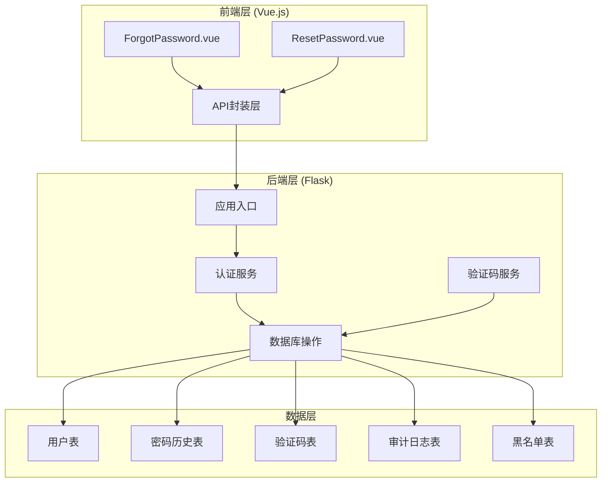

**图表来源**
- [app.py:1-50](file://python/app.py#L1-L50)
- [auth_service.py:9-18](file://python/src/auth_service.py#L9-L18)
- [notification_db.py:44-103](file://python/src/notification_db.py#L44-L103)

**章节来源**
- [app.py:1-50](file://python/app.py#L1-L50)
- [auth_service.py:9-18](file://python/src/auth_service.py#L9-L18)
- [notification_db.py:44-103](file://python/src/notification_db.py#L44-L103)

## 核心组件

### 密码哈希与验证组件

系统使用 bcrypt 库实现安全的密码哈希和验证机制：

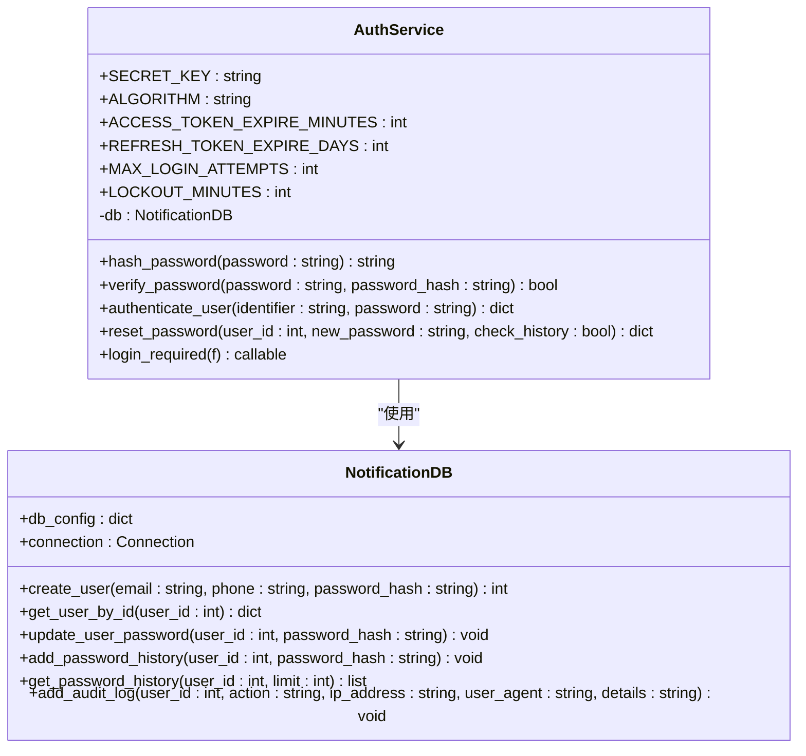

**图表来源**
- [auth_service.py:9-187](file://python/src/auth_service.py#L9-L187)
- [notification_db.py:6-357](file://python/src/notification_db.py#L6-L357)

### 密码强度验证组件

前端实现了多层次的密码强度验证机制：

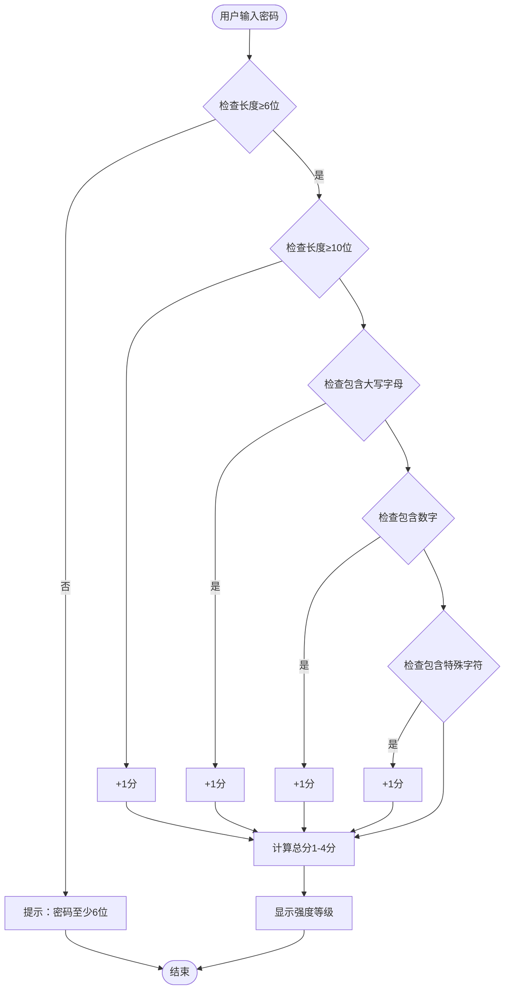

**图表来源**
- [ResetPassword.vue:143-151](file://python-web/src/views/ResetPassword.vue#L143-L151)
- [Register.vue:171-179](file://python-web/src/views/Register.vue#L171-L179)

**章节来源**
- [auth_service.py:20-25](file://python/src/auth_service.py#L20-L25)
- [auth_service.py:138-156](file://python/src/auth_service.py#L138-L156)
- [ResetPassword.vue:143-151](file://python-web/src/views/ResetPassword.vue#L143-L151)

## 架构概览

系统采用分层架构设计，确保密码安全机制的完整性和可维护性：

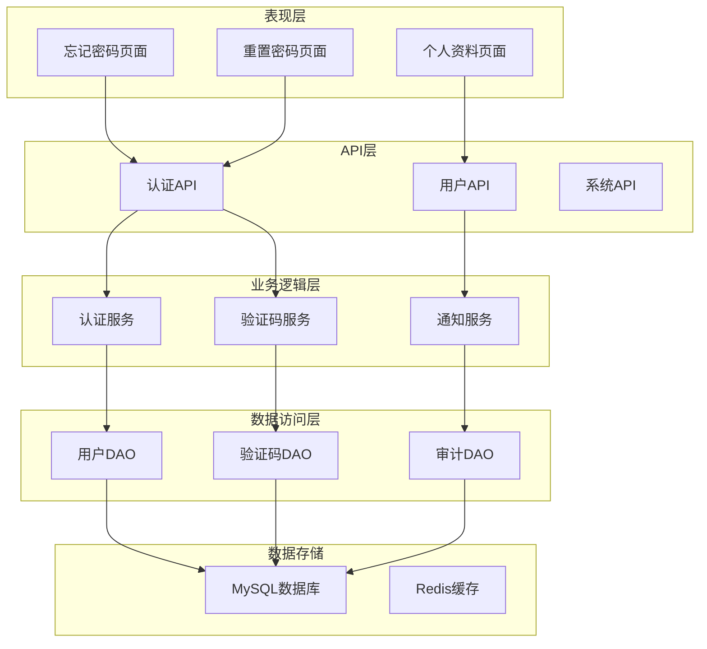

**图表来源**
- [index.js:61-86](file://python-web/src/api/index.js#L61-L86)
- [auth_service.py:9-18](file://python/src/auth_service.py#L9-L18)
- [notification_db.py:6-357](file://python/src/notification_db.py#L6-L357)

## 详细组件分析

### 密码哈希算法实现

系统使用 bcrypt 库实现安全的密码哈希，具有以下特点：

#### 密码哈希流程

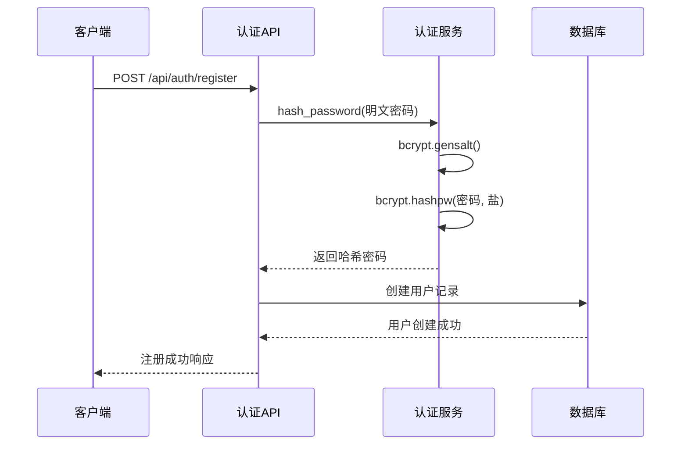

**图表来源**
- [auth_service.py:20-22](file://python/src/auth_service.py#L20-L22)
- [app.py:77-83](file://python/app.py#L77-L83)

#### 密码验证流程

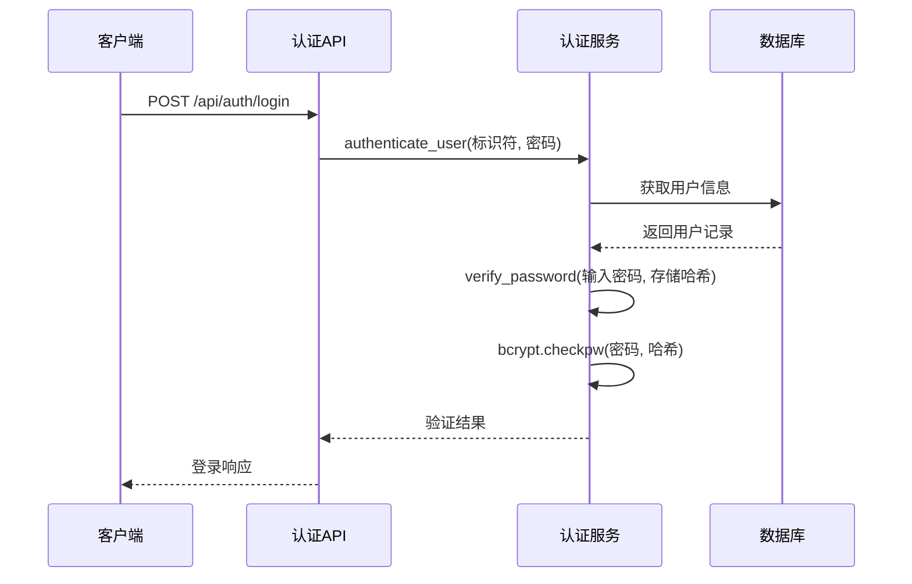

**图表来源**
- [auth_service.py:24](file://python/src/auth_service.py#L24)
- [auth_service.py:76-118](file://python/src/auth_service.py#L76-L118)

**章节来源**
- [auth_service.py:20-25](file://python/src/auth_service.py#L20-L25)
- [auth_service.py:76-118](file://python/src/auth_service.py#L76-L118)

### 密码强度验证机制

系统实现了多层次的密码强度验证，包括前端实时验证和后端强制验证：

#### 前端密码强度检测

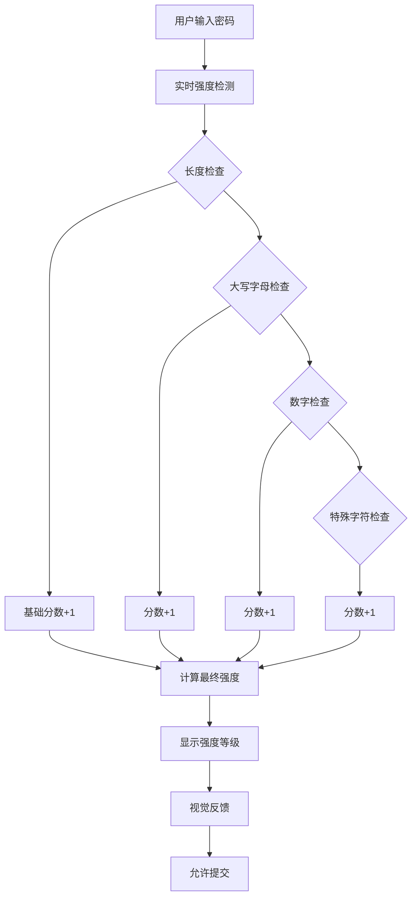

**图表来源**
- [ResetPassword.vue:123-151](file://python-web/src/views/ResetPassword.vue#L123-L151)
- [Register.vue:171-179](file://python-web/src/views/Register.vue#L171-L179)

#### 后端密码验证策略

后端实施严格的密码验证规则：

| 验证规则 | 条件 | 描述 |
|---------|------|------|
| 最小长度 | ≥6字符 | 基础安全要求 |
| 大小写混合 | 必须包含 | 增加复杂度 |
| 数字包含 | 必须包含 | 提高破解难度 |
| 特殊字符 | 可选但推荐 | 最佳安全实践 |
| 重复字符限制 | ≤3个连续 | 防止简单模式 |

**章节来源**
- [ResetPassword.vue:143-151](file://python-web/src/views/ResetPassword.vue#L143-L151)
- [Register.vue:171-179](file://python-web/src/views/Register.vue#L171-L179)
- [app.py:65-66](file://python/app.py#L65-L66)

### 历史密码检查机制

系统实现了智能的历史密码检查，防止用户重复使用近期使用过的密码：

#### 密码轮换流程

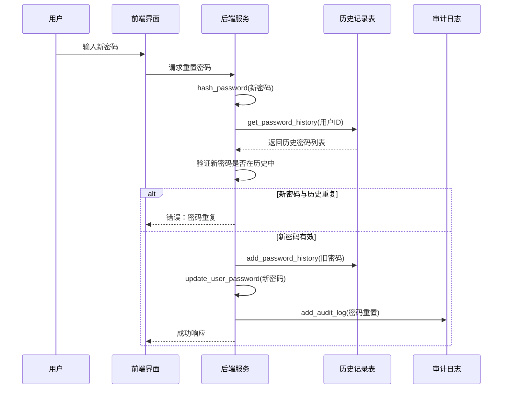

**图表来源**
- [auth_service.py:138-156](file://python/src/auth_service.py#L138-L156)
- [notification_db.py:313-332](file://python/src/notification_db.py#L313-L332)

#### 历史密码管理策略

| 策略名称 | 参数 | 描述 |
|---------|------|------|
| 历史记录数量 | 默认5条 | 平衡安全性与用户体验 |
| 存储方式 | 明文存储 | bcrypt哈希值存储 |
| 检查范围 | 全部历史记录 | 确保完全避免重复 |
| 更新时机 | 成功重置后 | 保持最新状态 |

**章节来源**
- [auth_service.py:145-150](file://python/src/auth_service.py#L145-L150)
- [notification_db.py:323-332](file://python/src/notification_db.py#L323-L332)

### 密码重置流程

系统提供了安全的密码重置流程，包含多步骤验证和安全保护：

#### 完整密码重置流程

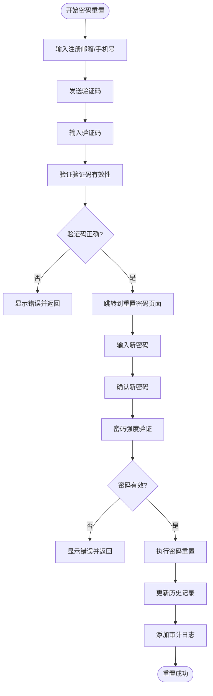

**图表来源**
- [ForgotPassword.vue:130-153](file://python-web/src/views/ForgotPassword.vue#L130-L153)
- [ForgotPassword.vue:159-190](file://python-web/src/views/ForgotPassword.vue#L159-L190)
- [ResetPassword.vue:184-205](file://python-web/src/views/ResetPassword.vue#L184-L205)

#### 前端交互流程

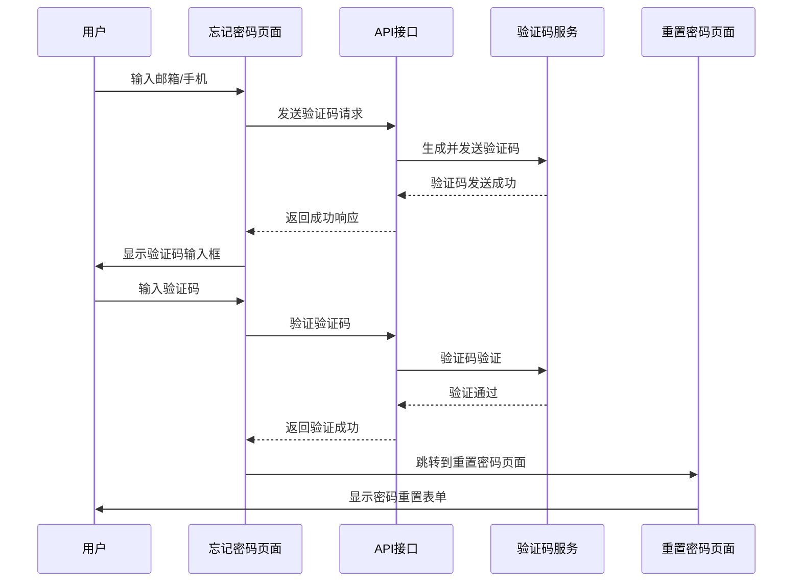

**图表来源**
- [ForgotPassword.vue:130-190](file://python-web/src/views/ForgotPassword.vue#L130-L190)
- [ResetPassword.vue:211-216](file://python-web/src/views/ResetPassword.vue#L211-L216)

**章节来源**
- [ForgotPassword.vue:130-190](file://python-web/src/views/ForgotPassword.vue#L130-L190)
- [ResetPassword.vue:184-205](file://python-web/src/views/ResetPassword.vue#L184-L205)

### 安全审计功能

系统实现了全面的安全审计功能，记录所有重要的安全相关事件：

#### 审计日志类型

| 日志类型 | 触发条件 | 记录内容 |
|---------|----------|----------|
| REGISTER | 用户注册 | 用户名、IP地址、User-Agent |
| LOGIN | 用户登录 | 用户名、IP地址、登录结果 |
| RESET_PASSWORD | 密码重置 | 用户ID、IP地址、重置详情 |
| LOGOUT | 用户登出 | 用户名、IP地址、登出时间 |
| PASSWORD_CHANGE | 密码修改 | 用户ID、修改原因、IP地址 |

#### 审计日志存储结构

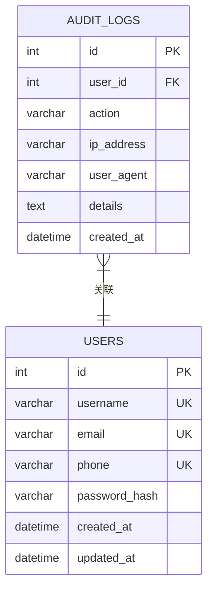

**图表来源**
- [notification_db.py:93-103](file://python/src/notification_db.py#L93-L103)
- [notification_db.py:334-342](file://python/src/notification_db.py#L334-L342)

**章节来源**
- [app.py:85-91](file://python/app.py#L85-L91)
- [app.py:112-118](file://python/app.py#L112-L118)
- [app.py:228-234](file://python/app.py#L228-L234)

### 安全策略配置

系统提供了灵活的安全策略配置选项：

#### 账户安全配置

| 配置项 | 默认值 | 描述 | 安全影响 |
|-------|--------|------|----------|
| 最大登录尝试次数 | 5次 | 防止暴力破解 | 高 |
| 账户锁定时长 | 15分钟 | 限制攻击窗口 | 高 |
| 访问令牌有效期 | 30分钟 | 最小化令牌风险 | 中 |
| 刷新令牌有效期 | 7天 | 平衡便利性与安全 | 中 |
| 历史密码检查 | 启用 | 防止密码循环 | 高 |

#### 密码安全配置

| 配置项 | 默认值 | 描述 | 安全影响 |
|-------|--------|------|----------|
| 最小密码长度 | 6字符 | 基础安全要求 | 中 |
| 大小写混合 | 强制 | 增加复杂度 | 中 |
| 数字包含 | 强制 | 提高破解难度 | 中 |
| 特殊字符 | 推荐 | 最佳实践 | 高 |
| 历史密码保留 | 5条 | 平衡安全性 | 高 |

**章节来源**
- [auth_service.py:10-15](file://python/src/auth_service.py#L10-L15)
- [app.py:65-66](file://python/app.py#L65-L66)

## 依赖关系分析

系统各组件之间的依赖关系清晰明确：

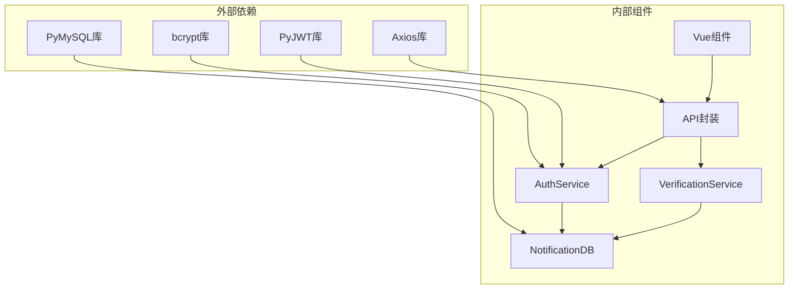

**图表来源**
- [auth_service.py:1](file://python/src/auth_service.py#L1)
- [notification_db.py:2](file://python/src/notification_db.py#L2)
- [index.js:1](file://python-web/src/api/index.js#L1)

**章节来源**
- [auth_service.py:1](file://python/src/auth_service.py#L1)
- [notification_db.py:2](file://python/src/notification_db.py#L2)
- [index.js:1](file://python-web/src/api/index.js#L1)

## 性能考虑

系统在保证安全性的同时，也考虑了性能优化：

### 密码哈希性能

- bcrypt 默认成本因子为12，提供良好的安全与性能平衡
- 哈希操作在内存中完成，避免频繁的磁盘I/O
- 支持异步处理，不影响主线程性能

### 缓存策略

- 用户会话信息缓存到 Redis
- 验证码短期缓存，减少数据库查询
- 审计日志批量写入，降低数据库压力

### 数据库优化

- 密码历史表按用户ID和创建时间建立索引
- 审计日志表按时间倒序查询优化
- 连接池管理，提高数据库连接效率

## 故障排除指南

### 常见问题及解决方案

#### 密码重置失败

**问题症状**：用户无法重置密码
**可能原因**：
- 验证码过期或无效
- 新密码不符合安全要求
- 历史密码检查触发

**解决步骤**：
1. 检查验证码是否在有效期内
2. 验证新密码长度和复杂度
3. 确认新密码与历史密码不同
4. 查看系统日志获取详细错误信息

#### 登录失败锁定

**问题症状**：账户被临时锁定
**可能原因**：
- 连续多次密码错误
- 账户被恶意攻击
- 系统自动防护机制

**解决步骤**：
1. 等待锁定时间结束（默认15分钟）
2. 检查是否有异常登录活动
3. 联系系统管理员解锁
4. 修改密码增强安全性

#### 会话过期问题

**问题症状**：频繁需要重新登录
**可能原因**：
- 访问令牌过期
- 网络连接不稳定
- 浏览器Cookie问题

**解决步骤**：
1. 检查系统时间和网络连接
2. 清除浏览器Cookie和缓存
3. 确认刷新令牌正常工作
4. 检查客户端拦截器配置

**章节来源**
- [auth_service.py:82-97](file://python/src/auth_service.py#L82-L97)
- [index.js:22-59](file://python-web/src/api/index.js#L22-L59)

## 结论

本密码安全机制实现了企业级的安全标准，具有以下优势：

### 安全特性
- 基于 bcrypt 的强密码哈希算法
- 多层次密码强度验证
- 智能的历史密码检查
- 完整的安全审计功能
- 智能的账户锁定机制

### 技术优势
- 模块化设计，易于维护和扩展
- 前后端分离架构，提升开发效率
- 完善的错误处理和日志记录
- 灵活的安全策略配置

### 最佳实践建议
1. 定期更新安全策略配置
2. 监控异常登录活动
3. 定期审查审计日志
4. 实施多因素认证
5. 定期进行安全评估

该系统为用户提供了安全可靠的密码管理体验，同时为开发者提供了清晰的扩展接口和完善的监控机制。