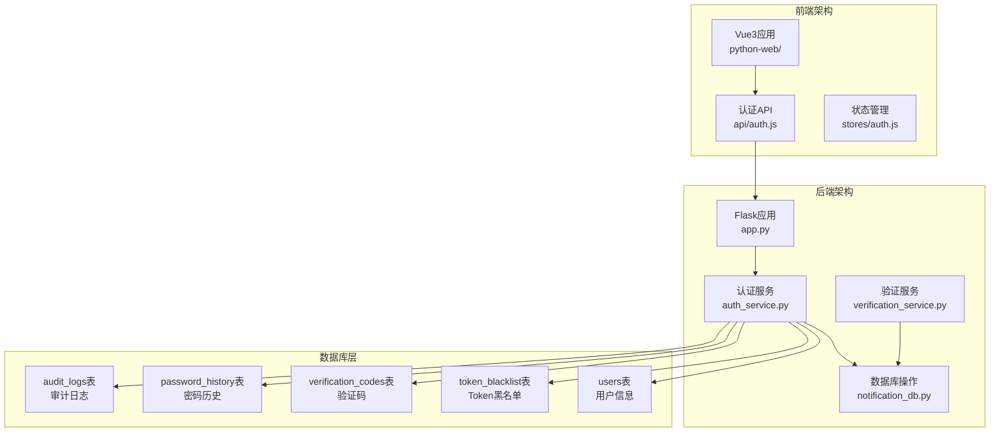
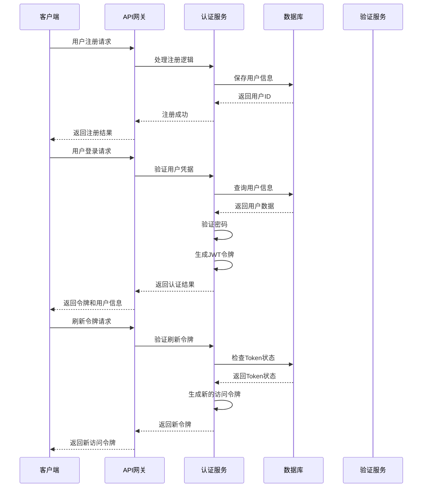
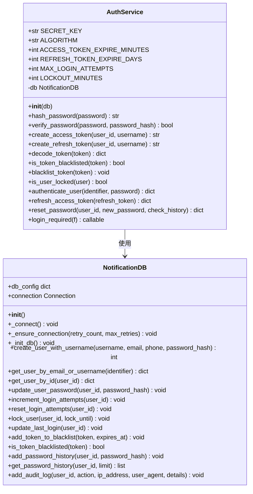
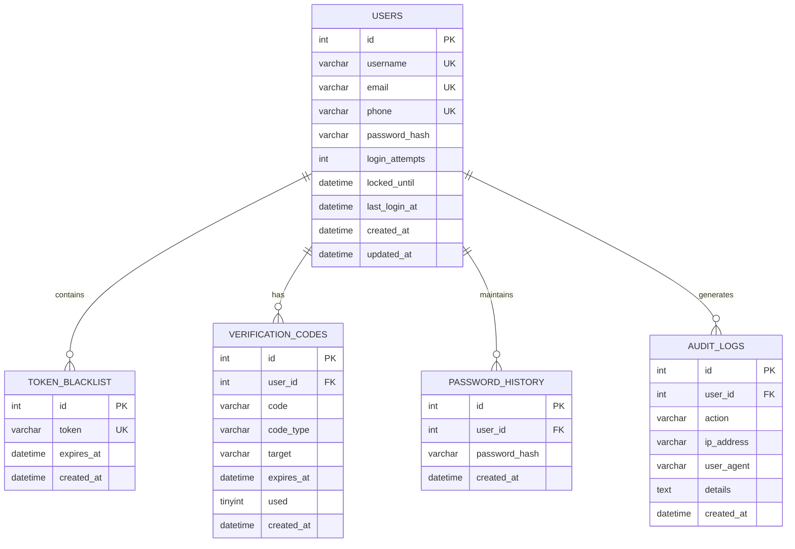
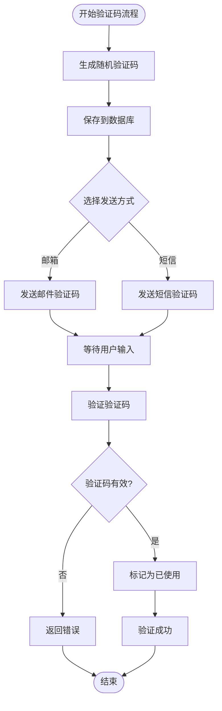
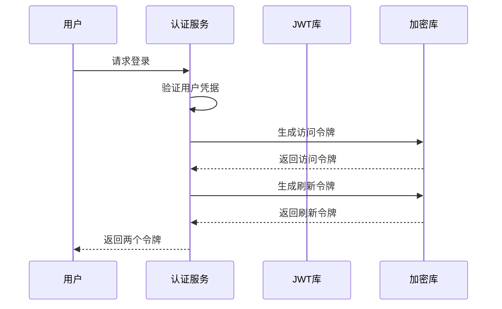
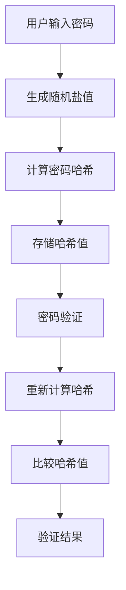
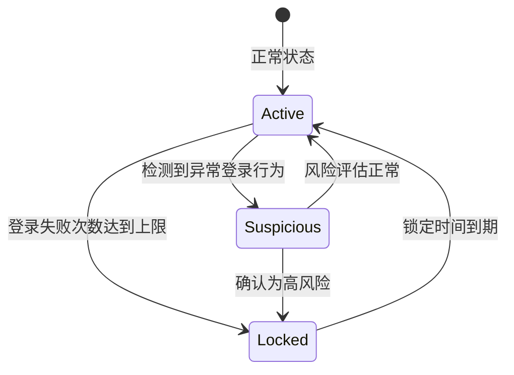
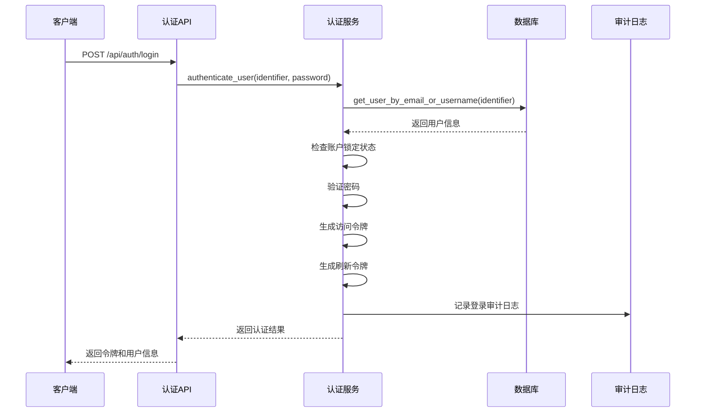
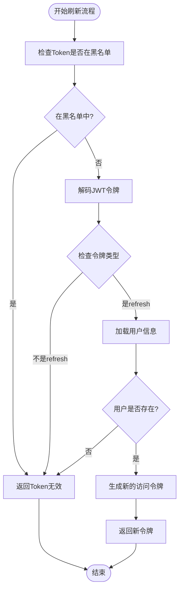

# 用户认证系统

<cite>
**本文档引用的文件**
- [auth_service.py](file://python/src/auth_service.py)
- [notification_db.py](file://python/src/notification_db.py)
- [verification_service.py](file://python/src/notifications/verification_service.py)
- [app.py](file://python/app.py)
- [auth_server.py](file://python/auth_server.py)
- [PROJECT_README.md](file://PROJECT_README.md)
- [models.py](file://python/src/models.py)
- [algorithms.py](file://python/src/algorithms.py)
- [utils.py](file://python/src/utils.py)
</cite>

## 目录
1. [简介](#简介)
2. [项目结构](#项目结构)
3. [核心组件](#核心组件)
4. [架构概览](#架构概览)
5. [详细组件分析](#详细组件分析)
6. [JWT令牌机制详解](#jwt令牌机制详解)
7. [密码哈希与安全策略](#密码哈希与安全策略)
8. [用户登录流程](#用户登录流程)
9. [API接口文档](#api接口文档)
10. [安全最佳实践](#安全最佳实践)
11. [性能考虑](#性能考虑)
12. [故障排除指南](#故障排除指南)
13. [结论](#结论)

## 简介

用户认证系统是一个基于Python Flask + Vue3的可视化爬虫管理系统的核心组成部分，提供了完整的用户身份验证、授权管理和安全防护功能。该系统采用JWT（JSON Web Token）技术实现无状态认证，结合bcrypt密码哈希算法和多层安全策略，确保用户数据的安全性和系统的可靠性。

系统主要功能包括：
- 用户注册与登录（支持用户名/邮箱登录）
- JWT Token认证（Access Token + Refresh Token）
- Token自动刷新机制
- 密码加密存储与历史记录
- 登录失败次数限制与账户锁定
- 验证码发送与验证流程
- 安全审计日志记录
- 统一API响应格式

## 项目结构

该项目采用前后端分离架构，后端使用Python Flask框架，前端使用Vue3技术栈。认证系统位于后端的`python/src/`目录下，包含认证服务、数据库操作和通知模块。



**图表来源**
- [app.py:1-50](file://python/app.py#L1-L50)
- [auth_service.py:9-187](file://python/src/auth_service.py#L9-L187)
- [notification_db.py:6-105](file://python/src/notification_db.py#L6-L105)

**章节来源**
- [PROJECT_README.md:63-97](file://PROJECT_README.md#L63-L97)
- [app.py:18-28](file://python/app.py#L18-L28)

## 核心组件

### 认证服务类（AuthService）

认证服务类是整个认证系统的核心，负责处理用户认证、令牌生成、密码验证和安全策略执行。该类实现了完整的JWT认证流程，包括访问令牌和刷新令牌的生成与验证。

### 数据库操作类（NotificationDB）

数据库操作类封装了所有与用户数据相关的数据库操作，包括用户信息管理、Token黑名单、验证码管理和审计日志记录。该类使用PyMySQL连接MySQL数据库，提供事务安全的数据操作。

### 验证服务类（VerificationService）

验证服务类负责处理验证码的生成、发送和验证流程，支持邮箱和短信两种验证方式。该类与外部邮件和短信服务集成，提供灵活的验证机制。

**章节来源**
- [auth_service.py:9-187](file://python/src/auth_service.py#L9-L187)
- [notification_db.py:6-357](file://python/src/notification_db.py#L6-L357)
- [verification_service.py:7-108](file://python/src/notifications/verification_service.py#L7-L108)

## 架构概览

系统采用分层架构设计，各层职责明确，便于维护和扩展。



**图表来源**
- [app.py:53-140](file://python/app.py#L53-L140)
- [auth_service.py:76-136](file://python/src/auth_service.py#L76-L136)

## 详细组件分析

### 认证服务类详细分析

认证服务类实现了完整的用户认证功能，包括密码加密、令牌生成、刷新机制和安全策略。



**图表来源**
- [auth_service.py:9-187](file://python/src/auth_service.py#L9-L187)
- [notification_db.py:6-357](file://python/src/notification_db.py#L6-L357)

#### 密码加密机制

系统使用bcrypt算法进行密码加密，确保密码的安全存储。bcrypt具有以下特点：
- 自动生成盐值（salt）
- 防止彩虹表攻击
- 可调节的成本参数
- 单向加密算法

#### 令牌生成与验证

系统采用JWT（JSON Web Token）技术实现无状态认证，支持两种类型的令牌：

1. **访问令牌（Access Token）**
   - 短期有效（默认30分钟）
   - 用于API访问授权
   - 包含用户标识和权限信息

2. **刷新令牌（Refresh Token）**
   - 长期有效（默认7天）
   - 用于获取新的访问令牌
   - 支持令牌续期

**章节来源**
- [auth_service.py:20-56](file://python/src/auth_service.py#L20-L56)
- [auth_service.py:27-45](file://python/src/auth_service.py#L27-L45)
- [auth_service.py:47-56](file://python/src/auth_service.py#L47-L56)

### 数据库层详细分析

数据库层使用PyMySQL连接MySQL数据库，提供事务安全的数据操作。系统包含多个核心表，每个表都有特定的用途和约束。



**图表来源**
- [notification_db.py:44-103](file://python/src/notification_db.py#L44-L103)

#### 用户表结构

用户表包含用户的基本信息和安全相关字段：
- 用户标识信息：用户名、邮箱、手机号
- 安全字段：密码哈希、登录失败次数、锁定时间
- 时间戳：创建时间、最后登录时间、更新时间

#### Token黑名单机制

Token黑名单机制用于撤销已发放但不再有效的令牌，实现即时的令牌失效功能。

**章节来源**
- [notification_db.py:44-103](file://python/src/notification_db.py#L44-L103)
- [notification_db.py:297-311](file://python/src/notification_db.py#L297-L311)

### 验证服务类详细分析

验证服务类负责处理验证码的完整生命周期，从生成到验证的全过程管理。



**图表来源**
- [verification_service.py:22-101](file://python/src/notifications/verification_service.py#L22-L101)

**章节来源**
- [verification_service.py:22-101](file://python/src/notifications/verification_service.py#L22-L101)

## JWT令牌机制详解

### 令牌结构与字段

JWT令牌由三部分组成：头部（Header）、载荷（Payload）、签名（Signature）。系统使用的令牌包含以下关键字段：

#### 访问令牌字段
- `sub`: 用户标识符（字符串形式）
- `username`: 用户名
- `type`: 令牌类型（access）
- `exp`: 过期时间（Unix时间戳）

#### 刷新令牌字段
- `sub`: 用户标识符（字符串形式）
- `username`: 用户名
- `type`: 令牌类型（refresh）
- `exp`: 过期时间（Unix时间戳）

### 令牌生成流程



**图表来源**
- [auth_service.py:27-45](file://python/src/auth_service.py#L27-L45)

### 令牌验证机制

系统提供多层令牌验证机制：

1. **格式验证**：检查令牌是否符合JWT格式
2. **签名验证**：验证令牌签名的有效性
3. **过期时间检查**：确认令牌未过期
4. **黑名单检查**：验证令牌未被加入黑名单

**章节来源**
- [auth_service.py:47-56](file://python/src/auth_service.py#L47-L56)
- [auth_service.py:120-136](file://python/src/auth_service.py#L120-L136)

## 密码哈希与安全策略

### bcrypt密码加密

系统使用bcrypt算法进行密码加密，bcrypt具有以下安全特性：

#### 密码加密流程


**图表来源**
- [auth_service.py:20-25](file://python/src/auth_service.py#L20-L25)

#### 密码强度要求
- 最小长度：6个字符
- 强制设置：注册时必须设置密码
- 历史检查：防止重复使用最近使用的密码

### 登录安全策略

系统实施多层次的登录安全策略：

#### 登录失败保护
- **失败次数限制**：默认最多允许5次失败登录
- **自动锁定**：达到失败次数后账户锁定15分钟
- **智能解锁**：锁定时间到期后自动解锁

#### 账户锁定机制


**图表来源**
- [auth_service.py:67-74](file://python/src/auth_service.py#L67-L74)
- [auth_service.py:89-97](file://python/src/auth_service.py#L89-L97)

**章节来源**
- [auth_service.py:14-15](file://python/src/auth_service.py#L14-L15)
- [auth_service.py:89-97](file://python/src/auth_service.py#L89-L97)

## 用户登录流程

### 完整登录流程



**图表来源**
- [app.py:99-124](file://python/app.py#L99-L124)
- [auth_service.py:76-118](file://python/src/auth_service.py#L76-L118)

### 登录验证步骤

1. **输入验证**：检查用户名和密码是否为空
2. **用户查找**：根据用户名或邮箱查找用户
3. **账户状态检查**：验证账户是否被锁定
4. **密码验证**：使用bcrypt验证密码
5. **失败次数处理**：更新登录失败次数
6. **令牌生成**：生成访问和刷新令牌
7. **审计记录**：记录登录事件

### Token刷新流程



**图表来源**
- [auth_service.py:120-136](file://python/src/auth_service.py#L120-L136)

**章节来源**
- [app.py:126-139](file://python/app.py#L126-L139)
- [auth_service.py:120-136](file://python/src/auth_service.py#L120-L136)

## API接口文档

### 认证接口

#### 用户注册
- **URL**: `/api/auth/register`
- **方法**: POST
- **认证**: 无需认证
- **请求体**:
  ```json
  {
    "username": "string",
    "email": "string",
    "phone": "string",
    "password": "string"
  }
  ```
- **响应**:
  ```json
  {
    "success": true,
    "message": "注册成功",
    "data": {
      "user_id": 1
    }
  }
  ```

#### 用户登录
- **URL**: `/api/auth/login`
- **方法**: POST
- **认证**: 无需认证
- **请求体**:
  ```json
  {
    "identifier": "string",
    "password": "string"
  }
  ```
- **响应**:
  ```json
  {
    "success": true,
    "message": "登录成功",
    "data": {
      "access_token": "string",
      "refresh_token": "string",
      "user": {
        "id": 1,
        "username": "string",
        "email": "string",
        "phone": "string"
      }
    }
  }
  ```

#### 刷新令牌
- **URL**: `/api/auth/refresh`
- **方法**: POST
- **认证**: 无需认证
- **请求体**:
  ```json
  {
    "refresh_token": "string"
  }
  ```
- **响应**:
  ```json
  {
    "success": true,
    "data": {
      "access_token": "string"
    }
  }
  ```

#### 用户登出
- **URL**: `/api/auth/logout`
- **方法**: POST
- **认证**: 需要Access Token
- **请求体**:
  ```json
  {
    "refresh_token": "string"
  }
  ```
- **响应**:
  ```json
  {
    "success": true,
    "message": "登出成功"
  }
  ```

#### 发送重置验证码
- **URL**: `/api/auth/forgot-password/send-code`
- **方法**: POST
- **认证**: 无需认证
- **请求体**:
  ```json
  {
    "target": "string"
  }
  ```
- **响应**:
  ```json
  {
    "success": true,
    "message": "验证码已发送到邮箱",
    "data": {
      "user_id": 1,
      "target": "string",
      "expires_in": 300
    }
  }
  ```

#### 验证重置验证码
- **URL**: `/api/auth/forgot-password/verify-code`
- **方法**: POST
- **认证**: 无需认证
- **请求体**:
  ```json
  {
    "user_id": 1,
    "code": "string",
    "target": "string"
  }
  ```
- **响应**:
  ```json
  {
    "success": true,
    "message": "验证成功",
    "data": {
      "user_id": 1,
      "verified": true
    }
  }
  ```

#### 重置密码
- **URL**: `/api/auth/forgot-password/reset`
- **方法**: POST
- **认证**: 无需认证
- **请求体**:
  ```json
  {
    "user_id": 1,
    "new_password": "string"
  }
  ```
- **响应**:
  ```json
  {
    "success": true,
    "message": "密码重置成功"
  }
  ```

#### 修改密码
- **URL**: `/api/auth/change-password`
- **方法**: POST
- **认证**: 需要Access Token
- **请求体**:
  ```json
  {
    "old_password": "string",
    "new_password": "string"
  }
  ```
- **响应**:
  ```json
  {
    "success": true,
    "message": "密码修改成功"
  }
  ```

### 用户接口

#### 获取用户信息
- **URL**: `/api/user/profile`
- **方法**: GET
- **认证**: 需要Access Token
- **响应**:
  ```json
  {
    "success": true,
    "data": {
      "id": 1,
      "username": "string",
      "email": "string",
      "phone": "string",
      "last_login_at": "datetime",
      "created_at": "datetime"
    }
  }
  ```

**章节来源**
- [PROJECT_README.md:151-182](file://PROJECT_README.md#L151-L182)
- [app.py:53-275](file://python/app.py#L53-L275)

## 安全最佳实践

### 生产环境部署建议

#### 密钥管理
- **JWT密钥**：生产环境中必须修改默认密钥
- **环境变量**：使用环境变量存储敏感配置
- **密钥轮换**：定期更换加密密钥

#### CORS配置
- **白名单域名**：严格限制允许访问的域名
- **允许的方法**：仅开放必要的HTTP方法
- **允许的头**：限制允许的请求头

#### 数据库安全
- **连接池**：使用连接池管理数据库连接
- **SQL注入防护**：使用参数化查询
- **敏感数据加密**：对敏感字段进行额外加密

### 错误处理策略

系统实现了统一的错误处理机制：

#### 错误响应格式
```json
{
  "success": false,
  "message": "错误描述",
  "code": "错误码",
  "error": "详细错误信息"
}
```

#### 常见错误码
- `USER_NOT_FOUND`: 用户不存在
- `INVALID_PASSWORD`: 密码错误
- `ACCOUNT_LOCKED`: 账户被锁定
- `TOKEN_INVALID`: 令牌无效
- `TOKEN_MISSING`: 缺少令牌

### 审计日志

系统记录所有重要的安全相关事件：

#### 审计日志类型
- 用户注册
- 用户登录
- 密码重置
- 密码修改
- 用户登出
- Token刷新

**章节来源**
- [PROJECT_README.md:258-280](file://PROJECT_README.md#L258-L280)
- [notification_db.py:334-342](file://python/src/notification_db.py#L334-L342)

## 性能考虑

### 缓存策略

系统可以进一步优化性能：

#### Token缓存
- **内存缓存**：使用Redis缓存常用用户信息
- **本地缓存**：使用Flask的session缓存短期数据
- **缓存失效**：合理设置缓存过期时间

#### 数据库优化
- **索引优化**：为常用查询字段建立索引
- **连接池**：使用连接池减少连接开销
- **查询优化**：避免N+1查询问题

### 并发处理

#### 令牌并发安全
- **原子操作**：使用数据库事务保证操作原子性
- **锁机制**：在高并发场景下使用适当的锁
- **重试机制**：实现幂等操作和重试逻辑

## 故障排除指南

### 常见问题诊断

#### 登录失败问题
1. **检查用户状态**：确认用户账户未被锁定
2. **验证密码**：确认密码正确且未过期
3. **检查令牌**：验证Access Token和Refresh Token状态

#### 数据库连接问题
1. **检查连接配置**：确认数据库连接参数正确
2. **验证网络连通性**：确认数据库服务器可达
3. **检查权限**：确认数据库用户权限足够

#### 验证码问题
1. **检查发送服务**：确认邮件或短信服务配置正确
2. **验证过期时间**：确认验证码未过期
3. **检查目标地址**：确认邮箱或手机号格式正确

### 调试技巧

#### 日志分析
- **启用详细日志**：在开发环境中启用详细日志输出
- **监控错误**：使用日志监控工具跟踪错误模式
- **性能分析**：分析慢查询和性能瓶颈

#### 测试策略
- **单元测试**：为关键功能编写单元测试
- **集成测试**：测试完整的用户流程
- **压力测试**：模拟高并发场景

**章节来源**
- [auth_server.py:113-120](file://python/auth_server.py#L113-L120)
- [auth_server.py:151-158](file://python/auth_server.py#L151-L158)

## 结论

用户认证系统是一个功能完整、安全可靠的认证解决方案。系统采用现代的JWT技术、bcrypt密码加密和多层安全策略，为用户提供了安全便捷的身份验证体验。

### 系统优势

1. **安全性强**：采用bcrypt加密、JWT令牌、账户锁定等多重安全措施
2. **易用性好**：提供完整的用户认证流程和友好的错误提示
3. **可扩展性强**：模块化设计便于功能扩展和定制
4. **性能优秀**：合理的架构设计支持高并发访问

### 改进建议

1. **增强监控**：添加更详细的性能监控和告警机制
2. **多因素认证**：考虑添加短信或邮箱的二次验证
3. **审计增强**：增加更详细的审计日志和合规报告
4. **API版本化**：实现API版本管理以便平滑升级

该系统为后续的功能扩展奠定了良好的基础，可以轻松集成更多业务功能，如权限管理、角色控制、会话管理等高级特性。