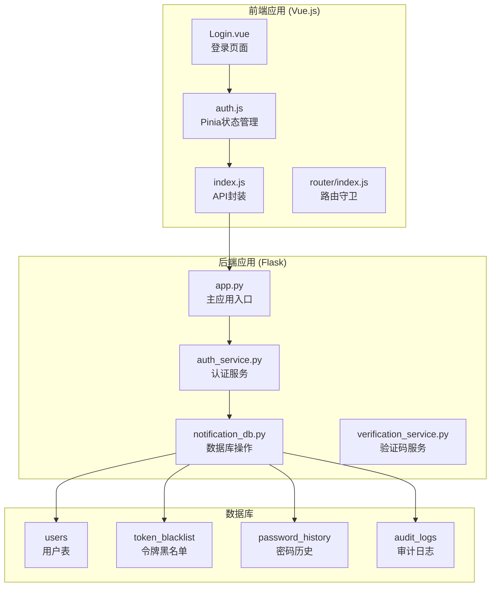
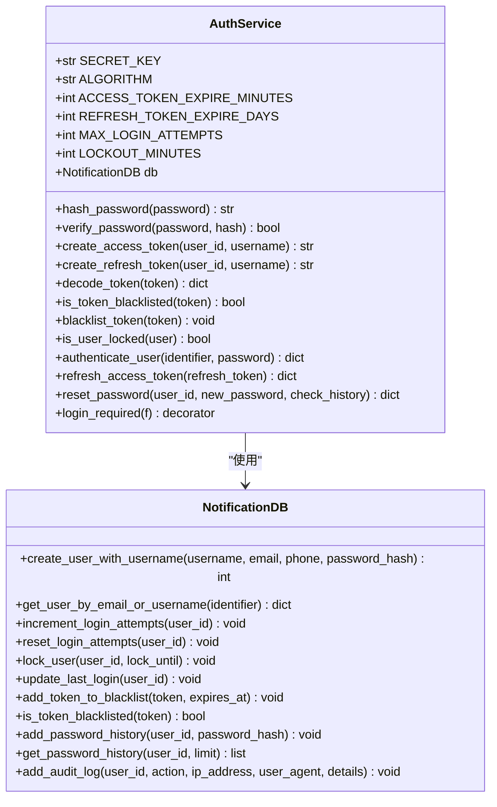
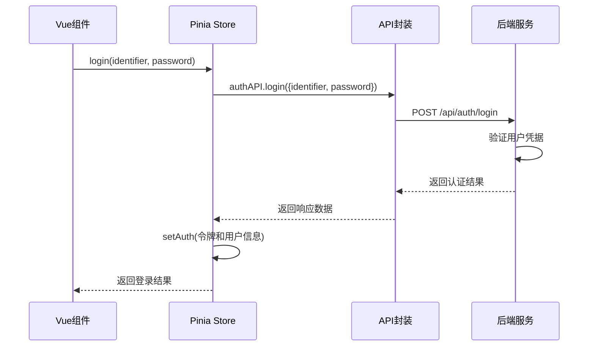
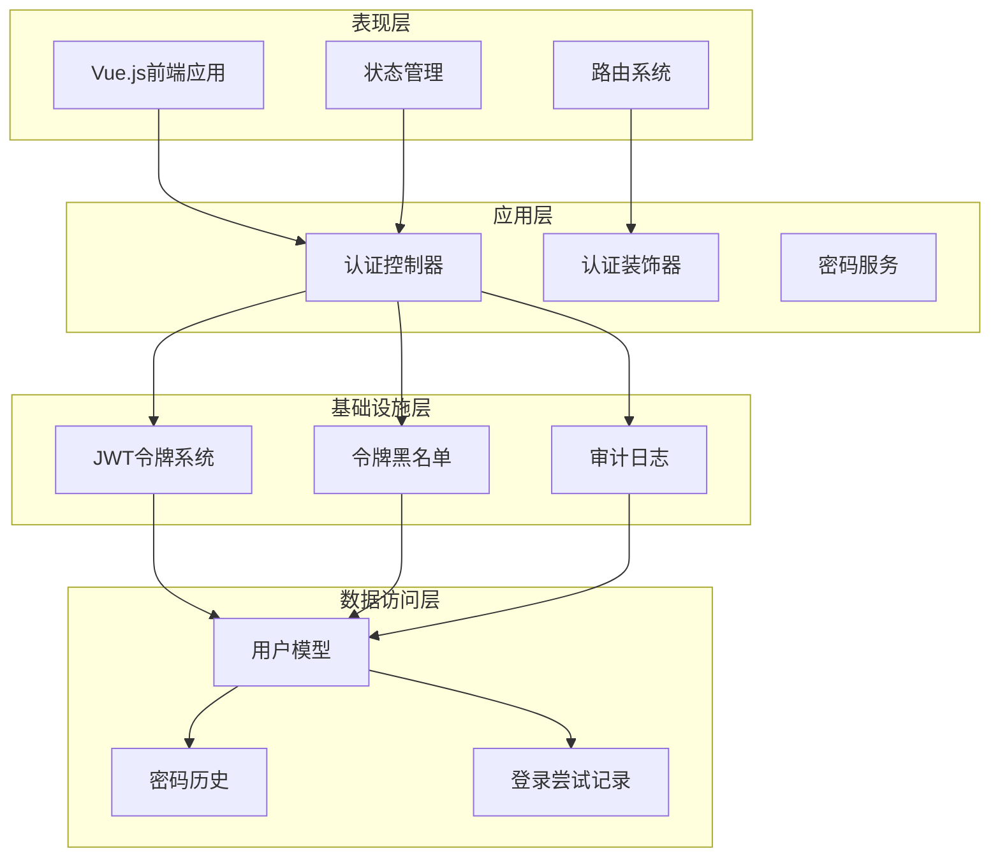
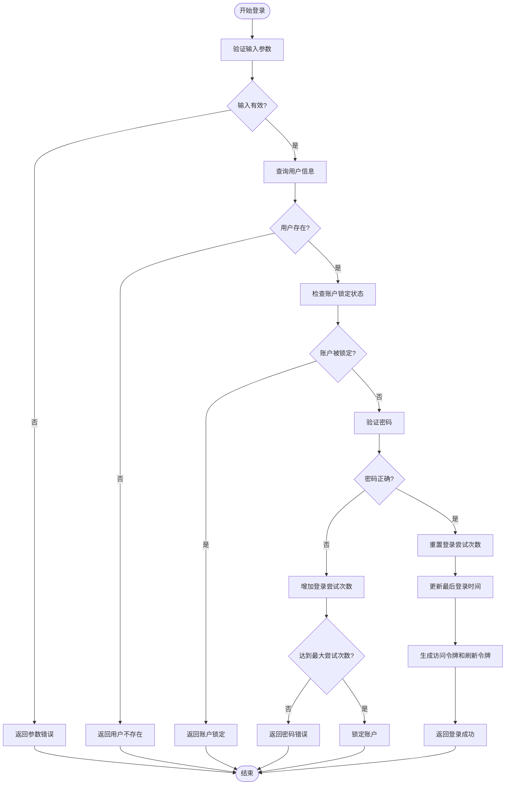
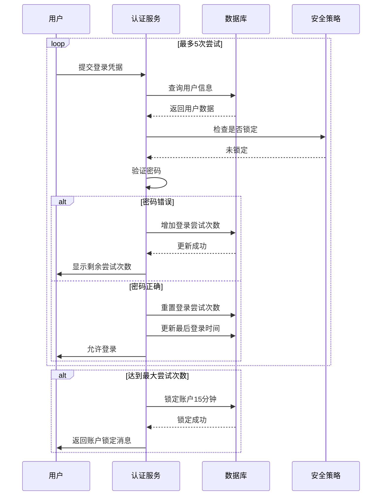
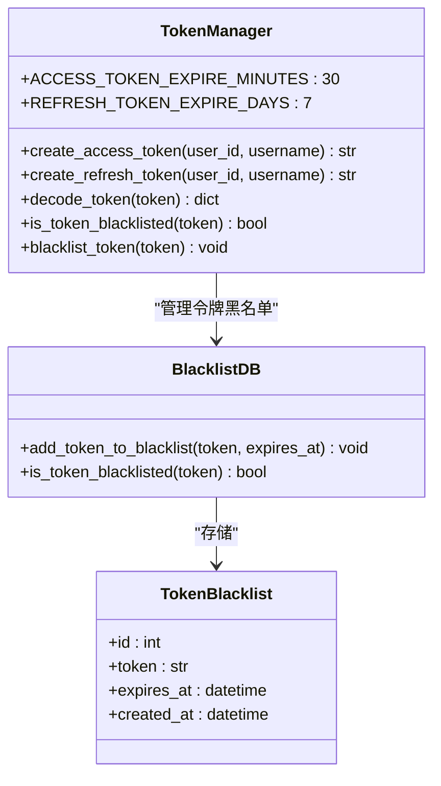
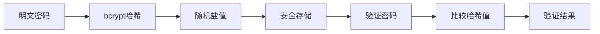
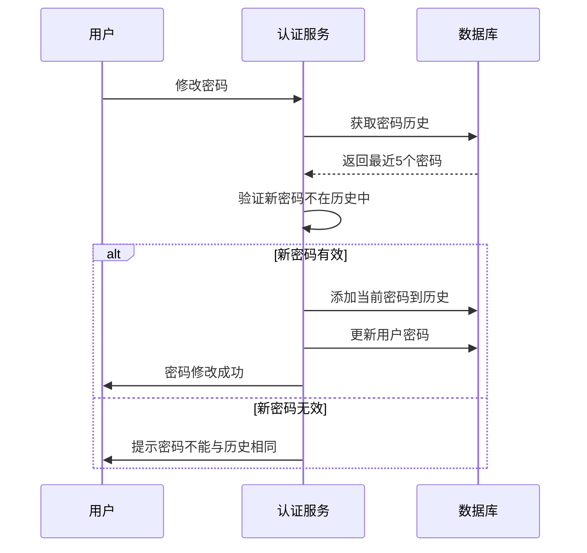

# 登录认证流程

<cite>
**本文档引用的文件**
- [app.py](file://python/app.py)
- [auth_server.py](file://python/auth_server.py)
- [auth_service.py](file://python/src/auth_service.py)
- [notification_db.py](file://python/src/notification_db.py)
- [verification_service.py](file://python/src/notifications/verification_service.py)
- [Login.vue](file://python-web/src/views/Login.vue)
- [auth.js](file://python-web/src/stores/auth.js)
- [index.js](file://python-web/src/api/index.js)
- [index.js](file://python-web/src/router/index.js)
</cite>

## 目录
1. [简介](#简介)
2. [项目结构](#项目结构)
3. [核心组件](#核心组件)
4. [架构概览](#架构概览)
5. [详细组件分析](#详细组件分析)
6. [登录API接口文档](#登录api接口文档)
7. [错误码说明](#错误码说明)
8. [安全防护措施](#安全防护措施)
9. [故障排除指南](#故障排除指南)
10. [结论](#结论)

## 简介

本项目是一个基于Flask和Vue.js构建的完整认证系统，提供了用户登录、注册、密码管理等核心功能。系统采用JWT令牌认证机制，实现了完善的账户安全保护，包括登录尝试限制、账户锁定机制、密码历史验证等功能。

系统分为前后端分离的架构：
- **后端**：Python Flask应用，提供RESTful API接口
- **前端**：Vue.js单页应用，提供用户界面和状态管理

## 项目结构



**图表来源**
- [app.py:1-1719](file://python/app.py#L1-L1719)
- [auth_service.py:1-187](file://python/src/auth_service.py#L1-L187)
- [notification_db.py:1-357](file://python/src/notification_db.py#L1-L357)

**章节来源**
- [app.py:1-1719](file://python/app.py#L1-L1719)
- [auth_server.py:1-431](file://python/auth_server.py#L1-L431)

## 核心组件

### 认证服务 (AuthService)

认证服务是整个系统的中枢，负责处理所有认证相关的逻辑：



**图表来源**
- [auth_service.py:9-187](file://python/src/auth_service.py#L9-L187)
- [notification_db.py:6-357](file://python/src/notification_db.py#L6-L357)

### 前端状态管理



**图表来源**
- [Login.vue:100-119](file://python-web/src/views/Login.vue#L100-L119)
- [auth.js:30-36](file://python-web/src/stores/auth.js#L30-L36)
- [index.js:61-86](file://python-web/src/api/index.js#L61-L86)

**章节来源**
- [auth_service.py:9-187](file://python/src/auth_service.py#L9-L187)
- [auth.js:1-74](file://python-web/src/stores/auth.js#L1-74)

## 架构概览

系统采用分层架构设计，确保关注点分离和代码可维护性：



**图表来源**
- [app.py:99-124](file://python/app.py#L99-L124)
- [auth_service.py:158-183](file://python/src/auth_service.py#L158-L183)

## 详细组件分析

### 登录流程实现

登录流程是系统最核心的功能，涉及多个安全检查和状态更新：



**图表来源**
- [auth_service.py:76-118](file://python/src/auth_service.py#L76-L118)
- [notification_db.py:261-295](file://python/src/notification_db.py#L261-L295)

### 账户锁定机制

系统实现了智能的账户锁定机制，防止暴力破解攻击：



**图表来源**
- [auth_service.py:88-97](file://python/src/auth_service.py#L88-L97)
- [notification_db.py:261-286](file://python/src/notification_db.py#L261-L286)

### 令牌管理系统

系统使用JWT令牌进行身份验证，支持访问令牌和刷新令牌：



**图表来源**
- [auth_service.py:27-66](file://python/src/auth_service.py#L27-L66)
- [notification_db.py:297-312](file://python/src/notification_db.py#L297-L312)

**章节来源**
- [auth_service.py:76-137](file://python/src/auth_service.py#L76-L137)
- [notification_db.py:261-312](file://python/src/notification_db.py#L261-L312)

## 登录API接口文档

### 基础信息

- **基础URL**: `http://localhost:5000/api`
- **内容类型**: `application/json`
- **认证方式**: Bearer Token
- **CORS配置**: 支持本地开发环境跨域请求

### 登录接口

#### 请求地址
`POST /auth/login`

#### 请求参数
| 参数名 | 类型 | 必填 | 描述 |
|--------|------|------|------|
| identifier | string | 是 | 用户名或邮箱 |
| password | string | 是 | 用户密码 |

#### 成功响应
```json
{
  "success": true,
  "message": "登录成功",
  "data": {
    "access_token": "eyJhbGciOiJIUzI1NiIsInR5cCI6IkpXVCJ9...",
    "refresh_token": "eyJhbGciOiJIUzI1NiIsInR5cCI6IkpXVCJ9...",
    "user": {
      "id": 1,
      "username": "john_doe",
      "email": "john@example.com",
      "phone": "13800138000"
    }
  }
}
```

#### 失败响应
```json
{
  "success": false,
  "message": "密码错误，还剩2次尝试机会",
  "code": "INVALID_PASSWORD"
}
```

### 刷新令牌接口

#### 请求地址
`POST /auth/refresh`

#### 请求参数
| 参数名 | 类型 | 必填 | 描述 |
|--------|------|------|------|
| refresh_token | string | 是 | 刷新令牌 |

#### 成功响应
```json
{
  "success": true,
  "data": {
    "access_token": "eyJhbGciOiJIUzI1NiIsInR5cCI6IkpXVCJ9..."
  }
}
```

### 登出接口

#### 请求地址
`POST /auth/logout`

#### 请求参数
| 参数名 | 类型 | 必填 | 描述 |
|--------|------|------|------|
| refresh_token | string | 否 | 刷新令牌 |

#### 成功响应
```json
{
  "success": true,
  "message": "登出成功"
}
```

### 使用示例

#### 成功登录场景
```javascript
// 前端调用示例
const loginData = {
  identifier: "john_doe",
  password: "secure_password"
};

try {
  const response = await authAPI.login(loginData);
  if (response.data.success) {
    // 存储令牌和用户信息
    localStorage.setItem('access_token', response.data.data.access_token);
    localStorage.setItem('refresh_token', response.data.data.refresh_token);
    localStorage.setItem('user', JSON.stringify(response.data.data.user));
    
    // 跳转到首页
    router.push('/');
  }
} catch (error) {
  console.error('登录失败:', error);
}
```

#### 失败处理场景
```javascript
// 处理不同类型的登录错误
switch(error.response.data.code) {
  case 'MISSING_CREDENTIALS':
    // 处理缺少参数
    break;
  case 'USER_NOT_FOUND':
    // 处理用户不存在
    break;
  case 'INVALID_PASSWORD':
    // 处理密码错误
    break;
  case 'ACCOUNT_LOCKED':
    // 处理账户锁定
    break;
  default:
    // 处理其他错误
}
```

#### 账户锁定场景
```javascript
// 当账户被锁定时的处理
if (error.response.data.code === 'ACCOUNT_LOCKED') {
  const lockTime = error.response.data.lock_time || 15;
  alert(`账户已被锁定，请${lockTime}分钟后重试`);
}
```

**章节来源**
- [app.py:99-124](file://python/app.py#L99-L124)
- [auth_server.py:123-159](file://python/auth_server.py#L123-L159)
- [index.js:61-86](file://python-web/src/api/index.js#L61-L86)

## 错误码说明

### 认证相关错误码

| 错误码 | 描述 | HTTP状态码 | 建议处理方式 |
|--------|------|------------|-------------|
| MISSING_CREDENTIALS | 缺少登录凭据 | 400 | 验证请求参数完整性 |
| USER_NOT_FOUND | 用户不存在 | 400 | 提示用户注册或检查输入 |
| INVALID_PASSWORD | 密码错误 | 400 | 减少剩余尝试次数 |
| ACCOUNT_LOCKED | 账户已被锁定 | 401 | 提示用户等待解锁 |
| PASSWORD_NOT_SET | 未设置密码 | 400 | 引导用户设置密码 |
| TOKEN_MISSING | 缺少认证令牌 | 401 | 重新登录获取令牌 |
| TOKEN_INVALID | 无效的认证令牌 | 401 | 刷新或重新登录 |
| TOKEN_BLACKLISTED | 令牌已在黑名单中 | 401 | 重新登录获取新令牌 |

### 数据验证错误码

| 错误码 | 描述 | HTTP状态码 | 建议处理方式 |
|--------|------|------------|-------------|
| INVALID_USERNAME | 用户名格式不正确 | 400 | 提示用户名长度要求 |
| INVALID_PASSWORD | 密码格式不正确 | 400 | 提示密码长度要求 |
| USERNAME_EXISTS | 用户名已存在 | 400 | 更换用户名 |
| EMAIL_EXISTS | 邮箱已被注册 | 400 | 使用其他邮箱 |
| PHONE_EXISTS | 手机号已被注册 | 400 | 使用其他手机号 |

### 系统错误码

| 错误码 | 描述 | HTTP状态码 | 建议处理方式 |
|--------|------|------------|-------------|
| LOGIN_FAILED | 登录失败 | 500 | 记录日志并提示稍后重试 |
| REGISTER_FAILED | 注册失败 | 500 | 记录日志并提示稍后重试 |
| DATABASE_ERROR | 数据库错误 | 500 | 检查数据库连接 |
| SERVER_ERROR | 服务器内部错误 | 500 | 检查服务器状态 |

**章节来源**
- [auth_service.py:76-118](file://python/src/auth_service.py#L76-L118)
- [app.py:106-123](file://python/app.py#L106-L123)

## 安全防护措施

### 1. 密码安全

系统采用bcrypt进行密码哈希，确保密码存储安全：



**图表来源**
- [auth_service.py:20-25](file://python/src/auth_service.py#L20-L25)

### 2. 令牌安全

- **JWT令牌**: 使用HS256算法签名
- **访问令牌**: 30分钟有效期
- **刷新令牌**: 7天有效期
- **令牌黑名单**: 支持令牌撤销

### 3. 登录防护

- **登录尝试限制**: 最多5次失败尝试
- **账户锁定**: 15分钟锁定时间
- **IP追踪**: 记录登录IP地址
- **用户代理追踪**: 记录浏览器信息

### 4. 密码历史验证

系统防止用户重复使用最近使用过的密码：



**图表来源**
- [auth_service.py:138-156](file://python/src/auth_service.py#L138-L156)
- [notification_db.py:323-332](file://python/src/notification_db.py#L323-L332)

**章节来源**
- [auth_service.py:138-156](file://python/src/auth_service.py#L138-L156)
- [notification_db.py:313-332](file://python/src/notification_db.py#L313-L332)

## 故障排除指南

### 常见问题及解决方案

#### 1. 登录失败但账户未锁定

**症状**: 显示"密码错误，还剩X次尝试机会"

**可能原因**:
- 输入了错误的密码
- 用户名或邮箱拼写错误
- 账户未激活

**解决方法**:
```javascript
// 前端处理示例
function handleLoginError(error) {
  switch(error.response.data.code) {
    case 'INVALID_PASSWORD':
      const remaining = parseInt(error.response.data.message.match(/(\d+)/)[0]);
      showMessage(`密码错误，还剩${remaining}次尝试机会`);
      break;
    case 'USER_NOT_FOUND':
      showMessage('用户不存在，请先注册');
      break;
    case 'PASSWORD_NOT_SET':
      showMessage('请先设置密码');
      break;
  }
}
```

#### 2. 账户被锁定

**症状**: 显示"账户已被锁定，请稍后再试"

**解决方法**:
- 等待15分钟自动解锁
- 联系管理员手动解锁
- 使用其他账户登录

#### 3. 令牌过期

**症状**: 页面出现401未授权错误

**解决方法**:
```javascript
// 自动刷新令牌
const interceptor = api.interceptors.response.use(
  response => response,
  async error => {
    if (error.response?.status === 401 && !originalRequest._retry) {
      // 尝试刷新令牌
      const response = await api.post('/auth/refresh', { 
        refresh_token: localStorage.getItem('refresh_token') 
      });
      if (response.data.success) {
        // 更新本地存储并重试原请求
        localStorage.setItem('access_token', response.data.data.access_token);
        originalRequest.headers.Authorization = `Bearer ${response.data.data.access_token}`;
        return api(originalRequest);
      }
    }
    return Promise.reject(error);
  }
);
```

#### 4. 数据库连接问题

**症状**: API调用返回数据库错误

**解决方法**:
- 检查MySQL服务状态
- 验证数据库连接配置
- 确认数据库表结构完整

**章节来源**
- [index.js:22-59](file://python-web/src/api/index.js#L22-L59)
- [notification_db.py:19-40](file://python/src/notification_db.py#L19-L40)

## 结论

本认证系统提供了完整的用户身份验证解决方案，具有以下特点：

### 安全特性
- 多层安全防护，包括登录尝试限制和账户锁定
- 密码哈希存储，防止明文泄露
- JWT令牌管理，支持令牌撤销和刷新
- 密码历史验证，防止重复使用

### 用户体验
- 清晰的错误提示和反馈
- 自动令牌刷新机制
- 响应式前端界面
- 完整的路由守卫

### 可扩展性
- 模块化设计，易于维护
- 完善的API文档
- 良好的错误处理机制
- 支持多种认证方式

系统通过合理的安全策略和用户体验设计，为用户提供了一个安全可靠的认证平台。建议在生产环境中进一步加强安全配置，如使用HTTPS、配置更严格的密码策略等。