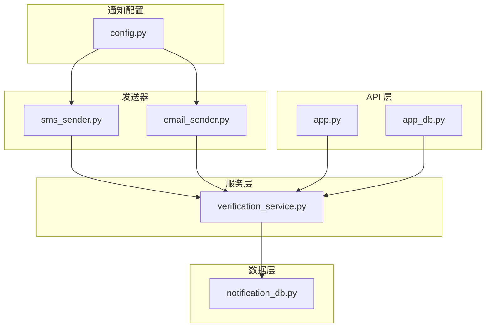
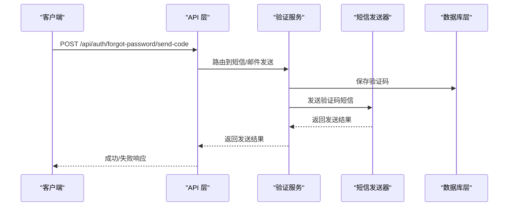
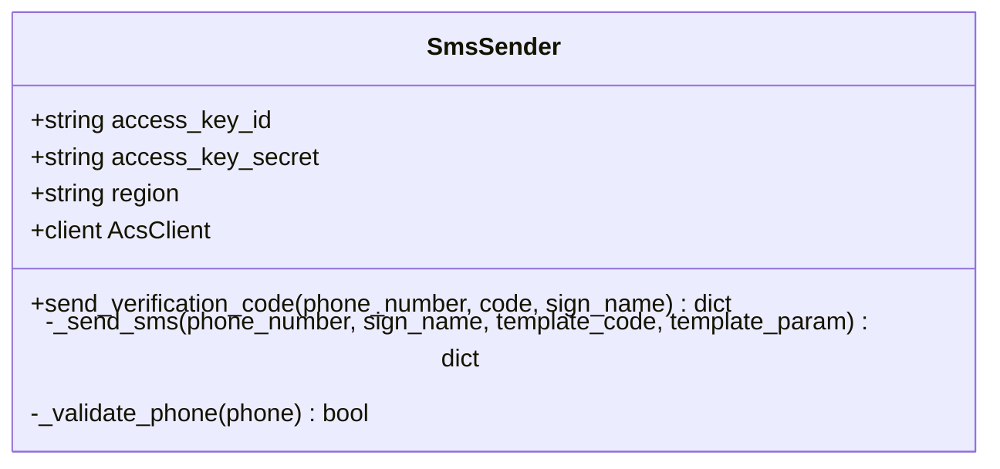
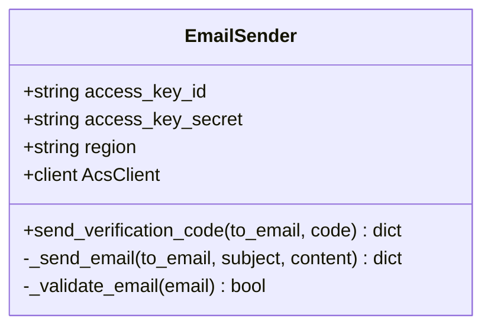
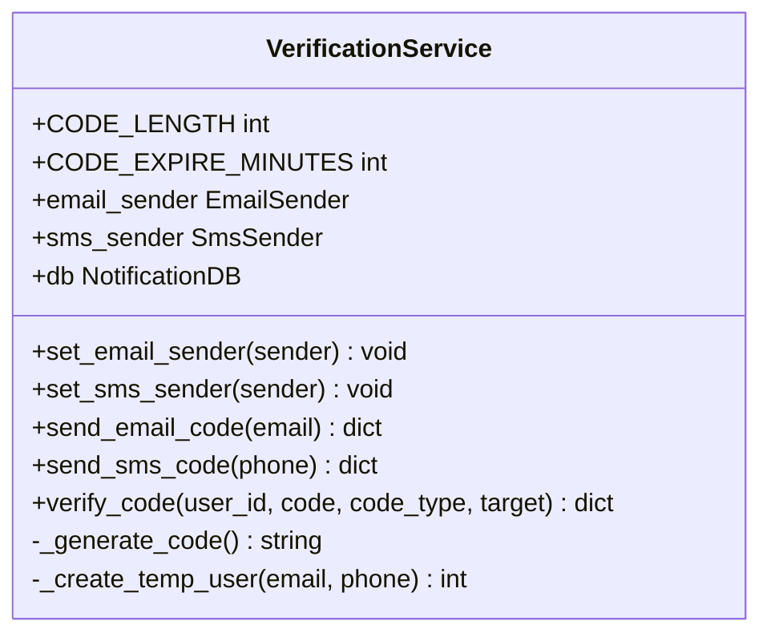
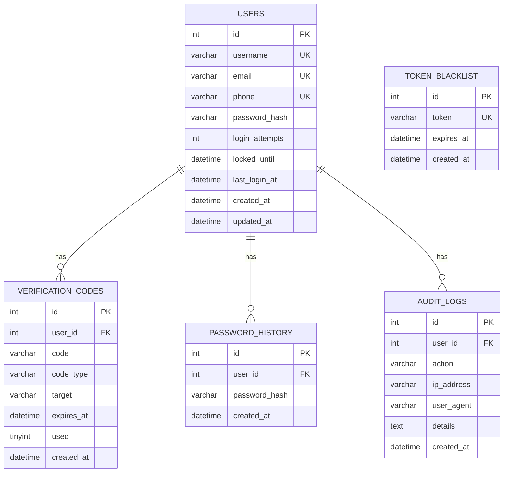
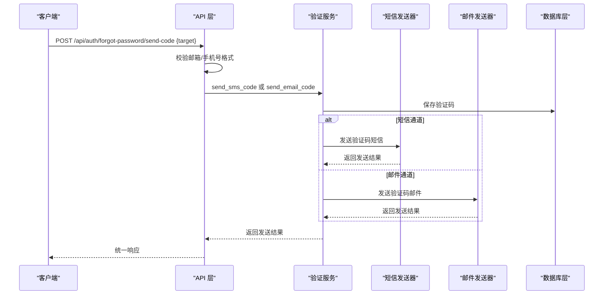
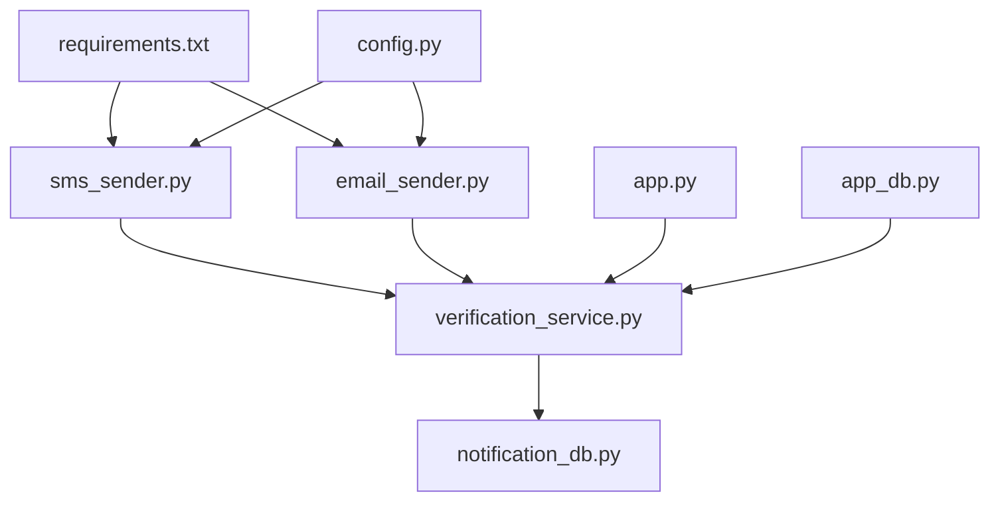

# 短信通知服务

<cite>
**本文档引用的文件**
- [sms_sender.py](file://python/src/notifications/sms_sender.py)
- [email_sender.py](file://python/src/notifications/email_sender.py)
- [config.py](file://python/src/notifications/config.py)
- [verification_service.py](file://python/src/notifications/verification_service.py)
- [notification_db.py](file://python/src/notification_db.py)
- [app.py](file://python/app.py)
- [app_db.py](file://python/app_db.py)
- [requirements.txt](file://python/requirements.txt)
</cite>

## 目录
1. [简介](#简介)
2. [项目结构](#项目结构)
3. [核心组件](#核心组件)
4. [架构总览](#架构总览)
5. [详细组件分析](#详细组件分析)
6. [依赖关系分析](#依赖关系分析)
7. [性能考虑](#性能考虑)
8. [故障排除指南](#故障排除指南)
9. [结论](#结论)
10. [附录](#附录)

## 简介
本项目实现了基于阿里云短信服务的短信通知能力，结合验证码生成、模板管理、发送队列与状态回调等机制，提供完整的短信发送与验证流程。系统同时支持邮件通知作为补充通道，并通过统一的验证服务进行短信与邮件的协同工作。本文档将深入解释短信网关集成、模板管理、发送队列与状态回调，以及短信格式、签名配置、发送限制与费用控制策略，并提供短信API与第三方集成指南。

## 项目结构
短信通知服务位于 Python 后端工程中，采用模块化设计，核心文件分布如下：
- 通知配置：读取环境变量，定义短信签名、模板、开关与验证码参数
- 短信发送器：封装阿里云短信SDK，负责发送验证码短信
- 邮件发送器：封装阿里云邮件推送SDK，用于邮件验证码
- 验证服务：统一管理验证码生成、存储、校验与发送调度
- 数据库层：维护用户、验证码、审计日志等表结构与操作
- API 层：对外暴露短信/邮件验证码发送与验证接口

**图表来源**
- [config.py:1-20](file://python/src/notifications/config.py#L1-L20)
- [sms_sender.py:1-65](file://python/src/notifications/sms_sender.py#L1-L65)
- [email_sender.py:1-67](file://python/src/notifications/email_sender.py#L1-L67)
- [verification_service.py:1-108](file://python/src/notifications/verification_service.py#L1-L108)
- [notification_db.py:1-357](file://python/src/notification_db.py#L1-L357)
- [app.py:1-800](file://python/app.py#L1-L800)
- [app_db.py:1-726](file://python/app_db.py#L1-L726)

**章节来源**
- [config.py:1-20](file://python/src/notifications/config.py#L1-L20)
- [sms_sender.py:1-65](file://python/src/notifications/sms_sender.py#L1-L65)
- [email_sender.py:1-67](file://python/src/notifications/email_sender.py#L1-L67)
- [verification_service.py:1-108](file://python/src/notifications/verification_service.py#L1-L108)
- [notification_db.py:1-357](file://python/src/notification_db.py#L1-L357)
- [app.py:1-800](file://python/app.py#L1-L800)
- [app_db.py:1-726](file://python/app_db.py#L1-L726)

## 核心组件
- 通知配置（NotificationConfig）
  - 从环境变量读取阿里云访问密钥、区域、短信签名、短信模板、邮件与短信开关
  - 定义验证码长度与过期时间
- 短信发送器（SmsSender）
  - 基于阿里云短信SDK，构造发送请求，设置签名、模板与参数
  - 返回标准化的成功/失败响应
- 邮件发送器（EmailSender）
  - 基于阿里云邮件推送SDK，发送HTML格式邮件验证码
- 验证服务（VerificationService）
  - 生成随机验证码，写入数据库，调用对应发送器发送
  - 提供验证码校验与使用标记
- 数据库层（NotificationDB）
  - 维护用户、验证码、黑名单、密码历史、审计日志等表
  - 提供验证码存取、使用标记、用户查询等方法
- API 层
  - 对外提供发送短信/邮件验证码与验证接口
  - 在忘记密码流程中根据目标类型自动路由至相应通道

**章节来源**
- [config.py:1-20](file://python/src/notifications/config.py#L1-L20)
- [sms_sender.py:1-65](file://python/src/notifications/sms_sender.py#L1-L65)
- [email_sender.py:1-67](file://python/src/notifications/email_sender.py#L1-L67)
- [verification_service.py:1-108](file://python/src/notifications/verification_service.py#L1-L108)
- [notification_db.py:1-357](file://python/src/notification_db.py#L1-L357)
- [app.py:170-210](file://python/app.py#L170-L210)
- [app_db.py:201-242](file://python/app_db.py#L201-L242)

## 架构总览
短信通知服务的整体架构围绕“配置—发送器—服务—数据库—API”展开，形成清晰的分层结构。验证服务作为协调者，统一分发短信与邮件通道；数据库层提供持久化能力；API 层对外暴露REST接口。

**图表来源**
- [app.py:170-189](file://python/app.py#L170-L189)
- [verification_service.py:54-81](file://python/src/notifications/verification_service.py#L54-L81)
- [sms_sender.py:25-60](file://python/src/notifications/sms_sender.py#L25-L60)
- [notification_db.py:147-156](file://python/src/notification_db.py#L147-L156)

## 详细组件分析

### 短信发送器（SmsSender）
- 功能职责
  - 校验手机号格式
  - 构造阿里云短信发送请求（域名、版本、动作）
  - 设置签名名、模板编码与模板参数
  - 处理响应并返回标准化结果
- 关键点
  - 使用阿里云短信域名与版本
  - 模板参数为JSON字符串，包含验证码字段
  - 异常捕获并返回友好错误信息

**图表来源**
- [sms_sender.py:7-65](file://python/src/notifications/sms_sender.py#L7-L65)

**章节来源**
- [sms_sender.py:1-65](file://python/src/notifications/sms_sender.py#L1-L65)

### 邮件发送器（EmailSender）
- 功能职责
  - 校验邮箱格式
  - 构造阿里云邮件推送请求（域名、版本、动作）
  - 发送HTML格式邮件验证码
- 关键点
  - 使用阿里云邮件推送域名与版本
  - 邮件主题与正文为固定格式
  - 异常捕获并返回友好错误信息

**图表来源**
- [email_sender.py:6-67](file://python/src/notifications/email_sender.py#L6-L67)

**章节来源**
- [email_sender.py:1-67](file://python/src/notifications/email_sender.py#L1-L67)

### 验证服务（VerificationService）
- 功能职责
  - 生成6位数字验证码
  - 将验证码写入数据库并设置过期时间（默认5分钟）
  - 根据目标类型路由到短信或邮件发送器
  - 提供验证码校验与使用标记
- 关键点
  - 支持临时用户创建（当目标用户不存在时）
  - 返回标准化响应，包含user_id、target与过期秒数

**图表来源**
- [verification_service.py:7-108](file://python/src/notifications/verification_service.py#L7-L108)

**章节来源**
- [verification_service.py:1-108](file://python/src/notifications/verification_service.py#L1-L108)

### 数据库层（NotificationDB）
- 功能职责
  - 初始化与维护用户、验证码、黑名单、密码历史、审计日志等表
  - 提供验证码保存、查询、使用标记等操作
  - 提供用户查询与审计日志记录
- 关键点
  - 自动重连与最大重试次数控制
  - 验证码过期检查与使用状态标记

**图表来源**
- [notification_db.py:44-104](file://python/src/notification_db.py#L44-L104)

**章节来源**
- [notification_db.py:1-357](file://python/src/notification_db.py#L1-L357)

### API 层（短信/邮件验证码接口）
- 接口概览
  - 发送短信验证码：POST /api/auth/forgot-password/send-code（根据目标类型自动路由）
  - 发送邮件验证码：POST /verification/send-email
  - 发送短信验证码：POST /verification/send-sms
  - 验证码校验：POST /api/auth/forgot-password/verify-code 与 POST /verification/verify
- 关键点
  - 输入校验（邮箱/手机号格式）
  - 统一返回结构（success/message/data/code）

**图表来源**
- [app.py:170-210](file://python/app.py#L170-L210)
- [app_db.py:630-684](file://python/app_db.py#L630-L684)
- [verification_service.py:25-81](file://python/src/notifications/verification_service.py#L25-L81)
- [sms_sender.py:25-60](file://python/src/notifications/sms_sender.py#L25-L60)
- [email_sender.py:25-62](file://python/src/notifications/email_sender.py#L25-L62)
- [notification_db.py:147-156](file://python/src/notification_db.py#L147-L156)

**章节来源**
- [app.py:170-210](file://python/app.py#L170-L210)
- [app_db.py:201-242](file://python/app_db.py#L201-L242)
- [app_db.py:630-684](file://python/app_db.py#L630-L684)

## 依赖关系分析
- 外部依赖
  - 阿里云SDK：aliyun-python-sdk-core
  - 数据库驱动：pymysql
  - Web框架：Flask、Flask-CORS
  - 其他：PyJWT、bcrypt、requests、psutil 等
- 内部依赖
  - 配置模块被短信/邮件发送器与API层引用
  - 验证服务依赖短信/邮件发送器与数据库层
  - API 层依赖验证服务与认证服务

**图表来源**
- [requirements.txt:1-14](file://python/requirements.txt#L1-L14)
- [config.py:1-20](file://python/src/notifications/config.py#L1-L20)
- [sms_sender.py:1-65](file://python/src/notifications/sms_sender.py#L1-L65)
- [email_sender.py:1-67](file://python/src/notifications/email_sender.py#L1-L67)
- [verification_service.py:1-108](file://python/src/notifications/verification_service.py#L1-L108)
- [notification_db.py:1-357](file://python/src/notification_db.py#L1-L357)
- [app.py:1-800](file://python/app.py#L1-L800)
- [app_db.py:1-726](file://python/app_db.py#L1-L726)

**章节来源**
- [requirements.txt:1-14](file://python/requirements.txt#L1-L14)
- [app.py:1-800](file://python/app.py#L1-L800)
- [app_db.py:1-726](file://python/app_db.py#L1-L726)

## 性能考虑
- 并发控制与限流
  - 当前代码未实现显式的并发池或限流器。建议在生产环境中引入线程池/进程池与令牌桶/漏桶算法进行限流，避免短信网关被突发流量冲击。
- 连接管理
  - 数据库连接具备自动重连与指数退避重试，有助于提升稳定性。
- 响应时间优化
  - 将验证码生成与数据库写入前置，减少网络请求往返；对阿里云SDK调用增加超时与重试策略。
- 资源隔离
  - 将短信与邮件发送器实例化与注入到验证服务，便于按通道独立扩展与监控。

[本节为通用性能指导，不直接分析具体文件，故无“章节来源”]

## 故障排除指南
- 常见问题
  - 手机号格式不正确：短信发送器会返回明确错误提示
  - 邮箱格式不正确：邮件发送器会返回明确错误提示
  - 短信发送失败：检查阿里云凭证、签名与模板是否正确配置
  - 验证码无效或已过期：确认数据库中验证码未过期且未被使用
- 日志与审计
  - API 层在关键操作（注册、登录、重置密码等）记录审计日志，便于排查
- 异常处理
  - 短信/邮件发送器对SDK异常进行捕获并返回友好错误信息
  - 验证服务在发送失败时返回标准化结果，便于前端展示

**章节来源**
- [sms_sender.py:14-60](file://python/src/notifications/sms_sender.py#L14-L60)
- [email_sender.py:13-66](file://python/src/notifications/email_sender.py#L13-L66)
- [verification_service.py:25-81](file://python/src/notifications/verification_service.py#L25-L81)
- [notification_db.py:334-342](file://python/src/notification_db.py#L334-L342)
- [app.py:85-91](file://python/app.py#L85-L91)
- [app.py:112-118](file://python/app.py#L112-L118)
- [app.py:228-234](file://python/app.py#L228-L234)

## 结论
本短信通知服务通过清晰的分层设计与标准化接口，实现了短信与邮件验证码的统一管理与发送。系统具备良好的扩展性，可通过配置模块灵活切换短信签名与模板，并在API层实现统一的路由与响应。建议在生产环境中补充并发控制与限流策略、完善监控与告警，以进一步提升稳定性与用户体验。

[本节为总结性内容，不直接分析具体文件，故无“章节来源”]

## 附录

### 短信格式与签名配置
- 短信格式
  - 模板参数为JSON字符串，包含验证码字段
  - 签名名称可在配置中设置，默认值为“学生管理系统”
- 签名管理
  - 通过环境变量配置签名名称与模板编码
  - 短信发送器在请求中设置签名与模板

**章节来源**
- [sms_sender.py:21-35](file://python/src/notifications/sms_sender.py#L21-L35)
- [config.py:9-10](file://python/src/notifications/config.py#L9-L10)

### 短信模板配置与签名管理
- 模板管理
  - 模板编码通过环境变量配置，若未配置则使用默认值
  - 短信发送器在请求中设置模板编码
- 签名管理
  - 签名名称通过环境变量配置，若未配置则使用默认值
  - 短信发送器在请求中设置签名名称

**章节来源**
- [config.py:9-10](file://python/src/notifications/config.py#L9-L10)
- [sms_sender.py:14-23](file://python/src/notifications/sms_sender.py#L14-L23)

### 发送状态查询与费用统计
- 发送状态查询
  - 短信发送器返回标准化响应，包含成功/失败标识与消息
  - 可在业务层记录发送状态与错误码，便于后续查询
- 费用统计
  - 当前代码未实现费用统计功能。建议在短信发送器中记录每次发送的请求ID与状态，并在后台定时同步阿里云账单或通过回调接口进行统计

**章节来源**
- [sms_sender.py:42-60](file://python/src/notifications/sms_sender.py#L42-L60)

### 短信API与第三方集成指南
- 短信API
  - 发送短信验证码：POST /api/auth/forgot-password/send-code
  - 发送短信验证码（独立接口）：POST /verification/send-sms
  - 验证码校验：POST /api/auth/forgot-password/verify-code 与 POST /verification/verify
- 第三方集成
  - 阿里云短信服务：通过阿里云SDK进行发送，需配置访问密钥、区域与模板
  - 邮件通道：可选的邮件验证码发送，需配置邮件推送SDK

**章节来源**
- [app.py:170-210](file://python/app.py#L170-L210)
- [app_db.py:658-684](file://python/app_db.py#L658-L684)
- [requirements.txt:7-7](file://python/requirements.txt#L7-L7)

### 发送限制与费用控制
- 发送限制
  - 当前代码未实现显式的发送频率限制与并发控制
  - 建议引入限流器（如令牌桶/漏桶）与并发池，防止接口被滥用
- 费用控制
  - 建议在短信发送器中记录发送成本与计费条数，并在后台进行统计与告警

**章节来源**
- [sms_sender.py:37-60](file://python/src/notifications/sms_sender.py#L37-L60)