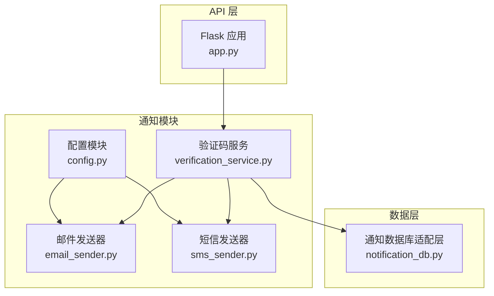
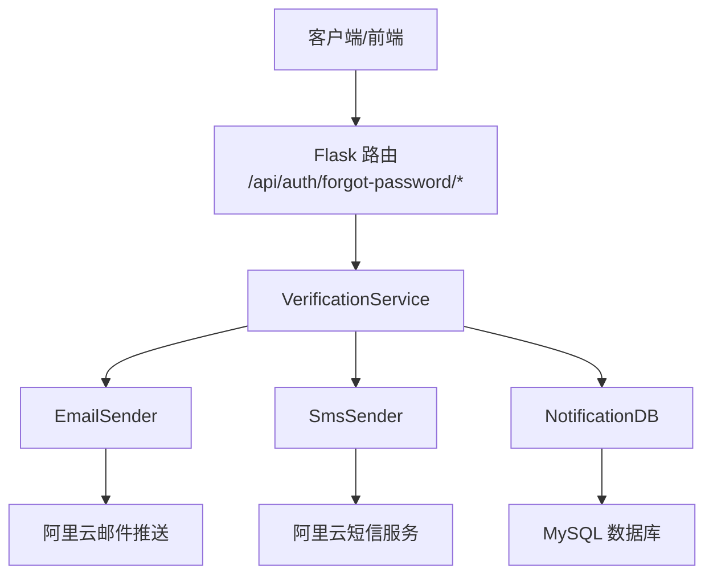
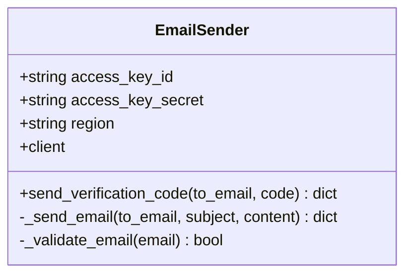
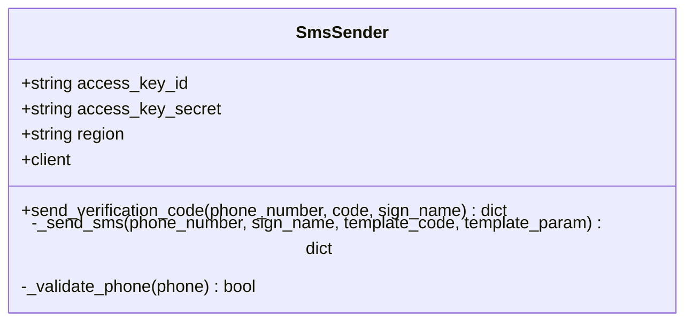
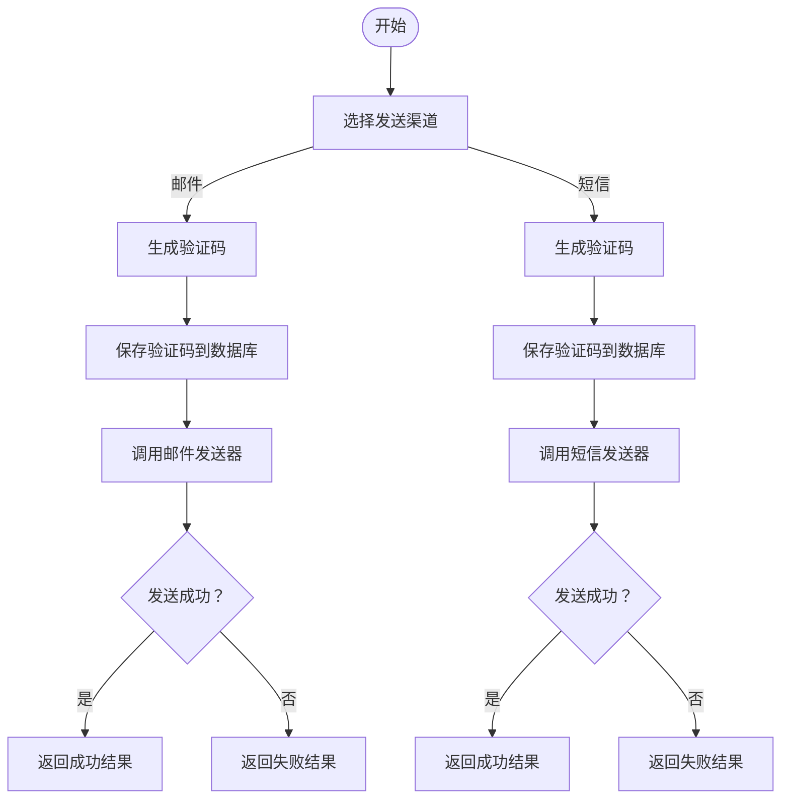
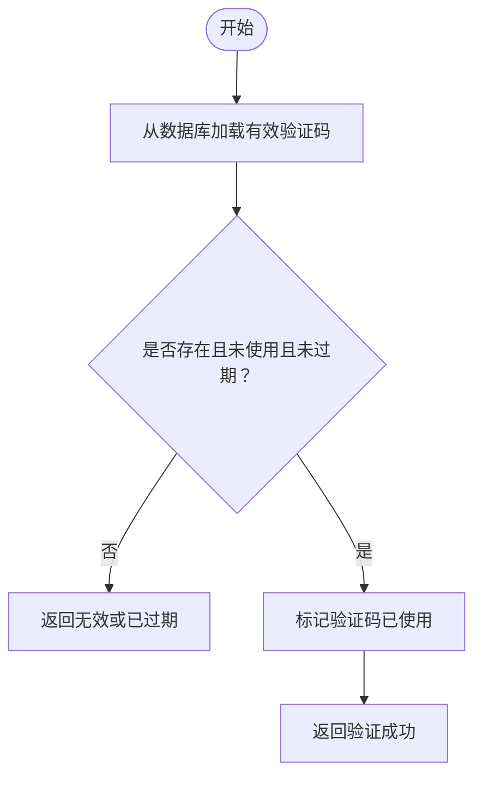
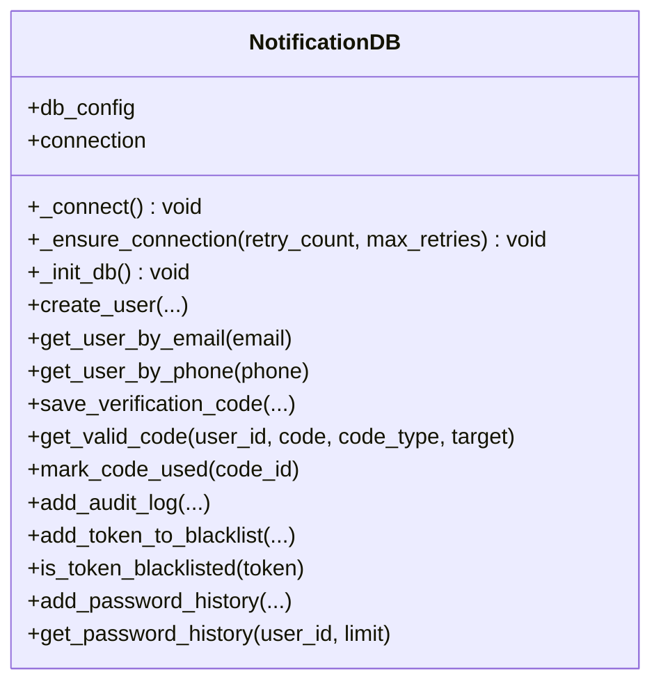
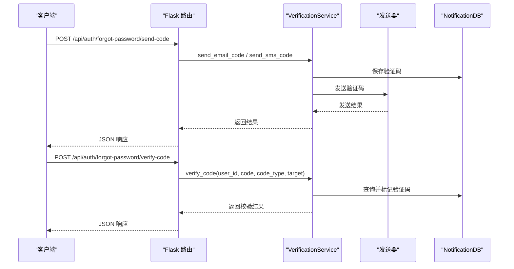
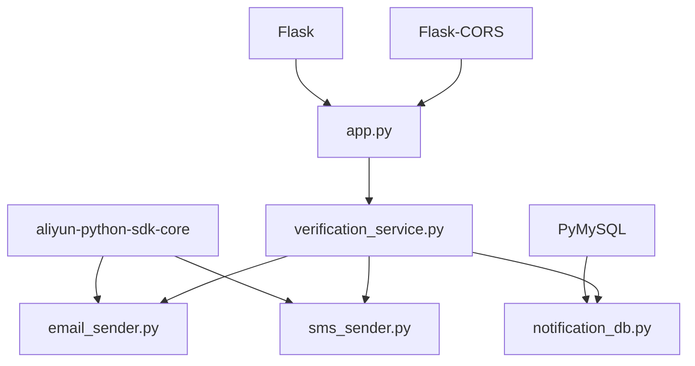

# 通知系统

<cite>
**本文引用的文件**
- [__init__.py](file://python/src/notifications/__init__.py)
- [config.py](file://python/src/notifications/config.py)
- [email_sender.py](file://python/src/notifications/email_sender.py)
- [sms_sender.py](file://python/src/notifications/sms_sender.py)
- [verification_service.py](file://python/src/notifications/verification_service.py)
- [notification_db.py](file://python/src/notification_db.py)
- [app.py](file://python/app.py)
- [requirements.txt](file://python/requirements.txt)
</cite>

## 目录
1. [简介](#简介)
2. [项目结构](#项目结构)
3. [核心组件](#核心组件)
4. [架构总览](#架构总览)
5. [详细组件分析](#详细组件分析)
6. [依赖分析](#依赖分析)
7. [性能考虑](#性能考虑)
8. [故障排查指南](#故障排查指南)
9. [结论](#结论)
10. [附录](#附录)

## 简介
本通知系统为一个基于 Python 的多渠道通知服务，支持邮件与短信验证码发送，并提供验证码生成、校验与持久化能力。系统通过阿里云 SDK 实现邮件与短信通道，使用 MySQL 数据库存储用户与验证码相关信息。后端采用 Flask 提供 REST API，前端通过 Vue 应用交互。

## 项目结构
通知系统位于 python/src/notifications 目录下，核心文件包括：
- 配置模块：用于加载环境变量并统一管理通知相关配置
- 发送器：分别封装邮件与短信发送逻辑
- 验证服务：负责验证码生成、发送、校验与持久化
- 数据库适配层：封装数据库连接、表初始化与验证码相关操作
- API 入口：在 Flask 应用中暴露验证码发送与校验接口

**图表来源**
- [config.py:1-20](file://python/src/notifications/config.py#L1-L20)
- [email_sender.py:1-67](file://python/src/notifications/email_sender.py#L1-L67)
- [sms_sender.py:1-65](file://python/src/notifications/sms_sender.py#L1-L65)
- [verification_service.py:1-108](file://python/src/notifications/verification_service.py#L1-L108)
- [notification_db.py:1-357](file://python/src/notification_db.py#L1-L357)
- [app.py:170-210](file://python/app.py#L170-L210)

**章节来源**
- [__init__.py:1-13](file://python/src/notifications/__init__.py#L1-L13)
- [config.py:1-20](file://python/src/notifications/config.py#L1-L20)
- [email_sender.py:1-67](file://python/src/notifications/email_sender.py#L1-L67)
- [sms_sender.py:1-65](file://python/src/notifications/sms_sender.py#L1-L65)
- [verification_service.py:1-108](file://python/src/notifications/verification_service.py#L1-L108)
- [notification_db.py:1-357](file://python/src/notification_db.py#L1-L357)
- [app.py:170-210](file://python/app.py#L170-L210)

## 核心组件
- 配置模块：从环境变量读取阿里云密钥、区域、签名名、模板编号等；控制邮件与短信开关；定义验证码长度与过期时长
- 邮件发送器：基于阿里云邮件推送 SDK，构造单发邮件请求，返回标准化结果
- 短信发送器：基于阿里云短信 SDK，构造发送短信请求，返回标准化结果
- 验证码服务：生成随机验证码、选择发送渠道、持久化验证码、校验有效期与使用状态
- 数据库适配层：初始化 users、verification_codes、token_blacklist、password_history、audit_logs 表；提供用户查询、验证码存取与使用标记等方法
- API 接口：对外提供发送忘记密码验证码、校验验证码、重置密码等接口

**章节来源**
- [config.py:1-20](file://python/src/notifications/config.py#L1-L20)
- [email_sender.py:6-67](file://python/src/notifications/email_sender.py#L6-L67)
- [sms_sender.py:7-65](file://python/src/notifications/sms_sender.py#L7-L65)
- [verification_service.py:7-108](file://python/src/notifications/verification_service.py#L7-L108)
- [notification_db.py:6-104](file://python/src/notification_db.py#L6-L104)
- [app.py:170-210](file://python/app.py#L170-L210)

## 架构总览
通知系统采用“配置-发送器-服务-数据层-接口”的分层设计。配置模块集中管理外部服务参数；发送器封装具体通道细节；服务层协调发送与持久化；数据库层提供数据持久化；API 层对外暴露业务接口。

**图表来源**
- [app.py:170-210](file://python/app.py#L170-L210)
- [verification_service.py:11-14](file://python/src/notifications/verification_service.py#L11-L14)
- [email_sender.py:6-11](file://python/src/notifications/email_sender.py#L6-L11)
- [sms_sender.py:7-12](file://python/src/notifications/sms_sender.py#L7-L12)
- [notification_db.py:6-17](file://python/src/notification_db.py#L6-L17)

## 详细组件分析

### 配置模块（NotificationConfig）
- 功能要点
  - 从环境变量读取阿里云访问凭据与区域
  - 读取短信签名名与模板编号
  - 控制邮件与短信开关
  - 定义验证码长度与过期分钟数
- 关键点
  - 使用默认值避免未配置导致的异常
  - 将配置实例化为全局对象供其他模块使用

**章节来源**
- [config.py:4-19](file://python/src/notifications/config.py#L4-L19)

### 邮件发送器（EmailSender）
- 功能要点
  - 初始化阿里云邮件推送客户端
  - 校验邮箱格式
  - 组装邮件请求（收件人、主题、HTML 内容）
  - 解析响应并返回标准化结果
- 错误处理
  - 格式校验失败返回明确错误
  - 异常捕获并返回异常信息

**图表来源**
- [email_sender.py:6-67](file://python/src/notifications/email_sender.py#L6-L67)

**章节来源**
- [email_sender.py:6-67](file://python/src/notifications/email_sender.py#L6-L67)

### 短信发送器（SmsSender）
- 功能要点
  - 初始化阿里云短信客户端
  - 校验手机号格式
  - 组装短信请求（手机号、签名、模板、参数）
  - 解析响应并返回标准化结果
- 错误处理
  - 格式校验失败返回明确错误
  - 异常捕获并返回异常信息

**图表来源**
- [sms_sender.py:7-65](file://python/src/notifications/sms_sender.py#L7-L65)

**章节来源**
- [sms_sender.py:7-65](file://python/src/notifications/sms_sender.py#L7-L65)

### 验证码服务（VerificationService）
- 功能要点
  - 生成固定长度数字验证码
  - 选择发送渠道（邮件或短信）
  - 持久化验证码（含过期时间）
  - 校验验证码有效性与使用状态
  - 支持临时用户创建
- 流程图（发送验证码）

**图表来源**
- [verification_service.py:25-81](file://python/src/notifications/verification_service.py#L25-L81)

- 校验流程

**图表来源**
- [verification_service.py:83-101](file://python/src/notifications/verification_service.py#L83-L101)

**章节来源**
- [verification_service.py:7-108](file://python/src/notifications/verification_service.py#L7-L108)

### 数据库适配层（NotificationDB）
- 功能要点
  - 初始化数据库连接与表结构
  - 用户相关查询与创建
  - 验证码保存、查询与使用标记
  - 审计日志、令牌黑名单、密码历史等扩展表
- 连接与重试
  - 自动重连与有限次重试机制
  - 健康检查与异常恢复

**图表来源**
- [notification_db.py:6-357](file://python/src/notification_db.py#L6-L357)

**章节来源**
- [notification_db.py:6-104](file://python/src/notification_db.py#L6-L104)
- [notification_db.py:147-189](file://python/src/notification_db.py#L147-L189)
- [notification_db.py:28-39](file://python/src/notification_db.py#L28-L39)

### API 接口（Flask）
- 路由概览
  - 发送忘记密码验证码：根据目标判断邮件或短信
  - 校验验证码：根据目标类型确定 code_type
  - 重置密码：基于用户 ID 与新密码进行重置
- 参数与返回
  - 统一返回结构：success、message、data 或错误码
  - 对无效输入与异常进行保护性处理

**图表来源**
- [app.py:170-210](file://python/app.py#L170-L210)
- [verification_service.py:25-81](file://python/src/notifications/verification_service.py#L25-L81)
- [verification_service.py:83-101](file://python/src/notifications/verification_service.py#L83-L101)

**章节来源**
- [app.py:170-210](file://python/app.py#L170-L210)

## 依赖分析
- 外部依赖
  - Flask、Flask-CORS：Web 框架与跨域支持
  - aliyun-python-sdk-core：阿里云 SDK 核心
  - PyMySQL：MySQL 驱动
  - cryptography、bcrypt、PyJWT：安全与认证相关
  - requests、beautifulsoup4、lxml：网络与解析工具
  - psutil：系统资源监控
- 内部模块依赖
  - verification_service 依赖 email_sender、sms_sender、notification_db
  - app.py 依赖 verification_service 与 notification_db

**图表来源**
- [requirements.txt:1-14](file://python/requirements.txt#L1-L14)
- [email_sender.py:2-3](file://python/src/notifications/email_sender.py#L2-L3)
- [sms_sender.py:3-4](file://python/src/notifications/sms_sender.py#L3-L4)
- [notification_db.py:2](file://python/src/notification_db.py#L2)
- [app.py:1-12](file://python/app.py#L1-L12)

**章节来源**
- [requirements.txt:1-14](file://python/requirements.txt#L1-L14)
- [app.py:1-12](file://python/app.py#L1-L12)

## 性能考虑
- 数据库连接
  - 采用自动重连与指数退避重试，降低瞬时异常影响
  - 在每次操作前确保连接可用，减少超时与断开风险
- 发送器
  - 通过阿里云 SDK 直接调用，避免额外中间层
  - 结果解析与异常捕获在本地完成，便于快速失败与降级
- API
  - 路由层对输入进行基础校验，减少无效调用
  - 统一返回结构，便于前端快速处理

[本节为通用建议，无需特定文件来源]

## 故障排查指南
- 常见问题定位
  - 邮件/短信发送失败：检查发送器返回的错误消息，确认模板编号、签名名与目标号码是否正确
  - 验证码无效或过期：确认数据库中验证码记录是否未使用且未过期
  - 数据库连接异常：查看连接重试日志，确认主机、端口、账号与密码配置
- 建议步骤
  - 启用调试模式，查看完整异常堆栈
  - 核对环境变量与配置文件
  - 检查阿里云服务状态与配额

**章节来源**
- [email_sender.py:44-62](file://python/src/notifications/email_sender.py#L44-L62)
- [sms_sender.py:37-60](file://python/src/notifications/sms_sender.py#L37-L60)
- [notification_db.py:28-39](file://python/src/notification_db.py#L28-L39)

## 结论
该通知系统以清晰的分层设计实现了邮件与短信验证码能力，结合数据库持久化与标准化 API，满足多渠道通知场景需求。通过配置模块集中管理外部服务参数，便于在不同环境中灵活部署。建议后续增强发送队列与重试策略、模板管理与个性化定制能力，以进一步提升可靠性与可维护性。

[本节为总结性内容，无需特定文件来源]

## 附录

### API 接口文档
- 发送忘记密码验证码
  - 方法与路径：POST /api/auth/forgot-password/send-code
  - 请求体字段：target（邮箱或手机号）
  - 成功响应字段：success、message、data（包含 user_id、target、expires_in）
  - 失败响应字段：success、message、code
- 校验验证码
  - 方法与路径：POST /api/auth/forgot-password/verify-code
  - 请求体字段：user_id、code、target
  - 成功响应字段：success、message、data（包含 verified）
  - 失败响应字段：success、message、code
- 重置密码
  - 方法与路径：POST /api/auth/forgot-password/reset
  - 请求体字段：user_id、new_password
  - 成功响应字段：success、message
  - 失败响应字段：success、message、code

**章节来源**
- [app.py:170-210](file://python/app.py#L170-L210)

### 配置指南
- 环境变量
  - ALIYUN_ACCESS_KEY_ID：阿里云访问密钥 ID
  - ALIYUN_ACCESS_KEY_SECRET：阿里云访问密钥 Secret
  - ALIYUN_REGION：阿里云区域
  - SMS_SIGN_NAME：短信签名名称
  - SMS_TEMPLATE_CODE：短信模板编号
  - EMAIL_ENABLED：是否启用邮件发送（true/false）
  - SMS_ENABLED：是否启用短信发送（true/false）
- 默认行为
  - 验证码长度为 6 位，过期时间为 5 分钟
  - 若未配置发送器，则验证码服务会返回未配置提示

**章节来源**
- [config.py:4-19](file://python/src/notifications/config.py#L4-L19)