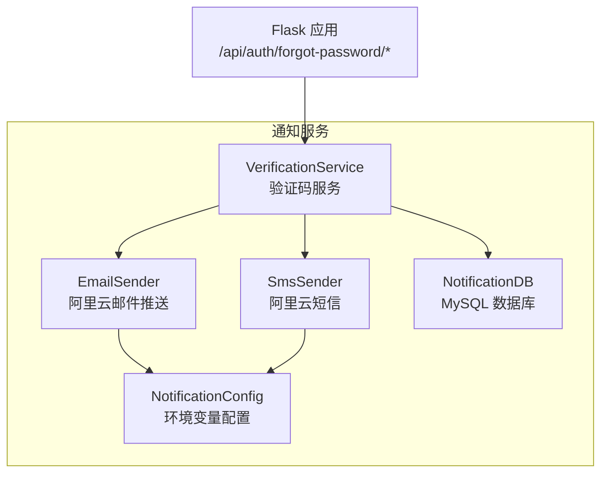
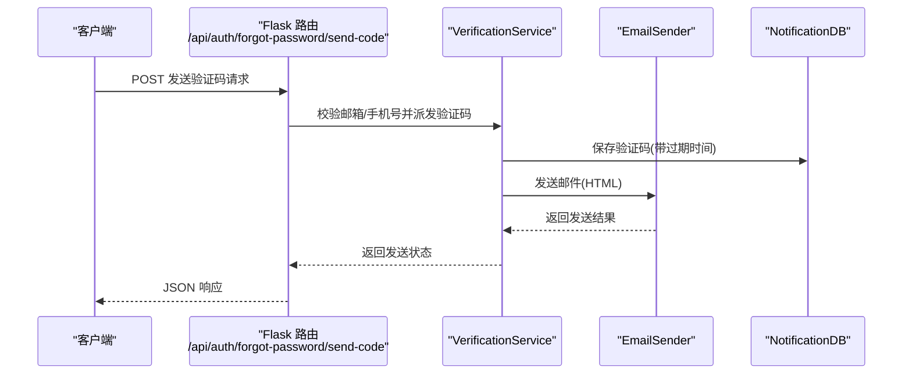
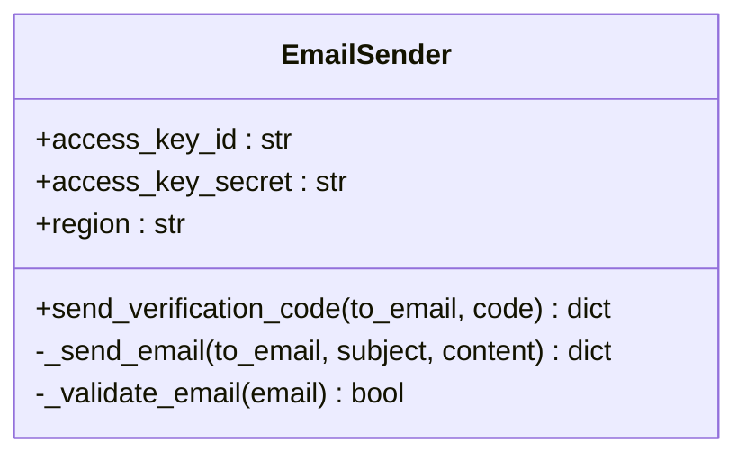
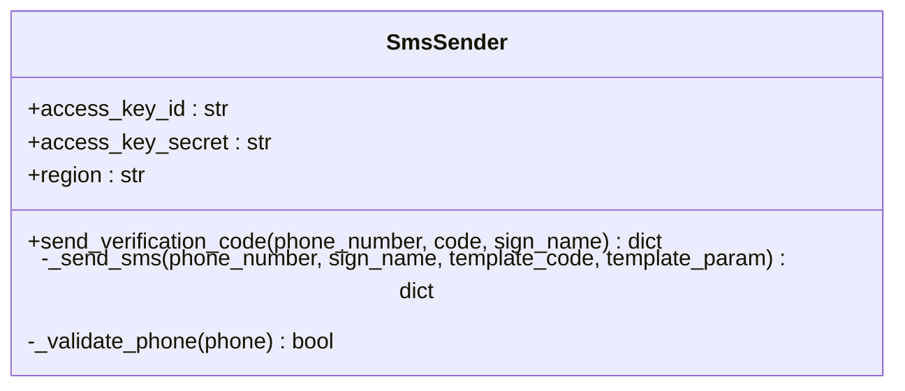
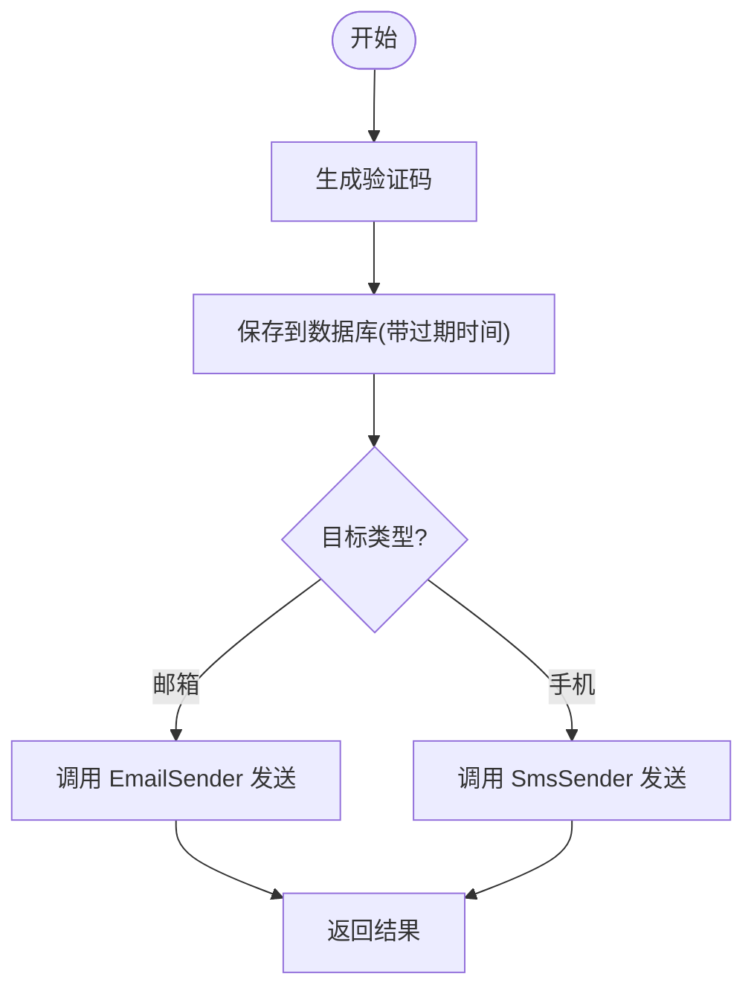
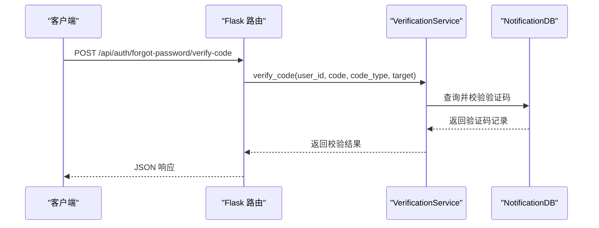
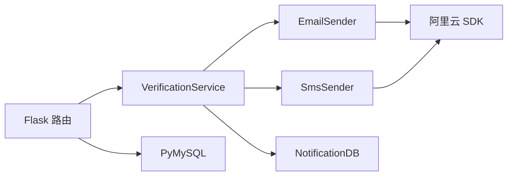
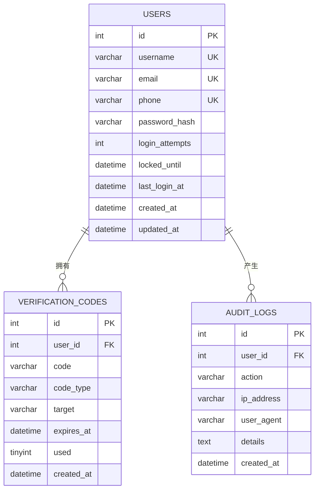

# 邮件通知服务

<cite>
**本文引用的文件**
- [email_sender.py](file://python/src/notifications/email_sender.py)
- [sms_sender.py](file://python/src/notifications/sms_sender.py)
- [verification_service.py](file://python/src/notifications/verification_service.py)
- [config.py](file://python/src/notifications/config.py)
- [notification_db.py](file://python/src/notification_db.py)
- [app.py](file://python/app.py)
- [requirements.txt](file://python/requirements.txt)
- [.gitignore](file://python/.gitignore)
</cite>

## 目录
1. [简介](#简介)
2. [项目结构](#项目结构)
3. [核心组件](#核心组件)
4. [架构总览](#架构总览)
5. [详细组件分析](#详细组件分析)
6. [依赖分析](#依赖分析)
7. [性能考虑](#性能考虑)
8. [故障排查指南](#故障排查指南)
9. [结论](#结论)
10. [附录](#附录)

## 简介
本文件系统性说明邮件通知服务的实现，涵盖 SMTP 配置、邮件模板、批量发送与发送队列管理现状、邮件格式与附件处理能力、发送状态追踪与失败重试机制、错误处理与退信处理建议、以及 API 与配置示例。当前仓库中邮件发送基于阿里云邮件推送服务（DirectMail），未使用传统 SMTP；短信发送基于阿里云短信服务（Dysms）。验证码生成、存储与校验由独立模块负责。

## 项目结构
通知相关代码集中在 python/src/notifications 目录，配合全局配置与数据库层使用。

图表来源
- [email_sender.py:1-67](file://python/src/notifications/email_sender.py#L1-L67)
- [sms_sender.py:1-65](file://python/src/notifications/sms_sender.py#L1-L65)
- [verification_service.py:1-108](file://python/src/notifications/verification_service.py#L1-L108)
- [config.py:1-20](file://python/src/notifications/config.py#L1-L20)
- [notification_db.py:1-357](file://python/src/notification_db.py#L1-L357)
- [app.py:170-210](file://python/app.py#L170-L210)

章节来源
- [email_sender.py:1-67](file://python/src/notifications/email_sender.py#L1-L67)
- [sms_sender.py:1-65](file://python/src/notifications/sms_sender.py#L1-L65)
- [verification_service.py:1-108](file://python/src/notifications/verification_service.py#L1-L108)
- [config.py:1-20](file://python/src/notifications/config.py#L1-L20)
- [notification_db.py:1-357](file://python/src/notification_db.py#L1-L357)
- [app.py:170-210](file://python/app.py#L170-L210)

## 核心组件
- 邮件发送器：EmailSender，封装阿里云邮件推送接口，支持发送 HTML 邮件，包含邮箱格式校验与基础错误处理。
- 短信发送器：SmsSender，封装阿里云短信接口，支持发送模板短信，包含手机号格式校验与基础错误处理。
- 验证码服务：VerificationService，负责验证码生成、有效期控制、数据库持久化、发送调度与校验。
- 配置中心：NotificationConfig，集中读取环境变量，控制是否启用邮件/短信、签名名与模板等。
- 数据库层：NotificationDB，提供用户、验证码、审计日志等表的 CRUD 操作，含连接池与重连逻辑。
- Web 接口：Flask 路由，暴露忘记密码场景下的验证码发送与校验 API。

章节来源
- [email_sender.py:6-67](file://python/src/notifications/email_sender.py#L6-L67)
- [sms_sender.py:7-65](file://python/src/notifications/sms_sender.py#L7-L65)
- [verification_service.py:7-108](file://python/src/notifications/verification_service.py#L7-L108)
- [config.py:4-20](file://python/src/notifications/config.py#L4-L20)
- [notification_db.py:6-357](file://python/src/notification_db.py#L6-L357)
- [app.py:170-210](file://python/app.py#L170-L210)

## 架构总览
下图展示从 Web 请求到通知发送的整体流程与组件交互。

图表来源
- [app.py:170-190](file://python/app.py#L170-L190)
- [verification_service.py:25-52](file://python/src/notifications/verification_service.py#L25-L52)
- [email_sender.py:13-62](file://python/src/notifications/email_sender.py#L13-L62)
- [notification_db.py:147-156](file://python/src/notification_db.py#L147-L156)

## 详细组件分析

### 邮件发送器 EmailSender
- 功能要点
  - 使用阿里云邮件推送接口发送单封邮件。
  - 内置邮箱格式正则校验。
  - 构造 HTML 正文，包含验证码与有效期提示。
  - 统一返回结构：包含 success、message、data 或错误信息。
- 邮件格式
  - Content-Type 为 HTML，正文包含验证码与安全提示。
- 附件处理
  - 当前实现未涉及附件上传与发送。
- SSL/TLS 连接
  - 通过阿里云 SDK 完成网络通信，无需手动配置 SSL/TLS 参数。
- 错误处理
  - 捕获异常并返回统一错误消息；对响应字符串进行“OK”判断作为成功依据。
- 可扩展点
  - 支持批量发送时，可在该类中增加批量接口与队列集成。
  - 可引入模板渲染引擎（如 Jinja2）以支持动态模板与多语言。

图表来源
- [email_sender.py:6-67](file://python/src/notifications/email_sender.py#L6-L67)

章节来源
- [email_sender.py:6-67](file://python/src/notifications/email_sender.py#L6-L67)

### 短信发送器 SmsSender
- 功能要点
  - 使用阿里云短信接口发送模板短信。
  - 内置手机号格式校验。
  - 统一返回结构：包含 success、message、data 或错误信息。
- 模板与签名
  - 通过配置项传入签名名与模板编号。
- 附件处理
  - 当前实现未涉及附件上传与发送。
- SSL/TLS 连接
  - 通过阿里云 SDK 完成网络通信，无需手动配置 SSL/TLS 参数。
- 错误处理
  - 解析响应 JSON，以 Code 字段判断成功与否。

图表来源
- [sms_sender.py:7-65](file://python/src/notifications/sms_sender.py#L7-L65)

章节来源
- [sms_sender.py:7-65](file://python/src/notifications/sms_sender.py#L7-L65)

### 验证码服务 VerificationService
- 功能要点
  - 生成固定长度随机数字验证码。
  - 计算过期时间并持久化到数据库。
  - 根据目标类型选择邮件或短信发送器。
  - 提供验证码校验接口，校验通过后标记为已使用。
- 批量发送与队列
  - 当前未实现批量发送与队列管理。
- 模板渲染
  - 邮件模板为硬编码 HTML，未使用模板引擎。
- 发送状态追踪
  - 通过数据库中的 verification_codes 表记录发送与使用状态。
- 失败重试
  - 当前未实现自动重试机制。

图表来源
- [verification_service.py:22-52](file://python/src/notifications/verification_service.py#L22-L52)

章节来源
- [verification_service.py:7-108](file://python/src/notifications/verification_service.py#L7-L108)

### 配置中心 NotificationConfig
- 功能要点
  - 从环境变量读取阿里云密钥、区域、签名名、模板编号。
  - 控制是否启用邮件/短信功能。
  - 定义验证码长度与过期时间。
- 环境变量
  - ALIYUN_ACCESS_KEY_ID、ALIYUN_ACCESS_KEY_SECRET、ALIYUN_REGION
  - SMS_SIGN_NAME、SMS_TEMPLATE_CODE
  - EMAIL_ENABLED、SMS_ENABLED
  - CODE_LENGTH、CODE_EXPIRE_MINUTES

章节来源
- [config.py:4-20](file://python/src/notifications/config.py#L4-L20)

### 数据库层 NotificationDB
- 功能要点
  - 初始化 users、verification_codes、token_blacklist、password_history、audit_logs 等表。
  - 提供验证码保存、查询与标记使用。
  - 提供审计日志记录。
  - 内置连接管理与重连逻辑。
- 发送历史记录
  - 当前未单独维护邮件发送历史表；可通过审计日志间接追踪。

章节来源
- [notification_db.py:41-104](file://python/src/notification_db.py#L41-L104)
- [notification_db.py:147-189](file://python/src/notification_db.py#L147-L189)
- [notification_db.py:334-342](file://python/src/notification_db.py#L334-L342)

### Web API 与路由
- 路由
  - POST /api/auth/forgot-password/send-code：根据目标类型发送验证码（邮箱或手机）。
  - POST /api/auth/forgot-password/verify-code：校验验证码。
- 输入输出
  - 统一返回结构：success、message、data（如 user_id、target、expires_in）或错误信息。

图表来源
- [app.py:192-210](file://python/app.py#L192-L210)
- [verification_service.py:83-101](file://python/src/notifications/verification_service.py#L83-L101)
- [notification_db.py:158-179](file://python/src/notification_db.py#L158-L179)

章节来源
- [app.py:170-210](file://python/app.py#L170-L210)

## 依赖分析
- 外部依赖
  - Flask、Flask-CORS、PyMySQL、阿里云 SDK（core）、PyJWT、bcrypt、requests、BeautifulSoup4、lxml、psutil 等。
- 组件耦合
  - VerificationService 同时依赖 EmailSender/SmsSender 与 NotificationDB。
  - EmailSender/SmsSender 依赖阿里云 SDK。
  - Flask 路由依赖 VerificationService 与 NotificationDB。

图表来源
- [requirements.txt:1-14](file://python/requirements.txt#L1-L14)
- [email_sender.py:1-4](file://python/src/notifications/email_sender.py#L1-L4)
- [sms_sender.py:1-4](file://python/src/notifications/sms_sender.py#L1-L4)
- [app.py:1-12](file://python/app.py#L1-L12)

章节来源
- [requirements.txt:1-14](file://python/requirements.txt#L1-L14)
- [email_sender.py:1-4](file://python/src/notifications/email_sender.py#L1-L4)
- [sms_sender.py:1-4](file://python/src/notifications/sms_sender.py#L1-L4)
- [app.py:1-12](file://python/app.py#L1-L12)

## 性能考虑
- 连接管理
  - NotificationDB 对数据库连接进行了重连与延迟重试，有助于提升稳定性。
- 并发与吞吐
  - 当前未实现发送队列与并发限流，建议在高并发场景引入队列（如 Celery/RQ）与限流策略。
- 模板渲染
  - 邮件模板为硬编码 HTML，建议引入模板引擎以降低耦合并提升可维护性。
- 日志与监控
  - 建议在发送器中增加更细粒度的日志与指标上报，便于问题定位与容量规划。

## 故障排查指南
- 常见错误与定位
  - 邮箱/手机号格式不正确：检查前端输入与正则校验。
  - 阿里云接口返回非 OK：检查签名名、模板编号与配额。
  - 验证码无效或已过期：确认数据库记录与过期时间。
  - 数据库连接失败：检查连接参数与重连逻辑。
- 建议改进
  - 引入发送队列与失败重试（指数退避）。
  - 增加发送历史表与退信处理机制（如订阅回执与退信回调）。
  - 在 VerificationService 中增加发送统计与告警。

章节来源
- [email_sender.py:13-18](file://python/src/notifications/email_sender.py#L13-L18)
- [sms_sender.py:14-19](file://python/src/notifications/sms_sender.py#L14-L19)
- [verification_service.py:83-91](file://python/src/notifications/verification_service.py#L83-L91)
- [notification_db.py:28-39](file://python/src/notification_db.py#L28-L39)

## 结论
当前邮件通知服务以阿里云服务为核心，实现了验证码发送与校验的基本闭环。邮件发送采用 HTML 模板，未实现批量与队列；短信与邮件均通过 SDK 完成网络通信。建议后续引入发送队列、模板引擎、发送历史与退信处理，以满足生产级可靠性与可运维性要求。

## 附录

### 邮件 API 示例
- 发送验证码（邮箱）
  - 方法与路径：POST /api/auth/forgot-password/send-code
  - 请求体字段：target（邮箱地址）
  - 成功响应字段：success、message、data.user_id、data.target、data.expires_in
  - 失败响应字段：success、message、code
- 校验验证码
  - 方法与路径：POST /api/auth/forgot-password/verify-code
  - 请求体字段：user_id、code、target
  - 成功响应字段：success、message、data.user_id、data.verified
  - 失败响应字段：success、message、code

章节来源
- [app.py:170-210](file://python/app.py#L170-L210)

### 配置示例（环境变量）
- 邮件与短信开关
  - EMAIL_ENABLED=true/false
  - SMS_ENABLED=true/false
- 阿里云凭据
  - ALIYUN_ACCESS_KEY_ID=your_key_id
  - ALIYUN_ACCESS_KEY_SECRET=your_key_secret
  - ALIYUN_REGION=cn-hangzhou
- 短信签名与模板
  - SMS_SIGN_NAME=学生管理系统
  - SMS_TEMPLATE_CODE=SMS_123456789
- 验证码参数
  - CODE_LENGTH=6
  - CODE_EXPIRE_MINUTES=5

章节来源
- [config.py:4-20](file://python/src/notifications/config.py#L4-L20)

### 数据模型（验证码与审计）

图表来源
- [notification_db.py:44-103](file://python/src/notification_db.py#L44-L103)