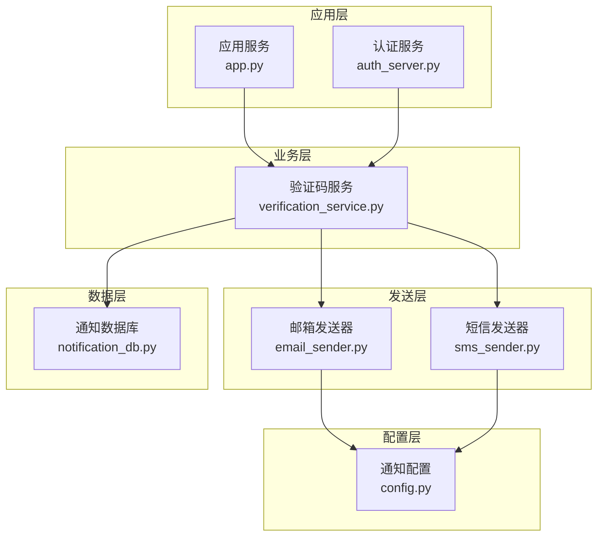
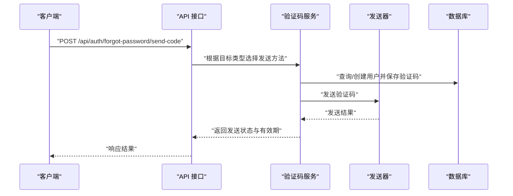
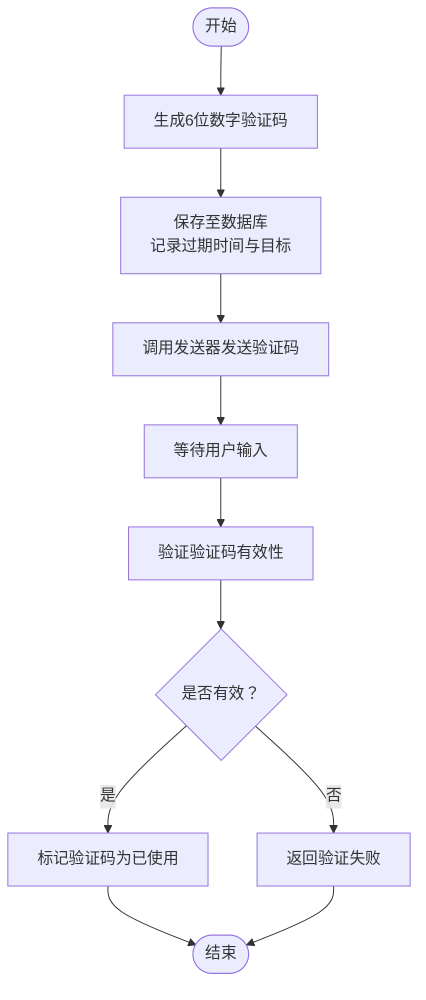
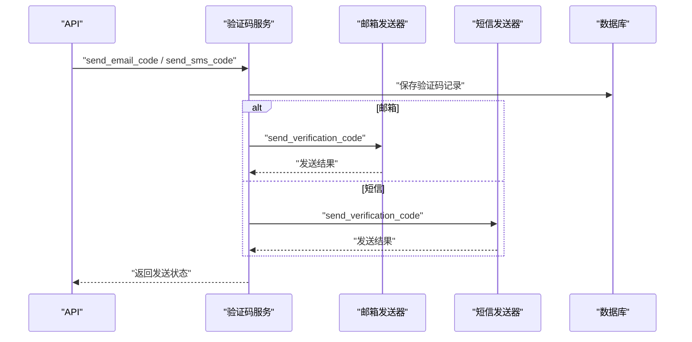
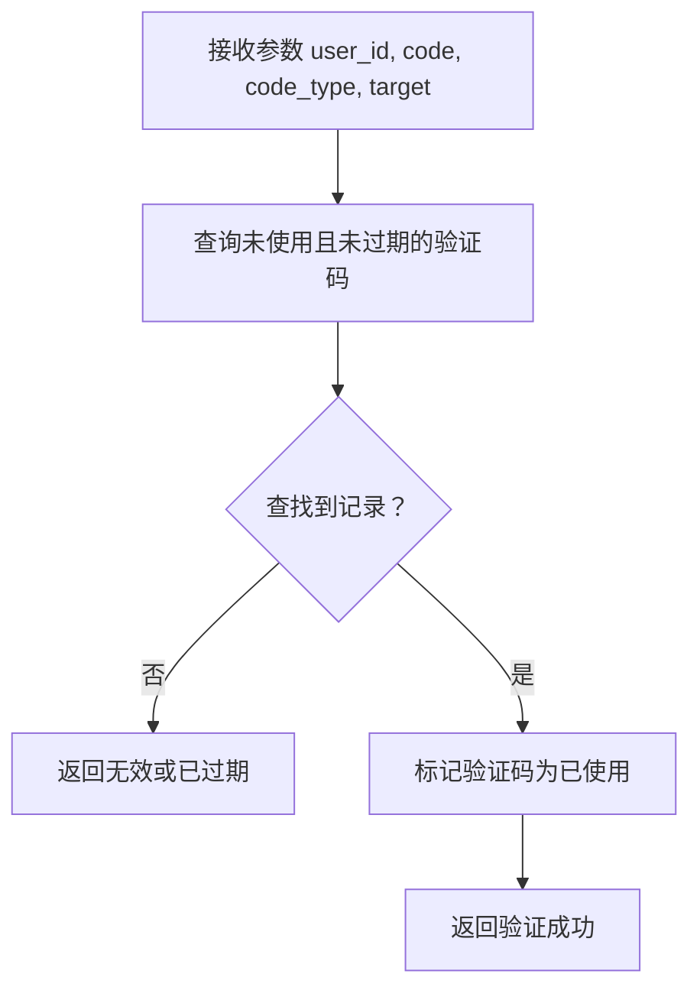
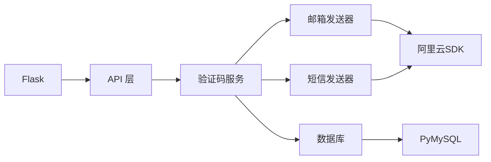

# 验证码服务

<cite>
**本文档引用的文件**
- [verification_service.py](file://python/src/notifications/verification_service.py)
- [email_sender.py](file://python/src/notifications/email_sender.py)
- [sms_sender.py](file://python/src/notifications/sms_sender.py)
- [config.py](file://python/src/notifications/config.py)
- [notification_db.py](file://python/src/notification_db.py)
- [app.py](file://python/app.py)
- [auth_server.py](file://python/auth_server.py)
- [requirements.txt](file://python/requirements.txt)
</cite>

## 目录
1. [简介](#简介)
2. [项目结构](#项目结构)
3. [核心组件](#核心组件)
4. [架构总览](#架构总览)
5. [详细组件分析](#详细组件分析)
6. [依赖关系分析](#依赖关系分析)
7. [性能考虑](#性能考虑)
8. [故障排除指南](#故障排除指南)
9. [结论](#结论)
10. [附录](#附录)

## 简介
本项目实现了一个完整的验证码服务，支持邮箱和短信两种发送渠道，提供验证码生成、存储、验证与过期管理，并具备基础的安全策略与滥用防护能力。服务采用模块化设计，通过独立的发送器与数据库层解耦，便于扩展与维护。

## 项目结构
验证码服务主要由以下模块组成：
- 验证码服务核心：负责验证码生成、发送调度、验证与使用标记
- 发送器：分别封装邮箱与短信发送逻辑及格式校验
- 数据库层：统一管理用户、验证码、令牌黑名单等表结构与操作
- API 层：对外暴露验证码发送与验证接口
- 配置层：集中管理第三方服务密钥、开关与默认参数

**图表来源**
- [verification_service.py:1-108](file://python/src/notifications/verification_service.py#L1-L108)
- [email_sender.py:1-67](file://python/src/notifications/email_sender.py#L1-L67)
- [sms_sender.py:1-65](file://python/src/notifications/sms_sender.py#L1-L65)
- [config.py:1-20](file://python/src/notifications/config.py#L1-L20)
- [notification_db.py:1-357](file://python/src/notification_db.py#L1-L357)
- [app.py:1-800](file://python/app.py#L1-L800)
- [auth_server.py:1-431](file://python/auth_server.py#L1-L431)

**章节来源**
- [verification_service.py:1-108](file://python/src/notifications/verification_service.py#L1-L108)
- [email_sender.py:1-67](file://python/src/notifications/email_sender.py#L1-L67)
- [sms_sender.py:1-65](file://python/src/notifications/sms_sender.py#L1-L65)
- [config.py:1-20](file://python/src/notifications/config.py#L1-L20)
- [notification_db.py:1-357](file://python/src/notification_db.py#L1-L357)
- [app.py:1-800](file://python/app.py#L1-L800)
- [auth_server.py:1-431](file://python/auth_server.py#L1-L431)

## 核心组件
- 验证码服务类：定义验证码长度与有效期常量，封装生成、发送、验证与临时用户创建逻辑
- 邮箱发送器：基于阿里云邮件推送SDK，进行邮箱格式校验与验证码邮件发送
- 短信发送器：基于阿里云短信SDK，进行手机号格式校验与验证码短信发送
- 数据库层：提供用户查询/创建、验证码保存/查询/标记使用、审计日志等能力
- API 接口：对外提供发送邮箱验证码、发送短信验证码、验证验证码等接口

**章节来源**
- [verification_service.py:7-108](file://python/src/notifications/verification_service.py#L7-L108)
- [email_sender.py:6-67](file://python/src/notifications/email_sender.py#L6-L67)
- [sms_sender.py:7-65](file://python/src/notifications/sms_sender.py#L7-L65)
- [notification_db.py:6-357](file://python/src/notification_db.py#L6-L357)
- [app.py:170-210](file://python/app.py#L170-L210)
- [auth_server.py:225-290](file://python/auth_server.py#L225-L290)

## 架构总览
验证码服务采用分层架构：
- 表现层：Flask 应用提供 RESTful 接口
- 业务层：VerificationService 聚合发送器与数据库，协调验证码生命周期
- 传输层：EmailSender/SmsSender 封装第三方 SDK 调用
- 持久层：NotificationDB 统一管理数据库连接与表操作

**图表来源**
- [auth_server.py:225-251](file://python/auth_server.py#L225-L251)
- [verification_service.py:25-81](file://python/src/notifications/verification_service.py#L25-L81)
- [email_sender.py:13-23](file://python/src/notifications/email_sender.py#L13-L23)
- [sms_sender.py:14-23](file://python/src/notifications/sms_sender.py#L14-L23)
- [notification_db.py:147-156](file://python/src/notification_db.py#L147-L156)

**章节来源**
- [auth_server.py:225-251](file://python/auth_server.py#L225-L251)
- [verification_service.py:25-81](file://python/src/notifications/verification_service.py#L25-L81)
- [email_sender.py:13-23](file://python/src/notifications/email_sender.py#L13-L23)
- [sms_sender.py:14-23](file://python/src/notifications/sms_sender.py#L14-L23)
- [notification_db.py:147-156](file://python/src/notification_db.py#L147-L156)

## 详细组件分析

### 验证码生成与存储策略
- 生成算法：使用纯数字随机序列，长度固定为6位
- 存储策略：将验证码与用户ID、目标类型（邮箱/短信）、目标值、过期时间等信息持久化
- 过期管理：数据库查询时比较当前时间与过期时间，仅接受未过期且未使用的验证码
- 使用标记：验证成功后将验证码标记为已使用，防止重复使用

**图表来源**
- [verification_service.py:22-23](file://python/src/notifications/verification_service.py#L22-L23)
- [verification_service.py:35-36](file://python/src/notifications/verification_service.py#L35-L36)
- [verification_service.py:83-101](file://python/src/notifications/verification_service.py#L83-L101)
- [notification_db.py:147-156](file://python/src/notification_db.py#L147-L156)
- [notification_db.py:158-179](file://python/src/notification_db.py#L158-L179)
- [notification_db.py:181-188](file://python/src/notification_db.py#L181-L188)

**章节来源**
- [verification_service.py:22-23](file://python/src/notifications/verification_service.py#L22-L23)
- [verification_service.py:35-36](file://python/src/notifications/verification_service.py#L35-L36)
- [verification_service.py:83-101](file://python/src/notifications/verification_service.py#L83-L101)
- [notification_db.py:147-156](file://python/src/notification_db.py#L147-L156)
- [notification_db.py:158-179](file://python/src/notification_db.py#L158-L179)
- [notification_db.py:181-188](file://python/src/notification_db.py#L181-L188)

### 验证码发送流程
- 邮箱发送：校验邮箱格式，调用阿里云邮件推送接口发送HTML邮件
- 短信发送：校验手机号格式，调用阿里云短信接口发送模板短信
- 发送失败处理：捕获异常并返回标准化错误信息

**图表来源**
- [verification_service.py:25-52](file://python/src/notifications/verification_service.py#L25-L52)
- [verification_service.py:54-81](file://python/src/notifications/verification_service.py#L54-L81)
- [email_sender.py:13-23](file://python/src/notifications/email_sender.py#L13-L23)
- [sms_sender.py:14-23](file://python/src/notifications/sms_sender.py#L14-L23)
- [notification_db.py:147-156](file://python/src/notification_db.py#L147-L156)

**章节来源**
- [verification_service.py:25-52](file://python/src/notifications/verification_service.py#L25-L52)
- [verification_service.py:54-81](file://python/src/notifications/verification_service.py#L54-L81)
- [email_sender.py:13-23](file://python/src/notifications/email_sender.py#L13-L23)
- [sms_sender.py:14-23](file://python/src/notifications/sms_sender.py#L14-L23)
- [notification_db.py:147-156](file://python/src/notification_db.py#L147-L156)

### 验证码验证与安全机制
- 验证逻辑：按用户ID、验证码、类型与目标查询未使用且未过期的记录
- 使用标记：验证成功后立即标记该验证码为已使用，避免二次使用
- 安全提示：前端邮件模板包含“5分钟内有效”的提示，降低泄露风险

**图表来源**
- [verification_service.py:83-101](file://python/src/notifications/verification_service.py#L83-L101)
- [notification_db.py:158-179](file://python/src/notification_db.py#L158-L179)
- [notification_db.py:181-188](file://python/src/notification_db.py#L181-L188)

**章节来源**
- [verification_service.py:83-101](file://python/src/notifications/verification_service.py#L83-L101)
- [notification_db.py:158-179](file://python/src/notification_db.py#L158-L179)
- [notification_db.py:181-188](file://python/src/notification_db.py#L181-L188)

### API 接口定义
- 发送邮箱验证码
  - 方法：POST
  - 路径：/api/auth/forgot-password/send-code
  - 请求体：包含邮箱字段
  - 响应：成功返回发送状态与有效期，失败返回错误信息
- 发送短信验证码
  - 方法：POST
  - 路径：/api/auth/forgot-password/send-code
  - 请求体：包含手机号字段
  - 响应：成功返回发送状态与有效期，失败返回错误信息
- 验证验证码
  - 方法：POST
  - 路径：/api/auth/forgot-password/verify-code
  - 请求体：包含 user_id、code、target
  - 响应：成功返回验证结果，失败返回错误信息

**章节来源**
- [auth_server.py:225-251](file://python/auth_server.py#L225-L251)
- [auth_server.py:262-290](file://python/auth_server.py#L262-L290)
- [app.py:170-210](file://python/app.py#L170-L210)

### 配置与环境变量
- 阿里云访问凭据：AccessKey ID/Secret、区域
- 短信签名与模板：签名名称、模板编号
- 功能开关：邮箱与短信发送开关
- 验证码参数：验证码长度、有效期（分钟）

**章节来源**
- [config.py:4-19](file://python/src/notifications/config.py#L4-L19)

## 依赖关系分析
- 外部依赖：Flask、Flask-CORS、PyMySQL、阿里云SDK、bcrypt、PyJWT、dotenv 等
- 内部依赖：验证码服务依赖发送器与数据库；API 层依赖验证码服务

**图表来源**
- [requirements.txt:1-14](file://python/requirements.txt#L1-L14)
- [verification_service.py:1-4](file://python/src/notifications/verification_service.py#L1-L4)
- [email_sender.py:1-4](file://python/src/notifications/email_sender.py#L1-L4)
- [sms_sender.py:1-4](file://python/src/notifications/sms_sender.py#L1-L4)
- [notification_db.py:1-4](file://python/src/notification_db.py#L1-L4)

**章节来源**
- [requirements.txt:1-14](file://python/requirements.txt#L1-L14)
- [verification_service.py:1-4](file://python/src/notifications/verification_service.py#L1-L4)
- [email_sender.py:1-4](file://python/src/notifications/email_sender.py#L1-L4)
- [sms_sender.py:1-4](file://python/src/notifications/sms_sender.py#L1-L4)
- [notification_db.py:1-4](file://python/src/notification_db.py#L1-L4)

## 性能考虑
- 数据库连接：提供连接重试与自动重连机制，减少网络波动影响
- 查询优化：验证码查询包含类型与目标过滤，建议在数据库层面建立复合索引以提升查询效率
- 并发控制：当前代码未显式实现并发锁或限流，建议在发送前增加基于目标的速率限制与幂等性控制
- 缓存策略：可引入Redis对验证码进行缓存，缩短查询路径并支持原子性操作

[本节为通用指导，无需具体文件来源]

## 故障排除指南
- 发送失败：检查阿里云凭据配置、网络连通性与第三方接口返回状态
- 验证失败：确认验证码未过期、未被使用、类型与目标匹配
- 格式错误：邮箱/手机号格式校验失败，需修正输入
- 数据库异常：查看连接日志与重试机制是否正常工作

**章节来源**
- [email_sender.py:58-62](file://python/src/notifications/email_sender.py#L58-L62)
- [sms_sender.py:56-60](file://python/src/notifications/sms_sender.py#L56-L60)
- [notification_db.py:28-39](file://python/src/notification_db.py#L28-L39)

## 结论
本验证码服务实现了从生成、发送、存储到验证的完整闭环，具备基本的安全提示与错误处理。建议后续增强并发控制、速率限制与缓存策略，以进一步提升可用性与安全性。

[本节为总结性内容，无需具体文件来源]

## 附录

### 验证码类型与有效期
- 类型：邮箱验证码、短信验证码
- 有效期：默认5分钟

**章节来源**
- [verification_service.py:8-9](file://python/src/notifications/verification_service.py#L8-L9)
- [config.py:15-16](file://python/src/notifications/config.py#L15-L16)

### 发送频率限制与滥用防护
- 当前实现：未内置显式的频率限制与防刷机制
- 建议方案：基于目标（邮箱/手机号）维度实现滑动窗口计数与冷却期，结合IP白名单与风控策略

[本节为通用指导，无需具体文件来源]

### 发送渠道选择
- 邮件：适用于需要更长有效期或复杂内容展示的场景
- 短信：适用于即时性强、移动端为主的场景

[本节为通用指导，无需具体文件来源]

### 缓存管理与并发控制
- 缓存：建议使用Redis缓存验证码，设置TTL与原子性操作
- 并发：在发送前进行幂等性检查与并发锁，避免重复发送

[本节为通用指导，无需具体文件来源]