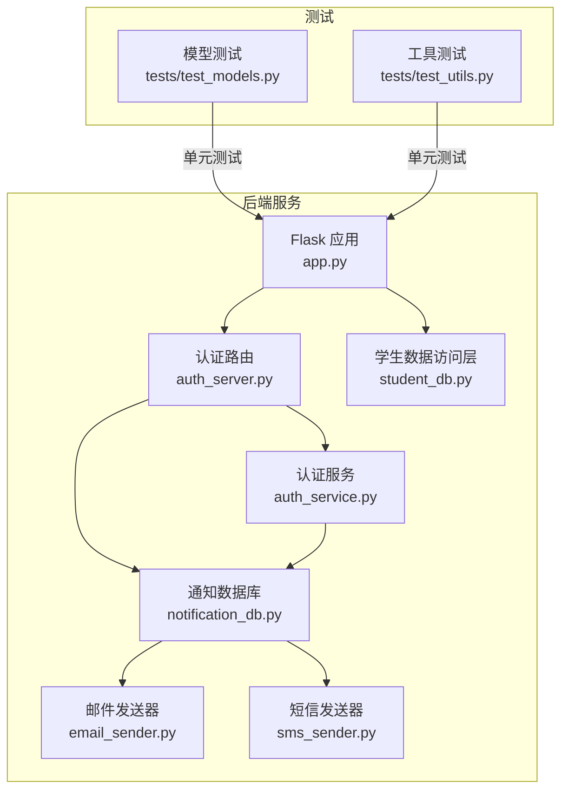
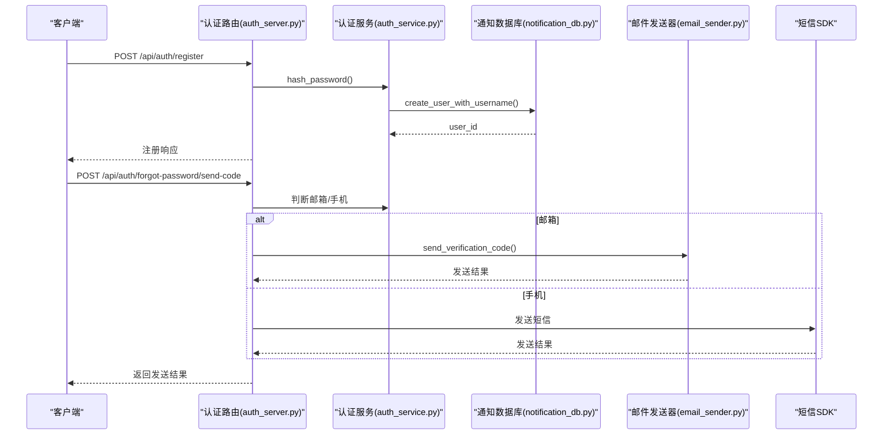
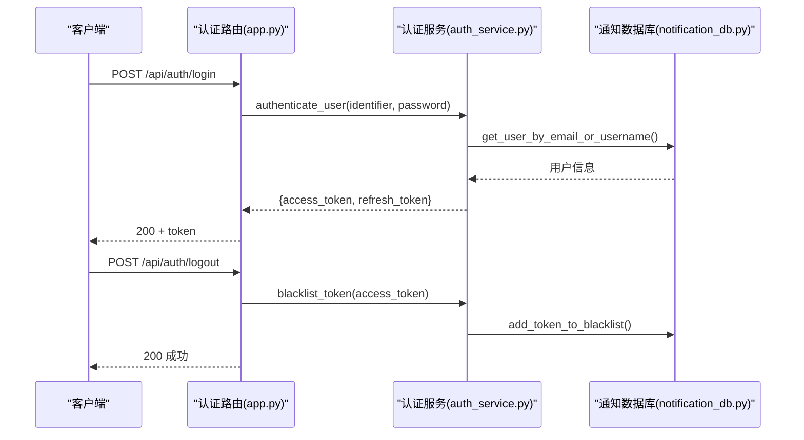
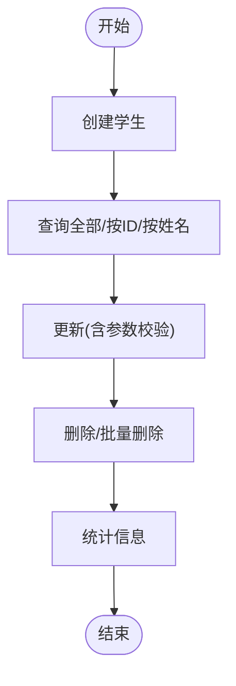
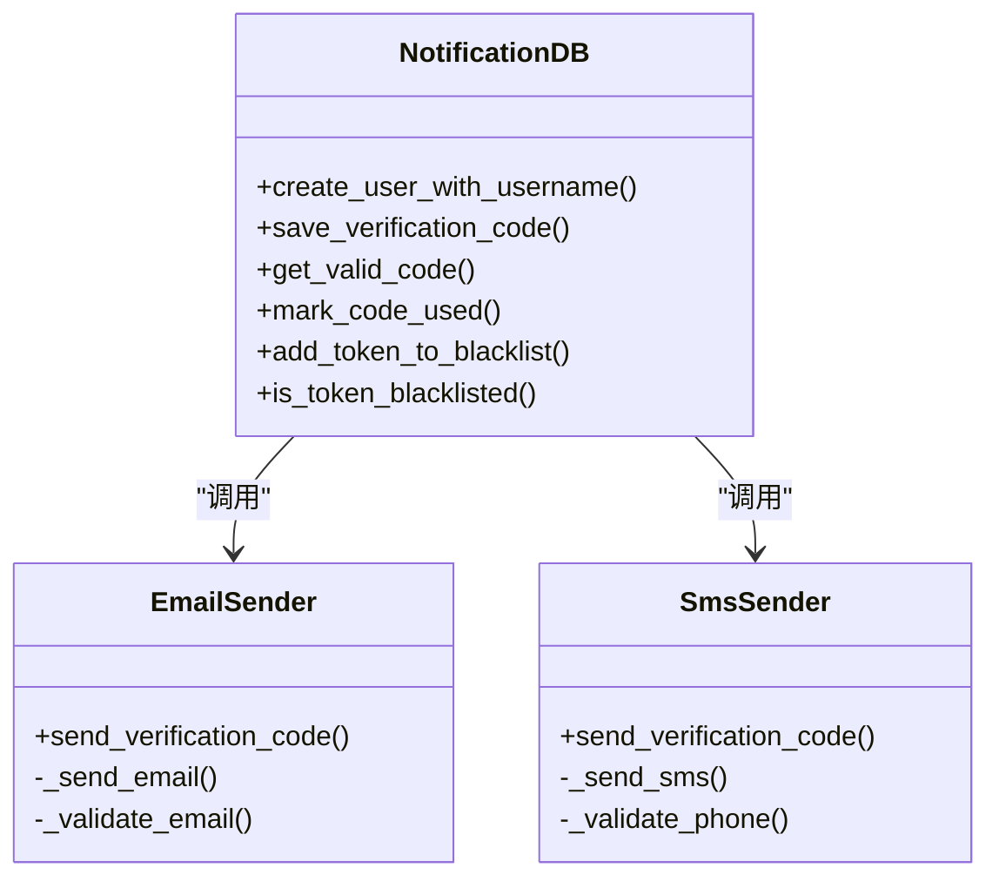
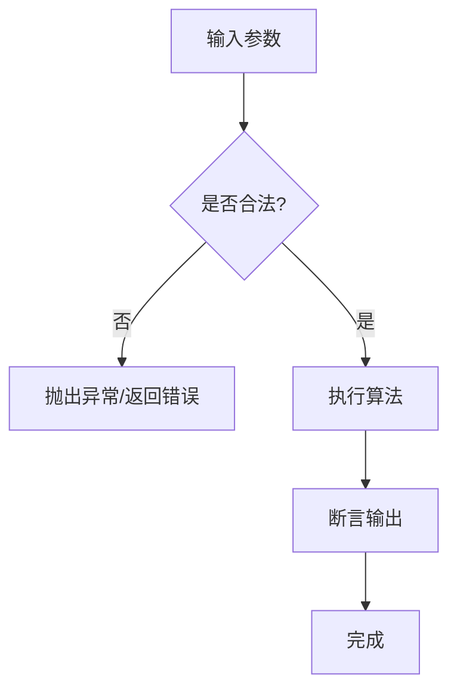
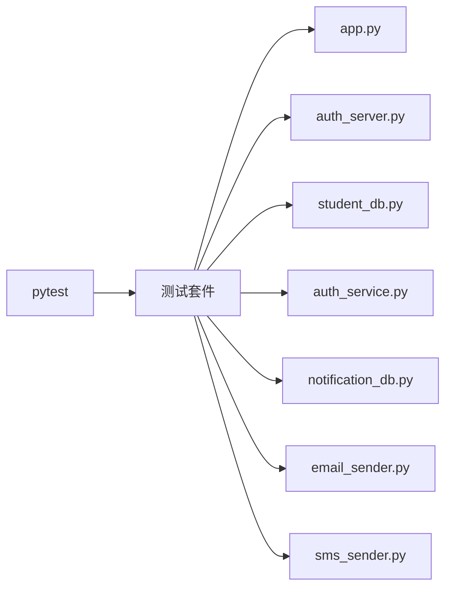

# 测试策略

<cite>
**本文引用的文件**
- [requirements.txt](file://python/requirements.txt)
- [test_models.py](file://python/tests/test_models.py)
- [test_utils.py](file://python/tests/test_utils.py)
- [models.py](file://python/src/models.py)
- [utils.py](file://python/src/utils.py)
- [app.py](file://python/app.py)
- [auth_server.py](file://python/auth_server.py)
- [student_db.py](file://python/src/student_db.py)
- [auth_service.py](file://python/src/auth_service.py)
- [notification_db.py](file://python/src/notification_db.py)
- [email_sender.py](file://python/src/notifications/email_sender.py)
- [sms_sender.py](file://python/src/notifications/sms_sender.py)
- [main.py](file://python/main.py)
</cite>

## 目录
1. [引言](#引言)
2. [项目结构](#项目结构)
3. [核心组件](#核心组件)
4. [架构总览](#架构总览)
5. [详细组件分析](#详细组件分析)
6. [依赖分析](#依赖分析)
7. [性能考虑](#性能考虑)
8. [故障排查指南](#故障排查指南)
9. [结论](#结论)
10. [附录](#附录)

## 引言
本测试策略文档面向学生管理系统，旨在建立覆盖单元测试、集成测试与端到端测试的完整质量保证体系。文档明确测试框架选择（pytest）、测试用例编写规范、Mock策略、覆盖率要求、持续集成配置与自动化测试流程，并补充性能测试、安全测试与兼容性测试的最佳实践，确保代码质量与系统稳定性。

## 项目结构
系统由后端Python服务与前端Vue应用组成，后端采用Flask提供REST API，数据库使用MySQL，通知模块支持邮件与短信验证码。测试主要集中在后端Python代码与部分核心业务逻辑上。

图表来源
- [app.py:1-800](file://python/app.py#L1-L800)
- [auth_server.py:1-431](file://python/auth_server.py#L1-L431)
- [student_db.py:1-259](file://python/src/student_db.py#L1-L259)
- [auth_service.py:1-187](file://python/src/auth_service.py#L1-L187)
- [notification_db.py:1-357](file://python/src/notification_db.py#L1-L357)
- [email_sender.py:1-67](file://python/src/notifications/email_sender.py#L1-L67)
- [sms_sender.py:1-65](file://python/src/notifications/sms_sender.py#L1-L65)
- [test_models.py:1-42](file://python/tests/test_models.py#L1-L42)
- [test_utils.py:1-41](file://python/tests/test_utils.py#L1-L41)

章节来源
- [requirements.txt:1-13](file://python/requirements.txt#L1-L13)
- [app.py:1-800](file://python/app.py#L1-L800)
- [auth_server.py:1-431](file://python/auth_server.py#L1-L431)
- [student_db.py:1-259](file://python/src/student_db.py#L1-L259)
- [auth_service.py:1-187](file://python/src/auth_service.py#L1-L187)
- [notification_db.py:1-357](file://python/src/notification_db.py#L1-L357)
- [email_sender.py:1-67](file://python/src/notifications/email_sender.py#L1-L67)
- [sms_sender.py:1-65](file://python/src/notifications/sms_sender.py#L1-L65)
- [test_models.py:1-42](file://python/tests/test_models.py#L1-L42)
- [test_utils.py:1-41](file://python/tests/test_utils.py#L1-L41)

## 核心组件
- 单元测试：基于unittest与pytest，覆盖基础数学运算、数据结构与算法等纯函数与简单类。
- 集成测试：围绕Flask路由、认证服务、通知数据库与外部SDK（阿里云短信/邮件）进行端到端验证。
- 端到端测试：通过HTTP客户端对认证、爬虫、任务管理等API进行场景化测试。
- Mock策略：对外部依赖（数据库连接、第三方SDK）进行Mock，隔离环境差异，提升测试稳定性与速度。
- 覆盖率：建议达到关键路径与分支覆盖率≥80%，核心业务模块≥90%。
- 持续集成：建议在CI中执行pytest、覆盖率统计与静态检查，失败即阻断合并。

章节来源
- [requirements.txt:1-13](file://python/requirements.txt#L1-L13)
- [test_models.py:1-42](file://python/tests/test_models.py#L1-L42)
- [test_utils.py:1-41](file://python/tests/test_utils.py#L1-L41)

## 架构总览
下图展示认证与通知模块的交互关系，以及测试关注点：

图表来源
- [auth_server.py:47-121](file://python/auth_server.py#L47-L121)
- [auth_server.py:225-260](file://python/auth_server.py#L225-L260)
- [auth_service.py:20-25](file://python/src/auth_service.py#L20-L25)
- [notification_db.py:344-353](file://python/src/notification_db.py#L344-L353)
- [email_sender.py:13-23](file://python/src/notifications/email_sender.py#L13-L23)
- [sms_sender.py:14-23](file://python/src/notifications/sms_sender.py#L14-L23)

## 详细组件分析

### 认证与会话测试
- 测试范围
  - 密码哈希与校验
  - JWT访问/刷新令牌生成与黑名单
  - 登录/登出流程与失败场景（账户锁定、密码错误）
  - 忘记密码验证码发送与校验
- Mock策略
  - 使用unittest.mock对数据库接口与外部SDK进行替换，避免真实数据库与网络调用。
  - 对鉴权装饰器进行包装，注入模拟用户上下文。
- 关键断言
  - 响应字段完整性（success/message/code/data）
  - HTTP状态码与业务状态一致
  - 审计日志记录与黑名单写入

图表来源
- [app.py:95-164](file://python/app.py#L95-L164)
- [auth_service.py:76-118](file://python/src/auth_service.py#L76-L118)
- [auth_service.py:158-183](file://python/src/auth_service.py#L158-L183)
- [notification_db.py:288-295](file://python/src/notification_db.py#L288-L295)
- [notification_db.py:297-305](file://python/src/notification_db.py#L297-L305)

章节来源
- [app.py:95-164](file://python/app.py#L95-L164)
- [auth_service.py:1-187](file://python/src/auth_service.py#L1-L187)
- [notification_db.py:1-357](file://python/src/notification_db.py#L1-L357)

### 学生数据访问层测试
- 测试范围
  - CRUD操作（创建、查询、更新、删除）
  - 批量删除与存在性检查
  - 统计信息计算（平均年龄/成绩、最高/最低）
- Mock策略
  - 替换pymysql连接，返回预设结果集，避免真实数据库依赖。
- 关键断言
  - 返回值结构与业务语义一致
  - 异常场景（不存在ID、参数非法）抛出预期异常

图表来源
- [student_db.py:32-137](file://python/src/student_db.py#L32-L137)
- [student_db.py:164-234](file://python/src/student_db.py#L164-L234)

章节来源
- [student_db.py:1-259](file://python/src/student_db.py#L1-L259)

### 通知与验证码测试
- 测试范围
  - 邮件与短信发送器的输入校验与调用
  - 验证码存储、查询与使用标记
- Mock策略
  - Mock阿里云SDK响应，覆盖成功/失败/异常路径
- 关键断言
  - 格式校验通过与失败提示
  - 数据库记录一致性与过期控制

图表来源
- [notification_db.py:147-189](file://python/src/notification_db.py#L147-L189)
- [notification_db.py:307-311](file://python/src/notification_db.py#L307-L311)
- [email_sender.py:13-23](file://python/src/notifications/email_sender.py#L13-L23)
- [sms_sender.py:14-23](file://python/src/notifications/sms_sender.py#L14-L23)

章节来源
- [notification_db.py:1-357](file://python/src/notification_db.py#L1-L357)
- [email_sender.py:1-67](file://python/src/notifications/email_sender.py#L1-L67)
- [sms_sender.py:1-65](file://python/src/notifications/sms_sender.py#L1-L65)

### 工具与模型单元测试
- 测试范围
  - 数学运算（加减乘除、阶乘、斐波那契、素数判断）
  - 几何形状面积与周长计算
  - 数据结构（Person/Student）行为验证
- 编写规范
  - 每个函数/方法至少一个正向用例与边界/异常用例
  - 使用参数化测试覆盖多组输入
- 复杂度与性能
  - 算法测试关注时间复杂度与稳定性，避免真实I/O

图表来源
- [utils.py:13-16](file://python/src/utils.py#L13-L16)
- [utils.py:23-31](file://python/src/utils.py#L23-L31)
- [utils.py:47-57](file://python/src/utils.py#L47-L57)
- [models.py:1-59](file://python/src/models.py#L1-L59)

章节来源
- [test_models.py:1-42](file://python/tests/test_models.py#L1-L42)
- [test_utils.py:1-41](file://python/tests/test_utils.py#L1-L41)
- [models.py:1-59](file://python/src/models.py#L1-L59)
- [utils.py:1-76](file://python/src/utils.py#L1-L76)

## 依赖分析
- 外部依赖
  - Flask、Flask-CORS、PyMySQL、bcrypt、PyJWT、Requests、BeautifulSoup、lxml、openpyxl、阿里云SDK等。
- 测试依赖
  - pytest用于执行测试套件；pytest-cov用于覆盖率统计；pytest-mock用于Mock。
- 内部耦合
  - 认证路由依赖认证服务与通知数据库；通知数据库依赖邮件/短信发送器；学生服务依赖学生数据库。

图表来源
- [requirements.txt:1-13](file://python/requirements.txt#L1-L13)
- [app.py:1-800](file://python/app.py#L1-L800)
- [auth_server.py:1-431](file://python/auth_server.py#L1-L431)
- [student_db.py:1-259](file://python/src/student_db.py#L1-L259)
- [auth_service.py:1-187](file://python/src/auth_service.py#L1-L187)
- [notification_db.py:1-357](file://python/src/notification_db.py#L1-L357)
- [email_sender.py:1-67](file://python/src/notifications/email_sender.py#L1-L67)
- [sms_sender.py:1-65](file://python/src/notifications/sms_sender.py#L1-L65)

章节来源
- [requirements.txt:1-13](file://python/requirements.txt#L1-L13)

## 性能考虑
- 单元测试
  - 优先使用内存级Mock，避免数据库与网络I/O；对大数组排序与查找算法进行参数化测试，覆盖小/中/大规模输入。
- 集成测试
  - 使用较小数据集与本地MySQL实例；对慢查询与重复查询进行缓存与索引优化。
- 端到端测试
  - 并发场景下限制请求速率，避免触发限流；对CSV导出等耗时操作进行超时控制。
- 性能指标
  - 接口P95延迟、并发用户下的吞吐量、数据库连接池利用率。

## 故障排查指南
- 常见问题
  - 数据库连接失败：检查连接参数与端口；在通知数据库中增加重试与连接保活。
  - 验证码发送失败：检查阿里云SDK配置与签名模板；捕获SDK异常并记录详细错误。
  - 认证失败：核对JWT密钥、过期时间与黑名单状态；检查用户锁定逻辑。
- 日志与审计
  - 在认证与通知路由中记录关键事件与错误堆栈，便于定位问题。
- 回归测试
  - 对修复缺陷的分支执行回归测试套件，确保未引入新问题。

章节来源
- [notification_db.py:28-39](file://python/src/notification_db.py#L28-L39)
- [email_sender.py:44-62](file://python/src/notifications/email_sender.py#L44-L62)
- [sms_sender.py:37-60](file://python/src/notifications/sms_sender.py#L37-L60)
- [auth_service.py:58-66](file://python/src/auth_service.py#L58-L66)

## 结论
通过分层测试策略与严格的Mock与覆盖率要求，结合CI流水线与性能/安全/兼容性最佳实践，能够显著提升学生管理系统的质量与稳定性。建议持续迭代测试用例，扩大覆盖率，并在生产前进行充分的端到端验证。

## 附录
- 测试用例编写规范
  - 命名：test_xxx()，描述具体行为与期望。
  - 组织：按模块划分测试文件，每个文件对应被测模块。
  - 断言：优先使用结构化断言，覆盖正常/异常/边界场景。
- Mock策略清单
  - 数据库连接：替换连接对象，返回预设游标与结果。
  - 外部SDK：替换SDK客户端，返回固定响应或抛出异常。
  - 时间与时序：使用freezegun或Mock时间源，确保可重复性。
- CI配置建议
  - 触发：push/PR触发；夜间全量回归。
  - 步骤：安装依赖、运行pytest、收集覆盖率、静态检查、报告与告警。
  - 失败条件：测试失败、覆盖率低于阈值、静态检查不通过。