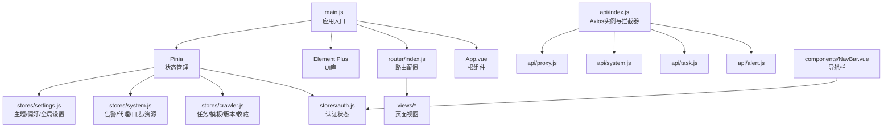
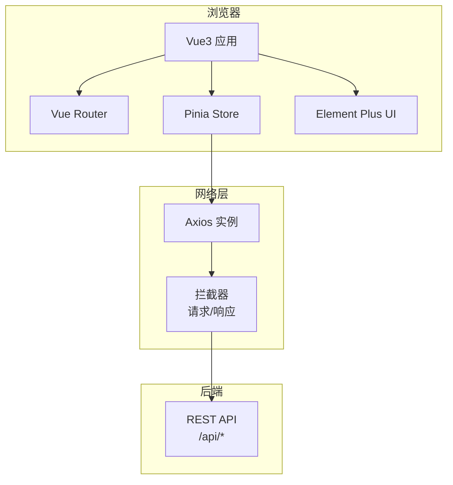
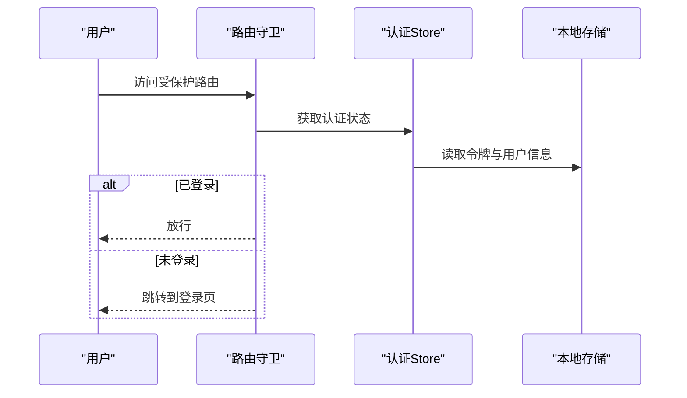
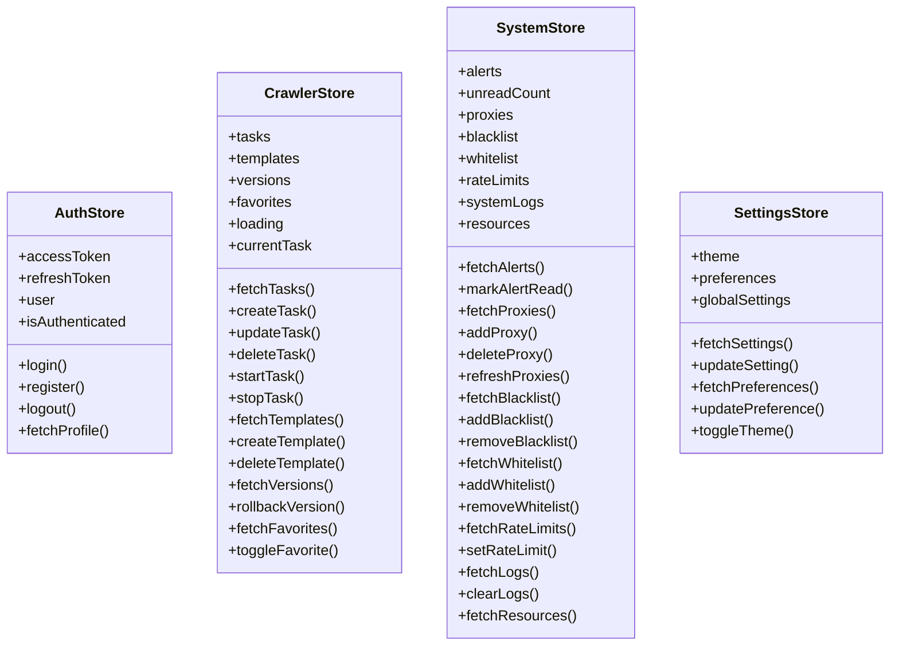
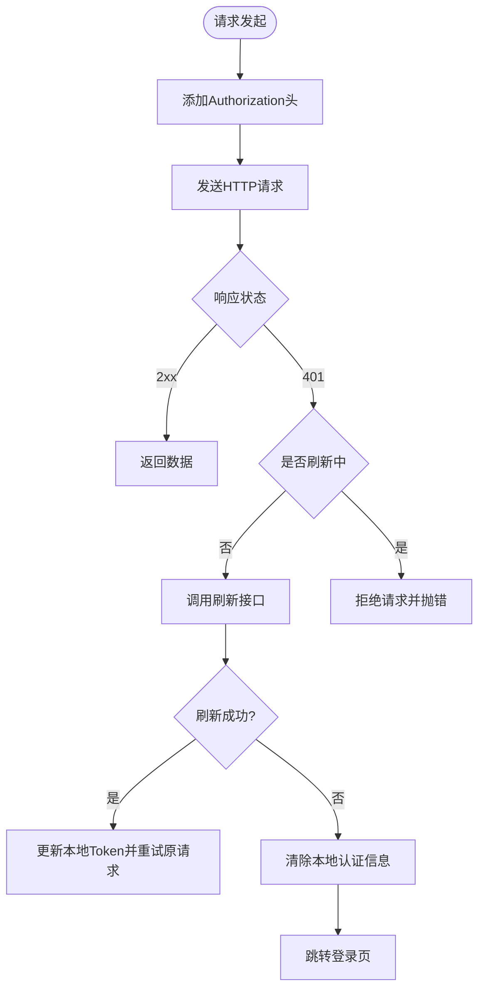
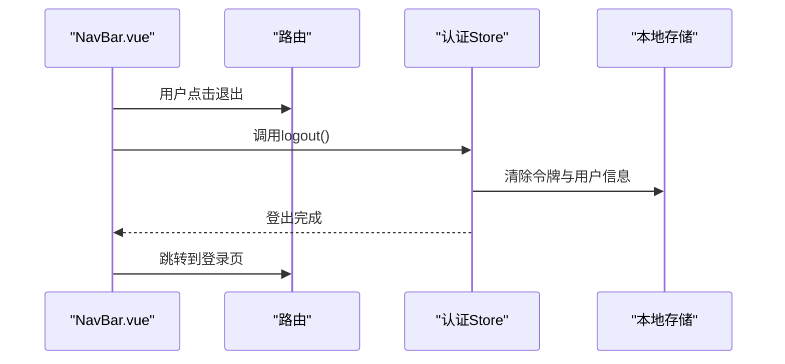
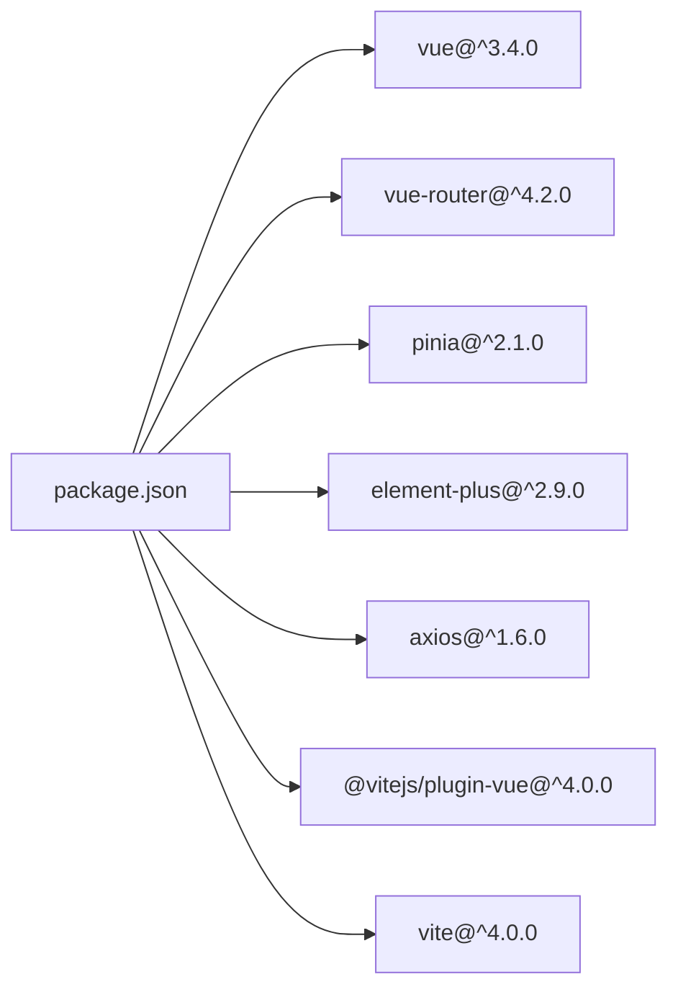

# 前端架构

<cite>
**本文引用的文件**
- [package.json](file://python-web/package.json)
- [vite.config.js](file://python-web/vite.config.js)
- [main.js](file://python-web/src/main.js)
- [App.vue](file://python-web/src/App.vue)
- [router/index.js](file://python-web/src/router/index.js)
- [stores/auth.js](file://python-web/src/stores/auth.js)
- [stores/crawler.js](file://python-web/src/stores/crawler.js)
- [stores/settings.js](file://python-web/src/stores/settings.js)
- [stores/system.js](file://python-web/src/stores/system.js)
- [api/index.js](file://python-web/src/api/index.js)
- [api/alert.js](file://python-web/src/api/alert.js)
- [api/task.js](file://python-web/src/api/task.js)
- [api/system.js](file://python-web/src/api/system.js)
- [api/proxy.js](file://python-web/src/api/proxy.js)
- [components/NavBar.vue](file://python-web/src/components/NavBar.vue)
</cite>

## 目录
1. [简介](#简介)
2. [项目结构](#项目结构)
3. [核心组件](#核心组件)
4. [架构总览](#架构总览)
5. [详细组件分析](#详细组件分析)
6. [依赖关系分析](#依赖关系分析)
7. [性能考虑](#性能考虑)
8. [故障排查指南](#故障排查指南)
9. [结论](#结论)
10. [附录](#附录)

## 简介
本项目为基于 Vue3 的单页面应用（SPA），采用 Composition API 风格与组合式 Store（Pinia）进行状态管理，结合 Element Plus 组件库与 Axios 进行 API 交互。应用通过 Vue Router 实现前端路由与鉴权守卫，提供用户认证、任务管理、代理与风控配置、系统监控与日志等模块。

## 项目结构
前端工程位于 python-web 目录，采用“按功能域分层”的组织方式：
- 根配置：package.json（脚本与依赖）、vite.config.js（开发服务器与插件）
- 入口：main.js（应用挂载、插件注册）
- 视图与路由：views 与 router/index.js
- 状态管理：stores 下各领域 Store
- API 客户端：api 下统一客户端与按业务拆分的模块
- UI 组件：components 下通用组件
- 应用根组件：App.vue（仅包含路由视图）

**图表来源**
- [main.js:1-16](file://python-web/src/main.js#L1-L16)
- [App.vue:1-10](file://python-web/src/App.vue#L1-L10)
- [router/index.js:1-150](file://python-web/src/router/index.js#L1-L150)
- [stores/auth.js:1-74](file://python-web/src/stores/auth.js#L1-L74)
- [stores/crawler.js:1-174](file://python-web/src/stores/crawler.js#L1-L174)
- [stores/system.js:1-168](file://python-web/src/stores/system.js#L1-L168)
- [stores/settings.js:1-59](file://python-web/src/stores/settings.js#L1-L59)
- [api/index.js:1-95](file://python-web/src/api/index.js#L1-L95)
- [api/alert.js:1-35](file://python-web/src/api/alert.js#L1-L35)
- [api/task.js:1-67](file://python-web/src/api/task.js#L1-L67)
- [api/system.js:1-23](file://python-web/src/api/system.js#L1-L23)
- [api/proxy.js:1-63](file://python-web/src/api/proxy.js#L1-L63)
- [components/NavBar.vue:1-352](file://python-web/src/components/NavBar.vue#L1-L352)

**章节来源**
- [package.json:1-24](file://python-web/package.json#L1-L24)
- [vite.config.js:1-11](file://python-web/vite.config.js#L1-L11)
- [main.js:1-16](file://python-web/src/main.js#L1-L16)
- [App.vue:1-10](file://python-web/src/App.vue#L1-L10)
- [router/index.js:1-150](file://python-web/src/router/index.js#L1-L150)

## 核心组件
- 应用入口与插件注册：在入口中创建应用实例、注册 Pinia、路由与 Element Plus，并挂载到 DOM。
- 路由系统：定义多页面路由与鉴权守卫，支持登录/注册页跳转与已登录用户的访问控制。
- 状态管理：四个核心 Store 分别覆盖认证、爬虫任务、系统监控与设置，均使用组合式 Store API。
- API 客户端：统一的 Axios 实例，内置请求/响应拦截器，自动注入 Token 并处理 401 刷新与登出。
- 导航组件：通用导航栏，集成用户信息展示与退出登录逻辑。

**章节来源**
- [main.js:1-16](file://python-web/src/main.js#L1-L16)
- [router/index.js:134-147](file://python-web/src/router/index.js#L134-L147)
- [stores/auth.js:1-74](file://python-web/src/stores/auth.js#L1-L74)
- [stores/crawler.js:1-174](file://python-web/src/stores/crawler.js#L1-L174)
- [stores/system.js:1-168](file://python-web/src/stores/system.js#L1-L168)
- [stores/settings.js:1-59](file://python-web/src/stores/settings.js#L1-L59)
- [api/index.js:1-95](file://python-web/src/api/index.js#L1-L95)
- [components/NavBar.vue:84-121](file://python-web/src/components/NavBar.vue#L84-L121)

## 架构总览
应用采用典型的 SPA 架构：浏览器加载静态资源后，通过 Vue Router 在前端渲染不同页面；数据通过 Axios 发起 HTTP 请求并与后端交互；Pinia Store 提供跨组件共享的状态。

**图表来源**
- [main.js:1-16](file://python-web/src/main.js#L1-L16)
- [router/index.js:1-150](file://python-web/src/router/index.js#L1-L150)
- [stores/auth.js:1-74](file://python-web/src/stores/auth.js#L1-L74)
- [stores/crawler.js:1-174](file://python-web/src/stores/crawler.js#L1-L174)
- [stores/system.js:1-168](file://python-web/src/stores/system.js#L1-L168)
- [stores/settings.js:1-59](file://python-web/src/stores/settings.js#L1-L59)
- [api/index.js:1-95](file://python-web/src/api/index.js#L1-L95)

## 详细组件分析

### 路由与鉴权
- 路由定义：包含登录、注册、重置密码、主页、个人资料、任务相关、告警、数据管理、代理与风控、系统监控与日志、工作区与设置等页面。
- 鉴权守卫：根据路由元信息 requiresAuth 决定是否需要登录；对已登录用户禁止重复进入登录/注册页；未登录访问受保护路由跳转至登录页。

**图表来源**
- [router/index.js:134-147](file://python-web/src/router/index.js#L134-L147)
- [stores/auth.js:6-28](file://python-web/src/stores/auth.js#L6-L28)

**章节来源**
- [router/index.js:4-127](file://python-web/src/router/index.js#L4-L127)
- [router/index.js:134-147](file://python-web/src/router/index.js#L134-L147)
- [stores/auth.js:6-28](file://python-web/src/stores/auth.js#L6-L28)

### 状态管理（Pinia）
- 认证 Store：维护访问令牌、刷新令牌与用户信息，提供登录、注册、登出、拉取资料等方法，并持久化到本地存储。
- 爬虫 Store：管理任务列表、模板、版本、收藏、当前任务与加载状态，提供增删改查、启停、版本回滚、收藏切换等操作。
- 系统 Store：聚合告警、代理池、黑白名单、速率限制、系统日志、资源统计等数据与对应操作。
- 设置 Store：维护主题、偏好与全局设置，支持切换主题并同步到 DOM 属性。

**图表来源**
- [stores/auth.js:1-74](file://python-web/src/stores/auth.js#L1-L74)
- [stores/crawler.js:1-174](file://python-web/src/stores/crawler.js#L1-L174)
- [stores/system.js:1-168](file://python-web/src/stores/system.js#L1-L168)
- [stores/settings.js:1-59](file://python-web/src/stores/settings.js#L1-L59)

**章节来源**
- [stores/auth.js:1-74](file://python-web/src/stores/auth.js#L1-L74)
- [stores/crawler.js:1-174](file://python-web/src/stores/crawler.js#L1-L174)
- [stores/system.js:1-168](file://python-web/src/stores/system.js#L1-L168)
- [stores/settings.js:1-59](file://python-web/src/stores/settings.js#L1-L59)

### API 客户端与错误处理
- Axios 实例：统一基础路径、超时与 Content-Type 头。
- 请求拦截：自动附加 Authorization Bearer Token。
- 响应拦截：处理 401 未授权，尝试刷新令牌；刷新失败或非刷新接口的 401 将清除本地认证信息并跳转登录页。
- 模块化 API：按业务拆分为 alert、task、system、proxy 等模块，统一通过基础 api 对象发起请求。

**图表来源**
- [api/index.js:11-59](file://python-web/src/api/index.js#L11-L59)

**章节来源**
- [api/index.js:1-95](file://python-web/src/api/index.js#L1-L95)
- [api/alert.js:1-35](file://python-web/src/api/alert.js#L1-L35)
- [api/task.js:1-67](file://python-web/src/api/task.js#L1-L67)
- [api/system.js:1-23](file://python-web/src/api/system.js#L1-L23)
- [api/proxy.js:1-63](file://python-web/src/api/proxy.js#L1-L63)

### 组件通信机制
- 导航栏组件：通过路由与认证 Store 实现菜单高亮、下拉展开与用户登出。
- 组件间通信：主要通过 Pinia Store 共享状态，子组件通过 Store 方法触发数据变更；路由参数通过 props 或 Store 传递。

**图表来源**
- [components/NavBar.vue:117-120](file://python-web/src/components/NavBar.vue#L117-L120)
- [stores/auth.js:43-51](file://python-web/src/stores/auth.js#L43-L51)

**章节来源**
- [components/NavBar.vue:84-121](file://python-web/src/components/NavBar.vue#L84-L121)
- [stores/auth.js:43-51](file://python-web/src/stores/auth.js#L43-L51)

### UI 组件库使用
- Element Plus：全局安装并在入口注册，提供丰富的 UI 组件与图标，用于构建页面布局与交互控件。

**章节来源**
- [main.js:3-4](file://python-web/src/main.js#L3-L4)

## 依赖关系分析
- 构建工具：Vite 提供开发服务器与打包能力，插件支持 Vue 单文件组件。
- 运行时依赖：Vue3、Vue Router、Pinia、Element Plus、Axios。
- 开发依赖：@vitejs/plugin-vue、vite。

**图表来源**
- [package.json:11-22](file://python-web/package.json#L11-L22)

**章节来源**
- [package.json:1-24](file://python-web/package.json#L1-L24)
- [vite.config.js:1-11](file://python-web/vite.config.js#L1-L11)

## 性能考虑
- 懒加载路由：路由组件使用动态导入，减少首屏体积。
- 组件懒加载：导航栏等组件按需引入，避免不必要的初始化。
- 状态粒度：Store 按领域划分，避免全局状态臃肿。
- 缓存策略：Store 中的数据可作为轻量缓存，配合后端分页与过滤降低重复请求。
- 构建优化：Vite 默认启用压缩与 Tree Shaking，建议在生产环境开启预构建与产物分析。

## 故障排查指南
- 登录后仍被重定向到登录页
  - 检查路由守卫逻辑与本地存储中的令牌与用户信息。
  - 参考：[router/index.js:134-147](file://python-web/src/router/index.js#L134-L147)，[stores/auth.js:6-28](file://python-web/src/stores/auth.js#L6-L28)
- 401 未授权频繁出现
  - 检查响应拦截器与刷新流程，确认刷新接口可用且返回有效新令牌。
  - 参考：[api/index.js:22-59](file://python-web/src/api/index.js#L22-L59)
- 页面空白或组件不显示
  - 确认 Element Plus 已正确安装与样式加载。
  - 参考：[main.js:3-4](file://python-web/src/main.js#L3-L4)
- 开发服务器无法访问
  - 检查 Vite 服务器端口与自动打开配置。
  - 参考：[vite.config.js:6-9](file://python-web/vite.config.js#L6-L9)

**章节来源**
- [router/index.js:134-147](file://python-web/src/router/index.js#L134-L147)
- [stores/auth.js:6-28](file://python-web/src/stores/auth.js#L6-L28)
- [api/index.js:22-59](file://python-web/src/api/index.js#L22-L59)
- [main.js:3-4](file://python-web/src/main.js#L3-L4)
- [vite.config.js:6-9](file://python-web/vite.config.js#L6-L9)

## 结论
该前端架构以 Vue3 为核心，结合 Pinia 实现清晰的状态管理，通过 Axios 统一 API 客户端与拦截器保障安全与稳定性，配合 Element Plus 与路由守卫实现良好的用户体验。整体结构模块化、职责明确，具备良好的扩展性与可维护性。

## 附录
- 开发与构建命令
  - 启动开发服务器：npm run dev
  - 生产构建：npm run build
  - 预览构建：npm run preview
- 开发服务器配置
  - 端口：3000
  - 自动打开浏览器
- 依赖清单
  - 运行时：Vue3、Vue Router、Pinia、Element Plus、Axios
  - 开发：@vitejs/plugin-vue、vite

**章节来源**
- [package.json:6-10](file://python-web/package.json#L6-L10)
- [vite.config.js:6-9](file://python-web/vite.config.js#L6-L9)