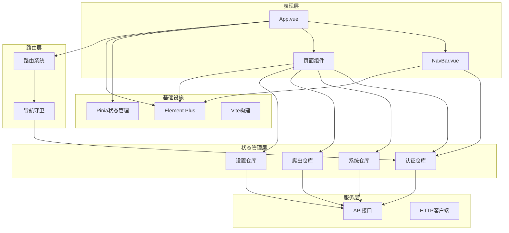
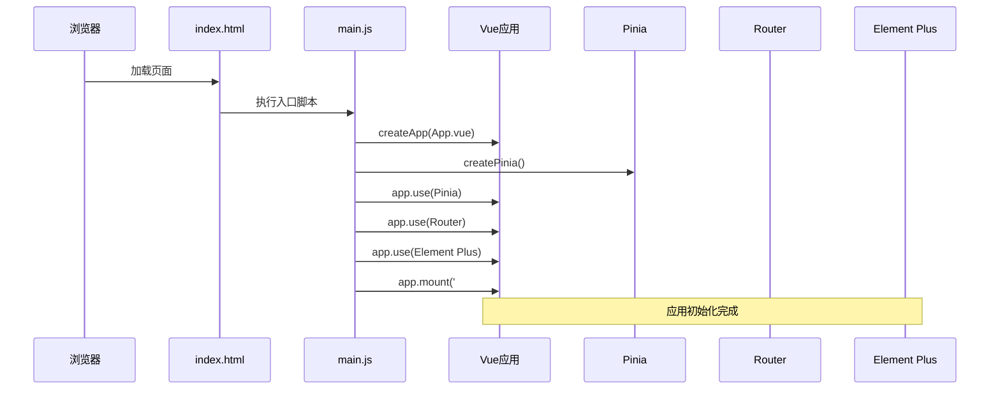
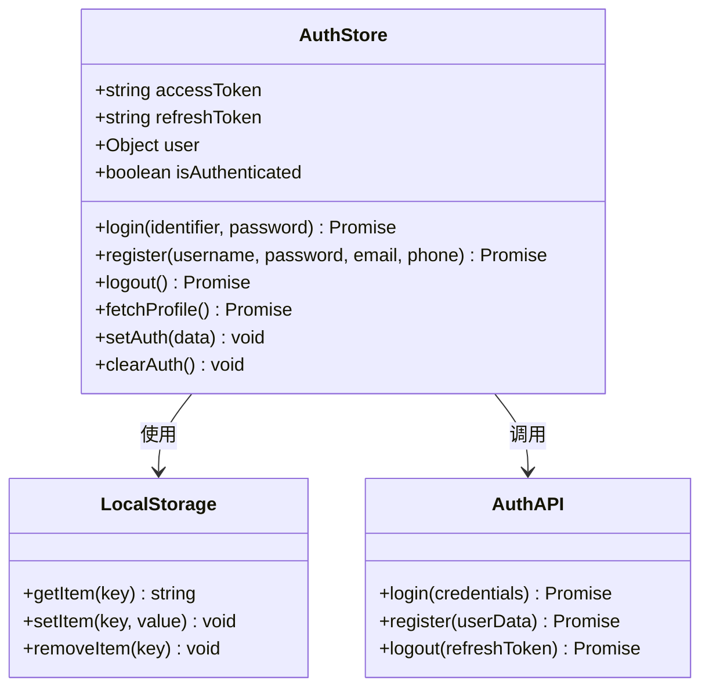
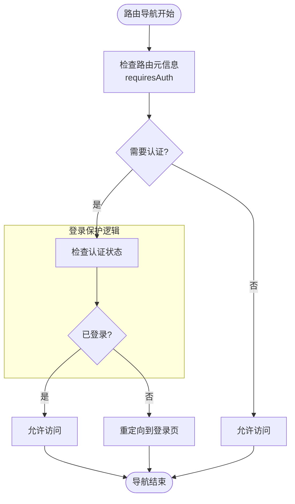
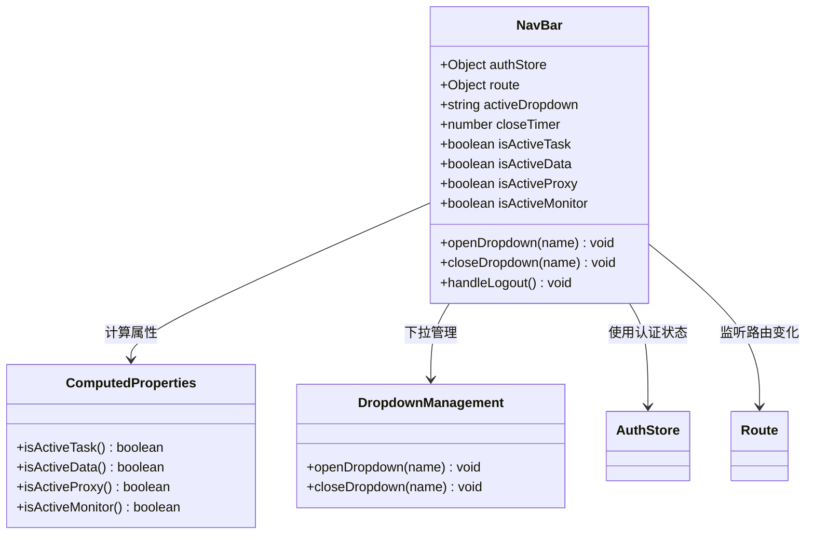
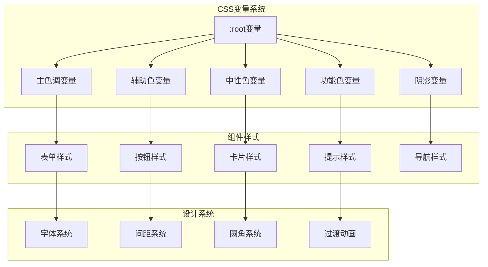
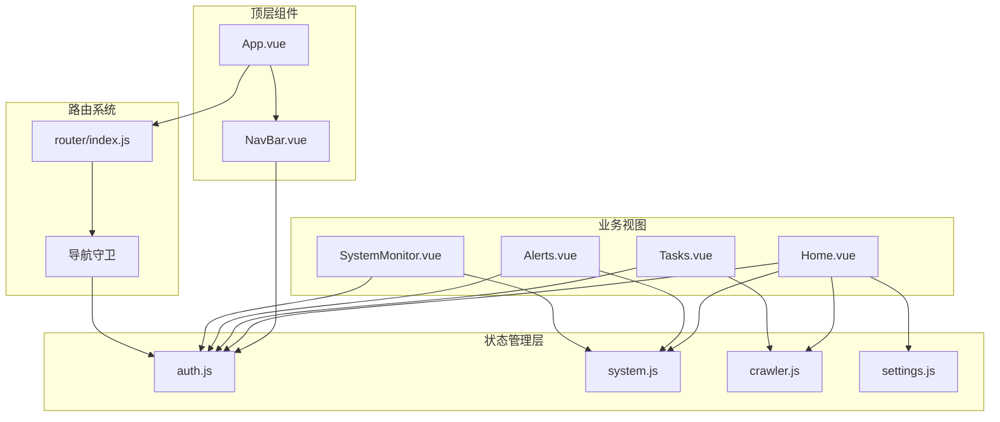

# 应用结构

<cite>
**本文档引用的文件**
- [main.js](file://python-web/src/main.js)
- [vite.config.js](file://python-web/vite.config.js)
- [package.json](file://python-web/package.json)
- [App.vue](file://python-web/src/App.vue)
- [index.html](file://python-web/index.html)
- [router/index.js](file://python-web/src/router/index.js)
- [style.css](file://python-web/src/style.css)
- [stores/auth.js](file://python-web/src/stores/auth.js)
- [stores/system.js](file://python-web/src/stores/system.js)
- [stores/crawler.js](file://python-web/src/stores/crawler.js)
- [stores/settings.js](file://python-web/src/stores/settings.js)
- [components/NavBar.vue](file://python-web/src/components/NavBar.vue)
</cite>

## 目录
1. [简介](#简介)
2. [项目结构](#项目结构)
3. [核心组件](#核心组件)
4. [架构总览](#架构总览)
5. [详细组件分析](#详细组件分析)
6. [依赖关系分析](#依赖关系分析)
7. [性能考虑](#性能考虑)
8. [故障排除指南](#故障排除指南)
9. [结论](#结论)

## 简介
本项目是一个基于Vue3的现代化前端应用，采用组合式API与现代工具链构建，提供爬虫任务管理、数据处理、代理池管理、系统监控等核心功能。应用采用模块化设计，通过Pinia实现状态管理，使用Element Plus作为UI基础库，并通过Vue Router实现路由控制。

## 项目结构
应用采用典型的Vue3单页应用结构，主要目录组织如下：
- `src/`：源代码目录，包含所有业务逻辑和组件
- `src/api/`：API接口封装层
- `src/components/`：可复用的UI组件
- `src/router/`：路由配置和导航守卫
- `src/stores/`：Pinia状态管理仓库
- `src/views/`：页面级视图组件
- `public/`：静态资源目录

```mermaid
graph TB
subgraph "应用入口"
HTML[index.html]
MAIN[src/main.js]
end
subgraph "核心框架"
VUE[vue@^3.4.0]
PINIA[pinia@^2.1.0]
ROUTER[vue-router@^4.2.0]
ELEMENT[element-plus@^2.9.0]
end
subgraph "构建工具"
VITE[vite@^4.0.0]
PLUGIN[@vitejs/plugin-vue]
end
subgraph "业务模块"
STORES[src/stores/]
COMPONENTS[src/components/]
VIEWS[src/views/]
ROUTER_CFG[src/router/]
end
HTML --> MAIN
MAIN --> VUE
MAIN --> PINIA
MAIN --> ROUTER
MAIN --> ELEMENT
VITE --> PLUGIN
VITE --> MAIN
MAIN --> STORES
MAIN --> COMPONENTS
MAIN --> VIEWS
MAIN --> ROUTER_CFG
```

**图表来源**
- [main.js:1-16](file://python-web/src/main.js#L1-L16)
- [package.json:11-22](file://python-web/package.json#L11-L22)
- [vite.config.js:1-11](file://python-web/vite.config.js#L1-L11)

**章节来源**
- [main.js:1-16](file://python-web/src/main.js#L1-L16)
- [package.json:1-24](file://python-web/package.json#L1-L24)
- [vite.config.js:1-11](file://python-web/vite.config.js#L1-L11)

## 核心组件
应用的核心由四个关键部分组成：应用入口、状态管理、路由系统和UI库集成。

### 应用入口配置
应用入口通过`main.js`完成初始化，该文件负责：
- 创建Vue应用实例
- 配置Pinia状态管理
- 集成Vue Router路由系统
- 引入Element Plus UI库
- 加载全局样式

### 状态管理架构
应用采用Pinia作为状态管理解决方案，提供四个核心仓库：
- `auth.js`：认证状态管理
- `system.js`：系统监控和代理管理
- `crawler.js`：爬虫任务管理
- `settings.js`：用户偏好和主题设置

### 路由系统设计
路由系统通过`router/index.js`实现，包含完整的认证守卫逻辑，支持：
- 基于元信息的权限控制
- 动态导入页面组件
- 登录状态检测
- 导航拦截和重定向

### UI库集成
Element Plus作为主要UI库，提供丰富的组件生态，配合自定义样式系统实现统一的视觉设计。

**章节来源**
- [main.js:1-16](file://python-web/src/main.js#L1-L16)
- [stores/auth.js:1-74](file://python-web/src/stores/auth.js#L1-L74)
- [stores/system.js:1-168](file://python-web/src/stores/system.js#L1-L168)
- [stores/crawler.js:1-174](file://python-web/src/stores/crawler.js#L1-L174)
- [stores/settings.js:1-59](file://python-web/src/stores/settings.js#L1-L59)
- [router/index.js:1-150](file://python-web/src/router/index.js#L1-L150)

## 架构总览
应用采用分层架构设计，各层职责清晰分离：



**图表来源**
- [App.vue:1-10](file://python-web/src/App.vue#L1-L10)
- [components/NavBar.vue:1-352](file://python-web/src/components/NavBar.vue#L1-L352)
- [stores/auth.js:1-74](file://python-web/src/stores/auth.js#L1-L74)
- [stores/system.js:1-168](file://python-web/src/stores/system.js#L1-L168)
- [stores/crawler.js:1-174](file://python-web/src/stores/crawler.js#L1-L174)
- [stores/settings.js:1-59](file://python-web/src/stores/settings.js#L1-L59)
- [router/index.js:1-150](file://python-web/src/router/index.js#L1-L150)

## 详细组件分析

### 应用入口组件分析
应用入口`main.js`是整个应用的启动器，负责初始化所有核心依赖和服务。



**图表来源**
- [main.js:9-16](file://python-web/src/main.js#L9-L16)
- [index.html:8-12](file://python-web/index.html#L8-L12)

应用入口的关键特性：
- **模块化导入**：按需导入所需依赖，避免不必要的包加载
- **插件注册顺序**：确保依赖注入的正确顺序
- **全局样式引入**：统一的应用样式基线

**章节来源**
- [main.js:1-16](file://python-web/src/main.js#L1-L16)
- [index.html:1-13](file://python-web/index.html#L1-L13)

### 认证状态管理分析
认证仓库实现了完整的用户身份验证流程，包括登录、注册、登出和会话管理。



**图表来源**
- [stores/auth.js:5-74](file://python-web/src/stores/auth.js#L5-L74)

认证流程的关键机制：
- **本地存储集成**：使用localStorage持久化认证状态
- **计算属性优化**：通过computed属性自动追踪认证状态变化
- **API抽象层**：通过独立的API模块实现网络请求逻辑

**章节来源**
- [stores/auth.js:1-74](file://python-web/src/stores/auth.js#L1-L74)

### 路由系统分析
路由系统实现了复杂的导航控制逻辑，支持基于元信息的权限控制和动态路由加载。



**图表来源**
- [router/index.js:134-147](file://python-web/src/router/index.js#L134-L147)

路由系统的特色功能：
- **元信息驱动**：通过routes数组中的meta字段声明权限需求
- **动态导入**：使用懒加载优化首屏加载性能
- **全局守卫**：在router.beforeEach中实现统一的认证控制

**章节来源**
- [router/index.js:1-150](file://python-web/src/router/index.js#L1-L150)

### 导航栏组件分析
导航栏组件实现了复杂的交互逻辑，包括下拉菜单管理和用户状态显示。



**图表来源**
- [components/NavBar.vue:84-121](file://python-web/src/components/NavBar.vue#L84-L121)

导航栏的核心功能：
- **响应式下拉菜单**：通过mouseenter/mouseleave事件管理菜单状态
- **路径匹配逻辑**：使用computed属性精确匹配当前激活的导航项
- **用户状态展示**：实时显示用户名和头像信息
- **主题切换支持**：与设置仓库集成实现主题切换

**章节来源**
- [components/NavBar.vue:1-352](file://python-web/src/components/NavBar.vue#L1-L352)

### 全局样式系统分析
应用采用了完整的CSS变量系统和现代化的样式设计规范。



**图表来源**
- [style.css:1-45](file://python-web/src/style.css#L1-L45)
- [style.css:67-375](file://python-web/src/style.css#L67-L375)

样式系统的设计特点：
- **CSS变量驱动**：使用CSS自定义属性实现主题定制
- **暗色主题优先**：默认采用深色界面设计
- **渐变色彩系统**：通过linear-gradient实现丰富的视觉效果
- **响应式布局**：针对不同屏幕尺寸优化显示效果

**章节来源**
- [style.css:1-375](file://python-web/src/style.css#L1-L375)

## 依赖关系分析

### 技术栈依赖图
应用的技术栈采用现代化的前端技术组合，各依赖之间的关系如下：

```mermaid
graph TB
subgraph "运行时依赖"
VUE[Vue 3.4.0]
PINIA[Pinia 2.1.0]
ROUTER[Vue Router 4.2.0]
ELEMENT[Element Plus 2.9.0]
AXIOS[Axios 1.6.0]
ICONS[Element Plus Icons 2.3.0]
end
subgraph "开发依赖"
VITE[Vite 4.0.0]
VUE_PLUGIN[@vitejs/plugin-vue]
end
subgraph "应用代码"
MAIN[main.js]
STORES[Pinia Stores]
ROUTES[Router Config]
COMPONENTS[Components]
end
MAIN --> VUE
MAIN --> PINIA
MAIN --> ROUTER
MAIN --> ELEMENT
PINIA --> STORES
ROUTER --> ROUTES
ELEMENT --> COMPONENTS
VITE --> VUE_PLUGIN
VITE --> MAIN
VUE --> COMPONENTS
PINIA --> STORES
ROUTER --> COMPONENTS
```

**图表来源**
- [package.json:11-22](file://python-web/package.json#L11-L22)
- [main.js:1-7](file://python-web/src/main.js#L1-L7)

### 组件间依赖关系
应用内部组件间的依赖关系体现了清晰的分层架构：



**图表来源**
- [App.vue:1-10](file://python-web/src/App.vue#L1-L10)
- [components/NavBar.vue:84-91](file://python-web/src/components/NavBar.vue#L84-L91)
- [router/index.js:1-150](file://python-web/src/router/index.js#L1-L150)

**章节来源**
- [package.json:1-24](file://python-web/package.json#L1-L24)
- [main.js:1-16](file://python-web/src/main.js#L1-L16)

## 性能考虑
应用在多个层面考虑了性能优化：

### 构建优化
- **Tree Shaking**：通过ES模块导入实现按需打包
- **代码分割**：路由级别的懒加载减少初始包体积
- **开发服务器**：内置热更新和快速编译

### 运行时优化
- **计算属性缓存**：使用computed属性避免重复计算
- **响应式数据**：细粒度的状态更新减少不必要的渲染
- **组件懒加载**：大型组件按需加载

### 样式优化
- **CSS变量**：减少重复样式定义
- **原子化设计**：复用基础样式类减少CSS体积
- **媒体查询**：移动端优先的响应式设计

## 故障排除指南

### 常见启动问题
1. **依赖安装失败**
   - 检查网络连接和npm/yarn配置
   - 清理node_modules和package-lock.json重新安装

2. **开发服务器无法启动**
   - 确认端口3000未被占用
   - 检查防火墙设置

3. **路由跳转异常**
   - 验证路由配置的路径和组件映射
   - 检查导航守卫逻辑

### 认证相关问题
1. **登录后无法访问受保护页面**
   - 检查localStorage中token是否正确存储
   - 验证后端API响应格式

2. **会话过期处理**
   - 实现token刷新机制
   - 添加自动登出逻辑

**章节来源**
- [router/index.js:134-147](file://python-web/src/router/index.js#L134-L147)
- [stores/auth.js:12-28](file://python-web/src/stores/auth.js#L12-L28)

## 结论
本Vue3应用展现了现代化前端开发的最佳实践，通过合理的架构设计和工具选择，实现了功能完整、性能优良的单页应用。应用的主要优势包括：

- **清晰的架构分层**：表现层、状态管理层、路由层职责明确
- **现代化技术栈**：Vue3组合式API、Pinia状态管理、Element Plus UI库
- **完善的开发体验**：Vite构建工具提供快速开发和优化能力
- **良好的扩展性**：模块化的组件设计便于功能扩展和维护

应用在认证管理、路由控制、状态管理等方面都体现了专业的开发水准，为后续的功能扩展奠定了坚实的基础。