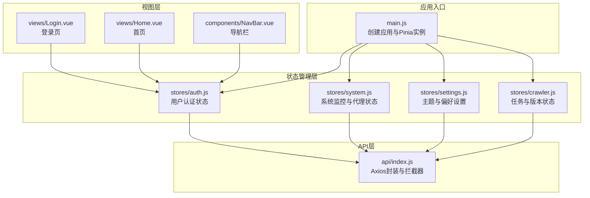
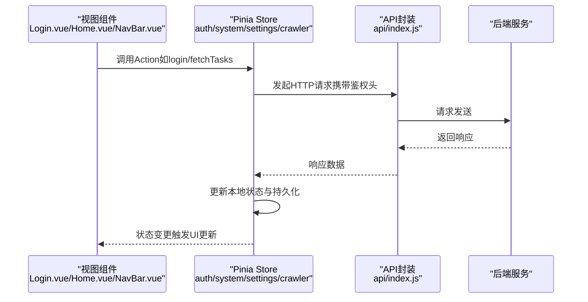
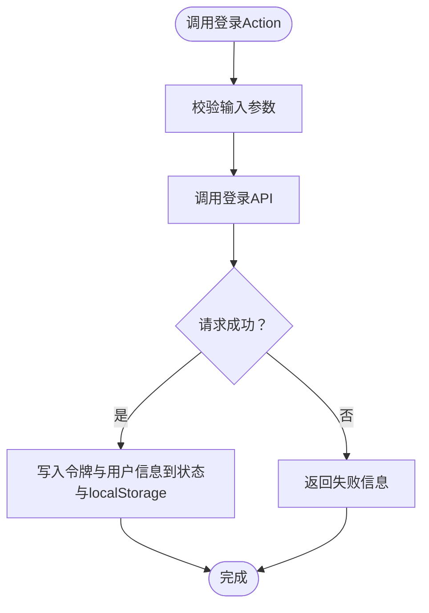
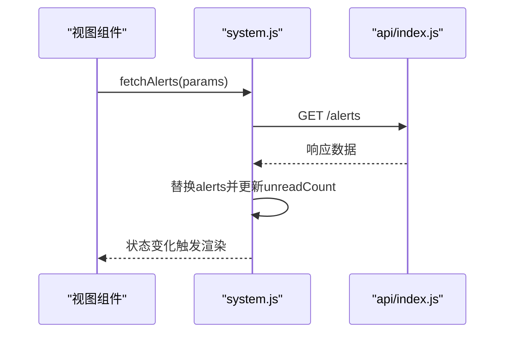
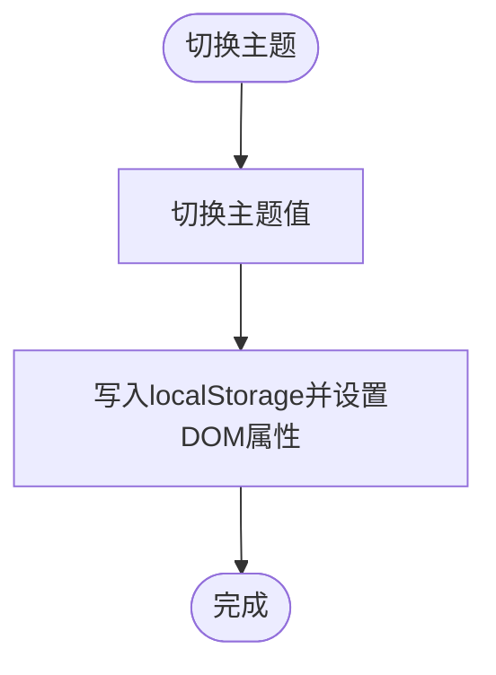
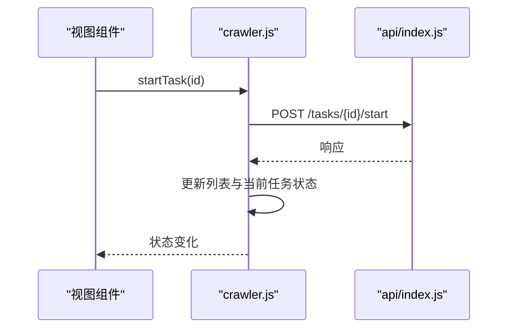
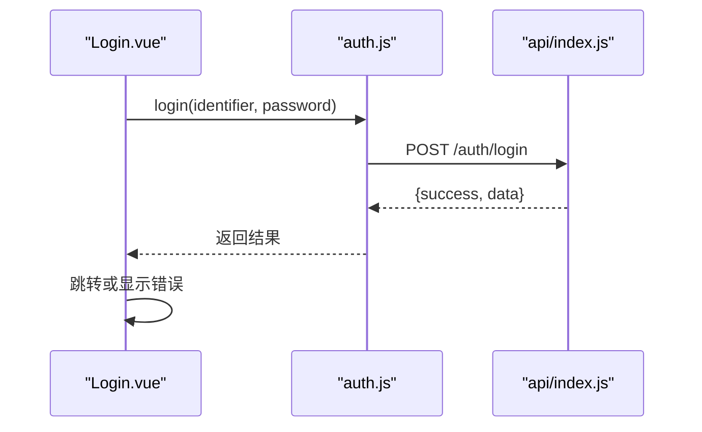
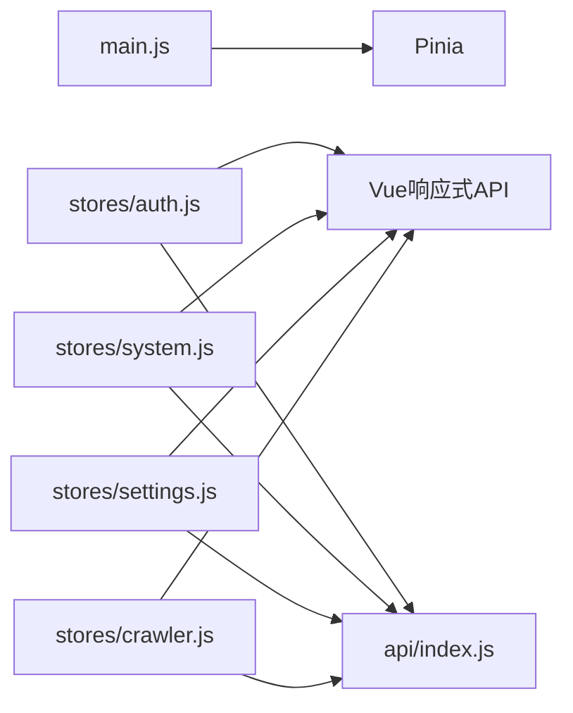

# 状态管理

<cite>
**本文引用的文件**
- [main.js](file://python-web/src/main.js)
- [auth.js](file://python-web/src/stores/auth.js)
- [system.js](file://python-web/src/stores/system.js)
- [settings.js](file://python-web/src/stores/settings.js)
- [crawler.js](file://python-web/src/stores/crawler.js)
- [index.js](file://python-web/src/api/index.js)
- [Login.vue](file://python-web/src/views/Login.vue)
- [Home.vue](file://python-web/src/views/Home.vue)
- [NavBar.vue](file://python-web/src/components/NavBar.vue)
- [package.json](file://python-web/package.json)
</cite>

## 目录
1. [引言](#引言)
2. [项目结构](#项目结构)
3. [核心组件](#核心组件)
4. [架构总览](#架构总览)
5. [详细组件分析](#详细组件分析)
6. [依赖关系分析](#依赖关系分析)
7. [性能考虑](#性能考虑)
8. [故障排查指南](#故障排查指南)
9. [结论](#结论)
10. [附录](#附录)

## 引言
本文件系统性阐述基于 Pinia 的状态管理方案，覆盖 Store 设计模式、状态分层策略（用户状态、业务状态、系统状态）、模块划分与职责边界、状态持久化与同步机制、跨组件共享、Action 设计模式、Getter 计算属性、订阅与调试、以及性能优化与最佳实践。文档以仓库中的实际代码为依据，结合组件使用场景进行深入解析。

## 项目结构
前端采用 Vue 3 + Pinia 架构，状态管理集中于 stores 目录下的多个 Store 模块，通过 main.js 注入全局 Pinia 实例；API 层通过 axios 统一封装请求拦截与响应处理，并在 Store 中调用以实现数据驱动。

图表来源
- [main.js:1-16](file://python-web/src/main.js#L1-L16)
- [auth.js:1-74](file://python-web/src/stores/auth.js#L1-L74)
- [system.js:1-168](file://python-web/src/stores/system.js#L1-L168)
- [settings.js:1-59](file://python-web/src/stores/settings.js#L1-L59)
- [crawler.js:1-174](file://python-web/src/stores/crawler.js#L1-L174)
- [index.js:1-95](file://python-web/src/api/index.js#L1-L95)
- [Login.vue:1-121](file://python-web/src/views/Login.vue#L1-L121)
- [Home.vue:1-1055](file://python-web/src/views/Home.vue#L1-L1055)
- [NavBar.vue:1-352](file://python-web/src/components/NavBar.vue#L1-L352)

章节来源
- [main.js:1-16](file://python-web/src/main.js#L1-L16)
- [package.json:1-24](file://python-web/package.json#L1-L24)

## 核心组件
- 应用与状态注入：在应用入口创建 Pinia 实例并挂载到根组件，确保全局可访问 Store。
- Store 模块：按领域拆分，包括认证与用户信息、系统监控与代理、设置与偏好、任务与版本等。
- API 封装：统一的 axios 实例与拦截器，负责鉴权头注入、自动刷新与错误处理。
- 视图组件：在页面中直接消费 Store，实现跨组件状态共享与联动。

章节来源
- [main.js:1-16](file://python-web/src/main.js#L1-L16)
- [auth.js:1-74](file://python-web/src/stores/auth.js#L1-L74)
- [system.js:1-168](file://python-web/src/stores/system.js#L1-L168)
- [settings.js:1-59](file://python-web/src/stores/settings.js#L1-L59)
- [crawler.js:1-174](file://python-web/src/stores/crawler.js#L1-L174)
- [index.js:1-95](file://python-web/src/api/index.js#L1-L95)

## 架构总览
下图展示从视图到 Store 再到 API 的完整调用链路，体现 Action 驱动、异步数据更新与持久化的闭环。

图表来源
- [Login.vue:100-119](file://python-web/src/views/Login.vue#L100-L119)
- [auth.js:30-51](file://python-web/src/stores/auth.js#L30-L51)
- [system.js:17-21](file://python-web/src/stores/system.js#L17-L21)
- [crawler.js:13-22](file://python-web/src/stores/crawler.js#L13-L22)
- [index.js:11-59](file://python-web/src/api/index.js#L11-L59)

## 详细组件分析

### 用户状态 Store（认证与用户信息）
- 状态字段：访问令牌、刷新令牌、用户信息、认证态（计算属性）。
- 行为模式：登录、注册、登出、拉取个人资料；均通过 Action 完成异步流程。
- 持久化策略：登录成功后写入 localStorage；登出时清理；读取时优先从 localStorage 初始化。
- 错误处理：登录失败返回后端消息；网络异常捕获并提示。
- 认证态：基于令牌与用户信息的组合计算，用于控制 UI 与路由守卫。

图表来源
- [auth.js:30-51](file://python-web/src/stores/auth.js#L30-L51)
- [Login.vue:100-119](file://python-web/src/views/Login.vue#L100-L119)

章节来源
- [auth.js:1-74](file://python-web/src/stores/auth.js#L1-L74)
- [Login.vue:1-121](file://python-web/src/views/Login.vue#L1-L121)

### 系统状态 Store（告警、代理、日志、资源）
- 状态字段：告警列表、未读数、代理池、黑白名单、速率限制、系统日志、资源指标。
- 行为模式：批量查询与单项增删改查；部分 Action 成功后主动刷新列表，保证本地状态与服务端一致。
- 同步策略：列表类数据在每次查询后整体替换；单条记录更新采用局部合并；未读数在标记已读后递减。
- 资源与日志：提供资源监控与日志清理能力，支持按时间窗口清理。

图表来源
- [system.js:17-33](file://python-web/src/stores/system.js#L17-L33)
- [system.js:63-83](file://python-web/src/stores/system.js#L63-L83)
- [index.js:11-59](file://python-web/src/api/index.js#L11-L59)

章节来源
- [system.js:1-168](file://python-web/src/stores/system.js#L1-L168)

### 设置与偏好 Store（主题与全局设置）
- 状态字段：当前主题、全局设置、用户偏好。
- 行为模式：拉取设置与偏好；更新单个设置项；切换主题并持久化到 localStorage；同时更新 DOM 属性以即时生效。
- 偏好更新：通过键值对更新偏好，避免全量覆盖。

图表来源
- [settings.js:43-47](file://python-web/src/stores/settings.js#L43-L47)

章节来源
- [settings.js:1-59](file://python-web/src/stores/settings.js#L1-L59)

### 业务状态 Store（爬虫任务与版本）
- 状态字段：任务列表、模板、版本、收藏、加载态、当前任务详情。
- 行为模式：任务 CRUD、启动/停止、模板管理、版本回滚、收藏切换；所有操作均通过 Action 异步处理。
- 加载态：在长耗时请求前后设置 loading，提升交互反馈。
- 状态一致性：更新当前任务时同步更新列表中的对应项，保持多处引用的一致性。

图表来源
- [crawler.js:68-94](file://python-web/src/stores/crawler.js#L68-L94)
- [index.js:11-59](file://python-web/src/api/index.js#L11-L59)

章节来源
- [crawler.js:1-174](file://python-web/src/stores/crawler.js#L1-L174)

### 视图组件中的状态使用
- 登录页：在表单提交时调用认证 Store 的登录 Action，并根据返回结果跳转或提示错误。
- 首页与导航栏：直接读取认证 Store 的用户信息与认证态，用于欢迎语、头像与路由控制。

图表来源
- [Login.vue:100-119](file://python-web/src/views/Login.vue#L100-L119)
- [auth.js:30-36](file://python-web/src/stores/auth.js#L30-L36)
- [index.js:61-86](file://python-web/src/api/index.js#L61-L86)

章节来源
- [Login.vue:1-121](file://python-web/src/views/Login.vue#L1-L121)
- [Home.vue:269-357](file://python-web/src/views/Home.vue#L269-L357)
- [NavBar.vue:84-121](file://python-web/src/components/NavBar.vue#L84-L121)

## 依赖关系分析
- 应用层依赖：main.js 依赖 Pinia；各 Store 依赖 Vue 的响应式 API（ref/computed）与 API 封装。
- Store 间关系：无直接耦合，通过各自 Action 与 API 间接协作；跨组件共享通过 Store 实现。
- 外部依赖：axios 提供网络请求能力；Element Plus 提供 UI 组件生态。

图表来源
- [main.js:1-16](file://python-web/src/main.js#L1-L16)
- [auth.js:1-3](file://python-web/src/stores/auth.js#L1-L3)
- [system.js:1-6](file://python-web/src/stores/system.js#L1-L6)
- [settings.js:1-4](file://python-web/src/stores/settings.js#L1-L4)
- [crawler.js:1-4](file://python-web/src/stores/crawler.js#L1-L4)
- [index.js:1-95](file://python-web/src/api/index.js#L1-L95)

章节来源
- [package.json:11-17](file://python-web/package.json#L11-L17)

## 性能考虑
- 响应式粒度：仅对必要字段建立响应式状态，减少不必要的依赖追踪与渲染开销。
- 列表更新策略：批量替换与局部合并相结合，避免深度嵌套导致的昂贵计算。
- 加载态：在长请求期间设置 loading，减少重复请求与无效渲染。
- 缓存与持久化：localStorage 用于快速初始化与跨会话恢复，但需注意与服务端状态的最终一致性。
- 并发控制：在需要时引入防抖/节流或请求去重，避免频繁刷新造成抖动。

## 故障排查指南
- 登录失败：检查后端返回的错误信息与网络状态；确认 Action 是否正确处理了失败分支。
- 401 未授权：确认拦截器是否正确注入 Authorization 头；刷新令牌逻辑是否生效。
- 状态不一致：核对 Action 是否在成功后更新了本地状态；列表刷新是否覆盖了旧数据。
- 主题切换无效：确认 localStorage 写入与 DOM 属性设置是否执行；检查样式作用域。

章节来源
- [index.js:22-59](file://python-web/src/api/index.js#L22-L59)
- [auth.js:30-51](file://python-web/src/stores/auth.js#L30-L51)
- [settings.js:43-47](file://python-web/src/stores/settings.js#L43-L47)

## 结论
该状态管理方案以 Pinia 为核心，围绕“用户状态、业务状态、系统状态”进行模块化拆分，配合统一的 API 封装与持久化策略，实现了清晰的职责边界与良好的跨组件共享能力。通过 Action 驱动与计算属性，兼顾了易用性与性能。建议在后续迭代中进一步完善调试工具集成与状态快照能力，持续优化列表更新与缓存策略。

## 附录

### 状态分层策略与模块划分
- 用户状态：认证令牌、用户信息、认证态；由认证 Store 统一管理。
- 业务状态：任务、模板、版本、收藏等业务数据；由业务 Store 管理。
- 系统状态：告警、代理、日志、资源等系统级数据；由系统 Store 管理。
- 设置状态：主题、偏好、全局设置；由设置 Store 管理。

### 状态持久化与同步机制
- 持久化：登录与主题切换等关键状态写入 localStorage，实现跨会话恢复。
- 同步：列表类数据在查询后整体替换；单条记录更新采用局部合并；未读数在标记后递减。
- 一致性：通过 Action 的成功回调刷新本地状态，避免与服务端状态脱节。

### Action 设计模式与 Getter 计算属性
- Action：封装异步流程，集中处理请求、成功与失败分支，统一更新状态与持久化。
- Getter：基于响应式状态派生计算属性，如认证态、日期格式化、问候语等，减少模板复杂度。

### 调试工具与性能优化
- 调试：利用浏览器开发工具观察 Store 状态变化；在关键 Action 中添加日志输出。
- 性能：合理拆分状态、避免深层嵌套、使用加载态与节流、关注渲染次数与依赖追踪。