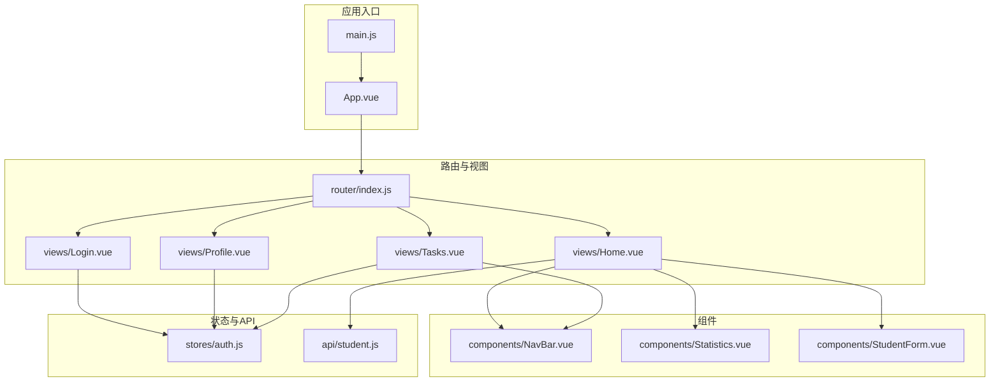
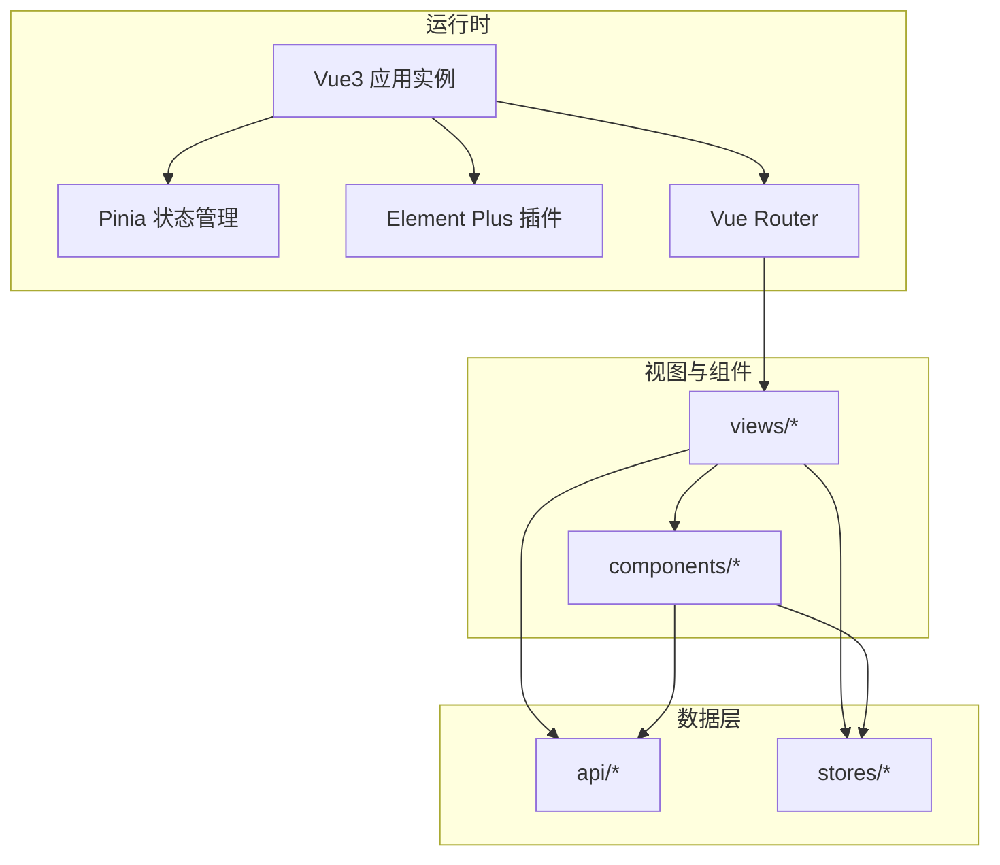
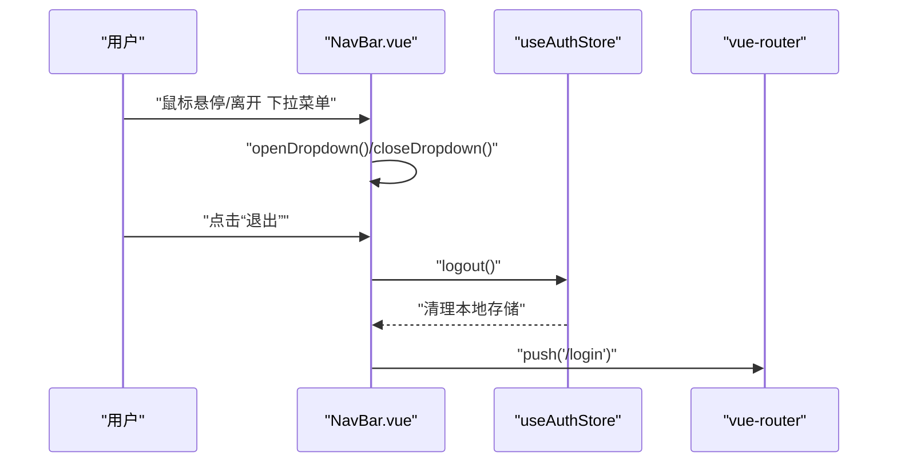
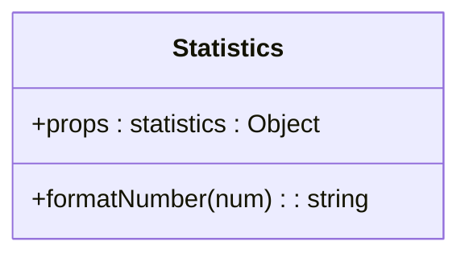
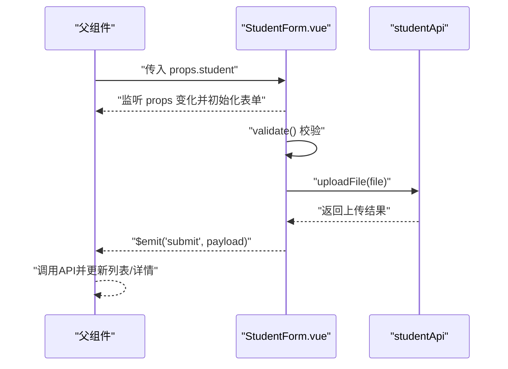
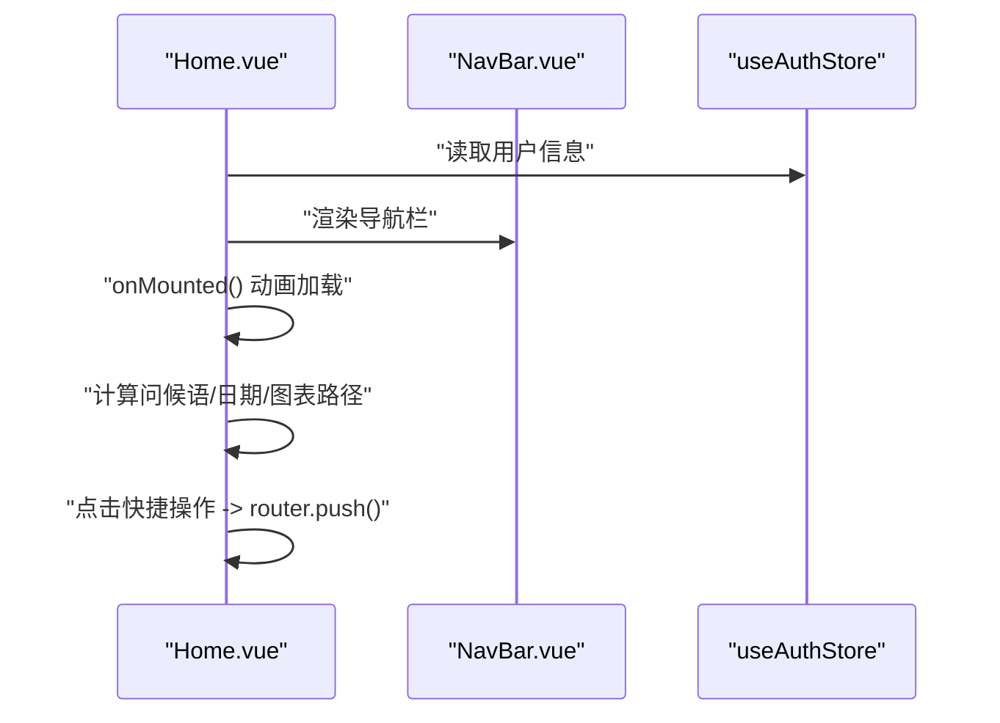
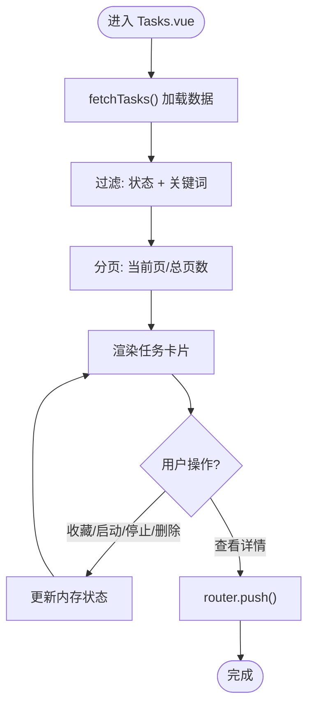
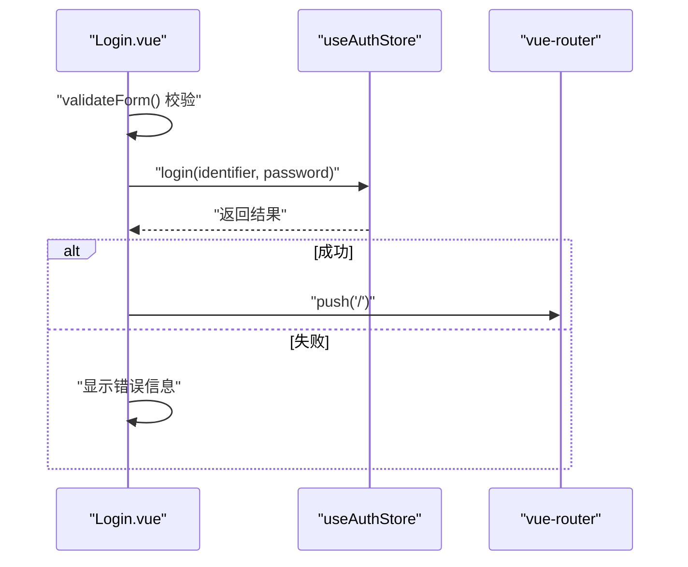
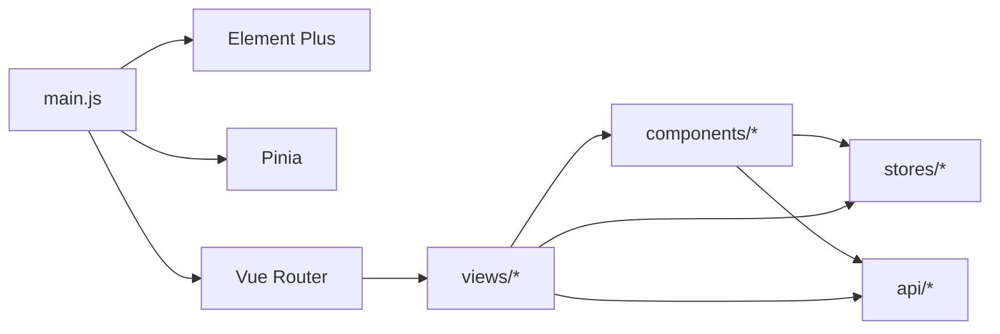

# 组件系统

<cite>
**本文引用的文件**
- [App.vue](file://python-web/src/App.vue)
- [main.js](file://python-web/src/main.js)
- [NavBar.vue](file://python-web/src/components/NavBar.vue)
- [Statistics.vue](file://python-web/src/components/Statistics.vue)
- [StudentForm.vue](file://python-web/src/components/StudentForm.vue)
- [Home.vue](file://python-web/src/views/Home.vue)
- [Tasks.vue](file://python-web/src/views/Tasks.vue)
- [Login.vue](file://python-web/src/views/Login.vue)
- [Profile.vue](file://python-web/src/views/Profile.vue)
- [auth.js](file://python-web/src/stores/auth.js)
- [router/index.js](file://python-web/src/router/index.js)
- [student.js](file://python-web/src/api/student.js)
- [package.json](file://python-web/package.json)
- [vite.config.js](file://python-web/vite.config.js)
</cite>

## 目录
1. [引言](#引言)
2. [项目结构](#项目结构)
3. [核心组件](#核心组件)
4. [架构总览](#架构总览)
5. [详细组件分析](#详细组件分析)
6. [依赖关系分析](#依赖关系分析)
7. [性能考量](#性能考量)
8. [故障排查指南](#故障排查指南)
9. [结论](#结论)
10. [附录](#附录)

## 引言
本文件系统性梳理该Vue3前端项目的组件体系，覆盖组件分类与命名规范、组件通信机制（props、events、provide/inject）、生命周期与状态管理、Element Plus组件库使用规范以及自定义组件开发流程。文档同时总结设计原则、复用策略与性能优化技巧，帮助开发者在现有代码基础上高效扩展与维护。

## 项目结构
项目采用基于功能域的组织方式，主要目录如下：
- src/components：可复用组件（布局组件、通用组件）
- src/views：页面级视图组件
- src/stores：状态管理（Pinia）
- src/router：路由配置与鉴权守卫
- src/api：数据访问层封装
- public：静态资源

图表来源
- [main.js:1-16](file://python-web/src/main.js#L1-L16)
- [App.vue:1-10](file://python-web/src/App.vue#L1-L10)
- [router/index.js:1-150](file://python-web/src/router/index.js#L1-L150)
- [Home.vue:1-1055](file://python-web/src/views/Home.vue#L1-L1055)
- [Tasks.vue:1-852](file://python-web/src/views/Tasks.vue#L1-L852)
- [Login.vue:1-121](file://python-web/src/views/Login.vue#L1-L121)
- [Profile.vue:1-280](file://python-web/src/views/Profile.vue#L1-L280)
- [NavBar.vue:1-352](file://python-web/src/components/NavBar.vue#L1-L352)
- [Statistics.vue:1-38](file://python-web/src/components/Statistics.vue#L1-L38)
- [StudentForm.vue:1-201](file://python-web/src/components/StudentForm.vue#L1-L201)
- [auth.js:1-74](file://python-web/src/stores/auth.js#L1-L74)
- [student.js:1-102](file://python-web/src/api/student.js#L1-L102)

章节来源
- [main.js:1-16](file://python-web/src/main.js#L1-L16)
- [router/index.js:1-150](file://python-web/src/router/index.js#L1-L150)

## 核心组件
- 布局组件
  - 导航栏组件：提供全局导航、下拉菜单、用户信息与登出能力，贯穿多个视图。
  - 视图容器：各页面视图作为布局容器承载业务内容。
- 通用组件
  - 统计卡片：接收统计数据对象，格式化数值并渲染。
  - 学生表单弹窗：负责表单校验、头像上传、事件发射等。
- 页面组件
  - 首页：欢迎信息、快捷操作、数据概览与图表。
  - 任务列表：筛选、分页、状态标签与操作按钮。
  - 登录/注册/重置密码：认证相关页面。
  - 个人资料：展示与修改密码。

章节来源
- [NavBar.vue:1-352](file://python-web/src/components/NavBar.vue#L1-L352)
- [Statistics.vue:1-38](file://python-web/src/components/Statistics.vue#L1-L38)
- [StudentForm.vue:1-201](file://python-web/src/components/StudentForm.vue#L1-L201)
- [Home.vue:1-1055](file://python-web/src/views/Home.vue#L1-L1055)
- [Tasks.vue:1-852](file://python-web/src/views/Tasks.vue#L1-L852)
- [Login.vue:1-121](file://python-web/src/views/Login.vue#L1-L121)
- [Profile.vue:1-280](file://python-web/src/views/Profile.vue#L1-L280)

## 架构总览
应用通过路由驱动视图切换，视图内组合布局与通用组件；状态通过Pinia集中管理，API层统一处理HTTP请求；Element Plus按需引入并全局挂载。

图表来源
- [main.js:1-16](file://python-web/src/main.js#L1-L16)
- [router/index.js:1-150](file://python-web/src/router/index.js#L1-L150)
- [auth.js:1-74](file://python-web/src/stores/auth.js#L1-L74)
- [student.js:1-102](file://python-web/src/api/student.js#L1-L102)

## 详细组件分析

### 导航栏组件（布局组件）
职责与特性
- 提供顶部导航、下拉菜单、用户信息与登出。
- 使用计算属性根据当前路由高亮激活项。
- 使用定时器控制下拉菜单开合，避免鼠标移出时闪烁。
- 与认证状态联动，调用store进行登出并跳转登录页。

组件交互序列

图表来源
- [NavBar.vue:84-121](file://python-web/src/components/NavBar.vue#L84-L121)
- [auth.js:43-51](file://python-web/src/stores/auth.js#L43-L51)
- [router/index.js:134-147](file://python-web/src/router/index.js#L134-L147)

章节来源
- [NavBar.vue:1-352](file://python-web/src/components/NavBar.vue#L1-L352)
- [auth.js:1-74](file://python-web/src/stores/auth.js#L1-L74)
- [router/index.js:1-150](file://python-web/src/router/index.js#L1-L150)

### 统计卡片组件（通用组件）
职责与特性
- 接收统计对象props，渲染数值与标签。
- 内部格式化函数处理空值与小数点显示。
- 适合在多处复用，便于统一样式与逻辑。

组件类图

图表来源
- [Statistics.vue:26-38](file://python-web/src/components/Statistics.vue#L26-L38)

章节来源
- [Statistics.vue:1-38](file://python-web/src/components/Statistics.vue#L1-L38)

### 学生表单组件（通用组件）
职责与特性
- 支持新增/编辑两种模式，通过props传入初始数据。
- 表单双向绑定与校验，错误提示与样式反馈。
- 头像上传：文件类型与大小限制、预览、上传与回滚。
- 通过事件发射提交数据，父组件负责持久化。

组件交互序列

图表来源
- [StudentForm.vue:74-81](file://python-web/src/components/StudentForm.vue#L74-L81)
- [StudentForm.vue:163-185](file://python-web/src/components/StudentForm.vue#L163-L185)
- [StudentForm.vue:128-161](file://python-web/src/components/StudentForm.vue#L128-L161)
- [StudentForm.vue:187-200](file://python-web/src/components/StudentForm.vue#L187-L200)
- [student.js:59-66](file://python-web/src/api/student.js#L59-L66)

章节来源
- [StudentForm.vue:1-201](file://python-web/src/components/StudentForm.vue#L1-L201)
- [student.js:1-102](file://python-web/src/api/student.js#L1-L102)

### 首页视图（页面组件）
职责与特性
- 展示欢迎语、快捷操作、数据概览与趋势图。
- 使用Element Plus的消息提示（如成功提示）。
- 通过路由跳转到不同功能模块。

组件交互序列

图表来源
- [Home.vue:269-357](file://python-web/src/views/Home.vue#L269-L357)
- [NavBar.vue:1-352](file://python-web/src/components/NavBar.vue#L1-L352)
- [auth.js:1-74](file://python-web/src/stores/auth.js#L1-L74)

章节来源
- [Home.vue:1-1055](file://python-web/src/views/Home.vue#L1-L1055)

### 任务列表视图（页面组件）
职责与特性
- 列表筛选（状态/关键词）、分页、状态标签与操作按钮。
- 模拟数据加载与骨架屏，提升感知性能。
- 与路由配合进入详情页。

组件流程图

图表来源
- [Tasks.vue:178-261](file://python-web/src/views/Tasks.vue#L178-L261)
- [Tasks.vue:200-217](file://python-web/src/views/Tasks.vue#L200-L217)

章节来源
- [Tasks.vue:1-852](file://python-web/src/views/Tasks.vue#L1-L852)

### 登录视图（页面组件）
职责与特性
- 表单校验、加载态、错误提示。
- 调用认证store发起登录，成功后跳转首页。

组件交互序列

图表来源
- [Login.vue:66-121](file://python-web/src/views/Login.vue#L66-L121)
- [auth.js:30-36](file://python-web/src/stores/auth.js#L30-L36)
- [router/index.js:134-147](file://python-web/src/router/index.js#L134-L147)

章节来源
- [Login.vue:1-121](file://python-web/src/views/Login.vue#L1-L121)
- [auth.js:1-74](file://python-web/src/stores/auth.js#L1-L74)

### 个人资料视图（页面组件）
职责与特性
- 展示用户信息，密码强度可视化，修改密码流程。
- 调用API与store，处理成功/失败反馈。

章节来源
- [Profile.vue:1-280](file://python-web/src/views/Profile.vue#L1-L280)

## 依赖关系分析
- 组件间依赖
  - 视图组件依赖布局组件（如NavBar）与通用组件（如Statistics/StudentForm）。
  - 通用组件通过props/events与父组件解耦，便于复用。
- 状态与路由
  - 认证store在路由守卫中被读取以决定是否放行。
  - 视图组件通过router实例进行页面跳转。
- 第三方库
  - Element Plus按需引入并在main中全局挂载。
  - Pinia用于状态管理。
  - Vue Router用于路由。

图表来源
- [main.js:1-16](file://python-web/src/main.js#L1-L16)
- [router/index.js:1-150](file://python-web/src/router/index.js#L1-L150)
- [auth.js:1-74](file://python-web/src/stores/auth.js#L1-L74)
- [student.js:1-102](file://python-web/src/api/student.js#L1-L102)

章节来源
- [package.json:11-22](file://python-web/package.json#L11-L22)
- [vite.config.js:1-11](file://python-web/vite.config.js#L1-L11)

## 性能考量
- 渲染优化
  - 使用计算属性缓存派生数据（如图表路径、问候语、统计格式化）。
  - 列表渲染结合分页与骨架屏，降低首屏压力。
- 交互体验
  - 下拉菜单使用定时器避免抖动。
  - 按钮禁用与加载态减少重复提交。
- 网络与资源
  - API封装统一错误处理与超时模拟，避免阻塞UI。
  - 图标与样式按需引入，减少包体。

## 故障排查指南
- 登录失败
  - 检查表单校验与错误提示，确认store返回的成功标志与消息字段。
  - 章节来源
    - [Login.vue:82-98](file://python-web/src/views/Login.vue#L82-L98)
    - [auth.js:30-36](file://python-web/src/stores/auth.js#L30-L36)
- 上传失败
  - 检查文件类型/大小限制、上传接口返回码与错误消息。
  - 章节来源
    - [StudentForm.vue:128-161](file://python-web/src/components/StudentForm.vue#L128-L161)
    - [student.js:59-66](file://python-web/src/api/student.js#L59-L66)
- 路由拦截
  - 确认路由守卫中的鉴权逻辑与本地存储状态。
  - 章节来源
    - [router/index.js:134-147](file://python-web/src/router/index.js#L134-L147)
- Element Plus使用
  - 确认插件已安装并在main中use，组件按需导入。
  - 章节来源
    - [main.js:3-14](file://python-web/src/main.js#L3-L14)
    - [package.json:11-22](file://python-web/package.json#L11-L22)

## 结论
该组件系统遵循“布局组件 + 通用组件 + 页面组件”的分层设计，配合Pinia与Vue Router形成清晰的状态与导航流。通过props/events与store/API解耦，组件具备良好复用性与可维护性。建议在后续迭代中进一步完善组件文档、测试用例与性能监控，持续优化用户体验。

## 附录

### 组件分类与命名规范
- 分类
  - 布局组件：如NavBar，提供全局导航与用户信息。
  - 通用组件：如Statistics、StudentForm，跨页面复用。
  - 页面组件：如Home、Tasks、Login、Profile，承载具体业务。
- 命名
  - 文件名采用帕斯卡命名（如NavBar.vue、Statistics.vue、StudentForm.vue）。
  - 组件内部导出名称与文件名保持一致，便于调试与工具链识别。

### 组件通信机制
- Props
  - 通用组件通过props接收外部数据（如Statistics的statistics）。
  - 章节来源
    - [Statistics.vue:27-32](file://python-web/src/components/Statistics.vue#L27-L32)
- Events
  - 子组件通过$emit向上抛出事件（如StudentForm的submit/close）。
  - 章节来源
    - [StudentForm.vue:81](file://python-web/src/components/StudentForm.vue#L81)
- Provide/Inject
  - 项目未使用provide/inject，建议在深层嵌套组件树中按需引入。

### 生命周期与状态管理
- 生命周期
  - 在onMounted中触发异步加载与动画，确保DOM稳定后再执行。
  - 章节来源
    - [Home.vue:352-357](file://python-web/src/views/Home.vue#L352-L357)
- 状态管理
  - 使用Pinia store集中管理认证状态与用户信息。
  - 章节来源
    - [auth.js:5-74](file://python-web/src/stores/auth.js#L5-L74)

### Element Plus使用规范
- 安装与挂载
  - 在main中安装Element Plus并引入样式。
  - 章节来源
    - [main.js:3-14](file://python-web/src/main.js#L3-L14)
- 组件使用
  - 项目中通过ElMessage等API进行消息提示。
  - 章节来源
    - [Home.vue:349](file://python-web/src/views/Home.vue#L349)

### 自定义组件开发流程
- 设计
  - 明确职责边界，优先考虑复用性与可测试性。
- 实现
  - 使用<script setup>与Composition API，合理拆分逻辑。
  - 通过props/events实现与父组件通信。
- 测试
  - 为关键逻辑（如校验、格式化）编写单元测试。
- 文档
  - 维护README或组件注释，说明props/events/使用示例。