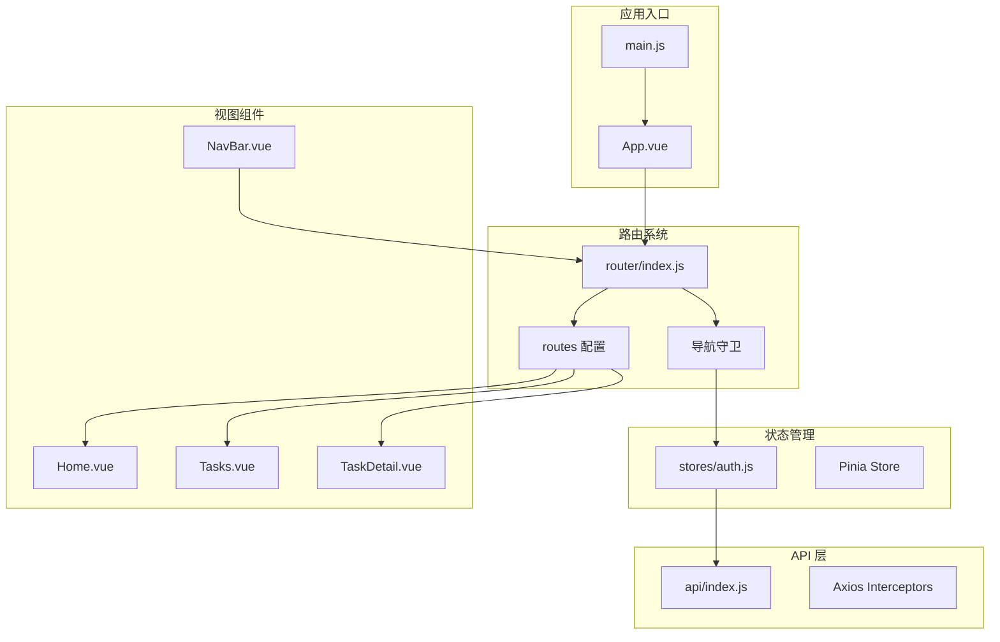
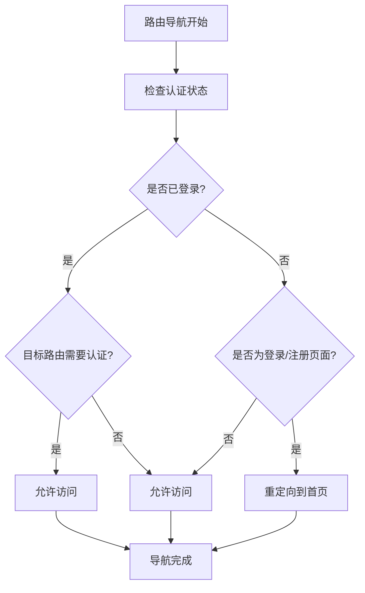
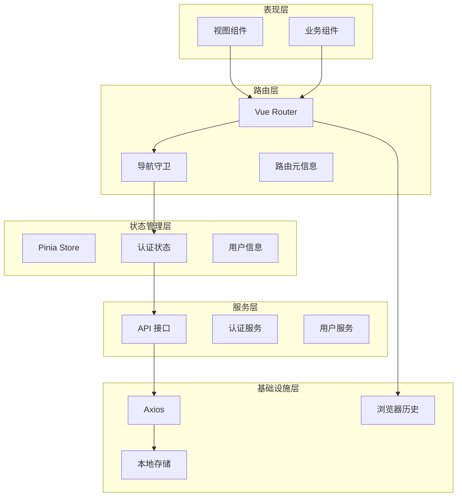
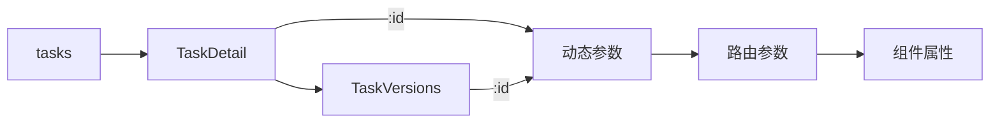
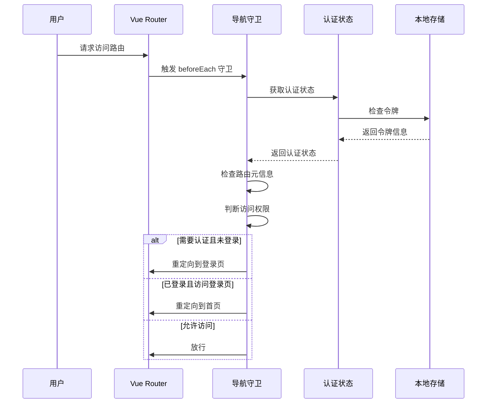
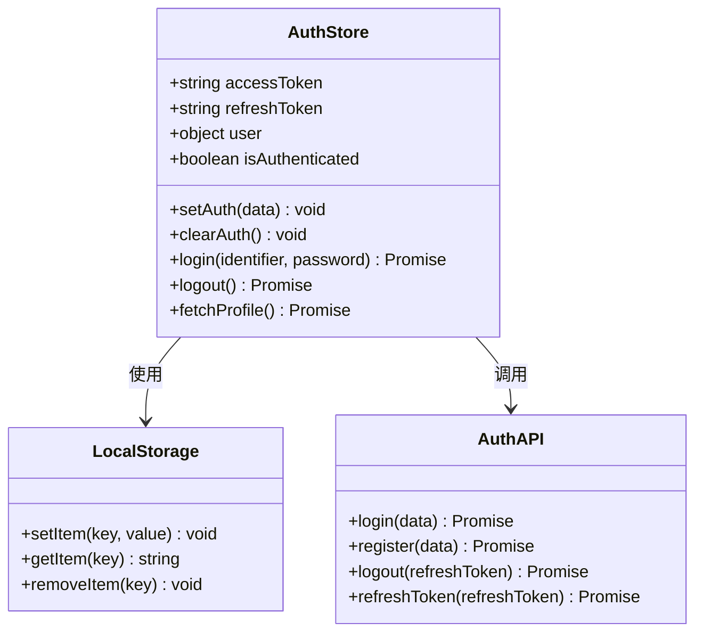
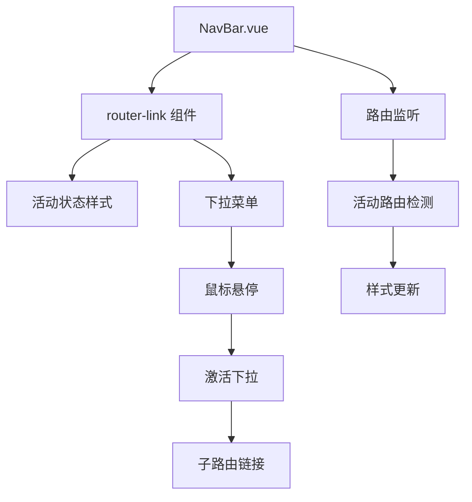
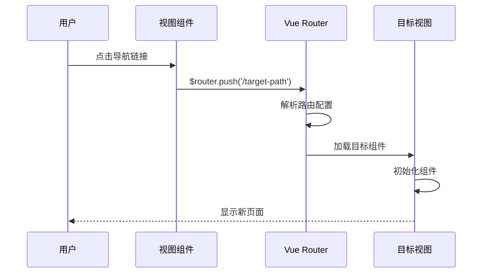
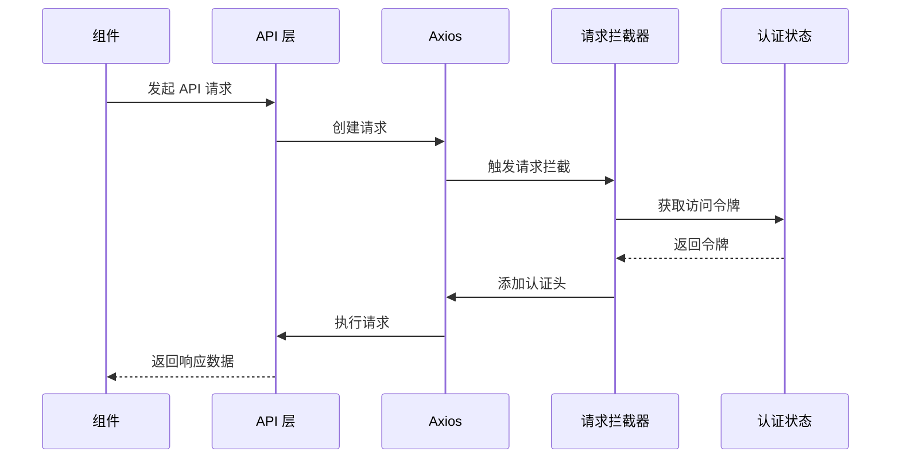
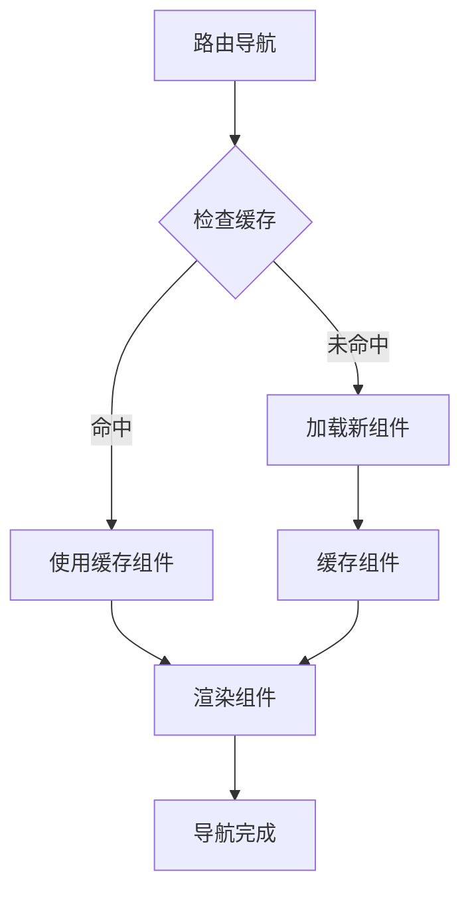

# 路由系统

<cite>
**本文档引用的文件**
- [router/index.js](file://python-web/src/router/index.js)
- [main.js](file://python-web/src/main.js)
- [App.vue](file://python-web/src/App.vue)
- [auth.js](file://python-web/src/stores/auth.js)
- [NavBar.vue](file://python-web/src/components/NavBar.vue)
- [Home.vue](file://python-web/src/views/Home.vue)
- [Tasks.vue](file://python-web/src/views/Tasks.vue)
- [TaskDetail.vue](file://python-web/src/views/TaskDetail.vue)
- [TaskVersions.vue](file://python-web/src/views/TaskVersions.vue)
- [Workspace.vue](file://python-web/src/views/Workspace.vue)
- [index.js](file://python-web/src/api/index.js)
- [package.json](file://python-web/package.json)
- [vite.config.js](file://python-web/vite.config.js)
</cite>

## 目录
1. [简介](#简介)
2. [项目结构](#项目结构)
3. [核心组件](#核心组件)
4. [架构概览](#架构概览)
5. [详细组件分析](#详细组件分析)
6. [依赖关系分析](#依赖关系分析)
7. [性能考虑](#性能考虑)
8. [故障排除指南](#故障排除指南)
9. [结论](#结论)

## 简介

这是一个基于 Vue 3 和 Vue Router 4 的现代化前端路由系统。该系统实现了完整的单页应用路由管理，包括动态路由匹配、嵌套路由、导航守卫机制、权限控制和懒加载策略。系统采用 Pinia 状态管理，结合 Element Plus 组件库，提供丰富的用户界面交互体验。

## 项目结构

该项目采用典型的 Vue 3 单页应用结构，路由系统主要位于 `src/router/` 目录下，配合状态管理和视图组件共同构成完整的路由体系。



**图表来源**
- [main.js:1-16](file://python-web/src/main.js#L1-L16)
- [router/index.js:1-150](file://python-web/src/router/index.js#L1-L150)
- [auth.js:1-74](file://python-web/src/stores/auth.js#L1-L74)

**章节来源**
- [main.js:1-16](file://python-web/src/main.js#L1-L16)
- [package.json:1-24](file://python-web/package.json#L1-L24)

## 核心组件

### 路由配置系统

路由系统采用 Vue Router 4 的模块化配置方式，所有路由定义集中在 `router/index.js` 文件中。系统支持多种路由类型：

- **静态路由**：登录、注册、密码重置等公共页面
- **动态路由**：任务详情、版本历史等带参数的页面
- **嵌套路由**：通过父子关系组织相关页面

### 导航守卫机制

系统实现了全局前置守卫，统一处理用户认证状态和页面访问权限：



**图表来源**
- [router/index.js:134-147](file://python-web/src/router/index.js#L134-L147)

### 权限控制系统

权限控制通过 `requiresAuth` 元信息和 Pinia 状态管理实现：

- **元信息标记**：在路由配置中使用 `meta: { requiresAuth: true }`
- **状态管理**：使用 Pinia Store 管理认证状态
- **本地存储**：持久化存储访问令牌和用户信息

**章节来源**
- [router/index.js:4-127](file://python-web/src/router/index.js#L4-L127)
- [auth.js:1-74](file://python-web/src/stores/auth.js#L1-L74)

## 架构概览

系统采用分层架构设计，各层职责明确，耦合度低：



**图表来源**
- [router/index.js:129-147](file://python-web/src/router/index.js#L129-L147)
- [auth.js:5-74](file://python-web/src/stores/auth.js#L5-L74)

## 详细组件分析

### 路由配置详解

#### 静态路由配置

系统包含多个静态路由，主要用于用户认证和公共页面：

| 路由路径 | 名称 | 组件 | 功能描述 |
|---------|------|------|----------|
| `/login` | Login | Login.vue | 用户登录页面 |
| `/register` | Register | Register.vue | 用户注册页面 |
| `/forgot-password` | ForgotPassword | ForgotPassword.vue | 忘记密码页面 |
| `/reset-password` | ResetPassword | ResetPassword.vue | 重置密码页面 |

#### 动态路由配置

系统支持动态路由参数，用于处理可变内容：



**图表来源**
- [router/index.js:50-60](file://python-web/src/router/index.js#L50-L60)

#### 嵌套路由设计

系统采用嵌套路由结构，通过父子关系组织相关功能模块：

- **任务管理模块**：`/tasks` 父路由，包含子路由如 `/tasks/:id`、`/tasks/:id/versions`
- **数据管理模块**：`/data-preview`、`/data-clean`、`/data-export`
- **代理管理模块**：`/proxy-pool`、`/anti-crawl`
- **系统监控模块**：`/system-monitor`、`/system-logs`

**章节来源**
- [router/index.js:44-126](file://python-web/src/router/index.js#L44-L126)

### 导航守卫实现

#### 全局前置守卫

系统实现了统一的全局前置守卫，处理所有路由导航：



**图表来源**
- [router/index.js:134-147](file://python-web/src/router/index.js#L134-L147)

#### 守卫执行流程

导航守卫的执行逻辑遵循以下流程：

1. **获取认证状态**：从 Pinia Store 和本地存储中获取用户认证信息
2. **检查路由需求**：读取路由元信息中的 `requiresAuth` 标志
3. **权限验证**：根据认证状态和路由需求决定放行或重定向
4. **特殊处理**：对登录和注册页面进行特殊处理，避免循环重定向

**章节来源**
- [router/index.js:134-147](file://python-web/src/router/index.js#L134-L147)

### 权限控制机制

#### 认证状态管理

系统使用 Pinia Store 管理认证状态，提供响应式的状态更新：



**图表来源**
- [auth.js:5-74](file://python-web/src/stores/auth.js#L5-L74)

#### 元信息驱动的权限控制

路由系统通过元信息实现声明式的权限控制：

- **requiresAuth 标志**：标记需要认证的路由
- **路由分组**：将相关路由按功能模块分组
- **动态权限**：支持基于用户角色的动态权限判断

**章节来源**
- [router/index.js:29-126](file://python-web/src/router/index.js#L29-L126)
- [auth.js:10-19](file://python-web/src/stores/auth.js#L10-L19)

### 路由懒加载策略

#### 动态导入实现

系统采用 Vue Router 4 的动态导入特性实现路由懒加载：

```javascript
// 懒加载示例
{
  path: '/tasks',
  name: 'Tasks',
  component: () => import('../views/Tasks.vue'),
  meta: { requiresAuth: true }
}
```

#### 性能优化效果

懒加载带来的性能优势：

- **首屏加载优化**：减少初始包体积，提升首屏渲染速度
- **按需加载**：只在用户访问时才加载对应组件
- **缓存友好**：浏览器可以更好地缓存已加载的组件

**章节来源**
- [router/index.js:8-149](file://python-web/src/router/index.js#L8-L149)

### 导航栏集成

#### 响应式导航设计

导航栏组件与路由系统深度集成，提供智能的导航体验：



**图表来源**
- [NavBar.vue:1-352](file://python-web/src/components/NavBar.vue#L1-L352)

#### 活动状态检测

导航栏通过计算属性智能检测当前活动路由：

- **路径前缀匹配**：使用 `route.path.startsWith()` 进行多级路由匹配
- **正则表达式支持**：使用 `/^\/tasks\/\d+/` 匹配动态路由参数
- **响应式更新**：当路由变化时自动更新导航状态

**章节来源**
- [NavBar.vue:96-99](file://python-web/src/components/NavBar.vue#L96-L99)

### 视图组件导航

#### 页面间导航模式

系统中的页面导航遵循统一的模式：



**图表来源**
- [Home.vue:28-96](file://python-web/src/views/Home.vue#L28-L96)
- [Tasks.vue:10-176](file://python-web/src/views/Tasks.vue#L10-L176)

#### 动态路由参数传递

在任务详情页面中，系统展示了动态路由参数的使用：

- **参数提取**：通过 `useRoute()` 获取路由参数
- **状态同步**：将参数映射到组件状态
- **导航回退**：使用 `$router.back()` 实现返回功能

**章节来源**
- [TaskDetail.vue:179-196](file://python-web/src/views/TaskDetail.vue#L179-L196)

## 依赖关系分析

### 技术栈依赖

系统采用现代化的前端技术栈，各依赖之间的关系如下：

```mermaid
graph TB
subgraph "核心框架"
Vue[Vue 3.4.0]
VueRouter[Vue Router 4.2.0]
Pinia[Pinia 2.1.0]
end
subgraph "UI 组件库"
ElementPlus[Element Plus 2.9.0]
end
subgraph "HTTP 客户端"
Axios[Axios 1.6.0]
end
subgraph "构建工具"
Vite[Vite 4.0.0]
VuePlugin[@vitejs/plugin-vue]
end
Vue --> VueRouter
Vue --> Pinia
Vue --> ElementPlus
Pinia --> Vue
VueRouter --> Vue
Axios --> Vue
Vite --> VuePlugin
VuePlugin --> Vue
```

**图表来源**
- [package.json:11-22](file://python-web/package.json#L11-L22)

### 外部依赖集成

#### API 层集成

系统通过 Axios 集成 API 层，实现统一的请求拦截和响应处理：



**图表来源**
- [index.js:11-20](file://python-web/src/api/index.js#L11-L20)

**章节来源**
- [index.js:1-95](file://python-web/src/api/index.js#L1-L95)

## 性能考虑

### 路由懒加载优化

系统通过动态导入实现路由级别的代码分割，显著提升应用性能：

- **按需加载**：只有访问特定路由时才加载对应组件
- **并行加载**：支持多个路由同时加载，提升用户体验
- **缓存策略**：浏览器可以缓存已加载的组件文件

### 导航性能优化

#### 路由缓存策略



#### 内存管理

- **组件卸载**：离开路由时自动清理组件实例
- **事件监听**：组件销毁时移除事件监听器
- **定时器清理**：防止内存泄漏

### 构建优化

#### Vite 构建配置

系统使用 Vite 作为构建工具，提供快速的开发体验：

- **热重载**：开发时支持快速热重载
- **Tree Shaking**：自动移除未使用的代码
- **代码分割**：自动进行代码分割优化

**章节来源**
- [vite.config.js:1-11](file://python-web/vite.config.js#L1-L11)

## 故障排除指南

### 常见问题诊断

#### 路由守卫问题

**问题现象**：用户无法正确访问受保护的路由

**诊断步骤**：
1. 检查路由配置中的 `requiresAuth` 标志
2. 验证认证状态是否正确设置
3. 查看本地存储中的令牌是否存在

**解决方案**：
- 确保认证状态在登录后正确设置
- 检查令牌过期时间处理
- 验证路由守卫逻辑

#### 动态路由参数问题

**问题现象**：动态路由参数无法正确传递

**诊断步骤**：
1. 检查路由配置中的参数定义
2. 验证组件中的参数接收逻辑
3. 确认导航时的参数传递

**解决方案**：
- 使用 `useRoute()` 正确获取参数
- 在组件中添加参数验证
- 处理参数缺失的情况

#### 导航栏状态问题

**问题现象**：导航栏的活动状态显示不正确

**诊断步骤**：
1. 检查路由路径匹配逻辑
2. 验证计算属性的更新时机
3. 确认响应式数据绑定

**解决方案**：
- 优化路径前缀匹配算法
- 添加防抖处理
- 确保计算属性的依赖正确

**章节来源**
- [router/index.js:134-147](file://python-web/src/router/index.js#L134-L147)
- [NavBar.vue:96-99](file://python-web/src/components/NavBar.vue#L96-L99)

### 调试技巧

#### 开发工具使用

- **Vue DevTools**：检查组件状态和路由信息
- **浏览器开发者工具**：监控网络请求和路由变化
- **控制台日志**：添加必要的调试信息

#### 性能监控

- **路由切换时间**：测量路由切换的性能
- **组件渲染时间**：监控组件的渲染性能
- **内存使用情况**：定期检查内存泄漏

## 结论

该路由系统展现了现代前端应用的最佳实践，具有以下特点：

### 设计优势

1. **模块化架构**：清晰的分层设计，职责分离明确
2. **响应式设计**：支持动态路由和响应式导航
3. **性能优化**：采用懒加载和缓存策略提升性能
4. **权限安全**：完善的认证授权机制

### 技术亮点

1. **Vue 3 生态**：充分利用 Composition API 的优势
2. **TypeScript 支持**：提供更好的类型安全和开发体验
3. **现代化工具链**：使用 Vite 提供快速开发体验
4. **组件化设计**：高度组件化的视图和业务组件

### 扩展性考虑

系统具备良好的扩展性，可以轻松添加新的路由和功能模块：

- **路由模块化**：支持按功能模块组织路由
- **中间件机制**：可以添加更多类型的导航守卫
- **插件系统**：支持第三方路由插件集成
- **国际化支持**：可以扩展多语言路由支持

该路由系统为构建复杂的单页应用提供了坚实的基础，既满足了当前的功能需求，也为未来的功能扩展预留了充足的空间。