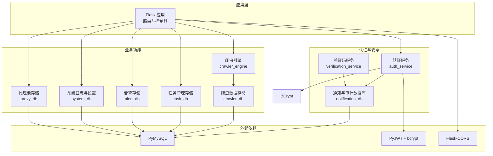
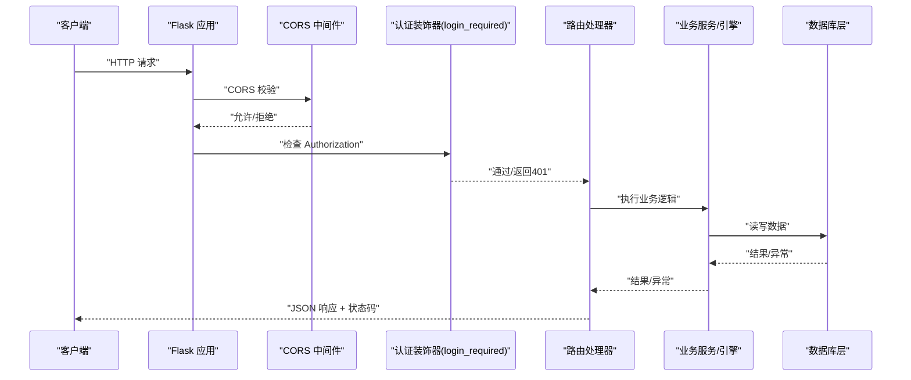
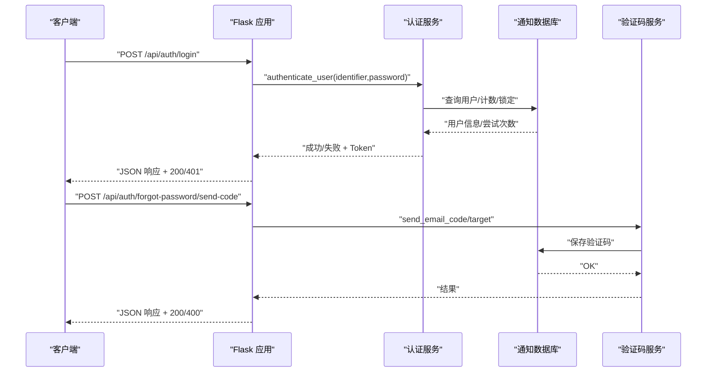
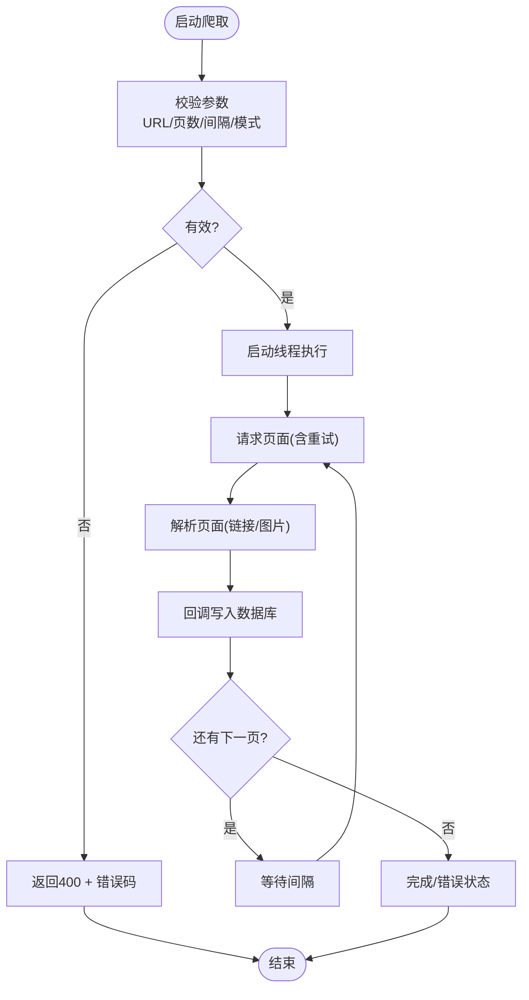
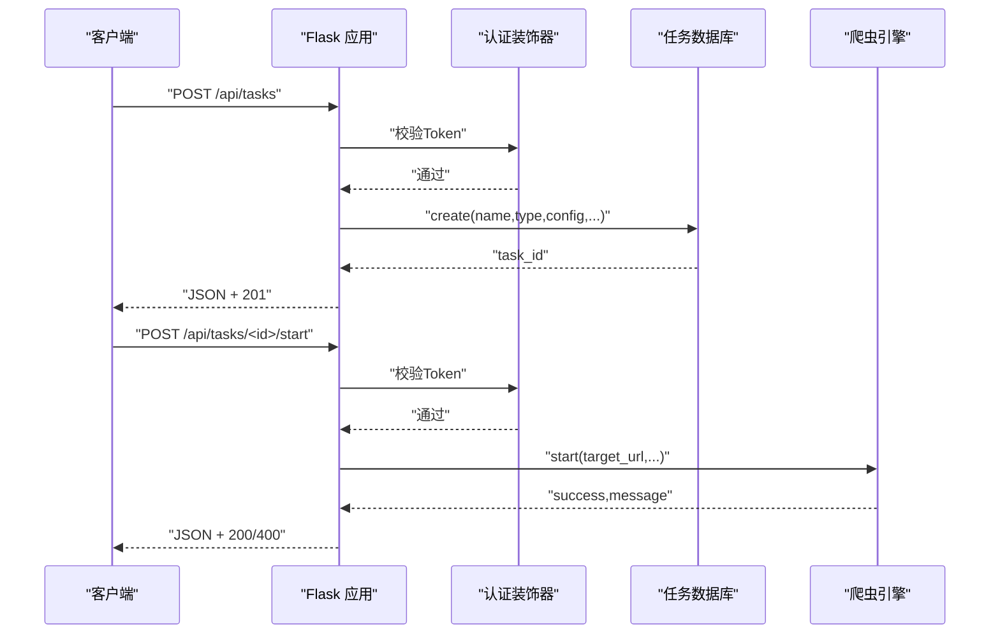
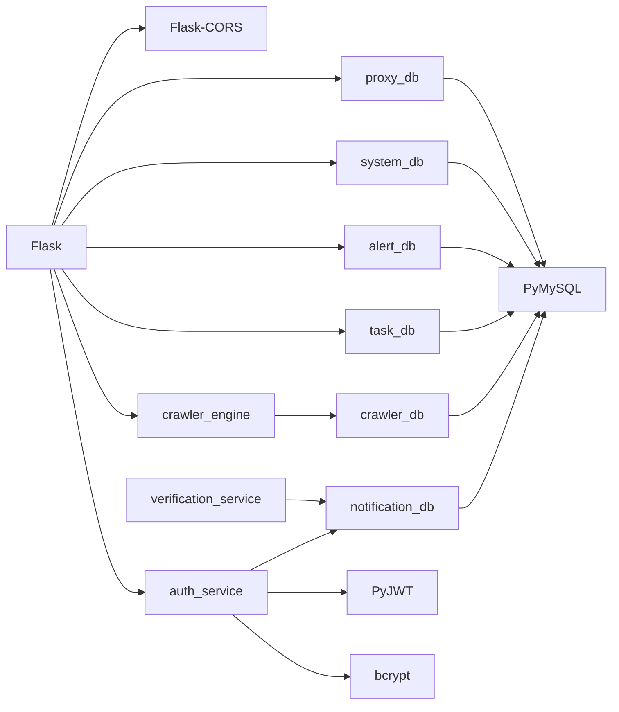

# API设计与路由

<cite>
**本文档引用的文件**
- [app.py](file://python/app.py)
- [auth_server.py](file://python/auth_server.py)
- [src/auth_service.py](file://python/src/auth_service.py)
- [src/notification_db.py](file://python/src/notification_db.py)
- [src/notifications/verification_service.py](file://python/src/notifications/verification_service.py)
- [crawler_engine.py](file://python/crawler_engine.py)
- [crawler_db.py](file://python/crawler_db.py)
- [task_db.py](file://python/task_db.py)
- [alert_db.py](file://python/alert_db.py)
- [system_db.py](file://python/system_db.py)
- [proxy_db.py](file://python/proxy_db.py)
- [requirements.txt](file://python/requirements.txt)
</cite>

## 目录
1. [简介](#简介)
2. [项目结构](#项目结构)
3. [核心组件](#核心组件)
4. [架构总览](#架构总览)
5. [详细组件分析](#详细组件分析)
6. [依赖分析](#依赖分析)
7. [性能考虑](#性能考虑)
8. [故障排查指南](#故障排查指南)
9. [结论](#结论)
10. [附录](#附录)

## 简介
本文件面向Flask应用的RESTful API设计与路由组织，系统性阐述以下主题：
- HTTP方法映射与URL模式设计原则
- 请求/响应格式标准化与错误处理机制
- 认证中间件与CORS跨域配置
- API版本控制策略、参数校验与返回值规范
- 路由装饰器使用、权限控制与异常捕获
- API路由图表与请求流程示意图

目标是帮助开发者快速理解并遵循统一的设计规范，提升接口一致性、安全性与可维护性。

## 项目结构
后端采用单体Flask应用，按功能模块划分蓝图式路由：
- 应用入口与路由定义：app.py
- 用户认证与会话：auth_service、notification_db、verification_service
- 爬虫引擎与数据：crawler_engine、crawler_db
- 任务管理：task_db
- 告警与系统：alert_db、system_db
- 代理池：proxy_db
- 依赖声明：requirements.txt

**图表来源**
- [app.py:1-1719](file://python/app.py#L1-L1719)
- [src/auth_service.py:1-187](file://python/src/auth_service.py#L1-L187)
- [src/notification_db.py:1-357](file://python/src/notification_db.py#L1-L357)
- [src/notifications/verification_service.py:1-108](file://python/src/notifications/verification_service.py#L1-L108)
- [crawler_engine.py:1-533](file://python/crawler_engine.py#L1-L533)
- [crawler_db.py:1-238](file://python/crawler_db.py#L1-L238)
- [task_db.py:1-533](file://python/task_db.py#L1-L533)
- [alert_db.py:1-314](file://python/alert_db.py#L1-L314)
- [system_db.py:1-317](file://python/system_db.py#L1-L317)
- [proxy_db.py:1-528](file://python/proxy_db.py#L1-L528)

**章节来源**
- [app.py:1-1719](file://python/app.py#L1-L1719)
- [requirements.txt:1-14](file://python/requirements.txt#L1-L14)

## 核心组件
- 路由与CORS
  - 全局CORS配置仅开放/api/*路径，允许GET/POST/PUT/DELETE/OPTIONS，并放行Content-Type与Authorization头部，支持凭证。
  - 统一响应结构包含success、message、data或error等字段，配合标准HTTP状态码返回。
- 认证与授权
  - 基于Bearer Token的JWT认证，支持Access/Refresh Token与黑名单机制。
  - login_required装饰器拦截未携带或无效Token的请求，确保受保护路由的安全访问。
- 数据访问层
  - 各业务模块均封装独立DB类，负责表初始化、CRUD与查询，统一返回结构便于上层路由处理。
- 引擎与工具
  - 爬虫引擎支持多模式、多UA轮换、重试与去重，回调写入数据库；任务管理支持模板、版本与收藏。

**章节来源**
- [app.py:18-28](file://python/app.py#L18-L28)
- [src/auth_service.py:158-183](file://python/src/auth_service.py#L158-L183)
- [src/notification_db.py:41-104](file://python/src/notification_db.py#L41-L104)
- [crawler_engine.py:10-533](file://python/crawler_engine.py#L10-L533)
- [task_db.py:7-121](file://python/task_db.py#L7-L121)

## 架构总览
下图展示API请求从客户端到各业务模块的流转路径与关键决策点。

**图表来源**
- [app.py:18-28](file://python/app.py#L18-L28)
- [src/auth_service.py:158-183](file://python/src/auth_service.py#L158-L183)
- [src/notification_db.py:190-226](file://python/src/notification_db.py#L190-L226)
- [crawler_engine.py:400-533](file://python/crawler_engine.py#L400-L533)
- [task_db.py:120-533](file://python/task_db.py#L120-L533)

## 详细组件分析

### 认证与会话（/api/auth/* 与 /api/user/profile）
- 设计要点
  - 注册：校验用户名/密码长度与唯一性，生成密码哈希并落库，记录审计日志。
  - 登录：校验凭据、账户锁定、登录尝试计数与锁定；签发Access/Refresh Token并记录审计。
  - 刷新：校验Refresh Token有效性与黑名单，签发新的Access Token。
  - 登出：将Access/Refresh Token加入黑名单，记录审计。
  - 忘记密码：邮箱/短信验证码发送与校验，重置密码并记录审计。
  - 修改密码：校验旧密码，禁止重复历史密码，记录审计。
  - 个人资料：受保护路由，返回用户基础信息。
- 参数与返回
  - 统一返回结构：success、message、data或error，配合HTTP状态码。
  - 认证头：Authorization: Bearer <access_token>。
- 安全措施
  - bcrypt密码哈希、JWT签名、Token黑名单、登录失败锁定、审计日志。

**图表来源**
- [app.py:99-274](file://python/app.py#L99-L274)
- [src/auth_service.py:76-157](file://python/src/auth_service.py#L76-L157)
- [src/notification_db.py:190-226](file://python/src/notification_db.py#L190-L226)
- [src/notifications/verification_service.py:25-101](file://python/src/notifications/verification_service.py#L25-L101)

**章节来源**
- [app.py:53-274](file://python/app.py#L53-L274)
- [src/auth_service.py:9-187](file://python/src/auth_service.py#L9-L187)
- [src/notification_db.py:6-357](file://python/src/notification_db.py#L6-L357)
- [src/notifications/verification_service.py:7-108](file://python/src/notifications/verification_service.py#L7-L108)

### 爬虫管理（/api/crawler/*）
- 设计要点
  - 启动/停止/状态查询：参数校验（URL、页数、间隔、模式）、线程控制、状态持久化。
  - 数据查询/清空/导出：分页、关键字过滤、CSV导出。
  - 数据解析：链接/图片抽取、去重、规范化、多来源提取。
- 参数与返回
  - GET /api/crawler/data?page&page_size&keyword
  - POST /api/crawler/start(total_pages,interval_seconds,crawl_mode,target_url)
  - DELETE /api/crawler/data 清空
  - GET /api/crawler/export 导出CSV
- 错误处理
  - 输入非法返回400，内部异常返回500，统一JSON结构。

**图表来源**
- [app.py:306-466](file://python/app.py#L306-L466)
- [crawler_engine.py:400-533](file://python/crawler_engine.py#L400-L533)
- [crawler_db.py:96-238](file://python/crawler_db.py#L96-L238)

**章节来源**
- [app.py:306-466](file://python/app.py#L306-L466)
- [crawler_engine.py:10-533](file://python/crawler_engine.py#L10-L533)
- [crawler_db.py:6-238](file://python/crawler_db.py#L6-L238)

### 任务管理（/api/tasks/* 与 /api/tasks/templates/* 与 /api/tasks/<id>/versions/*）
- 设计要点
  - 任务CRUD：名称/类型/配置/描述/模板ID，分页查询与状态管理。
  - 模板CRUD：名称/类型/配置/描述。
  - 版本管理：保存版本、查询版本列表、按版本回滚。
  - 收藏：用户收藏任务。
- 参数与返回
  - GET/POST/PUT/DELETE 对应不同资源与动作，统一返回success/message/data/error。
- 权限控制
  - 所有任务相关路由均使用login_required装饰器，确保仅登录用户可访问。

**图表来源**
- [app.py:475-800](file://python/app.py#L475-L800)
- [src/auth_service.py:158-183](file://python/src/auth_service.py#L158-L183)
- [task_db.py:172-533](file://python/task_db.py#L172-L533)
- [crawler_engine.py:464-497](file://python/crawler_engine.py#L464-L497)

**章节来源**
- [app.py:475-800](file://python/app.py#L475-L800)
- [task_db.py:7-533](file://python/task_db.py#L7-L533)

### 健康检查与通用约定（/api/health）
- 设计要点
  - GET /api/health 返回服务运行状态，便于探活与编排。
- 适用范围
  - 所有服务均提供该端点，保持一致的健康检查体验。

**章节来源**
- [app.py:468-470](file://python/app.py#L468-L470)
- [auth_server.py:36-44](file://python/auth_server.py#L36-L44)

## 依赖分析
- 外部库
  - Flask、Flask-CORS：Web框架与跨域支持
  - PyJWT、bcrypt：Token签发与密码哈希
  - PyMySQL：数据库访问
  - requests/beautifulsoup4/lxml：网络请求与HTML解析
  - psutil：系统监控（在本仓库未直接使用）
- 内部模块耦合
  - 路由层依赖认证服务与各DB层
  - 认证服务依赖通知数据库与验证码服务
  - 爬虫引擎依赖数据库回调与配置

**图表来源**
- [requirements.txt:1-14](file://python/requirements.txt#L1-L14)
- [app.py:1-1719](file://python/app.py#L1-L1719)
- [src/auth_service.py:1-187](file://python/src/auth_service.py#L1-L187)
- [src/notification_db.py:1-357](file://python/src/notification_db.py#L1-L357)
- [src/notifications/verification_service.py:1-108](file://python/src/notifications/verification_service.py#L1-L108)
- [crawler_engine.py:1-533](file://python/crawler_engine.py#L1-L533)
- [crawler_db.py:1-238](file://python/crawler_db.py#L1-L238)
- [task_db.py:1-533](file://python/task_db.py#L1-L533)
- [alert_db.py:1-314](file://python/alert_db.py#L1-L314)
- [system_db.py:1-317](file://python/system_db.py#L1-L317)
- [proxy_db.py:1-528](file://python/proxy_db.py#L1-L528)

**章节来源**
- [requirements.txt:1-14](file://python/requirements.txt#L1-L14)

## 性能考虑
- 爬虫引擎
  - 多UA轮换与随机延时降低被封禁风险；线程内循环与事件标志实现平滑停止。
  - 解析阶段进行去重与规范化，减少冗余入库。
- 数据库
  - 各DB层提供索引与分页查询，避免全表扫描；批量写入提升吞吐。
- 认证
  - Token黑名单查询基于时间窗口，避免频繁全表扫描；登录失败锁定减少暴力尝试。
- 建议
  - 对高频接口增加缓存（如任务模板列表）；
  - 对导出/大数据查询增加异步任务与进度反馈；
  - 对外部请求增加超时与重试上限，避免阻塞。

[本节为通用指导，不直接分析具体文件]

## 故障排查指南
- 常见错误与定位
  - 400参数错误：检查URL参数、JSON字段与范围约束（页码、间隔、模式等）。
  - 401未认证：确认Authorization头格式与Token类型；检查黑名单与过期。
  - 403/404：资源不存在或权限不足；核对用户ID与任务归属。
  - 500内部错误：查看服务端异常栈与数据库连接状态。
- 排查步骤
  - 查看审计日志（登录/登出/改密/重置密码）确认关键操作轨迹。
  - 核对CORS配置与前端Origin是否在允许列表。
  - 检查数据库连接参数与表结构初始化是否完成。
  - 对爬虫问题，查看状态接口与错误信息字段。

**章节来源**
- [app.py:99-274](file://python/app.py#L99-L274)
- [src/notification_db.py:334-342](file://python/src/notification_db.py#L334-L342)
- [auth_server.py:123-223](file://python/auth_server.py#L123-L223)

## 结论
本Flask应用遵循RESTful设计原则，采用统一的请求/响应格式与错误处理机制，结合JWT认证、CORS跨域与审计日志，形成清晰的路由组织与安全边界。通过模块化的DB层与引擎层，实现了可扩展的任务、爬虫与系统管理能力。建议在生产环境中进一步完善版本控制、参数校验与异步任务机制，持续优化性能与可观测性。

[本节为总结，不直接分析具体文件]

## 附录

### API路由与方法映射概览
- 认证与用户
  - POST /api/auth/register
  - POST /api/auth/login
  - POST /api/auth/refresh
  - POST /api/auth/logout
  - POST /api/auth/forgot-password/send-code
  - POST /api/auth/forgot-password/verify-code
  - POST /api/auth/forgot-password/reset
  - POST /api/auth/change-password
  - GET /api/user/profile
- 爬虫
  - POST /api/crawler/start
  - POST /api/crawler/stop
  - GET /api/crawler/status
  - GET /api/crawler/data?page&page_size&keyword
  - DELETE /api/crawler/data
  - GET /api/crawler/export
- 任务
  - GET /api/tasks
  - POST /api/tasks
  - GET /api/tasks/<task_id>
  - PUT /api/tasks/<task_id>
  - DELETE /api/tasks/<task_id>
  - POST /api/tasks/<task_id>/start
  - POST /api/tasks/<task_id>/stop
  - GET /api/tasks/templates
  - POST /api/tasks/templates
  - GET /api/tasks/templates/<template_id>
  - DELETE /api/tasks/templates/<template_id>
  - GET /api/tasks/<task_id>/versions
  - POST /api/tasks/<task_id>/versions/rollback
  - GET /api/tasks/favorites
- 健康检查
  - GET /api/health

**章节来源**
- [app.py:53-800](file://python/app.py#L53-L800)

### 请求/响应格式与状态码约定
- 统一响应结构
  - 成功：success=true，message为提示，data为业务数据
  - 失败：success=false，message为错误提示，code为错误码，必要时附error详情
- 状态码
  - 200：成功
  - 201：创建成功
  - 400：参数错误/业务校验失败
  - 401：未认证/Token无效
  - 404：资源不存在
  - 500：服务器内部错误

**章节来源**
- [app.py:53-274](file://python/app.py#L53-L274)
- [auth_server.py:47-223](file://python/auth_server.py#L47-L223)

### CORS与认证配置要点
- CORS
  - 路径前缀：/api/*
  - 方法：GET/POST/PUT/DELETE/OPTIONS
  - 允许头：Content-Type, Authorization
  - 凭证：支持
- 认证
  - 头部格式：Authorization: Bearer <access_token>
  - 装饰器：login_required
  - Token类型：access/refresh，黑名单与过期校验

**章节来源**
- [app.py:18-28](file://python/app.py#L18-L28)
- [src/auth_service.py:158-183](file://python/src/auth_service.py#L158-L183)