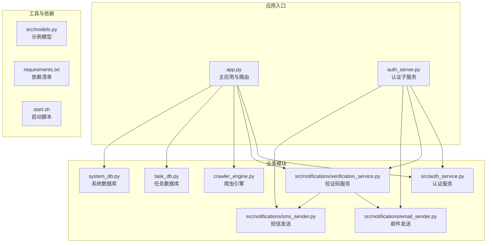
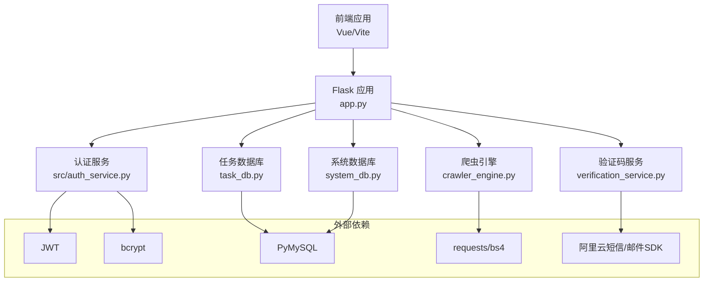
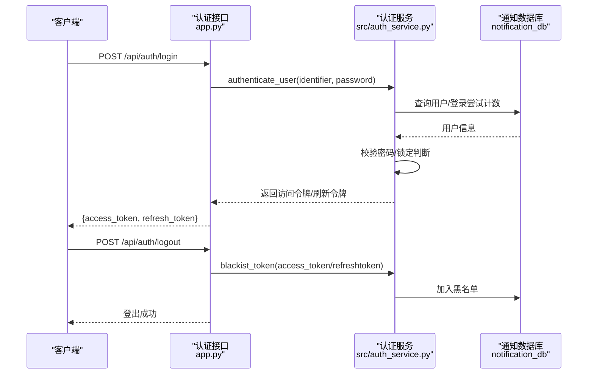
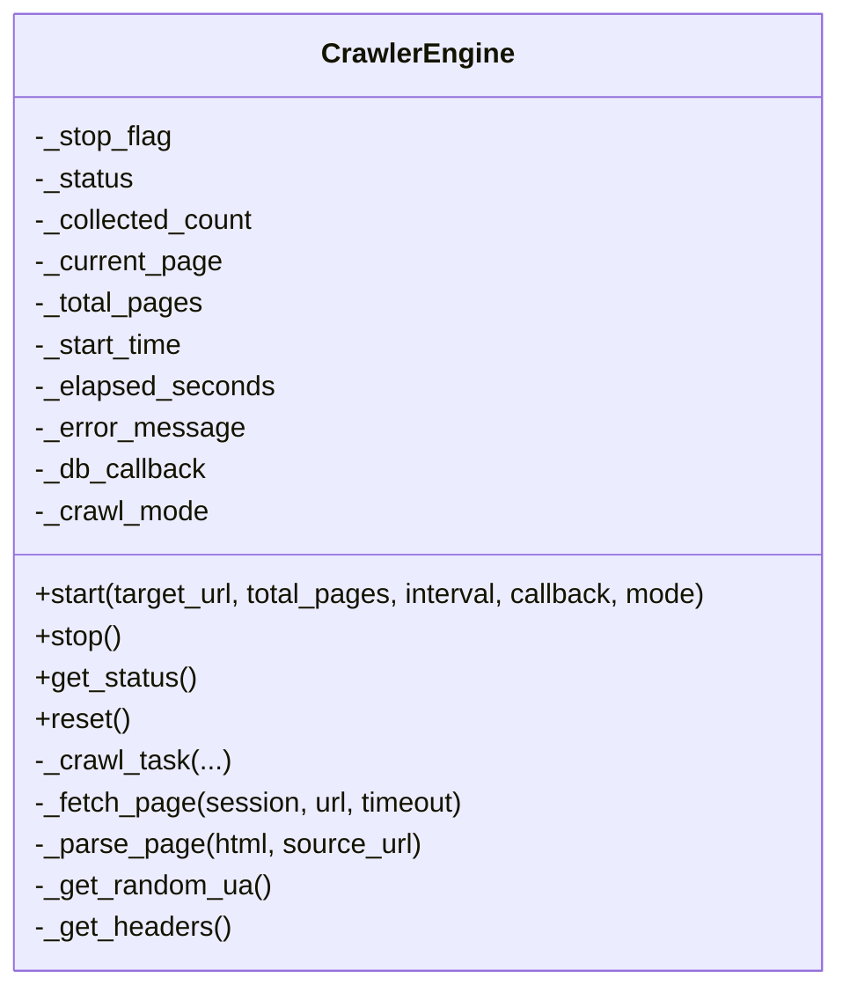
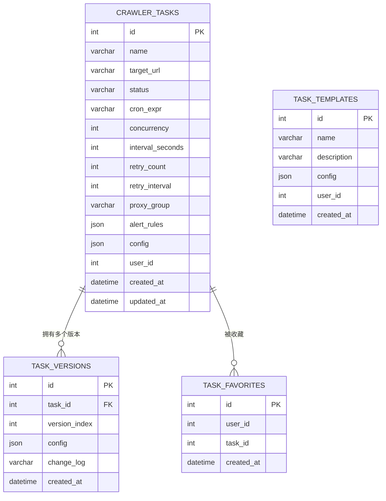
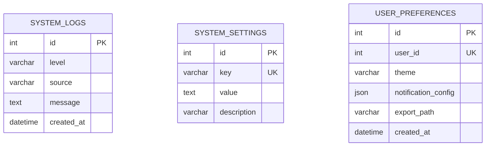
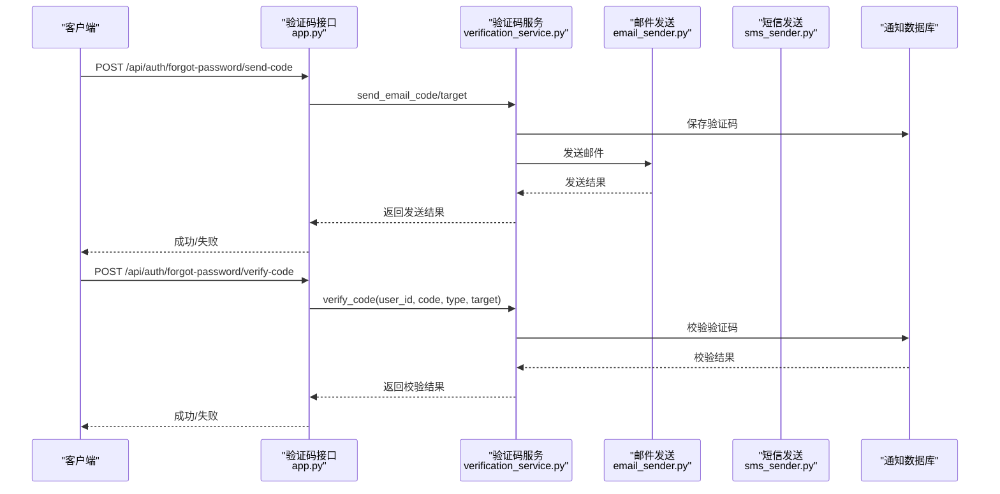
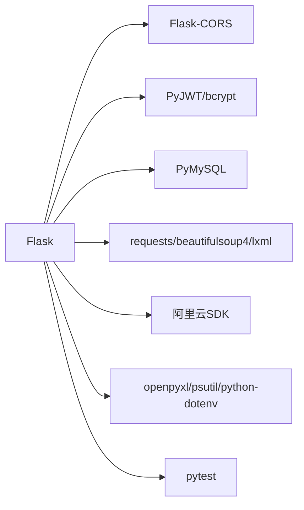

# 后端架构

<cite>
**本文引用的文件**
- [app.py](file://python/app.py)
- [auth_server.py](file://python/auth_server.py)
- [crawler_engine.py](file://python/crawler_engine.py)
- [task_db.py](file://python/task_db.py)
- [system_db.py](file://python/system_db.py)
- [src/auth_service.py](file://python/src/auth_service.py)
- [src/models.py](file://python/src/models.py)
- [src/notifications/email_sender.py](file://python/src/notifications/email_sender.py)
- [src/notifications/sms_sender.py](file://python/src/notifications/sms_sender.py)
- [src/notifications/verification_service.py](file://python/src/notifications/verification_service.py)
- [requirements.txt](file://python/requirements.txt)
- [start.sh](file://python/start.sh)
</cite>

## 目录
1. [简介](#简介)
2. [项目结构](#项目结构)
3. [核心组件](#核心组件)
4. [架构总览](#架构总览)
5. [详细组件分析](#详细组件分析)
6. [依赖分析](#依赖分析)
7. [性能考虑](#性能考虑)
8. [故障排查指南](#故障排查指南)
9. [结论](#结论)
10. [附录](#附录)

## 简介
本项目是一个基于 Flask 的后端服务，提供用户认证、任务管理、爬虫引擎集成、通知服务以及系统监控等能力。后端采用模块化设计，将认证、通知、数据库访问、爬虫引擎等功能拆分为独立模块，便于维护与扩展。系统通过 RESTful API 对外提供统一接口，并使用 CORS 配置支持前端跨域访问。

## 项目结构
后端代码主要位于 python 目录下，采用“功能模块 + 工具模块”的组织方式：
- 应用入口与路由：app.py、auth_server.py
- 爬虫引擎：crawler_engine.py
- 数据库访问层：task_db.py、system_db.py
- 认证与安全：src/auth_service.py
- 通知服务：src/notifications/email_sender.py、src/notifications/sms_sender.py、src/notifications/verification_service.py
- 工具与示例：src/models.py
- 依赖与启动：requirements.txt、start.sh

**图表来源**
- [app.py:1-1719](file://python/app.py#L1-L1719)
- [auth_server.py:1-431](file://python/auth_server.py#L1-L431)
- [crawler_engine.py:1-533](file://python/crawler_engine.py#L1-L533)
- [task_db.py:1-533](file://python/task_db.py#L1-L533)
- [system_db.py:1-317](file://python/system_db.py#L1-L317)
- [src/auth_service.py:1-187](file://python/src/auth_service.py#L1-L187)
- [src/notifications/verification_service.py:1-108](file://python/src/notifications/verification_service.py#L1-L108)
- [src/notifications/email_sender.py:1-67](file://python/src/notifications/email_sender.py#L1-L67)
- [src/notifications/sms_sender.py:1-65](file://python/src/notifications/sms_sender.py#L1-L65)
- [src/models.py:1-59](file://python/src/models.py#L1-L59)
- [requirements.txt:1-14](file://python/requirements.txt#L1-L14)
- [start.sh:1-39](file://python/start.sh#L1-L39)

**章节来源**
- [app.py:1-1719](file://python/app.py#L1-L1719)
- [auth_server.py:1-431](file://python/auth_server.py#L1-L431)
- [requirements.txt:1-14](file://python/requirements.txt#L1-L14)
- [start.sh:1-39](file://python/start.sh#L1-L39)

## 核心组件
- Flask 应用与路由：提供 RESTful API，包括认证、用户资料、爬虫控制、任务管理、系统监控等接口；启用 CORS 支持前端跨域访问。
- 认证与授权：基于 JWT 的访问令牌与刷新令牌，配合黑名单机制实现登出与令牌回收；登录失败锁定与密码历史校验提升安全性。
- 爬虫引擎：多线程爬取，支持链接/图片/混合模式，具备请求头伪装、随机延时、错误重试与状态跟踪。
- 数据库访问层：TaskDB 与 SystemDB 封装 MySQL 连接与表结构，提供任务、模板、版本、收藏、日志、设置等 CRUD 操作。
- 通知服务：验证码发送（邮件/SMS），支持临时用户创建与验证码有效期管理。
- 中间件与异常处理：全局异常捕获与统一响应格式；CORS 配置覆盖 /api/* 路由资源。

**章节来源**
- [app.py:1-1719](file://python/app.py#L1-L1719)
- [src/auth_service.py:1-187](file://python/src/auth_service.py#L1-L187)
- [crawler_engine.py:1-533](file://python/crawler_engine.py#L1-L533)
- [task_db.py:1-533](file://python/task_db.py#L1-L533)
- [system_db.py:1-317](file://python/system_db.py#L1-L317)
- [src/notifications/verification_service.py:1-108](file://python/src/notifications/verification_service.py#L1-L108)

## 架构总览
后端采用“单体微服务”风格，主应用 app.py 作为统一入口，按功能拆分模块。认证与通知服务独立封装，爬虫引擎与数据库访问层分别负责数据采集与持久化。CORS 在应用初始化阶段集中配置，确保跨域访问一致性。

**图表来源**
- [app.py:1-1719](file://python/app.py#L1-L1719)
- [src/auth_service.py:1-187](file://python/src/auth_service.py#L1-L187)
- [src/notifications/verification_service.py:1-108](file://python/src/notifications/verification_service.py#L1-L108)
- [crawler_engine.py:1-533](file://python/crawler_engine.py#L1-L533)
- [task_db.py:1-533](file://python/task_db.py#L1-L533)
- [system_db.py:1-317](file://python/system_db.py#L1-L317)

## 详细组件分析

### 认证与授权机制
- 密码加密：bcrypt 生成盐与哈希，保证存储安全。
- 令牌体系：JWT 访问令牌短时有效，刷新令牌长期有效；支持刷新与登出黑名单。
- 登录保护：登录失败计数与锁定，防止暴力破解；密码历史校验避免重复使用。
- 授权装饰器：login_required 校验 Authorization 头、令牌类型与有效性，并注入用户上下文。

**图表来源**
- [app.py:99-167](file://python/app.py#L99-L167)
- [src/auth_service.py:76-183](file://python/src/auth_service.py#L76-L183)

**章节来源**
- [src/auth_service.py:1-187](file://python/src/auth_service.py#L1-L187)
- [app.py:99-167](file://python/app.py#L99-L167)

### 爬虫引擎集成
- 引擎类：CrawlerEngine 提供多线程爬取、状态跟踪、错误处理与回调保存。
- 爬取模式：链接模式、图片模式、混合模式；解析时对链接与图片进行去重与规范化。
- 反爬策略：随机 UA/语言/Accept，请求延时，403/5xx 错误重试，会话复用。
- 回调接口：通过回调函数将解析结果批量写入数据库。

**图表来源**
- [crawler_engine.py:10-533](file://python/crawler_engine.py#L10-L533)

**章节来源**
- [crawler_engine.py:1-533](file://python/crawler_engine.py#L1-L533)
- [app.py:306-380](file://python/app.py#L306-L380)

### 任务管理与版本控制
- 数据库层：TaskDB 封装任务、模板、版本、收藏等表结构与 CRUD 操作。
- 接口设计：任务列表/创建/详情/更新/删除、启动/停止、模板管理、版本列表与回滚。
- 配置管理：JSON 字段存储任务配置与告警规则，支持并发与重试策略。

**图表来源**
- [task_db.py:52-111](file://python/task_db.py#L52-L111)

**章节来源**
- [task_db.py:1-533](file://python/task_db.py#L1-L533)
- [app.py:475-800](file://python/app.py#L475-L800)

### 系统监控与日志
- 日志表：系统日志按级别、来源与时间索引，支持分页查询与清空。
- 设置表：系统设置键值对，支持动态读取与更新。
- 偏好设置：用户主题、通知配置、导出路径等个性化设置。

**图表来源**
- [system_db.py:52-87](file://python/system_db.py#L52-L87)

**章节来源**
- [system_db.py:1-317](file://python/system_db.py#L1-L317)

### 通知服务与验证码流程
- 验证码生成：固定长度与过期时间，绑定用户或临时用户。
- 发送渠道：邮件与短信，分别对接阿里云 SDK。
- 校验流程：数据库校验有效期与唯一性，标记已使用。

**图表来源**
- [app.py:170-210](file://python/app.py#L170-L210)
- [src/notifications/verification_service.py:25-101](file://python/src/notifications/verification_service.py#L25-L101)
- [src/notifications/email_sender.py:13-62](file://python/src/notifications/email_sender.py#L13-L62)
- [src/notifications/sms_sender.py:14-60](file://python/src/notifications/sms_sender.py#L14-L60)

**章节来源**
- [src/notifications/verification_service.py:1-108](file://python/src/notifications/verification_service.py#L1-L108)
- [src/notifications/email_sender.py:1-67](file://python/src/notifications/email_sender.py#L1-L67)
- [src/notifications/sms_sender.py:1-65](file://python/src/notifications/sms_sender.py#L1-L65)
- [app.py:170-210](file://python/app.py#L170-L210)

### CORS 配置与中间件
- 全局 CORS：对 /api/* 资源开放 GET/POST/PUT/DELETE/OPTIONS 方法，允许 Content-Type 与 Authorization 头。
- 认证子服务：auth_server.py 同样启用 CORS 并支持凭据传递。

**章节来源**
- [app.py:18-28](file://python/app.py#L18-L28)
- [auth_server.py:10-17](file://python/auth_server.py#L10-L17)

### 异常处理策略
- 统一响应：所有接口返回统一结构，包含 success、message、data/code/error 等字段。
- 全局异常捕获：在各路由中使用 try/except 包裹业务逻辑，捕获异常并返回标准错误响应。
- 健康检查：/api/health 提供服务可用性检测。

**章节来源**
- [app.py:95-96](file://python/app.py#L95-L96)
- [auth_server.py:113-120](file://python/auth_server.py#L113-L120)

## 依赖分析
- Web 框架与跨域：Flask、Flask-CORS
- 安全与认证：PyJWT、bcrypt、cryptography
- 数据库：PyMySQL
- 爬虫与解析：requests、beautifulsoup4、lxml
- 通知：aliyun-python-sdk-core
- 工具：openpyxl、psutil、python-dotenv
- 测试：pytest

**图表来源**
- [requirements.txt:1-14](file://python/requirements.txt#L1-L14)

**章节来源**
- [requirements.txt:1-14](file://python/requirements.txt#L1-L14)

## 性能考虑
- 爬虫并发与限速：通过线程池与请求间隔控制爬取速率，避免触发反爬机制。
- 数据库连接：使用连接池与参数化 SQL，减少连接开销与注入风险。
- 缓存与索引：为高频查询字段建立索引（如状态、用户ID、来源、时间戳）。
- 超时与重试：网络请求设置合理超时与指数退避重试，提高稳定性。
- 日志分级：区分 INFO/WARNING/ERROR，避免大量低价值日志影响性能。

## 故障排查指南
- 认证失败：检查用户名/密码、登录锁定状态、令牌类型与签名；确认黑名单状态。
- 爬虫异常：查看错误消息与当前页码，检查目标站点是否返回 403/5xx；调整 UA/延时。
- 数据库连接：确认环境变量 DB_HOST/DB_PORT/DB_USER/DB_PASSWORD/DB_NAME；检查数据库服务状态。
- 通知发送：核对阿里云密钥与模板配置；检查验证码有效期与唯一性。
- 健康检查：访问 /api/health 确认服务运行状态。

**章节来源**
- [app.py:468-470](file://python/app.py#L468-L470)
- [src/auth_service.py:58-66](file://python/src/auth_service.py#L58-L66)
- [crawler_engine.py:400-463](file://python/crawler_engine.py#L400-L463)
- [task_db.py:120-122](file://python/task_db.py#L120-L122)
- [system_db.py:96-97](file://python/system_db.py#L96-L97)

## 结论
该后端架构以 Flask 为核心，围绕认证、通知、爬虫与数据库访问构建了清晰的功能边界。通过 JWT 令牌体系与黑名单机制保障安全，通过多线程爬虫与反爬策略提升数据采集能力，通过数据库层抽象简化业务开发。建议后续引入连接池、缓存与分布式任务调度，进一步提升性能与可扩展性。

## 附录
- 启动流程：执行 start.sh 安装依赖并启动主应用；也可直接运行 Python 入口文件。
- 环境变量：DB_HOST、DB_PORT、DB_USER、DB_PASSWORD、DB_NAME 用于数据库连接配置。

**章节来源**
- [start.sh:1-39](file://python/start.sh#L1-L39)
- [task_db.py:14-22](file://python/task_db.py#L14-L22)
- [system_db.py:14-22](file://python/system_db.py#L14-L22)