# 数据库集成架构

<cite>
**本文档引用的文件**
- [app_db.py](file://python/app_db.py)
- [student_db.py](file://python/src/student_db.py)
- [notification_db.py](file://python/src/notification_db.py)
- [system_db.py](file://python/system_db.py)
- [task_db.py](file://python/task_db.py)
- [alert_db.py](file://python/alert_db.py)
- [proxy_db.py](file://python/proxy_db.py)
- [crawler_db.py](file://python/crawler_db.py)
- [auth_service.py](file://python/src/auth_service.py)
- [config.py](file://python/src/notifications/config.py)
- [add_column.py](file://python/add_column.py)
- [requirements.txt](file://python/requirements.txt)
</cite>

## 目录
1. [简介](#简介)
2. [项目结构](#项目结构)
3. [核心组件](#核心组件)
4. [架构概览](#架构概览)
5. [详细组件分析](#详细组件分析)
6. [依赖关系分析](#依赖关系分析)
7. [性能考虑](#性能考虑)
8. [故障排除指南](#故障排除指南)
9. [结论](#结论)
10. [附录](#附录)

## 简介

本项目是一个基于Python的数据库集成架构，采用PyMySQL作为数据库驱动，实现了完整的数据访问层抽象和DAO模式。系统包含多个独立的数据库模块，每个模块负责特定业务领域的数据管理，包括学生信息管理、用户认证、系统监控、任务管理、告警管理、代理池管理和爬虫数据管理。

该架构采用了模块化的数据库设计，每个业务领域都有独立的数据库连接和表结构，通过统一的配置管理实现了灵活的环境适配。系统支持多种数据操作模式，包括基础的CRUD操作、批量数据处理、复杂查询和统计分析。

## 项目结构

项目采用按功能模块划分的组织方式，主要分为以下几个层次：

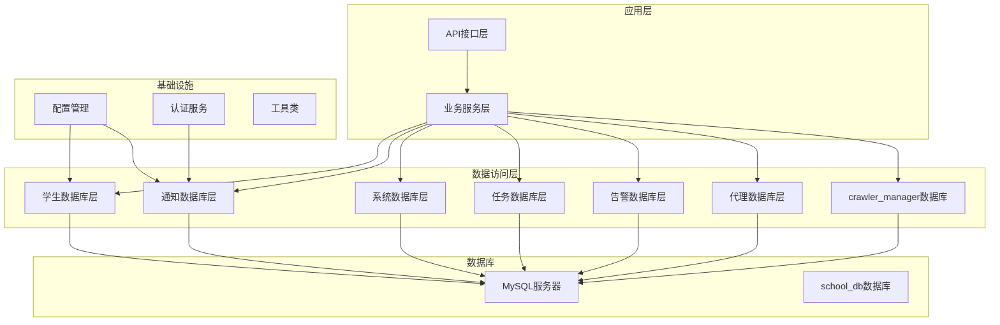

**图表来源**
- [app_db.py:1-726](file://python/app_db.py#L1-L726)
- [student_db.py:1-259](file://python/src/student_db.py#L1-L259)
- [notification_db.py:1-357](file://python/src/notification_db.py#L1-L357)

**章节来源**
- [app_db.py:1-726](file://python/app_db.py#L1-L726)
- [requirements.txt:1-14](file://python/requirements.txt#L1-L14)

## 核心组件

### 数据库连接管理

系统实现了统一的数据库连接管理机制，采用PyMySQL作为底层驱动，提供了以下核心特性：

- **连接池配置**：每个数据库模块都维护独立的连接配置，支持环境变量配置
- **自动连接管理**：内置连接状态检查和自动重连机制
- **事务支持**：每个数据库操作都封装在独立的连接上下文中
- **错误处理**：统一的异常处理和错误恢复机制

### DAO模式实现

系统采用标准的DAO（Data Access Object）模式，每个业务模块都有对应的DAO类：

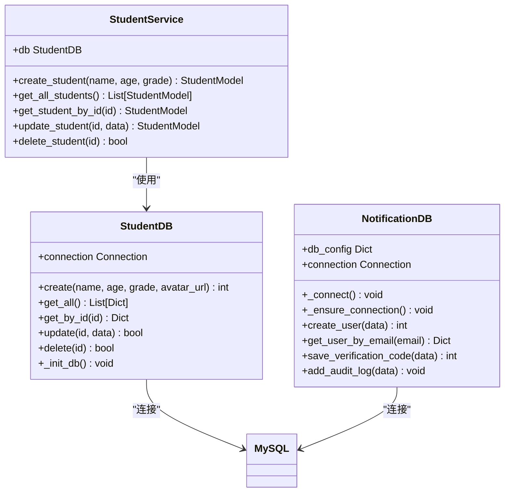

**图表来源**
- [student_db.py:5-259](file://python/src/student_db.py#L5-L259)
- [notification_db.py:6-357](file://python/src/notification_db.py#L6-L357)

### 数据模型抽象

系统实现了清晰的数据模型抽象，将数据库表映射为Python对象：

- **实体模型**：如StudentModel代表学生实体
- **服务层**：提供业务逻辑封装
- **DAO层**：提供数据访问接口
- **配置层**：管理数据库连接配置

**章节来源**
- [student_db.py:140-259](file://python/src/student_db.py#L140-L259)
- [notification_db.py:106-357](file://python/src/notification_db.py#L106-L357)

## 架构概览

系统采用分层架构设计，实现了高内聚低耦合的模块化结构：

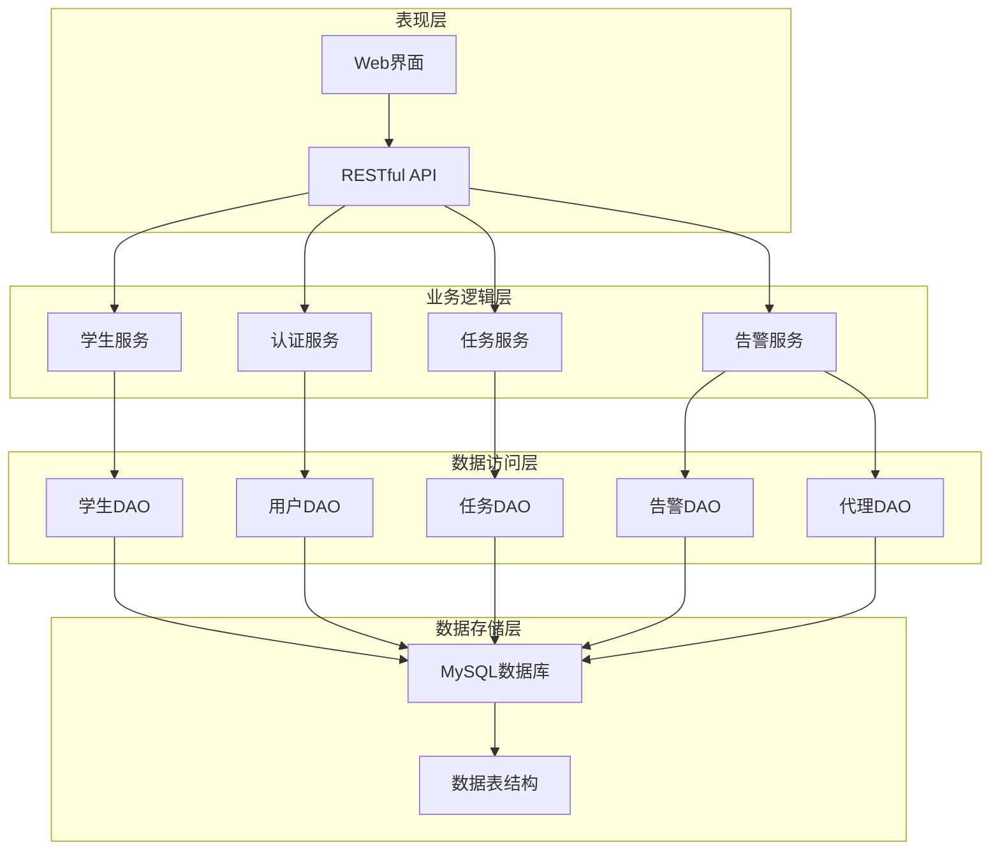

**图表来源**
- [app_db.py:80-726](file://python/app_db.py#L80-L726)
- [auth_service.py:9-187](file://python/src/auth_service.py#L9-L187)

## 详细组件分析

### 学生数据库模块

学生数据库模块是系统的核心业务模块之一，实现了完整的学生成绩管理系统：

#### 表结构设计

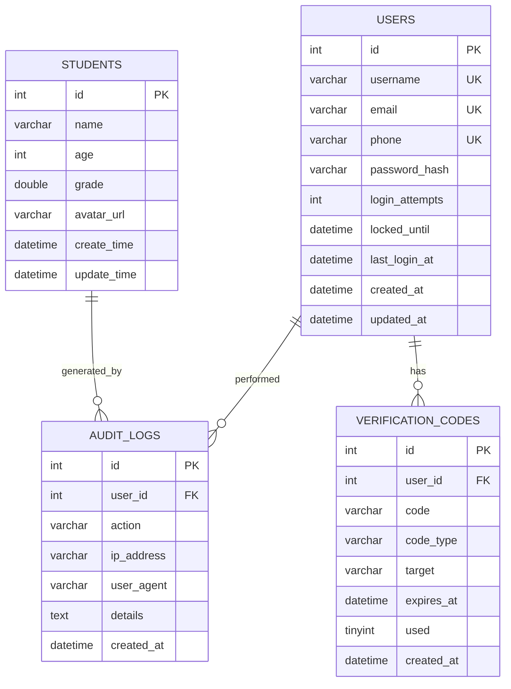

**图表来源**
- [student_db.py:18-30](file://python/src/student_db.py#L18-L30)
- [notification_db.py:44-103](file://python/src/notification_db.py#L44-L103)

#### 数据访问模式

系统实现了多种数据访问模式：

1. **基础CRUD操作**：支持学生信息的增删改查
2. **批量操作**：支持批量删除和批量查询
3. **条件查询**：支持按姓名模糊查询和ID精确查询
4. **统计分析**：提供班级统计和成绩分析功能

#### 连接复用机制

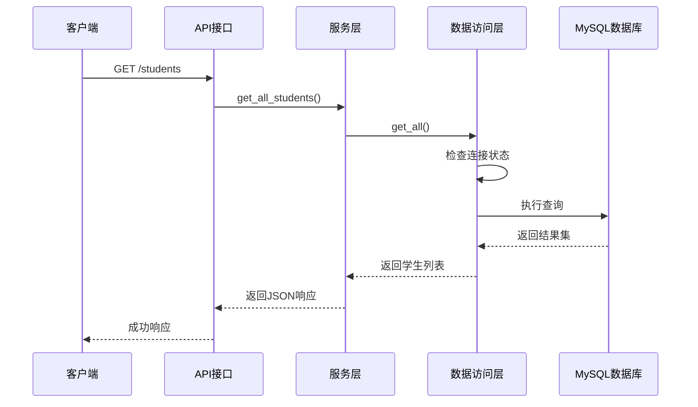

**图表来源**
- [student_db.py:42-53](file://python/src/student_db.py#L42-L53)
- [app_db.py:338-345](file://python/app_db.py#L338-L345)

**章节来源**
- [student_db.py:1-259](file://python/src/student_db.py#L1-L259)

### 通知认证数据库模块

通知认证模块实现了完整的用户认证和授权机制：

#### 认证流程

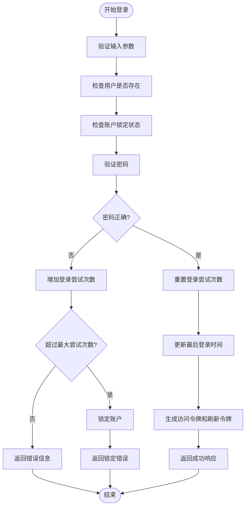

**图表来源**
- [auth_service.py:76-118](file://python/src/auth_service.py#L76-L118)

#### 令牌管理

系统实现了完整的JWT令牌管理机制：

- **访问令牌**：短期有效令牌，用于API访问
- **刷新令牌**：长期有效令牌，用于获取新的访问令牌
- **令牌黑名单**：支持令牌撤销和注销功能
- **自动过期处理**：自动检测和清理过期令牌

**章节来源**
- [auth_service.py:1-187](file://python/src/auth_service.py#L1-L187)
- [notification_db.py:297-321](file://python/src/notification_db.py#L297-L321)

### 系统监控数据库模块

系统监控模块提供了完整的系统日志和设置管理功能：

#### 日志管理

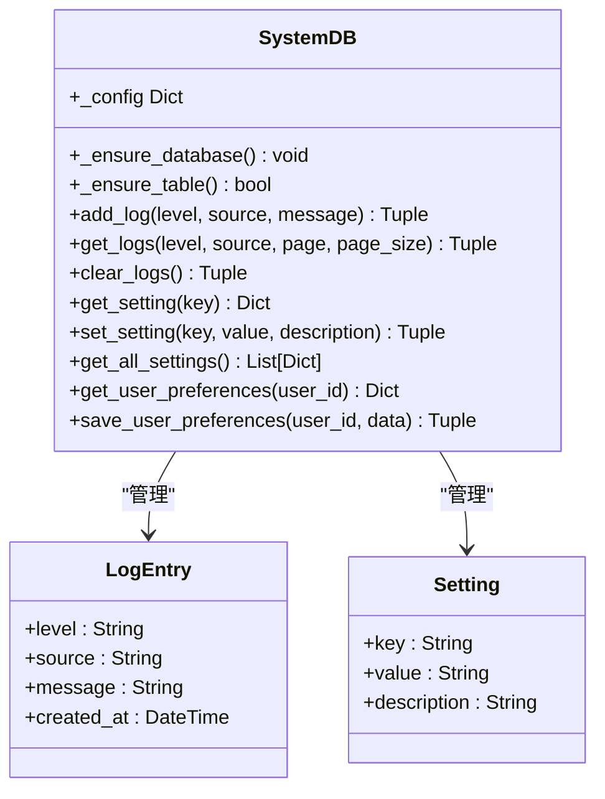

**图表来源**
- [system_db.py:7-317](file://python/system_db.py#L7-L317)

**章节来源**
- [system_db.py:1-317](file://python/system_db.py#L1-L317)

### 任务管理数据库模块

任务管理模块实现了复杂的任务调度和版本控制功能：

#### 任务生命周期

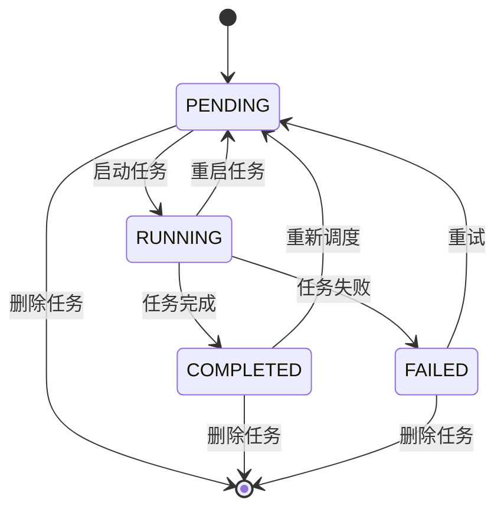

**图表来源**
- [task_db.py:52-73](file://python/task_db.py#L52-L73)

#### 版本管理

系统实现了完整的任务版本控制系统：

- **版本追踪**：自动记录每次配置变更
- **版本回滚**：支持快速回滚到历史版本
- **变更日志**：记录每次版本变更的详细信息
- **版本比较**：支持版本间的差异对比

**章节来源**
- [task_db.py:1-533](file://python/task_db.py#L1-L533)

### 告警管理数据库模块

告警管理模块提供了灵活的告警规则和通知机制：

#### 告警规则类型

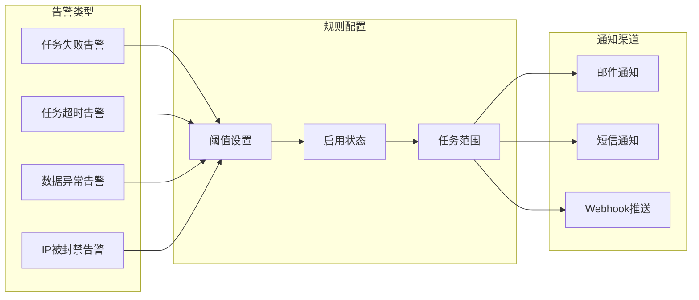

**图表来源**
- [alert_db.py:50-81](file://python/alert_db.py#L50-L81)

**章节来源**
- [alert_db.py:1-314](file://python/alert_db.py#L1-L314)

### 代理池数据库模块

代理池模块实现了智能的代理管理和流量控制：

#### 代理状态管理

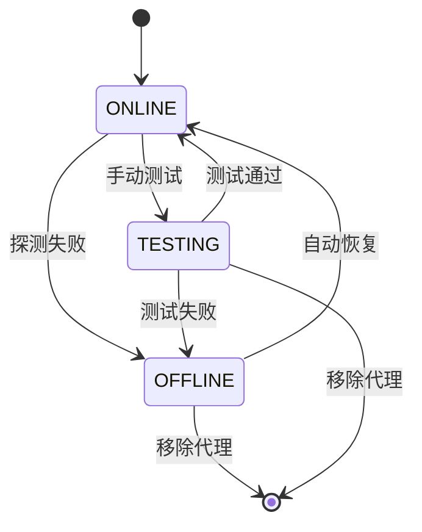

**图表来源**
- [proxy_db.py:50-65](file://python/proxy_db.py#L50-L65)

#### 速率限制策略

系统实现了多层次的速率限制机制：

- **全局速率限制**：对整个系统的请求频率进行限制
- **任务级速率限制**：针对特定任务的独立限制
- **动态调整**：根据代理可用性和网络状况动态调整
- **并发控制**：限制同时进行的请求数量

**章节来源**
- [proxy_db.py:1-528](file://python/proxy_db.py#L1-L528)

### 爬虫数据数据库模块

爬虫数据模块专门处理大规模爬取数据的存储和查询：

#### 数据类型支持

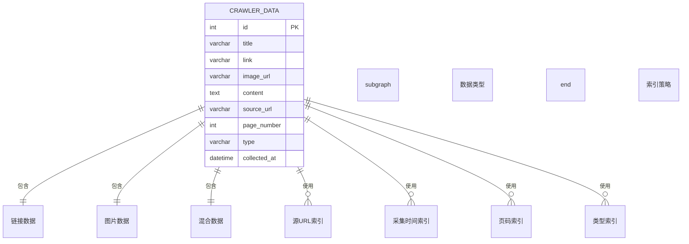

**图表来源**
- [crawler_db.py:54-81](file://python/crawler_db.py#L54-L81)

**章节来源**
- [crawler_db.py:1-238](file://python/crawler_db.py#L1-L238)

## 依赖关系分析

系统采用松耦合的设计原则，各模块间通过清晰的接口进行交互：

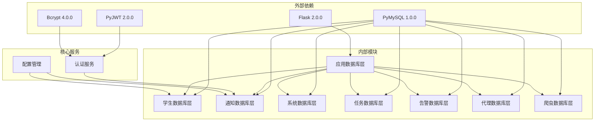

**图表来源**
- [requirements.txt:1-14](file://python/requirements.txt#L1-L14)
- [app_db.py:1-16](file://python/app_db.py#L1-L16)

**章节来源**
- [requirements.txt:1-14](file://python/requirements.txt#L1-L14)

## 性能考虑

### 连接池管理

系统通过以下机制优化数据库连接性能：

- **连接复用**：每个DAO实例维护独立的连接池
- **自动重连**：连接断开时自动尝试重新建立连接
- **连接超时**：设置合理的连接超时时间避免资源浪费
- **连接清理**：定期清理长时间未使用的连接

### 查询优化

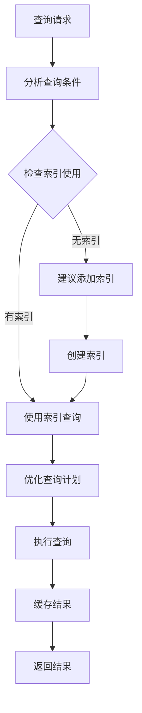

**图表来源**
- [student_db.py:70-81](file://python/src/student_db.py#L70-L81)
- [task_db.py:123-164](file://python/task_db.py#L123-L164)

### 批量操作优化

系统实现了高效的批量数据处理机制：

- **批量插入**：使用单次事务执行多条插入语句
- **批量更新**：支持批量条件更新操作
- **批量删除**：使用IN子句进行批量删除
- **事务控制**：确保批量操作的原子性

### 缓存策略

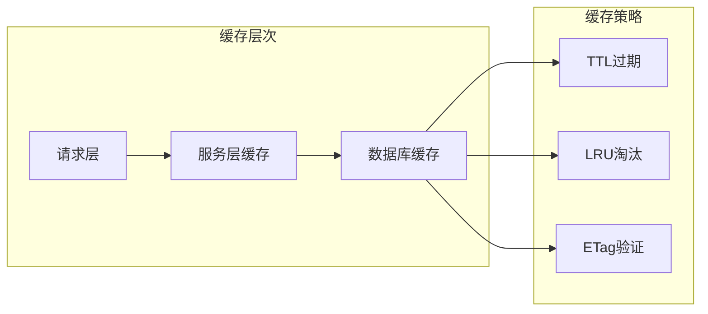

## 故障排除指南

### 常见问题诊断

#### 连接问题

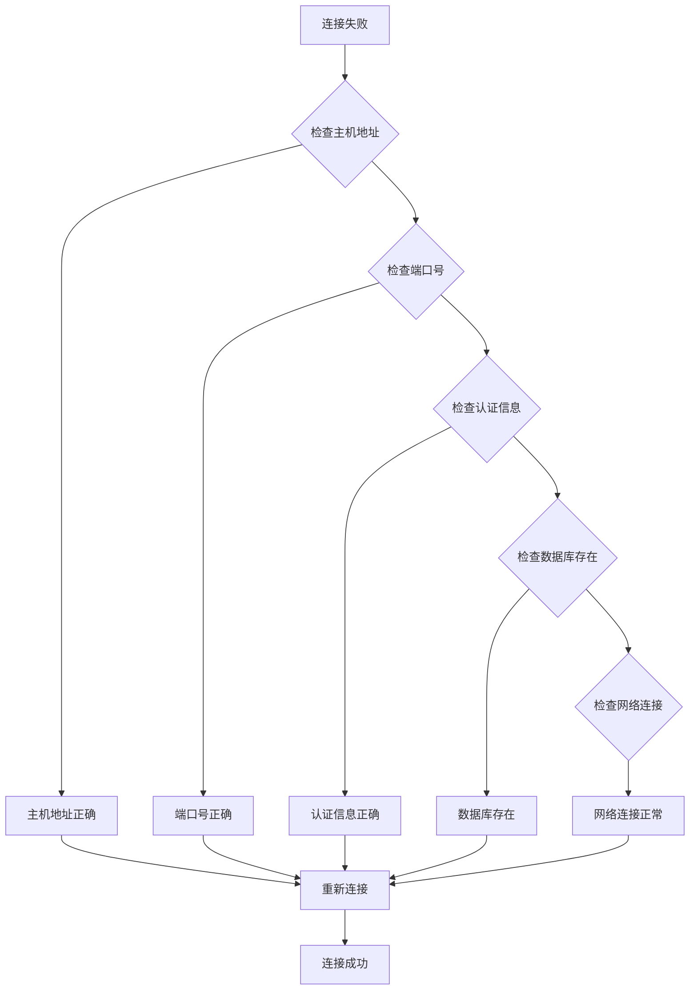

**图表来源**
- [notification_db.py:28-39](file://python/src/notification_db.py#L28-L39)

#### 性能问题

系统提供了完善的性能监控和诊断工具：

- **慢查询日志**：记录执行时间超过阈值的SQL语句
- **连接池监控**：实时监控连接池使用情况
- **查询分析**：提供EXPLAIN输出分析查询计划
- **性能指标**：收集关键性能指标进行趋势分析

### 错误处理机制

系统实现了多层次的错误处理机制：

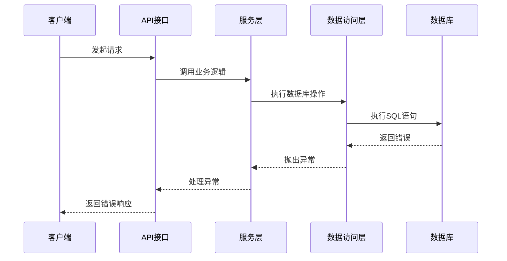

**图表来源**
- [student_db.py:113-117](file://python/src/student_db.py#L113-L117)
- [notification_db.py:181-189](file://python/src/notification_db.py#L181-L189)

**章节来源**
- [notification_db.py:1-357](file://python/src/notification_db.py#L1-L357)

## 结论

本数据库集成架构展现了现代Python应用的最佳实践，通过模块化的数据库设计、清晰的DAO模式实现和完善的连接管理机制，构建了一个高性能、可扩展、易维护的数据访问层。

### 主要优势

1. **模块化设计**：每个业务领域都有独立的数据库模块，职责清晰
2. **连接管理**：实现了完善的连接池管理和自动重连机制
3. **事务处理**：每个操作都在独立的事务上下文中执行，保证数据一致性
4. **性能优化**：通过索引设计、批量操作和缓存策略提升系统性能
5. **错误处理**：建立了完整的异常处理和故障恢复机制

### 改进建议

1. **ORM框架引入**：可以考虑引入SQLAlchemy等ORM框架提升开发效率
2. **连接池配置**：可以根据实际负载调整连接池大小和超时设置
3. **监控增强**：增加更详细的性能监控和告警机制
4. **备份策略**：完善数据库备份和恢复策略

## 附录

### 配置管理

系统通过环境变量和配置类实现灵活的配置管理：

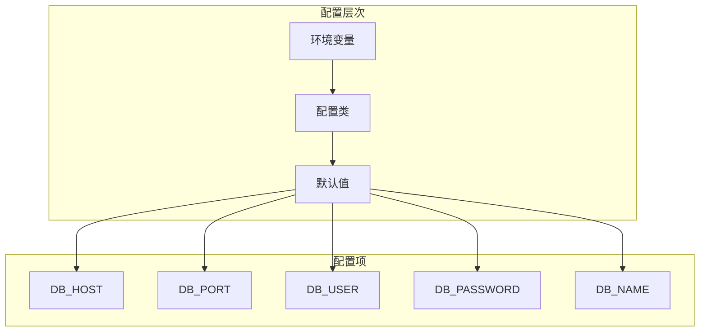

**图表来源**
- [system_db.py:13-22](file://python/system_db.py#L13-L22)
- [config.py:4-19](file://python/src/notifications/config.py#L4-L19)

### 数据迁移策略

系统提供了灵活的数据迁移和版本管理机制：

1. **表结构演进**：通过ALTER TABLE语句支持表结构的渐进式更新
2. **数据完整性**：在迁移过程中保持数据的完整性和一致性
3. **回滚机制**：支持迁移失败时的数据回滚操作
4. **版本标记**：通过独立的版本表记录数据库版本信息

**章节来源**
- [add_column.py:1-27](file://python/add_column.py#L1-L27)