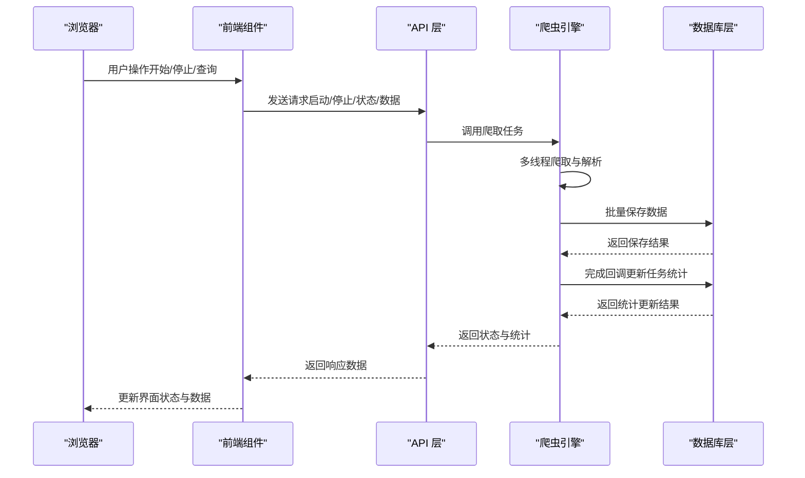
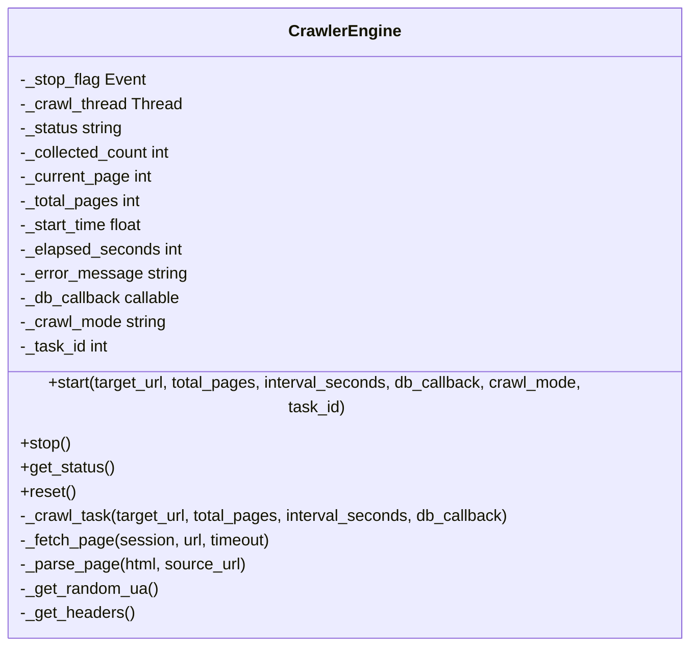
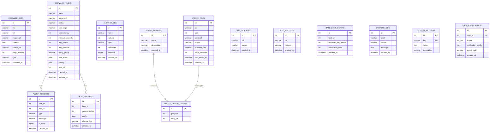
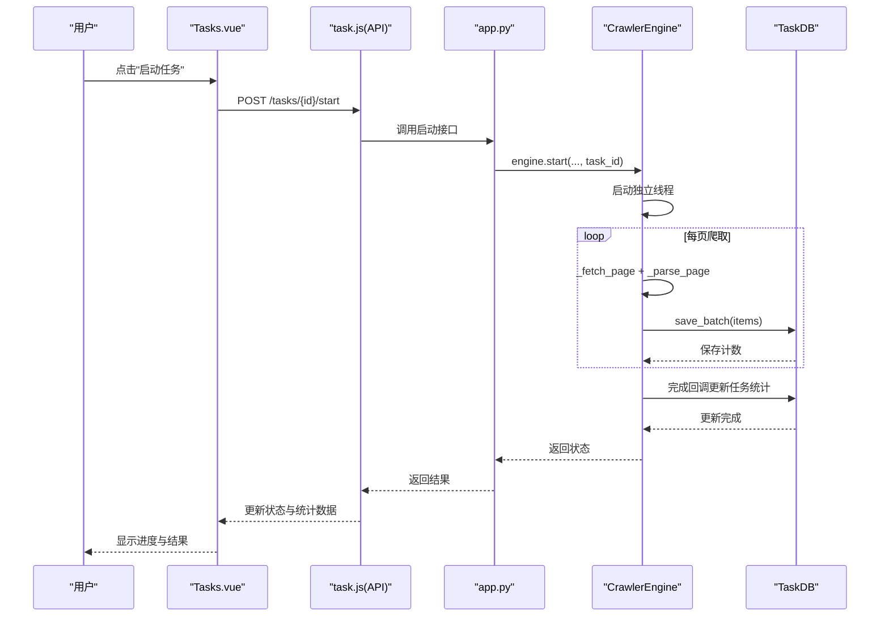
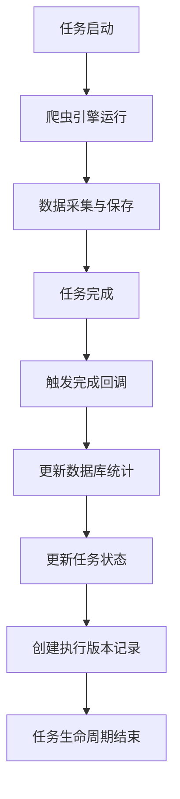
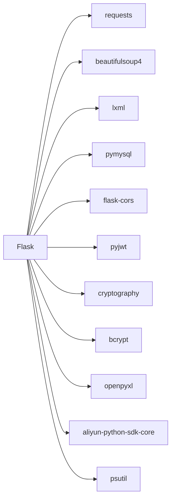

# 爬虫引擎集成

<cite>
**本文档引用的文件**
- [crawler_engine.py](file://python/crawler_engine.py)
- [app.py](file://python/app.py)
- [crawler_db.py](file://python/crawler_db.py)
- [task_db.py](file://python/task_db.py)
- [alert_db.py](file://python/alert_db.py)
- [proxy_db.py](file://python/proxy_db.py)
- [system_db.py](file://python/system_db.py)
- [requirements.txt](file://python/requirements.txt)
- [Crawler.vue](file://python-web/src/views/Crawler.vue)
- [Tasks.vue](file://python-web/src/views/Tasks.vue)
- [crawler.js](file://python-web/src/stores/crawler.js)
- [crawler.js](file://python-web/src/api/crawler.js)
- [task.js](file://python-web/src/api/task.js)
- [SystemMonitor.vue](file://python-web/src/views/SystemMonitor.vue)
- [Alerts.vue](file://python-web/src/views/Alerts.vue)
</cite>

## 更新摘要
**变更内容**
- 新增任务生命周期深度集成机制，包括任务完成回调处理
- 实现数据库统计自动更新功能，支持执行时间、数据量、成功率的实时统计
- 增强任务ID跟踪和完成通知机制，确保任务状态与数据库同步
- 优化前端实时状态展示，支持任务运行时的动态进度更新

## 目录
1. [简介](#简介)
2. [项目结构](#项目结构)
3. [核心组件](#核心组件)
4. [架构概览](#架构概览)
5. [详细组件分析](#详细组件分析)
6. [任务生命周期集成](#任务生命周期集成)
7. [依赖关系分析](#依赖关系分析)
8. [性能考量](#性能考量)
9. [故障排查指南](#故障排查指南)
10. [结论](#结论)
11. [附录](#附录)

## 简介
本项目是一个基于 Python 的爬虫引擎集成系统，采用 Flask 提供 REST API，Vue.js 构建 Web 界面，支持多线程爬取、反爬虫应对、数据解析与存储、任务队列与状态管理、告警与监控等功能。系统通过统一的爬虫引擎模块实现通用的页面解析与数据采集流程，并通过数据库层抽象实现数据持久化与任务管理。**最新版本增强了任务生命周期的深度集成，实现了任务完成回调处理、数据库统计自动更新、任务ID跟踪和完成通知机制。**

## 项目结构
后端采用分层架构：
- 接口层：Flask 应用，提供 REST API
- 引擎层：通用爬虫引擎，负责多线程爬取与解析
- 数据层：数据库操作封装，分别管理爬虫数据、任务、告警、代理、系统设置等
- 前端：Vue.js 单页应用，提供可视化控制台与监控面板

```mermaid
graph TB
subgraph "前端"
FE_Crawler[Crawler.vue]
FE_Tasks[Tasks.vue]
FE_System[SystemMonitor.vue]
FE_Alerts[Alerts.vue]
Store_Crawler[crawler.js]
API_Crawler[crawler.js(API)]
API_Task[task.js]
end
subgraph "后端"
Flask_App[app.py]
Engine[crawler_engine.py]
DB_Crawler[crawler_db.py]
DB_Task[task_db.py]
DB_Alert[alert_db.py]
DB_Proxy[proxy_db.py]
DB_System[system_db.py]
end
FE_Crawler --> API_Crawler
FE_Tasks --> API_Task
FE_System --> API_Task
FE_Alerts --> API_Task
Store_Crawler --> API_Task
API_Crawler --> Flask_App
API_Task --> Flask_App
Flask_App --> Engine
Engine --> DB_Crawler
Engine --> DB_Task
Flask_App --> DB_Task
Flask_App --> DB_Alert
Flask_App --> DB_Proxy
Flask_App --> DB_System
```

**图表来源**
- [app.py:1-800](file://python/app.py#L1-L800)
- [crawler_engine.py:1-544](file://python/crawler_engine.py#L1-L544)
- [crawler_db.py:1-280](file://python/crawler_db.py#L1-L280)
- [task_db.py:1-691](file://python/task_db.py#L1-L691)
- [alert_db.py:1-314](file://python/alert_db.py#L1-L314)
- [proxy_db.py:1-528](file://python/proxy_db.py#L1-L528)
- [system_db.py:1-317](file://python/system_db.py#L1-L317)
- [Crawler.vue:1-544](file://python-web/src/views/Crawler.vue#L1-L544)
- [Tasks.vue:1-1111](file://python-web/src/views/Tasks.vue#L1-L1111)
- [SystemMonitor.vue:1-389](file://python-web/src/views/SystemMonitor.vue#L1-L389)
- [Alerts.vue:1-540](file://python-web/src/views/Alerts.vue#L1-L540)

**章节来源**
- [app.py:1-800](file://python/app.py#L1-L800)
- [requirements.txt:1-14](file://python/requirements.txt#L1-L14)

## 核心组件
- 爬虫引擎：多线程爬取、UA 随机化、请求延时、通用页面解析、错误处理与状态管理
- 数据库层：爬虫数据、任务、告警、代理、系统设置的统一管理
- Web 控制台：爬虫任务控制、状态展示、数据列表与导出、告警中心、系统监控
- API 接口：RESTful 接口，前后端分离通信
- **任务生命周期管理**：任务创建、启动、停止、状态跟踪与统计更新的完整生命周期

**章节来源**
- [crawler_engine.py:1-544](file://python/crawler_engine.py#L1-L544)
- [crawler_db.py:1-280](file://python/crawler_db.py#L1-L280)
- [task_db.py:1-691](file://python/task_db.py#L1-L691)
- [alert_db.py:1-314](file://python/alert_db.py#L1-L314)
- [proxy_db.py:1-528](file://python/proxy_db.py#L1-L528)
- [system_db.py:1-317](file://python/system_db.py#L1-L317)
- [Crawler.vue:1-544](file://python-web/src/views/Crawler.vue#L1-L544)
- [Tasks.vue:1-1111](file://python-web/src/views/Tasks.vue#L1-L1111)
- [SystemMonitor.vue:1-389](file://python-web/src/views/SystemMonitor.vue#L1-L389)
- [Alerts.vue:1-540](file://python-web/src/views/Alerts.vue#L1-L540)

## 架构概览
系统采用"前端 + 后端 + 数据库"的三层架构。前端通过 API 与后端交互，后端调用爬虫引擎执行采集任务并将结果写入数据库。数据库层提供统一的数据访问接口，支持爬虫数据、任务、告警、代理、系统设置等业务实体。**新增的任务生命周期集成确保了任务状态与数据库的实时同步。**



**图表来源**
- [app.py:316-361](file://python/app.py#L316-L361)
- [crawler_engine.py:400-472](file://python/crawler_engine.py#L400-L472)
- [crawler_db.py:96-139](file://python/crawler_db.py#L96-L139)

**章节来源**
- [app.py:316-361](file://python/app.py#L316-L361)
- [crawler_engine.py:400-472](file://python/crawler_engine.py#L400-L472)
- [crawler_db.py:96-139](file://python/crawler_db.py#L96-L139)

## 详细组件分析

### 爬虫引擎组件分析
- 多线程爬取策略：使用独立线程执行爬取任务，支持启动/停止控制与状态查询
- 反爬虫应对：随机 UA、随机 Accept、随机语言、请求延时、403/5xx 错误重试
- 数据解析处理：支持链接、图片、混合模式解析，统一去重与规范化
- 异常恢复机制：捕获网络异常、解析异常、数据库异常，设置错误状态与消息
- 状态管理：运行状态、已采集条数、当前页/总页数、耗时、错误信息
- **任务完成回调**：任务完成后自动触发完成回调，更新数据库统计信息



**图表来源**
- [crawler_engine.py:10-544](file://python/crawler_engine.py#L10-L544)

**章节来源**
- [crawler_engine.py:10-544](file://python/crawler_engine.py#L10-L544)

### 数据库层组件分析
- 爬虫数据表：标题、链接、图片 URL、内容摘要、来源 URL、页码、类型、采集时间
- 任务管理表：任务名称、目标 URL、状态、Cron 表达式、并发数、重试配置、代理组、告警规则、配置、用户 ID
- 告警规则与记录：规则名称、任务 ID、类型、阈值、启用状态、告警消息、是否已读
- 代理池与速率限制：代理 IP、端口、协议、状态、成功率、存活时长、分组映射、黑白名单
- 系统日志与设置：日志级别、来源、消息、系统设置键值、用户偏好
- **任务版本管理**：支持任务配置的历史版本追踪与回滚功能



**图表来源**
- [crawler_db.py:48-87](file://python/crawler_db.py#L48-L87)
- [task_db.py:47-111](file://python/task_db.py#L47-L111)
- [alert_db.py:46-81](file://python/alert_db.py#L46-L81)
- [proxy_db.py:46-120](file://python/proxy_db.py#L46-L120)
- [system_db.py:47-87](file://python/system_db.py#L47-L87)

**章节来源**
- [crawler_db.py:48-87](file://python/crawler_db.py#L48-L87)
- [task_db.py:47-111](file://python/task_db.py#L47-L111)
- [alert_db.py:46-81](file://python/alert_db.py#L46-L81)
- [proxy_db.py:46-120](file://python/proxy_db.py#L46-L120)
- [system_db.py:47-87](file://python/system_db.py#L47-L87)

### Web 控制台与监控组件分析
- 爬虫控制台：目标网址、爬取页数、请求间隔、爬取模式选择；启动/停止/清空/导出；实时状态展示与进度条
- 任务管理：任务列表、模板、版本、收藏、启动/停止、回滚
- 告警中心：告警类型筛选、未读标记、详情展开、分页查看
- 系统监控：CPU/内存/磁盘/网络仪表盘、历史曲线、任务资源排名、阈值设置
- **实时状态展示**：支持任务运行时的动态进度更新，包括执行时间、数据量、成功率的实时计算



**图表来源**
- [Tasks.vue:695-736](file://python-web/src/views/Tasks.vue#L695-L736)
- [task.js:24-30](file://python-web/src/api/task.js#L24-L30)
- [app.py:695-736](file://python/app.py#L695-L736)
- [crawler_engine.py:473-508](file://python/crawler_engine.py#L473-L508)
- [task_db.py:648-662](file://python/task_db.py#L648-L662)

**章节来源**
- [Crawler.vue:1-544](file://python-web/src/views/Crawler.vue#L1-L544)
- [Tasks.vue:1-1111](file://python-web/src/views/Tasks.vue#L1-L1111)
- [SystemMonitor.vue:1-389](file://python-web/src/views/SystemMonitor.vue#L1-L389)
- [Alerts.vue:1-540](file://python-web/src/views/Alerts.vue#L1-L540)
- [task.js:1-71](file://python-web/src/api/task.js#L1-L71)
- [crawler.js:1-174](file://python-web/src/stores/crawler.js#L1-L174)

## 任务生命周期集成

### 任务完成回调处理
系统实现了完整的任务生命周期管理，包括任务完成后的自动回调处理机制：

- **完成回调触发**：当爬虫任务完成后，引擎自动触发完成回调函数
- **任务统计更新**：回调函数自动更新数据库中的任务执行统计信息
- **状态同步**：确保数据库中的任务状态与实际执行结果保持一致



**图表来源**
- [app.py:316-361](file://python/app.py#L316-L361)
- [crawler_engine.py:465-472](file://python/crawler_engine.py#L465-L472)

### 数据库统计自动更新
系统实现了自动化的数据库统计更新机制：

- **执行时间统计**：自动记录任务的总执行时间
- **数据量统计**：实时更新已采集的数据条数
- **成功率计算**：根据任务完成状态自动计算成功率
- **错误信息记录**：记录任务执行过程中的错误信息

**章节来源**
- [app.py:316-361](file://python/app.py#L316-L361)
- [task_db.py:532-549](file://python/task_db.py#L532-L549)

### 任务ID跟踪与完成通知
系统提供了完善的任务ID跟踪和完成通知机制：

- **任务ID传递**：在启动爬虫任务时传递任务ID参数
- **状态跟踪**：通过任务ID跟踪任务的执行状态
- **完成通知**：任务完成后向外部系统发送完成通知
- **版本记录**：自动创建任务执行版本记录

**章节来源**
- [crawler_engine.py:501-508](file://python/crawler_engine.py#L501-L508)
- [app.py:337-358](file://python/app.py#L337-L358)
- [task_db.py:367-397](file://python/task_db.py#L367-L397)

## 依赖关系分析
- 后端依赖：Flask、Flask-CORS、PyMySQL、Requests、BeautifulSoup4、lxml、psutil
- 前端依赖：Vue 3、Element Plus、Pinia、路由与 API 封装



**图表来源**
- [requirements.txt:1-14](file://python/requirements.txt#L1-L14)

**章节来源**
- [requirements.txt:1-14](file://python/requirements.txt#L1-L14)

## 性能考量
- 多线程爬取：通过独立线程避免阻塞，支持停止信号优雅退出
- 反爬虫策略：随机 UA、随机 Accept、随机语言、请求延时、错误重试
- 数据批量写入：使用批量插入减少数据库往返开销
- 内存管理：逐页处理与去重集合，避免重复存储；异常时及时释放会话
- 监控与告警：系统监控仪表盘与告警规则，支持阈值配置与未读提醒
- **任务生命周期优化**：通过完成回调机制减少手动状态同步开销

## 故障排查指南
- 爬取失败：检查目标 URL 是否有效、网络连通性、代理可用性
- 解析异常：确认页面结构变化，调整解析规则或降级策略
- 数据库异常：检查连接参数、表结构、索引与权限
- 告警处理：根据告警类型采取相应措施，如增加代理、调整并发、延长超时
- 状态查询：通过状态接口获取当前运行状态与错误信息
- **任务生命周期问题**：检查完成回调是否正常触发，数据库统计是否正确更新

**章节来源**
- [app.py:316-361](file://python/app.py#L316-L361)
- [crawler_engine.py:400-472](file://python/crawler_engine.py#L400-L472)
- [alert_db.py:199-223](file://python/alert_db.py#L199-L223)

## 结论
本系统提供了完整的爬虫引擎集成方案，涵盖任务调度、数据采集、状态管理、反爬虫应对、数据存储与批量写入、异常恢复、监控与告警等关键能力。**最新版本的增强功能实现了任务生命周期的深度集成，包括任务完成回调处理、数据库统计自动更新、任务ID跟踪和完成通知机制，进一步提升了系统的自动化程度和可靠性。**通过清晰的分层架构与前后端分离设计，系统具备良好的扩展性与可维护性，适合在生产环境中部署与运维。

## 附录
- API 定义与示例：参考接口层实现与前端调用封装
- 数据模型：参考数据库层表结构定义
- 前端组件：参考 Vue 组件与状态管理
- **任务生命周期管理**：参考任务启动、停止、状态跟踪的完整流程

**章节来源**
- [app.py:316-361](file://python/app.py#L316-L361)
- [crawler_db.py:48-87](file://python/crawler_db.py#L48-L87)
- [Crawler.vue:1-544](file://python-web/src/views/Crawler.vue#L1-L544)
- [Tasks.vue:1-1111](file://python-web/src/views/Tasks.vue#L1-L1111)
- [SystemMonitor.vue:1-389](file://python-web/src/views/SystemMonitor.vue#L1-L389)
- [Alerts.vue:1-540](file://python-web/src/views/Alerts.vue#L1-L540)