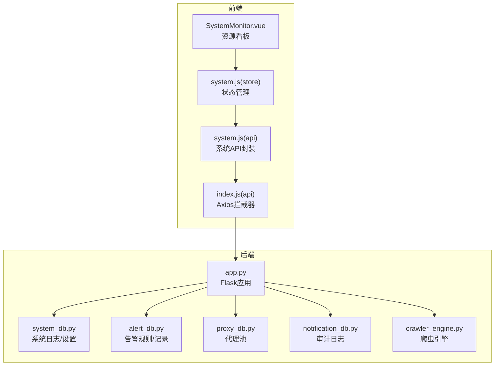
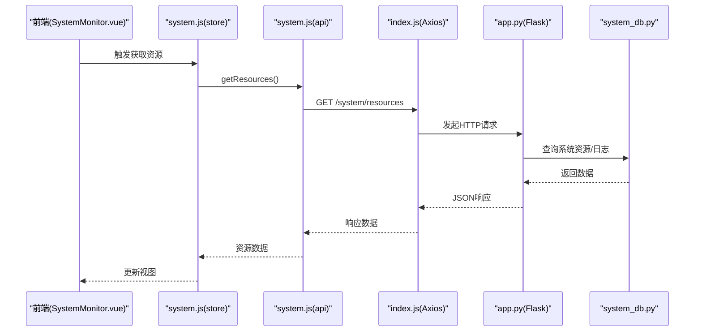
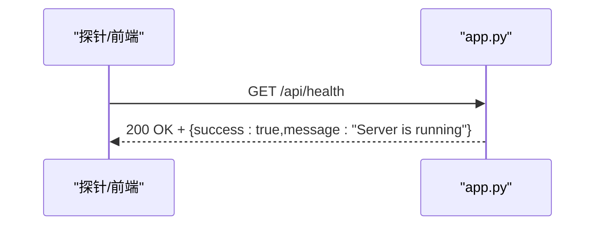
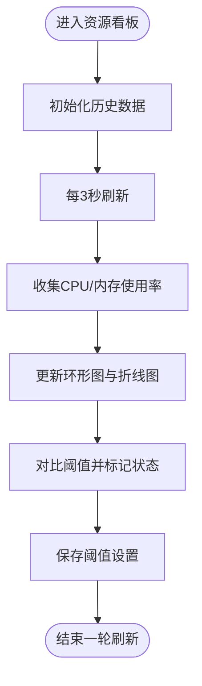
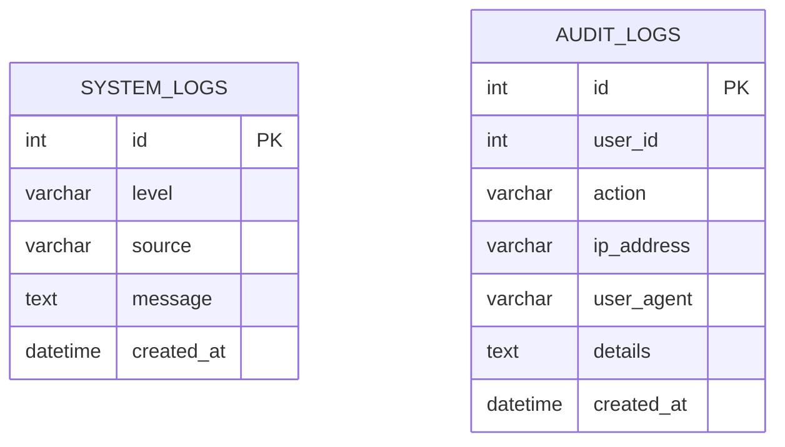
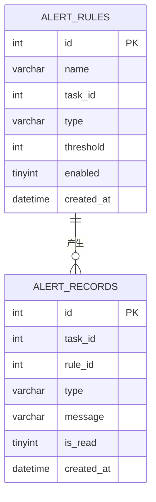
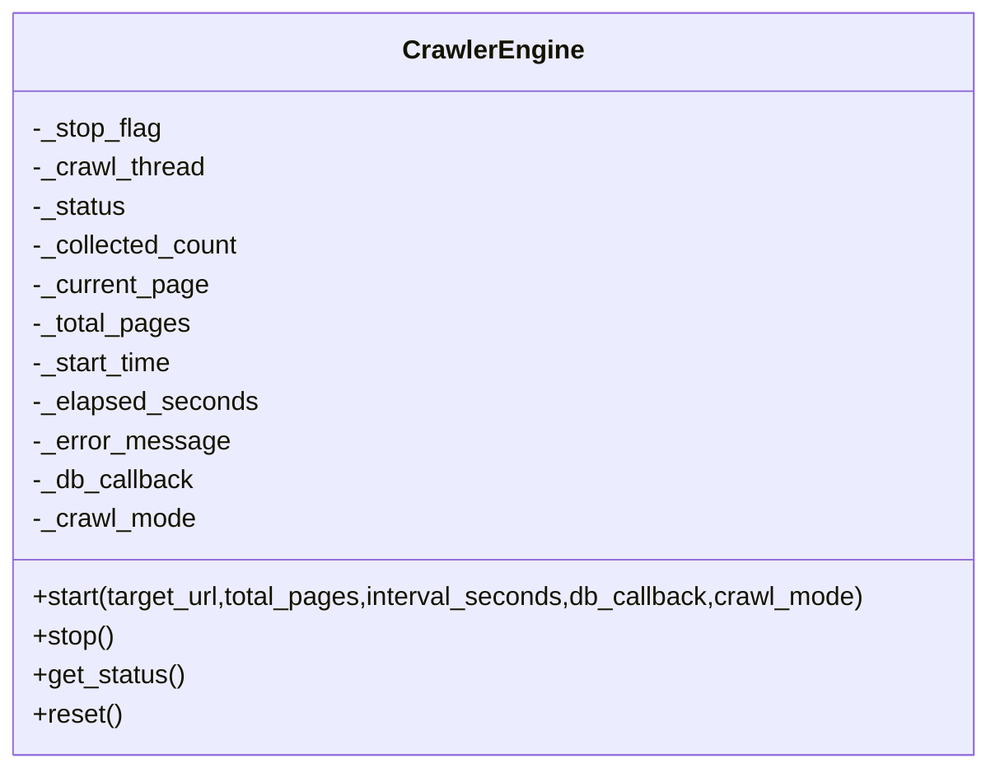
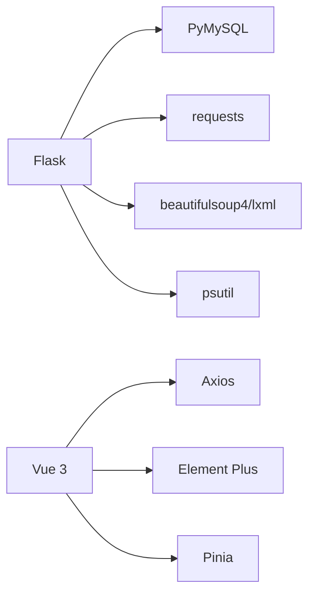
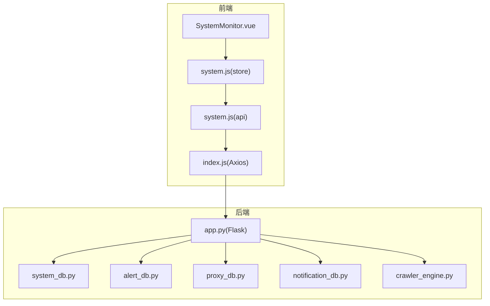

# 系统监控架构

<cite>
**本文档引用的文件**
- [app.py](file://python/app.py)
- [system_db.py](file://python/system_db.py)
- [alert_db.py](file://python/alert_db.py)
- [crawler_engine.py](file://python/crawler_engine.py)
- [notification_db.py](file://python/src/notification_db.py)
- [proxy_db.py](file://python/proxy_db.py)
- [SystemMonitor.vue](file://python-web/src/views/SystemMonitor.vue)
- [system.js](file://python-web/src/stores/system.js)
- [system.js(api)](file://python-web/src/api/system.js)
- [index.js(api)](file://python-web/src/api/index.js)
- [requirements.txt](file://python/requirements.txt)
</cite>

## 目录
1. [简介](#简介)
2. [项目结构](#项目结构)
3. [核心组件](#核心组件)
4. [架构总览](#架构总览)
5. [详细组件分析](#详细组件分析)
6. [依赖关系分析](#依赖关系分析)
7. [性能考虑](#性能考虑)
8. [故障排查指南](#故障排查指南)
9. [结论](#结论)
10. [附录](#附录)

## 简介
本文件面向系统监控与运维团队，系统性梳理该代码库的监控架构，覆盖健康检查、性能指标采集、系统状态监控、日志与审计、异常与告警、资源与数据库监控、爬虫状态监控、告警通知、监控仪表板以及故障诊断与优化建议。文档基于仓库现有实现进行归纳总结，并提供架构图与指标定义表，帮助读者快速理解与落地。

## 项目结构
后端采用Flask应用，前端采用Vue+Element Plus，监控相关模块分布如下：
- 后端Python服务：提供REST接口、业务路由、监控数据持久化与状态查询
- 数据库层：系统日志、告警规则与记录、代理池、审计日志等
- 前端Vue应用：系统监控看板、日志查看、告警管理、资源展示

图表来源
- [app.py:1-120](file://python/app.py#L1-L120)
- [system_db.py:1-120](file://python/system_db.py#L1-L120)
- [alert_db.py:1-120](file://python/alert_db.py#L1-L120)
- [proxy_db.py:1-120](file://python/proxy_db.py#L1-L120)
- [notification_db.py:1-120](file://python/src/notification_db.py#L1-L120)
- [crawler_engine.py:1-120](file://python/crawler_engine.py#L1-L120)
- [SystemMonitor.vue:1-120](file://python-web/src/views/SystemMonitor.vue#L1-L120)
- [system.js:1-80](file://python-web/src/stores/system.js#L1-L80)
- [system.js(api):1-35](file://python-web/src/api/system.js#L1-L35)
- [index.js(api):1-60](file://python-web/src/api/index.js#L1-L60)

章节来源
- [app.py:1-120](file://python/app.py#L1-L120)
- [requirements.txt:1-14](file://python/requirements.txt#L1-L14)

## 核心组件
- 健康检查：后端提供统一健康检查接口，前端轮询展示
- 日志与审计：系统日志表与审计日志表分离，支持按级别、来源、时间过滤
- 告警管理：规则表与记录表，支持未读计数与标记已读
- 资源监控：前端仪表板展示CPU/内存/磁盘/网络使用率与趋势
- 爬虫状态：引擎状态、采集数量、页码进度、耗时、错误信息
- 代理池：代理IP维护、可用性评分、存活时长、黑白名单
- 通知与验证：验证码发送、邮件/SMS发送服务（占位）

章节来源
- [app.py:468-471](file://python/app.py#L468-L471)
- [system_db.py:47-168](file://python/system_db.py#L47-L168)
- [alert_db.py:46-168](file://python/alert_db.py#L46-L168)
- [proxy_db.py:1-120](file://python/proxy_db.py#L1-L120)
- [notification_db.py:93-103](file://python/src/notification_db.py#L93-L103)
- [crawler_engine.py:508-531](file://python/crawler_engine.py#L508-L531)
- [SystemMonitor.vue:1-120](file://python-web/src/views/SystemMonitor.vue#L1-L120)

## 架构总览
后端通过Flask路由暴露监控相关接口，前端通过Axios封装统一调用，数据持久化由各DB模块负责。系统监控涉及以下关键路径：
- 健康检查：GET /api/health
- 资源看板：GET /system/resources
- 日志管理：GET/DELETE /system/logs
- 告警管理：GET/POST/PUT/DELETE /alerts/*
- 爬虫控制：POST /api/crawler/start | /api/crawler/stop | GET /api/crawler/status
- 审计日志：写入 audit_logs 表

图表来源
- [SystemMonitor.vue:135-139](file://python-web/src/views/SystemMonitor.vue#L135-L139)
- [system.js:135-139](file://python-web/src/stores/system.js#L135-L139)
- [system.js(api):12-14](file://python-web/src/api/system.js#L12-L14)
- [index.js(api):1-20](file://python-web/src/api/index.js#L1-L20)
- [app.py:1-120](file://python/app.py#L1-L120)
- [system_db.py:99-168](file://python/system_db.py#L99-L168)

## 详细组件分析

### 健康检查机制
- 接口：GET /api/health
- 行为：返回服务运行状态，便于K8s/负载均衡探针使用
- 前端：轮询展示健康状态

图表来源
- [app.py:468-471](file://python/app.py#L468-L471)

章节来源
- [app.py:468-471](file://python/app.py#L468-L471)

### 性能指标采集与系统状态监控
- 资源看板：前端每3秒刷新一次，展示CPU/内存/磁盘/网络使用率与历史曲线
- 指标来源：前端本地模拟数据，实际应对接后端资源接口
- 前端交互：阈值滑杆设置、排序与筛选

图表来源
- [SystemMonitor.vue:225-236](file://python-web/src/views/SystemMonitor.vue#L225-L236)

章节来源
- [SystemMonitor.vue:1-242](file://python-web/src/views/SystemMonitor.vue#L1-L242)

### 日志记录策略与审计跟踪
- 系统日志：system_logs 表，支持按级别、来源、时间过滤，分页查询
- 审计日志：audit_logs 表，记录用户行为（注册/登录/登出/改密等），含IP与UA
- 前端：日志查看、搜索、分页、导出、清空

图表来源
- [system_db.py:52-87](file://python/system_db.py#L52-L87)
- [notification_db.py:93-103](file://python/src/notification_db.py#L93-L103)

章节来源
- [system_db.py:47-168](file://python/system_db.py#L47-L168)
- [notification_db.py:334-343](file://python/src/notification_db.py#L334-L343)

### 异常监控与告警机制
- 告警规则：alert_rules 表，支持任务级与全局规则，启用/禁用
- 告警记录：alert_records 表，记录类型、消息、是否已读
- 未读计数：get_unread_count 统计未读告警数量
- 前端：告警列表、标记已读、批量标记、未读角标

图表来源
- [alert_db.py:51-81](file://python/alert_db.py#L51-L81)
- [alert_db.py:93-118](file://python/alert_db.py#L93-L118)
- [alert_db.py:199-222](file://python/alert_db.py#L199-L222)
- [alert_db.py:297-308](file://python/alert_db.py#L297-L308)

章节来源
- [alert_db.py:46-168](file://python/alert_db.py#L46-L168)
- [alert_db.py:199-308](file://python/alert_db.py#L199-L308)

### 资源使用监控
- 前端：环形图展示CPU/内存/磁盘/网络；折线图展示CPU/内存历史趋势
- 存储：system_db 提供系统日志与设置存储
- 扩展建议：后端提供真实资源指标接口（如通过psutil采集）

章节来源
- [SystemMonitor.vue:1-242](file://python-web/src/views/SystemMonitor.vue#L1-L242)
- [system_db.py:99-168](file://python/system_db.py#L99-L168)

### 数据库连接池监控
- 当前实现：各DB模块直接建立连接并执行SQL，未见显式连接池配置
- 建议：引入连接池（如pymysql连接池）以提升并发与稳定性

章节来源
- [system_db.py:25-30](file://python/system_db.py#L25-L30)
- [alert_db.py:24-29](file://python/alert_db.py#L24-L29)
- [proxy_db.py:24-29](file://python/proxy_db.py#L24-L29)

### 爬虫状态监控
- 状态属性：status、collected_count、current_page、total_pages、elapsed_seconds、error_message
- 控制接口：启动/停止/状态查询
- 前端：展示状态、进度、耗时、错误提示

图表来源
- [crawler_engine.py:51-63](file://python/crawler_engine.py#L51-L63)
- [crawler_engine.py:464-497](file://python/crawler_engine.py#L464-L497)
- [crawler_engine.py:499-531](file://python/crawler_engine.py#L499-L531)

章节来源
- [crawler_engine.py:508-531](file://python/crawler_engine.py#L508-L531)
- [app.py:306-380](file://python/app.py#L306-L380)

### 代理池监控
- 代理池：proxy_pool 表，维护IP、端口、协议、状态、成功率、存活时长、最后检测时间
- 黑白名单：proxy_group_mapping 关联代理与分组
- 前端：代理管理、刷新、增删、黑白名单维护

章节来源
- [proxy_db.py:1-120](file://python/proxy_db.py#L1-L120)
- [proxy_db.py:168-246](file://python/proxy_db.py#L168-L246)

### 告警通知机制
- 前端：未读告警角标、列表展示、标记已读
- 后端：告警规则与记录持久化，未读计数查询
- 通知：VerificationService支持邮件/SMS发送（占位），可扩展集成第三方通知渠道

章节来源
- [system.js:17-33](file://python-web/src/stores/system.js#L17-L33)
- [alert_db.py:297-308](file://python/alert_db.py#L297-L308)
- [notification_db.py:334-343](file://python/src/notification_db.py#L334-L343)

### 监控仪表板与故障诊断
- 仪表板：SystemMonitor.vue 展示资源使用与阈值设置
- 故障诊断：日志查看、搜索、分页、导出、清空；审计日志记录用户行为
- 前端交互：排序、筛选、刷新、阈值保存

章节来源
- [SystemMonitor.vue:1-242](file://python-web/src/views/SystemMonitor.vue#L1-L242)
- [system.js:121-133](file://python-web/src/stores/system.js#L121-L133)
- [notification_db.py:334-343](file://python/src/notification_db.py#L334-L343)

## 依赖关系分析
- Python依赖：Flask、Flask-CORS、PyMySQL、requests、beautifulsoup4、lxml、psutil等
- 前端依赖：Axios、Element Plus、Pinia、Vue 3

图表来源
- [requirements.txt:1-14](file://python/requirements.txt#L1-L14)
- [index.js(api):1-20](file://python-web/src/api/index.js#L1-L20)

章节来源
- [requirements.txt:1-14](file://python/requirements.txt#L1-L14)

## 性能考虑
- 爬虫并发与限速：引擎内置请求间隔与重试策略，避免被封禁；建议结合代理池与动态UA
- 数据库连接：建议引入连接池，减少频繁建连开销
- 前端渲染：资源看板历史数据长度限制（最多24点），避免DOM过大
- 健康检查：轻量接口，适合高频探测

## 故障排查指南
- 健康检查失败：检查后端进程与端口，确认CORS配置允许的来源
- 日志查询异常：确认system_logs表是否存在索引，优化where条件
- 告警未读计数不更新：检查标记已读接口调用链路
- 爬虫异常：查看错误信息字段，定位具体页码与错误原因
- 代理不可用：检查代理池刷新逻辑与黑白名单

章节来源
- [app.py:468-471](file://python/app.py#L468-L471)
- [system_db.py:123-168](file://python/system_db.py#L123-L168)
- [alert_db.py:280-296](file://python/alert_db.py#L280-L296)
- [crawler_engine.py:425-456](file://python/crawler_engine.py#L425-L456)
- [proxy_db.py:221-246](file://python/proxy_db.py#L221-L246)

## 结论
该监控架构以“前端看板 + 后端接口 + 数据库存储”为核心，覆盖健康检查、日志审计、告警管理、资源监控与爬虫状态。建议后续增强：
- 后端资源指标接口与连接池
- 告警通知通道扩展（邮件/SMS/IM）
- 爬虫与代理池的动态阈值与自适应策略
- 监控数据可视化与报表功能

## 附录

### 监控架构图（代码映射）

图表来源
- [SystemMonitor.vue:1-120](file://python-web/src/views/SystemMonitor.vue#L1-L120)
- [system.js:1-80](file://python-web/src/stores/system.js#L1-L80)
- [system.js(api):1-35](file://python-web/src/api/system.js#L1-L35)
- [index.js(api):1-60](file://python-web/src/api/index.js#L1-L60)
- [app.py:1-120](file://python/app.py#L1-L120)
- [system_db.py:1-120](file://python/system_db.py#L1-L120)
- [alert_db.py:1-120](file://python/alert_db.py#L1-L120)
- [proxy_db.py:1-120](file://python/proxy_db.py#L1-L120)
- [notification_db.py:1-120](file://python/src/notification_db.py#L1-L120)
- [crawler_engine.py:1-120](file://python/crawler_engine.py#L1-L120)

### 指标定义表
- 系统资源指标
  - CPU使用率：百分比
  - 内存使用率：百分比
  - 磁盘使用率：百分比
  - 网络带宽：字节/秒
- 爬虫状态指标
  - 状态：idle/running/stopping/completed/error
  - 已采集条目数：整数
  - 当前页码/总页数：整数
  - 已用时长：秒
  - 错误信息：字符串
- 告警指标
  - 规则类型：FAILED/TIMEOUT/DATA_ANOMALY/IP_BLOCKED
  - 阈值：整数
  - 未读计数：整数
- 日志指标
  - 日志级别：INFO/WARNING/ERROR
  - 日志来源：字符串
  - 创建时间：时间戳
- 审计指标
  - 用户ID：整数
  - 操作类型：REGISTER/LOGIN/LOGOUT/RESET_PASSWORD/CHANGE_PASSWORD
  - IP地址：字符串
  - User-Agent：字符串
  - 详情：文本

章节来源
- [SystemMonitor.vue:134-149](file://python-web/src/views/SystemMonitor.vue#L134-L149)
- [crawler_engine.py:508-531](file://python/crawler_engine.py#L508-L531)
- [alert_db.py:51-81](file://python/alert_db.py#L51-L81)
- [system_db.py:52-62](file://python/system_db.py#L52-L62)
- [notification_db.py:93-103](file://python/src/notification_db.py#L93-L103)