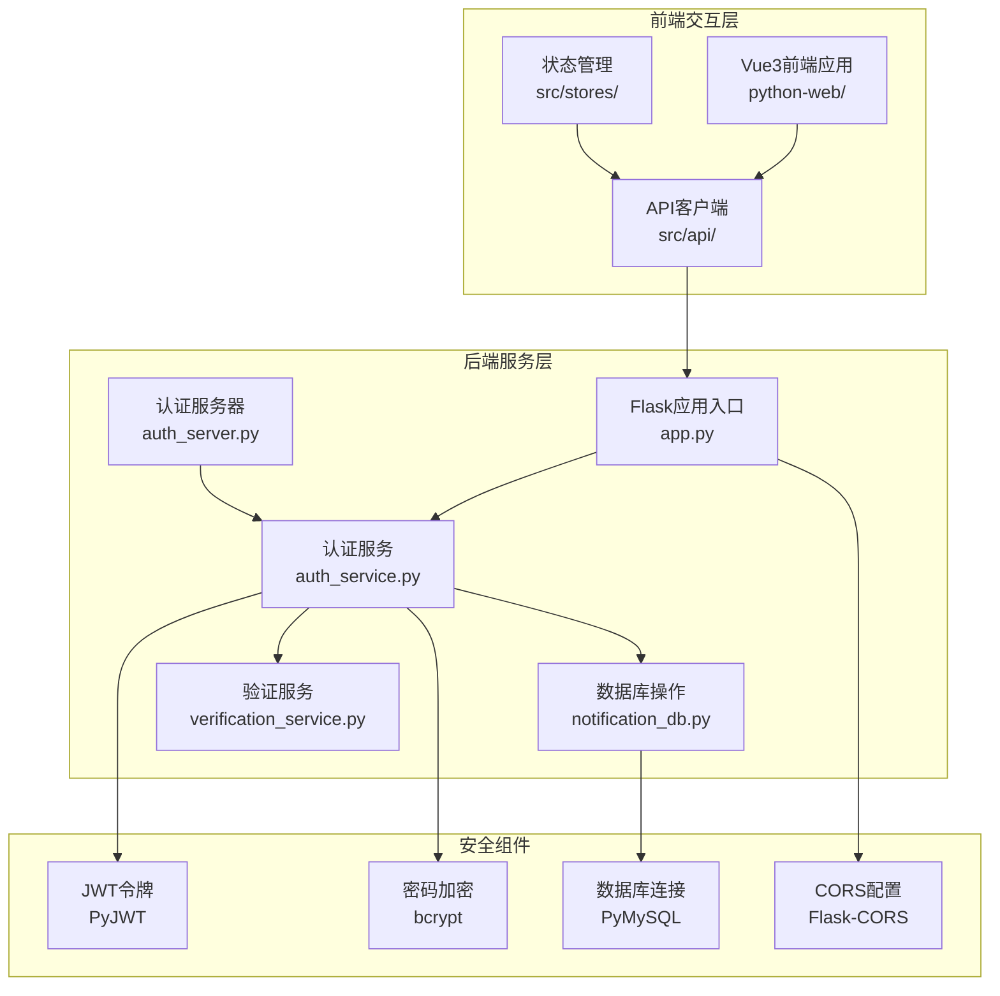
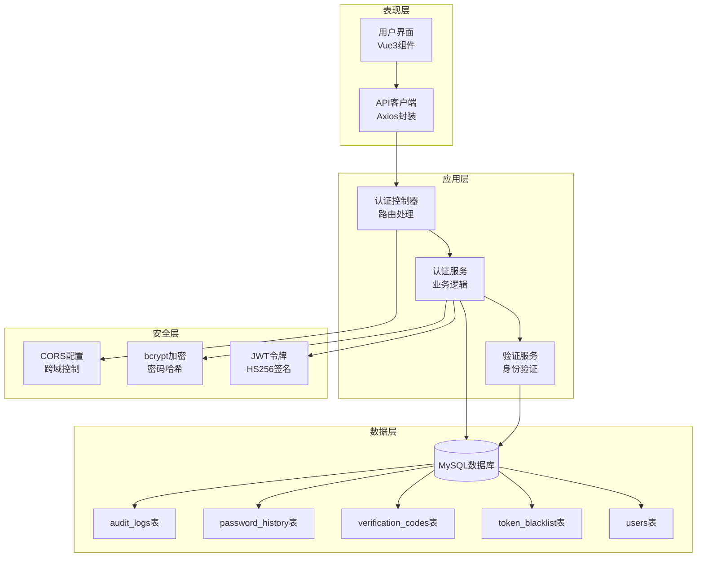
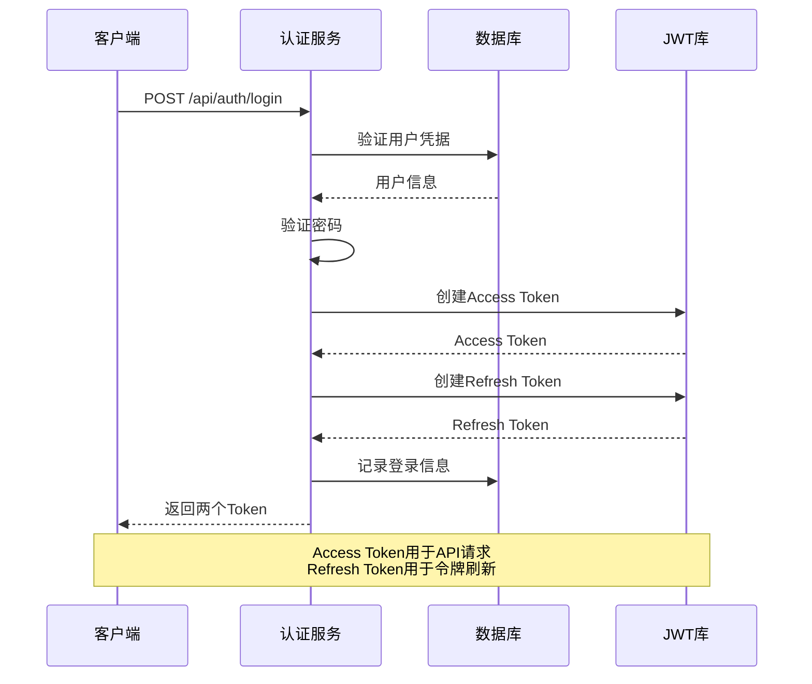
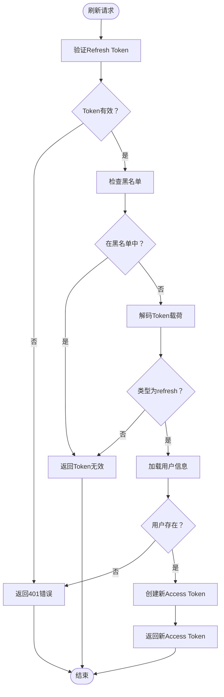
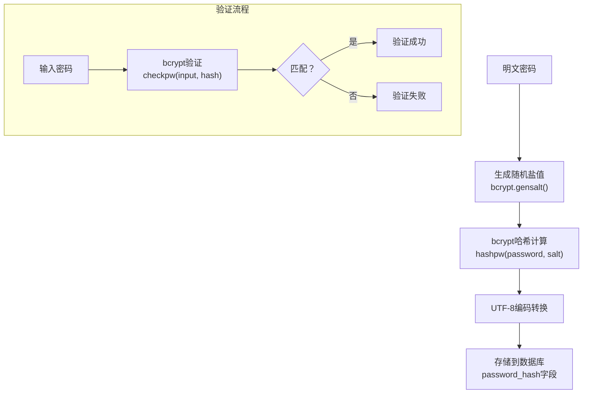
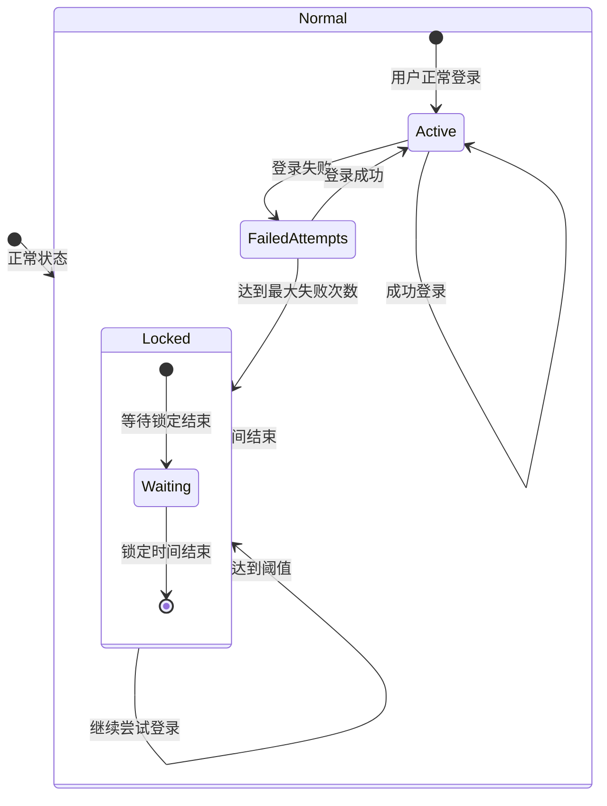
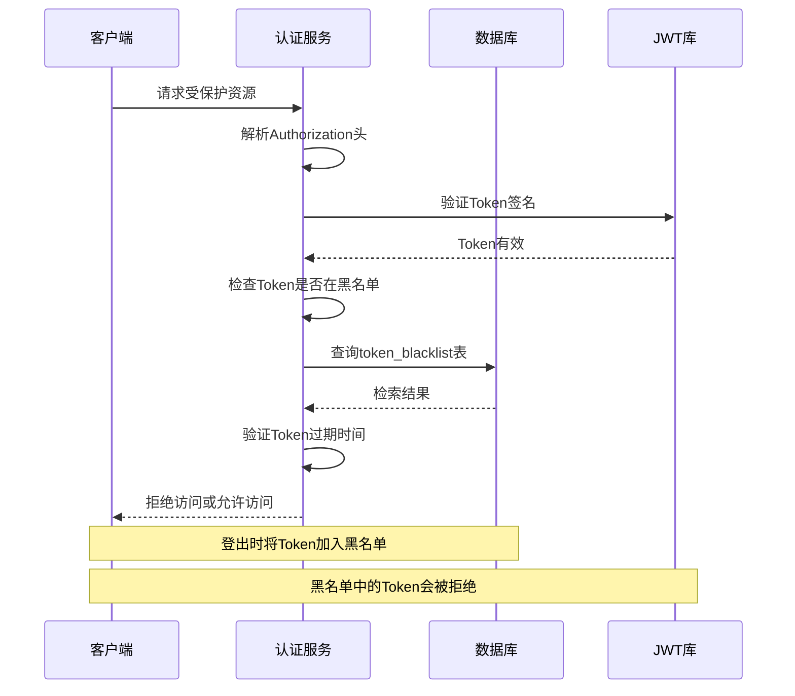
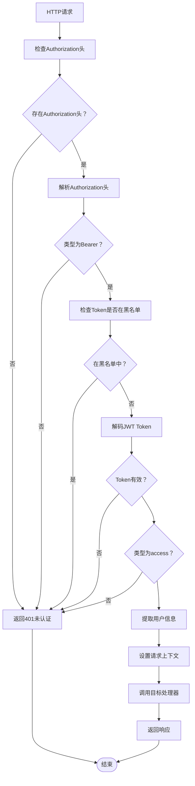
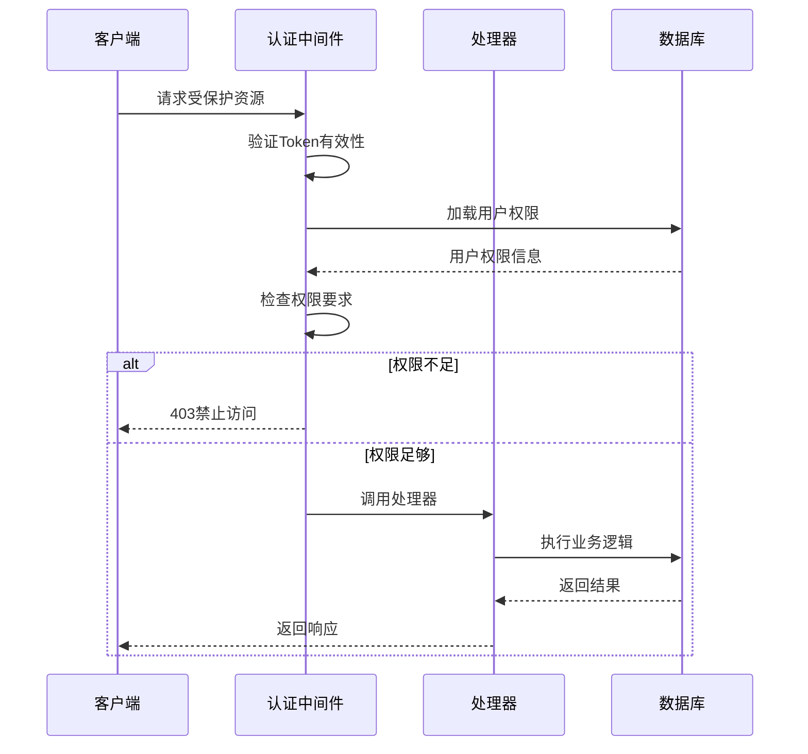
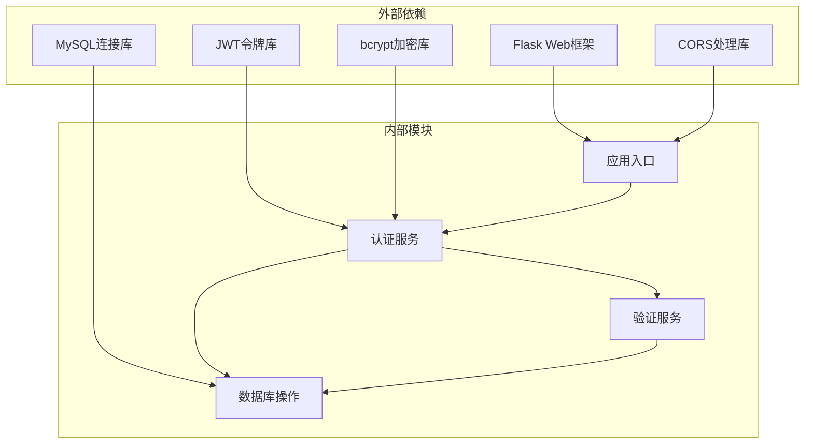

# 认证系统架构

<cite>
**本文档引用的文件**
- [app.py](file://python/app.py)
- [auth_server.py](file://python/auth_server.py)
- [auth_service.py](file://python/src/auth_service.py)
- [notification_db.py](file://python/src/notification_db.py)
- [verification_service.py](file://python/src/notifications/verification_service.py)
- [models.py](file://python/src/models.py)
- [utils.py](file://python/src/utils.py)
- [requirements.txt](file://python/requirements.txt)
- [PROJECT_README.md](file://PROJECT_README.md)
</cite>

## 目录
1. [简介](#简介)
2. [项目结构](#项目结构)
3. [核心组件](#核心组件)
4. [架构概览](#架构概览)
5. [详细组件分析](#详细组件分析)
6. [依赖关系分析](#依赖关系分析)
7. [性能考虑](#性能考虑)
8. [故障排除指南](#故障排除指南)
9. [结论](#结论)

## 简介

本认证系统是一个基于Python Flask和Vue3的可视化爬虫管理系统的核心组件，提供了完整的用户认证、授权和安全控制功能。系统采用JWT令牌管理、bcrypt密码加密和会话控制机制，实现了从用户注册到登录认证、Token刷新和黑名单管理的完整安全流程。

该系统支持用户名/邮箱双重登录方式，具备登录失败次数限制、账户锁定机制、密码历史记录防重用等功能，为爬虫管理系统的各种业务场景提供了可靠的安全保障。

## 项目结构

认证系统采用模块化设计，主要分为以下几个核心模块：

**图表来源**
- [app.py:1-50](file://python/app.py#L1-L50)
- [auth_server.py:1-20](file://python/auth_server.py#L1-L20)
- [auth_service.py:1-20](file://python/src/auth_service.py#L1-L20)

**章节来源**
- [PROJECT_README.md:63-97](file://PROJECT_README.md#L63-L97)
- [requirements.txt:1-14](file://python/requirements.txt#L1-L14)

## 核心组件

### 认证服务层

认证服务是系统的核心组件，负责处理所有认证相关的业务逻辑：

- **JWT令牌管理**：生成Access Token和Refresh Token，设置过期时间和签名算法
- **密码加密存储**：使用bcrypt进行密码哈希，确保密码安全存储
- **会话控制**：实现登录状态管理、Token黑名单和用户锁定机制
- **权限验证**：提供装饰器实现路由级别的权限控制

### 数据访问层

数据库操作层封装了所有数据持久化逻辑：

- **用户管理**：用户注册、登录、密码更新等核心功能
- **Token管理**：Token黑名单维护、过期时间管理
- **审计日志**：完整的用户行为追踪和安全审计
- **验证码管理**：忘记密码流程中的验证码发送和验证

### 验证服务层

专门处理用户身份验证和安全验证：

- **多渠道验证**：支持邮箱和短信两种验证方式
- **验证码生命周期管理**：自动过期和使用状态跟踪
- **临时用户处理**：为未注册用户提供临时账户支持

**章节来源**
- [auth_service.py:9-187](file://python/src/auth_service.py#L9-L187)
- [notification_db.py:6-357](file://python/src/notification_db.py#L6-L357)
- [verification_service.py:7-108](file://python/src/notifications/verification_service.py#L7-L108)

## 架构概览

认证系统采用分层架构设计，确保了良好的可维护性和扩展性：

**图表来源**
- [app.py:53-240](file://python/app.py#L53-L240)
- [auth_service.py:27-66](file://python/src/auth_service.py#L27-L66)
- [notification_db.py:44-103](file://python/src/notification_db.py#L44-L103)

## 详细组件分析

### JWT令牌管理系统

系统采用双令牌机制，提供灵活且安全的身份验证解决方案：

#### 令牌类型和配置

| 令牌类型 | 过期时间 | 用途 | 安全特性 |
|---------|---------|------|----------|
| Access Token | 30分钟 | API访问认证 | 短生命周期，频繁刷新 |
| Refresh Token | 7天 | Access Token刷新 | 长生命周期，严格验证 |

#### 令牌生成流程

**图表来源**
- [auth_service.py:76-118](file://python/src/auth_service.py#L76-L118)
- [auth_service.py:27-45](file://python/src/auth_service.py#L27-L45)

#### Token刷新策略

**图表来源**
- [auth_service.py:120-136](file://python/src/auth_service.py#L120-L136)
- [auth_service.py:58-66](file://python/src/auth_service.py#L58-L66)

**章节来源**
- [auth_service.py:9-16](file://python/src/auth_service.py#L9-L16)
- [auth_service.py:27-45](file://python/src/auth_service.py#L27-L45)

### 密码加密存储机制

系统采用bcrypt算法进行密码哈希存储，确保密码的绝对安全：

#### 密码哈希流程

**图表来源**
- [auth_service.py:20-25](file://python/src/auth_service.py#L20-L25)

#### 密码安全特性

- **随机盐值**：每次哈希都生成唯一的盐值，防止彩虹表攻击
- **自适应成本因子**：bcrypt自动调整计算复杂度，适应硬件升级
- **不可逆性**：无法从哈希值推导原始密码
- **密码历史检查**：防止用户重复使用最近使用过的密码

**章节来源**
- [auth_service.py:20-25](file://python/src/auth_service.py#L20-L25)
- [auth_service.py:138-156](file://python/src/auth_service.py#L138-L156)

### 会话控制和用户锁定机制

系统实现了多层次的会话控制和安全防护：

#### 登录安全策略

**图表来源**
- [auth_service.py:67-97](file://python/src/auth_service.py#L67-L97)

#### 用户锁定机制

| 参数 | 值 | 说明 |
|------|-----|------|
| 最大登录失败次数 | 5次 | 防止暴力破解 |
| 账户锁定时长 | 15分钟 | 平衡安全性和用户体验 |
| 登录尝试重置 | 成功登录后重置 | 防止误锁定 |
| 锁定状态检查 | 每次登录前检查 | 实时生效 |

**章节来源**
- [auth_service.py:67-97](file://python/src/auth_service.py#L67-L97)
- [notification_db.py:261-286](file://python/src/notification_db.py#L261-L286)

### Token黑名单管理

黑名单机制是防止已泄露Token继续使用的最后一道防线：

#### 黑名单工作原理

**图表来源**
- [auth_service.py:158-183](file://python/src/auth_service.py#L158-L183)
- [notification_db.py:297-311](file://python/src/notification_db.py#L297-L311)

#### 黑名单维护策略

- **实时检查**：每次请求都检查Token是否在黑名单中
- **过期清理**：定期清理过期的黑名单记录
- **内存优化**：只缓存活跃的黑名单条目
- **原子操作**：加入黑名单时保证原子性

**章节来源**
- [auth_service.py:58-66](file://python/src/auth_service.py#L58-L66)
- [notification_db.py:297-311](file://python/src/notification_db.py#L297-L311)

### 审计日志和用户行为监控

系统提供了完整的审计日志功能，记录所有重要的安全相关事件：

#### 审计日志表结构

| 字段名 | 类型 | 说明 |
|--------|------|------|
| id | INT | 主键，自增 |
| user_id | INT | 用户ID（可为空） |
| action | VARCHAR(50) | 操作类型 |
| ip_address | VARCHAR(50) | IP地址 |
| user_agent | VARCHAR(255) | 用户代理 |
| details | TEXT | 详细信息 |
| created_at | DATETIME | 创建时间 |

#### 审计日志覆盖范围

- **用户注册**：记录注册时间、IP地址、User-Agent
- **用户登录**：记录登录时间、IP地址、登录结果
- **密码变更**：记录密码修改时间、IP地址
- **Token刷新**：记录刷新时间、旧Token信息
- **用户登出**：记录登出时间、IP地址

**章节来源**
- [notification_db.py:334-342](file://python/src/notification_db.py#L334-L342)
- [app.py:85-91](file://python/app.py#L85-L91)
- [app.py:112-118](file://python/app.py#L112-L118)

### 认证中间件实现

系统使用Flask装饰器实现认证中间件，提供透明的权限控制：

#### 认证装饰器工作流程

**图表来源**
- [auth_service.py:158-183](file://python/src/auth_service.py#L158-L183)

#### 中间件配置特性

- **自动解析**：自动解析Authorization头格式
- **类型验证**：确保使用正确的Token类型
- **上下文注入**：将用户信息注入到请求对象
- **异常处理**：统一处理认证相关的异常情况

**章节来源**
- [auth_service.py:158-183](file://python/src/auth_service.py#L158-L183)

### 权限验证机制

系统实现了基于角色的权限控制，支持不同级别的访问权限：

#### 权限控制层次

| 权限级别 | 访问范围 | 典型操作 |
|----------|----------|----------|
| 匿名用户 | 注册、登录、忘记密码 | 用户注册、验证码发送 |
| 普通用户 | 个人信息、基本操作 | 获取资料、修改密码 |
| 管理员 | 系统管理、特殊权限 | 用户管理、系统配置 |

#### 权限验证流程

**图表来源**
- [auth_service.py:158-183](file://python/src/auth_service.py#L158-L183)

### 安全防护措施

系统实施了多层次的安全防护措施：

#### CORS配置

系统配置了严格的跨域资源共享策略：

- **白名单域名**：仅允许指定的开发和生产域名
- **允许的方法**：GET、POST、PUT、DELETE、OPTIONS
- **允许的头部**：Content-Type、Authorization
- **凭证支持**：支持携带Cookie和认证头

#### 输入验证和清理

- **用户名验证**：至少3个字符，字母数字组合
- **密码强度**：至少6个字符，支持复杂度检测
- **邮箱格式**：标准邮箱格式验证
- **手机号验证**：中国手机号格式验证

#### 错误处理和日志

- **统一错误响应**：标准化的错误格式和错误码
- **敏感信息过滤**：不泄露具体的认证细节
- **审计日志**：记录所有安全相关事件
- **异常监控**：捕获和处理各种异常情况

**章节来源**
- [app.py:19-28](file://python/app.py#L19-L28)
- [app.py:37-44](file://python/app.py#L37-L44)

## 依赖关系分析

认证系统的依赖关系清晰明确，遵循了单一职责原则：

**图表来源**
- [requirements.txt:1-14](file://python/requirements.txt#L1-L14)
- [auth_service.py:1-7](file://python/src/auth_service.py#L1-L7)

### 关键依赖特性

- **Flask**：提供Web框架基础，支持路由、中间件和请求处理
- **PyJWT**：实现JWT标准，支持签名验证和载荷解析
- **bcrypt**：提供安全的密码哈希算法，自动处理盐值生成
- **PyMySQL**：MySQL数据库驱动，支持连接池和事务处理
- **Flask-CORS**：跨域资源共享处理，确保前后端通信安全

**章节来源**
- [requirements.txt:1-14](file://python/requirements.txt#L1-L14)

## 性能考虑

### Token管理性能优化

- **内存缓存**：热点用户信息缓存，减少数据库查询
- **批量操作**：批量处理Token黑名单更新
- **异步处理**：审计日志异步写入，不影响主流程性能
- **连接池**：数据库连接池复用，减少连接开销

### 数据库性能优化

- **索引优化**：在常用查询字段上建立索引
- **查询优化**：使用参数化查询，防止SQL注入
- **事务管理**：合理使用事务，保证数据一致性
- **连接管理**：连接池配置，避免连接泄漏

### 安全性能平衡

- **哈希成本**：bcrypt成本因子平衡安全性与性能
- **缓存策略**：合理缓存用户信息，减少重复验证
- **超时设置**：合理的超时设置，平衡安全性和响应速度
- **并发控制**：登录失败次数限制，防止DDoS攻击

## 故障排除指南

### 常见认证问题

#### Token相关问题

**问题**：Token过期导致API调用失败
**解决**：调用刷新接口获取新的Access Token
**预防**：实现自动刷新机制，避免用户感知

**问题**：Token被拒绝访问
**解决**：检查Token是否在黑名单中，重新登录获取新Token
**预防**：及时处理登出操作，确保Token正确失效

#### 密码相关问题

**问题**：密码验证失败
**解决**：检查密码强度，确认大小写和特殊字符
**预防**：实现密码强度检测和提示

**问题**：忘记密码流程异常
**解决**：检查验证码服务配置，确认发送渠道可用
**预防**：实现验证码过期处理和重新发送机制

#### 数据库连接问题

**问题**：数据库连接失败
**解决**：检查数据库配置，确认服务正常运行
**预防**：实现连接池和自动重连机制

**章节来源**
- [auth_service.py:47-56](file://python/src/auth_service.py#L47-L56)
- [notification_db.py:28-39](file://python/src/notification_db.py#L28-L39)

### 调试和监控

#### 日志配置

系统提供了完善的日志记录机制：

- **错误日志**：记录认证过程中的异常情况
- **审计日志**：记录所有安全相关操作
- **性能日志**：记录关键操作的执行时间
- **调试日志**：开发阶段的详细调试信息

#### 监控指标

- **认证成功率**：统计认证请求的成功率
- **Token使用量**：监控Token的生成和使用情况
- **数据库性能**：监控数据库查询响应时间
- **系统健康**：监控服务的可用性和响应时间

## 结论

本认证系统通过精心设计的架构和全面的安全措施，为爬虫管理系统提供了可靠的用户认证和授权服务。系统采用了业界标准的安全实践，包括JWT令牌管理、bcrypt密码加密、会话控制和审计日志等核心功能。

### 主要优势

1. **安全性高**：多重安全防护措施，有效防止常见的安全威胁
2. **可扩展性强**：模块化设计，便于功能扩展和定制
3. **易维护**：清晰的代码结构和完善的文档
4. **性能优秀**：合理的性能优化策略，满足生产环境需求

### 改进建议

1. **密钥管理**：生产环境中使用环境变量管理密钥
2. **监控告警**：集成更完善的监控和告警系统
3. **多因素认证**：考虑集成短信或邮箱的二次验证
4. **权限细化**：实现更细粒度的权限控制机制

该认证系统为爬虫管理系统的各种业务场景提供了坚实的安全基础，确保了用户数据和系统资源的安全性。