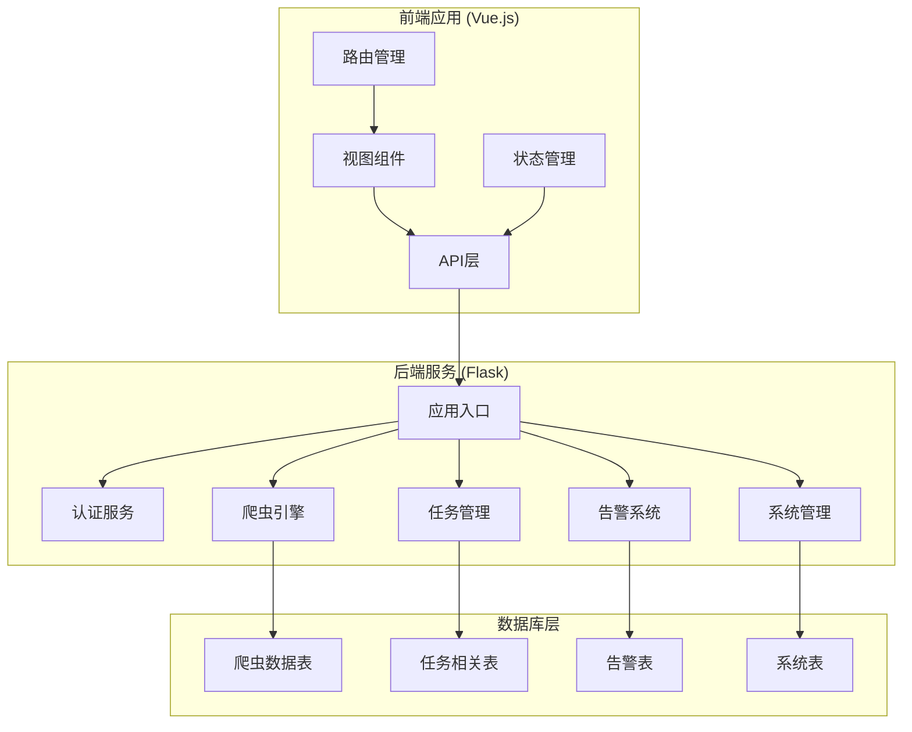
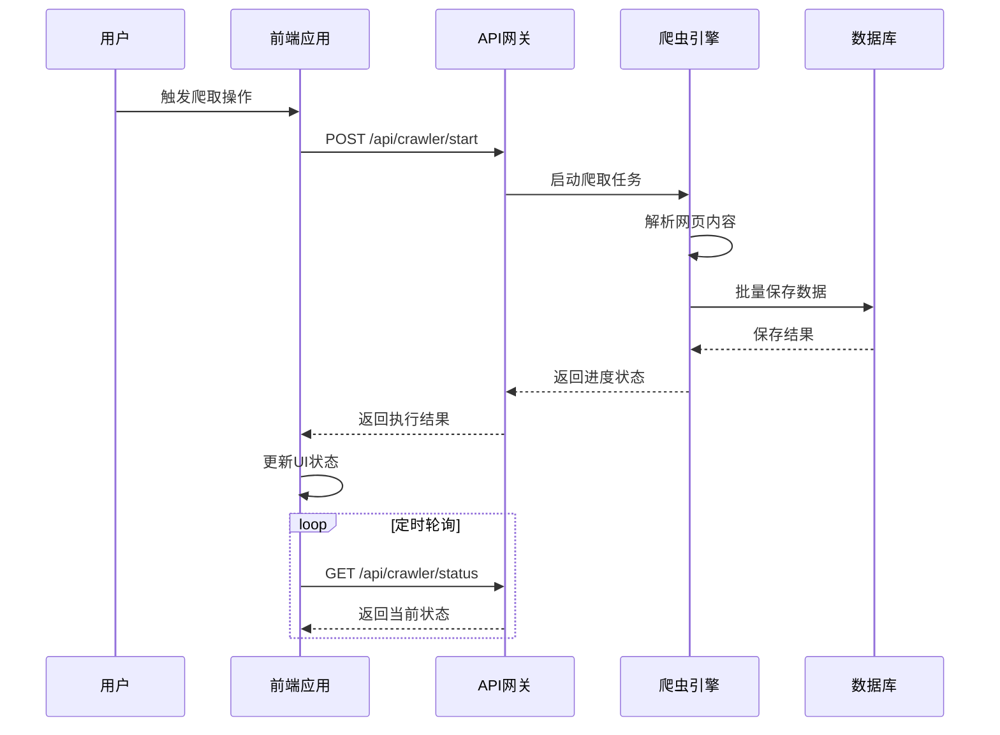
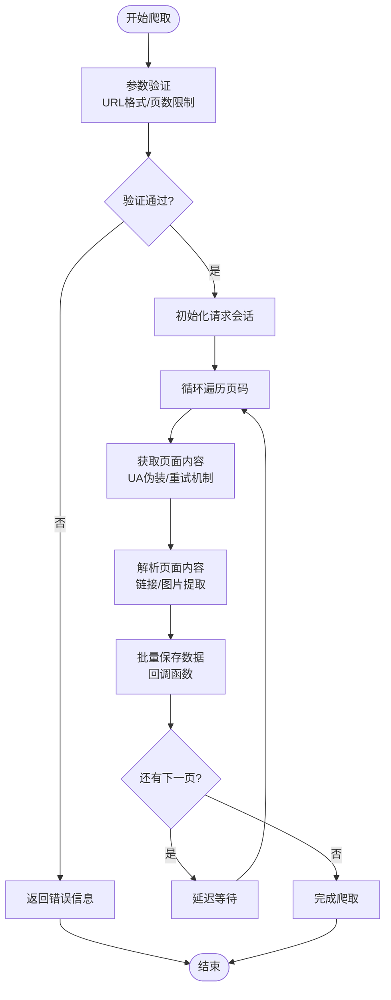
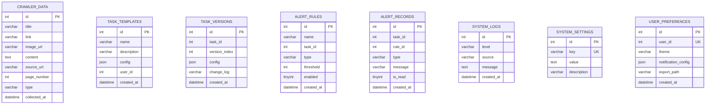
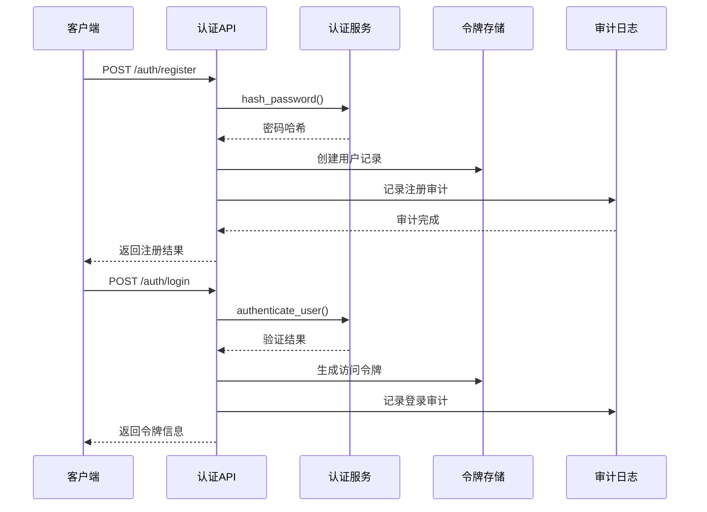
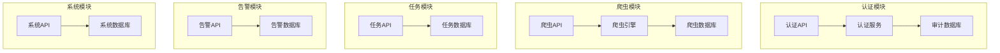
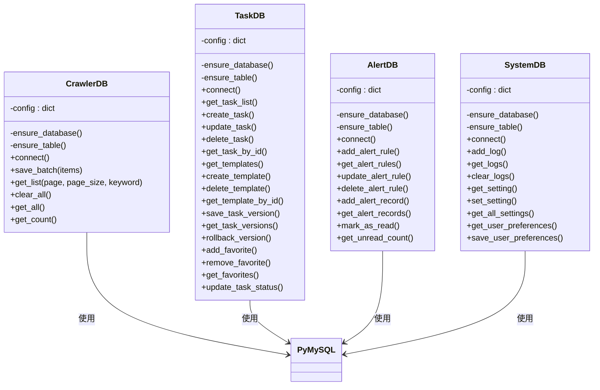
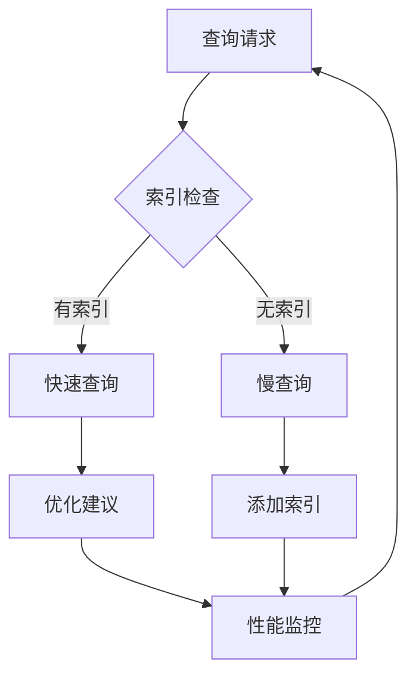
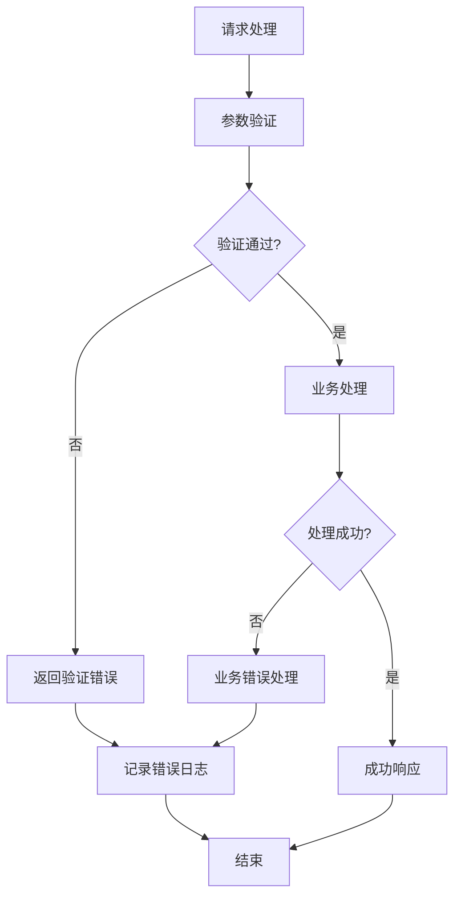

# 数据流设计

<cite>
**本文档引用的文件**
- [app.py](file://python/app.py)
- [main.py](file://python/main.py)
- [crawler_engine.py](file://python/crawler_engine.py)
- [crawler_db.py](file://python/crawler_db.py)
- [task_db.py](file://python/task_db.py)
- [alert_db.py](file://python/alert_db.py)
- [system_db.py](file://python/system_db.py)
- [index.js](file://python-web/src/api/index.js)
- [crawler.js](file://python-web/src/api/crawler.js)
- [Crawler.vue](file://python-web/src/views/Crawler.vue)
- [models.py](file://python/src/models.py)
</cite>

## 目录
1. [简介](#简介)
2. [项目结构](#项目结构)
3. [核心组件](#核心组件)
4. [架构概览](#架构概览)
5. [详细组件分析](#详细组件分析)
6. [依赖关系分析](#依赖关系分析)
7. [性能考虑](#性能考虑)
8. [故障排除指南](#故障排除指南)
9. [结论](#结论)
10. [附录](#附录)

## 简介

本数据流设计文档详细说明了系统中数据的完整流转过程，从前端用户操作到后端API处理再到数据库存储的全过程。系统采用前后端分离架构，前端使用Vue.js + Element Plus构建，后端基于Flask提供RESTful API服务。

系统主要功能包括：
- 用户认证与授权
- 爬虫任务管理
- 数据采集与存储
- 任务调度与监控
- 告警通知机制
- 系统日志与配置管理

## 项目结构

系统采用模块化设计，分为Python后端服务和Vue.js前端应用两大模块：



**图表来源**
- [app.py:18-35](file://python/app.py#L18-L35)
- [index.js:3-9](file://python-web/src/api/index.js#L3-L9)

**章节来源**
- [app.py:18-35](file://python/app.py#L18-L35)
- [index.js:3-9](file://python-web/src/api/index.js#L3-L9)

## 核心组件

### 前端组件架构

前端采用Vue.js 3 + Pinia状态管理，主要组件包括：

- **API层**：封装Axios实例，处理认证拦截器和错误处理
- **视图组件**：负责用户界面展示和交互逻辑
- **状态管理**：使用Pinia管理应用状态
- **路由管理**：Element Plus路由导航

### 后端服务架构

后端基于Flask框架，采用模块化设计：

- **应用入口**：初始化Flask应用和CORS配置
- **认证服务**：处理用户注册、登录、令牌管理
- **爬虫引擎**：多线程爬取、数据解析、存储回调
- **数据库层**：PyMySQL连接管理，数据表操作

**章节来源**
- [Crawler.vue:221-462](file://python-web/src/views/Crawler.vue#L221-L462)
- [app.py:53-167](file://python/app.py#L53-L167)

## 架构概览

系统采用分层架构设计，确保数据流的清晰性和可维护性：



**图表来源**
- [crawler.js:4-21](file://python-web/src/api/crawler.js#L4-L21)
- [app.py:306-380](file://python/app.py#L306-L380)
- [crawler_engine.py:464-497](file://python/crawler_engine.py#L464-L497)

## 详细组件分析

### 爬虫数据流

#### 数据采集流程



**图表来源**
- [crawler_engine.py:400-463](file://python/crawler_engine.py#L400-L463)
- [crawler_engine.py:171-398](file://python/crawler_engine.py#L171-L398)

#### 数据存储策略

爬虫数据采用批量插入策略，确保数据完整性：



**图表来源**
- [crawler_db.py:54-81](file://python/crawler_db.py#L54-L81)
- [task_db.py:51-111](file://python/task_db.py#L51-L111)
- [alert_db.py:50-81](file://python/alert_db.py#L50-L81)
- [system_db.py:51-87](file://python/system_db.py#L51-L87)

**章节来源**
- [crawler_engine.py:10-63](file://python/crawler_engine.py#L10-L63)
- [crawler_db.py:96-139](file://python/crawler_db.py#L96-L139)

### 认证与授权数据流



**图表来源**
- [app.py:53-123](file://python/app.py#L53-L123)
- [app.py:85-91](file://python/app.py#L85-L91)

**章节来源**
- [app.py:53-123](file://python/app.py#L53-L123)

### 前端数据流

前端采用响应式数据绑定和状态管理：


**图表来源**
- [Crawler.vue:334-462](file://python-web/src/views/Crawler.vue#L334-L462)
- [index.js:11-59](file://python-web/src/api/index.js#L11-L59)

**章节来源**
- [Crawler.vue:334-462](file://python-web/src/views/Crawler.vue#L334-L462)
- [index.js:11-59](file://python-web/src/api/index.js#L11-L59)

## 依赖关系分析

### 组件耦合度分析

系统采用松耦合设计，各模块间通过明确的接口进行通信：



**图表来源**
- [app.py:3-12](file://python/app.py#L3-L12)
- [crawler_engine.py:10-63](file://python/crawler_engine.py#L10-L63)

### 数据库连接管理



**图表来源**
- [crawler_db.py:6-94](file://python/crawler_db.py#L6-L94)
- [task_db.py:7-121](file://python/task_db.py#L7-L121)
- [alert_db.py:6-91](file://python/alert_db.py#L6-L91)
- [system_db.py:7-97](file://python/system_db.py#L7-L97)

**章节来源**
- [crawler_db.py:6-94](file://python/crawler_db.py#L6-L94)
- [task_db.py:7-121](file://python/task_db.py#L7-L121)

## 性能考虑

### 爬取性能优化

系统在爬取过程中采用了多项性能优化措施：

1. **多线程并发**：爬虫引擎使用独立线程执行，避免阻塞主线程
2. **智能延时**：可配置的请求间隔，模拟人工浏览行为
3. **批量存储**：采用批量插入减少数据库连接开销
4. **去重机制**：URL去重避免重复数据存储

### 数据库性能优化



**图表来源**
- [crawler_db.py:65-68](file://python/crawler_db.py#L65-L68)
- [task_db.py:67-70](file://python/task_db.py#L67-L70)
- [alert_db.py:59-61](file://python/alert_db.py#L59-L61)

### 缓存策略

系统采用多层次缓存策略：

1. **前端缓存**：Vue响应式数据缓存
2. **令牌缓存**：本地存储访问令牌和刷新令牌
3. **会话缓存**：Flask会话管理用户状态

**章节来源**
- [index.js:11-59](file://python-web/src/api/index.js#L11-L59)
- [Crawler.vue:242-249](file://python-web/src/views/Crawler.vue#L242-L249)

## 故障排除指南

### 常见错误处理

系统实现了完善的错误处理机制：



**图表来源**
- [app.py:316-341](file://python/app.py#L316-L341)
- [crawler_engine.py:426-429](file://python/crawler_engine.py#L426-L429)

### 错误码定义

系统采用统一的错误码规范：

| 错误码 | 描述 | 状态码 |
|--------|------|--------|
| INVALID_USERNAME | 用户名无效 | 400 |
| INVALID_PASSWORD | 密码无效 | 400 |
| USERNAME_EXISTS | 用户名已存在 | 400 |
| EMAIL_EXISTS | 邮箱已被注册 | 400 |
| PHONE_EXISTS | 手机号已被注册 | 400 |
| MISSING_URL | 缺少目标网址 | 400 |
| INVALID_URL | 无效的网址格式 | 400 |
| INVALID_PAGES | 无效的页数范围 | 400 |
| INVALID_INTERVAL | 无效的请求间隔 | 400 |

**章节来源**
- [app.py:316-341](file://python/app.py#L316-L341)
- [app.py:407-410](file://python/app.py#L407-L410)

## 结论

本数据流设计文档全面阐述了系统的数据流转机制，包括：

1. **完整的数据路径**：从前端用户操作到后端处理再到数据库存储的全流程
2. **可靠的错误处理**：统一的错误码规范和异常处理机制
3. **高效的性能优化**：多线程爬取、批量存储、索引优化等策略
4. **安全的认证机制**：JWT令牌管理和审计日志记录
5. **可扩展的架构设计**：模块化组件和清晰的接口定义

系统通过合理的架构设计和优化策略，能够高效地处理大规模数据采集和存储需求，同时保证系统的稳定性和可维护性。

## 附录

### API请求响应格式

#### 认证相关API

**注册请求**
```json
{
  "username": "string",
  "email": "string",
  "phone": "string", 
  "password": "string"
}
```

**注册响应**
```json
{
  "success": true,
  "message": "string",
  "data": {
    "user_id": "string"
  }
}
```

#### 爬虫相关API

**启动爬取请求**
```json
{
  "target_url": "string",
  "total_pages": "integer",
  "interval_seconds": "number",
  "crawl_mode": "string"
}
```

**爬取状态响应**
```json
{
  "status": "string",
  "collected_count": "integer",
  "current_page": "integer", 
  "total_pages": "integer",
  "elapsed_seconds": "integer",
  "error_message": "string"
}
```

**章节来源**
- [app.py:53-123](file://python/app.py#L53-L123)
- [app.py:306-380](file://python/app.py#L306-L380)